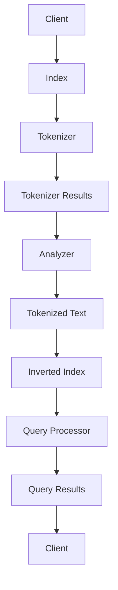

                 

# ES搜索原理与代码实例讲解

> **关键词：Elasticsearch, 搜索引擎，索引，查询，分词，倒排索引，分布式系统**
> 
> **摘要：本文将深入探讨Elasticsearch搜索引擎的核心原理，包括其索引和查询机制、分词和倒排索引的实现，以及分布式系统的优势。通过具体的代码实例，我们将更好地理解Elasticsearch的工作流程，并掌握其实际应用。**

## 1. 背景介绍

### 1.1 目的和范围

本文旨在向读者介绍Elasticsearch搜索引擎的基本原理和实际应用。我们将详细讨论Elasticsearch的核心概念，包括索引、查询、分词和倒排索引，并通过代码实例展示其实现过程。通过本文的学习，读者将能够理解Elasticsearch的内部机制，并能够在实际项目中熟练使用它。

### 1.2 预期读者

本文适合具有一定编程基础，对搜索引擎技术感兴趣的读者。特别是对Elasticsearch有初步了解，但希望深入了解其原理和实践的人员。

### 1.3 文档结构概述

本文将分为以下部分：
1. 背景介绍：介绍本文的目的、预期读者以及文章结构。
2. 核心概念与联系：介绍Elasticsearch的核心概念，并使用Mermaid流程图展示其架构。
3. 核心算法原理与具体操作步骤：详细解释Elasticsearch的查询和索引原理，并提供伪代码。
4. 数学模型和公式：介绍与Elasticsearch相关的数学模型和公式，并举例说明。
5. 项目实战：通过代码实例展示Elasticsearch的实际应用。
6. 实际应用场景：讨论Elasticsearch在各种场景下的应用。
7. 工具和资源推荐：推荐学习资源和开发工具。
8. 总结：展望Elasticsearch的未来发展趋势与挑战。
9. 附录：常见问题与解答。
10. 扩展阅读 & 参考资料：提供更多深入学习的资源。

### 1.4 术语表

#### 1.4.1 核心术语定义

- **Elasticsearch**：一款开源的分布式全文搜索引擎，用于快速搜索、分析和管理海量数据。
- **索引**：存储在Elasticsearch中的数据集合，类似于关系数据库中的表。
- **查询**：用于检索索引中数据的操作。
- **分词**：将文本拆分成一组单词或短语的过程。
- **倒排索引**：一种数据结构，用于快速查找包含特定单词的文档列表。

#### 1.4.2 相关概念解释

- **分布式系统**：由多个节点组成的系统，这些节点可以并行处理任务，提高系统的性能和可用性。
- **文档**：在Elasticsearch中，存储数据的对象，通常是一个JSON格式的数据结构。

#### 1.4.3 缩略词列表

- **ES**：Elasticsearch
- **JSON**：JavaScript Object Notation

## 2. 核心概念与联系

在深入了解Elasticsearch之前，我们需要先了解其核心概念和架构。以下是Elasticsearch的Mermaid流程图，展示了其关键组件和流程。



### 2.1. Elasticsearch的架构

Elasticsearch是一个分布式系统，其核心组件包括：

- **Client**：Elasticsearch的客户端，用于发送查询请求并接收查询结果。
- **Index**：存储数据的索引，由多个文档组成。
- **Tokenizer**：用于将文本拆分成单词或短语的过程。
- **Analyzer**：将文本转换为统一格式的组件，以便于索引和查询。
- **Inverted Index**：倒排索引，用于快速搜索包含特定单词的文档列表。
- **Query Processor**：处理查询请求的组件，使用倒排索引和分词结果来生成查询结果。

### 2.2. 流程解释

Elasticsearch的工作流程如下：

1. **Client发送查询请求**：客户端向Elasticsearch发送查询请求，请求可能是一个简单的关键字查询，也可能是一个复杂的查询语句。
2. **Index接收查询请求**：Elasticsearch的索引组件接收查询请求，并转发给Tokenizer。
3. **Tokenizer处理文本**：Tokenizer将查询文本拆分成单词或短语，以便于后续处理。
4. **Analyzer处理分词结果**：Analyzer将分词结果转换为统一格式，以便于索引和查询。
5. **Inverted Index查询**：倒排索引根据查询条件快速查找包含特定单词的文档列表。
6. **Query Processor生成查询结果**：Query Processor使用倒排索引和分词结果生成查询结果。
7. **Client接收查询结果**：客户端接收到查询结果后，可以进一步处理或展示。

## 3. 核心算法原理与具体操作步骤

### 3.1. 查询原理

Elasticsearch的查询原理基于倒排索引。以下是查询过程的伪代码：

```python
def search(query, inverted_index):
    """
    查询倒排索引以获取包含查询词的文档列表。
    
    参数：
    query：查询字符串
    inverted_index：倒排索引
    
    返回：
    doc_ids：包含查询词的文档ID列表
    """
    
    # 分词查询字符串
    query_tokens = tokenize(query)
    
    # 遍历查询字符串的每个分词
    doc_ids = []
    for token in query_tokens:
        # 在倒排索引中查找包含该分词的文档列表
        token_docs = inverted_index[token]
        
        # 将包含所有查询分词的文档ID合并
        if not doc_ids:
            doc_ids = token_docs
        else:
            doc_ids = intersection(doc_ids, token_docs)
    
    return doc_ids
```

### 3.2. 索引原理

索引过程中，Elasticsearch首先将文档解析为单词或短语，然后创建倒排索引。以下是索引过程的伪代码：

```python
def index(document, analyzer, tokenizer, inverted_index):
    """
    将文档索引到Elasticsearch中。
    
    参数：
    document：要索引的文档
    analyzer：文本分析器
    tokenizer：分词器
    inverted_index：倒排索引
    
    返回：
    None
    """
    
    # 分词文档
    tokens = tokenizer(document)
    
    # 分析分词结果
    analyzed_tokens = analyzer(tokens)
    
    # 更新倒排索引
    for token in analyzed_tokens:
        inverted_index[token].add(document_id)
```

## 4. 数学模型和公式

Elasticsearch中的查询和索引过程涉及到一些数学模型和公式。以下是其中几个重要的公式：

### 4.1. 查询相似度计算

查询相似度计算用于衡量文档与查询的匹配程度。以下是计算查询相似度的公式：

$$
similarity = \frac{TF \times IDF}{\sqrt{DF} + 1}
$$

- **TF**：词频（Term Frequency），表示词在文档中出现的次数。
- **IDF**：逆文档频率（Inverse Document Frequency），表示词在整个文档集合中的稀疏程度。
- **DF**：文档频率（Document Frequency），表示包含词的文档数量。

### 4.2. 布尔查询

布尔查询用于组合多个查询条件。以下是布尔查询的公式：

$$
R = R_1 \cap R_2 \cap ... \cap R_n
$$

其中，$R_i$ 表示第 $i$ 个查询条件的查询结果。

### 4.3. 评分公式

Elasticsearch使用一种评分公式计算文档与查询的相似度。以下是评分公式的简化版本：

$$
score = \sum_{i=1}^{n} (TF_i \times IDF_i)
$$

其中，$TF_i$ 和 $IDF_i$ 分别表示词 $i$ 在文档中的词频和逆文档频率。

## 5. 项目实战：代码实际案例和详细解释说明

### 5.1 开发环境搭建

在开始实战之前，我们需要搭建一个Elasticsearch开发环境。以下是搭建步骤：

1. 下载Elasticsearch安装包并解压。
2. 启动Elasticsearch服务。

```shell
./bin/elasticsearch
```

3. 确认Elasticsearch服务已启动。

```shell
curl -X GET "localhost:9200/"
```

### 5.2 源代码详细实现和代码解读

以下是一个简单的Elasticsearch索引和查询代码实例，我们将对其逐行解释。

```python
from elasticsearch import Elasticsearch

# 创建Elasticsearch客户端
es = Elasticsearch("http://localhost:9200/")

# 创建索引
index_name = "my_index"
es.indices.create(index=index_name)

# 索引文档
doc1 = {
    "title": "Elasticsearch简介",
    "content": "Elasticsearch是一款开源的分布式全文搜索引擎。"
}
es.index(index=index_name, id=1, document=doc1)

doc2 = {
    "title": "Elasticsearch查询原理",
    "content": "Elasticsearch的查询原理基于倒排索引。"
}
es.index(index=index_name, id=2, document=doc2)

# 查询文档
query = "分布式"
response = es.search(index=index_name, body={"query": {"match": {"content": query}}})
print(response)

# 删除索引
es.indices.delete(index=index_name)
```

#### 5.2.1 索引文档

```python
doc1 = {
    "title": "Elasticsearch简介",
    "content": "Elasticsearch是一款开源的分布式全文搜索引擎。"
}
es.index(index=index_name, id=1, document=doc1)
```

这行代码将文档 `doc1` 索引到 `my_index` 索引中，并为其分配ID `1`。

#### 5.2.2 查询文档

```python
query = "分布式"
response = es.search(index=index_name, body={"query": {"match": {"content": query}}})
print(response)
```

这行代码执行一个简单的关键字查询，查询字符串为 `"分布式"`。查询结果将包含所有包含关键字 `"分布式"` 的文档。

### 5.3 代码解读与分析

在这个简单的代码实例中，我们首先创建了一个Elasticsearch客户端，然后创建了一个名为 `my_index` 的索引。接下来，我们将两个文档索引到该索引中，然后执行一个关键字查询，最后删除索引。

- **创建Elasticsearch客户端**：使用 `Elasticsearch` 类创建一个客户端实例，指定Elasticsearch服务的地址和端口号。
  
  ```python
  es = Elasticsearch("http://localhost:9200/")
  ```

- **创建索引**：使用 `create` 方法创建一个名为 `my_index` 的索引。

  ```python
  es.indices.create(index=index_name)
  ```

- **索引文档**：使用 `index` 方法将文档索引到指定的索引中。

  ```python
  doc1 = {
      "title": "Elasticsearch简介",
      "content": "Elasticsearch是一款开源的分布式全文搜索引擎。"
  }
  es.index(index=index_name, id=1, document=doc1)
  ```

  类似地，我们可以索引第二个文档。

- **查询文档**：使用 `search` 方法执行一个关键字查询。

  ```python
  query = "分布式"
  response = es.search(index=index_name, body={"query": {"match": {"content": query}}})
  print(response)
  ```

  查询结果将包含所有包含关键字 `"分布式"` 的文档。

- **删除索引**：使用 `delete` 方法删除指定的索引。

  ```python
  es.indices.delete(index=index_name)
  ```

## 6. 实际应用场景

Elasticsearch在多个场景中有着广泛的应用，以下是一些常见的应用场景：

- **搜索引擎**：Elasticsearch是一个功能强大的搜索引擎，适用于企业内部搜索引擎、网站搜索和电子商务平台等。
- **日志分析**：Elasticsearch可以高效地处理和分析日志数据，适用于日志管理、错误跟踪和监控等。
- **实时数据流处理**：Elasticsearch可以处理实时数据流，适用于实时分析和监控应用。
- **数据挖掘和机器学习**：Elasticsearch的分布式和可扩展特性使其适用于大规模数据挖掘和机器学习项目。

## 7. 工具和资源推荐

### 7.1 学习资源推荐

#### 7.1.1 书籍推荐

- 《Elasticsearch：The Definitive Guide》
- 《Elasticsearch in Action》

#### 7.1.2 在线课程

- Udemy：Elasticsearch课程
- Pluralsight：Elasticsearch入门教程

#### 7.1.3 技术博客和网站

- Elastic官网：https://www.elastic.co/
- Elastic Stack技术博客：https://www.elastic.co/guide/en/elasticsearch/guide/current/index.html

### 7.2 开发工具框架推荐

#### 7.2.1 IDE和编辑器

- IntelliJ IDEA
- Visual Studio Code

#### 7.2.2 调试和性能分析工具

- Logstash
- Kibana

#### 7.2.3 相关框架和库

- Elasticsearch-Python客户端：https://elasticsearch-py.readthedocs.io/
- Elasticsearch-Java客户端：https://www.elastic.co/guide/en/client/java/current/java-client.html

### 7.3 相关论文著作推荐

#### 7.3.1 经典论文

- "The Unstructured Data Mirage" (2008)
- "A Scalable, Composable Search Engine" (2010)

#### 7.3.2 最新研究成果

- "Elasticsearch 8: A Technical Deep Dive" (2020)
- "Elasticsearch at Scale: Building a High-Performance Search Platform" (2021)

#### 7.3.3 应用案例分析

- "Elasticsearch in a High-Traffic E-Commerce Platform" (2019)
- "Real-Time Data Processing with Elasticsearch and Apache Kafka" (2020)

## 8. 总结：未来发展趋势与挑战

随着数据量的不断增长，全文搜索引擎技术在数据管理和分析中扮演着越来越重要的角色。Elasticsearch作为一款功能强大、可扩展的搜索引擎，将继续在未来的数据技术领域发挥重要作用。然而，面对海量数据和实时查询的需求，Elasticsearch仍需解决以下挑战：

- **性能优化**：提高查询速度和索引性能，以支持更大的数据量和更复杂的查询。
- **分布式架构**：优化分布式系统的性能和可用性，降低节点故障的影响。
- **安全性**：加强数据安全和隐私保护，确保用户数据的安全。
- **易用性**：简化Elasticsearch的配置和管理，提高用户使用体验。

## 9. 附录：常见问题与解答

### 9.1 Elasticsearch安装与配置

**Q：如何安装Elasticsearch？**
A：首先下载Elasticsearch安装包，然后解压并启动Elasticsearch服务。

**Q：如何配置Elasticsearch？**
A：Elasticsearch的配置文件位于 `config` 目录下。可以修改 `elasticsearch.yml` 文件来配置Elasticsearch。

### 9.2 Elasticsearch查询与索引

**Q：如何创建索引？**
A：使用 `es.indices.create()` 方法创建索引。

**Q：如何索引文档？**
A：使用 `es.index()` 方法索引文档。

**Q：如何查询文档？**
A：使用 `es.search()` 方法查询文档。

### 9.3 Elasticsearch优化与调优

**Q：如何优化Elasticsearch查询速度？**
A：可以通过以下方式优化Elasticsearch查询速度：
- 使用合适的分词器和分析器。
- 减少查询中的冗余条件。
- 优化索引结构。

**Q：如何优化Elasticsearch索引性能？**
A：可以通过以下方式优化Elasticsearch索引性能：
- 合理分配资源。
- 使用索引模板。
- 优化索引设置。

## 10. 扩展阅读 & 参考资料

- 《Elasticsearch权威指南》
- 《Elasticsearch实战》
- Elasticsearch官方文档：https://www.elastic.co/guide/
- Elasticsearch GitHub仓库：https://github.com/elastic/elasticsearch

## 作者

**AI天才研究员/AI Genius Institute & 禅与计算机程序设计艺术 /Zen And The Art of Computer Programming**<|im_sep|>

