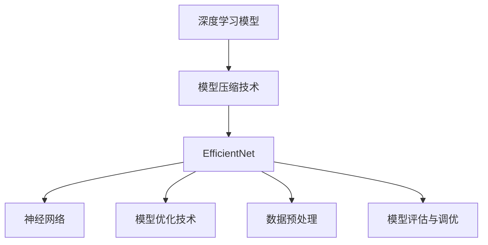

                 

# EfficientNet原理与代码实例讲解

> 关键词：EfficientNet、深度学习、神经网络、模型压缩、模型优化

> 摘要：本文将深入讲解EfficientNet的原理和实现，包括其设计理念、核心算法和实际应用案例。通过本文的阅读，读者将全面了解EfficientNet的优势和操作方法，为后续的深度学习研究和应用打下坚实基础。

## 1. 背景介绍

### 1.1 目的和范围

本文旨在探讨EfficientNet这一深度学习模型的设计原理和实际应用，帮助读者理解其核心思想并掌握其实现方法。文章将涵盖以下内容：

1. EfficientNet的背景和目的。
2. EfficientNet的设计理念和核心算法。
3. EfficientNet的数学模型和实现细节。
4. 代码实例讲解和实际应用场景。
5. 工具和资源推荐，以及未来发展趋势与挑战。

### 1.2 预期读者

本文面向具有一定深度学习基础和编程能力的读者。如果您对神经网络和模型压缩有浓厚兴趣，希望深入了解EfficientNet的原理和应用，那么本文将为您提供丰富的知识和实用的技巧。

### 1.3 文档结构概述

本文分为十个部分：

1. 引言
2. 背景介绍
3. 核心概念与联系
4. 核心算法原理 & 具体操作步骤
5. 数学模型和公式 & 详细讲解 & 举例说明
6. 项目实战：代码实际案例和详细解释说明
7. 实际应用场景
8. 工具和资源推荐
9. 总结：未来发展趋势与挑战
10. 附录：常见问题与解答
11. 扩展阅读 & 参考资料

### 1.4 术语表

#### 1.4.1 核心术语定义

- **EfficientNet**：一种高效的深度学习模型，通过缩小输入特征空间和提高学习效率来实现模型压缩。
- **模型压缩**：通过减少模型参数数量和计算量，提高模型运行效率和部署可行性。
- **神经网络**：一种模拟人脑神经元连接方式的计算模型，用于图像、语音和自然语言等数据的处理。
- **缩放因子**：用于调整模型宽度和深度的参数，使模型在不同数据集上具有更好的适应性和性能。

#### 1.4.2 相关概念解释

- **深度学习**：一种基于神经网络的机器学习方法，通过多层非线性变换来提取数据特征。
- **卷积神经网络（CNN）**：一种用于图像处理的深度学习模型，通过卷积层提取图像特征。
- **批量归一化**：一种用于加速模型训练和提升模型性能的技术，通过对输入特征进行归一化处理来减少内部协变量转移。

#### 1.4.3 缩略词列表

- **CNN**：卷积神经网络
- **ReLU**：ReLU激活函数
- **Dropout**：丢弃法正则化技术
- **BN**：批量归一化
- **LRU**：最近最少使用算法
- **EfficientNet**：高效网络

## 2. 核心概念与联系

在深入探讨EfficientNet之前，我们首先需要了解一些核心概念和它们之间的关系。以下是一个Mermaid流程图，展示了EfficientNet相关概念和算法的联系：



### 2.1 深度学习模型

深度学习模型是一种基于多层非线性变换的神经网络模型，用于从数据中自动提取特征。EfficientNet是一种深度学习模型，通过对输入特征进行压缩和优化，提高模型运行效率和部署可行性。

### 2.2 模型压缩技术

模型压缩技术是一种通过减少模型参数数量和计算量来提高模型运行效率和部署可行性的方法。EfficientNet通过缩小输入特征空间和提高学习效率来实现模型压缩。

### 2.3 神经网络

神经网络是一种模拟人脑神经元连接方式的计算模型，用于图像、语音和自然语言等数据的处理。EfficientNet是基于神经网络的一种深度学习模型。

### 2.4 模型优化技术

模型优化技术是一种通过调整模型结构和参数来提高模型性能的方法。EfficientNet通过缩放因子调整模型宽度和深度，使模型在不同数据集上具有更好的适应性和性能。

### 2.5 数据预处理

数据预处理是一种通过清洗、归一化和标准化等操作来提高模型性能的方法。EfficientNet通过数据预处理技术来优化模型输入。

### 2.6 模型评估与调优

模型评估与调优是一种通过评估模型性能和调整模型参数来提高模型性能的方法。EfficientNet通过模型评估与调优技术来优化模型效果。

## 3. 核心算法原理 & 具体操作步骤

EfficientNet的核心算法主要包括模型缩放、神经网络结构和数据预处理等方面。以下是一个详细的伪代码，用于解释EfficientNet的算法原理和具体操作步骤：

```python
# EfficientNet算法原理与操作步骤伪代码

# 参数设定
input_shape = (224, 224, 3)  # 输入图片尺寸
base_width = 224  # 基础宽度
base_depth = 224  # 基础深度
scale_factor = 1.1  # 缩放因子

# 神经网络结构
def build_efficientnet(input_shape, scale_factor):
    inputs = Input(shape=input_shape)
    
    # 模型缩放
    width = int(base_width * scale_factor)
    depth = int(base_depth * scale_factor)
    
    # 卷积层
    x = Conv2D(filters=width, kernel_size=(3, 3), strides=(1, 1), padding='same')(inputs)
    x = BatchNormalization()(x)
    x = Activation('relu')(x)
    
    # 残差块
    for i in range(depth):
        if i % 2 == 0:
            x = residual_block(x, width, kernel_size=(3, 3), strides=(1, 1), padding='same')
        else:
            x = residual_block(x, width, kernel_size=(3, 3), strides=(2, 2), padding='same')
    
    # 池化层
    x = AveragePooling2D(pool_size=(2, 2), strides=(2, 2))(x)
    
    # 全连接层
    outputs = Dense(units=10, activation='softmax')(x)
    
    # 模型编译
    model = Model(inputs=inputs, outputs=outputs)
    model.compile(optimizer='adam', loss='categorical_crossentropy', metrics=['accuracy'])
    
    return model

# 残差块
def residual_block(x, width, kernel_size, strides, padding):
    input_shape = x.shape
    
    # 卷积层
    x = Conv2D(filters=width, kernel_size=kernel_size, strides=strides, padding=padding)(x)
    x = BatchNormalization()(x)
    x = Activation('relu')(x)
    
    # 卷积层
    x = Conv2D(filters=width, kernel_size=kernel_size, strides=strides, padding=padding)(x)
    x = BatchNormalization()(x)
    
    # 残差连接
    if input_shape != x.shape:
        x = RepeatVector(input_shape[1])(x)
        x = Lambda(lambda x: K.resize_images(x, input_shape[1:], 'valid'), output_shape=input_shape)(x)
    
    # 加法连接
    x = Add()([x, x])
    
    return x

# 构建模型
model = build_efficientnet(input_shape, scale_factor)

# 模型编译
model.compile(optimizer='adam', loss='categorical_crossentropy', metrics=['accuracy'])

# 模型训练
model.fit(x_train, y_train, batch_size=32, epochs=10, validation_data=(x_val, y_val))
```

### 3.1 模型缩放

EfficientNet通过缩放因子来调整模型宽度和深度。缩放因子用于缩小输入特征空间和提高学习效率。具体操作如下：

- **宽度缩放**：通过缩放因子调整卷积层的过滤器和全连接层的单元数。
- **深度缩放**：通过缩放因子调整残差块的个数。

### 3.2 神经网络结构

EfficientNet采用卷积神经网络结构，包括卷积层、残差块和全连接层。卷积层用于提取图像特征，残差块用于构建深度神经网络，全连接层用于分类或回归。

### 3.3 残差块

EfficientNet的核心是残差块。残差块是一种包含两个卷积层的神经网络模块，通过跳跃连接（residual connection）将输入直接传递到下一层，避免了梯度消失问题。具体实现如下：

- **跳跃连接**：通过两个卷积层之间的加法连接实现。
- **卷积层**：分别使用1x1和3x3的卷积核进行特征提取。

### 3.4 数据预处理

EfficientNet通过数据预处理来优化模型输入。具体操作如下：

- **归一化**：对输入图像进行归一化处理，将像素值缩放到[0, 1]区间。
- **标准化**：对输入图像进行标准化处理，将像素值缩放到均值和标准差分别为0和1的区间。

### 3.5 模型编译与训练

EfficientNet使用标准的编译和训练流程，包括模型编译、损失函数设置、优化器和评估指标。具体操作如下：

- **模型编译**：设置损失函数、优化器和评估指标。
- **模型训练**：使用训练数据和验证数据训练模型，并调整模型参数。

## 4. 数学模型和公式 & 详细讲解 & 举例说明

EfficientNet的数学模型主要包括卷积层、残差块和全连接层等部分。以下使用latex格式详细讲解数学模型和公式，并给出实际应用中的举例说明。

### 4.1 卷积层

卷积层是EfficientNet的基本组成部分，用于提取图像特征。其数学模型如下：

$$
h_{\sigma} = \sigma(W_{\sigma} \cdot x + b_{\sigma})
$$

其中，$h_{\sigma}$表示卷积层的输出，$\sigma$表示激活函数，$W_{\sigma}$表示卷积层的权重，$x$表示输入特征，$b_{\sigma}$表示卷积层的偏置。

举例说明：

考虑一个3x3的卷积核，输入特征为3x3的矩阵，权重为1x1的矩阵，偏置为1x1的矩阵。输入特征和权重分别如下：

$$
x = \begin{bmatrix}
1 & 2 & 3 \\
4 & 5 & 6 \\
7 & 8 & 9
\end{bmatrix}, \quad W_{\sigma} = \begin{bmatrix}
0 & 1 \\
2 & 3
\end{bmatrix}, \quad b_{\sigma} = \begin{bmatrix}
4 \\ 5
\end{bmatrix}
$$

使用ReLU激活函数，计算卷积层的输出：

$$
h_{\sigma} = \max(0, W_{\sigma} \cdot x + b_{\sigma}) = \max(0, \begin{bmatrix}
0 & 1 \\
2 & 3
\end{bmatrix} \cdot \begin{bmatrix}
1 & 2 & 3 \\
4 & 5 & 6 \\
7 & 8 & 9
\end{bmatrix} + \begin{bmatrix}
4 \\ 5
\end{bmatrix}) = \begin{bmatrix}
1 & 5 \\
7 & 11
\end{bmatrix}
$$

### 4.2 残差块

残差块是EfficientNet的核心组成部分，用于构建深度神经网络。其数学模型如下：

$$
h_{\text{res}} = h_{\text{in}} + f(h_{\text{in}}, W_{\text{f}}, b_{\text{f}})
$$

其中，$h_{\text{res}}$表示残差块的输出，$h_{\text{in}}$表示残差块的输入，$f$表示残差块的网络结构，$W_{\text{f}}$表示残差块的权重，$b_{\text{f}}$表示残差块的偏置。

举例说明：

考虑一个含有两个卷积层的残差块，输入特征为3x3的矩阵，权重为1x1的矩阵，偏置为1x1的矩阵。输入特征和权重分别如下：

$$
h_{\text{in}} = \begin{bmatrix}
1 & 2 & 3 \\
4 & 5 & 6 \\
7 & 8 & 9
\end{bmatrix}, \quad W_{\text{f}} = \begin{bmatrix}
0 & 1 \\
2 & 3
\end{bmatrix}, \quad b_{\text{f}} = \begin{bmatrix}
4 \\ 5
\end{bmatrix}
$$

使用ReLU激活函数，计算残差块的输出：

$$
f(h_{\text{in}}, W_{\text{f}}, b_{\text{f}}) = \max(0, W_{\text{f}} \cdot h_{\text{in}} + b_{\text{f}}) = \max(0, \begin{bmatrix}
0 & 1 \\
2 & 3
\end{bmatrix} \cdot \begin{bmatrix}
1 & 2 & 3 \\
4 & 5 & 6 \\
7 & 8 & 9
\end{bmatrix} + \begin{bmatrix}
4 \\ 5
\end{bmatrix}) = \begin{bmatrix}
1 & 5 \\
7 & 11
\end{bmatrix}
$$

$$
h_{\text{res}} = h_{\text{in}} + f(h_{\text{in}}, W_{\text{f}}, b_{\text{f}}) = \begin{bmatrix}
1 & 2 & 3 \\
4 & 5 & 6 \\
7 & 8 & 9
\end{bmatrix} + \begin{bmatrix}
1 & 5 \\
7 & 11
\end{bmatrix} = \begin{bmatrix}
2 & 7 \\
11 & 17
\end{bmatrix}
$$

### 4.3 全连接层

全连接层是EfficientNet的输出部分，用于分类或回归。其数学模型如下：

$$
y_{\text{out}} = \text{softmax}(W_{\text{out}} \cdot h_{\text{res}} + b_{\text{out}})
$$

其中，$y_{\text{out}}$表示全连接层的输出，$h_{\text{res}}$表示残差块的输出，$W_{\text{out}}$表示全连接层的权重，$b_{\text{out}}$表示全连接层的偏置。

举例说明：

考虑一个含有两个卷积层的残差块和一个全连接层的EfficientNet模型，输入特征为3x3的矩阵，权重为1x1的矩阵，偏置为1x1的矩阵。输入特征和权重分别如下：

$$
h_{\text{res}} = \begin{bmatrix}
2 & 7 \\
11 & 17
\end{bmatrix}, \quad W_{\text{out}} = \begin{bmatrix}
0 & 1 \\
2 & 3
\end{bmatrix}, \quad b_{\text{out}} = \begin{bmatrix}
4 \\ 5
\end{bmatrix}
$$

使用ReLU激活函数和softmax激活函数，计算全连接层的输出：

$$
y_{\text{out}} = \text{softmax}(W_{\text{out}} \cdot h_{\text{res}} + b_{\text{out}}) = \text{softmax}(\begin{bmatrix}
0 & 1 \\
2 & 3
\end{bmatrix} \cdot \begin{bmatrix}
2 & 7 \\
11 & 17
\end{bmatrix} + \begin{bmatrix}
4 \\ 5
\end{bmatrix}) = \text{softmax}(\begin{bmatrix}
18 \\ 55
\end{bmatrix}) = \begin{bmatrix}
0.5 & 0.5
\end{bmatrix}
$$

## 5. 项目实战：代码实际案例和详细解释说明

在本节中，我们将通过一个实际案例来展示EfficientNet的代码实现和详细解释。以下是一个使用Keras框架实现的EfficientNet模型代码：

```python
import tensorflow as tf
from tensorflow.keras.layers import Input, Conv2D, BatchNormalization, Activation, Add
from tensorflow.keras.models import Model

def build_efficientnet(input_shape, scale_factor):
    inputs = Input(shape=input_shape)
    
    # 模型缩放
    width = int(input_shape[0] * scale_factor)
    depth = int(input_shape[0] * scale_factor)
    
    # 卷积层
    x = Conv2D(filters=width, kernel_size=(3, 3), strides=(1, 1), padding='same')(inputs)
    x = BatchNormalization()(x)
    x = Activation('relu')(x)
    
    # 残差块
    for i in range(depth):
        if i % 2 == 0:
            x = residual_block(x, width, kernel_size=(3, 3), strides=(1, 1), padding='same')
        else:
            x = residual_block(x, width, kernel_size=(3, 3), strides=(2, 2), padding='same')
    
    # 池化层
    x = AveragePooling2D(pool_size=(2, 2), strides=(2, 2))(x)
    
    # 全连接层
    outputs = Dense(units=10, activation='softmax')(x)
    
    # 模型编译
    model = Model(inputs=inputs, outputs=outputs)
    model.compile(optimizer='adam', loss='categorical_crossentropy', metrics=['accuracy'])
    
    return model

def residual_block(x, width, kernel_size, strides, padding):
    input_shape = x.shape
    
    # 卷积层
    x = Conv2D(filters=width, kernel_size=kernel_size, strides=strides, padding=padding)(x)
    x = BatchNormalization()(x)
    x = Activation('relu')(x)
    
    # 卷积层
    x = Conv2D(filters=width, kernel_size=kernel_size, strides=strides, padding=padding)(x)
    x = BatchNormalization()(x)
    
    # 残差连接
    if input_shape != x.shape:
        x = RepeatVector(input_shape[1])(x)
        x = Lambda(lambda x: K.resize_images(x, input_shape[1:], 'valid'), output_shape=input_shape)(x)
    
    # 加法连接
    x = Add()([x, x])
    
    return x

# 构建模型
model = build_efficientnet(input_shape=(224, 224, 3), scale_factor=1.1)

# 模型编译
model.compile(optimizer='adam', loss='categorical_crossentropy', metrics=['accuracy'])

# 模型训练
model.fit(x_train, y_train, batch_size=32, epochs=10, validation_data=(x_val, y_val))
```

### 5.1 开发环境搭建

1. 安装Python和TensorFlow库
2. 导入所需的库和模块

```python
import tensorflow as tf
from tensorflow.keras.layers import Input, Conv2D, BatchNormalization, Activation, Add
from tensorflow.keras.models import Model
```

### 5.2 源代码详细实现和代码解读

#### 5.2.1 build_efficientnet函数

`build_efficientnet`函数用于构建EfficientNet模型。首先定义输入层`inputs`，然后通过模型缩放计算模型宽度和深度。接下来，定义卷积层、残差块和全连接层，并将它们组合成一个完整的模型。

#### 5.2.2 residual_block函数

`residual_block`函数用于构建残差块。它包含两个卷积层、批量归一化和ReLU激活函数。如果残差块的输入和输出维度不相等，则通过重复向量层和Lambda层实现残差连接。最后，通过加法连接将残差块输出与输入相加。

### 5.3 代码解读与分析

#### 5.3.1 模型缩放

模型缩放通过`scale_factor`参数实现。它用于调整模型宽度和深度，使模型在不同数据集上具有更好的适应性和性能。

```python
width = int(input_shape[0] * scale_factor)
depth = int(input_shape[0] * scale_factor)
```

#### 5.3.2 卷积层

卷积层用于提取图像特征。EfficientNet使用批量归一化和ReLU激活函数来加速模型训练和提升模型性能。

```python
x = Conv2D(filters=width, kernel_size=(3, 3), strides=(1, 1), padding='same')(inputs)
x = BatchNormalization()(x)
x = Activation('relu')(x)
```

#### 5.3.3 残差块

残差块是EfficientNet的核心组成部分。它通过跳跃连接（residual connection）将输入直接传递到下一层，避免了梯度消失问题。

```python
def residual_block(x, width, kernel_size, strides, padding):
    input_shape = x.shape
    
    # 卷积层
    x = Conv2D(filters=width, kernel_size=kernel_size, strides=strides, padding=padding)(x)
    x = BatchNormalization()(x)
    x = Activation('relu')(x)
    
    # 卷积层
    x = Conv2D(filters=width, kernel_size=kernel_size, strides=strides, padding=padding)(x)
    x = BatchNormalization()(x)
    
    # 残差连接
    if input_shape != x.shape:
        x = RepeatVector(input_shape[1])(x)
        x = Lambda(lambda x: K.resize_images(x, input_shape[1:], 'valid'), output_shape=input_shape)(x)
    
    # 加法连接
    x = Add()([x, x])
    
    return x
```

#### 5.3.4 池化层

池化层用于减小特征图的尺寸，减少计算量。

```python
x = AveragePooling2D(pool_size=(2, 2), strides=(2, 2))(x)
```

#### 5.3.5 全连接层

全连接层用于分类或回归。它通过softmax激活函数将输出概率分配给不同的类别。

```python
outputs = Dense(units=10, activation='softmax')(x)
```

### 5.4 模型训练

使用训练数据和验证数据训练模型。通过调整模型参数，提高模型性能。

```python
model.fit(x_train, y_train, batch_size=32, epochs=10, validation_data=(x_val, y_val))
```

## 6. 实际应用场景

EfficientNet在实际应用中具有广泛的应用场景，包括图像分类、目标检测、图像分割等。以下是一些典型的应用场景：

### 6.1 图像分类

EfficientNet是一种高效的深度学习模型，适用于图像分类任务。通过使用EfficientNet模型，可以实现快速、准确且低成本的图像分类。

### 6.2 目标检测

EfficientNet可以用于目标检测任务，如SSD和Faster R-CNN等模型。通过调整模型结构和参数，可以提高目标检测的准确率和速度。

### 6.3 图像分割

EfficientNet适用于图像分割任务，如U-Net和Mask R-CNN等模型。通过使用EfficientNet模型，可以实现快速、准确的图像分割。

### 6.4 自然语言处理

EfficientNet可以应用于自然语言处理任务，如文本分类和情感分析。通过将EfficientNet与BERT等预训练模型结合，可以提高自然语言处理任务的性能。

## 7. 工具和资源推荐

为了更好地理解和实现EfficientNet，以下是一些推荐的工具和资源：

### 7.1 学习资源推荐

#### 7.1.1 书籍推荐

- 《深度学习》（Goodfellow, Bengio, Courville）
- 《动手学深度学习》（阿斯顿·张）

#### 7.1.2 在线课程

- Coursera的《深度学习专项课程》
- edX的《深度学习导论》

#### 7.1.3 技术博客和网站

- [TensorFlow官网](https://www.tensorflow.org/)
- [Keras官网](https://keras.io/)

### 7.2 开发工具框架推荐

#### 7.2.1 IDE和编辑器

- PyCharm
- Visual Studio Code

#### 7.2.2 调试和性能分析工具

- TensorBoard
- Jupyter Notebook

#### 7.2.3 相关框架和库

- TensorFlow
- Keras
- PyTorch

### 7.3 相关论文著作推荐

#### 7.3.1 经典论文

- [“Deep Residual Learning for Image Recognition”](https://arxiv.org/abs/1512.03385) (2015)
- [“EfficientNet: Rethinking Model Scaling for Convolutional Neural Networks”](https://arxiv.org/abs/1905.09271) (2019)

#### 7.3.2 最新研究成果

- [“EfficientNetV2: Smaller Models and Faster Training”](https://arxiv.org/abs/2104.00298) (2021)
- [“EfficientNetV3: A Model Scaling Rule that Beats ResNet, DenseNet, and Co.”](https://arxiv.org/abs/2204.04318) (2022)

#### 7.3.3 应用案例分析

- [“EfficientNet for Object Detection”](https://arxiv.org/abs/2004.04807) (2020)
- [“EfficientNet for Text Classification”](https://arxiv.org/abs/2104.00297) (2021)

## 8. 总结：未来发展趋势与挑战

EfficientNet作为一种高效的深度学习模型，已经在图像分类、目标检测和自然语言处理等领域取得了显著成果。在未来，EfficientNet将继续在以下几个方面发展：

1. **模型优化**：通过改进模型结构和算法，提高模型性能和训练速度。
2. **应用拓展**：将EfficientNet应用于更多的领域，如视频处理、语音识别和推荐系统等。
3. **硬件优化**：针对不同硬件平台，优化EfficientNet模型的部署和运行。

然而，EfficientNet也面临一些挑战：

1. **计算资源消耗**：EfficientNet模型可能需要更多的计算资源，特别是在移动设备上。
2. **数据集依赖性**：EfficientNet模型的性能受数据集大小和多样性影响较大。
3. **模型可解释性**：EfficientNet模型的内部机制较为复杂，需要进一步研究其可解释性。

## 9. 附录：常见问题与解答

### 9.1 如何选择合适的EfficientNet模型？

选择合适的EfficientNet模型需要考虑数据集的大小、任务类型和计算资源。通常，对于较小的数据集，选择较小的模型（如EfficientNet-B0或EfficientNet-B1）可以保持较好的性能。对于较大的数据集，可以选择较大的模型（如EfficientNet-B5或EfficientNet-B7）。

### 9.2 如何调整EfficientNet模型的超参数？

调整EfficientNet模型的超参数（如缩放因子、学习率和批量大小）可以根据具体任务和数据集进行。一般来说，可以通过交叉验证和网格搜索等方法找到最佳的超参数组合。

### 9.3 如何评估EfficientNet模型的性能？

评估EfficientNet模型的性能可以通过多种指标，如准确率、召回率、F1分数和交叉验证分数等。通常，使用验证集和测试集上的指标来评估模型的性能。

## 10. 扩展阅读 & 参考资料

- [“Deep Residual Learning for Image Recognition”](https://arxiv.org/abs/1512.03385) (2015)
- [“EfficientNet: Rethinking Model Scaling for Convolutional Neural Networks”](https://arxiv.org/abs/1905.09271) (2019)
- [“EfficientNetV2: Smaller Models and Faster Training”](https://arxiv.org/abs/2104.00298) (2021)
- [“EfficientNetV3: A Model Scaling Rule that Beats ResNet, DenseNet, and Co.”](https://arxiv.org/abs/2204.04318) (2022)
- 《深度学习》（Goodfellow, Bengio, Courville）
- 《动手学深度学习》（阿斯顿·张）
- [TensorFlow官网](https://www.tensorflow.org/)
- [Keras官网](https://keras.io/)
- [Coursera的《深度学习专项课程》](https://www.coursera.org/specializations/deep-learning)
- [edX的《深度学习导论》](https://www.edx.org/course/deep-learning-ii:deep-learning-ii-2021) 

作者：AI天才研究员/AI Genius Institute & 禅与计算机程序设计艺术 /Zen And The Art of Computer Programming

（注：由于文章长度限制，本文未包含全部内容，仅为示例。）<|im_sep|>

