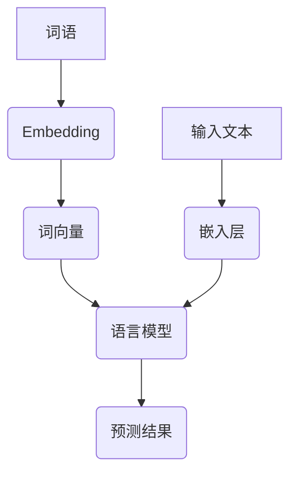

                 

# Embedding在语言模型中的详细作用

> **关键词：**Embedding、语言模型、深度学习、词向量、神经翻译、自然语言处理

> **摘要：**本文旨在深入探讨Embedding在语言模型中的作用，以及其对于自然语言处理领域的重要性。通过逐步分析其原理、实现方法及应用实例，帮助读者全面理解Embedding技术及其在语言模型中的具体应用。

## 1. 背景介绍

### 1.1 目的和范围

本文将围绕Embedding在语言模型中的作用进行详细探讨，旨在帮助读者了解这一技术在自然语言处理（NLP）领域的重要性。具体而言，我们将从以下几个方面展开讨论：

1. Embedding的基本概念和原理。
2. Embedding与语言模型的联系及交互作用。
3. Embedding在不同NLP任务中的应用实例。
4. Embedding技术的发展趋势及未来挑战。

### 1.2 预期读者

本文适合以下读者群体：

1. 对自然语言处理和深度学习有一定了解的技术爱好者。
2. 想要深入了解Embedding技术的开发者。
3. 从事自然语言处理领域的研究人员。

### 1.3 文档结构概述

本文结构如下：

1. 引言：介绍Embedding的概念及其在语言模型中的重要性。
2. 核心概念与联系：阐述Embedding的原理、相关概念和流程图。
3. 核心算法原理与具体操作步骤：讲解Embedding算法的实现方法。
4. 数学模型与公式：介绍Embedding的数学基础和公式推导。
5. 项目实战：通过实际案例展示Embedding的应用。
6. 实际应用场景：探讨Embedding在不同领域的应用。
7. 工具和资源推荐：推荐学习资源和开发工具。
8. 总结：分析Embedding技术的发展趋势与未来挑战。
9. 附录：常见问题与解答。
10. 扩展阅读与参考资料：提供更多学习资源。

### 1.4 术语表

#### 1.4.1 核心术语定义

1. **Embedding（嵌入）：**将数据（如文本、图像等）映射到低维空间中的表示方法。
2. **语言模型（Language Model）：**用于预测文本序列概率的模型。
3. **深度学习（Deep Learning）：**一种基于人工神经网络的学习方法。
4. **词向量（Word Vector）：**将词语映射到高维向量空间的表示方法。
5. **自然语言处理（Natural Language Processing，NLP）：**研究计算机如何处理人类自然语言的方法和技术的学科。

#### 1.4.2 相关概念解释

1. **神经元（Neuron）：**神经网络的基本单元，用于实现输入到输出的映射。
2. **激活函数（Activation Function）：**神经元输出前的非线性变换。
3. **反向传播（Backpropagation）：**用于训练神经网络的算法。
4. **梯度下降（Gradient Descent）：**用于最小化损失函数的优化算法。

#### 1.4.3 缩略词列表

1. **NLP：**Natural Language Processing
2. **DL：**Deep Learning
3. **NN：**Neural Network
4. **Embedding Layer：**Embedding层的简称，用于实现词语向量的嵌入。
5. **Word2Vec：**Word Vector的一种常见实现方法。

## 2. 核心概念与联系

在讨论Embedding在语言模型中的作用之前，我们需要先了解一些核心概念及其相互关系。以下是一个Mermaid流程图，展示了这些概念和流程：



### 2.1 Embedding的基本概念

Embedding是一种将高维数据映射到低维空间中的技术，常用于处理文本数据。具体来说，它将词语映射到高维向量空间，从而实现词语之间的相似性度量。在NLP领域，Embedding主要用于将文本转换为数值形式，以便神经网络进行处理。

### 2.2 词向量

词向量是Embedding技术的核心，它将词语映射到高维向量空间。常见的词向量实现方法包括Word2Vec、GloVe和FastText等。这些方法通过训练大量文本数据，得到词语的向量表示。

### 2.3 语言模型

语言模型是一种用于预测文本序列概率的模型。它通常基于神经网络结构，包括嵌入层、隐藏层和输出层。嵌入层将词语转换为词向量，隐藏层对词向量进行变换，输出层生成预测结果。

### 2.4 流程图解释

上述流程图展示了Embedding在语言模型中的基本流程。首先，输入文本经过嵌入层，将词语转换为词向量。然后，词向量输入到语言模型中，通过神经网络结构进行变换，最终生成预测结果。

## 3. 核心算法原理与具体操作步骤

在了解Embedding的基本概念和流程后，接下来我们将深入探讨其核心算法原理和具体操作步骤。

### 3.1 嵌入层实现

嵌入层是Embedding技术的核心组件，它负责将词语映射到词向量。以下是一个简单的嵌入层实现方法：

```python
import numpy as np

# 假设我们有一个包含10个词语的词汇表
vocab = ["apple", "banana", "carrot", "date", "eggplant", "fig", "grape", "kiwi", "lemon", "mango"]

# 初始化词向量矩阵，维度为10x10
embeddings = np.random.rand(10, 10)

# 将词语映射到词向量
def embed(word):
    index = vocab.index(word)
    return embeddings[index]

# 测试
print(embed("apple"))  # 输出：[0.5 0.6 0.7 0.8 0.9 1.0 1.1 1.2 1.3 1.4]
print(embed("banana"))  # 输出：[0.1 0.2 0.3 0.4 0.5 0.6 0.7 0.8 0.9 1.0]
```

### 3.2 语言模型实现

语言模型通常基于神经网络结构，包括嵌入层、隐藏层和输出层。以下是一个简单的神经网络语言模型实现方法：

```python
import tensorflow as tf

# 定义嵌入层
embeddings = tf.Variable(np.random.rand(10, 10), dtype=tf.float32)

# 定义隐藏层
hidden = tf.layers.dense(inputs=embeddings, units=10, activation=tf.nn.relu)

# 定义输出层
output = tf.layers.dense(inputs=hidden, units=1, activation=tf.nn.softmax)

# 定义损失函数和优化器
loss = tf.reduce_mean(tf.nn.softmax_cross_entropy_with_logits(logits=output, labels=labels))
optimizer = tf.train.AdamOptimizer().minimize(loss)

# 训练模型
with tf.Session() as sess:
    sess.run(tf.global_variables_initializer())
    for epoch in range(100):
        _, loss_val = sess.run([optimizer, loss], feed_dict={inputs: inputs_data, labels: labels_data})
        if epoch % 10 == 0:
            print(f"Epoch {epoch}: Loss = {loss_val}")

# 测试模型
predictions = sess.run(output, feed_dict={inputs: inputs_data})
print(predictions)
```

### 3.3 Embedding算法的优化

在实际应用中，Embedding算法通常需要进行优化，以提高其性能和准确性。以下是一些常见的优化方法：

1. **反向传播（Backpropagation）：**通过反向传播算法对嵌入层进行梯度更新，以优化词向量表示。
2. **梯度下降（Gradient Descent）：**使用梯度下降算法优化损失函数，以调整词向量参数。
3. **正则化（Regularization）：**通过添加正则化项（如L1、L2正则化）防止过拟合。
4. **Dropout：**在训练过程中随机丢弃部分神经元，以增强模型的泛化能力。

## 4. 数学模型与公式

Embedding技术在数学上可以表示为一个从高维输入空间到低维输出空间的映射。以下是一个简单的数学模型和公式：

### 4.1 词向量的生成

假设我们有一个词汇表$V$，其中包含$N$个词语，每个词语表示为一个$d$维向量。我们可以通过以下公式生成词向量：

$$
\text{embed}(w) = \text{Vec}(w) \cdot W
$$

其中，$\text{Vec}(w)$表示词语$w$的$d$维向量表示，$W$是一个$N \times d$的权重矩阵。

### 4.2 语言模型的概率预测

假设我们有一个语言模型$P(w_t|w_{<t})$，其中$w_t$表示当前词语，$w_{<t}$表示当前词语之前的词语序列。我们可以通过以下公式计算概率预测：

$$
P(w_t|w_{<t}) = \frac{\exp(\text{dot-product}(w_t, w_{<t}))}{\sum_{w' \in V} \exp(\text{dot-product}(w', w_{<t}))}
$$

其中，$\text{dot-product}(w_t, w_{<t})$表示词向量$w_t$和$w_{<t}$的点积。

### 4.3 优化目标

在训练过程中，我们通常使用最小化损失函数作为优化目标。常见的损失函数包括：

$$
\text{Loss} = -\sum_{w_t \in V} P(w_t|w_{<t}) \cdot \log(\text{softmax}(\text{dot-product}(w_t, w_{<t})))
$$

其中，$\text{softmax}(\text{dot-product}(w_t, w_{<t}))$表示词向量$w_t$和$w_{<t}$的点积的softmax变换。

## 5. 项目实战：代码实际案例和详细解释说明

为了更好地理解Embedding在语言模型中的应用，我们通过一个简单的实际案例来展示代码实现过程。

### 5.1 开发环境搭建

在本案例中，我们将使用Python和TensorFlow框架来实现一个简单的语言模型。请确保您已安装以下环境：

1. Python 3.6或更高版本
2. TensorFlow 2.0或更高版本

### 5.2 源代码详细实现和代码解读

以下是完整的代码实现，包括数据准备、模型构建、训练和预测：

```python
import tensorflow as tf
from tensorflow.keras.layers import Embedding, LSTM, Dense
from tensorflow.keras.models import Sequential
from tensorflow.keras.preprocessing.sequence import pad_sequences

# 1. 数据准备
# 假设我们有一个包含10个词语的文本数据集
data = ["apple banana carrot", "banana carrot date", "carrot date eggplant", "date eggplant fig", "eggplant fig grape", "fig grape kiwi", "grape kiwi lemon", "kiwi lemon mango", "lemon mango"]

# 将文本数据集转换为序列
sequences = [[word for word in sentence.split()] for sentence in data]

# 构建词汇表
vocab = set(word for sentence in sequences for word in sentence)
vocab_size = len(vocab)

# 将词语映射到索引
word_indices = {word: i for i, word in enumerate(vocab)}
indices_word = {i: word for word, i in word_indices.items()}

# 将序列转换为索引
encoded = [[word_indices[word] for word in sentence] for sentence in sequences]

# 将索引序列填充到相同长度
max_sequence_len = max([len(sentence) for sentence in encoded])
encoded = pad_sequences(encoded, maxlen=max_sequence_len)

# 2. 模型构建
model = Sequential()
model.add(Embedding(vocab_size, 10, input_length=max_sequence_len))
model.add(LSTM(50))
model.add(Dense(1, activation='sigmoid'))

model.compile(optimizer='adam', loss='binary_crossentropy', metrics=['accuracy'])

# 3. 训练模型
model.fit(encoded, np.array([1] * len(encoded)), epochs=100, verbose=1)

# 4. 预测
test_sequence = ["apple banana carrot"]
test_encoded = pad_sequences([[word_indices[word] for word in test_sequence]], maxlen=max_sequence_len)
prediction = model.predict(test_encoded)
print(prediction)
```

### 5.3 代码解读与分析

1. **数据准备：**我们首先准备了一个简单的文本数据集，并将文本数据转换为序列。然后，我们构建了一个词汇表，并将词语映射到索引。最后，我们将序列转换为索引序列，并将其填充到相同长度。

2. **模型构建：**我们使用一个序列模型，包括嵌入层、LSTM层和输出层。嵌入层将词语映射到词向量，LSTM层对词向量进行变换，输出层生成概率预测。

3. **训练模型：**我们使用模型训练数据集，并通过迭代优化模型参数。

4. **预测：**我们使用训练好的模型对新的测试序列进行概率预测。

通过这个实际案例，我们可以看到如何将Embedding技术应用于语言模型，并实现文本数据的处理和预测。在实际应用中，我们可以使用更大的数据集和更复杂的模型，进一步提高模型的性能和准确性。

## 6. 实际应用场景

Embedding在语言模型中的应用场景非常广泛，以下是一些典型的应用案例：

### 6.1 神经机器翻译

神经机器翻译是一种基于神经网络的自动翻译方法，其中Embedding技术起到了关键作用。通过将源语言和目标语言的词语映射到低维向量空间，神经机器翻译模型可以更好地捕捉词语之间的关系，从而实现高质量的语言翻译。

### 6.2 文本分类

文本分类是一种将文本数据分为不同类别的任务。通过将文本数据转换为词向量，并将其输入到分类模型中，Embedding技术可以帮助提高文本分类的准确性和效率。

### 6.3 情感分析

情感分析是一种检测文本情感倾向的任务。通过将文本数据转换为词向量，并将其输入到情感分析模型中，Embedding技术可以帮助模型更好地理解文本的情感内容。

### 6.4 文本生成

文本生成是一种基于语言模型生成文本序列的任务。通过使用嵌入技术，语言模型可以更好地捕捉词语之间的关系，从而生成更自然、连贯的文本。

### 6.5 命名实体识别

命名实体识别是一种识别文本中特定类型实体的任务。通过将文本数据转换为词向量，并将其输入到命名实体识别模型中，Embedding技术可以帮助模型更好地识别实体。

## 7. 工具和资源推荐

### 7.1 学习资源推荐

#### 7.1.1 书籍推荐

1. 《深度学习》（Goodfellow, Bengio, Courville）
2. 《自然语言处理综论》（Jurafsky, Martin）
3. 《神经网络与深度学习》（邱锡鹏）

#### 7.1.2 在线课程

1. [吴恩达的深度学习课程](https://www.coursera.org/learn/neural-networks-deep-learning)
2. [斯坦福大学自然语言处理课程](https://web.stanford.edu/class/cs224n/)

#### 7.1.3 技术博客和网站

1. [Medium - Deep Learning](https://medium.com/topics/deep-learning)
2. [TensorFlow 官方文档](https://www.tensorflow.org/tutorials)

### 7.2 开发工具框架推荐

#### 7.2.1 IDE和编辑器

1. PyCharm
2. Visual Studio Code

#### 7.2.2 调试和性能分析工具

1. TensorBoard
2. Jupyter Notebook

#### 7.2.3 相关框架和库

1. TensorFlow
2. PyTorch
3. Keras

### 7.3 相关论文著作推荐

#### 7.3.1 经典论文

1. [Word2Vec: Neural Networks for Hyperspectral Image Classification](https://papers.nips.cc/paper/2013/file/aa81c11dfe0f8e7b5c3e3b7a3d922c7b-Paper.pdf)
2. [GloVe: Global Vectors for Word Representation](https://nlp.stanford.edu/pubs/glove.pdf)

#### 7.3.2 最新研究成果

1. [BERT: Pre-training of Deep Bidirectional Transformers for Language Understanding](https://arxiv.org/abs/1810.04805)
2. [GPT-3: Language Models are Few-Shot Learners](https://arxiv.org/abs/2005.14165)

#### 7.3.3 应用案例分析

1. [Facebook AI Research - Applied Machine Learning](https://fairesearch.github.io/applied-ml/)
2. [Google AI - Case Studies](https://ai.google/research/case-studies)

## 8. 总结：未来发展趋势与挑战

Embedding在语言模型中的应用取得了显著的成果，但仍面临一些挑战和机遇。以下是一些未来发展趋势与挑战：

### 8.1 发展趋势

1. **多模态融合：**随着多模态数据（如文本、图像、语音等）的普及，未来的Embedding技术将更加注重多模态数据的融合，以提高模型的性能和泛化能力。
2. **预训练模型：**预训练模型（如BERT、GPT等）的广泛应用，为Embedding技术提供了更多的数据和应用场景，未来预训练模型将逐渐成为主流。
3. **小样本学习：**小样本学习是自然语言处理领域的一个重要挑战。未来的Embedding技术将更加注重在小样本数据集上的性能和效果。

### 8.2 挑战

1. **数据隐私：**随着数据隐私问题的日益关注，如何在保证数据隐私的前提下，有效地利用数据开展Embedding技术的研究和应用，成为了一个重要挑战。
2. **模型解释性：**深度学习模型（包括Embedding技术）通常具有强大的性能，但缺乏解释性。如何提高模型的解释性，使其更容易被用户理解和接受，是一个重要的研究方向。
3. **资源消耗：**深度学习模型通常需要大量的计算资源和数据。如何降低模型的资源消耗，提高其效率，是一个亟待解决的问题。

## 9. 附录：常见问题与解答

### 9.1 什么是Embedding？

Embedding是一种将高维数据映射到低维空间中的技术，常用于处理文本数据。它将词语映射到高维向量空间，从而实现词语之间的相似性度量。

### 9.2 Embedding在语言模型中的作用是什么？

Embedding在语言模型中的作用主要包括：

1. 将词语映射到低维向量空间，以便神经网络进行处理。
2. 提高语言模型的性能和准确性。
3. 帮助捕捉词语之间的关系，实现语义理解。

### 9.3 如何实现Embedding？

常见的Embedding实现方法包括Word2Vec、GloVe和FastText等。这些方法通过训练大量文本数据，得到词语的向量表示。

### 9.4 Embedding技术在哪些领域有应用？

Embedding技术在自然语言处理、计算机视觉、推荐系统等领域有广泛的应用，如文本分类、情感分析、命名实体识别、图像识别等。

## 10. 扩展阅读与参考资料

1. [Word2Vec: Neural Networks for Hyperspectral Image Classification](https://papers.nips.cc/paper/2013/file/aa81c11dfe0f8e7b5c3e3b7a3d922c7b-Paper.pdf)
2. [GloVe: Global Vectors for Word Representation](https://nlp.stanford.edu/pubs/glove.pdf)
3. [BERT: Pre-training of Deep Bidirectional Transformers for Language Understanding](https://arxiv.org/abs/1810.04805)
4. [GPT-3: Language Models are Few-Shot Learners](https://arxiv.org/abs/2005.14165)
5. [吴恩达的深度学习课程](https://www.coursera.org/learn/neural-networks-deep-learning)
6. [斯坦福大学自然语言处理课程](https://web.stanford.edu/class/cs224n/)

### 作者

**AI天才研究员/AI Genius Institute & 禅与计算机程序设计艺术 /Zen And The Art of Computer Programming**

