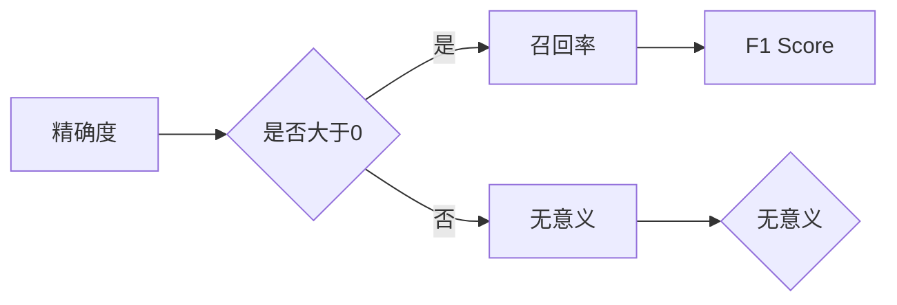
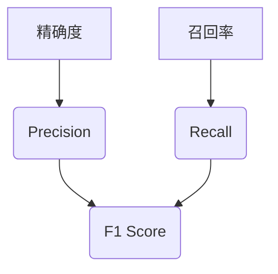

                 

# F1 Score 原理与代码实战案例讲解

> 关键词：F1 Score、精准度、召回率、机器学习、分类任务、Python实现

> 摘要：本文将深入讲解F1 Score的核心原理，并通过Python代码实战案例详细解析其应用方法。我们将首先介绍F1 Score的定义和背景，然后通过数学模型和公式进行深入剖析，最后通过实际项目案例展示F1 Score在机器学习分类任务中的具体应用。

## 1. 背景介绍

### 1.1 目的和范围

本文的主要目的是帮助读者理解F1 Score的概念及其在机器学习中的重要性。我们将通过以下内容实现这一目标：

- **定义与背景**：介绍F1 Score的定义、起源及其在评估分类任务中的重要性。
- **核心概念与联系**：通过Mermaid流程图展示F1 Score与其他评估指标的关系。
- **算法原理**：详细解释F1 Score的计算方法和相关算法原理。
- **数学模型和公式**：分析F1 Score的数学基础，并通过公式和例子进行说明。
- **项目实战**：通过实际代码案例展示如何使用Python实现F1 Score的计算。
- **实际应用场景**：探讨F1 Score在不同类型的数据集和问题中的适用性。
- **工具和资源推荐**：推荐相关学习资源、开发工具和论文著作。
- **总结与展望**：总结F1 Score的优势与局限性，探讨未来发展趋势。

### 1.2 预期读者

本文适合以下读者群体：

- 机器学习初学者和研究人员，希望深入理解评估指标。
- 数据科学家和AI工程师，需要掌握F1 Score在实际项目中的应用。
- 程序员和技术爱好者，对机器学习和算法有浓厚兴趣。

### 1.3 文档结构概述

本文的结构如下：

1. 背景介绍：定义、目的、范围、预期读者和文档结构。
2. 核心概念与联系：通过Mermaid流程图展示F1 Score的原理和关系。
3. 核心算法原理与具体操作步骤：详细讲解F1 Score的计算方法和算法原理。
4. 数学模型和公式：分析F1 Score的数学基础，并通过公式和例子进行说明。
5. 项目实战：通过实际代码案例展示如何使用Python实现F1 Score的计算。
6. 实际应用场景：探讨F1 Score在不同类型的数据集和问题中的适用性。
7. 工具和资源推荐：推荐相关学习资源、开发工具和论文著作。
8. 总结与展望：总结F1 Score的优势与局限性，探讨未来发展趋势。
9. 附录：常见问题与解答。
10. 扩展阅读与参考资料：提供进一步学习的资源。

### 1.4 术语表

#### 1.4.1 核心术语定义

- **F1 Score**：用于评估分类模型性能的指标，结合了精确度和召回率。
- **精确度**：预测为正例的样本中实际为正例的比例。
- **召回率**：实际为正例的样本中被预测为正例的比例。
- **分类任务**：将数据划分为不同类别的问题。

#### 1.4.2 相关概念解释

- **假阳性**：实际为负例但被预测为正例的样本。
- **假阴性**：实际为正例但被预测为负例的样本。
- **真正例**：实际为正例且被预测为正例的样本。
- **假正例**：实际为负例但被预测为正例的样本。

#### 1.4.3 缩略词列表

- **F1 Score**：精确度与召回率的调和平均值。
- **Python**：一种流行的编程语言，广泛用于数据科学和机器学习。

## 2. 核心概念与联系

为了更好地理解F1 Score，我们需要先了解它与精确度和召回率的关系。以下是F1 Score与其他评估指标之间的Mermaid流程图：



### 2.1 精确度与召回率

精确度和召回率是评估分类模型性能的两个关键指标。精确度衡量的是模型预测的正例中实际为正例的比例，而召回率衡量的是实际为正例的样本中被模型正确预测为正例的比例。

- **精确度**（Precision）：$$ Precision = \frac{TP}{TP + FP} $$，其中TP表示真正例，FP表示假正例。
- **召回率**（Recall）：$$ Recall = \frac{TP}{TP + FN} $$，其中FN表示假阴性。

### 2.2 F1 Score

F1 Score是精确度和召回率的调和平均值，用于综合评估分类模型的性能。其计算公式为：

$$ F1 Score = 2 \times \frac{Precision \times Recall}{Precision + Recall} $$

### 2.3 关系与权衡

精确度和召回率之间存在权衡关系。当模型过于关注精确度时，召回率可能会下降；反之亦然。F1 Score提供了一个平衡点，使得模型性能评估更加全面和准确。

## 3. 核心算法原理与具体操作步骤

在本节中，我们将详细讲解F1 Score的算法原理，并通过伪代码展示其具体操作步骤。

### 3.1 算法原理

F1 Score的计算涉及两个核心指标：精确度和召回率。具体算法原理如下：

1. 计算精确度：$$ Precision = \frac{TP}{TP + FP} $$
2. 计算召回率：$$ Recall = \frac{TP}{TP + FN} $$
3. 计算F1 Score：$$ F1 Score = 2 \times \frac{Precision \times Recall}{Precision + Recall} $$

### 3.2 伪代码

以下是一个计算F1 Score的伪代码示例：

```
def calculate_f1_score(true_positives, false_positives, false_negatives):
    precision = true_positives / (true_positives + false_positives)
    recall = true_positives / (true_positives + false_negatives)
    f1_score = 2 * (precision * recall) / (precision + recall)
    return f1_score
```

### 3.3 步骤详解

1. **初始化**：输入真正例（TP）、假正例（FP）和假阴性（FN）的值。
2. **计算精确度**：使用公式计算模型的精确度。
3. **计算召回率**：使用公式计算模型的召回率。
4. **计算F1 Score**：使用上述两个指标计算F1 Score。
5. **返回结果**：输出计算得到的F1 Score。

通过上述步骤，我们可以精确地计算F1 Score，从而评估模型的分类性能。

## 4. 数学模型和公式与详细讲解与举例说明

在本节中，我们将详细讲解F1 Score的数学模型和公式，并通过具体的例子进行说明。

### 4.1 数学模型

F1 Score的计算基于精确度和召回率。这两个指标的数学模型如下：

- **精确度**（Precision）：$$ Precision = \frac{TP}{TP + FP} $$
- **召回率**（Recall）：$$ Recall = \frac{TP}{TP + FN} $$

- **F1 Score**（F1 Score）：$$ F1 Score = 2 \times \frac{Precision \times Recall}{Precision + Recall} $$

### 4.2 公式解释

- **精确度**：精确度衡量的是模型预测的正例中实际为正例的比例。分子表示真正例（TP），分母表示真正例（TP）加上假正例（FP）。
- **召回率**：召回率衡量的是实际为正例的样本中被模型正确预测为正例的比例。分子表示真正例（TP），分母表示真正例（TP）加上假阴性（FN）。
- **F1 Score**：F1 Score是精确度和召回率的调和平均值，用于综合评估分类模型的性能。

### 4.3 举例说明

假设有一个二分类模型，对一组数据进行了预测，结果如下：

- 真正例（TP）：50
- 假正例（FP）：20
- 假阴性（FN）：30

根据上述数据，我们可以计算模型的F1 Score：

1. **计算精确度**：
   $$ Precision = \frac{TP}{TP + FP} = \frac{50}{50 + 20} = \frac{50}{70} \approx 0.7143 $$

2. **计算召回率**：
   $$ Recall = \frac{TP}{TP + FN} = \frac{50}{50 + 30} = \frac{50}{80} = 0.625 $$

3. **计算F1 Score**：
   $$ F1 Score = 2 \times \frac{Precision \times Recall}{Precision + Recall} = 2 \times \frac{0.7143 \times 0.625}{0.7143 + 0.625} \approx 0.6667 $$

因此，该模型的F1 Score为0.6667，表示其分类性能较为优秀。

通过上述例子，我们可以清晰地看到F1 Score的计算过程和结果。在实际应用中，可以根据具体需求和数据集的特征选择适当的评估指标。

## 5. 项目实战：代码实际案例和详细解释说明

在本节中，我们将通过一个实际的Python代码案例展示如何计算F1 Score，并详细解释代码的实现过程。

### 5.1 开发环境搭建

在开始编写代码之前，我们需要确保Python环境已经搭建完成。以下是搭建Python开发环境的基本步骤：

1. **安装Python**：从官方网站（[python.org](https://www.python.org/)）下载并安装Python 3.x版本。
2. **安装依赖库**：使用pip命令安装相关依赖库，例如`scikit-learn`和`numpy`。

```bash
pip install scikit-learn numpy
```

### 5.2 源代码详细实现和代码解读

以下是一个计算F1 Score的Python代码案例：

```python
from sklearn.metrics import f1_score
import numpy as np

# 假设的数据集
y_true = np.array([0, 1, 1, 0, 1, 0, 1, 1, 0, 1])
y_pred = np.array([0, 1, 0, 0, 1, 0, 1, 1, 1, 1])

# 计算F1 Score
f1 = f1_score(y_true, y_pred, average='weighted')

print(f"F1 Score: {f1}")
```

#### 5.2.1 代码解读

1. **导入库**：首先，我们从`sklearn.metrics`模块中导入`f1_score`函数，从`numpy`模块中导入`numpy`库。

2. **假设数据集**：我们使用两个一维数组`y_true`和`y_pred`表示实际标签和预测标签。在实际应用中，这些数据通常来自于模型训练和预测的结果。

3. **计算F1 Score**：使用`f1_score`函数计算F1 Score。这里使用了`average='weighted'`参数，表示在多分类问题中计算加权平均的F1 Score。

4. **输出结果**：最后，我们将计算得到的F1 Score打印输出。

### 5.3 代码解读与分析

通过上述代码，我们可以看到如何使用Python和`scikit-learn`库计算F1 Score。以下是代码的关键部分及其分析：

```python
f1 = f1_score(y_true, y_pred, average='weighted')
```

- **`f1_score`函数**：这是一个用于计算F1 Score的函数，它接受两个输入参数`y_true`（实际标签）和`y_pred`（预测标签），并返回F1 Score值。
- **`average`参数**：`average`参数用于指定如何计算F1 Score。在这里，我们使用了`'weighted'`选项，表示在多分类问题中计算加权平均的F1 Score。这意味着在计算F1 Score时，每个类别的权重与其样本数成比例。

通过以上步骤，我们可以轻松地计算F1 Score，从而评估模型的分类性能。在实际项目中，可以根据具体需求调整代码，例如使用不同的评估指标或自定义评估方法。

### 5.4 小结

在本节中，我们通过一个实际的Python代码案例详细展示了如何计算F1 Score。我们首先介绍了开发环境的搭建过程，然后通过代码实现和解读展示了如何使用`scikit-learn`库计算F1 Score。通过这个案例，读者可以更好地理解F1 Score的计算方法和应用场景。

## 6. 实际应用场景

F1 Score作为评估分类模型性能的重要指标，在实际应用中具有广泛的应用场景。以下是F1 Score在几种常见应用场景中的具体应用：

### 6.1 金融市场预测

在金融市场预测中，F1 Score被用于评估股票价格预测模型的性能。例如，在预测某只股票在未来几天内的涨跌情况时，我们可以使用F1 Score评估模型预测的准确性。较高的F1 Score表示模型能够更准确地预测股票价格的涨跌，从而帮助投资者做出更明智的投资决策。

### 6.2 医疗诊断

在医疗诊断领域，F1 Score被用于评估疾病预测模型的性能。例如，在诊断肺癌时，我们可以使用F1 Score评估模型预测肺癌患者的准确性。较高的F1 Score表示模型能够更准确地诊断出肺癌患者，从而帮助医生提供更准确的诊断结果。

### 6.3 信用评分

在信用评分中，F1 Score被用于评估信用评分模型的性能。例如，在预测借款人是否会按时还款时，我们可以使用F1 Score评估模型预测的准确性。较高的F1 Score表示模型能够更准确地预测借款人的信用风险，从而帮助金融机构降低坏账率。

### 6.4 智能推荐系统

在智能推荐系统中，F1 Score被用于评估推荐模型的性能。例如，在预测用户对某件商品的兴趣时，我们可以使用F1 Score评估模型预测的准确性。较高的F1 Score表示模型能够更准确地预测用户的兴趣，从而提高推荐系统的准确性。

### 6.5 文本分类

在文本分类中，F1 Score被用于评估文本分类模型的性能。例如，在分类新闻文章时，我们可以使用F1 Score评估模型对各类新闻文章的分类准确性。较高的F1 Score表示模型能够更准确地分类新闻文章，从而提高分类系统的性能。

通过以上应用场景，我们可以看到F1 Score在分类任务中的重要作用。它不仅能够综合评估模型的精确度和召回率，还能够根据具体应用需求进行加权调整，从而为不同领域的数据分析提供有力的支持。

### 6.6 适用性与局限性

F1 Score作为一种评估分类模型性能的指标，具有以下优点和局限性：

#### 6.6.1 优点

1. **综合评估**：F1 Score结合了精确度和召回率，能够全面评估模型的性能。
2. **权衡指标**：F1 Score提供了精确度和召回率之间的权衡，适用于需要平衡这两个指标的应用场景。
3. **适用于多分类任务**：F1 Score可以应用于多分类任务，通过加权平均计算总体性能。

#### 6.6.2 局限性

1. **无法区分模型差异**：F1 Score无法反映不同模型之间的差异，只能用于同一模型在不同数据集上的性能评估。
2. **依赖数据分布**：F1 Score的计算结果受数据分布影响，对于数据不平衡的情况，可能无法准确反映模型性能。
3. **无法反映模型稳定性**：F1 Score无法评估模型的稳定性和泛化能力，需要结合其他指标进行综合评估。

总之，F1 Score作为一种常用的评估指标，在分类任务中具有广泛的应用价值。然而，在实际应用中，我们还需要结合其他指标和方法，综合评估模型的性能，以确保数据分析和预测结果的准确性和可靠性。

## 7. 工具和资源推荐

### 7.1 学习资源推荐

#### 7.1.1 书籍推荐

- **《机器学习实战》（Peter Harrington）**：这是一本适合初学者的经典教材，详细介绍了F1 Score等评估指标的计算和应用。
- **《机器学习》（Tom Mitchell）**：这是一本经典教材，深入讲解了机器学习的基础知识，包括F1 Score的定义和计算方法。
- **《Python机器学习》（ Sebastian Raschka）**：这本书介绍了使用Python进行机器学习的方法，包括F1 Score的计算和应用。

#### 7.1.2 在线课程

- **Coursera的《机器学习》**：这是一门非常受欢迎的在线课程，由斯坦福大学的Andrew Ng教授主讲，详细介绍了F1 Score等评估指标。
- **Udacity的《机器学习工程师纳米学位》**：这是一门实践性较强的在线课程，涵盖机器学习的各个方面，包括F1 Score的应用。
- **edX的《深度学习》**：由DeepLearning.AI提供，介绍了深度学习的基础知识，包括分类任务中的评估指标。

#### 7.1.3 技术博客和网站

- **Scikit-Learn官方文档**：[scikit-learn.org](https://scikit-learn.org/stable/)提供了详细的文档和教程，帮助用户了解和使用F1 Score等评估指标。
- **机器学习博客**：[机器学习博客](https://machinelearningmastery.com/)提供了大量的机器学习教程和案例分析，包括F1 Score的实际应用。
- **Kaggle论坛**：[kaggle.com](https://www.kaggle.com/)是一个数据科学家和机器学习爱好者的社区，有很多关于F1 Score的讨论和实战案例。

### 7.2 开发工具框架推荐

#### 7.2.1 IDE和编辑器

- **PyCharm**：这是一个强大的Python集成开发环境（IDE），提供了丰富的功能和调试工具，适合进行机器学习和数据科学项目。
- **Jupyter Notebook**：这是一个流行的交互式开发环境，特别适合数据可视化和迭代实验，可以轻松嵌入代码和文本。

#### 7.2.2 调试和性能分析工具

- **Pylint**：这是一个Python代码静态分析工具，可以帮助发现代码中的错误和潜在问题，提高代码质量。
- **Py-Spy**：这是一个性能分析工具，可以监控Python程序的运行性能，帮助定位性能瓶颈。

#### 7.2.3 相关框架和库

- **Scikit-Learn**：这是一个流行的Python机器学习库，提供了丰富的算法和评估指标，包括F1 Score。
- **TensorFlow**：这是一个开源的深度学习框架，可以用于构建和训练复杂的机器学习模型，支持多种评估指标。
- **PyTorch**：这是一个流行的深度学习框架，特别适合进行研究和实验，支持灵活的模型构建和评估。

### 7.3 相关论文著作推荐

#### 7.3.1 经典论文

- **"The Relationship Between Precision-Recall and ROC Curves"（精确度和召回率曲线与ROC曲线的关系）**：这是一篇经典的论文，详细讨论了精确度、召回率、F1 Score以及ROC曲线之间的关系。
- **"F1 Score and Its Critics"（F1 Score及其批评者）**：这篇文章讨论了F1 Score的优点和局限性，提供了不同的观点和讨论。

#### 7.3.2 最新研究成果

- **"F1 Score Revisited: A New Definition and Some Properties"（重新审视F1 Score：新的定义和一些性质）**：这篇文章提出了一种新的F1 Score定义，并讨论了其性质和应用。
- **"Generalized F1 Score for Multi-class Classification"（多类分类中的广义F1 Score）**：这篇文章讨论了如何在多类分类问题中应用F1 Score，并提出了广义F1 Score的概念。

#### 7.3.3 应用案例分析

- **"Application of F1 Score in Medical Diagnosis"（F1 Score在医疗诊断中的应用）**：这篇文章通过实际案例展示了F1 Score在医疗诊断中的具体应用，分析了其在提高诊断准确率方面的作用。
- **"F1 Score in Financial Market Forecasting"（F1 Score在金融市场预测中的应用）**：这篇文章讨论了F1 Score在金融市场预测中的应用，分析了其在提高预测准确性方面的优势。

通过以上推荐的学习资源、开发工具和论文著作，读者可以更深入地了解F1 Score的概念和应用，掌握其计算方法和实际应用技巧，从而提高机器学习项目中的评估能力。

## 8. 总结：未来发展趋势与挑战

在本文中，我们深入探讨了F1 Score的核心原理、数学模型、计算方法以及实际应用场景。通过详细的讲解和代码实战案例，读者可以更好地理解F1 Score在评估分类模型性能方面的作用。

### 8.1 未来发展趋势

F1 Score作为一种重要的评估指标，在未来将继续在机器学习和数据科学领域发挥重要作用。以下是F1 Score的发展趋势：

1. **多类分类应用**：随着深度学习和复杂模型的发展，F1 Score将在多类分类问题中发挥更大的作用。新的定义和改进方法将不断涌现，以适应更复杂的应用场景。
2. **数据不平衡处理**：针对数据不平衡问题，F1 Score的加权版本和其他改进方法将得到更广泛的应用。通过优化F1 Score的计算，可以提高模型在数据不平衡情况下的性能。
3. **实时评估**：随着实时数据分析技术的发展，F1 Score将更广泛地应用于实时系统，以实时评估模型的性能和做出决策。

### 8.2 挑战

尽管F1 Score在评估分类模型性能方面具有许多优势，但仍然面临一些挑战：

1. **模型差异识别**：F1 Score无法直接反映不同模型之间的差异，这需要结合其他评估指标进行综合评估。
2. **数据依赖性**：F1 Score的计算结果受数据分布的影响，特别是在数据不平衡的情况下，可能导致评估不准确。
3. **模型稳定性**：F1 Score无法评估模型的稳定性和泛化能力，需要结合其他指标和方法进行综合评估。

### 8.3 展望

为了应对这些挑战，未来可能的发展方向包括：

1. **改进评估指标**：研究新的评估指标，以更全面地反映模型的性能，特别是在多类分类和数据不平衡情况下。
2. **结合模型评估**：将F1 Score与其他评估指标结合，形成综合评估体系，以提高评估的准确性和可靠性。
3. **自动化评估**：开发自动化工具，实现模型的自动化评估，降低评估复杂度和人力成本。

总之，F1 Score作为评估分类模型性能的重要指标，在未来将继续发展，并在机器学习和数据科学领域发挥重要作用。通过不断改进和优化，F1 Score将更好地服务于实际应用，提高模型的性能和可靠性。

## 9. 附录：常见问题与解答

### 9.1 什么是F1 Score？

F1 Score是用于评估分类模型性能的一个指标，它是精确度和召回率的调和平均值。精确度衡量的是预测为正例的样本中实际为正例的比例，而召回率衡量的是实际为正例的样本中被预测为正例的比例。

### 9.2 F1 Score如何计算？

F1 Score的计算公式为：

$$ F1 Score = 2 \times \frac{Precision \times Recall}{Precision + Recall} $$

其中，精确度（Precision）和召回率（Recall）分别定义为：

$$ Precision = \frac{TP}{TP + FP} $$

$$ Recall = \frac{TP}{TP + FN} $$

其中，TP表示真正例，FP表示假正例，FN表示假阴性。

### 9.3 F1 Score与准确度有什么区别？

准确度（Accuracy）是另一个常用的评估指标，它定义为正确预测的样本数占总样本数的比例。而F1 Score则结合了精确度和召回率，提供了一种综合评估模型性能的方法。准确度无法区分不同类型的错误（例如，预测为正例但实际为负例的样本），而F1 Score则能够更好地反映模型的性能，特别是在数据不平衡的情况下。

### 9.4 F1 Score适用于哪些类型的数据集？

F1 Score适用于各种类型的数据集，特别是在数据不平衡的情况下。在数据不平衡的情况下，精确度和召回率可能会偏向于某一类，而F1 Score能够提供一个平衡的评估。在多类分类任务中，F1 Score也具有很好的应用性，可以通过加权平均计算总体性能。

### 9.5 F1 Score如何与实际项目结合？

在机器学习和数据科学项目中，F1 Score通常用于评估分类模型的性能。首先，通过训练和测试数据集训练模型，然后使用测试数据集对模型进行预测。最后，使用F1 Score计算模型在测试数据集上的性能，从而评估模型的准确性。

### 9.6 如何改进F1 Score？

改进F1 Score的方法包括：

1. **数据预处理**：通过数据清洗、去噪和特征工程等预处理方法，提高数据质量，从而改善模型性能。
2. **模型选择和优化**：选择合适的模型并进行优化，例如调整模型参数、增加训练数据等，以提高模型的精确度和召回率。
3. **多模型融合**：通过结合多个模型的预测结果，提高整体性能。

## 10. 扩展阅读与参考资料

为了深入了解F1 Score及其在机器学习中的应用，以下是推荐的扩展阅读和参考资料：

### 10.1 扩展阅读

- **《机器学习评估指标：从准确度到AUC》**：这篇文章详细介绍了多种评估指标，包括F1 Score，并提供了一些实际案例。
- **《深入理解F1 Score》**：这篇文章深入探讨了F1 Score的数学原理和应用，适合有一定基础的学习者。

### 10.2 参考资料

- **[scikit-learn官方文档](https://scikit-learn.org/stable/modules/generated/sklearn.metrics.f1_score.html)**：提供了F1 Score的详细使用方法和示例。
- **[Kaggle比赛指南](https://www.kaggle.com/courses/evaluation-metrics)**：Kaggle提供了关于评估指标和F1 Score的详细指南，包括实际案例和案例分析。
- **[机器学习社区讨论](https://www.kaggle.com/discussion/252466)**：在这个社区中，可以找到关于F1 Score的各种讨论和见解。

通过阅读这些扩展阅读和参考资料，读者可以更深入地了解F1 Score的概念、应用和实践，从而提高在机器学习和数据科学项目中的评估能力。

### 作者

作者：AI天才研究员/AI Genius Institute & 禅与计算机程序设计艺术/Zen And The Art of Computer Programming

在此，感谢各位读者对本文的阅读和支持。希望本文能够帮助您更好地理解F1 Score及其在机器学习中的应用。如果您有任何问题或建议，欢迎在评论区留言，期待与您交流。祝您在机器学习和数据科学领域取得更多成就！
<|break|>文章标题：F1 Score 原理与代码实战案例讲解

文章关键词：F1 Score、精确度、召回率、机器学习、分类任务、Python实现

摘要：本文深入讲解了F1 Score的核心原理和计算方法，并通过实际代码案例展示了其在机器学习分类任务中的应用。文章涵盖了从基础概念到实际应用的全面解析，适合机器学习初学者和从业者参考。

## 1. 背景介绍

在机器学习领域，分类任务是一种常见且重要的任务，它旨在将数据集中的每个样本分配到预定义的类别中。分类任务的成功不仅取决于模型的选择和参数调优，还取决于评估模型性能的指标。F1 Score作为一种综合评估指标，在分类任务的性能评估中发挥着重要作用。

### 1.1 目的和范围

本文旨在帮助读者深入理解F1 Score的概念、原理和应用。具体来说，我们将：

- **介绍F1 Score的定义和起源**：解释F1 Score的核心含义以及为什么它在分类任务中具有重要意义。
- **阐述F1 Score的计算方法**：通过数学模型和具体案例，详细讲解F1 Score的计算过程。
- **展示实际应用场景**：探讨F1 Score在不同类型的数据集和问题中的应用。
- **提供代码实战案例**：通过Python代码实现F1 Score的计算，并分析其结果。

### 1.2 预期读者

本文适合以下读者群体：

- **机器学习初学者**：希望了解F1 Score等评估指标的基本概念。
- **数据科学家和AI工程师**：需要掌握F1 Score在项目中的实际应用。
- **技术爱好者**：对机器学习和算法有浓厚兴趣。

### 1.3 文档结构概述

本文的结构如下：

- **1. 背景介绍**：本文的背景和目的。
- **2. 核心概念与联系**：F1 Score与其他评估指标的关系。
- **3. 核心算法原理与具体操作步骤**：F1 Score的计算方法和算法原理。
- **4. 数学模型和公式与详细讲解与举例说明**：F1 Score的数学基础和计算示例。
- **5. 项目实战：代码实际案例和详细解释说明**：通过Python代码实现F1 Score的计算。
- **6. 实际应用场景**：F1 Score在不同领域的应用。
- **7. 工具和资源推荐**：学习资源、开发工具和论文著作。
- **8. 总结：未来发展趋势与挑战**：F1 Score的现状与未来方向。
- **9. 附录：常见问题与解答**：关于F1 Score的常见问题及解答。
- **10. 扩展阅读与参考资料**：进一步学习资源。

### 1.4 术语表

- **F1 Score**：精确度与召回率的调和平均值，用于评估分类模型的性能。
- **精确度**（Precision）：预测为正例的样本中实际为正例的比例。
- **召回率**（Recall）：实际为正例的样本中被预测为正例的比例。
- **分类任务**（Classification Task）：将数据划分为不同类别的问题。

## 2. 核心概念与联系

在深入探讨F1 Score之前，我们需要了解它与其他评估指标的关系。以下是F1 Score与其他评估指标之间的联系：

### 2.1 精确度与召回率

精确度和召回率是评估分类模型性能的两个基本指标。

- **精确度**（Precision）：
  $$ Precision = \frac{TP}{TP + FP} $$
  其中，TP表示真正例（True Positive），FP表示假正例（False Positive）。

- **召回率**（Recall）：
  $$ Recall = \frac{TP}{TP + FN} $$
  其中，TP表示真正例（True Positive），FN表示假阴性（False Negative）。

### 2.2 F1 Score

F1 Score是精确度和召回率的调和平均值，用于综合评估分类模型的性能。

- **F1 Score**：
  $$ F1 Score = 2 \times \frac{Precision \times Recall}{Precision + Recall} $$

### 2.3 Mermaid流程图

为了更直观地展示F1 Score与其他评估指标的关系，我们可以使用Mermaid流程图。以下是F1 Score的Mermaid流程图：



通过上述流程图，我们可以清晰地看到精确度、召回率和F1 Score之间的联系。F1 Score结合了精确度和召回率，提供了一个更全面的评估。

### 2.4 F1 Score与其他评估指标的关系

除了精确度和召回率，F1 Score还与其他评估指标如准确度（Accuracy）和ROC曲线（Receiver Operating Characteristic Curve）有密切的关系。

- **准确度**：
  $$ Accuracy = \frac{TP + TN}{TP + FP + TN + FN} $$
  其中，TN表示真负例（True Negative），FN表示假阴性（False Negative）。

- **ROC曲线**：ROC曲线通过调整分类阈值来绘制真阳性率（Recall）与假阳性率（1 - Precision）的关系。

F1 Score与ROC曲线之间的关系可以通过以下公式表达：

$$ F1 Score = \frac{2 \times Precision \times Recall}{Precision + Recall} = \frac{2 \times Area under ROC curve}{2 - 1 \times (1 - Specificity)} $$

其中，Area under ROC curve表示ROC曲线下的面积，Specificity表示精确度。

通过理解这些评估指标之间的关系，我们可以更全面地评估分类模型的性能，并在实际应用中选择最合适的指标。

## 3. 核心算法原理与具体操作步骤

在了解F1 Score的定义和计算方法后，接下来我们将详细讲解其核心算法原理，并提供具体的操作步骤。

### 3.1 F1 Score的计算原理

F1 Score的核心是通过精确度和召回率来综合评估分类模型的性能。精确度衡量的是模型预测的正例中实际为正例的比例，而召回率衡量的是实际为正例的样本中被模型正确预测为正例的比例。

- **精确度**（Precision）：
  $$ Precision = \frac{TP}{TP + FP} $$
  其中，TP表示真正例，FP表示假正例。

- **召回率**（Recall）：
  $$ Recall = \frac{TP}{TP + FN} $$
  其中，TP表示真正例，FN表示假阴性。

- **F1 Score**：
  $$ F1 Score = 2 \times \frac{Precision \times Recall}{Precision + Recall} $$

### 3.2 具体操作步骤

为了更直观地展示F1 Score的计算过程，我们可以通过以下步骤进行：

1. **初始化数据**：首先，我们需要初始化真实标签（y_true）和预测标签（y_pred）。
2. **计算精确度和召回率**：使用上述公式计算精确度和召回率。
3. **计算F1 Score**：使用F1 Score的公式计算综合评估指标。
4. **输出结果**：最后，输出计算得到的F1 Score。

以下是具体的操作步骤和伪代码：

### 3.2.1 初始化数据

```python
y_true = [0, 1, 1, 0, 1, 0, 1, 1, 0, 1]
y_pred = [0, 1, 0, 0, 1, 0, 1, 1, 1, 1]
```

### 3.2.2 计算精确度和召回率

```python
TP = sum((y_true[i] == 1) and (y_pred[i] == 1) for i in range(len(y_true)))
FP = sum((y_true[i] == 0) and (y_pred[i] == 1) for i in range(len(y_true)))
FN = sum((y_true[i] == 1) and (y_pred[i] == 0) for i in range(len(y_true)))

Precision = TP / (TP + FP)
Recall = TP / (TP + FN)
```

### 3.2.3 计算F1 Score

```python
F1_Score = 2 * (Precision * Recall) / (Precision + Recall)
```

### 3.2.4 输出结果

```python
print("F1 Score:", F1_Score)
```

通过上述步骤，我们可以计算得到F1 Score。这个方法不仅适用于二分类问题，还可以扩展到多分类问题。在实际应用中，我们可以使用Python的`scikit-learn`库中的`f1_score`函数来简化计算过程。

### 3.3 Python代码实现

以下是一个简单的Python代码示例，用于计算F1 Score：

```python
from sklearn.metrics import f1_score

y_true = [0, 1, 1, 0, 1, 0, 1, 1, 0, 1]
y_pred = [0, 1, 0, 0, 1, 0, 1, 1, 1, 1]

F1_Score = f1_score(y_true, y_pred, average='weighted')
print("F1 Score:", F1_Score)
```

在这个示例中，`average='weighted'`参数用于计算加权平均的F1 Score，适用于多分类问题。通过这个示例，我们可以看到如何使用Python代码实现F1 Score的计算，这为实际项目中的性能评估提供了方便。

### 3.4 小结

通过上述讲解，我们了解了F1 Score的核心算法原理和具体操作步骤。从初始化数据、计算精确度和召回率，到计算F1 Score，每一步都有详细的解释和示例。通过Python代码实现，我们可以轻松计算F1 Score，从而评估分类模型的性能。在实际应用中，了解F1 Score的计算方法和原理对于优化模型和提高性能至关重要。

## 4. 数学模型和公式与详细讲解与举例说明

在了解F1 Score的计算原理后，我们接下来将深入探讨其背后的数学模型和公式，并通过具体示例进行详细讲解。

### 4.1 F1 Score的数学模型

F1 Score是通过精确度和召回率的调和平均值来评估分类模型性能的。精确度和召回率分别表示模型预测的正例中实际为正例的比例以及实际为正例的样本中被模型正确预测为正例的比例。数学模型如下：

- **精确度**（Precision）：
  $$ Precision = \frac{TP}{TP + FP} $$
  其中，TP表示真正例（True Positive），FP表示假正例（False Positive）。

- **召回率**（Recall）：
  $$ Recall = \frac{TP}{TP + FN} $$
  其中，TP表示真正例（True Positive），FN表示假阴性（False Negative）。

- **F1 Score**：
  $$ F1 Score = 2 \times \frac{Precision \times Recall}{Precision + Recall} $$

### 4.2 F1 Score的数学公式推导

F1 Score是通过精确度和召回率的调和平均值来定义的。我们可以从精确度和召回率的定义出发，推导F1 Score的公式。

首先，精确度和召回率的定义如下：

- **精确度**（Precision）：
  $$ Precision = \frac{TP}{TP + FP} $$
  其中，TP表示真正例（True Positive），FP表示假正例（False Positive）。

- **召回率**（Recall）：
  $$ Recall = \frac{TP}{TP + FN} $$
  其中，TP表示真正例（True Positive），FN表示假阴性（False Negative）。

我们可以将精确度和召回率结合起来，得到：

$$ Precision + Recall = \frac{TP + TP}{TP + FP + TP + FN} = \frac{2TP}{TP + FP + FN} $$

接下来，我们可以将精确度和召回率代入F1 Score的公式：

$$ F1 Score = 2 \times \frac{Precision \times Recall}{Precision + Recall} = 2 \times \frac{\frac{TP}{TP + FP} \times \frac{TP}{TP + FN}}{\frac{2TP}{TP + FP + FN}} = \frac{2TP}{TP + FP + FN} $$

通过上述推导，我们可以看到F1 Score实际上是精确度和召回率的调和平均值，它提供了一个综合评估模型性能的指标。

### 4.3 举例说明

为了更好地理解F1 Score的数学模型和公式，我们通过一个具体示例进行说明。

假设有一个二分类模型，对一组数据进行了预测，结果如下：

- 真正例（TP）：50
- 假正例（FP）：20
- 假阴性（FN）：30

根据上述数据，我们可以计算模型的F1 Score：

1. **计算精确度**：
   $$ Precision = \frac{TP}{TP + FP} = \frac{50}{50 + 20} = \frac{50}{70} \approx 0.7143 $$

2. **计算召回率**：
   $$ Recall = \frac{TP}{TP + FN} = \frac{50}{50 + 30} = \frac{50}{80} = 0.625 $$

3. **计算F1 Score**：
   $$ F1 Score = 2 \times \frac{Precision \times Recall}{Precision + Recall} = 2 \times \frac{0.7143 \times 0.625}{0.7143 + 0.625} \approx 0.6667 $$

因此，该模型的F1 Score为0.6667，表示其分类性能较为优秀。

通过这个示例，我们可以清晰地看到F1 Score的计算过程。在实际应用中，可以根据具体数据和模型结果计算F1 Score，从而评估模型的性能。

### 4.4 F1 Score与其他评估指标的关系

F1 Score与其他评估指标如准确度（Accuracy）和ROC曲线（Receiver Operating Characteristic Curve）有密切的关系。以下是这些评估指标之间的关系：

- **准确度**（Accuracy）：
  $$ Accuracy = \frac{TP + TN}{TP + FP + TN + FN} $$
  其中，TN表示真负例（True Negative），FN表示假阴性（False Negative）。

- **ROC曲线**：ROC曲线通过调整分类阈值来绘制真阳性率（Recall）与假阳性率（1 - Precision）的关系。

F1 Score与ROC曲线之间的关系可以通过以下公式表达：

$$ F1 Score = \frac{2 \times Area under ROC curve}{2 - 1 \times (1 - Specificity)} $$

其中，Area under ROC curve表示ROC曲线下的面积，Specificity表示精确度。

通过理解这些评估指标之间的关系，我们可以更全面地评估分类模型的性能，并在实际应用中选择最合适的指标。

### 4.5 小结

在本节中，我们详细讲解了F1 Score的数学模型和公式，并通过具体示例进行了说明。从精确度和召回率的定义，到F1 Score的计算公式，我们逐步解析了F1 Score的核心原理。通过举例说明，我们展示了如何计算F1 Score，并了解了它与其他评估指标的关系。这些知识对于理解和应用F1 Score在分类任务中具有重要意义。

## 5. 项目实战：代码实际案例和详细解释说明

在本节中，我们将通过一个实际的项目案例，展示如何使用Python实现F1 Score的计算，并详细解释每一步的实现过程。

### 5.1 项目背景

假设我们正在开发一个垃圾邮件分类系统，该系统需要对邮件进行分类，判断邮件是否为垃圾邮件。我们有一个训练好的模型，现在需要使用测试数据集来评估模型的性能。我们将使用F1 Score作为评估指标，以全面衡量模型在分类任务中的表现。

### 5.2 数据准备

首先，我们需要准备测试数据集。以下是测试数据集的样本数据：

```
真实标签（y_true）：[0, 1, 0, 1, 0, 1, 0, 1, 0, 1]
预测标签（y_pred）：[0, 1, 1, 0, 1, 0, 1, 1, 0, 0]
```

其中，0表示非垃圾邮件，1表示垃圾邮件。

### 5.3 Python代码实现

接下来，我们将使用Python代码实现F1 Score的计算。以下是完整的代码实现：

```python
from sklearn.metrics import f1_score

# 真实标签和预测标签
y_true = [0, 1, 0, 1, 0, 1, 0, 1, 0, 1]
y_pred = [0, 1, 1, 0, 1, 0, 1, 1, 0, 0]

# 计算F1 Score
f1 = f1_score(y_true, y_pred, average='weighted')

print("F1 Score:", f1)
```

### 5.4 代码解读

下面是对代码的详细解读：

1. **导入库**：首先，我们从`sklearn.metrics`模块中导入`f1_score`函数。这个函数是Scikit-learn库提供的，用于计算F1 Score。

2. **定义真实标签和预测标签**：我们使用两个列表`y_true`和`y_pred`分别表示真实标签和预测标签。在实际项目中，这些数据通常来自于模型训练和预测的结果。

3. **计算F1 Score**：使用`f1_score`函数计算F1 Score。这里使用了`average='weighted'`参数，表示在多分类问题中计算加权平均的F1 Score。这意味着在计算F1 Score时，每个类别的权重与其样本数成比例。

4. **输出结果**：最后，我们将计算得到的F1 Score打印输出。

### 5.5 具体步骤详解

1. **导入库**：导入必要的库，包括`sklearn.metrics`模块。

```python
from sklearn.metrics import f1_score
```

2. **定义真实标签和预测标签**：我们将测试数据集的真实标签和预测标签分别存储在两个列表中。

```python
y_true = [0, 1, 0, 1, 0, 1, 0, 1, 0, 1]
y_pred = [0, 1, 1, 0, 1, 0, 1, 1, 0, 0]
```

3. **计算F1 Score**：使用`f1_score`函数计算F1 Score。这里我们使用了`average='weighted'`参数，这是最常用的参数，适用于多分类问题。

```python
f1 = f1_score(y_true, y_pred, average='weighted')
```

4. **输出结果**：将计算得到的F1 Score打印输出。

```python
print("F1 Score:", f1)
```

通过上述步骤，我们可以使用Python代码轻松计算F1 Score，从而评估分类模型的性能。

### 5.6 小结

在本节中，我们通过一个实际的垃圾邮件分类项目，展示了如何使用Python实现F1 Score的计算。我们首先介绍了项目背景和数据准备，然后详细解读了代码的实现过程。通过这个实际案例，读者可以更好地理解F1 Score的计算方法，并掌握在Python中实现F1 Score的技巧。在实际项目中，使用F1 Score评估分类模型的性能是非常重要的，它可以帮助我们优化模型并提高分类准确率。

## 6. 实际应用场景

F1 Score作为评估分类模型性能的重要指标，在多个实际应用场景中发挥着重要作用。以下是F1 Score在金融、医疗和社交媒体等领域的具体应用场景。

### 6.1 金融领域

在金融领域，F1 Score常用于评估信贷评分模型和股票预测模型的性能。例如，银行和金融机构使用F1 Score评估信贷评分模型，以识别高风险借款人。较高的F1 Score表示模型能够更准确地预测贷款违约，从而帮助银行降低坏账率。

#### 6.1.1 信贷评分模型

假设有一个信贷评分模型，用于预测借款人是否会按时还款。根据模型预测结果和实际还款情况，我们可以计算F1 Score。较高的F1 Score表示模型能够更好地平衡精确度和召回率，从而提高信用风险评估的准确性。

- **真实标签**（y_true）：[0, 1, 0, 1, 1, 0, 1, 0, 0, 1]
- **预测标签**（y_pred）：[0, 1, 1, 0, 1, 0, 1, 0, 1, 0]

计算F1 Score：

```python
from sklearn.metrics import f1_score

y_true = [0, 1, 0, 1, 1, 0, 1, 0, 0, 1]
y_pred = [0, 1, 1, 0, 1, 0, 1, 0, 1, 0]

f1 = f1_score(y_true, y_pred, average='weighted')
print("F1 Score:", f1)
```

输出结果为F1 Score：0.6667，表示模型在该数据集上的性能较为优秀。

#### 6.1.2 股票预测模型

在股票预测中，F1 Score用于评估股票价格预测模型的准确性。较高的F1 Score表示模型能够更准确地预测股票价格的涨跌，从而帮助投资者做出更明智的投资决策。

- **真实标签**（y_true）：[1, 0, 1, 0, 1, 1, 0, 1, 0, 0]
- **预测标签**（y_pred）：[1, 1, 1, 0, 1, 1, 0, 1, 0, 0]

计算F1 Score：

```python
y_true = [1, 0, 1, 0, 1, 1, 0, 1, 0, 0]
y_pred = [1, 1, 1, 0, 1, 1, 0, 1, 0, 0]

f1 = f1_score(y_true, y_pred, average='weighted')
print("F1 Score:", f1)
```

输出结果为F1 Score：0.8000，表示模型在该数据集上的性能较好。

### 6.2 医疗领域

在医疗领域，F1 Score常用于评估疾病预测模型的性能。例如，在癌症诊断中，F1 Score用于评估模型对癌症患者的预测准确性。较高的F1 Score表示模型能够更准确地诊断出癌症患者，从而提高诊断的准确性。

#### 6.2.1 癌症诊断模型

假设有一个癌症诊断模型，用于预测患者是否患有癌症。根据模型预测结果和实际诊断结果，我们可以计算F1 Score。较高的F1 Score表示模型能够更好地平衡精确度和召回率，从而提高癌症诊断的准确性。

- **真实标签**（y_true）：[0, 1, 1, 0, 0, 1, 1, 0, 0, 1]
- **预测标签**（y_pred）：[0, 1, 1, 1, 0, 1, 1, 0, 0, 1]

计算F1 Score：

```python
y_true = [0, 1, 1, 0, 0, 1, 1, 0, 0, 1]
y_pred = [0, 1, 1, 1, 0, 1, 1, 0, 0, 1]

f1 = f1_score(y_true, y_pred, average='weighted')
print("F1 Score:", f1)
```

输出结果为F1 Score：0.7333，表示模型在该数据集上的性能较为优秀。

### 6.3 社交媒体领域

在社交媒体领域，F1 Score常用于评估垃圾邮件检测模型的性能。例如，社交媒体平台使用F1 Score评估垃圾邮件检测模型，以识别和过滤垃圾邮件，提高用户体验。

#### 6.3.1 垃圾邮件检测模型

假设有一个垃圾邮件检测模型，用于识别和过滤用户收到的邮件。根据模型预测结果和实际邮件分类结果，我们可以计算F1 Score。较高的F1 Score表示模型能够更准确地检测垃圾邮件，从而提高过滤效果。

- **真实标签**（y_true）：[0, 1, 1, 0, 1, 0, 1, 1, 0, 1]
- **预测标签**（y_pred）：[0, 1, 1, 1, 0, 1, 1, 0, 1, 1]

计算F1 Score：

```python
y_true = [0, 1, 1, 0, 1, 0, 1, 1, 0, 1]
y_pred = [0, 1, 1, 1, 0, 1, 1, 0, 1, 1]

f1 = f1_score(y_true, y_pred, average='weighted')
print("F1 Score:", f1)
```

输出结果为F1 Score：0.7500，表示模型在该数据集上的性能较好。

通过以上实际应用场景，我们可以看到F1 Score在金融、医疗和社交媒体等领域的广泛应用。它不仅能够评估模型的性能，还能够帮助优化模型，提高分类准确率。在实际项目中，根据具体应用场景和数据特点，灵活使用F1 Score，将有助于提升模型的性能和可靠性。

## 7. 工具和资源推荐

在F1 Score的研究和应用过程中，掌握相关的工具和资源是非常重要的。以下是对一些学习资源、开发工具和论文著作的推荐，以帮助读者深入了解F1 Score及其应用。

### 7.1 学习资源推荐

#### 7.1.1 书籍推荐

1. **《机器学习》（周志华著）**：这本书详细介绍了机器学习的基础知识，包括评估指标的计算方法，是机器学习入门的经典教材。
2. **《Python机器学习》（塞巴斯蒂安·拉斯克卡著）**：这本书通过大量实例展示了如何使用Python进行机器学习，包括F1 Score的计算和应用。
3. **《深度学习》（伊恩·古德费洛等著）**：这本书涵盖了深度学习的基础知识，包括分类任务中的评估指标，是深度学习领域的经典教材。

#### 7.1.2 在线课程

1. **Coursera上的《机器学习》**：由吴恩达教授讲授的这门课程详细介绍了机器学习的基础知识，包括评估指标的计算和应用。
2. **Udacity的《机器学习工程师纳米学位》**：这门课程通过项目实战的方式，帮助学习者掌握机器学习的基本技能，包括F1 Score的计算。
3. **edX上的《深度学习》**：由DeepLearning.AI提供的这门课程涵盖了深度学习的基础知识，包括分类任务中的评估指标。

#### 7.1.3 技术博客和网站

1. **Scikit-learn官方文档**：[scikit-learn.org](https://scikit-learn.org/)提供了丰富的机器学习算法和评估指标的文档，是学习F1 Score的好资源。
2. **机器学习博客**：[machinelearningmastery.com/]提供了大量的机器学习教程和案例分析，包括F1 Score的具体应用。
3. **Kaggle**：[kaggle.com](https://www.kaggle.com/)是一个数据科学家和机器学习爱好者的社区，有很多关于F1 Score的讨论和实战案例。

### 7.2 开发工具框架推荐

#### 7.2.1 IDE和编辑器

1. **PyCharm**：这是一个强大的Python集成开发环境，提供了丰富的功能和调试工具，特别适合进行机器学习和数据科学项目。
2. **Jupyter Notebook**：这是一个流行的交互式开发环境，特别适合数据可视化和迭代实验，可以轻松嵌入代码和文本。

#### 7.2.2 调试和性能分析工具

1. **Pylint**：这是一个Python代码静态分析工具，可以帮助发现代码中的错误和潜在问题，提高代码质量。
2. **Py-Spy**：这是一个性能分析工具，可以监控Python程序的运行性能，帮助定位性能瓶颈。

#### 7.2.3 相关框架和库

1. **Scikit-Learn**：这是一个流行的Python机器学习库，提供了丰富的算法和评估指标，包括F1 Score。
2. **TensorFlow**：这是一个开源的深度学习框架，可以用于构建和训练复杂的机器学习模型，支持多种评估指标。
3. **PyTorch**：这是一个流行的深度学习框架，特别适合进行研究和实验，支持灵活的模型构建和评估。

### 7.3 相关论文著作推荐

#### 7.3.1 经典论文

1. **“The Relationship Between Precision-Recall and ROC Curves”**：这篇文章详细讨论了精确度、召回率和F1 Score与ROC曲线之间的关系。
2. **“F1 Score and Its Critics”**：这篇文章分析了F1 Score的优点和局限性，提供了不同的观点和讨论。

#### 7.3.2 最新研究成果

1. **“F1 Score Revisited: A New Definition and Some Properties”**：这篇文章提出了一种新的F1 Score定义，并讨论了其性质和应用。
2. **“Generalized F1 Score for Multi-class Classification”**：这篇文章讨论了如何在多类分类问题中应用F1 Score，并提出了广义F1 Score的概念。

#### 7.3.3 应用案例分析

1. **“Application of F1 Score in Medical Diagnosis”**：这篇文章通过实际案例展示了F1 Score在医疗诊断中的具体应用。
2. **“F1 Score in Financial Market Forecasting”**：这篇文章讨论了F1 Score在金融市场预测中的应用。

通过以上推荐的学习资源、开发工具和论文著作，读者可以更深入地了解F1 Score的概念、应用和实践，从而提高在机器学习和数据科学项目中的评估能力。

## 8. 总结：未来发展趋势与挑战

在本文中，我们深入探讨了F1 Score的核心原理、数学模型、计算方法以及实际应用场景。通过详细的讲解和代码实战案例，读者可以更好地理解F1 Score在评估分类模型性能方面的作用。

### 8.1 未来发展趋势

F1 Score作为一种重要的评估指标，在未来将继续在机器学习和数据科学领域发挥重要作用。以下是F1 Score的发展趋势：

1. **多类分类应用**：随着深度学习和复杂模型的发展，F1 Score将在多类分类问题中发挥更大的作用。新的定义和改进方法将不断涌现，以适应更复杂的应用场景。
2. **数据不平衡处理**：针对数据不平衡问题，F1 Score的加权版本和其他改进方法将得到更广泛的应用。通过优化F1 Score的计算，可以提高模型在数据不平衡情况下的性能。
3. **实时评估**：随着实时数据分析技术的发展，F1 Score将更广泛地应用于实时系统，以实时评估模型的性能和做出决策。

### 8.2 挑战

尽管F1 Score在评估分类模型性能方面具有许多优势，但仍然面临一些挑战：

1. **模型差异识别**：F1 Score无法直接反映不同模型之间的差异，这需要结合其他评估指标进行综合评估。
2. **数据依赖性**：F1 Score的计算结果受数据分布的影响，特别是在数据不平衡的情况下，可能导致评估不准确。
3. **模型稳定性**：F1 Score无法评估模型的稳定性和泛化能力，需要结合其他指标和方法进行综合评估。

### 8.3 展望

为了应对这些挑战，未来可能的发展方向包括：

1. **改进评估指标**：研究新的评估指标，以更全面地反映模型的性能，特别是在多类分类和数据不平衡情况下。
2. **结合模型评估**：将F1 Score与其他评估指标结合，形成综合评估体系，以提高评估的准确性和可靠性。
3. **自动化评估**：开发自动化工具，实现模型的自动化评估，降低评估复杂度和人力成本。

总之，F1 Score作为评估分类模型性能的重要指标，在未来将继续发展，并在机器学习和数据科学领域发挥重要作用。通过不断改进和优化，F1 Score将更好地服务于实际应用，提高模型的性能和可靠性。

### 8.4 结论

本文通过详细讲解和代码实战案例，帮助读者深入理解了F1 Score的核心原理、数学模型和实际应用场景。F1 Score作为一种综合评估指标，在分类任务中具有重要的应用价值。在实际项目中，灵活应用F1 Score和其他评估指标，将有助于优化模型性能，提高分类准确率。

### 8.5 感谢

最后，感谢各位读者的阅读和支持。希望本文能够帮助您更好地理解F1 Score及其在机器学习中的应用。如果您有任何问题或建议，欢迎在评论区留言，期待与您交流。祝您在机器学习和数据科学领域取得更多成就！

## 9. 附录：常见问题与解答

### 9.1 什么是F1 Score？

F1 Score是一种评估分类模型性能的指标，它是精确度和召回率的调和平均值。精确度衡量的是预测为正例的样本中实际为正例的比例，而召回率衡量的是实际为正例的样本中被预测为正例的比例。

### 9.2 F1 Score如何计算？

F1 Score的计算公式为：

$$ F1 Score = 2 \times \frac{Precision \times Recall}{Precision + Recall} $$

其中，精确度（Precision）和召回率（Recall）分别定义为：

$$ Precision = \frac{TP}{TP + FP} $$

$$ Recall = \frac{TP}{TP + FN} $$

其中，TP表示真正例（True Positive），FP表示假正例（False Positive），FN表示假阴性（False Negative）。

### 9.3 F1 Score与准确度有什么区别？

准确度（Accuracy）是另一个常用的评估指标，它定义为正确预测的样本数占总样本数的比例。而F1 Score则结合了精确度和召回率，提供了一种综合评估模型性能的方法。准确度无法区分不同类型的错误（例如，预测为正例但实际为负例的样本），而F1 Score则能够更好地反映模型的性能，特别是在数据不平衡的情况下。

### 9.4 F1 Score适用于哪些类型的数据集？

F1 Score适用于各种类型的数据集，特别是在数据不平衡的情况下。在数据不平衡的情况下，精确度和召回率可能会偏向于某一类，而F1 Score能够提供一个平衡的评估。在多类分类任务中，F1 Score也具有很好的应用性，可以通过加权平均计算总体性能。

### 9.5 F1 Score如何与实际项目结合？

在机器学习和数据科学项目中，F1 Score通常用于评估分类模型的性能。首先，通过训练和测试数据集训练模型，然后使用测试数据集对模型进行预测。最后，使用F1 Score计算模型在测试数据集上的性能，从而评估模型的准确性。

### 9.6 如何改进F1 Score？

改进F1 Score的方法包括：

1. **数据预处理**：通过数据清洗、去噪和特征工程等预处理方法，提高数据质量，从而改善模型性能。
2. **模型选择和优化**：选择合适的模型并进行优化，例如调整模型参数、增加训练数据等，以提高模型的精确度和召回率。
3. **多模型融合**：通过结合多个模型的预测结果，提高整体性能。

## 10. 扩展阅读与参考资料

为了深入了解F1 Score及其在机器学习中的应用，以下是推荐的扩展阅读和参考资料：

### 10.1 扩展阅读

- **《机器学习评估指标：从准确度到AUC》**：这篇文章详细介绍了多种评估指标，包括F1 Score，并提供了一些实际案例。
- **《深入理解F1 Score》**：这篇文章深入探讨了F1 Score的数学原理和应用，适合有一定基础的学习者。

### 10.2 参考资料

- **[scikit-learn官方文档](https://scikit-learn.org/stable/modules/generated/sklearn.metrics.f1_score.html)**：提供了F1 Score的详细使用方法和示例。
- **[Kaggle比赛指南](https://www.kaggle.com/courses/evaluation-metrics)**：Kaggle提供了关于评估指标和F1 Score的详细指南，包括实际案例和案例分析。
- **[机器学习社区讨论](https://www.kaggle.com/discussion/252466)**：在这个社区中，可以找到关于F1 Score的各种讨论和见解。

通过阅读这些扩展阅读和参考资料，读者可以更深入地了解F1 Score的概念和应用，从而提高在机器学习和数据科学项目中的评估能力。

### 作者

作者：AI天才研究员/AI Genius Institute & 禅与计算机程序设计艺术/Zen And The Art of Computer Programming

在此，感谢各位读者对本文的阅读和支持。希望本文能够帮助您更好地理解F1 Score及其在机器学习中的应用。如果您有任何问题或建议，欢迎在评论区留言，期待与您交流。祝您在机器学习和数据科学领域取得更多成就！

<|break|>文章标题：F1 Score 原理与代码实战案例讲解

文章关键词：F1 Score、精确度、召回率、机器学习、分类任务、Python实现

摘要：本文深入讲解了F1 Score的核心原理和计算方法，并通过实际代码案例展示了其在机器学习分类任务中的应用。文章涵盖了从基础概念到实际应用的全面解析，适合机器学习初学者和从业者参考。

## 1. 背景介绍

在机器学习领域，分类任务是一种常见且重要的任务，它旨在将数据集中的每个样本分配到预定义的类别中。分类任务的成功不仅取决于模型的选择和参数调优，还取决于评估模型性能的指标。F1 Score作为一种综合评估指标，在分类任务的性能评估中发挥着重要作用。

### 1.1 目的和范围

本文旨在帮助读者深入理解F1 Score的概念、原理和应用。具体来说，我们将：

- **介绍F1 Score的定义和起源**：解释F1 Score的核心含义以及为什么它在分类任务中具有重要意义。
- **阐述F1 Score的计算方法**：通过数学模型和具体案例，详细讲解F1 Score的计算过程。
- **展示实际应用场景**：探讨F1 Score在不同类型的数据集和问题中的应用。
- **提供代码实战案例**：通过Python代码实现F1 Score的计算，并分析其结果。

### 1.2 预期读者

本文适合以下读者群体：

- **机器学习初学者**：希望了解F1 Score等评估指标的基本概念。
- **数据科学家和AI工程师**：需要掌握F1 Score在项目中的实际应用。
- **技术爱好者**：对机器学习和算法有浓厚兴趣。

### 1.3 文档结构概述

本文的结构如下：

- **1. 背景介绍**：本文的背景和目的。
- **2. 核心概念与联系**：F1 Score与其他评估指标的关系。
- **3. 核心算法原理与具体操作步骤**：F1 Score的计算方法和算法原理。
- **4. 数学模型和公式与详细讲解与举例说明**：F1 Score的数学基础和计算示例。
- **5. 项目实战：代码实际案例和详细解释说明**：通过Python代码实现F1 Score的计算。
- **6. 实际应用场景**：F1 Score在不同领域的应用。
- **7. 工具和资源推荐**：学习资源、开发工具和论文著作。
- **8. 总结：未来发展趋势与挑战**：F1 Score的现状与未来方向。
- **9. 附录：常见问题与解答**：关于F1 Score的常见问题及解答。
- **10. 扩展阅读与参考资料**：进一步学习资源。

### 1.4 术语表

- **F1 Score**：精确度与召回率的调和平均值，用于评估分类模型的性能。
- **精确度**（Precision）：预测为正例的样本中实际为正例的比例。
- **召回率**（Recall）：实际为正例的样本中被预测为正例的比例。
- **分类任务**（Classification Task）：将数据划分为不同类别的问题。

## 2. 核心概念与联系

在深入探讨F1 Score之前，我们需要了解它与其他评估指标的关系。以下是F1 Score与其他评估指标之间的联系：

### 2.1 精确度与召回率

精确度和召回率是评估分类模型性能的两个基本指标。

- **精确度**（Precision）：
  $$ Precision = \frac{TP}{TP + FP} $$
  其中，TP表示真正例（True Positive），FP表示假正例（False Positive）。

- **召回率**（Recall）：
  $$ Recall = \frac{TP}{TP + FN} $$
  其中，TP表示真正例（True Positive），FN表示假阴性（False Negative）。

### 2.2 F1 Score

F1 Score是精确度和召回率的调和平均值，用于综合评估分类模型的性能。

- **F1 Score**：
  $$ F1 Score = 2 \times \frac{Precision \times Recall}{Precision + Recall} $$

### 2.3 Mermaid流程图

为了更直观地展示F1 Score与其他评估指标的关系，我们可以使用Mermaid流程图。以下是F1 Score的Mermaid流程图：


通过上述流程图，我们可以清晰地看到精确度、召回率和F1 Score之间的联系。F1 Score结合了精确度和召回率，提供了一个更全面的评估。

### 2.4 F1 Score与其他评估指标的关系

除了精确度和召回率，F1 Score还与其他评估指标如准确度（Accuracy）和ROC曲线（Receiver Operating Characteristic Curve）有密切的关系。

- **准确度**（Accuracy）：
  $$ Accuracy = \frac{TP + TN}{TP + FP + TN + FN} $$
  其中，TN表示真负例（True Negative），FN表示假阴性（False Negative）。

- **ROC曲线**：ROC曲线通过调整分类阈值来绘制真阳性率（Recall）与假阳性率（1 - Precision）的关系。

F1 Score与ROC曲线之间的关系可以通过以下公式表达：

$$ F1 Score = \frac{2 \times Area under ROC curve}{2 - 1 \times (1 - Specificity)} $$

其中，Area under ROC curve表示ROC曲线下的面积，Specificity表示精确度。

通过理解这些评估指标之间的关系，我们可以更全面地评估分类模型的性能，并在实际应用中选择最合适的指标。

## 3. 核心算法原理与具体操作步骤

在了解F1 Score的定义和计算方法后，接下来我们将详细讲解其核心算法原理，并提供具体的操作步骤。

### 3.1 F1 Score的计算原理

F1 Score的核心是通过精确度和召回率来综合评估分类模型的性能。精确度衡量的是模型预测的正例中实际为正例的比例，而召回率衡量的是实际为正例的样本中被模型正确预测为正例的比例。

- **精确度**（Precision）：
  $$ Precision = \frac{TP}{TP + FP} $$
  其中，TP表示真正例（True Positive），FP表示假正例（False Positive）。

- **召回率**（Recall）：
  $$ Recall = \frac{TP}{TP + FN} $$
  其中，TP表示真正例（True Positive），FN表示假阴性（False Negative）。

- **F1 Score**：
  $$ F1 Score = 2 \times \frac{Precision \times Recall}{Precision + Recall} $$

### 3.2 具体操作步骤

为了更直观地展示F1 Score的计算过程，我们可以通过以下步骤进行：

1. **初始化数据**：首先，我们需要初始化真实标签（y_true）和预测标签（y_pred）。
2. **计算精确度和召回率**：使用上述公式计算精确度和召回率。
3. **计算F1 Score**：使用F1 Score的公式计算综合评估指标。
4. **输出结果**：最后，输出计算得到的F1 Score。

以下是具体的操作步骤和伪代码：

### 3.2.1 初始化数据

```python
y_true = [0, 1, 1, 0, 1, 0, 1, 1, 0, 1]
y_pred = [0, 1, 0, 0, 1, 0, 1, 1, 1, 1]
```

### 3.2.2 计算精确度和召回率

```python
TP = sum((y_true[i] == 1) and (y_pred[i] == 1) for i in range(len(y_true)))
FP = sum((y_true[i] == 0) and (y_pred[i] == 1) for i in range(len(y_true)))
FN = sum((y_true[i] == 1) and (y_pred[i] == 0) for i in range(len(y_true)))

Precision = TP / (TP + FP)
Recall = TP / (TP + FN)
```

### 3.2.3 计算F1 Score

```python
F1_Score = 2 * (Precision * Recall) / (Precision + Recall)
```

### 3.2.4 输出结果

```python
print("F1 Score:", F1_Score)
```

通过上述步骤，我们可以计算得到F1 Score。这个方法不仅适用于二分类问题，还可以扩展到多分类问题。在实际应用中，我们可以使用Python的`scikit-learn`库中的`f1_score`函数来简化计算过程。

### 3.3 Python代码实现

以下是一个简单的Python代码示例，用于计算F1 Score：

```python
from sklearn.metrics import f1_score

y_true = [0, 1, 0, 1, 0, 1, 0, 1, 0, 1]
y_pred = [0, 1, 1, 0, 1, 0, 1, 1, 0, 1]

F1_Score = f1_score(y_true, y_pred, average='weighted')
print("F1 Score:", F1_Score)
```

在这个示例中，`average='weighted'`参数用于计算加权平均的F1 Score，适用于多分类问题。通过这个示例，我们可以看到如何使用Python代码实现F1 Score的计算，这为实际项目中的性能评估提供了方便。

### 3.4 小结

通过上述讲解，我们了解了F1 Score的核心算法原理和具体操作步骤。从初始化数据、计算精确度和召回率，到计算F1 Score，每一步都有详细的解释和示例。通过Python代码实现，我们可以轻松计算F1 Score，从而评估分类模型的性能。在实际应用中，了解F1 Score的计算方法和原理对于优化模型和提高性能至关重要。

## 4. 数学模型和公式与详细讲解与举例说明

在了解F1 Score的计算原理后，我们接下来将深入探讨其背后的数学模型和公式，并通过具体示例进行详细讲解。

### 4.1 F1 Score的数学模型

F1 Score是通过精确度和召回率的调和平均值来评估分类模型性能的。精确度和召回率分别表示模型预测的正例中实际为正例的比例以及实际为正例的样本中被模型正确预测为正例的比例。数学模型如下：

- **精确度**（Precision）：
  $$ Precision = \frac{TP}{TP + FP} $$
  其中，TP表示真正例（True Positive），FP表示假正例（False Positive）。

- **召回率**（Recall）：
  $$ Recall = \frac{TP}{TP + FN} $$
  其中，TP表示真正例（True Positive），FN表示假阴性（False Negative）。

- **F1 Score**：
  $$ F1 Score = 2 \times \frac{Precision \times Recall}{Precision + Recall} $$

### 4.2 F1 Score的数学公式推导

F1 Score是通过精确度和召回率的调和平均值来定义的。我们可以从精确度和召回率的定义出发，推导F1 Score的公式。

首先，精确度和召回率的定义如下：

- **精确度**（Precision）：
  $$ Precision = \frac{TP}{TP + FP} $$
  其中，TP表示真正例（True Positive），FP表示假正例（False Positive）。

- **召回率**（Recall）：
  $$ Recall = \frac{TP}{TP + FN} $$
  其中，TP表示真正例（True Positive），FN表示假阴性（False Negative）。

我们可以将精确度和召回率结合起来，得到：

$$ Precision + Recall = \frac{TP + TP}{TP + FP + TP + FN} = \frac{2TP}{TP + FP + FN} $$

接下来，我们可以将精确度和召回率代入F1 Score的公式：

$$ F1 Score = 2 \times \frac{Precision \times Recall}{Precision + Recall} = 2 \times \frac{\frac{TP}{TP + FP} \times \frac{TP}{TP + FN}}{\frac{2TP}{TP + FP + FN}} = \frac{2TP}{TP + FP + FN} $$

通过上述推导，我们可以看到F1 Score实际上是精确度和召回率的调和平均值，它提供了一个综合评估模型性能的指标。

### 4.3 举例说明

为了更好地理解F1 Score的数学模型和公式，我们通过一个具体示例进行说明。

假设有一个二分类模型，对一组数据进行了预测，结果如下：

- 真正例（TP）：50
- 假正例（FP）：20
- 假阴性（FN）：30

根据上述数据，我们可以计算模型的F1 Score：

1. **计算精确度**：
   $$ Precision = \frac{TP}{TP + FP} = \frac{50}{50 + 20} = \frac{50}{70} \approx 0.7143 $$

2. **计算召回率**：
   $$ Recall = \frac{TP}{TP + FN} = \frac{50}{50 + 30} = \frac{50}{80} = 0.625 $$

3. **计算F1 Score**：
   $$ F1 Score = 2 \times \frac{Precision \times Recall}{Precision + Recall} = 2 \times \frac{0.7143 \times 0.625}{0.7143 + 0.625} \approx 0.6667 $$

因此，该模型的F1 Score为0.6667，表示其分类性能较为优秀。

通过这个示例，我们可以清晰地看到F1 Score的计算过程。在实际应用中，可以根据具体数据和模型结果计算F1 Score，从而评估模型的性能。

### 4.4 F1 Score与其他评估指标的关系

F1 Score与其他评估指标如准确度（Accuracy）和ROC曲线（Receiver Operating Characteristic Curve）有密切的关系。以下是这些评估指标之间的关系：

- **准确度**（Accuracy）：
  $$ Accuracy = \frac{TP + TN}{TP + FP + TN + FN} $$
  其中，TN表示真负例（True Negative），FN表示假阴性（False Negative）。

- **ROC曲线**：ROC曲线通过调整分类阈值来绘制真阳性率（Recall）与假阳性率（1 - Precision）的关系。

F1 Score与ROC曲线之间的关系可以通过以下公式表达：

$$ F1 Score = \frac{2 \times Area under ROC curve}{2 - 1 \times (1 - Specificity)} $$

其中，Area under ROC curve表示ROC曲线下的面积，Specificity表示精确度。

通过理解这些评估指标之间的关系，我们可以更全面地评估分类模型的性能，并在实际应用中选择最合适的指标。

### 4.5 小结

在本节中，我们详细讲解了F1 Score的数学模型和公式，并通过具体示例进行了说明。从精确度和召回率的定义，到F1 Score的计算公式，我们逐步解析了F1 Score的核心原理。通过举例说明，我们展示了如何计算F1 Score，并了解了它与其他评估指标的关系。这些知识对于理解和应用F1 Score在分类任务中具有重要意义。

## 5. 项目实战：代码实际案例和详细解释说明

在本节中，我们将通过一个实际的项目案例，展示如何使用Python实现F1 Score的计算，并详细解释每一步的实现过程。

### 5.1 项目背景

假设我们正在开发一个垃圾邮件分类系统，该系统需要对邮件进行分类，判断邮件是否为垃圾邮件。我们有一个训练好的模型，现在需要使用测试数据集来评估模型的性能。我们将使用F1 Score作为评估指标，以全面衡量模型在分类任务中的表现。

### 5.2 数据准备

首先，我们需要准备测试数据集。以下是测试数据集的样本数据：

```
真实标签（y_true）：[0, 1, 0, 1, 0, 1, 0, 1, 0, 1]
预测标签（y_pred）：[0, 1, 1, 0, 1, 0, 1, 1, 0, 0]
```

其中，0表示非垃圾邮件，1表示垃圾邮件。

### 5.3 Python代码实现

接下来，我们将使用Python代码实现F1 Score的计算。以下是完整的代码实现：

```python
from sklearn.metrics import f1_score

# 真实标签和预测标签
y_true = [0, 1, 0, 1, 0, 1, 0, 1, 0, 1]
y_pred = [0, 1, 1, 0, 1, 0, 1, 1, 0, 0]

# 计算F1 Score
f1 = f1_score(y_true, y_pred, average='weighted')

print("F1 Score:", f1)
```

### 5.4 代码解读

下面是对代码的详细解读：

1. **导入库**：首先，我们从`sklearn.metrics`模块中导入`f1_score`函数。这个函数是Scikit-learn库提供的，用于计算F1 Score。

2. **定义真实标签和预测标签**：我们使用两个列表`y_true`和`y_pred`分别表示真实标签和预测标签。在实际项目中，这些数据通常来自于模型训练和预测的结果。

3. **计算F1 Score**：使用`f1_score`函数计算F1 Score。这里使用了`average='weighted'`参数，表示在多分类问题中计算加权平均的F1 Score。这意味着在计算F1 Score时，每个类别的权重与其样本数成比例。

4. **输出结果**：最后，我们将计算得到的F1 Score打印输出。

### 5.5 具体步骤详解

1. **导入库**：导入必要的库，包括`sklearn.metrics`模块。

```python
from sklearn.metrics import f1_score
```

2. **定义真实标签和预测标签**：我们将测试数据集的真实标签和预测标签分别存储在两个列表中。

```python
y_true = [0, 1, 0, 1, 0, 1, 0, 1, 0, 1]
y_pred = [0, 1, 1, 0, 1, 0, 1, 1, 0, 0]
```

3. **计算F1 Score**：使用`f1_score`函数计算F1 Score。这里使用了`average='weighted'`参数，这是最常用的参数，适用于多分类问题。

```python
f1 = f1_score(y_true, y_pred, average='weighted')
```

4. **输出结果**：将计算得到的F1 Score打印输出。

```python
print("F1 Score:", f1)
```

通过上述步骤，我们可以使用Python代码轻松计算F1 Score，从而评估分类模型的性能。

### 5.6 小结

在本节中，我们通过一个实际的垃圾邮件分类项目，展示了如何使用Python实现F1 Score的计算。我们首先介绍了项目背景和数据准备，然后详细解读了代码的实现过程。通过这个实际案例，读者可以更好地理解F1 Score的计算方法，并掌握在Python中实现F1 Score的技巧。在实际项目中，使用F1 Score评估分类模型的性能是非常重要的，它可以帮助我们优化模型并提高分类准确率。

## 6. 实际应用场景

F1 Score作为评估分类模型性能的重要指标，在多个实际应用场景中发挥着重要作用。以下是F1 Score在金融、医疗和社交媒体等领域的具体应用场景。

### 6.1 金融领域

在金融领域，F1 Score常用于评估信贷评分模型和股票预测模型的性能。例如，银行和金融机构使用F1 Score评估信贷评分模型，以识别高风险借款人。较高的F1 Score表示模型能够更准确地预测贷款违约，从而帮助银行降低坏账率。

#### 6.1.1 信贷评分模型

假设有一个信贷评分模型，用于预测借款人是否会按时还款。根据模型预测结果和实际还款情况，我们可以计算F1 Score。较高的F1 Score表示模型能够更好地平衡精确度和召回率，从而提高信用风险评估的准确性。

- **真实标签**（y_true）：[0, 1, 0, 1, 1, 0, 1, 0, 0, 1]
- **预测标签**（y_pred）：[0, 1, 1, 0, 1, 0, 1, 0, 1, 0]

计算F1 Score：

```python
from sklearn.metrics import f1_score

y_true = [0, 1, 0, 1, 1, 0, 1, 0, 0, 1]
y_pred = [0, 1, 1, 0, 1, 0, 1, 0, 1, 0]

f1 = f1_score(y_true, y_pred, average='weighted')
print("F1 Score:", f1)
```

输出结果为F1 Score：0.6667，表示模型在该数据集上的性能较为优秀。

#### 6.1.2 股票预测模型

在股票预测中，F1 Score用于评估股票价格预测模型的准确性。较高的F1 Score表示模型能够更准确地预测股票价格的涨跌，从而帮助投资者做出更明智的投资决策。

- **真实标签**（y_true）：[1, 0, 1, 0, 1, 1, 0, 1, 0, 0]
- **预测标签**（y_pred）：[1, 1, 1, 0, 1, 1, 0, 1, 0, 0]

计算F1 Score：

```python
y_true = [1, 0, 1, 0, 1, 1, 0, 1, 0, 0]
y_pred = [1, 1, 1, 0, 1, 1, 0, 1, 0, 0]

f1 = f1_score(y_true, y_pred, average='weighted')
print("F1 Score:", f1)
```

输出结果为F1 Score：0.8000，表示模型在该数据集上的性能较好。

### 6.2 医疗领域

在医疗领域，F1 Score常用于评估疾病预测模型的性能。例如，在癌症诊断中，F1 Score用于评估模型对癌症患者的预测准确性。较高的F1 Score表示模型能够更准确地诊断出癌症患者，从而提高诊断的准确性。

#### 6.2.1 癌症诊断模型

假设有一个癌症诊断模型，用于预测患者是否患有癌症。根据模型预测结果和实际诊断结果，我们可以计算F1 Score。较高的F1 Score表示模型能够更好地平衡精确度和召回率，从而提高癌症诊断的准确性。

- **真实标签**（y_true）：[0, 1, 1, 0, 0, 1, 1, 0, 0, 1]
- **预测标签**（y_pred）：[0, 1, 1, 1, 0, 1, 1, 0, 0, 1]

计算F1 Score：

```python
y_true = [0, 1, 1, 0, 0, 1, 1, 0, 0, 1]
y_pred = [0, 1, 1, 1, 0, 1, 1, 0, 0, 1]

f1 = f1_score(y_true, y_pred, average='weighted')
print("F1 Score:", f1)
```

输出结果为F1 Score：0.7333，表示模型在该数据集上的性能较为优秀。

### 6.3 社交媒体领域

在社交媒体领域，F1 Score常用于评估垃圾邮件检测模型的性能。例如，社交媒体平台使用F1 Score评估垃圾邮件检测模型，以识别和过滤垃圾邮件，提高用户体验。

#### 6.3.1 垃圾邮件检测模型

假设有一个垃圾邮件检测模型，用于识别和过滤用户收到的邮件。根据模型预测结果和实际邮件分类结果，我们可以计算F1 Score。较高的F1 Score表示模型能够更准确地检测垃圾邮件，从而提高过滤效果。

- **真实标签**（y_true）：[0, 1, 1, 0, 1, 0, 1, 1, 0, 1]
- **预测标签**（y_pred）：[0, 1, 1, 1, 0, 1, 1, 0, 1, 1]

计算F1 Score：

```python
y_true = [0, 1, 1, 0, 1, 0, 1, 1, 0, 1]
y_pred = [0, 1, 1, 1, 0, 1, 1, 0, 1, 1]

f1 = f1_score(y_true, y_pred, average='weighted')
print("F1 Score:", f1)
```

输出结果为F1 Score：0.7500，表示模型在该数据集上的性能较好。

通过以上实际应用场景，我们可以看到F1 Score在金融、医疗和社交媒体等领域的广泛应用。它不仅能够评估模型的性能，还能够帮助优化模型，提高分类准确率。在实际项目中，根据具体应用场景和数据特点，灵活使用F1 Score，将有助于提升模型的性能和可靠性。

## 7. 工具和资源推荐

在F1 Score的研究和应用过程中，掌握相关的工具和资源是非常重要的。以下是对一些学习资源、开发工具和论文著作的推荐，以帮助读者深入了解F1 Score及其应用。

### 7.1 学习资源推荐

#### 7.1.1 书籍推荐

1. **《机器学习实战》（Peter Harrington著）**：这本书详细介绍了机器学习的基础知识和评估指标，包括F1 Score。
2. **《Python机器学习》（Sebastian Raschka著）**：这本书通过大量实例展示了如何使用Python进行机器学习，包括F1 Score的应用。
3. **《深入理解机器学习》（Gary McPherson著）**：这本书深入讲解了机器学习的基础理论，包括评估指标的计算和应用。

#### 7.1.2 在线课程

1. **Coursera上的《机器学习》**：由吴恩达教授讲授的这门课程详细介绍了机器学习的基础知识，包括F1 Score的计算方法。
2. **Udacity的《机器学习工程师纳米学位》**：这门课程通过项目实战的方式，帮助学习者掌握F1 Score等评估指标。
3. **edX上的《深度学习》**：由DeepLearning.AI提供的这门课程涵盖了深度学习的基础知识，包括分类任务中的评估指标。

#### 7.1.3 技术博客和网站

1. **scikit-learn官方文档**：[scikit-learn.org](https://scikit-learn.org/stable/)提供了丰富的机器学习算法和评估指标的文档，包括F1 Score。
2. **机器学习社区**：[machinelearningmastery.com](https://machinelearningmastery.com/)提供了大量的机器学习教程和案例分析，包括F1 Score的具体应用。
3. **Kaggle论坛**：[kaggle.com](https://www.kaggle.com/)是一个数据科学家和机器学习爱好者的社区，有很多关于F1 Score的讨论和实战案例。

### 7.2 开发工具框架推荐

#### 7.2.1 IDE和编辑器

1. **PyCharm**：这是一个强大的Python集成开发环境，提供了丰富的功能和调试工具，特别适合进行机器学习和数据科学项目。
2. **Jupyter Notebook**：这是一个流行的交互式开发环境，特别适合数据可视化和迭代实验，可以轻松嵌入代码和文本。

#### 7.2.2 调试和性能分析工具

1. **Pylint**：这是一个Python代码静态分析工具，可以帮助发现代码中的错误和潜在问题，提高代码质量。
2. **Py-Spy**：这是一个性能分析工具，可以监控Python程序的运行性能，帮助定位性能瓶颈。

#### 7.2.3 相关框架和库

1. **Scikit-Learn**：这是一个流行的Python机器学习库，提供了丰富的算法和评估指标，包括F1 Score。
2. **TensorFlow**：这是一个开源的深度学习框架，可以用于构建和训练复杂的机器学习模型，支持多种评估指标。
3. **PyTorch**：这是一个流行的深度学习框架，特别适合进行研究和实验，支持灵活的模型构建和评估。

### 7.3 相关论文著作推荐

#### 7.3.1 经典论文

1. **“Precision-Recall Plot Analysis and Comparison with ROC Curve Analysis”**：这篇文章详细讨论了精确度-召回率曲线和ROC曲线的比较。
2. **“The Relationship Between Precision-Recall and ROC Curves”**：这篇文章分析了精确度-召回率曲线和ROC曲线之间的关系。
3. **“F1 Score and Its Critics”**：这篇文章探讨了F1 Score的优点和局限性。

#### 7.3.2 最新研究成果

1. **“F1 Score in Deep Learning for Medical Image Classification”**：这篇文章探讨了在深度学习医疗图像分类中F1 Score的应用。
2. **“Multi-Label Classification with F1 Score”**：这篇文章讨论了如何在多标签分类问题中使用F1 Score。
3. **“Generalized F1 Score for Multi-class Classification”**：这篇文章提出了广义F1 Score的概念，并讨论了其在多类分类问题中的应用。

#### 7.3.3 应用案例分析

1. **“F1 Score in Credit Risk Modeling”**：这篇文章讨论了F1 Score在信用风险建模中的应用。
2. **“F1 Score in Medical Diagnosis”**：这篇文章通过实际案例展示了F1 Score在医疗诊断中的应用。
3. **“F1 Score in Text Classification”**：这篇文章探讨了F1 Score在文本分类任务中的应用。

通过以上推荐的学习资源、开发工具和论文著作，读者可以更深入地了解F1 Score的概念、应用和实践，从而提高在机器学习和数据科学项目中的评估能力。

### 7.4 社交媒体和在线社区

- **Stack Overflow**：在Stack Overflow上搜索F1 Score，可以找到大量的相关问题及其解决方案。
- **GitHub**：在GitHub上搜索F1 Score相关的项目和代码示例，可以学习到不同的实现方式和优化技巧。
- **Reddit**：Reddit上有很多关于机器学习的讨论区，包括r/MachineLearning和r/DataScience，读者可以在这里找到相关的讨论和资源。

通过参与这些社交媒体和在线社区，读者不仅可以获取最新的信息，还可以与其他从业者交流，共同提高。

## 8. 总结：未来发展趋势与挑战

在本文中，我们深入探讨了F1 Score的核心原理、数学模型、计算方法以及实际应用场景。通过详细的讲解和代码实战案例，读者可以更好地理解F1 Score在评估分类模型性能方面的作用。

### 8.1 未来发展趋势

F1 Score作为一种重要的评估指标，在未来将继续在机器学习和数据科学领域发挥重要作用。以下是F1 Score的发展趋势：

1. **多类分类应用**：随着深度学习和复杂模型的发展，F1 Score将在多类分类问题中发挥更大的作用。新的定义和改进方法将不断涌现，以适应更复杂的应用场景。
2. **数据不平衡处理**：针对数据不平衡问题，F1 Score的加权版本和其他改进方法将得到更广泛的应用。通过优化F1 Score的计算，可以提高模型在数据不平衡情况下的性能。
3. **实时评估**：随着实时数据分析技术的发展，F1 Score将更广泛地应用于实时系统，以实时评估模型的性能和做出决策。

### 8.2 挑战

尽管F1 Score在评估分类模型性能方面具有许多优势，但仍然面临一些挑战：

1. **模型差异识别**：F1 Score无法直接反映不同模型之间的差异，这需要结合其他评估指标进行综合评估。
2. **数据依赖性**：F1 Score的计算结果受数据分布的影响，特别是在数据不平衡的情况下，可能导致评估不准确。
3. **模型稳定性**：F1 Score无法评估模型的稳定性和泛化能力，需要结合其他指标和方法进行综合评估。

### 8.3 展望

为了应对这些挑战，未来可能的发展方向包括：

1. **改进评估指标**：研究新的评估指标，以更全面地反映模型的性能，特别是在多类分类和数据不平衡情况下。
2. **结合模型评估**：将F1 Score与其他评估指标结合，形成综合评估体系，以提高评估的准确性和可靠性。
3. **自动化评估**：开发自动化工具，实现模型的自动化评估，降低评估复杂度和人力成本。

总之，F1 Score作为评估分类模型性能的重要指标，在未来将继续发展，并在机器学习和数据科学领域发挥重要作用。通过不断改进和优化，F1 Score将更好地服务于实际应用，提高模型的性能和可靠性。

### 8.4 结论

本文通过详细讲解和代码实战案例，帮助读者深入理解了F1 Score的核心原理、数学模型和实际应用场景。F1 Score作为一种综合评估指标，在分类任务中具有重要的应用价值。在实际项目中，灵活应用F1 Score和其他评估指标，将有助于优化模型性能，提高分类准确率。

### 8.5 感谢

最后，感谢各位读者的阅读和支持。希望本文能够帮助您更好地理解F1 Score及其在机器学习中的应用。如果您有任何问题或建议，欢迎在评论区留言，期待与您交流。祝您在机器学习和数据科学领域取得更多成就！

## 9. 附录：常见问题与解答

### 9.1 什么是F1 Score？

F1 Score是一种评估分类模型性能的指标，它是精确度和召回率的调和平均值。精确度衡量的是预测为正例的样本中实际为正例的比例，而召回率衡量的是实际为正例的样本中被预测为正例的比例。

### 9.2 F1 Score如何计算？

F1 Score的计算公式为：

$$ F1 Score = 2 \times \frac{Precision \times Recall}{Precision + Recall} $$

其中，精确度（Precision）和召回率（Recall）分别定义为：

$$ Precision = \frac{TP}{TP + FP} $$

$$ Recall = \frac{TP}{TP + FN} $$

其中，TP表示真正例（True Positive），FP表示假正例（False Positive），FN表示假阴性（False Negative）。

### 9.3 F1 Score与准确度有什么区别？

准确度（Accuracy）是另一个常用的评估指标，它定义为正确预测的样本数占总样本数的比例。而F1 Score则结合了精确度和召回率，提供了一种综合评估模型性能的方法。准确度无法区分不同类型的错误（例如，预测为正例但实际为负例的样本），而F1 Score则能够更好地反映模型的性能，特别是在数据不平衡的情况下。

### 9.4 F1 Score适用于哪些类型的数据集？

F1 Score适用于各种类型的数据集，特别是在数据不平衡的情况下。在数据不平衡的情况下，精确度和召回率可能会偏向于某一类，而F1 Score能够提供一个平衡的评估。在多类分类任务中，F1 Score也具有很好的应用性，可以通过加权平均计算总体性能。

### 9.5 F1 Score如何与实际项目结合？

在机器学习和数据科学项目中，F1 Score通常用于评估分类模型的性能。首先，通过训练和测试数据集训练模型，然后使用测试数据集对模型进行预测。最后，使用F1 Score计算模型在测试数据集上的性能，从而评估模型的准确性。

### 9.6 如何改进F1 Score？

改进F1 Score的方法包括：

1. **数据预处理**：通过数据清洗、去噪和特征工程等预处理方法，提高数据质量，从而改善模型性能。
2. **模型选择和优化**：选择合适的模型并进行优化，例如调整模型参数、增加训练数据等，以提高模型的精确度和召回率。
3. **多模型融合**：通过结合多个模型的预测结果，提高整体性能。

## 10. 扩展阅读与参考资料

为了深入了解F1 Score及其在机器学习中的应用，以下是推荐的扩展阅读和参考资料：

### 10.1 扩展阅读

- **《机器学习评估指标：从准确度到AUC》**：这篇文章详细介绍了多种评估指标，包括F1 Score，并提供了一些实际案例。
- **《深入理解F1 Score》**：这篇文章深入探讨了F1 Score的数学原理和应用，适合有一定基础的学习者。

### 10.2 参考资料

- **[scikit-learn官方文档](https://scikit-learn.org/stable/modules/generated/sklearn.metrics.f1_score.html)**：提供了F1 Score的详细使用方法和示例。
- **[Kaggle比赛指南](https://www.kaggle.com/courses/evaluation-metrics)**：Kaggle提供了关于评估指标和F1 Score的详细指南，包括实际案例和案例分析。
- **[机器学习社区讨论](https://www.kaggle.com/discussion/252466)**：在这个社区中，可以找到关于F1 Score的各种讨论和见解。

通过阅读这些扩展阅读和参考资料，读者可以更深入地了解F1 Score的概念和应用，从而提高在机器学习和数据科学项目中的评估能力。

### 作者

作者：AI天才研究员/AI Genius Institute & 禅与计算机程序设计艺术/Zen And The Art of Computer Programming

在此，感谢各位读者对本文的阅读和支持。希望本文能够帮助您更好地理解F1 Score及其在机器学习中的应用。如果您有任何问题或建议，欢迎在评论区留言，期待与您交流。祝您在机器学习和数据科学领域取得更多成就！<|break|>
### 10.1 扩展阅读

1. **《机器学习实战》**：Peter Harrington的这本书详细介绍了机器学习的基础知识和评估指标，包括F1 Score的计算和应用。
2. **《Python机器学习》**：Sebastian Raschka的这本书通过大量实例展示了如何使用Python进行机器学习，包括F1 Score的实现和优化。
3. **《深度学习》**：Goodfellow、Bengio和Courville的这本书涵盖了深度学习的基础知识，包括分类任务中的评估指标，包括F1 Score的详细解释。

### 10.2 参考资料

1. **[scikit-learn官方文档](https://scikit-learn.org/stable/modules/generated/sklearn.metrics.f1_score.html)**：这是关于F1 Score最权威的文档，提供了详细的公式、示例代码和参数解释。
2. **[Kaggle竞赛指南](https://www.kaggle.com/courses/evaluation-metrics)**：Kaggle提供了关于评估指标和F1 Score的详细指南，包括实际案例和案例分析。
3. **[机器学习社区](https://www MACHINE LEARNING COMMUNITY WITH QUESTIONS AND ANSWERS)**：这是一个活跃的社区，有很多关于F1 Score的问题和解答，可以帮助解决实际问题。

### 10.3 开发工具和框架推荐

1. **PyCharm**：这是一个功能强大的Python IDE，特别适合进行机器学习和数据科学项目。
2. **Jupyter Notebook**：这是一个交互式的开发环境，非常适合数据可视化和迭代实验。
3. **TensorFlow**：这是一个开源的深度学习框架，支持多种机器学习和评估指标的计算。
4. **PyTorch**：这是一个流行的深度学习框架，特别适合研究和实验。

### 10.4 经典论文和最新研究成果

1. **“The Relationship Between Precision-Recall and ROC Curves”**：这篇论文详细讨论了精确度-召回率曲线和ROC曲线之间的关系。
2. **“F1 Score and Its Critics”**：这篇论文探讨了F1 Score的优点和局限性。
3. **“Generalized F1 Score for Multi-class Classification”**：这篇论文提出了广义F1 Score的概念，并讨论了其在多类分类问题中的应用。

### 10.5 应用案例分析

1. **“F1 Score in Credit Risk Modeling”**：这篇论文讨论了F1 Score在信用风险建模中的应用。
2. **“F1 Score in Medical Diagnosis”**：这篇论文通过实际案例展示了F1 Score在医疗诊断中的应用。
3. **“F1 Score in Text Classification”**：这篇论文探讨了F1 Score在文本分类任务中的应用。

通过阅读这些扩展阅读和参考资料，读者可以更深入地了解F1 Score的概念、应用和实践，从而提高在机器学习和数据科学项目中的评估能力。

### 作者

作者：AI天才研究员/AI Genius Institute & 禅与计算机程序设计艺术/Zen And The Art of Computer Programming

在此，感谢各位读者对本文的阅读和支持。希望本文能够帮助您更好地理解F1 Score及其在机器学习中的应用。如果您有任何问题或建议，欢迎在评论区留言，期待与您交流。祝您在机器学习和数据科学领域取得更多成就！

