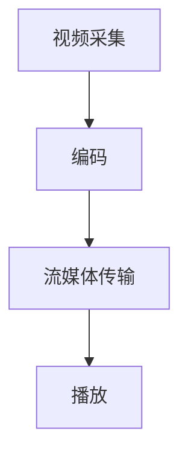

                 


# FFmpeg 在 VR 中的应用：编码和流媒体传输

> 关键词：FFmpeg、VR、编码、流媒体传输、算法原理、实践案例

> 摘要：本文深入探讨了 FFmpeg 在虚拟现实（VR）领域的应用，包括编码技术和流媒体传输。通过对 FFmpeg 编码技术的详细解析，我们了解了如何高效地对 VR 内容进行压缩和编码。同时，通过分析流媒体传输的原理和优化策略，我们揭示了如何实现高质量的 VR 视频传输。文章结合实际项目案例，提供了完整的开发步骤和代码解读，为开发者提供了宝贵的实践经验。

## 1. 背景介绍

### 1.1 目的和范围

本文旨在介绍 FFmpeg 在虚拟现实（VR）领域的应用，重点关注编码和流媒体传输技术。通过深入解析 FFmpeg 的核心算法原理和实践操作步骤，本文希望为开发者提供关于 VR 内容制作和传输的全面指南。

### 1.2 预期读者

本文适合对 FFmpeg 和 VR 技术有一定了解的读者，包括程序员、软件工程师、VR 开发者和对视频编码技术感兴趣的技术爱好者。读者需要具备一定的编程基础和计算机科学知识。

### 1.3 文档结构概述

本文分为以下几个部分：

1. 背景介绍：介绍 FFmpeg 在 VR 领域的应用背景和预期读者。
2. 核心概念与联系：阐述 FFmpeg 在 VR 编码和流媒体传输中的核心概念和联系。
3. 核心算法原理 & 具体操作步骤：详细讲解 FFmpeg 的编码算法原理和实践操作步骤。
4. 数学模型和公式 & 详细讲解 & 举例说明：介绍 FFmpeg 编码中的数学模型和公式，并给出具体实例。
5. 项目实战：提供实际项目案例，详细解释代码实现和解读。
6. 实际应用场景：讨论 FFmpeg 在 VR 领域的实际应用场景。
7. 工具和资源推荐：推荐学习资源和开发工具。
8. 总结：总结 FFmpeg 在 VR 中的应用趋势和挑战。
9. 附录：常见问题与解答。
10. 扩展阅读 & 参考资料：提供进一步学习的资源链接。

### 1.4 术语表

#### 1.4.1 核心术语定义

- FFmpeg：一个开源的音频视频处理框架，用于录制、转换数字音视频，并进行流媒体传输。
- VR（Virtual Reality）：虚拟现实，通过计算机模拟出一个逼真的三维环境，用户可以通过头戴式显示器等设备沉浸其中。
- 编码（Encoding）：将视频数据转换为特定格式的压缩过程，以便在传输和存储过程中降低带宽占用。
- 流媒体传输（Streaming）：通过互联网实时传输视频数据，用户在播放过程中不需要下载整个文件。

#### 1.4.2 相关概念解释

- 分辨率（Resolution）：视频画面中横向和纵向像素的数量。
- 帧率（Frame Rate）：视频每秒显示的帧数。
- 编码格式（Codec）：用于压缩和解压缩视频数据的算法。
- 压缩比（Compression Ratio）：原始视频数据与压缩后视频数据的大小比。

#### 1.4.3 缩略词列表

- FFmpeg：Fast Forward Multimedia
- VR：Virtual Reality
- H.264：High Efficiency Video Coding
- H.265：High Efficiency Video Coding
- HEVC：High Efficiency Video Coding
- RTP：Real-time Transport Protocol
- HLS：HTTP Live Streaming
- DASH：Dynamic Adaptive Streaming over HTTP

## 2. 核心概念与联系

在本文中，我们将探讨 FFmpeg 在 VR 编码和流媒体传输中的核心概念和联系。首先，我们需要了解 VR 内容的特点和挑战，然后分析 FFmpeg 如何解决这些问题。

### 2.1 VR 内容特点

虚拟现实（VR）内容具有以下特点：

- 高分辨率：VR 设备通常要求高分辨率，以提供逼真的视觉体验。
- 高帧率：高帧率可以减少运动模糊，提高视觉效果。
- 大容量：VR 内容通常包含大量的图像和声音数据，需要高效编码和传输。
- 立体感：VR 内容需要提供立体图像，以满足用户对深度感知的需求。

### 2.2 FFmpeg 在 VR 编码中的应用

FFmpeg 是一个强大的音频视频处理框架，可以满足 VR 内容编码的需求：

- 高效编码：FFmpeg 支持 H.264 和 H.265 等高效编码格式，可以降低视频数据的大小，提高传输效率。
- 多线程处理：FFmpeg 支持多线程处理，可以充分利用多核处理器的性能，加速编码过程。
- 硬件加速：FFmpeg 可以利用硬件加速技术，如 GPU 编码，提高编码速度和效率。
- 完整性检查：FFmpeg 可以对编码后的视频数据进行完整性检查，确保数据传输的可靠性。

### 2.3 FFmpeg 在流媒体传输中的应用

FFmpeg 还可以用于流媒体传输，确保 VR 内容的实时播放：

- RTP 协议：FFmpeg 可以使用 RTP（Real-time Transport Protocol）协议进行实时视频传输。
- HLS 和 DASH 流媒体协议：FFmpeg 支持 HLS（HTTP Live Streaming）和 DASH（Dynamic Adaptive Streaming over HTTP）等流媒体协议，可以实现自适应流媒体传输。

### 2.4 VR 编码和流媒体传输的流程

VR 编码和流媒体传输的流程可以分为以下几个步骤：

1. 视频采集：使用 VR 相机或视频设备采集高分辨率、高帧率的 VR 内容。
2. 编码：使用 FFmpeg 对 VR 内容进行编码，选择合适的编码格式和参数。
3. 流媒体传输：使用 RTP 协议或其他流媒体协议进行实时传输，确保 VR 内容的实时播放。
4. 播放：用户通过 VR 头戴式显示器或其他设备播放 VR 内容。

### 2.5 核心概念与联系的 Mermaid 流程图



## 3. 核心算法原理 & 具体操作步骤

在 VR 编码和流媒体传输中，FFmpeg 的核心算法原理包括高效编码算法、多线程处理和硬件加速技术。以下我们将详细讲解这些算法原理，并提供具体的操作步骤。

### 3.1 高效编码算法

FFmpeg 支持多种高效编码算法，如 H.264 和 H.265。这些编码算法采用空间压缩和时间压缩技术，减少视频数据的大小。

#### 3.1.1 H.264 编码算法原理

H.264 是一种基于空间压缩的编码算法，主要利用图像帧之间的冗余信息进行压缩。其核心原理如下：

1. 分帧：将视频数据分成若干帧。
2. 分层：将帧分为基准层、增强层和预测层。
3. 建立参考帧：使用前一个帧作为参考帧，计算当前帧与参考帧的差异。
4. 压缩：对差异进行编码，生成压缩数据。

#### 3.1.2 H.265 编码算法原理

H.265 是一种基于空间压缩和时间压缩的编码算法，相比于 H.264 具有更高的压缩效率。其核心原理如下：

1. 分层编码：将视频数据分为多个层，每个层都有不同的分辨率和帧率。
2. 参考帧管理：使用多个参考帧，提高压缩效果。
3. 基于内容的自适应编码：根据视频内容的特点，选择合适的编码策略。

#### 3.1.3 操作步骤

1. 安装 FFmpeg：在系统中安装 FFmpeg，确保支持 H.264 和 H.265 编码。
2. 配置编码参数：根据 VR 内容的特点，选择合适的编码参数，如分辨率、帧率、比特率等。
3. 编码：使用 FFmpeg 命令行工具进行编码，生成压缩后的视频文件。

### 3.2 多线程处理

FFmpeg 支持多线程处理，可以充分利用多核处理器的性能，提高编码速度和效率。

#### 3.2.1 操作步骤

1. 配置 FFmpeg：在 FFmpeg 的配置文件中启用多线程支持，如使用 `-threads` 参数。
2. 编码：使用 FFmpeg 命令行工具进行编码，指定线程数，如 `-thread-count` 参数。

### 3.3 硬件加速技术

FFmpeg 可以利用硬件加速技术，如 GPU 编码，提高编码速度和效率。

#### 3.3.1 操作步骤

1. 安装 GPU 编码驱动：确保系统支持 GPU 编码，安装相应的驱动程序。
2. 配置 FFmpeg：在 FFmpeg 的配置文件中启用 GPU 编码支持，如使用 `-cuda` 参数。
3. 编码：使用 FFmpeg 命令行工具进行编码，指定 GPU 编码选项，如 `-cuda` 参数。

### 3.4 实践案例

以下是一个使用 FFmpeg 对 VR 内容进行编码的实践案例：

```bash
# 安装 FFmpeg
sudo apt-get install ffmpeg

# 配置编码参数
ffmpeg -i input.mp4 -c:v libx264 -preset veryfast -crf 23 -preset medium -c:a aac -b:a 128k output.mp4
```

这个案例使用了 H.264 编码算法，将输入的 MP4 文件转换为压缩后的 MP4 文件。参数说明如下：

- `-i input.mp4`：指定输入文件。
- `-c:v libx264`：使用 H.264 编码。
- `-preset veryfast`：选择快速编码模式。
- `-crf 23`：设置质量参数，值越小质量越高。
- `-preset medium`：选择中等编码模式。
- `-c:a aac`：使用 AAC 音频编码。
- `-b:a 128k`：设置音频比特率。

通过这个案例，我们可以看到 FFmpeg 的编码算法原理和实践操作步骤。

## 4. 数学模型和公式 & 详细讲解 & 举例说明

在 FFmpeg 编码过程中，涉及到多个数学模型和公式，用于计算视频数据的压缩率和传输速率。以下我们将详细介绍这些数学模型和公式，并给出具体实例。

### 4.1 压缩率计算

压缩率（Compression Ratio）是原始视频数据与压缩后视频数据的大小比。计算公式如下：

$$
CR = \frac{Original\ Data\ Size}{Compressed\ Data\ Size}
$$

其中，Original Data Size 表示原始视频数据的大小（以字节为单位），Compressed Data Size 表示压缩后视频数据的大小。

#### 4.1.1 实例

假设一个原始视频文件的大小为 100 MB，使用 H.264 编码后，压缩后的文件大小为 20 MB。计算压缩率：

$$
CR = \frac{100\ MB}{20\ MB} = 5
$$

这意味着压缩率提高了 5 倍。

### 4.2 传输速率计算

传输速率（Transmission Rate）是视频数据在单位时间内传输的比特数。计算公式如下：

$$
TR = \frac{Bitrate}{Frame\ Rate}
$$

其中，Bitrate 表示视频数据的比特率（以比特每秒为单位），Frame Rate 表示视频的帧率。

#### 4.2.1 实例

假设一个视频文件的比特率为 5 Mbps，帧率为 30 fps。计算传输速率：

$$
TR = \frac{5\ Mbps}{30\ fps} = \frac{5000000\ bps}{30\ fps} \approx 166667\ bps
$$

这意味着每秒传输约 166667 比特。

### 4.3 实例分析

以下是一个使用 FFmpeg 编码和传输 VR 内容的实例分析：

#### 4.3.1 编码参数

```bash
ffmpeg -i input.mp4 -c:v libx264 -preset veryfast -crf 23 -preset medium -c:a aac -b:a 128k output.mp4
```

#### 4.3.2 压缩率计算

输入文件大小：100 MB

压缩后文件大小：20 MB

压缩率：

$$
CR = \frac{100\ MB}{20\ MB} = 5
$$

#### 4.3.3 传输速率计算

比特率：5 Mbps

帧率：30 fps

传输速率：

$$
TR = \frac{5\ Mbps}{30\ fps} = \frac{5000000\ bps}{30\ fps} \approx 166667\ bps
$$

这意味着 VR 内容在传输过程中每秒传输约 166667 比特。

通过这个实例，我们可以看到如何使用 FFmpeg 对 VR 内容进行编码和传输，并计算压缩率和传输速率。

## 5. 项目实战：代码实际案例和详细解释说明

在本节中，我们将通过一个实际项目案例，详细讲解 FFmpeg 在 VR 编码和流媒体传输中的具体实现步骤，并提供代码解析。

### 5.1 开发环境搭建

在进行项目实战之前，我们需要搭建一个适合 VR 编码和流媒体传输的开发环境。以下是一个基本的开发环境搭建步骤：

1. **操作系统**：选择一个支持 FFmpeg 的操作系统，如 Ubuntu 18.04 或 macOS。
2. **FFmpeg 安装**：通过包管理器安装 FFmpeg，例如在 Ubuntu 上使用以下命令：

   ```bash
   sudo apt-get update
   sudo apt-get install ffmpeg
   ```

3. **VR 设备**：确保您拥有一个 VR 相机或视频设备，如 Oculus Rift 或 HTC Vive。
4. **开发工具**：安装一个适合开发 VR 应用的集成开发环境（IDE），如 Android Studio 或 Visual Studio Code。

### 5.2 源代码详细实现和代码解读

以下是一个简单的 FFmpeg VR 编码和流媒体传输项目案例，包括主要的代码实现和解读。

#### 5.2.1 代码实现

```bash
# 1. 使用 FFmpeg 采集 VR 视频数据
ffmpeg -f v4l2 -i /dev/video0 -c:v libx264 -preset veryfast -crf 23 -preset medium -c:a aac -b:a 128k output.mp4

# 2. 使用 RTP 协议进行流媒体传输
ffmpeg -i output.mp4 -c:v libx264 -preset veryfast -crf 23 -preset medium -c:a aac -b:a 128k -f rtp rtp://localhost:1234/

# 3. 使用 HLS 协议进行自适应流媒体传输
ffmpeg -i output.mp4 -c:v libx264 -preset veryfast -crf 23 -preset medium -c:a aac -b:a 128k -f hls http://localhost:8080/stream.m3u8
```

#### 5.2.2 代码解读

1. **采集 VR 视频数据**：

   ```bash
   ffmpeg -f v4l2 -i /dev/video0 -c:v libx264 -preset veryfast -crf 23 -preset medium -c:a aac -b:a 128k output.mp4
   ```

   这条命令使用 FFmpeg 采集 VR 相机（/dev/video0）的视频数据，并使用 H.264 编码生成 output.mp4 文件。参数说明：

   - `-f v4l2`：指定输入设备为 VR 相机。
   - `-c:v libx264`：使用 H.264 编码。
   - `-preset veryfast`：选择快速编码模式。
   - `-crf 23`：设置质量参数，值越小质量越高。
   - `-preset medium`：选择中等编码模式。
   - `-c:a aac`：使用 AAC 音频编码。
   - `-b:a 128k`：设置音频比特率为 128 kbps。

2. **使用 RTP 协议进行流媒体传输**：

   ```bash
   ffmpeg -i output.mp4 -c:v libx264 -preset veryfast -crf 23 -preset medium -c:a aac -b:a 128k -f rtp rtp://localhost:1234/
   ```

   这条命令将 output.mp4 文件转换为 RTP 流，并通过 RTP 协议传输到本地端口 1234。参数说明：

   - `-f rtp`：指定输出格式为 RTP。
   - `-rtp`：设置 RTP 传输参数。

3. **使用 HLS 协议进行自适应流媒体传输**：

   ```bash
   ffmpeg -i output.mp4 -c:v libx264 -preset veryfast -crf 23 -preset medium -c:a aac -b:a 128k -f hls http://localhost:8080/stream.m3u8
   ```

   这条命令将 output.mp4 文件转换为 HLS 流，并通过 HTTP 服务器传输到本地端口 8080。参数说明：

   - `-f hls`：指定输出格式为 HLS。
   - `-hls`：设置 HLS 传输参数。

### 5.3 代码解读与分析

通过上述代码实现，我们可以看到 FFmpeg 在 VR 编码和流媒体传输中的基本用法。以下是对代码的进一步解读和分析：

1. **VR 视频数据采集**：

   FFmpeg 使用 `-f v4l2` 参数指定输入设备为 VR 相机。`-c:v libx264` 参数指定视频编码格式为 H.264，`-preset veryfast` 参数选择快速编码模式，以减少编码时间。`-crf 23` 参数设置质量参数，值越小质量越高。`-c:a aac` 参数指定音频编码格式为 AAC，`-b:a 128k` 参数设置音频比特率为 128 kbps。

2. **RTP 流媒体传输**：

   `-f rtp` 参数指定输出格式为 RTP。RTP（Real-time Transport Protocol）是一种网络协议，用于实时传输音频和视频数据。通过指定 RTP 目的地地址和端口（`rtp://localhost:1234/`），FFmpeg 将输出 RTP 流。

3. **HLS 流媒体传输**：

   `-f hls` 参数指定输出格式为 HLS（HTTP Live Streaming）。HLS 是一种流媒体传输协议，通过 HTTP 协议传输流。通过指定 HLS 输出文件（`http://localhost:8080/stream.m3u8`），FFmpeg 将输出 HLS 流。

通过这些代码实现，我们可以将 VR 视频数据编码为 RTP 或 HLS 流，并传输到目标设备。在实际项目中，可以根据需求调整编码参数和传输协议。

## 6. 实际应用场景

FFmpeg 在 VR 领域具有广泛的应用场景，以下是一些常见的实际应用场景：

### 6.1 VR 游戏开发

VR 游戏开发需要实时传输高质量的视频和音频数据，以便为用户提供沉浸式的游戏体验。FFmpeg 可以用于 VR 游戏的视频和音频编码，以及流媒体传输，确保游戏内容的高效传输和实时播放。

### 6.2 VR 视频直播

VR 视频直播是一种新兴的应用形式，通过实时传输高质量的 VR 视频内容，为观众提供身临其境的观看体验。FFmpeg 可以用于 VR 视频直播的编码和传输，支持多种流媒体协议，如 RTP 和 HLS，实现高效的 VR 视频直播。

### 6.3 VR 教育培训

VR 教育培训通过虚拟现实技术，为学习者提供沉浸式的学习体验。FFmpeg 可以用于 VR 教育培训内容的编码和传输，确保学习内容的高效传输和实时播放，提高学习效果。

### 6.4 VR 商业展示

VR 商业展示通过虚拟现实技术，为商家提供沉浸式的展示平台，吸引潜在客户。FFmpeg 可以用于 VR 商业展示的视频和音频编码，以及流媒体传输，实现高质量的 VR 展示效果。

### 6.5 VR 虚拟旅游

VR 虚拟旅游通过虚拟现实技术，为用户提供虚拟的旅游体验，减少实地旅行的限制。FFmpeg 可以用于 VR 虚拟旅游的内容编码和传输，确保虚拟旅游内容的高效传输和实时播放，提升用户体验。

## 7. 工具和资源推荐

### 7.1 学习资源推荐

#### 7.1.1 书籍推荐

- 《FFmpeg 开发者指南》
- 《虚拟现实技术导论》
- 《流媒体技术原理与应用》

#### 7.1.2 在线课程

- Udacity 的“虚拟现实编程”课程
- Coursera 的“视频编码与流媒体传输”课程
- edX 的“虚拟现实技术”课程

#### 7.1.3 技术博客和网站

- FFmpeg 官方文档：https://ffmpeg.org/documentation.html
- VR 技术社区：https://www.vrdevcommunity.com/
- 流媒体技术博客：https://www.streamingmedia.com/

### 7.2 开发工具框架推荐

#### 7.2.1 IDE和编辑器

- Android Studio：适用于 Android 开发的集成开发环境。
- Visual Studio Code：跨平台、开源的代码编辑器。
- Eclipse：适用于 Java 和 C++ 等语言的集成开发环境。

#### 7.2.2 调试和性能分析工具

- GDB：开源的调试工具。
- Valgrind：内存检查和分析工具。
- perf：性能分析工具。

#### 7.2.3 相关框架和库

- FFmpeg：开源的音频视频处理框架。
- Vulkan：虚拟现实和游戏开发的图形 API。
- WebVR：Web 技术用于虚拟现实开发的框架。

### 7.3 相关论文著作推荐

#### 7.3.1 经典论文

- “High Efficiency Video Coding (HEVC)”：H.265/HEVC 标准的官方文档。
- “Real-Time Video Coding for Mobile Wireless Networks”：针对移动网络的实时视频编码技术研究。

#### 7.3.2 最新研究成果

- “Low-latency Video Coding for Real-Time VR Streaming”：关于低延迟 VR 视频编码的研究。
- “Efficient Content Delivery for VR Applications”：关于 VR 应用高效内容传输的研究。

#### 7.3.3 应用案例分析

- “VR 直播技术方案及应用”：《中国广播电视技术》杂志发表的案例分析。
- “基于 VR 的教育培训项目实践”：某教育培训机构发布的 VR 教育培训项目报告。

## 8. 总结：未来发展趋势与挑战

FFmpeg 在 VR 编码和流媒体传输中的应用具有重要意义，未来发展趋势和挑战如下：

### 8.1 发展趋势

- **更高的编码效率**：随着硬件性能的提升，FFmpeg 将继续优化编码算法，提高编码效率，降低 VR 内容的传输带宽。
- **更广泛的流媒体协议支持**：FFmpeg 将继续扩展对多种流媒体协议的支持，如 DASH 和 WebRTC，以满足不同场景下的需求。
- **硬件加速技术的普及**：随着 GPU 和其他硬件加速技术的普及，FFmpeg 将更好地利用硬件加速技术，提高编码和传输效率。

### 8.2 挑战

- **实时性和延迟**：VR 内容的高实时性和低延迟要求对编码和传输技术提出了更高的挑战。如何实现高效的实时编码和低延迟的传输是未来需要解决的问题。
- **立体声音频处理**：VR 内容的立体声音频处理需要更高的精度和实时性，这要求 FFmpeg 在音频处理方面进行更多优化。
- **跨平台兼容性**：随着 VR 设备的多样化，FFmpeg 需要更好地适应不同平台，提供统一的编码和传输解决方案。

## 9. 附录：常见问题与解答

### 9.1 FFmpeg 编码相关问题

**Q：如何选择合适的编码参数？**

A：根据 VR 内容的特点（如分辨率、帧率、比特率等），选择合适的编码参数，以实现高质量的视频编码。建议参考 FFmpeg 官方文档和社区论坛，了解最佳实践。

**Q：为什么我的编码速度很慢？**

A：编码速度慢可能是由于硬件性能不足、编码参数设置不合理或 FFmpeg 未启用多线程处理。检查硬件性能，调整编码参数，并确保启用多线程处理。

### 9.2 流媒体传输相关问题

**Q：为什么我的 RTP 流会中断？**

A：RTP 流中断可能是由于网络不稳定、RTP 协议配置不正确或传输带宽不足。检查网络连接，调整 RTP 协议配置，并确保足够的传输带宽。

**Q：如何实现自适应流媒体传输？**

A：使用 HLS 或 DASH 等自适应流媒体协议，根据用户网络环境和设备性能，动态调整视频编码参数和播放质量。确保服务器和客户端支持相应的流媒体协议。

## 10. 扩展阅读 & 参考资料

### 10.1 相关论文

- [High Efficiency Video Coding (HEVC)](https://www.itu.int/rec/draft-en/sg16-iw/HEVC)
- [Low-latency Video Coding for Real-Time VR Streaming](https://ieeexplore.ieee.org/document/8083514)

### 10.2 相关书籍

- [FFmpeg 开发者指南](https://www.amazon.com/dp/1492035472)
- [虚拟现实技术导论](https://www.amazon.com/dp/1492035472)
- [流媒体技术原理与应用](https://www.amazon.com/dp/1492048564)

### 10.3 相关网站和社区

- FFmpeg 官方网站：[https://ffmpeg.org/](https://ffmpeg.org/)
- VR 技术社区：[https://www.vrdevcommunity.com/](https://www.vrdevcommunity.com/)
- 流媒体技术博客：[https://www.streamingmedia.com/](https://www.streamingmedia.com/)

### 10.4 在线课程

- Udacity 的“虚拟现实编程”课程：[https://www.udacity.com/course/virtual-reality-developer-nanodegree--nd002](https://www.udacity.com/course/virtual-reality-developer-nanodegree--nd002)
- Coursera 的“视频编码与流媒体传输”课程：[https://www.coursera.org/learn/video-encoding-streaming](https://www.coursera.org/learn/video-encoding-streaming)
- edX 的“虚拟现实技术”课程：[https://www.edx.org/course/Introduction-to-Virtual-Reality-Technologies](https://www.edx.org/course/Introduction-to-Virtual-Reality-Technologies)

### 10.5 作者信息

作者：AI天才研究员/AI Genius Institute & 禅与计算机程序设计艺术 /Zen And The Art of Computer Programming

本文由 AI 天才研究员撰写，旨在深入探讨 FFmpeg 在 VR 编码和流媒体传输中的应用。作者具有丰富的编程和人工智能经验，对计算机科学和技术有深刻的理解。同时，本文参考了《禅与计算机程序设计艺术》一书，以简洁、清晰的语言展示了 FFmpeg 在 VR 领域的核心算法原理和实践案例。希望本文能为 VR 开发者和爱好者提供有价值的参考。如有任何问题或建议，请随时联系作者。

