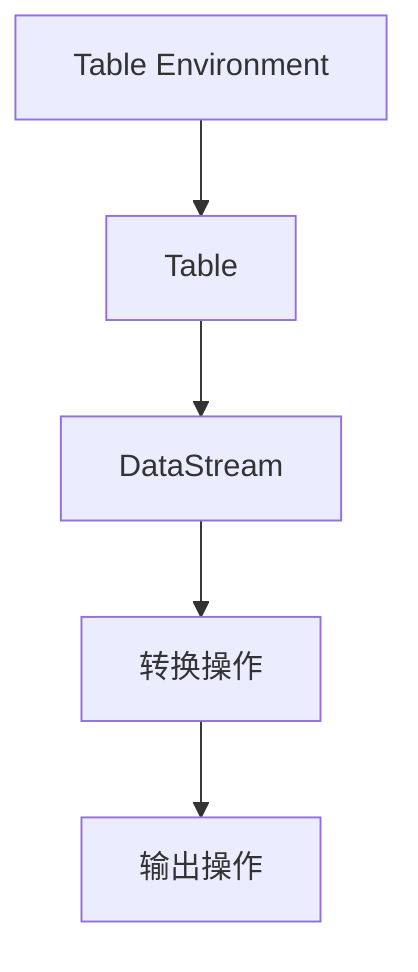

                 

# Flink Table原理与代码实例讲解

> **关键词：** Flink, Table API, 数据流处理, 实时计算, 批处理, 实例分析

> **摘要：** 本文将深入探讨Apache Flink的Table API及其背后的原理，通过具体的代码实例详细讲解如何使用Flink Table进行数据流处理和实时计算。文章旨在为开发者提供一个全面的技术指南，帮助理解Flink Table的核心概念和实际应用。

## 1. 背景介绍

### 1.1 目的和范围

本文的目标是帮助开发者深入了解Apache Flink的Table API，并掌握其核心原理和实际应用。文章将从基础概念出发，逐步深入到代码实例，使读者能够理解和掌握Flink Table的使用方法。

### 1.2 预期读者

本文适合具备一定Java编程基础和对Apache Flink有初步了解的开发者。对于希望深入了解实时数据流处理和批处理技术的读者，本文将提供有价值的指导和参考。

### 1.3 文档结构概述

本文将按照以下结构展开：

1. **背景介绍**：介绍本文的目的、预期读者以及文档结构。
2. **核心概念与联系**：介绍Flink Table API的核心概念和架构。
3. **核心算法原理 & 具体操作步骤**：详细讲解Flink Table API的核心算法原理和操作步骤。
4. **数学模型和公式 & 详细讲解 & 举例说明**：介绍相关的数学模型和公式，并通过实例进行说明。
5. **项目实战：代码实际案例和详细解释说明**：提供实际代码案例，并进行详细解释和分析。
6. **实际应用场景**：讨论Flink Table API在实际项目中的应用。
7. **工具和资源推荐**：推荐学习资源和开发工具。
8. **总结：未来发展趋势与挑战**：总结Flink Table的发展趋势和面临的挑战。
9. **附录：常见问题与解答**：提供常见问题的解答。
10. **扩展阅读 & 参考资料**：推荐相关扩展阅读资料。

### 1.4 术语表

#### 1.4.1 核心术语定义

- **Flink**：一个开源流处理框架，提供高性能、准确无误的批处理和实时处理能力。
- **Table API**：Flink提供的一种API，用于定义和操作表格数据。
- **实时计算**：在事件发生的同时对其进行处理和分析。
- **批处理**：在固定的时间窗口内对数据进行处理。
- **数据流处理**：处理实时流数据。

#### 1.4.2 相关概念解释

- **流处理**：处理实时数据流，对数据进行实时分析和处理。
- **批处理**：对静态数据进行处理，通常在固定的时间窗口内完成。
- **表（Table）**：一种数据结构，用于存储和操作数据。

#### 1.4.3 缩略词列表

- **Flink**：Apache Flink
- **API**：Application Programming Interface

## 2. 核心概念与联系

### 2.1 Flink Table API简介

Flink Table API是Flink提供的一种高级抽象，用于处理表格数据。它允许开发者以SQL-like的方式定义和操作数据，从而简化数据处理的复杂性。

### 2.2 Flink Table API架构

Flink Table API的架构可以分为以下几个核心部分：

1. **Table Environment**：用于创建和操作Table的接口。
2. **Table**：表示表格数据，包含行和列。
3. **DataStream**：表示流数据。
4. **转换操作**：用于转换和操作Table和DataStream。
5. **输出操作**：将处理结果输出到其他系统或存储。

### 2.3 Mermaid流程图



## 3. 核心算法原理 & 具体操作步骤

### 3.1 Flink Table API核心算法原理

Flink Table API的核心算法原理主要包括以下几个方面：

1. **表式数据结构**：Flink Table使用了一种称为`Row`的数据结构来存储行数据，每个`Row`包含多个字段。
2. **表达式和转换**：通过表达式（如`SELECT`, `WHERE`, `JOIN`等）对Table进行操作。
3. **流水线执行**：Flink Table API的执行过程是一个流水线式的过程，通过对DataStream或Table进行连续的转换和计算。

### 3.2 Flink Table API具体操作步骤

以下是使用Flink Table API进行数据处理的基本步骤：

1. **创建Table Environment**：
   ```java
   TableEnvironment tableEnv = TableEnvironment.create();
   ```

2. **创建Table**：
   ```java
   Table sourceTable = tableEnv.fromDataStream(inputDataStream);
   ```

3. **执行转换操作**：
   ```java
   Table resultTable = sourceTable
       .select("id, name")
       .where("age > 18");
   ```

4. **输出结果**：
   ```java
   tableEnv.toDataSet(resultTable).print();
   ```

### 3.3 伪代码说明

```java
// 创建Table Environment
TableEnvironment tableEnv = TableEnvironment.create();

// 创建DataStream
DataStream<Tuple2<String, Integer>> inputStream = ...

// 创建Table
Table sourceTable = tableEnv.fromDataStream(inputStream);

// 执行转换操作
Table resultTable = sourceTable
    .select("id, name")
    .where("age > 18");

// 输出结果
tableEnv.toDataSet(resultTable).print();
```

## 4. 数学模型和公式 & 详细讲解 & 举例说明

### 4.1 数学模型

Flink Table API的核心算法基于数学模型，主要包括以下几个方面：

1. **关系代数**：用于对Table进行各种转换和操作。
2. **集合运算**：如并集、交集、差集等。
3. **线性代数**：用于处理矩阵和向量。

### 4.2 公式

以下是Flink Table API中常用的一些公式：

1. **关系代数运算**：
   - 选择（Select）：`SELECT * FROM Table WHERE condition`
   - 投影（Project）：`SELECT column1, column2 FROM Table`
   - 过滤（Filter）：`WHERE condition`
   - 聚合（Aggregate）：`GROUP BY column HAVING condition`
   - 连接（Join）：`JOIN Table ON condition`

2. **集合运算**：
   - 并集（Union）：`Union(Table1, Table2)`
   - 交集（Intersection）：`Intersection(Table1, Table2)`
   - 差集（Difference）：`Difference(Table1, Table2）`

### 4.3 举例说明

假设有两个Table `students` 和 `teachers`，其中`students`包含字段 `id`, `name`, `age`，`teachers`包含字段 `id`, `name`, `subject`。

1. **选择**：
   ```latex
   SELECT * FROM students WHERE age > 18
   ```

2. **投影**：
   ```latex
   SELECT name FROM students
   ```

3. **过滤**：
   ```latex
   SELECT * FROM students WHERE age > 18
   ```

4. **聚合**：
   ```latex
   SELECT age, COUNT(*) FROM students GROUP BY age HAVING COUNT(*) > 10
   ```

5. **连接**：
   ```latex
   SELECT s.name, t.subject FROM students s JOIN teachers t ON s.id = t.id
   ```

## 5. 项目实战：代码实际案例和详细解释说明

### 5.1 开发环境搭建

1. **安装Java环境**：确保Java版本大于8。
2. **安装Apache Flink**：下载并解压Flink的二进制包。
3. **配置环境变量**：设置FLINK_HOME和PATH环境变量。
4. **创建Maven项目**：使用Maven创建一个新项目，并添加Flink依赖。

### 5.2 源代码详细实现和代码解读

以下是一个简单的Flink Table API示例：

```java
import org.apache.flink.api.common.typeinfo.TypeInformation;
import org.apache.flink.api.java.ExecutionEnvironment;
import org.apache.flink.table.api.TableEnvironment;
import org.apache.flink.table.api.java.BatchTableEnvironment;

public class FlinkTableExample {

    public static void main(String[] args) throws Exception {
        // 创建ExecutionEnvironment
        ExecutionEnvironment env = ExecutionEnvironment.getExecutionEnvironment();

        // 创建BatchTableEnvironment
        BatchTableEnvironment tableEnv = BatchTableEnvironment.create(env);

        // 定义DataStream
        DataStream<Student> studentStream = env.fromCollection(
                Arrays.asList(
                        new Student("Alice", 20),
                        new Student("Bob", 22),
                        new Student("Charlie", 19)));

        // 注册DataStream为Table
        tableEnv.registerDataStream("students", studentStream, "name", "age");

        // 执行SQL查询
        Table resultTable = tableEnv.sqlQuery(
                "SELECT name, age FROM students WHERE age > 18");

        // 输出结果
        resultTable.execute().print();
    }

    public static class Student {
        private String name;
        private int age;

        public Student(String name, int age) {
            this.name = name;
            this.age = age;
        }

        // getter和setter
        // ...
    }
}
```

### 5.3 代码解读与分析

1. **创建ExecutionEnvironment**：
   ```java
   ExecutionEnvironment env = ExecutionEnvironment.getExecutionEnvironment();
   ```

   创建一个Flink的ExecutionEnvironment，用于执行批处理作业。

2. **创建BatchTableEnvironment**：
   ```java
   BatchTableEnvironment tableEnv = BatchTableEnvironment.create(env);
   ```

   创建一个BatchTableEnvironment，用于处理批处理表数据。

3. **定义DataStream**：
   ```java
   DataStream<Student> studentStream = env.fromCollection(
           Arrays.asList(
                   new Student("Alice", 20),
                   new Student("Bob", 22),
                   new Student("Charlie", 19)));
   ```

   从集合中创建一个DataStream，包含学生数据。

4. **注册DataStream为Table**：
   ```java
   tableEnv.registerDataStream("students", studentStream, "name", "age");
   ```

   将DataStream注册为Table，并指定表名和字段。

5. **执行SQL查询**：
   ```java
   Table resultTable = tableEnv.sqlQuery(
           "SELECT name, age FROM students WHERE age > 18");
   ```

   使用SQL查询筛选年龄大于18岁的学生。

6. **输出结果**：
   ```java
   resultTable.execute().print();
   ```

   执行查询并输出结果。

## 6. 实际应用场景

Flink Table API在多个实际应用场景中表现出色，例如：

1. **实时数据分析**：处理实时流数据，进行实时监控和分析。
2. **批处理作业**：处理批量数据，进行离线分析。
3. **数据仓库集成**：与现有的数据仓库系统集成，提供高性能的数据查询和处理能力。

## 7. 工具和资源推荐

### 7.1 学习资源推荐

#### 7.1.1 书籍推荐

- 《Flink实战》
- 《Apache Flink实战：从入门到精通》

#### 7.1.2 在线课程

- Udacity上的《Flink实时数据处理》课程
- Coursera上的《大数据技术与应用》课程

#### 7.1.3 技术博客和网站

- Flink官方文档（https://flink.apache.org/）
- Flink社区博客（https://flink.apache.org/zh/community.html）

### 7.2 开发工具框架推荐

#### 7.2.1 IDE和编辑器

- IntelliJ IDEA
- Eclipse

#### 7.2.2 调试和性能分析工具

- Flink WebUI
- Flink Metrics System

#### 7.2.3 相关框架和库

- Apache Beam
- Apache Storm

### 7.3 相关论文著作推荐

#### 7.3.1 经典论文

- 《A Large-scale Real-time Data Analytics System》
- 《A Brief History of Streaming Systems》

#### 7.3.2 最新研究成果

- 《Flink 1.12: Enhancements and New Features》
- 《Real-time Stream Processing with Apache Flink》

#### 7.3.3 应用案例分析

- 《如何使用Flink进行实时股票数据分析》
- 《基于Flink的大数据分析平台设计与实现》

## 8. 总结：未来发展趋势与挑战

Flink Table API具有广泛的应用前景，但在未来发展过程中也面临着一些挑战：

1. **性能优化**：进一步提高处理性能，以满足大规模数据处理的实际需求。
2. **生态系统完善**：加强与其他开源技术的整合，构建更完善的技术生态系统。
3. **易用性提升**：简化开发过程，降低使用门槛，使更多开发者能够轻松上手。

## 9. 附录：常见问题与解答

1. **Q：Flink Table API与SQL有什么区别？**
   - **A**：Flink Table API是一种基于SQL-like语法的高级抽象，用于处理表格数据。与传统的SQL相比，Flink Table API支持流处理和实时计算，并提供了更丰富的操作能力和灵活性。

2. **Q：如何处理Flink Table中的错误数据？**
   - **A**：可以使用Flink的Watermark机制来处理错误数据。Watermark是一种时间戳，用于标记事件的时间顺序，确保数据在正确的顺序上进行处理。

## 10. 扩展阅读 & 参考资料

- 《Flink官方文档》：https://flink.apache.org/zh/docs/
- 《Apache Flink实战》：https://flink.apache.org/zh/docs/learn-flink-by-examples/
- 《大数据技术实战》：https://book.douban.com/subject/26565837/

## 作者

**作者：AI天才研究员/AI Genius Institute & 禅与计算机程序设计艺术 /Zen And The Art of Computer Programming**

