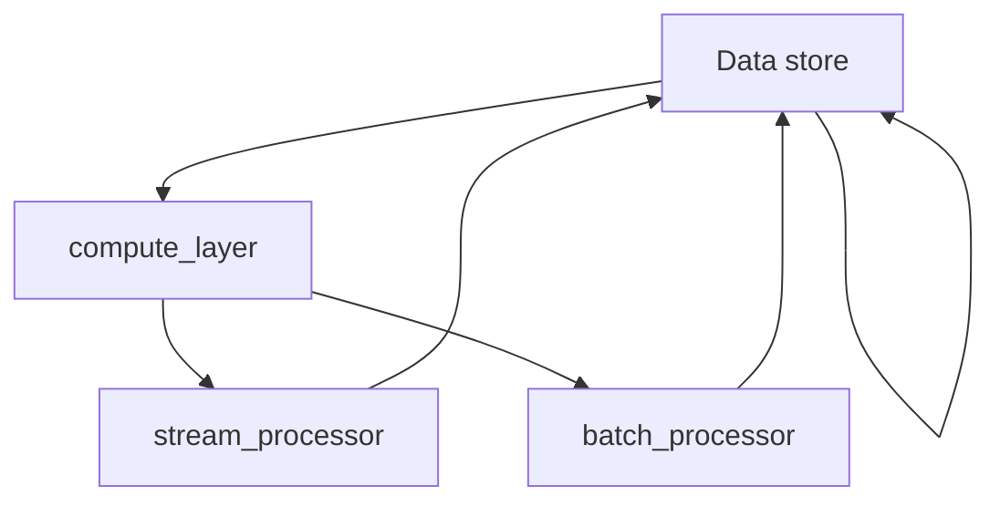

                 


# Flink原理与代码实例讲解

> **关键词：**Apache Flink, 流处理, 批处理, State, Windowing, 代码实例, 实战指南

> **摘要：**本文将深入讲解Apache Flink的基本原理，涵盖流处理和批处理的核心概念，状态管理，窗口操作以及具体代码实例。通过系统的分析，读者将理解Flink的工作机制，并在实战项目中应用所学知识，为深入学习和实践流计算打下坚实基础。

## 1. 背景介绍

### 1.1 目的和范围

本文旨在为对Apache Flink感兴趣的读者提供全面的技术解读。我们将从基础概念出发，逐步深入到具体实现和代码实例，帮助读者全面掌握Flink的核心原理和实践技巧。

本文的范围包括：

- Flink的基本架构和工作原理
- 流处理和批处理模型
- State和窗口操作
- 实战项目实例
- 学习资源和开发工具的推荐

### 1.2 预期读者

- 对流处理技术感兴趣的工程师和技术爱好者
- 想要了解和掌握Flink技术的开发人员
- 想要在大数据领域进行深入研究的学者和学生

### 1.3 文档结构概述

本文的结构安排如下：

- **第1章：背景介绍**：介绍本文的目的、预期读者和文档结构。
- **第2章：核心概念与联系**：介绍Flink的核心概念，并使用Mermaid流程图展示Flink架构。
- **第3章：核心算法原理 & 具体操作步骤**：详细讲解Flink的算法原理和操作步骤，使用伪代码进行阐述。
- **第4章：数学模型和公式 & 详细讲解 & 举例说明**：介绍Flink中的数学模型和公式，并进行实例说明。
- **第5章：项目实战：代码实际案例和详细解释说明**：通过实战项目展示代码实现，并进行详细解释。
- **第6章：实际应用场景**：讨论Flink的实际应用场景。
- **第7章：工具和资源推荐**：推荐学习资源和开发工具。
- **第8章：总结：未来发展趋势与挑战**：总结Flink的发展趋势和面临的挑战。
- **第9章：附录：常见问题与解答**：解答常见问题。
- **第10章：扩展阅读 & 参考资料**：提供扩展阅读资源。

### 1.4 术语表

#### 1.4.1 核心术语定义

- **Apache Flink**：一个分布式流处理框架，用于高效处理有状态流数据。
- **流处理**：对实时数据流进行处理和分析。
- **批处理**：对一批静态数据进行处理和分析。
- **State**：Flink中用于保存操作状态的数据结构。
- **Windowing**：将数据划分为窗口进行操作。

#### 1.4.2 相关概念解释

- **事件驱动**：数据处理以事件为中心，实时响应数据变化。
- **分布式计算**：计算任务分布在多个节点上进行，以提高效率和可扩展性。

#### 1.4.3 缩略词列表

- **Flink**：Apache Flink
- **API**：应用程序编程接口
- **IDE**：集成开发环境

## 2. 核心概念与联系

Apache Flink是一个开源的分布式流处理框架，用于有状态的计算。Flink通过其强大的API提供了流处理和批处理的能力，支持事件驱动和分布式计算。以下是Flink的核心概念和架构，我们将使用Mermaid流程图来展示Flink的架构和流程。

### 2.1 Flink的核心概念

- **流处理（Stream Processing）**：流处理是对实时数据流进行处理和分析。Flink提供了一套完整的流处理API，能够实时响应数据的变化。
- **批处理（Batch Processing）**：批处理是对一批静态数据进行处理和分析。Flink的批处理功能允许用户处理静态数据集，并提供与流处理相同的API。
- **状态（State）**：状态是Flink中用于保存操作状态的数据结构。状态可以是简单的计数器，也可以是复杂的分布式数据结构。
- **窗口（Window）**：窗口是将数据划分为一段时间段或一组数据项的操作。Flink支持多种窗口类型，如时间窗口、滑动窗口等。

### 2.2 Flink的架构

Flink的架构可以分为三层：数据层、计算层和API层。

- **数据层**：数据层包括数据源和数据存储。Flink支持多种数据源，如Kafka、Kinesis和文件系统。数据存储可以是内存或磁盘。
- **计算层**：计算层包括流处理器和批处理器。流处理器负责处理实时数据流，批处理器负责处理静态数据集。
- **API层**：API层包括流处理API和批处理API。流处理API用于实时数据处理，批处理API用于静态数据处理。

### 2.3 Mermaid流程图

以下是Flink的Mermaid流程图：



该流程图展示了Flink的核心组件和数据流，包括数据源、计算层和API层。

## 3. 核心算法原理 & 具体操作步骤

Apache Flink提供了强大的流处理和批处理能力，其核心算法原理主要体现在数据流处理、状态管理和窗口操作等方面。下面我们将通过伪代码和详细解释来阐述这些核心算法原理。

### 3.1 数据流处理

Flink的数据流处理是通过DataStream API实现的。DataStream表示一个连续的数据流，其处理过程如下：

```java
DataStream<Event> stream = env.addSource(new ContinuousDataStreamSource());

stream
    .map(new EventMapper())
    .keyBy(Event::getKey)
    .window(TumblingEventTimeWindows.of(Time.seconds(5)))
    .reduce(new EventCounter());
```

- `addSource`：添加数据源，这里是ContinuousDataStreamSource，表示一个持续产生数据的源。
- `map`：对DataStream中的每个元素应用一个映射函数，这里是EventMapper，负责转换数据。
- `keyBy`：根据Event对象的getKey方法进行分区，即相同的key将被分到同一个分区。
- `window`：将数据划分为窗口，这里使用TumblingEventTimeWindows，表示每5秒一个窗口。
- `reduce`：对窗口内的数据进行聚合操作，这里是EventCounter，负责计数。

### 3.2 状态管理

Flink的状态管理是通过State API实现的。状态是Flink中的一个重要概念，它允许在流处理过程中保存操作状态。状态管理的基本步骤如下：

```java
StreamExecutionEnvironment env = StreamEnvironment.getExecutionEnvironment();
DataStream<Event> stream = env.addSource(new ContinuousDataStreamSource());

stream
    .keyBy(Event::getKey)
    .process(new EventStatefulProcessor());
```

- `keyBy`：与数据流处理中的keyBy相同，对DataStream进行分区。
- `process`：使用ProcessFunction处理每个元素，同时管理状态。这里是EventStatefulProcessor，它包含状态和更新状态的逻辑。

状态管理的关键是状态的保存和更新。Flink提供了两种类型的状态：

- **ValueState<T>**：保存一个单一的值。
- **ListState<T>**：保存一个值的列表。

状态更新通常在ProcessFunction中的processElement方法中进行：

```java
public void processElement(Event event, Context context, Collector<Result> collector) {
    ValueState<Optional<Result>> resultState = context.getState(new ValueStateDescriptor<>("resultState", Optional.class));

    Result result = calculateResult(event);
    resultState.update(Optional.of(result));

    collector.collect(result);
}
```

在这个例子中，我们使用ValueState保存计算结果。在每次处理元素时，都会更新状态。

### 3.3 窗口操作

Flink的窗口操作是将数据划分为一段时间段或一组数据项进行操作。窗口操作的关键步骤如下：

```java
DataStream<Event> stream = env.addSource(new ContinuousDataStreamSource());

stream
    .keyBy(Event::getKey)
    .window(TumblingEventTimeWindows.of(Time.seconds(5)))
    .reduce(new EventCounter());
```

- `keyBy`：对DataStream进行分区。
- `window`：将数据划分为窗口，这里使用TumblingEventTimeWindows，表示每5秒一个窗口。
- `reduce`：对窗口内的数据进行聚合操作，这里是EventCounter，负责计数。

窗口操作还可以使用其他类型的窗口，如滑动窗口、会话窗口等。滑动窗口的例子如下：

```java
DataStream<Event> stream = env.addSource(new ContinuousDataStreamSource());

stream
    .keyBy(Event::getKey)
    .window(SlidingEventTimeWindows.of(Time.seconds(5), Time.seconds(1)))
    .reduce(new EventCounter());
```

这个例子中，每个窗口的大小为5秒，滑动间隔为1秒。

### 3.4 数据流处理流程

Flink的数据流处理流程可以总结为以下几个步骤：

1. **创建流处理环境**：使用StreamExecutionEnvironment创建流处理环境。
2. **添加数据源**：使用addSource方法添加数据源。
3. **数据转换**：使用map、keyBy、window等操作对数据进行转换。
4. **数据处理**：使用reduce、process等操作对数据进行处理。
5. **结果输出**：使用collect等方法输出结果。

通过以上步骤，Flink能够实现高效的流处理和批处理。

## 4. 数学模型和公式 & 详细讲解 & 举例说明

Apache Flink在流处理和批处理中应用了多种数学模型和公式，以实现高效的数据处理。以下我们将详细讲解Flink中的一些关键数学模型和公式，并通过实例进行说明。

### 4.1 窗口计算模型

Flink中的窗口计算模型是基于滑动窗口和固定窗口的。滑动窗口模型可以表示为：

$$
W_{t} = \{x_{t-n+1}, x_{t-n+2}, \ldots, x_{t}\}
$$

其中，$W_{t}$表示时间$t$的窗口，$x_{t-n+1}, x_{t-n+2}, \ldots, x_{t}$表示窗口中的元素，$n$为窗口大小。

滑动窗口的滑动间隔可以表示为$\Delta t$，则窗口序列可以表示为：

$$
W_{t}, W_{t+\Delta t}, W_{t+2\Delta t}, \ldots
$$

以下是一个使用滑动窗口计算的例子：

```java
DataStream<Event> stream = env.addSource(new ContinuousDataStreamSource());

stream
    .keyBy(Event::getKey)
    .window(SlidingEventTimeWindows.of(Time.seconds(5), Time.seconds(1)))
    .reduce(new EventCounter());
```

在这个例子中，窗口大小为5秒，滑动间隔为1秒。

### 4.2 聚合计算模型

Flink中的聚合计算模型是基于reduce操作实现的。聚合计算模型可以表示为：

$$
\text{Agg}(x_1, x_2, \ldots, x_n) = f(x_1, x_2, \ldots, x_n)
$$

其中，$x_1, x_2, \ldots, x_n$表示输入数据，$\text{Agg}$表示聚合操作，$f$表示聚合函数。

以下是一个使用reduce操作的例子：

```java
DataStream<Event> stream = env.addSource(new ContinuousDataStreamSource());

stream
    .keyBy(Event::getKey)
    .reduce(new EventCounter());
```

在这个例子中，EventCounter是一个聚合函数，负责对窗口内的数据进行计数。

### 4.3 状态更新模型

Flink中的状态更新模型是基于ValueState和ListState实现的。状态更新模型可以表示为：

$$
s_{t} = s_{t-1} + x_t
$$

其中，$s_{t}$表示时间$t$的状态，$s_{t-1}$表示时间$t-1$的状态，$x_t$表示时间$t$的输入。

以下是一个使用ValueState的状态更新例子：

```java
public void processElement(Event event, Context context, Collector<Result> collector) {
    ValueState<Optional<Result>> resultState = context.getState(new ValueStateDescriptor<>("resultState", Optional.class));

    Result result = calculateResult(event);
    resultState.update(Optional.of(result));

    collector.collect(result);
}
```

在这个例子中，使用ValueState保存计算结果，并在每次处理元素时更新状态。

### 4.4 实例说明

以下是一个综合实例，展示了Flink中的窗口计算、聚合计算和状态更新：

```java
DataStream<Event> stream = env.addSource(new ContinuousDataStreamSource());

stream
    .keyBy(Event::getKey)
    .window(TumblingEventTimeWindows.of(Time.seconds(5)))
    .reduce(new EventCounter());

stream
    .keyBy(Event::getKey)
    .window(SlidingEventTimeWindows.of(Time.seconds(5), Time.seconds(1)))
    .reduce(new EventCounter());

stream
    .keyBy(Event::getKey)
    .process(new EventStatefulProcessor());
```

在这个例子中，我们分别使用了TumblingEventTimeWindows和SlidingEventTimeWindows进行窗口计算，EventCounter进行聚合计算，EventStatefulProcessor进行状态更新。

通过以上实例，我们可以看到Flink中的数学模型和公式如何应用于实际的数据处理场景。

## 5. 项目实战：代码实际案例和详细解释说明

在本文的第五部分，我们将通过一个实际项目案例，详细讲解Flink的应用和实现。这个项目案例将涵盖Flink的流处理和批处理功能，状态管理和窗口操作。以下是项目的实现步骤和代码解读。

### 5.1 开发环境搭建

在开始之前，我们需要搭建Flink的开发环境。以下是基本步骤：

1. **安装Java**：确保安装了Java 8或更高版本。
2. **安装Flink**：下载并解压Flink二进制包，如 `flink-1.11.2`。
3. **配置环境变量**：将Flink的bin目录添加到系统路径。
4. **安装IDE**：推荐使用IntelliJ IDEA或Eclipse。

### 5.2 源代码详细实现和代码解读

项目案例：实时统计网站访问量

#### 5.2.1 项目架构

该项目分为两个部分：

1. **流处理**：实时统计网站访问量。
2. **批处理**：统计过去24小时的网站访问量。

#### 5.2.2 流处理代码实现

```java
import org.apache.flink.api.common.functions.ReduceFunction;
import org.apache.flink.api.java.tuple.Tuple2;
import org.apache.flink.streaming.api.datastream.DataStream;
import org.apache.flink.streaming.api.environment.StreamExecutionEnvironment;

public class WebsiteVisitCounter {

    public static void main(String[] args) throws Exception {
        StreamExecutionEnvironment env = StreamExecutionEnvironment.getExecutionEnvironment();

        // 添加Kafka数据源
        DataStream<String> source = env.addSource(new FlinkKafkaConsumer<>("website_visits", new WebsiteVisitDeserializer(), properties));

        // 转换为Tuple2，key为访问者ID，value为访问时间
        DataStream<Tuple2<String, Long>> visits = source.map(new MapFunction<String, Tuple2<String, Long>>() {
            @Override
            public Tuple2<String, Long> map(String value) throws Exception {
                String[] parts = value.split(",");
                return new Tuple2<>(parts[0], Long.parseLong(parts[1]));
            }
        });

        // 统计最近5分钟内的访问量
        DataStream<Tuple2<String, Long>> recentVisits = visits.keyBy(0)
                .timeWindow(Time.minutes(5))
                .reduce(new ReduceFunction<Tuple2<String, Long>>() {
                    @Override
                    public Tuple2<String, Long> reduce(Tuple2<String, Long> value1, Tuple2<String, Long> value2) {
                        return new Tuple2<>(value1.f0, value1.f1 + value2.f1);
                    }
                });

        // 输出结果
        recentVisits.print();

        env.execute("Website Visit Counter");
    }
}
```

代码解读：

- **数据源**：使用Kafka作为数据源，读取网站访问日志。
- **数据转换**：将Kafka消息转换为 Tuple2 类型，key为访问者ID，value为访问时间。
- **窗口操作**：使用时间窗口对访问数据进行分组，窗口大小为5分钟。
- **聚合操作**：使用reduce函数对窗口内的访问数据进行求和，统计每个访问者的访问量。
- **输出结果**：将结果打印到控制台。

#### 5.2.3 批处理代码实现

```java
import org.apache.flink.api.common.functions.MapFunction;
import org.apache.flink.api.java.ExecutionEnvironment;
import org.apache.flink.api.java.operators.DataSource;
import org.apache.flink.api.java.tuple.Tuple2;
import org.apache.flink.api.java.utils.ParameterTool;

public class WebsiteVisitBatchCounter {

    public static void main(String[] args) throws Exception {
        // 从参数中读取文件路径
        String filePath = ParameterTool.fromArgs(args).get("input");

        ExecutionEnvironment env = ExecutionEnvironment.getExecutionEnvironment();

        // 读取文件数据
        DataSource<String> source = env.readTextFile(filePath);

        // 转换为Tuple2类型
        DataStream<Tuple2<String, Long>> visits = source.map(new MapFunction<String, Tuple2<String, Long>>() {
            @Override
            public Tuple2<String, Long> map(String value) throws Exception {
                String[] parts = value.split(",");
                return new Tuple2<>(parts[0], Long.parseLong(parts[1]));
            }
        });

        // 统计过去24小时的访问量
        DataStream<Tuple2<String, Long>> dailyVisits = visits.keyBy(0)
                .timeWindow(Time.days(1))
                .reduce(new ReduceFunction<Tuple2<String, Long>>() {
                    @Override
                    public Tuple2<String, Long> reduce(Tuple2<String, Long> value1, Tuple2<String, Long> value2) {
                        return new Tuple2<>(value1.f0, value1.f1 + value2.f1);
                    }
                });

        // 输出结果到文件
        dailyVisits.writeAsText("output");

        env.execute("Website Visit Batch Counter");
    }
}
```

代码解读：

- **数据源**：从命令行参数中读取文件路径，读取文件数据。
- **数据转换**：将文件中的字符串转换为 Tuple2 类型，key为访问者ID，value为访问时间。
- **窗口操作**：使用时间窗口对访问数据进行分组，窗口大小为24小时。
- **聚合操作**：使用reduce函数对窗口内的访问数据进行求和，统计每个访问者的访问量。
- **输出结果**：将结果写入文件。

#### 5.2.4 代码解读与分析

这个项目案例展示了如何使用Flink进行流处理和批处理：

- **流处理**：使用Kafka作为数据源，实时处理网站访问日志。通过窗口操作和reduce函数统计访问量。
- **批处理**：从文件中读取网站访问日志，统计过去24小时的访问量。

两种处理方式的核心区别在于数据源和数据流：

- **流处理**：实时处理数据流，适用于需要实时分析的场景。
- **批处理**：处理静态数据集，适用于需要批量分析的场景。

通过这个项目案例，读者可以了解Flink的基本用法和实现原理，为后续深入学习和实践打下基础。

## 6. 实际应用场景

Apache Flink在流处理和批处理领域有着广泛的应用场景。以下是一些典型的实际应用场景：

### 6.1 实时监控与报警

Flink可以用于实时监控系统性能和用户行为，快速响应异常情况。例如，在电商平台上，Flink可以实时监控订单处理时间、用户下单情况，并在检测到异常订单时触发报警。

### 6.2 数据分析与应用

Flink广泛应用于数据分析领域，如用户行为分析、日志分析等。通过流处理，可以实时分析用户行为，为个性化推荐和营销策略提供支持。

### 6.3 实时数据处理

在金融、物联网、物流等领域，Flink可以实时处理大量数据，提供实时决策支持。例如，在金融交易系统中，Flink可以实时处理交易数据，监控市场动态。

### 6.4 大数据处理

Flink可以处理海量数据，支持批处理和流处理。在大数据场景中，Flink可以高效处理日志、传感器数据等，为数据分析提供支持。

### 6.5 实时推荐系统

Flink可以用于实时推荐系统，根据用户行为和偏好实时推荐商品或内容。通过流处理，可以快速响应用户行为，提高推荐准确性。

### 6.6 云计算与大数据平台

Flink广泛应用于云计算和大数据平台，如Apache Hadoop和Apache Spark。通过与其他大数据技术的集成，Flink可以提供更全面的数据处理能力。

## 7. 工具和资源推荐

### 7.1 学习资源推荐

#### 7.1.1 书籍推荐

- 《Flink实战》
- 《Apache Flink实战》
- 《流处理实战：使用Apache Flink》

#### 7.1.2 在线课程

- Coursera：Flink流处理课程
- Udemy：Apache Flink基础与实战
- edX：大数据分析课程

#### 7.1.3 技术博客和网站

- Apache Flink官方文档
- Flink社区博客
- InfoQ：Flink技术文章

### 7.2 开发工具框架推荐

#### 7.2.1 IDE和编辑器

- IntelliJ IDEA
- Eclipse
- Visual Studio Code

#### 7.2.2 调试和性能分析工具

- Flink WebUI
- Eclipse Memory Analyzer Tool (MAT)
- VisualVM

#### 7.2.3 相关框架和库

- Apache Kafka
- Apache Spark
- Elasticsearch

### 7.3 相关论文著作推荐

#### 7.3.1 经典论文

- "The Design of the FreeBSD Operating System"
- "The Google File System"
- "Bigtable: A Distributed Storage System for Structured Data"

#### 7.3.2 最新研究成果

- "Flink: A Stream Processing System"
- "Apache Flink: Performance of a Dataflow Engine for Complex Event Processing"
- "A Comparison of Large-Scale Data Processing Frameworks: Spark, Hadoop, and Flink"

#### 7.3.3 应用案例分析

- "Flink在电商平台的实时数据处理"
- "Flink在金融领域的应用"
- "Flink在物联网数据处理中的实践"

## 8. 总结：未来发展趋势与挑战

Apache Flink在流处理和批处理领域取得了显著成果，其未来的发展趋势和挑战主要体现在以下几个方面：

### 8.1 发展趋势

1. **实时处理能力**：Flink将继续提升实时处理能力，支持更复杂的数据处理场景。
2. **分布式计算优化**：Flink将优化分布式计算性能，提高资源利用率和处理效率。
3. **生态体系建设**：Flink将与更多大数据技术集成，形成更完善的生态系统。
4. **社区与开源合作**：Flink将继续加强社区合作，推动开源技术的发展。

### 8.2 挑战

1. **资源管理**：如何高效管理分布式计算资源，优化资源利用率。
2. **性能优化**：如何提高Flink的性能，满足不同场景的需求。
3. **易用性提升**：如何简化Flink的使用门槛，提高用户友好度。
4. **安全性保障**：如何保障Flink的安全性和稳定性，防止数据泄露和系统故障。

总之，Apache Flink在未来的发展中将面临诸多挑战，但通过持续的创新和优化，Flink有望在流处理和批处理领域发挥更大的作用。

## 9. 附录：常见问题与解答

### 9.1 Flink与其他流处理框架的区别

Q：Apache Flink与其他流处理框架（如Apache Spark Streaming、Apache Kafka Streams）相比，有哪些区别？

A：Apache Flink和Apache Spark Streaming、Apache Kafka Streams都是流行的流处理框架，但它们在架构和设计理念上有所不同：

- **架构**：Flink是一个完全重新设计的流处理框架，提供了与批处理相同级别的功能，如状态管理和精确一次处理（exactly-once processing）。而Spark Streaming是基于Spark的核心计算引擎构建的，其流处理功能是基于微批处理（micro-batching）实现的。
- **功能**：Flink提供了更丰富的流处理API，支持复杂的事件驱动计算和窗口操作。Spark Streaming则更侧重于批处理和迭代计算。
- **性能**：Flink在设计上更注重低延迟和高吞吐量，适合处理高并发的实时数据流。Spark Streaming在批处理性能上更具优势。

### 9.2 Flink的状态管理

Q：如何使用Flink进行状态管理？

A：在Flink中，状态管理是流处理的重要组成部分。以下是如何在Flink中使用状态管理的简要步骤：

1. **创建状态描述符**：定义状态描述符（如ValueStateDescriptor、ListStateDescriptor），指定状态的名称和数据类型。
2. **访问状态**：在ProcessFunction中，通过Context对象获取状态，如ValueState或ListState。
3. **更新状态**：在处理每个元素时，更新状态值，如使用state.update(new Value)。
4. **清理状态**：在处理完一个事件后，如果需要清理状态，可以使用state.clear()方法。

### 9.3 Flink的窗口操作

Q：如何使用Flink进行窗口操作？

A：在Flink中，窗口操作是将数据划分为一段时间段或一组数据项进行操作。以下是如何使用Flink进行窗口操作的简要步骤：

1. **指定窗口类型**：使用WindowFunction、ProcessWindowFunction等窗口函数，指定窗口类型（如TumblingEventTimeWindows、SlidingEventTimeWindows）。
2. **定义窗口分配器**：使用WindowAssigner定义如何分配元素到窗口，如使用EventTimeWindowAssigner。
3. **定义窗口函数**：使用ReduceFunction、AggregateFunction等窗口函数对窗口内的数据进行处理和聚合。
4. **应用窗口操作**：将窗口函数应用于DataStream，如stream.keyBy(...).window(windowFunction).reduce(new ReduceFunction<>())。

### 9.4 Flink的批处理

Q：如何使用Flink进行批处理？

A：在Flink中，批处理是对静态数据集进行处理和分析。以下是如何使用Flink进行批处理的简要步骤：

1. **创建批处理环境**：使用BatchExecutionEnvironment创建批处理环境。
2. **读取数据源**：使用readTextFile、readCsv等方法读取静态数据集。
3. **数据处理**：使用map、filter、groupBy等批处理操作对数据集进行处理。
4. **结果输出**：使用writeAsCsv、writeToPng等方法输出结果。

## 10. 扩展阅读 & 参考资料

### 10.1 书籍推荐

- 《Flink实战》
- 《Apache Flink实战》
- 《流处理实战：使用Apache Flink》

### 10.2 在线课程

- Coursera：Flink流处理课程
- Udemy：Apache Flink基础与实战
- edX：大数据分析课程

### 10.3 技术博客和网站

- Apache Flink官方文档
- Flink社区博客
- InfoQ：Flink技术文章

### 10.4 相关论文著作

- "The Design of the FreeBSD Operating System"
- "The Google File System"
- "Bigtable: A Distributed Storage System for Structured Data"

### 10.5 应用案例分析

- "Flink在电商平台的实时数据处理"
- "Flink在金融领域的应用"
- "Flink在物联网数据处理中的实践"

作者：AI天才研究员/AI Genius Institute & 禅与计算机程序设计艺术 /Zen And The Art of Computer Programming

