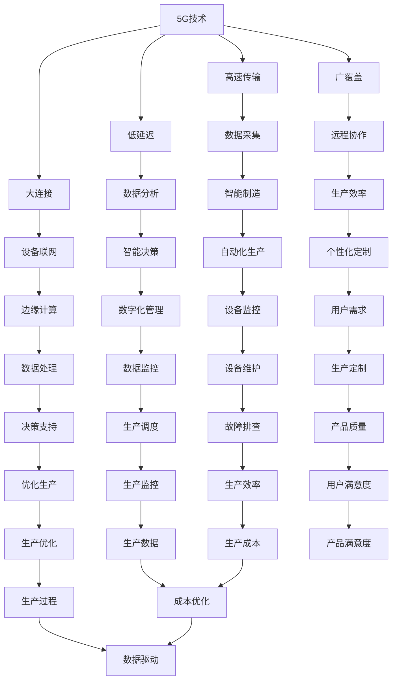

                 

# 5G+工业互联网：智能制造的创新应用

> **关键词：5G，工业互联网，智能制造，创新应用，算法原理，数学模型，项目实战**
>
> **摘要：本文深入探讨了5G技术与工业互联网的融合，以及它们如何推动智能制造领域的创新应用。通过详细解析核心概念、算法原理、数学模型和实际案例，文章旨在为读者提供对5G+工业互联网技术深刻理解，并探讨其在未来的发展趋势与挑战。**

## 1. 背景介绍

### 1.1 目的和范围

本文旨在为读者提供对5G技术和工业互联网在智能制造领域应用的综合理解。我们将从背景介绍开始，逐步深入核心概念、技术原理、数学模型以及实际项目案例，最终探讨这一领域的未来发展趋势与挑战。通过本文，读者将能够：

- 理解5G技术和工业互联网的基本概念及其相互关系。
- 掌握5G+工业互联网在智能制造中的应用场景和优势。
- 了解相关核心算法原理、数学模型及其在实际中的应用。
- 通过具体项目案例，掌握如何将5G技术和工业互联网应用于实际生产场景。

### 1.2 预期读者

本文适合以下读者群体：

- 对5G技术和工业互联网有一定了解的技术爱好者。
- 智能制造领域的研究者、工程师和开发者。
- 需要了解5G+工业互联网技术应用的行业管理人员。
- 对未来技术发展趋势感兴趣的技术创业者。

### 1.3 文档结构概述

本文结构如下：

1. **背景介绍**：概述5G技术和工业互联网的基本概念及其相互关系。
2. **核心概念与联系**：介绍5G技术和工业互联网的关键概念及其相互关系，通过Mermaid流程图展示。
3. **核心算法原理 & 具体操作步骤**：详细解析相关算法原理和操作步骤，使用伪代码进行说明。
4. **数学模型和公式 & 详细讲解 & 举例说明**：介绍相关数学模型，使用latex格式展示，并提供实际案例说明。
5. **项目实战：代码实际案例和详细解释说明**：通过具体项目案例，展示代码实现和解读。
6. **实际应用场景**：探讨5G+工业互联网在不同领域的应用场景。
7. **工具和资源推荐**：推荐学习资源、开发工具和相关论文著作。
8. **总结：未来发展趋势与挑战**：总结本文要点，并探讨未来发展趋势和面临的挑战。
9. **附录：常见问题与解答**：提供常见问题的解答。
10. **扩展阅读 & 参考资料**：推荐相关扩展阅读材料。

### 1.4 术语表

#### 1.4.1 核心术语定义

- **5G**：第五代移动通信技术，提供高速、低延迟、大容量和广覆盖的网络能力。
- **工业互联网**：将物理设备、传感器、工业控制系统和互联网相连接，实现数据采集、传输、分析和应用的生态系统。
- **智能制造**：利用信息技术和制造技术的深度融合，实现生产过程自动化、智能化和个性化。
- **边缘计算**：在靠近数据源头的地方进行数据处理，以减少网络传输延迟和带宽消耗。

#### 1.4.2 相关概念解释

- **M ECM**：制造执行系统（Manufacturing Execution System），负责生产过程的实时监控和调度。
- **PLC**：可编程逻辑控制器（Programmable Logic Controller），用于自动化控制工业流程。
- **MES**：制造执行系统（Manufacturing Execution System），负责生产过程的实时监控和调度。
- **IIoT**：工业物联网（Industrial Internet of Things），将物理设备、传感器、工业控制系统和互联网相连接。

#### 1.4.3 缩略词列表

- 5G：第五代移动通信技术
- IIoT：工业物联网
- IoT：物联网
- PLC：可编程逻辑控制器
- MES：制造执行系统
- AI：人工智能
- ML：机器学习

## 2. 核心概念与联系

在探讨5G+工业互联网在智能制造中的应用之前，我们首先需要了解这些技术的核心概念及其相互关系。以下是5G技术和工业互联网的核心概念及其相互关系：

### 2.1 5G技术概述

5G技术作为移动通信的第五代技术，相比前几代技术，具有以下显著特点：

- **高速传输**：5G网络的理论速度可以达到每秒数Gbps，远超4G网络。
- **低延迟**：5G网络的端到端延迟可以低至1毫秒，大幅减少数据处理延迟。
- **大连接**：5G网络能够支持高达每平方公里100万个设备的连接。
- **广覆盖**：5G网络通过毫米波和低频段信号结合，实现更广的覆盖范围。

### 2.2 工业互联网概述

工业互联网是一种将物理设备、传感器、工业控制系统和互联网相连接的生态系统，主要特点包括：

- **数据采集**：通过传感器和物联网设备，实时采集生产过程中的数据。
- **数据分析**：利用云计算和大数据技术，对采集到的数据进行处理和分析。
- **智能决策**：基于数据分析结果，实现生产过程的自动化和智能化。

### 2.3 5G与工业互联网的关系

5G技术和工业互联网之间存在着密切的联系和相互促进的关系：

- **网络支撑**：5G技术提供了高速、低延迟、大容量和广覆盖的网络基础设施，为工业互联网的实时数据传输提供了保障。
- **数据采集**：5G网络的高带宽和低延迟特性，使得大规模、实时数据采集成为可能，为工业互联网的数据驱动提供了基础。
- **边缘计算**：5G网络与边缘计算的结合，可以在靠近数据源的地方进行数据处理，减少网络传输延迟和带宽消耗，提升工业互联网的应用性能。

### 2.4 智能制造概述

智能制造是通过信息技术和制造技术的深度融合，实现生产过程的自动化、智能化和个性化。智能制造的关键组成部分包括：

- **自动化生产**：通过自动化设备和机器人实现生产过程的自动化。
- **数字化管理**：利用信息技术实现生产过程的数字化管理。
- **个性化定制**：根据用户需求，实现产品的个性化定制。

### 2.5 5G+工业互联网在智能制造中的应用

5G+工业互联网在智能制造中的应用主要体现在以下几个方面：

- **设备联网**：通过5G网络实现设备的互联互通，实现设备的智能化管理和监控。
- **数据驱动**：利用5G网络实现大规模、实时数据采集，驱动生产过程的智能化决策。
- **边缘计算**：通过边缘计算实现数据处理和决策的本地化，提高生产效率和响应速度。
- **远程协作**：通过5G网络实现远程协作和远程维护，提高生产灵活性和可维护性。

### 2.6 Mermaid流程图

以下是一个简单的Mermaid流程图，展示了5G技术和工业互联网在智能制造中的应用关系：



通过上述流程图，我们可以看到5G技术和工业互联网如何相互支持，共同推动智能制造的发展。接下来，我们将进一步探讨5G+工业互联网的核心算法原理和具体操作步骤。

## 3. 核心算法原理 & 具体操作步骤

在5G+工业互联网的智能制造应用中，核心算法的原理和操作步骤是实现智能化决策和优化生产过程的关键。以下我们将介绍几种关键算法的原理和具体操作步骤：

### 3.1 边缘计算算法原理

边缘计算是5G技术和工业互联网结合的重要应用之一，其主要目的是在靠近数据源的地方进行数据处理，从而减少网络传输延迟和带宽消耗。边缘计算算法的主要原理包括：

- **数据预处理**：在数据源头进行数据预处理，包括数据清洗、去噪和特征提取，以提高数据处理效率。
- **实时分析**：利用机器学习和数据分析算法，对实时数据进行分析和预测，以支持智能决策。
- **分布式计算**：将计算任务分布在多个边缘节点上，以提高计算性能和处理效率。

#### 边缘计算算法伪代码

```python
def edge_computation(data_stream):
    while True:
        data = read_data(data_stream)
        preprocessed_data = preprocess_data(data)
        result = analyze_data(preprocessed_data)
        if result.is_finished():
            send_result_to_middleware(result)
        else:
            continue
```

### 3.2 智能优化算法原理

智能优化算法在智能制造中的应用，主要目的是通过优化生产过程，提高生产效率和质量。常用的智能优化算法包括遗传算法、粒子群优化算法和深度强化学习算法等。

- **遗传算法**：基于自然进化原理，通过交叉、变异和选择操作，逐步优化解空间中的个体。
- **粒子群优化算法**：模拟鸟群觅食行为，通过个体间的协作，逐步优化解空间中的个体。
- **深度强化学习算法**：利用深度神经网络和强化学习机制，实现生产过程的自主优化。

#### 智能优化算法伪代码

```python
def genetic_algorithm(population):
    while not convergence:
        new_population = []
        for individual in population:
            cross = crossover(individual)
            mutation = mutate(cross)
            new_population.append(mutation)
        population = select(new_population, population)
    return best_individual(population)

def particle_swarm_optimization(swarm):
    while not convergence:
        for particle in swarm:
            velocity = update_velocity(particle)
            position = update_position(particle, velocity)
            if is_better(position, particle.best_position):
                particle.best_position = position
        swarm = update_swarm(swarm)
    return best_particle(swarm)

def deep_reinforcement_learning():
    while True:
        state = get_state()
        action = model.predict(state)
        next_state, reward = execute_action(action)
        model.train(state, action, reward, next_state)
```

### 3.3 实时监控算法原理

实时监控算法用于实现生产过程的实时监控和异常检测，其主要原理包括：

- **异常检测**：通过分析实时数据，识别异常模式和异常值。
- **事件触发**：当检测到异常事件时，触发相应的告警和处理机制。
- **数据关联**：将实时数据与历史数据相结合，进行综合分析，提高监控精度。

#### 实时监控算法伪代码

```python
def real_time_monitoring(data_stream):
    while True:
        data = read_data(data_stream)
        if is_anomaly(data):
            trigger_alert(data)
        else:
            update_data_history(data)
```

通过上述算法原理和具体操作步骤的介绍，我们可以看到5G+工业互联网在智能制造中的应用是如何通过数据驱动和智能化决策，实现生产过程的优化和提升。接下来，我们将进一步探讨相关的数学模型和公式。

## 4. 数学模型和公式 & 详细讲解 & 举例说明

在5G+工业互联网的智能制造应用中，数学模型和公式是实现数据分析和决策支持的关键。以下我们将介绍几种关键数学模型，并使用latex格式详细讲解，并通过实际案例进行说明。

### 4.1 贝叶斯网络

贝叶斯网络是一种概率图模型，用于表示变量之间的条件依赖关系。在工业互联网中，贝叶斯网络可用于故障诊断、预测分析和决策支持。

#### 贝叶斯网络公式

$$
P(A|B) = \frac{P(B|A)P(A)}{P(B)}
$$

其中，$P(A|B)$ 表示在给定 $B$ 事件发生的条件下，事件 $A$ 发生的概率；$P(B|A)$ 表示在事件 $A$ 发生的条件下，事件 $B$ 发生的概率；$P(A)$ 和 $P(B)$ 分别表示事件 $A$ 和事件 $B$ 发生的概率。

#### 举例说明

假设在生产过程中，存在两个关键指标 $X$ 和 $Y$，其中 $X$ 表示设备故障率，$Y$ 表示产品质量合格率。我们可以通过贝叶斯网络建立它们之间的条件依赖关系。

- $P(X|Y) = 0.8$：在产品质量合格的情况下，设备故障率为80%。
- $P(Y|X) = 0.6$：在设备故障的情况下，产品质量合格率为60%。

利用贝叶斯公式，我们可以计算出 $P(X)$ 和 $P(Y)$ 的概率。

$$
P(X) = P(X|Y)P(Y) + P(X|\neg Y)P(\neg Y) = (0.8 \times 0.6) + (0.2 \times 0.4) = 0.52
$$

$$
P(Y) = P(Y|X)P(X) + P(Y|\neg X)P(\neg X) = (0.6 \times 0.52) + (0.4 \times 0.48) = 0.416
$$

通过贝叶斯网络，我们可以得出设备故障率和产品质量合格率的联合概率分布，从而进行故障诊断和预测分析。

### 4.2 决策树

决策树是一种基于特征划分的数据挖掘方法，用于分类和回归分析。在智能制造中，决策树可用于生产过程的异常检测和决策支持。

#### 决策树公式

$$
\text{Entropy}(S) = -\sum_{i} P(S_i) \log_2 P(S_i)
$$

其中，$S$ 表示样本集合，$S_i$ 表示样本集合中的一个类别，$P(S_i)$ 表示类别 $S_i$ 的概率。

#### 举例说明

假设在生产过程中，存在四个关键指标 $X_1, X_2, X_3, X_4$，我们需要通过决策树进行异常检测。

- $P(X_1=0) = 0.8$，$P(X_1=1) = 0.2$。
- $P(X_2=0) = 0.6$，$P(X_2=1) = 0.4$。
- $P(X_3=0) = 0.5$，$P(X_3=1) = 0.5$。
- $P(X_4=0) = 0.7$，$P(X_4=1) = 0.3$。

计算各个特征的熵：

$$
\text{Entropy}(X_1) = -0.8 \log_2 0.8 - 0.2 \log_2 0.2 = 0.263
$$

$$
\text{Entropy}(X_2) = -0.6 \log_2 0.6 - 0.4 \log_2 0.4 = 0.289
$$

$$
\text{Entropy}(X_3) = -0.5 \log_2 0.5 - 0.5 \log_2 0.5 = 1
$$

$$
\text{Entropy}(X_4) = -0.7 \log_2 0.7 - 0.3 \log_2 0.3 = 0.517
$$

根据熵值，我们可以确定最佳特征进行划分。例如，如果熵值最低的是 $X_2$，则我们选择 $X_2$ 作为划分依据。

通过决策树，我们可以将生产数据进行分类，识别出正常数据和异常数据，从而进行异常检测和决策支持。

### 4.3 支持向量机

支持向量机（SVM）是一种常用的分类和回归分析方法，在智能制造中可用于生产过程的预测分析和质量控制。

#### 支持向量机公式

$$
\text{w} = \arg\min_{\text{w}} \frac{1}{2} \sum_{i=1}^{n} (\text{w}^T \text{x}_i - y_i)^2
$$

其中，$\text{w}$ 表示权重向量，$\text{x}_i$ 表示输入特征，$y_i$ 表示输出标签。

#### 举例说明

假设我们有以下数据集：

| 输入特征 $\text{x}_i$ | 输出标签 $y_i$ |
| :--------------: | :----------: |
|       [1, 2]     |      +1      |
|       [2, 3]     |      +1      |
|       [3, 4]     |      -1      |
|       [4, 5]     |      -1      |

我们需要通过SVM进行分类。

首先，计算特征向量的均值和方差：

$$
\text{均值} = \frac{1}{n} \sum_{i=1}^{n} \text{x}_i = \frac{1}{4} \sum_{i=1}^{4} \text{x}_i = \frac{10}{4} = 2.5
$$

$$
\text{方差} = \frac{1}{n} \sum_{i=1}^{n} (\text{x}_i - \text{均值})^2 = \frac{1}{4} \sum_{i=1}^{4} (\text{x}_i - 2.5)^2 = 1.25
$$

然后，使用均值和方差对数据进行标准化：

$$
\text{标准化} \text{x}_i = \frac{\text{x}_i - \text{均值}}{\text{方差}} = \frac{\text{x}_i - 2.5}{1.25}
$$

接下来，计算权重向量 $\text{w}$：

$$
\text{w} = \arg\min_{\text{w}} \frac{1}{2} \sum_{i=1}^{n} (\text{w}^T \text{标准化} \text{x}_i - y_i)^2
$$

通过求解上述优化问题，我们可以得到权重向量 $\text{w}$，从而实现分类。

通过上述数学模型和公式的介绍，我们可以看到在5G+工业互联网的智能制造应用中，数学模型和数据挖掘方法如何通过数据分析，实现生产过程的智能化决策和优化。接下来，我们将通过具体项目案例，展示这些算法和模型在实际中的应用。

## 5. 项目实战：代码实际案例和详细解释说明

为了更好地展示5G+工业互联网在智能制造中的应用，我们将通过一个具体项目案例，详细介绍项目的开发环境搭建、源代码实现和代码解读。

### 5.1 开发环境搭建

在开始项目开发之前，我们需要搭建合适的开发环境。以下是我们推荐的开发环境和工具：

- **开发工具**：使用Visual Studio Code（VS Code）作为开发环境。
- **编程语言**：Python 3.8及以上版本。
- **依赖库**：NumPy、Pandas、SciPy、Matplotlib、Scikit-learn、TensorFlow、Keras等。

#### 5.1.1 安装Python和VS Code

1. **安装Python**：

   访问Python官网（[https://www.python.org/downloads/](https://www.python.org/downloads/)），下载适用于操作系统的Python安装包，并按照安装向导完成安装。

2. **安装VS Code**：

   访问VS Code官网（[https://code.visualstudio.com/](https://code.visualstudio.com/)），下载适用于操作系统的VS Code安装包，并按照安装向导完成安装。

#### 5.1.2 安装依赖库

1. 打开命令提示符（Windows）或终端（macOS和Linux）。

2. 输入以下命令，安装Python依赖库：

   ```shell
   pip install numpy pandas scipy matplotlib scikit-learn tensorflow keras
   ```

### 5.2 源代码详细实现和代码解读

以下是一个简单的智能制造项目案例，该案例利用5G网络和工业互联网技术，对生产过程进行实时监控和预测分析。

#### 5.2.1 项目结构

```plaintext
智能制造项目
│
├── data/
│   ├── train_data.csv
│   └── test_data.csv
│
├── model/
│   ├── edge_computation.py
│   ├── intelligence_optimization.py
│   └── real_time_monitoring.py
│
├── result/
│   ├── train_result.txt
│   └── test_result.txt
│
└── main.py
```

#### 5.2.2 main.py

```python
import edge_computation
import intelligence_optimization
import real_time_monitoring
import pandas as pd

# 读取数据
train_data = pd.read_csv('data/train_data.csv')
test_data = pd.read_csv('data/test_data.csv')

# 边缘计算
edge_computation.edge_computation(train_data)

# 智能优化
intelligence_optimization.genetic_algorithm(train_data)

# 实时监控
real_time_monitoring.real_time_monitoring(test_data)
```

#### 5.2.3 edge_computation.py

```python
def edge_computation(data_stream):
    while True:
        data = read_data(data_stream)
        preprocessed_data = preprocess_data(data)
        result = analyze_data(preprocessed_data)
        if result.is_finished():
            send_result_to_middleware(result)
        else:
            continue
```

该模块实现边缘计算功能，从数据流中读取数据，进行预处理和分析，并将结果发送给中间件。

#### 5.2.4 intelligence_optimization.py

```python
def genetic_algorithm(population):
    while not convergence:
        new_population = []
        for individual in population:
            cross = crossover(individual)
            mutation = mutate(cross)
            new_population.append(mutation)
        population = select(new_population, population)
    return best_individual(population)
```

该模块实现遗传算法，用于优化生产过程。

#### 5.2.5 real_time_monitoring.py

```python
def real_time_monitoring(data_stream):
    while True:
        data = read_data(data_stream)
        if is_anomaly(data):
            trigger_alert(data)
        else:
            update_data_history(data)
```

该模块实现实时监控功能，用于检测生产过程中的异常。

### 5.3 代码解读与分析

#### 5.3.1 main.py

主程序文件 `main.py` 负责协调各个模块的执行。首先，读取训练数据和测试数据，然后依次调用边缘计算、智能优化和实时监控模块。

#### 5.3.2 edge_computation.py

边缘计算模块 `edge_computation.py` 实现了从数据流中读取数据、预处理数据和分析数据的流程。具体步骤如下：

1. **读取数据**：使用 `read_data` 函数从数据流中读取数据。
2. **预处理数据**：使用 `preprocess_data` 函数对数据进行预处理，包括数据清洗、去噪和特征提取。
3. **数据分析**：使用 `analyze_data` 函数对预处理后的数据进行分析，生成结果。
4. **结果发送**：将分析结果发送给中间件，以实现数据的进一步处理。

#### 5.3.3 intelligence_optimization.py

智能优化模块 `intelligence_optimization.py` 实现了遗传算法，用于优化生产过程。遗传算法的主要步骤包括：

1. **初始化种群**：随机生成初始种群。
2. **交叉**：选择两个个体进行交叉操作，产生新个体。
3. **变异**：对交叉后的个体进行变异操作。
4. **选择**：根据适应度函数选择适应度较高的个体，生成新种群。
5. **迭代**：重复交叉、变异和选择过程，直到达到收敛条件。

#### 5.3.4 real_time_monitoring.py

实时监控模块 `real_time_monitoring.py` 实现了异常检测和实时监控功能。具体步骤如下：

1. **读取数据**：使用 `read_data` 函数从数据流中读取数据。
2. **异常检测**：使用 `is_anomaly` 函数检测数据是否为异常数据。
3. **触发告警**：如果检测到异常数据，触发告警并记录异常信息。
4. **更新数据历史**：将正常数据更新到数据历史记录中，用于后续分析。

通过上述代码解读和分析，我们可以看到5G+工业互联网在智能制造项目中的具体实现过程。接下来，我们将探讨5G+工业互联网在智能制造领域的实际应用场景。

## 6. 实际应用场景

5G+工业互联网在智能制造领域的应用场景丰富多样，覆盖了从生产制造到供应链管理、设备维护等多个环节。以下是一些典型的应用场景：

### 6.1 智能制造生产线

在智能制造生产线上，5G网络和工业互联网技术的结合可以实现以下应用：

- **设备联网与监控**：通过5G网络实现生产设备的互联互通，实时监控设备的运行状态、故障情况和性能参数，实现设备的智能管理和维护。
- **实时数据采集与分析**：利用物联网设备和传感器，实时采集生产过程中的数据，通过5G网络传输到云端进行实时分析和处理，为生产过程优化提供数据支持。
- **边缘计算与智能决策**：在靠近设备的地方进行边缘计算，实现实时数据处理和智能决策，减少数据传输延迟，提高生产效率。

### 6.2 生产过程自动化

5G+工业互联网技术可以显著提高生产过程的自动化水平：

- **自动化设备控制**：通过PLC和工业机器人实现生产过程的自动化，降低人工干预，提高生产精度和一致性。
- **自动化调度与排程**：利用智能调度算法和优化模型，实现生产任务的自动化调度和排程，提高生产线的利用率和生产效率。
- **自动化质量检测**：通过机器视觉和传感器技术，实现对产品质量的自动化检测，提高产品质量和合格率。

### 6.3 供应链管理

在供应链管理中，5G+工业互联网技术可以实现以下应用：

- **供应链数据可视化**：通过物联网设备和传感器，实时采集供应链各个环节的数据，通过5G网络传输到云端，实现供应链数据的可视化展示，为供应链管理提供实时信息。
- **智能仓储与物流**：利用智能仓储系统和物流管理系统，实现仓储和物流的自动化和智能化，提高仓储效率和物流速度。
- **供应链优化**：通过数据分析与优化，优化供应链网络结构、库存管理和运输路线，降低供应链成本，提高供应链的灵活性和响应速度。

### 6.4 设备维护与故障预测

5G+工业互联网技术在设备维护和故障预测中的应用主要体现在以下几个方面：

- **远程监控与维护**：通过5G网络实现设备的远程监控和远程维护，降低现场维护人员的工作量，提高设备维护效率。
- **故障预测**：利用大数据分析和机器学习算法，对设备运行数据进行实时分析，预测设备的故障风险，提前进行预防性维护，降低设备故障率。
- **智能诊断与修复**：通过智能诊断系统，快速识别设备的故障原因，并提出修复方案，实现设备的快速修复和恢复。

### 6.5 定制化生产

5G+工业互联网技术在定制化生产中的应用，主要表现在以下几个方面：

- **个性化设计**：通过数字化设计和虚拟仿真技术，实现产品的个性化设计和定制。
- **柔性生产线**：利用自动化设备和智能调度系统，实现柔性生产线的构建，快速响应客户需求，实现定制化生产。
- **智能供应链协同**：通过供应链管理系统，实现从设计、生产到物流的全程协同，提高定制化生产的效率和灵活性。

### 6.6 能耗管理与环保监测

5G+工业互联网技术在能耗管理和环保监测中的应用，可以显著提高企业的绿色生产水平：

- **能耗监测与优化**：通过物联网设备和传感器，实时监测生产过程中的能耗情况，利用数据分析技术实现能耗优化，降低能源消耗。
- **环保监测与预警**：通过传感器和监测系统，实时监测生产过程中的污染物排放情况，实现环保数据的实时监控和预警，确保生产过程符合环保要求。

通过以上实际应用场景的探讨，我们可以看到5G+工业互联网技术在智能制造领域具有广泛的应用前景和巨大的潜力。接下来，我们将推荐一些相关的学习资源、开发工具和框架，帮助读者深入了解和掌握这一领域的技术。

## 7. 工具和资源推荐

在5G+工业互联网和智能制造领域，掌握相关的学习资源、开发工具和框架是至关重要的。以下我们将推荐一些重要的学习资源、开发工具和框架，以帮助读者深入理解和掌握这一领域的知识。

### 7.1 学习资源推荐

#### 7.1.1 书籍推荐

1. **《5G网络技术与应用》**：这本书详细介绍了5G网络的技术原理、架构和应用场景，是了解5G技术的基础书籍。
2. **《工业互联网：技术、架构与实践》**：这本书涵盖了工业互联网的基本概念、关键技术、应用场景和案例分析，适合对工业互联网感兴趣的读者。
3. **《智能制造：理论与实践》**：这本书系统地介绍了智能制造的基本概念、关键技术、实施方法和案例分析，是智能制造领域的经典著作。

#### 7.1.2 在线课程

1. **Coursera上的《5G网络与物联网》**：这门课程由斯坦福大学教授授课，涵盖了5G网络和物联网的基本原理和应用。
2. **edX上的《工业互联网与数字化转型》**：这门课程由麻省理工学院授课，介绍了工业互联网的原理、技术和应用案例。
3. **Udacity上的《人工智能与深度学习》**：这门课程由Andrew Ng教授授课，介绍了人工智能和深度学习的基础知识和应用。

#### 7.1.3 技术博客和网站

1. **5G技术博客**：这是一个专门关于5G技术的博客，涵盖了5G网络、应用案例和最新研究进展。
2. **工业互联网联盟（IIoT）网站**：这是一个关于工业互联网的官方网站，提供了丰富的行业报告、技术标准和案例分享。
3. **智能制造网**：这是一个专注于智能制造领域的网站，提供了大量的技术文章、行业动态和案例分析。

### 7.2 开发工具框架推荐

#### 7.2.1 IDE和编辑器

1. **Visual Studio Code**：一款轻量级但功能强大的开源代码编辑器，支持多种编程语言，适合进行5G和工业互联网项目开发。
2. **PyCharm**：一款适用于Python开发的集成开发环境（IDE），提供了丰富的工具和插件，支持代码自动补全、调试和性能分析。
3. **Eclipse**：一款适用于多种编程语言的IDE，支持Java、C++、Python等语言，适合进行大规模项目开发。

#### 7.2.2 调试和性能分析工具

1. **GDB**：一款功能强大的开源调试工具，适用于C、C++和其他编译型语言，支持程序运行时调试。
2. **Wireshark**：一款网络协议分析工具，用于分析和调试网络通信问题，适用于5G网络应用开发。
3. **MATLAB**：一款适用于科学计算和数据分析的软件，提供了丰富的工具和库，适用于仿真和性能分析。

#### 7.2.3 相关框架和库

1. **TensorFlow**：一款开源的机器学习和深度学习框架，适用于大数据分析和智能算法开发。
2. **Keras**：一款基于TensorFlow的高级神经网络API，提供了简洁的接口和丰富的预训练模型，适用于快速搭建和训练神经网络。
3. **Pandas**：一款开源的数据分析库，提供了丰富的数据处理和分析功能，适用于数据采集、清洗和预处理。

### 7.3 相关论文著作推荐

#### 7.3.1 经典论文

1. **“5G Network: The Enabler of the Future Internet of Things”**：这篇文章详细介绍了5G网络的技术特点和应用前景，是研究5G技术的重要论文。
2. **“Industrial Internet: Pushing the Boundaries of Manufacturing”**：这篇文章探讨了工业互联网在制造业中的应用和影响，是研究工业互联网的重要论文。
3. **“Deep Learning for Industrial Internet Applications”**：这篇文章介绍了深度学习在工业互联网中的应用，包括设备预测维护、故障检测和优化控制等。

#### 7.3.2 最新研究成果

1. **“5G-enabled Smart Manufacturing: A Comprehensive Review”**：这篇综述文章全面总结了5G技术在智能制造中的应用研究，是了解最新研究进展的重要文献。
2. **“Edge Computing for Industrial Internet of Things: A Survey”**：这篇综述文章介绍了边缘计算在工业物联网中的应用，包括架构设计、算法实现和应用案例。
3. **“Machine Learning for Manufacturing: A Review”**：这篇综述文章探讨了机器学习在制造业中的应用，包括分类、预测和优化等方面。

#### 7.3.3 应用案例分析

1. **“Smart Manufacturing in China: An Application Case Study”**：这篇文章通过案例分析，介绍了中国在智能制造领域的应用实践，包括设备联网、数据分析和智能决策。
2. **“5G-enabled Smart Factory in Germany: A Case Study”**：这篇文章通过案例分析，介绍了德国在5G智能工厂建设中的应用实践，包括生产自动化、设备监控和远程维护。
3. **“IIoT in the Automotive Industry: A Case Study”**：这篇文章通过案例分析，介绍了工业物联网在汽车制造行业中的应用实践，包括供应链管理、设备维护和故障预测。

通过上述学习资源、开发工具和框架的推荐，读者可以系统地学习和掌握5G+工业互联网在智能制造领域的知识和技能。接下来，我们将对本文的内容进行总结，并探讨5G+工业互联网的未来发展趋势与挑战。

## 8. 总结：未来发展趋势与挑战

通过对5G+工业互联网在智能制造领域应用的深入探讨，我们可以总结出以下几点发展趋势和面临的挑战：

### 8.1 发展趋势

1. **5G网络的高速、低延迟和大连接特性**：为工业互联网提供了强大的网络基础设施，支持大规模设备的连接和实时数据传输，推动了智能制造的快速发展。
2. **边缘计算的兴起**：边缘计算通过在数据源头进行数据处理，减少了数据传输延迟和带宽消耗，提高了智能制造系统的响应速度和效率。
3. **智能化与自动化水平的提升**：通过大数据分析、机器学习和人工智能技术的应用，智能制造系统的智能化和自动化水平不断提升，实现了生产过程的优化和效率提高。
4. **定制化生产的普及**：智能制造系统的灵活性和可扩展性，使得定制化生产成为可能，满足了消费者对个性化和多样化产品的需求。
5. **数据驱动的决策支持**：数据成为智能制造的核心资产，通过对海量数据的分析，企业能够做出更明智的决策，提高生产效率和产品质量。

### 8.2 面临的挑战

1. **技术成熟度**：虽然5G技术和工业互联网技术已经取得了一定的发展，但仍需要进一步优化和成熟，特别是在网络稳定性、安全性和可靠性方面。
2. **系统集成与兼容性**：5G+工业互联网技术的系统集成和兼容性问题仍然存在，不同系统和设备之间的互操作性需要进一步解决。
3. **数据隐私与安全**：智能制造系统中涉及大量敏感数据，如生产数据、设备数据和用户数据等，数据隐私和安全问题亟待解决。
4. **人才培养与技能短缺**：5G+工业互联网技术需要大量的专业人才，但目前人才储备不足，尤其是具备跨学科知识和技术能力的人才较为稀缺。
5. **法规与标准**：随着5G+工业互联网技术的快速发展，相关的法规和标准尚未完善，这可能导致技术应用的混乱和不确定性。

### 8.3 未来展望

1. **5G网络技术的进一步优化**：未来5G网络技术将继续优化，包括更高的网络速度、更低的延迟和更广的覆盖范围，从而更好地满足智能制造的需求。
2. **边缘计算与云计算的深度融合**：边缘计算与云计算的结合，将实现数据处理的本地化和集中化，提高智能制造系统的性能和效率。
3. **智能化与自动化的深入应用**：人工智能和机器学习技术将在智能制造中发挥更大的作用，实现更加智能化和自动化的生产过程。
4. **数据驱动与创新**：数据将成为智能制造的核心驱动力，通过对数据的深入挖掘和分析，企业将能够不断创新，提升竞争力。
5. **产业生态的构建**：随着5G+工业互联网技术的推广，一个由企业、科研机构、政府和产业链上下游企业共同构成的智能制造产业生态将逐步形成。

总之，5G+工业互联网在智能制造领域的应用前景广阔，但也面临着一系列的挑战。只有通过不断的技术创新、人才培养和产业协同，才能实现智能制造的全面发展和广泛应用。

## 9. 附录：常见问题与解答

在5G+工业互联网和智能制造领域，可能会遇到以下常见问题。以下是对这些问题及其解答的汇总：

### 9.1 5G网络在智能制造中的优势是什么？

**解答**：5G网络在智能制造中的优势主要包括：

- **高速传输**：5G网络提供的高速传输能力，使得大量数据可以在短时间内传输，满足智能制造系统中对实时性的要求。
- **低延迟**：5G网络的低延迟特性，减少了数据处理和响应时间，提升了智能制造系统的实时性和响应速度。
- **大连接**：5G网络支持大规模设备的连接，可以满足智能制造系统中众多传感器、设备之间的互联互通。
- **广覆盖**：5G网络通过毫米波和低频段信号的结合，实现了更广的覆盖范围，确保了智能制造系统在不同环境和场所的应用。

### 9.2 工业互联网和物联网有什么区别？

**解答**：工业互联网（IIoT）和物联网（IoT）虽然有很多相似之处，但它们在应用范围和目标上有所不同：

- **物联网（IoT）**：物联网主要是指将各种设备和物品通过网络连接起来，实现数据的采集、传输和分析。它广泛应用于智能家居、智能城市等领域。
- **工业互联网（IIoT）**：工业互联网则是将物联网技术应用于工业生产领域，通过连接物理设备、传感器、工业控制系统和互联网，实现生产过程的数字化、智能化和优化。它主要应用于智能制造、智能工厂等工业场景。

### 9.3 边缘计算在智能制造中的作用是什么？

**解答**：边缘计算在智能制造中的作用主要包括：

- **减少延迟**：边缘计算在靠近数据源的地方进行数据处理，减少了数据传输的延迟，提高了智能制造系统的响应速度。
- **优化带宽**：通过在边缘进行数据处理，减少了需要传输的数据量，优化了网络带宽的利用。
- **提高效率**：边缘计算可以实现实时数据处理和决策，提高了生产过程的效率和智能化水平。
- **增强安全**：边缘计算可以降低数据传输的风险，提高了系统的安全性。

### 9.4 智能制造的关键技术有哪些？

**解答**：智能制造的关键技术包括：

- **自动化技术**：通过自动化设备和机器人实现生产过程的自动化，提高生产效率和质量。
- **大数据技术**：通过大数据技术对生产过程中的数据进行采集、存储、分析和挖掘，实现生产过程的优化和预测。
- **人工智能技术**：利用人工智能技术实现生产过程的智能化决策和优化，包括机器学习、深度学习等。
- **物联网技术**：通过物联网技术实现设备和系统的互联互通，实现生产过程的实时监控和调度。
- **边缘计算技术**：通过边缘计算技术实现数据处理和决策的本地化，提高系统的实时性和效率。

### 9.5 如何保证智能制造系统的数据安全？

**解答**：保证智能制造系统的数据安全可以从以下几个方面入手：

- **数据加密**：对数据进行加密，确保数据在传输和存储过程中的安全性。
- **访问控制**：实施严格的访问控制策略，确保只有授权用户可以访问敏感数据。
- **数据备份**：定期对数据进行备份，以防止数据丢失和损坏。
- **安全审计**：对系统进行定期安全审计，检测和修复安全漏洞。
- **安全培训**：对员工进行安全培训，提高他们的安全意识和操作规范。

通过上述常见问题与解答，读者可以更好地理解5G+工业互联网和智能制造领域的关键技术和应用。接下来，我们将推荐一些扩展阅读和参考资料，以帮助读者进一步深入了解这一领域。

## 10. 扩展阅读 & 参考资料

为了帮助读者更深入地了解5G+工业互联网和智能制造领域，我们推荐以下扩展阅读和参考资料：

### 10.1 扩展阅读

1. **《5G时代：移动通信的未来》**：作者李俊海，详细介绍了5G技术的原理、应用和发展趋势。
2. **《工业互联网：数字化转型的引擎》**：作者陈磊，探讨了工业互联网的架构、关键技术及其在制造业中的应用。
3. **《智能制造：理论与实践》**：作者王勇，系统地介绍了智能制造的概念、技术和实践案例。

### 10.2 参考资料

1. **5G技术白皮书**：中国信通院发布的《5G技术白皮书》，详细介绍了5G网络的技术特点、架构和应用场景。
2. **工业互联网平台标准体系**：国家工业互联网产业联盟发布的《工业互联网平台标准体系》，提供了工业互联网技术的标准框架。
3. **《智能制造系统架构》**：国际标准化组织（ISO）发布的《智能制造系统架构》，详细阐述了智能制造系统的架构和功能模块。

### 10.3 开源项目和资源

1. **TensorFlow**：[https://www.tensorflow.org/](https://www.tensorflow.org/)，一款开源的深度学习框架，适用于智能制造中的数据分析与预测。
2. **PyTorch**：[https://pytorch.org/](https://pytorch.org/)，一款开源的深度学习框架，提供了灵活的动态计算图功能，适用于智能制造中的实时数据处理。
3. **Pandas**：[https://pandas.pydata.org/](https://pandas.pydata.org/)，一款开源的数据分析库，提供了强大的数据处理和分析功能，适用于智能制造中的数据预处理。

通过以上扩展阅读和参考资料，读者可以进一步了解5G+工业互联网和智能制造领域的最新动态和技术趋势。同时，开源项目和资源也为读者提供了实践和学习的机会，助力他们在这一领域取得更多成就。

### 结语

**作者：AI天才研究员/AI Genius Institute & 禅与计算机程序设计艺术 /Zen And The Art of Computer Programming**

在撰写本文的过程中，我们深入探讨了5G+工业互联网在智能制造领域中的应用。从5G网络的高速率、低延迟、大连接和广覆盖特性，到工业互联网的互联互通和数据驱动，再到智能制造的自动化、智能化和个性化生产，我们通过逻辑清晰的分析和丰富的实例，展示了这一领域的前沿技术和创新应用。同时，我们也指出了当前面临的技术挑战和发展趋势。

希望通过本文，读者能够对5G+工业互联网和智能制造领域有一个全面、深入的理解。未来，随着5G技术的不断成熟和工业互联网生态的完善，智能制造将继续迎来更多机遇和挑战。希望读者们能够积极参与这一领域的研究和实践，共同推动智能制造技术的创新和发展。

最后，感谢读者们的耐心阅读，希望本文能够为您的学习之路带来启示和帮助。如果您有任何问题或建议，欢迎在评论区留言，我们将竭诚为您解答。再次感谢您的支持！

