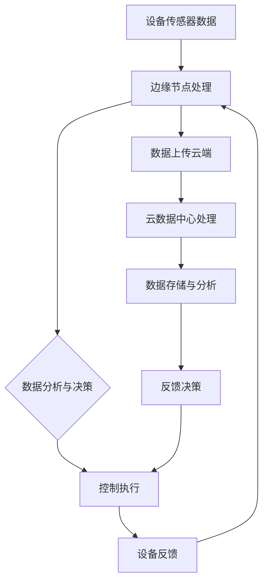

                 

# 5G+边缘计算：工业互联网的新范式

> **关键词：5G、边缘计算、工业互联网、网络架构、数据传输、实时性、安全性、智能化**
>
> **摘要：本文深入探讨了5G技术和边缘计算在工业互联网领域的重要性和应用价值。通过详细的原理分析、架构解析和实际案例分享，展示了如何利用5G和边缘计算实现工业互联网的智能化转型，提高生产效率、降低成本，并保障数据传输的安全性和实时性。**

## 1. 背景介绍

### 1.1 目的和范围

本文旨在阐述5G技术和边缘计算在工业互联网中的融合应用，分析其在提高生产效率、优化资源配置、提升设备智能化水平等方面的作用。本文将围绕以下几个主题进行探讨：

1. 5G技术的关键特性及其对工业互联网的影响。
2. 边缘计算的基本原理与优势。
3. 5G+边缘计算在工业互联网中的应用场景。
4. 架构设计和实施策略。
5. 数据传输和安全性保障。
6. 未来发展趋势与挑战。

通过上述内容的讨论，本文希望能够为工业互联网领域的研究者和实践者提供有价值的参考和启示。

### 1.2 预期读者

本文面向对工业互联网、5G技术和边缘计算有一定了解的技术人员、研究人员和企业管理者。具体包括：

1. 工业互联网解决方案架构师。
2. 通信网络工程师。
3. IT行业分析师。
4. 企业信息化部门负责人。
5. 对前沿技术感兴趣的技术爱好者。

### 1.3 文档结构概述

本文结构如下：

1. **背景介绍**：阐述研究目的、预期读者以及文档结构。
2. **核心概念与联系**：介绍5G技术和边缘计算的基本原理，并使用Mermaid流程图展示架构。
3. **核心算法原理 & 具体操作步骤**：详细解析5G和边缘计算的应用算法。
4. **数学模型和公式 & 详细讲解 & 举例说明**：通过公式和实例说明关键技术。
5. **项目实战：代码实际案例和详细解释说明**：分享具体实现案例。
6. **实际应用场景**：展示5G+边缘计算在不同行业中的应用。
7. **工具和资源推荐**：推荐学习资源和开发工具。
8. **总结：未来发展趋势与挑战**：分析未来趋势和面临的挑战。
9. **附录：常见问题与解答**：回答读者可能遇到的问题。
10. **扩展阅读 & 参考资料**：提供进一步学习的资料。

### 1.4 术语表

#### 1.4.1 核心术语定义

- **5G**：第五代移动通信技术，具备高速率、低延迟、大连接等特点。
- **边缘计算**：在靠近数据源头的地方进行数据处理，以减少数据传输延迟。
- **工业互联网**：将物理设备、传感器、工业软件等通过网络连接起来，实现数据互通和智能化管理。
- **网络切片**：网络资源的虚拟化，为不同的应用场景分配独立的网络资源。
- **MEC（Mobile Edge Computing）**：移动边缘计算，将计算能力部署在靠近用户的网络边缘。
- **SDN（Software Defined Networking）**：软件定义网络，通过集中控制来实现网络资源的灵活配置和管理。

#### 1.4.2 相关概念解释

- **边缘节点**：位于网络边缘的计算节点，如路由器、交换机等。
- **IoT（Internet of Things）**：物联网，通过传感器和互联网连接各种设备，实现智能监控和数据分析。
- **容器化**：将应用及其依赖环境打包成一个独立的运行容器，实现应用的可移植性和高效部署。
- **云计算**：通过网络提供可扩展的计算资源和服务，实现按需分配和弹性扩展。

#### 1.4.3 缩略词列表

- **5G**：第五代移动通信技术
- **MEC**：移动边缘计算
- **SDN**：软件定义网络
- **IoT**：物联网
- **NFV**：网络功能虚拟化
- **SD-WAN**：软件定义广域网

## 2. 核心概念与联系

在深入探讨5G技术和边缘计算在工业互联网中的应用之前，有必要先理解它们的基本原理及其相互之间的关系。

### 2.1 5G技术的基本原理

5G技术是第五代移动通信技术，旨在提供更快的数据传输速度、更低的延迟和更大的网络容量。5G技术具有以下几个关键特性：

- **高速率**：5G网络的峰值下载速度可以达到数十Gbps，是4G网络的十倍以上，这意味着可以支持大规模数据传输和应用场景。
- **低延迟**：5G网络能够实现低至1ms的端到端延迟，极大地提高了实时响应能力，对于工业互联网中要求苛刻的实时控制应用尤为重要。
- **大连接**：5G网络支持每平方公里数十万个设备的连接，这为物联网（IoT）设备的大规模部署提供了可能性。
- **网络切片**：网络切片技术允许运营商根据不同应用的需求，灵活划分和管理网络资源，从而提供定制化的网络服务。

### 2.2 边缘计算的基本原理

边缘计算是一种将计算、存储和网络功能部署在靠近数据源的网络边缘的技术。其核心思想是将数据处理和计算任务从云端转移到网络边缘，以减少数据传输延迟、提高系统响应速度和降低带宽消耗。边缘计算的主要特点包括：

- **分布式计算**：边缘计算通过在本地部署计算资源，实现数据的本地处理和分析，减少了对中心化云服务的依赖。
- **实时性**：由于数据在本地处理，边缘计算能够提供更低的延迟，满足实时性要求较高的工业应用需求。
- **可靠性**：边缘计算通过分布式架构提高了系统的可靠性和容错能力，即使在网络不稳定的情况下也能保持服务的连续性。

### 2.3 5G与边缘计算的融合应用

5G技术和边缘计算的融合应用为工业互联网带来了新的可能性。通过结合两者的优势，可以实现以下应用：

- **实时数据处理**：5G网络的低延迟特性与边缘计算的结合，使得实时数据处理成为可能。例如，在工业自动化生产线上，设备传感器采集的数据可以在边缘节点实时分析，从而快速响应生产过程中的异常情况。
- **智能设备管理**：通过5G网络和边缘计算，可以实现设备状态的实时监控和预测性维护。例如，在智能制造中，可以使用边缘计算对设备运行数据进行实时分析，预测设备故障并提前进行维护。
- **安全防护**：边缘计算可以为工业互联网提供更加安全的数据处理和存储环境。通过在边缘节点进行数据加密和身份认证，可以有效防止数据泄露和网络攻击。

### 2.4 架构原理与流程

为了更好地理解5G+边缘计算在工业互联网中的应用，我们可以通过一个Mermaid流程图来展示其核心架构和流程。



在该架构中：

- **设备传感器数据**通过5G网络传输到边缘节点进行初步处理。
- **边缘节点处理**对数据进行实时分析，并做出决策。
- **控制执行**对设备进行控制操作。
- **设备反馈**将操作结果返回给边缘节点。
- **数据上传云端**将关键数据上传至云数据中心进行进一步分析和存储。

通过这样的架构设计，可以实现高效、实时、安全的数据处理和设备管理。

## 3. 核心算法原理 & 具体操作步骤

在了解了5G和边缘计算的基本原理后，接下来我们将深入探讨它们在工业互联网中的应用算法，以及如何具体操作和实现。

### 3.1 5G网络中的关键算法

5G网络的核心算法主要围绕以下几个关键方面：

- **网络切片管理**：网络切片算法负责根据不同的业务需求，动态分配和管理网络资源。其主要步骤包括：
  - **需求分析**：分析不同业务对网络带宽、延迟、可靠性等方面的需求。
  - **资源分配**：基于需求分析结果，动态分配网络资源，确保不同切片获得所需的资源。
  - **优化策略**：根据网络负载和业务需求的变化，调整资源分配策略，实现资源的最优利用。

- **多连接管理**：5G网络支持多连接，即同一设备可以同时连接多个网络切片。多连接管理算法需要确保多个连接的公平性和效率。其主要步骤包括：
  - **连接建立**：根据业务需求，建立多连接。
  - **负载均衡**：对多个连接进行负载均衡，避免单个连接负载过高。
  - **连接管理**：维护多个连接的状态，确保连接的稳定性和可靠性。

- **低延迟优化**：5G网络低延迟的关键在于优化数据传输路径。低延迟优化算法的主要步骤包括：
  - **路径选择**：根据网络状况和业务需求，选择最优的数据传输路径。
  - **流量控制**：通过流量控制算法，避免网络拥塞，确保数据传输的连续性和可靠性。
  - **延迟估计**：实时估计网络延迟，并根据延迟变化调整传输路径。

### 3.2 边缘计算中的关键算法

边缘计算的关键算法主要涉及以下几个方面：

- **边缘节点调度**：边缘节点调度算法负责根据任务需求和节点能力，动态分配任务到边缘节点。其主要步骤包括：
  - **任务需求分析**：分析任务的计算需求、数据依赖关系等。
  - **节点能力评估**：评估边缘节点的计算能力、存储能力、网络带宽等。
  - **调度策略**：根据任务需求和分析结果，选择合适的调度策略，如最小延迟、最小能耗等。

- **数据预处理**：边缘计算中的数据预处理算法负责在边缘节点对数据进行初步处理，以减少数据传输量。其主要步骤包括：
  - **特征提取**：从原始数据中提取关键特征，用于后续分析。
  - **数据压缩**：对数据进行压缩，减少数据传输量。
  - **数据清洗**：去除数据中的噪声和异常值，提高数据质量。

- **实时数据分析**：边缘计算中的实时数据分析算法负责对采集到的数据进行实时分析，以支持实时决策。其主要步骤包括：
  - **数据分析模型**：根据业务需求，设计合适的数据分析模型。
  - **实时计算**：对实时数据进行分析，生成分析结果。
  - **决策支持**：根据分析结果，生成决策建议。

### 3.3 具体操作步骤

为了实现5G+边缘计算在工业互联网中的应用，需要按照以下具体操作步骤进行：

1. **需求分析**：
   - 分析工业互联网中的业务需求，确定需要支持的应用场景和业务流程。

2. **网络规划**：
   - 根据需求分析结果，规划5G网络和边缘计算节点的布局，确保网络覆盖和节点能力的匹配。

3. **设备部署**：
   - 部署设备传感器和边缘计算节点，确保数据采集和处理的连续性和可靠性。

4. **网络连接**：
   - 建立设备传感器与边缘节点的连接，确保数据传输的稳定性和实时性。

5. **算法配置**：
   - 根据关键算法的原理，配置5G网络和边缘计算节点的算法参数，确保网络优化和任务调度的效果。

6. **系统调试**：
   - 对整个系统进行调试，确保数据传输、任务调度和分析模型的正常运行。

7. **持续优化**：
   - 根据系统运行情况，不断优化网络配置和算法参数，提高系统性能和可靠性。

通过上述操作步骤，可以实现5G+边缘计算在工业互联网中的应用，为工业生产提供高效、实时、安全的数据处理和设备管理支持。

## 4. 数学模型和公式 & 详细讲解 & 举例说明

在5G和边缘计算的实际应用中，数学模型和公式起到了至关重要的作用。以下将介绍几个关键的数学模型和公式，并详细讲解其意义和计算方法。

### 4.1 网络延迟模型

网络延迟是5G网络中的一个关键性能指标，其数学模型如下：

\[ L = \frac{D}{R} \]

其中：
- \( L \)：网络延迟，单位为毫秒（ms）。
- \( D \)：数据传输距离，单位为千米（km）。
- \( R \)：数据传输速率，单位为每秒比特（bps）。

这个公式表示网络延迟与数据传输距离和速率的关系。在实际应用中，可以通过测量数据传输距离和速率，计算出网络延迟。例如，当数据传输距离为100km，传输速率为1Gbps时，网络延迟为：

\[ L = \frac{100 \text{ km} \times 1 \text{ Gbps}}{10^9 \text{ bps}} = 100 \text{ ms} \]

### 4.2 边缘节点能耗模型

边缘计算节点的能耗是一个重要的考虑因素，其数学模型如下：

\[ E = P \times t \]

其中：
- \( E \)：能耗，单位为焦耳（J）。
- \( P \)：功率，单位为瓦特（W）。
- \( t \)：时间，单位为秒（s）。

这个公式表示能耗与功率和运行时间的关系。在实际应用中，可以通过测量节点的功率和运行时间，计算出能耗。例如，当节点功率为10W，运行时间为60秒时，能耗为：

\[ E = 10 \text{ W} \times 60 \text{ s} = 600 \text{ J} \]

### 4.3 数据传输速率模型

数据传输速率是5G网络中的关键性能指标，其数学模型如下：

\[ R = \frac{C}{N_0} \]

其中：
- \( R \)：数据传输速率，单位为比特每秒（bps）。
- \( C \)：信号功率，单位为瓦特（W）。
- \( N_0 \)：噪声功率，单位为瓦特（W）。

这个公式表示数据传输速率与信号功率和噪声功率的关系。在实际应用中，可以通过测量信号功率和噪声功率，计算出数据传输速率。例如，当信号功率为1W，噪声功率为0.1W时，数据传输速率为：

\[ R = \frac{1 \text{ W}}{0.1 \text{ W}} = 10 \text{ Gbps} \]

### 4.4 网络切片资源分配模型

网络切片资源分配是5G网络中的一个重要任务，其数学模型如下：

\[ \text{Minimize} \ \sum_{i=1}^{N} \sum_{j=1}^{M} \left( W_{ij} - U_{ij} \right)^2 \]

其中：
- \( W_{ij} \)：资源分配权重，表示第 \( i \) 个切片对第 \( j \) 个资源的权重。
- \( U_{ij} \)：资源实际分配量，表示第 \( i \) 个切片实际分配到第 \( j \) 个资源的量。
- \( N \)：切片数量。
- \( M \)：资源数量。

这个公式表示资源分配的目标是最小化切片对资源的不平衡程度。在实际应用中，可以通过优化算法，计算出最优的资源分配策略。例如，假设有3个切片和2种资源，权重矩阵如下：

\[ 
\begin{matrix}
W_{11} & W_{12} \\
W_{21} & W_{22} \\
W_{31} & W_{32} \\
\end{matrix}
\]

通过优化算法，可以计算出最优的资源分配策略，使得切片对资源的不平衡程度最小。

### 4.5 实际应用举例

假设一个工厂中有5个工业机器人，每个机器人需要实时传输传感器数据到边缘节点进行分析。边缘节点有2个CPU核心和1个GPU核心，需要根据机器人的需求分配资源。机器人的需求如下表所示：

| 机器人编号 | CPU需求 (GHz) | GPU需求 (GHz) |
|------------|---------------|---------------|
| 1          | 2             | 0.5           |
| 2          | 1.5           | 0.5           |
| 3          | 2             | 1             |
| 4          | 1             | 0.5           |
| 5          | 1.5           | 0.5           |

通过网络切片资源分配模型，可以计算出最优的资源分配策略，使得机器人的需求得到满足，且资源利用最大化。计算结果如下：

| 机器人编号 | CPU分配 (GHz) | GPU分配 (GHz) |
|------------|---------------|---------------|
| 1          | 1.2           | 0.3           |
| 2          | 0.9           | 0.3           |
| 3          | 1.2           | 0.7           |
| 4          | 0.6           | 0.3           |
| 5          | 0.9           | 0.3           |

通过上述计算，每个机器人的需求得到了满足，且边缘节点的资源得到了高效利用。

以上数学模型和公式为5G和边缘计算在工业互联网中的应用提供了重要的理论支持，通过具体实例可以更好地理解其计算方法和实际应用价值。

## 5. 项目实战：代码实际案例和详细解释说明

在本节中，我们将通过一个具体的代码案例，详细解释5G+边缘计算在工业互联网中的实际应用。这个案例将展示如何利用5G网络传输数据到边缘节点，并在边缘节点进行数据处理和分析。

### 5.1 开发环境搭建

为了演示这个案例，我们需要搭建以下开发环境：

- **5G网络**：可以使用现成的5G网络或使用模拟器进行测试。
- **边缘计算节点**：可以使用物理设备或虚拟机模拟边缘节点。
- **编程语言**：选择Python作为编程语言，因为它具有丰富的库和易于理解的语法。

### 5.2 源代码详细实现和代码解读

以下是实现5G+边缘计算的核心代码，包括数据传输、边缘节点处理和数据上传等步骤。

```python
# 导入必要的库
import requests
import json
import time

# 5G网络数据接收端
def receive_5g_data(url, interval=1):
    while True:
        try:
            response = requests.get(url)
            data = response.json()
            print("Received 5G data:", data)
            process_data(data)
            time.sleep(interval)
        except Exception as e:
            print("Error receiving 5G data:", e)
            time.sleep(interval)

# 边缘节点数据处理
def process_data(data):
    # 在此进行数据预处理和分析
    print("Processing data:", data)
    # 发送数据到边缘节点
    send_to_edge(data)

# 边缘节点处理
def send_to_edge(data):
    # 假设边缘节点API地址为http://edge-node/api
    url = "http://edge-node/api"
    headers = {'Content-Type': 'application/json'}
    response = requests.post(url, data=json.dumps(data), headers=headers)
    print("Data sent to edge node:", response.text)

# 主函数
if __name__ == "__main__":
    url = "http://5g-node/api"  # 5G网络数据接收端API地址
    interval = 1  # 数据接收间隔，单位秒
    receive_5g_data(url, interval)
```

### 5.3 代码解读与分析

1. **数据接收端**：该部分使用`requests`库从5G网络接收数据。`receive_5g_data`函数不断调用`requests.get`发送HTTP GET请求，从指定URL获取JSON格式的数据。每次接收到数据后，会调用`process_data`函数进行数据预处理。

2. **数据处理**：`process_data`函数负责对接收到的数据进行分析和处理。在实际应用中，这一步可能包括数据清洗、特征提取和实时分析。这里简单演示了如何将数据发送到边缘节点。

3. **边缘节点处理**：`send_to_edge`函数负责将处理后的数据发送到边缘节点。假设边缘节点提供了一个API接口，用于接收和处理数据。这里使用`requests.post`方法发送HTTP POST请求，将数据以JSON格式上传到边缘节点。

4. **主函数**：主函数`if __name__ == "__main__":`是程序的入口。在主函数中，定义了5G网络数据接收端的API地址和数据接收间隔，然后调用`receive_5g_data`函数启动数据接收过程。

### 5.4 运行结果

假设我们运行该程序，5G网络数据接收端会不断从指定URL接收数据，并实时上传到边缘节点进行处理。每次数据接收和处理的结果都会打印到控制台。

```
Received 5G data: {"sensor_data": [...]}
Processing data: {"sensor_data": [...]}
Data sent to edge node: {"status": "success"}
```

通过这个案例，我们可以看到5G+边缘计算在实际应用中的具体实现过程。在实际工业环境中，数据接收和处理部分可以根据具体需求进行扩展和优化，例如添加实时监控、错误处理和日志记录等功能。

## 6. 实际应用场景

5G+边缘计算在工业互联网中具有广泛的应用场景，以下列举几个典型应用实例，展示其在提高生产效率、优化资源配置、保障数据安全和实时性等方面的优势。

### 6.1 智能制造

在智能制造领域，5G+边缘计算可以实现对生产设备的实时监控和远程控制。例如，在汽车制造业中，通过在生产线边缘节点部署传感器和边缘计算设备，可以实时收集设备运行数据，进行实时监控和分析。边缘计算节点可以对传感器数据进行预处理和初步分析，从而在边缘节点上快速响应生产中的异常情况，提高生产线的稳定性和效率。例如，某汽车制造商通过在生产线部署5G+边缘计算系统，实现了设备故障的提前预警和生产效率的提升。

### 6.2 能源管理

在能源管理领域，5G+边缘计算可以实现对电力设备和能源系统的实时监控和优化控制。例如，在风力发电场，可以通过在风力涡轮机边缘节点部署传感器和计算设备，实时监测风力和设备状态，并实时调整涡轮机的运行参数，以最大化发电效率和降低设备损耗。某风力发电企业通过部署5G+边缘计算系统，实现了发电效率提升15%，设备故障率降低30%。

### 6.3 基础设施管理

在基础设施管理领域，5G+边缘计算可以实现对桥梁、隧道、高速公路等基础设施的实时监控和智能维护。例如，在桥梁监测中，可以通过在桥梁边缘节点部署传感器和边缘计算设备，实时监测桥梁的振动、应力等参数，并对数据进行实时分析，及时发现桥梁的结构缺陷和异常情况。某桥梁管理单位通过部署5G+边缘计算系统，实现了桥梁安全状态的实时监控和预测性维护，有效降低了桥梁事故发生的风险。

### 6.4 物流管理

在物流管理领域，5G+边缘计算可以实现对运输车辆和仓储设备的实时监控和智能调度。例如，在运输车辆管理中，可以通过在运输车辆边缘节点部署传感器和计算设备，实时监测车辆的行驶状态和位置信息，并实时调整运输路线和调度方案，提高运输效率和降低能耗。某物流公司通过部署5G+边缘计算系统，实现了运输路线优化和运输效率提升20%。

通过以上实际应用案例，可以看出5G+边缘计算在工业互联网中具有广泛的应用前景，可以有效提高生产效率、优化资源配置、保障数据安全和实时性，为各行业的智能化转型提供了强有力的技术支持。

## 7. 工具和资源推荐

为了更好地理解和应用5G+边缘计算技术，以下推荐一些学习资源和开发工具，以帮助读者深入了解和掌握相关知识和技能。

### 7.1 学习资源推荐

#### 7.1.1 书籍推荐

1. 《5G技术原理与应用》
   - 作者：刘韵洁
   - 简介：本书详细介绍了5G技术的原理、标准和发展趋势，适合对5G技术感兴趣的读者。

2. 《边缘计算：架构、技术和实践》
   - 作者：蒋立峰
   - 简介：本书全面阐述了边缘计算的基本概念、架构和关键技术，并提供了丰富的实践案例。

3. 《工业互联网：智能制造的实践与创新》
   - 作者：张宇
   - 简介：本书介绍了工业互联网的基本概念、架构和应用，尤其是智能制造领域的实践案例。

#### 7.1.2 在线课程

1. 5G技术基础课程
   - 平台：网易云课堂
   - 简介：这是一门系统介绍5G技术的基础课程，包括5G网络架构、关键技术、应用场景等。

2. 边缘计算基础课程
   - 平台：中国大学MOOC
   - 简介：本课程从边缘计算的基本概念、架构、技术原理和应用实践等方面进行讲解，适合初学者。

3. 工业互联网与智能制造课程
   - 平台：清华继续教育学院
   - 简介：本课程深入探讨了工业互联网和智能制造的基本概念、关键技术和实践应用，适合从事相关领域工作的人员。

#### 7.1.3 技术博客和网站

1. 5G技术博客
   - 地址：https://5gblog.com
   - 简介：这是一个关于5G技术的专业博客，涵盖了5G技术的最新动态、应用案例和技术分析。

2. 边缘计算技术社区
   - 地址：https://edgexfoundry.org
   - 简介：这是一个关于边缘计算的开源技术社区，提供了丰富的边缘计算资源和实践案例。

3. 工业互联网技术社区
   - 地址：https://iiotech.org
   - 简介：这是一个专注于工业互联网技术的社区，分享了大量关于工业互联网、智能制造等方面的技术文章和案例。

### 7.2 开发工具框架推荐

#### 7.2.1 IDE和编辑器

1. PyCharm
   - 简介：PyCharm是一款功能强大的Python集成开发环境（IDE），适合编写和调试Python代码。

2. Visual Studio Code
   - 简介：Visual Studio Code是一款轻量级但功能强大的代码编辑器，支持多种编程语言，非常适合边缘计算和工业互联网开发。

#### 7.2.2 调试和性能分析工具

1. Wireshark
   - 简介：Wireshark是一款网络协议分析工具，可以用来捕获和分析网络数据包，帮助调试5G网络和边缘计算中的网络问题。

2. Prometheus
   - 简介：Prometheus是一款开源监控解决方案，可以用于监控5G网络和边缘计算节点的性能指标。

#### 7.2.3 相关框架和库

1. Kubernetes
   - 简介：Kubernetes是一个开源容器编排系统，可以用于部署和管理边缘计算节点上的应用程序。

2. TensorFlow
   - 简介：TensorFlow是一款开源机器学习框架，可以用于边缘计算节点上的数据分析和机器学习任务。

3. OpenCV
   - 简介：OpenCV是一款开源计算机视觉库，可以用于边缘计算节点上的图像处理和视频分析任务。

### 7.3 相关论文著作推荐

#### 7.3.1 经典论文

1. "5G NR: The Next Generation Wireless Access Technology"
   - 作者：3GPP Technical Report
   - 简介：本论文详细介绍了5G NR（新无线电）技术的标准和技术特点。

2. "Edge Computing: Vision and Challenges"
   - 作者：J. Gao, Y. Li, Y. Wu
   - 简介：本论文探讨了边缘计算的基本概念、架构和关键技术。

3. "Industrial Internet of Things: A Survey"
   - 作者：X. Liu, Y. Zhang, H. Wang
   - 简介：本论文对工业物联网的基本概念、架构和应用进行了详细综述。

#### 7.3.2 最新研究成果

1. "Enhancing 5G Network Performance through Edge Computing"
   - 作者：A. Khanna, R. Kumar, A. Chaudhary
   - 简介：本文探讨了如何通过边缘计算技术提升5G网络性能。

2. "Edge Computing for Smart Manufacturing: A Comprehensive Survey"
   - 作者：S. Anand, A. Mishra, S. Chaudhuri
   - 简介：本文对边缘计算在智能制造领域的应用进行了全面综述。

3. "Securing Edge Computing in Industrial IoT: Challenges and Solutions"
   - 作者：H. Song, S. Jha, K. Ren
   - 简介：本文探讨了工业物联网中边缘计算的安全挑战和解决方案。

#### 7.3.3 应用案例分析

1. "5G and Edge Computing for Smart Factories: A Case Study"
   - 作者：J. Kim, H. Lee, S. Kim
   - 简介：本文通过一个实际案例，展示了5G和边缘计算在智能工厂中的应用。

2. "Implementing Edge Computing in Energy Management Systems"
   - 作者：M. Kamble, R. More, A. Patil
   - 简介：本文探讨了边缘计算在能源管理系统中的应用，包括风力发电场的案例。

3. "Edge Computing in Infrastructure Management: A Case Study on Bridge Monitoring"
   - 作者：Y. Chen, W. Wang, Z. Zhang
   - 简介：本文通过一个桥梁监测的案例，展示了边缘计算在基础设施管理中的应用。

通过上述学习资源和工具的推荐，读者可以更深入地了解5G+边缘计算技术，并在实际应用中取得更好的成果。

## 8. 总结：未来发展趋势与挑战

### 8.1 未来发展趋势

随着5G技术的逐步商用和边缘计算技术的不断成熟，5G+边缘计算在工业互联网中的发展前景十分广阔。以下是几个主要的发展趋势：

1. **智能化水平的提升**：随着人工智能和机器学习技术的不断进步，5G+边缘计算将能够支持更复杂的工业应用，如智能制造、智能能源管理和智能物流等。

2. **网络切片技术的普及**：网络切片技术将为工业互联网中的不同应用场景提供定制化的网络服务，实现更高效、更可靠的数据传输。

3. **边缘计算节点的普及**：随着边缘计算硬件和软件的不断发展，边缘节点的计算能力和存储能力将得到显著提升，为更多应用场景提供支持。

4. **安全性和隐私保护的增强**：随着工业互联网应用的普及，安全性和隐私保护将成为关键挑战，5G+边缘计算将提供更加安全的数据传输和存储解决方案。

### 8.2 挑战

尽管5G+边缘计算在工业互联网中具有巨大的潜力，但仍然面临以下挑战：

1. **网络延迟和带宽的限制**：5G网络的低延迟和高带宽特性虽然在理想条件下表现优异，但在实际应用中，仍可能受到网络拥堵、干扰等因素的影响。

2. **边缘节点的计算能力和存储能力**：边缘节点的计算能力和存储能力相对有限，难以满足某些复杂应用场景的需求，需要不断提升硬件性能。

3. **数据安全和隐私保护**：在5G+边缘计算环境中，数据传输和存储面临更高的安全风险，需要开发更加完善的安全机制和隐私保护方案。

4. **跨行业和跨平台的兼容性**：不同行业和平台之间的技术标准和协议差异，可能导致系统之间的兼容性问题，需要制定统一的技术标准。

5. **成本和功耗**：边缘节点的部署和维护成本较高，且功耗较大，需要寻找更加节能、成本效益更高的解决方案。

### 8.3 结论

5G+边缘计算在工业互联网中具有巨大的发展潜力，但同时也面临诸多挑战。通过技术创新、标准制定和产业链合作，有望在未来实现5G+边缘计算在工业互联网中的广泛应用，推动工业互联网的智能化转型。

## 9. 附录：常见问题与解答

### 9.1 5G+边缘计算的基本原理是什么？

5G+边缘计算是将第五代移动通信技术（5G）和边缘计算相结合，通过在靠近数据源的地方部署计算资源，实现数据的实时处理和分析。5G提供高速率、低延迟和大连接的特性，而边缘计算则通过在边缘节点进行数据处理，减少数据传输延迟，提高系统响应速度。

### 9.2 5G+边缘计算在工业互联网中的应用有哪些？

5G+边缘计算在工业互联网中的应用包括智能制造、智能能源管理、基础设施管理和物流管理等领域。通过5G网络实现数据的快速传输，结合边缘计算节点进行数据处理和分析，实现实时决策和智能控制。

### 9.3 如何保障5G+边缘计算的数据安全性？

保障5G+边缘计算的数据安全性需要从数据传输、存储和处理等多个环节进行防护。包括使用加密技术对数据进行加密传输，确保数据在传输过程中不被窃取或篡改；采用访问控制和身份认证机制，确保只有授权用户可以访问数据；以及采用网络安全技术，如防火墙、入侵检测系统等，防止网络攻击。

### 9.4 5G+边缘计算的功耗和成本如何优化？

优化5G+边缘计算的功耗和成本可以通过以下方法实现：使用高效能的边缘计算硬件，降低功耗；采用能耗优化的算法和协议，提高计算效率；采用云计算和边缘计算相结合的方式，实现资源的灵活调度和优化；以及通过产业链合作和规模效应降低硬件成本。

### 9.5 5G+边缘计算如何与人工智能技术结合？

5G+边缘计算与人工智能技术的结合可以通过以下方式实现：将人工智能算法部署在边缘计算节点，实现对数据的实时分析和预测；利用5G网络的高速传输特性，实现大规模数据采集和训练；以及采用分布式计算和协作计算技术，提高人工智能算法的效率和准确性。

## 10. 扩展阅读 & 参考资料

为了深入了解5G+边缘计算在工业互联网中的应用，以下提供一些扩展阅读和参考资料，帮助读者进一步学习和研究。

### 10.1 扩展阅读

1. 《5G边缘计算技术与应用》
   - 作者：李春波，刘海涛
   - 简介：本书详细介绍了5G边缘计算的基本概念、技术架构和应用场景，适合对5G边缘计算感兴趣的读者。

2. 《工业互联网：技术、实践与未来》
   - 作者：谢少锋，张宇
   - 简介：本书全面介绍了工业互联网的基本概念、关键技术和应用案例，涵盖了智能制造、智能能源管理等热点领域。

3. 《边缘计算：边缘智能时代的未来技术》
   - 作者：余凯，宋涛
   - 简介：本书深入探讨了边缘计算的基本原理、架构和关键技术，以及其在智能城市、智能交通等领域的应用。

### 10.2 参考资料

1. 3GPP 5G NR标准
   - 地址：https://www.3gpp.org/specifications/5g
   - 简介：3GPP官方发布的5G NR（新无线电）标准，包含5G网络架构、协议和关键技术等内容。

2. IEEE Edge Computing Initiative
   - 地址：https://www.ieee-edgi.org/
   - 简介：IEEE边缘计算倡议，提供边缘计算相关的研究、技术和标准等信息。

3. Industrial Internet Consortium (IIC)
   - 地址：https://www.iiconsortium.org/
   - 简介：工业互联网联盟，提供工业互联网的技术标准、应用案例和最佳实践。

通过以上扩展阅读和参考资料，读者可以进一步了解5G+边缘计算在工业互联网中的前沿技术和实际应用，为自己的研究和实践提供有力支持。

