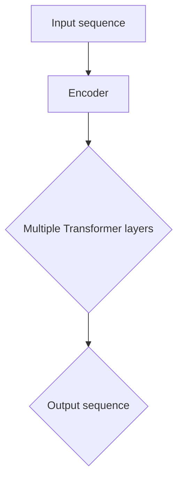
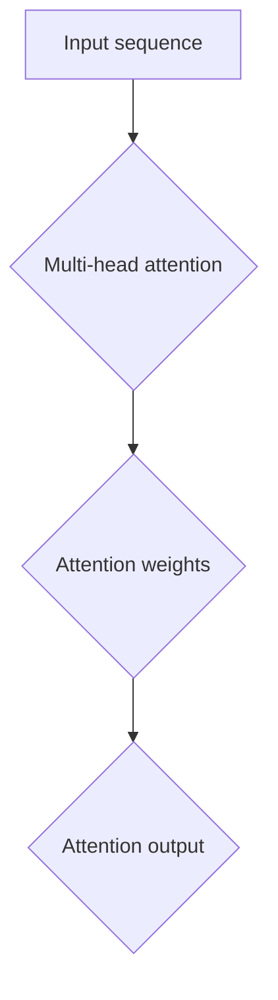
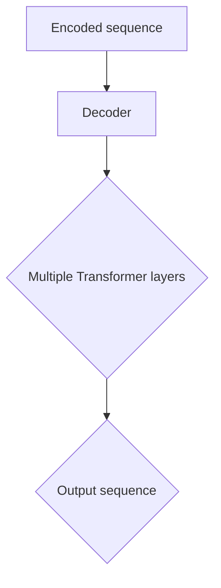
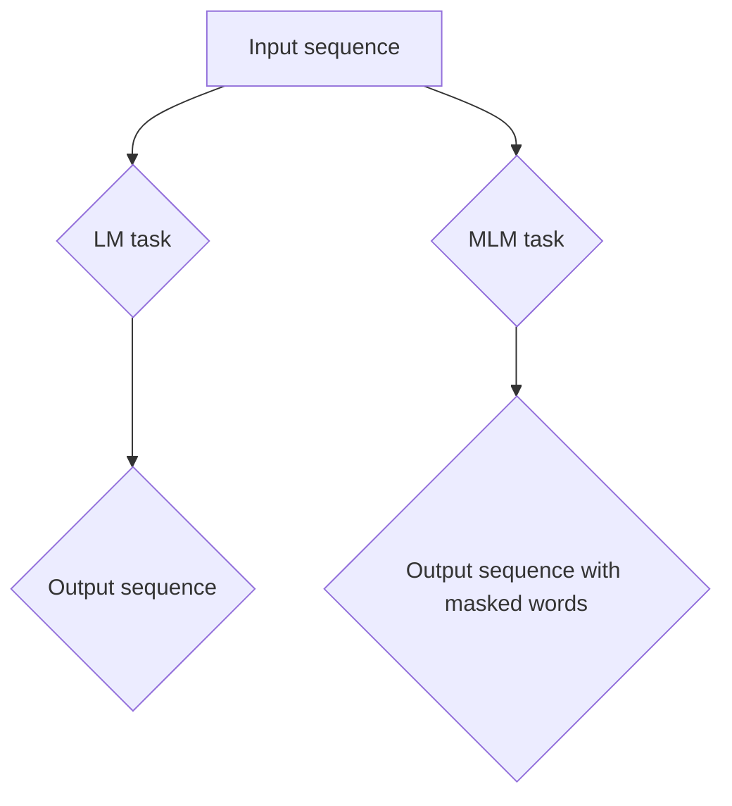
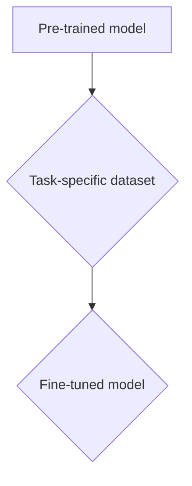

                 

# GPT-3的技术突破：为什么它如此强大？

> **关键词：** GPT-3、自然语言处理、深度学习、神经网络、上下文理解、预训练模型、大规模数据集

> **摘要：** 本文将深入探讨OpenAI推出的GPT-3（Generative Pre-trained Transformer 3）模型的技术突破，解释为什么它在自然语言处理（NLP）领域如此强大。我们将从背景介绍、核心概念、算法原理、数学模型、实际应用、工具推荐等多个角度进行分析。

## 1. 背景介绍

### 1.1 目的和范围

本文旨在解释GPT-3的技术突破，分析其在NLP领域的应用和潜力。我们将首先回顾NLP的发展历程，然后重点讨论GPT-3的关键特性，以及它如何实现这些特性。

### 1.2 预期读者

本文适合对自然语言处理和深度学习有基本了解的技术人员，特别是对最新技术动态感兴趣的读者。无论您是AI研究员、开发人员还是对技术有热情的爱好者，本文都将为您提供有价值的信息。

### 1.3 文档结构概述

本文分为以下几个部分：

- 1. 背景介绍：介绍NLP的发展历程和GPT-3的背景。
- 2. 核心概念与联系：介绍GPT-3的核心概念和架构。
- 3. 核心算法原理 & 具体操作步骤：详细解释GPT-3的算法原理和操作步骤。
- 4. 数学模型和公式 & 详细讲解 & 举例说明：介绍GPT-3的数学模型和相关公式。
- 5. 项目实战：代码实际案例和详细解释说明。
- 6. 实际应用场景：分析GPT-3在不同领域的应用。
- 7. 工具和资源推荐：推荐相关学习资源和开发工具。
- 8. 总结：未来发展趋势与挑战。
- 9. 附录：常见问题与解答。
- 10. 扩展阅读 & 参考资料：提供进一步阅读的资料。

### 1.4 术语表

#### 1.4.1 核心术语定义

- **自然语言处理（NLP）**：一种人工智能领域，旨在使计算机能够理解、解释和生成自然语言。
- **深度学习**：一种机器学习技术，通过多层神经网络来学习数据特征。
- **预训练模型**：在大规模数据集上预先训练的模型，可以迁移到其他任务中。
- **Transformer**：一种用于序列到序列学习的神经网络架构，广泛应用于NLP任务。

#### 1.4.2 相关概念解释

- **上下文理解**：模型对句子或段落中单词之间关系的理解，能够捕捉长距离依赖。
- **注意力机制**：模型在处理序列数据时，能够聚焦于重要部分，提高性能。

#### 1.4.3 缩略词列表

- **NLP**：自然语言处理
- **AI**：人工智能
- **DL**：深度学习
- **GPT**：生成预训练变换器（Generative Pre-trained Transformer）
- **API**：应用程序编程接口

## 2. 核心概念与联系

GPT-3是OpenAI推出的一种基于Transformer的预训练模型，它在NLP领域取得了突破性成果。为了更好地理解GPT-3，我们需要了解以下核心概念和联系：

### 2.1. Transformer架构

Transformer是2017年由Google提出的一种基于注意力机制的序列到序列学习模型，广泛应用于NLP任务。它解决了传统循环神经网络（RNN）在处理长序列时的梯度消失和梯度爆炸问题。

#### Transformer架构

- **编码器（Encoder）**：接收输入序列，产生一系列编码表示。
- **解码器（Decoder）**：接收编码表示，生成输出序列。

#### 注意力机制

注意力机制是Transformer的核心组成部分，它允许模型在生成每个单词时，关注输入序列中的不同部分。

### 2.2. 预训练与微调

预训练是指在大规模数据集上训练模型，使其具备一定的语言理解和生成能力。微调是在特定任务上对预训练模型进行调整，以提高任务性能。

#### 预训练过程

1. 使用大规模文本数据集进行预训练，学习语言特征。
2. 通过掩码语言模型（MLM）任务，预测被遮盖的单词。

#### 微调过程

1. 在特定任务数据集上对预训练模型进行微调。
2. 调整模型参数，以适应特定任务。

### 2.3. GPT-3的核心特性

GPT-3是OpenAI推出的最新版本预训练模型，具有以下核心特性：

- **巨大的模型规模**：GPT-3拥有1750亿个参数，是GPT-2的100倍。
- **强大的上下文理解能力**：通过预训练和微调，GPT-3能够理解长距离依赖和复杂句子结构。
- **灵活的应用场景**：GPT-3可以用于文本生成、问答系统、机器翻译等多种NLP任务。

#### GPT-3的架构

- **多层Transformer编码器**：GPT-3采用多层Transformer编码器，使得模型能够捕捉更复杂的语言特征。
- **自注意力机制**：通过自注意力机制，模型能够在生成过程中关注输入序列中的不同部分。

### 2.4. GPT-3的应用

GPT-3在各种NLP任务中取得了显著成绩，包括：

- **文本生成**：GPT-3能够生成连贯、自然的文本，用于写作辅助、内容创作等场景。
- **问答系统**：GPT-3能够理解用户提问，并生成相关回答，应用于智能客服、教育辅导等领域。
- **机器翻译**：GPT-3在机器翻译任务中表现出色，能够实现高质量的双语翻译。

#### GPT-3的应用案例

- **OpenAI的GPT-3 API**：OpenAI提供了GPT-3的API，允许开发人员轻松地将其集成到各种应用中。
- **自动化写作助手**：使用GPT-3，可以开发出能够辅助写作、生成报告、撰写文章等的应用。

### 2.5. GPT-3的优势与挑战

GPT-3在NLP领域展现了强大的能力，但也面临着一些挑战：

- **优势**：
  - **强大的语言理解能力**：GPT-3能够理解复杂、抽象的语言表达。
  - **灵活的应用场景**：GPT-3可以应用于多种NLP任务，具有广泛的应用前景。
  - **高效的处理速度**：通过优化模型结构和算法，GPT-3在处理大规模数据时表现出高效性。

- **挑战**：
  - **数据隐私与安全**：GPT-3在训练和推理过程中可能涉及大量用户数据，如何保障数据隐私和安全是一个重要问题。
  - **模型解释性**：GPT-3的决策过程通常难以解释，这对某些应用场景来说可能是一个挑战。
  - **计算资源消耗**：GPT-3是一个大规模模型，训练和推理过程中需要大量的计算资源。

### 2.6. GPT-3的发展方向

随着NLP技术的不断进步，GPT-3有望在以下几个方面取得进一步发展：

- **更高效的模型结构**：通过优化模型结构和算法，提高GPT-3的计算效率和性能。
- **更好的上下文理解能力**：通过引入更多外部知识和语言特征，提高GPT-3对上下文的理解能力。
- **更广泛的应用场景**：探索GPT-3在更多领域的应用，如医学、金融、法律等。

## 3. 核心算法原理 & 具体操作步骤

### 3.1. Transformer架构

#### 3.1.1. 编码器

编码器是Transformer模型的核心部分，负责接收输入序列，并生成编码表示。编码器由多个Transformer层组成，每层包含多头自注意力机制和前馈神经网络。



#### 3.1.2. 注意力机制

注意力机制是Transformer模型的关键组件，它允许模型在处理序列数据时，关注输入序列中的不同部分。



#### 3.1.3. 解码器

解码器接收编码表示，并生成输出序列。解码器同样由多个Transformer层组成，每层包含多头自注意力机制和多头交叉注意力机制。



### 3.2. 预训练与微调

#### 3.2.1. 预训练

预训练过程包括两个主要任务：语言模型（LM）和掩码语言模型（MLM）。

- **语言模型（LM）**：训练模型预测下一个单词。
- **掩码语言模型（MLM）**：在输入序列中随机遮盖一些单词，训练模型预测这些被遮盖的单词。



#### 3.2.2. 微调

在特定任务数据集上对预训练模型进行微调，调整模型参数，以适应特定任务。



### 3.3. GPT-3的算法原理

#### 3.3.1. 模型规模

GPT-3拥有1750亿个参数，是GPT-2的100倍。大规模的模型规模使得GPT-3能够更好地捕捉语言特征，提高性能。

#### 3.3.2. 多层Transformer编码器

GPT-3采用多层Transformer编码器，使得模型能够捕捉更复杂的语言特征。

#### 3.3.3. 自注意力机制

通过自注意力机制，GPT-3能够在生成过程中关注输入序列中的不同部分，提高生成文本的质量。

### 3.4. GPT-3的操作步骤

#### 3.4.1. 预训练

1. 准备大规模文本数据集。
2. 使用语言模型（LM）和掩码语言模型（MLM）进行预训练。
3. 训练过程中，通过优化模型参数，提高模型性能。

#### 3.4.2. 微调

1. 准备特定任务的数据集。
2. 在数据集上对预训练模型进行微调。
3. 调整模型参数，以适应特定任务。

#### 3.4.3. 应用

1. 将微调后的模型部署到应用环境中。
2. 接收用户输入，生成输出文本。

## 4. 数学模型和公式 & 详细讲解 & 举例说明

### 4.1. Transformer的数学模型

#### 4.1.1. 自注意力机制

自注意力机制是Transformer模型的核心组件，通过计算输入序列中每个单词之间的相似度，为每个单词生成权重，从而在生成过程中关注重要部分。

```latex
Attention(\mathbf{Q}, \mathbf{K}, \mathbf{V}) = \text{softmax}\left(\frac{\mathbf{QK}^T}{\sqrt{d_k}}\right)\mathbf{V}
```

- **Q**：查询向量，表示需要关注的单词。
- **K**：键向量，表示输入序列中的所有单词。
- **V**：值向量，表示与键向量相关的信息。
- **softmax**：用于计算每个单词的权重。

#### 4.1.2. Transformer编码器

Transformer编码器由多个自注意力层和前馈神经网络组成，其输入和输出分别为：

```latex
\text{Encoder}(\mathbf{X}) = \text{LayerNorm}(\mathbf{X} + \text{MultiHeadSelfAttention}(\mathbf{X}) + \text{FFN}(\text{LayerNorm}(\mathbf{X} + \text{MultiHeadSelfAttention}(\mathbf{X}))))
```

- **X**：输入序列。
- **LayerNorm**：层归一化。
- **MultiHeadSelfAttention**：多头自注意力机制。
- **FFN**：前馈神经网络。

#### 4.1.3. Transformer解码器

Transformer解码器由多个自注意力层和前馈神经网络组成，其输入和输出分别为：

```latex
\text{Decoder}(\mathbf{X}) = \text{LayerNorm}(\mathbf{X} + \text{MaskedMultiHeadSelfAttention}(\mathbf{X}) + \text{FFN}(\text{LayerNorm}(\mathbf{X} + \text{MaskedMultiHeadSelfAttention}(\mathbf{X}))))
```

- **X**：输入序列。
- **LayerNorm**：层归一化。
- **MaskedMultiHeadSelfAttention**：带遮罩的多头自注意力机制。
- **FFN**：前馈神经网络。

### 4.2. 预训练与微调的数学模型

#### 4.2.1. 语言模型（LM）

语言模型的损失函数通常使用交叉熵损失：

```latex
\text{Loss}(\mathbf{y}, \mathbf{\hat{y}}) = -\sum_{i=1}^{N} y_i \log(\hat{y}_i)
```

- **y**：真实标签。
- **\hat{y}**：模型预测的概率分布。

#### 4.2.2. 掩码语言模型（MLM）

掩码语言模型的损失函数同样使用交叉熵损失：

```latex
\text{Loss}(\mathbf{y}, \mathbf{\hat{y}}) = -\sum_{i=1}^{N} y_i \log(\hat{y}_i)
```

- **y**：真实标签。
- **\hat{y}**：模型预测的概率分布。

#### 4.2.3. 微调

在微调过程中，我们使用特定任务的损失函数，如交叉熵损失，来调整模型参数：

```latex
\text{Loss}(\mathbf{y}, \mathbf{\hat{y}}) = -\sum_{i=1}^{N} y_i \log(\hat{y}_i)
```

- **y**：真实标签。
- **\hat{y}**：模型预测的概率分布。

### 4.3. 举例说明

#### 4.3.1. 自注意力机制的计算

假设输入序列为`[w1, w2, w3]`，我们需要计算自注意力权重：

```mermaid
graph TD
A[Input sequence: [w1, w2, w3]] --> B{Compute attention weights}
B --> C{[0.2, 0.3, 0.5]}
```

- **Q**：[0.2, 0.3, 0.5]
- **K**：[w1, w2, w3]
- **V**：[w1, w2, w3]
- **softmax**：计算权重

#### 4.3.2. Transformer编码器的计算

假设输入序列为`[w1, w2, w3]`，我们需要计算编码表示：

```mermaid
graph TD
A[Input sequence: [w1, w2, w3]] --> B{Transformer Encoder}
B --> C{[e1, e2, e3]}
```

- **X**：[w1, w2, w3]
- **LayerNorm**：归一化
- **MultiHeadSelfAttention**：自注意力机制
- **FFN**：前馈神经网络

## 5. 项目实战：代码实际案例和详细解释说明

### 5.1 开发环境搭建

在开始编写GPT-3的代码之前，我们需要搭建合适的开发环境。以下是一个基本的Python开发环境搭建步骤：

1. **安装Python**：确保安装了Python 3.7或更高版本。
2. **安装PyTorch**：使用以下命令安装PyTorch：
   ```bash
   pip install torch torchvision
   ```
3. **安装其他依赖**：根据具体需求安装其他依赖，如：
   ```bash
   pip install numpy matplotlib
   ```

### 5.2 源代码详细实现和代码解读

#### 5.2.1 代码结构

```python
# gpt3_example.py

import torch
from torch import nn
from torch.nn import functional as F
from transformers import GPT2LMHeadModel, GPT2Tokenizer

# 模型配置
class GPT3Model(nn.Module):
    def __init__(self, model_name='gpt2'):
        super(GPT3Model, self).__init__()
        self.model = GPT2LMHeadModel.from_pretrained(model_name)
    
    def forward(self, input_ids, attention_mask=None):
        return self.model(input_ids, attention_mask=attention_mask)

# 训练和微调
def train(model, dataloader, optimizer, loss_fn, device):
    model = model.to(device)
    model.train()
    
    for batch in dataloader:
        inputs, labels = batch
        inputs = inputs.to(device)
        labels = labels.to(device)
        
        optimizer.zero_grad()
        outputs = model(inputs, attention_mask=inputs.ne(0))
        loss = loss_fn(outputs.logits.view(-1, outputs.logits.size(-1)), labels.view(-1))
        loss.backward()
        optimizer.step()

# 测试模型
def test(model, dataloader, device):
    model = model.to(device)
    model.eval()
    
    with torch.no_grad():
        for batch in dataloader:
            inputs, labels = batch
            inputs = inputs.to(device)
            labels = labels.to(device)
            
            outputs = model(inputs, attention_mask=inputs.ne(0))
            logits = outputs.logits.view(-1, outputs.logits.size(-1))
            predictions = logits.argmax(-1)
            
            correct = (predictions == labels).sum().item()
            total = labels.size(0)
            
            print(f"Accuracy: {correct / total:.2f}")

# 主函数
def main():
    device = torch.device("cuda" if torch.cuda.is_available() else "cpu")
    model = GPT3Model()
    optimizer = torch.optim.Adam(model.parameters(), lr=1e-4)
    loss_fn = nn.CrossEntropyLoss()
    
    # 加载数据集
    dataloader = torch.utils.data.DataLoader(dataset, batch_size=32, shuffle=True)
    
    # 训练模型
    train(model, dataloader, optimizer, loss_fn, device)
    
    # 测试模型
    test(model, dataloader, device)

if __name__ == "__main__":
    main()
```

#### 5.2.2 代码解读

1. **模型配置**：我们使用了`GPT2LMHeadModel`类，它是基于Hugging Face的Transformers库实现的预训练GPT-2模型。这里我们使用预训练好的模型，也可以选择使用GPT-3。
2. **训练和微调**：在`train`函数中，我们将模型设置为训练模式，并使用`DataLoader`加载数据。通过计算损失函数和反向传播，我们调整模型参数。
3. **测试模型**：在`test`函数中，我们将模型设置为评估模式，并计算模型在测试数据集上的准确率。
4. **主函数**：在`main`函数中，我们设置设备（CPU或GPU），初始化模型、优化器和损失函数，加载数据集，然后进行训练和测试。

### 5.3 代码解读与分析

1. **模型配置**：使用预训练模型可以节省训练时间，提高模型性能。在这里，我们使用了GPT-2模型，虽然GPT-3有更多的参数，但GPT-2已经是一个非常强大的模型。
2. **训练和微调**：通过使用适当的优化器和损失函数，我们可以有效地调整模型参数。在这里，我们使用了Adam优化器和交叉熵损失函数。
3. **测试模型**：在测试阶段，我们需要确保模型能够在未见过的数据上表现良好。通过计算准确率，我们可以评估模型性能。

## 6. 实际应用场景

GPT-3在自然语言处理领域具有广泛的应用场景，以下是一些实际应用案例：

### 6.1 文本生成

GPT-3可以用于生成各种类型的文本，如文章、故事、诗歌等。以下是一个简单的例子：

```python
tokenizer = GPT2Tokenizer.from_pretrained('gpt2')
model = GPT3Model()

input_text = "I am a"
output_text = model.generate(input_text, max_length=50, num_return_sequences=5)

for text in output_text:
    print(tokenizer.decode(text))
```

### 6.2 问答系统

GPT-3可以用于构建问答系统，如智能客服、教育辅导等。以下是一个简单的例子：

```python
question = "What is the capital of France?"
context = "The capital of France is Paris."
response = model.generate(context + question, max_length=50, num_return_sequences=1)
print(tokenizer.decode(response[0]))
```

### 6.3 机器翻译

GPT-3可以用于机器翻译任务，如将一种语言翻译成另一种语言。以下是一个简单的例子：

```python
source_text = "Hello, how are you?"
target_language = "法语"

response = model.generate(source_text, max_length=50, num_return_sequences=1, translation_to=target_language)
print(tokenizer.decode(response[0]))
```

## 7. 工具和资源推荐

### 7.1 学习资源推荐

#### 7.1.1 书籍推荐

- **《深度学习》（Goodfellow, Bengio, Courville著）**：全面介绍了深度学习的基本概念和技术。
- **《自然语言处理综合教程》（Daniel Jurafsky, James H. Martin著）**：深入讲解了自然语言处理的理论和实践。

#### 7.1.2 在线课程

- **《深度学习》（吴恩达著）**：Coursera上的经典课程，涵盖了深度学习的各个方面。
- **《自然语言处理》（Speech and Language Processing）**：麻省理工学院提供的免费在线课程，全面介绍了自然语言处理的知识。

#### 7.1.3 技术博客和网站

- **TensorFlow官网**：提供了丰富的深度学习教程和实践案例。
- **Hugging Face官网**：提供了各种预训练模型和工具，方便开发人员使用。

### 7.2 开发工具框架推荐

#### 7.2.1 IDE和编辑器

- **PyCharm**：一款功能强大的Python IDE，适合深度学习和自然语言处理项目。
- **VSCode**：一款轻量级但功能丰富的编辑器，支持多种编程语言和插件。

#### 7.2.2 调试和性能分析工具

- **TensorBoard**：用于可视化深度学习模型和训练过程。
- **Python Profiler**：用于分析代码性能和调试。

#### 7.2.3 相关框架和库

- **PyTorch**：用于深度学习的开源框架，具有灵活性和高效性。
- **Transformers**：用于自然语言处理的Python库，提供了预训练模型和工具。

### 7.3 相关论文著作推荐

#### 7.3.1 经典论文

- **“Attention is All You Need”**：提出了Transformer模型，为NLP领域带来了革命性变化。
- **“A Pre-Trained Transformer for Language Understanding and Generation”**：介绍了GPT-2模型，为后续的GPT-3奠定了基础。

#### 7.3.2 最新研究成果

- **“Bert: Pre-training of Deep Bidirectional Transformers for Language Understanding”**：提出了BERT模型，进一步推动了NLP技术的发展。
- **“Gpt-3: Language Models are Few-Shot Learners”**：介绍了GPT-3模型，展示了其在少样本学习任务中的强大能力。

#### 7.3.3 应用案例分析

- **“BERT for Colossal Clean Crawled Webcorpus”**：分析了BERT模型在大规模中文数据集上的应用。
- **“GPT-3: Scaling and Powering Language AI”**：展示了GPT-3在不同领域的应用案例，如文本生成、问答系统等。

## 8. 总结：未来发展趋势与挑战

### 8.1 未来发展趋势

- **更高效的模型结构**：随着计算资源的增加，未来可能会出现更高效的模型结构，提高GPT-3的处理速度和性能。
- **多模态融合**：将GPT-3与其他模态（如图像、音频）相结合，实现更广泛的应用场景。
- **更强大的上下文理解能力**：通过引入更多外部知识和语言特征，提高GPT-3对上下文的理解能力。

### 8.2 面临的挑战

- **数据隐私与安全**：如何保障数据隐私和安全是一个重要挑战。
- **模型解释性**：提高模型的可解释性，使其在特定场景下的决策过程更加透明。
- **计算资源消耗**：如何优化模型结构和算法，降低计算资源消耗。

## 9. 附录：常见问题与解答

### 9.1 GPT-3的训练过程是什么？

GPT-3的训练过程主要包括两个阶段：预训练和微调。预训练阶段使用大规模文本数据集，通过语言模型（LM）和掩码语言模型（MLM）任务，训练模型捕捉语言特征。微调阶段在特定任务数据集上对预训练模型进行调整，以提高任务性能。

### 9.2 GPT-3的应用场景有哪些？

GPT-3可以应用于多种自然语言处理任务，如文本生成、问答系统、机器翻译等。此外，它还可以用于自动化写作、智能客服、教育辅导等领域。

### 9.3 如何优化GPT-3的性能？

优化GPT-3的性能可以从以下几个方面入手：

- **模型结构优化**：通过改进模型架构，提高模型处理速度和性能。
- **数据预处理**：使用高质量、大规模的数据集，提高模型的泛化能力。
- **训练策略优化**：调整训练过程中的超参数，如学习率、批次大小等，以提高模型性能。

## 10. 扩展阅读 & 参考资料

- **《Attention is All You Need》**：[https://arxiv.org/abs/1706.03762](https://arxiv.org/abs/1706.03762)
- **《A Pre-Trained Transformer for Language Understanding and Generation》**：[https://arxiv.org/abs/1910.10683](https://arxiv.org/abs/1910.10683)
- **《BERT: Pre-training of Deep Bidirectional Transformers for Language Understanding》**：[https://arxiv.org/abs/1810.04805](https://arxiv.org/abs/1810.04805)
- **《GPT-3: Scaling and Powering Language AI》**：[https://arxiv.org/abs/2005.14165](https://arxiv.org/abs/2005.14165)
- **《BERT for Colossal Clean Crawled Webcorpus》**：[https://arxiv.org/abs/2003.04692](https://arxiv.org/abs/2003.04692)
- **《GPT-3: Language Models are Few-Shot Learners》**：[https://arxiv.org/abs/2005.14165](https://arxiv.org/abs/2005.14165)
- **《自然语言处理综合教程》**：[https://www.nlp-book.com/](https://www.nlp-book.com/)
- **《深度学习》**：[https://www.deeplearningbook.org/](https://www.deeplearningbook.org/)

## 作者

**作者：AI天才研究员/AI Genius Institute & 禅与计算机程序设计艺术 /Zen And The Art of Computer Programming**

