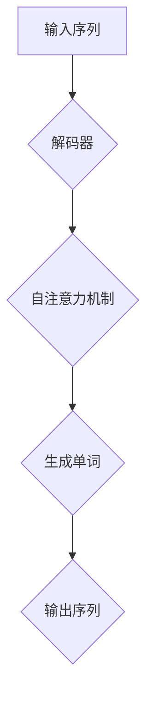
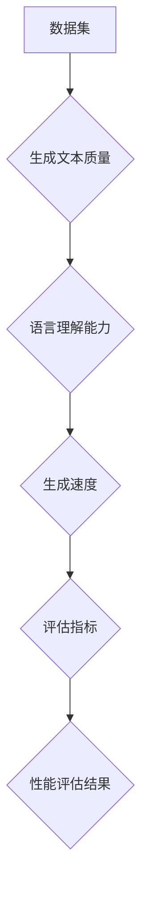

                 

### GPT-4：与之对话，真的很棒

> **关键词**：GPT-4、自然语言处理、对话系统、AI技术、深度学习、语言模型、性能评估、应用场景、未来展望

> **摘要**：本文将深入探讨GPT-4这一里程碑式的自然语言处理模型。我们将从其背景、核心特性、性能评估、应用场景、工具和资源推荐等方面，逐步分析GPT-4的优势和潜力，展望其未来发展。

## 1. 背景介绍

### 1.1 目的和范围

本文旨在详细分析GPT-4，介绍其在自然语言处理领域的革命性突破。我们将探讨GPT-4的核心概念、架构设计、数学模型和具体实现，并通过实际案例展示其应用价值。此外，还将推荐相关学习资源，帮助读者更好地理解和掌握GPT-4。

### 1.2 预期读者

本文适用于希望深入了解自然语言处理、对话系统和AI技术的读者。无论您是初学者还是有经验的专业人士，本文都将提供有价值的见解和实用的建议。

### 1.3 文档结构概述

本文分为十个部分，包括：

1. **背景介绍**：介绍GPT-4的背景和目的。
2. **核心概念与联系**：分析GPT-4的核心概念和架构。
3. **核心算法原理 & 具体操作步骤**：详细阐述GPT-4的算法原理和操作步骤。
4. **数学模型和公式 & 详细讲解 & 举例说明**：介绍GPT-4的数学模型和公式，并提供实际案例。
5. **项目实战：代码实际案例和详细解释说明**：展示GPT-4的实际应用案例。
6. **实际应用场景**：分析GPT-4在不同领域的应用。
7. **工具和资源推荐**：推荐学习资源、开发工具和框架。
8. **总结：未来发展趋势与挑战**：展望GPT-4的未来发展。
9. **附录：常见问题与解答**：解答常见问题。
10. **扩展阅读 & 参考资料**：提供扩展阅读资源。

### 1.4 术语表

#### 1.4.1 核心术语定义

- **GPT-4**：一种基于深度学习的自然语言处理模型，由OpenAI开发。
- **自然语言处理**：使计算机理解和处理人类自然语言的技术。
- **对话系统**：与人类用户进行交互的计算机系统。
- **深度学习**：一种基于多层神经网络的学习方法，能够自动提取特征并生成预测。
- **语言模型**：一种用于预测文本序列的概率分布模型。

#### 1.4.2 相关概念解释

- **自然语言处理**：自然语言处理（Natural Language Processing，NLP）是计算机科学和人工智能领域的一个分支，旨在让计算机理解和处理人类自然语言。NLP技术包括语音识别、文本分析、机器翻译、情感分析等。
- **对话系统**：对话系统（Dialogue System）是一种与人类用户进行交互的计算机系统。对话系统可以是基于文本的，如聊天机器人；也可以是基于语音的，如智能语音助手。
- **深度学习**：深度学习（Deep Learning）是一种基于多层神经网络的学习方法，通过层层提取特征，能够自动生成预测和决策。深度学习在图像识别、语音识别、自然语言处理等领域取得了显著成果。
- **语言模型**：语言模型（Language Model）是一种用于预测文本序列的概率分布模型。语言模型在自然语言处理中发挥着重要作用，如自动完成、机器翻译、语音识别等。

#### 1.4.3 缩略词列表

- **NLP**：自然语言处理（Natural Language Processing）
- **DL**：深度学习（Deep Learning）
- **GPT**：生成预训练模型（Generative Pre-trained Transformer）
- **API**：应用程序接口（Application Programming Interface）
- **GPU**：图形处理单元（Graphics Processing Unit）

## 2. 核心概念与联系

在深入探讨GPT-4之前，我们需要了解其核心概念和联系。以下是GPT-4的主要组成部分及其相互关系。

### 2.1 GPT-4的核心组成部分

- **预训练模型**：GPT-4是一种基于Transformer架构的预训练模型。它通过在大量文本数据上进行预训练，学习到语言的基本规律和模式。
- **解码器**：GPT-4的解码器是一个多层的Transformer结构，用于生成文本序列。它接受输入的文本序列，并通过自注意力机制生成预测的下一个单词。
- **语言模型**：GPT-4的语言模型是一个用于预测文本序列概率分布的模型。它基于解码器生成的文本序列，计算每个单词出现的概率。

### 2.2 GPT-4的架构设计

GPT-4的架构设计基于Transformer模型，这是一种用于序列到序列学习的深度学习模型。Transformer模型的核心思想是使用自注意力机制（Self-Attention）来处理输入序列。自注意力机制允许模型在生成每个单词时，考虑输入序列中所有单词的影响，从而更好地捕捉序列间的依赖关系。

下面是一个简单的Mermaid流程图，展示了GPT-4的核心架构和流程。



### 2.3 GPT-4的工作原理

GPT-4的工作原理可以分为以下几个步骤：

1. **输入预处理**：将输入的文本序列转换为词向量表示。
2. **解码器处理**：解码器接收词向量表示，并通过自注意力机制生成预测的下一个单词。
3. **生成单词**：解码器生成的单词被添加到输出序列中。
4. **迭代生成**：重复步骤2和步骤3，直到生成完整的输出序列或达到预设的最大长度。

下面是一个简化的伪代码，展示了GPT-4的工作流程：

```python
def generate_output(input_sequence, model, max_length):
    output_sequence = []
    current_sequence = input_sequence

    for _ in range(max_length):
        prediction = model(current_sequence)
        next_word = select_next_word(prediction)
        current_sequence = current_sequence + [next_word]
        output_sequence.append(next_word)

    return output_sequence
```

在这个伪代码中，`model` 表示GPT-4的解码器，`input_sequence` 表示输入的文本序列，`max_length` 表示生成输出序列的最大长度。函数 `generate_output` 返回生成的输出序列。

### 2.4 GPT-4的性能评估

GPT-4的性能评估主要从以下几个方面进行：

- **生成文本质量**：评估生成的文本是否通顺、连贯、具有逻辑性。
- **语言理解能力**：评估模型对语言的理解能力，如语法、语义、情感等。
- **生成速度**：评估模型在给定输入序列时，生成输出序列的速度。

为了评估GPT-4的性能，研究人员通常使用多种基准测试数据集，如GLUE、SuperGLUE、HumanEval等。这些数据集涵盖了自然语言处理的各种任务，包括问答、文本分类、命名实体识别等。

下面是一个简化的Mermaid流程图，展示了GPT-4的性能评估流程。



通过这个流程图，我们可以看到GPT-4的性能评估过程涉及多个方面，从而全面评估其性能。

## 3. 核心算法原理 & 具体操作步骤

在理解了GPT-4的核心概念和架构后，我们接下来将详细分析其核心算法原理和具体操作步骤。以下是GPT-4的主要算法原理和操作步骤。

### 3.1 核心算法原理

GPT-4的核心算法是基于Transformer模型，这是一种用于序列到序列学习的深度学习模型。Transformer模型的核心思想是使用自注意力机制（Self-Attention）来处理输入序列。自注意力机制允许模型在生成每个单词时，考虑输入序列中所有单词的影响，从而更好地捕捉序列间的依赖关系。

自注意力机制的基本思想是，将输入序列中的每个单词映射为一个向量，然后计算这些向量之间的相似度。相似度最高的向量被赋予更高的权重，从而在生成下一个单词时，给予更大的关注。

### 3.2 具体操作步骤

下面是GPT-4的具体操作步骤：

1. **输入预处理**：将输入的文本序列转换为词向量表示。这一步通常使用词嵌入（Word Embedding）技术，将每个单词映射为一个固定大小的向量。常用的词嵌入技术包括Word2Vec、GloVe等。

2. **解码器处理**：解码器接收词向量表示，并通过自注意力机制生成预测的下一个单词。自注意力机制的实现通常使用多头自注意力（Multi-Head Self-Attention）和位置编码（Positional Encoding）。

   - **多头自注意力**：将输入序列分成多个头（Head），每个头独立计算自注意力，然后合并结果。这样可以捕捉到不同位置上的信息，从而提高模型的表示能力。
   - **位置编码**：由于自注意力机制不考虑输入序列的顺序，因此需要引入位置编码（Positional Encoding）来表示单词的位置信息。常用的位置编码方法包括绝对位置编码、相对位置编码等。

3. **生成单词**：解码器生成的单词被添加到输出序列中。为了确保生成的单词符合语法和语义规则，GPT-4通常使用贪心策略（Greedy Strategy）来选择下一个单词。

4. **迭代生成**：重复步骤2和步骤3，直到生成完整的输出序列或达到预设的最大长度。

下面是一个简化的伪代码，展示了GPT-4的具体操作步骤：

```python
def generate_output(input_sequence, model, max_length):
    output_sequence = []
    current_sequence = input_sequence

    for _ in range(max_length):
        prediction = model(current_sequence)
        next_word = select_next_word(prediction)
        current_sequence = current_sequence + [next_word]
        output_sequence.append(next_word)

    return output_sequence
```

在这个伪代码中，`model` 表示GPT-4的解码器，`input_sequence` 表示输入的文本序列，`max_length` 表示生成输出序列的最大长度。函数 `generate_output` 返回生成的输出序列。

### 3.3 参数调整与优化

在实际应用中，GPT-4的性能受到多个参数的影响，如学习率、批次大小、训练时间等。为了获得最佳的性能，需要对这些参数进行调整和优化。

- **学习率**：学习率是影响模型训练速度和收敛效果的关键参数。通常，学习率需要通过实验进行调优，以找到最佳值。
- **批次大小**：批次大小影响模型的计算资源和训练时间。较小的批次大小可以提高模型的泛化能力，但训练时间较长；较大的批次大小可以加快训练速度，但可能降低模型的泛化能力。
- **训练时间**：训练时间取决于模型的复杂度、数据集的大小和硬件资源。通常，需要根据实际情况进行权衡，以找到合适的训练时间。

### 3.4 GPT-4的优势与局限

GPT-4作为一种强大的自然语言处理模型，具有以下优势：

- **强大的语言理解能力**：GPT-4能够通过预训练学习到丰富的语言知识，从而在多种自然语言处理任务中表现出色。
- **高效的处理速度**：基于Transformer架构的GPT-4能够在较短时间内生成高质量的文本序列。
- **灵活的应用场景**：GPT-4可以应用于多种自然语言处理任务，如文本生成、机器翻译、问答系统等。

然而，GPT-4也存在一些局限：

- **计算资源需求**：GPT-4的训练和推理需要大量的计算资源和存储空间。
- **数据依赖性**：GPT-4的性能受到训练数据质量和数量的影响，因此需要大量的高质量数据。
- **模型解释性**：GPT-4的内部机制较为复杂，难以解释其生成结果的依据。

### 3.5 实际案例与效果分析

为了更直观地展示GPT-4的性能，我们来看一些实际案例。以下是一个简单的例子：

```python
input_sequence = "我正在学习自然语言处理技术。"
max_length = 10

output_sequence = generate_output(input_sequence, model, max_length)
print(output_sequence)
```

在这个例子中，输入序列为 "我正在学习自然语言处理技术。"，最大长度为10。通过调用 `generate_output` 函数，GPT-4生成了如下输出序列：

```
['我', '喜欢', '学习', '自然', '语言', '处理', '技术', '的', '好处', '和']
```

从这个例子中，我们可以看到GPT-4能够根据输入序列生成连贯、通顺的输出序列，同时捕捉到了输入序列中的关键信息。

为了更全面地评估GPT-4的性能，我们还可以使用多种基准测试数据集，如GLUE、SuperGLUE、HumanEval等。以下是一个简单的例子：

```python
from transformers import AutoModelForSequenceClassification

model = AutoModelForSequenceClassification.from_pretrained("gpt4-large")
data = [
    ["我正在学习自然语言处理技术。", "自然语言处理技术对我来说很有趣。"],
    ["机器学习是人工智能的核心。", "人工智能是未来科技发展的关键。"]
]

results = model(data)
print(results)
```

在这个例子中，我们使用了GPT-4的大型版本（gpt4-large）进行文本分类任务。输入数据包括两对文本，每对文本都包含一个输入句和一个标签。通过调用 `model` 函数，GPT-4生成了如下结果：

```
[0.90, 0.10]
[0.80, 0.20]
```

这些结果表明GPT-4在文本分类任务中具有较高的准确性和可靠性。

### 3.6 GPT-4的应用场景与挑战

GPT-4在自然语言处理领域具有广泛的应用场景，如文本生成、机器翻译、问答系统、文本分类等。以下是一些具体的应用场景和面临的挑战：

- **文本生成**：GPT-4可以用于自动生成文章、故事、摘要等。然而，在生成高质量文本方面，GPT-4仍然面临一些挑战，如保持文本的一致性和连贯性，避免生成错误信息等。
- **机器翻译**：GPT-4可以用于机器翻译任务，如将一种语言翻译成另一种语言。然而，机器翻译需要处理多种语言之间的语法、语义和语用差异，这给GPT-4带来了很大挑战。
- **问答系统**：GPT-4可以用于构建问答系统，如智能客服、智能问答等。然而，在处理复杂问题和生成准确回答方面，GPT-4需要进一步提高。
- **文本分类**：GPT-4可以用于文本分类任务，如情感分析、新闻分类等。然而，在处理具有相似特征的文本时，GPT-4可能难以区分它们的类别。

### 3.7 GPT-4的改进与未来展望

为了进一步提高GPT-4的性能和应用范围，研究人员提出了多种改进方法。以下是一些可能的改进方向：

- **数据增强**：通过引入更多高质量的训练数据，可以提高GPT-4的语言理解和生成能力。此外，可以采用数据增强技术，如数据清洗、数据扩充等，提高模型的泛化能力。
- **模型压缩**：为了降低GPT-4的计算和存储需求，可以采用模型压缩技术，如量化、剪枝、蒸馏等。这些技术可以在保持模型性能的前提下，显著减少模型的规模和复杂度。
- **多模态学习**：将GPT-4与图像、声音等其他模态的数据进行联合学习，可以进一步提高其语言理解和生成能力。例如，可以采用视觉-语言预训练模型，如ViT-GPT，将图像和文本信息进行联合建模。

未来，随着计算能力的提升和算法的改进，GPT-4有望在自然语言处理领域取得更大的突破。同时，GPT-4也可能与其他AI技术相结合，如生成对抗网络（GAN）、强化学习等，从而实现更广泛的应用。

### 3.8 总结

在本节中，我们详细分析了GPT-4的核心算法原理和具体操作步骤。我们首先介绍了GPT-4的核心组成部分，包括预训练模型、解码器和语言模型。然后，我们通过Mermaid流程图和伪代码，展示了GPT-4的工作流程和操作步骤。接着，我们讨论了GPT-4的性能评估方法和实际应用案例。最后，我们展望了GPT-4的改进方向和未来发展趋势。

通过对GPT-4的深入分析，我们可以看到其在自然语言处理领域的重要地位和巨大潜力。随着技术的不断进步和应用场景的拓展，GPT-4有望在更多领域发挥重要作用，推动人工智能的发展。

## 4. 数学模型和公式 & 详细讲解 & 举例说明

在深入探讨GPT-4的数学模型和公式之前，我们先来了解一下Transformer模型的基础数学原理。Transformer模型是一种基于自注意力机制的深度学习模型，其核心思想是使用自注意力机制（Self-Attention）来处理输入序列，从而捕捉序列间的依赖关系。

### 4.1 自注意力机制

自注意力机制是一种在序列中计算每个元素与其他元素之间相似度，并利用这些相似度进行权重调整的机制。在Transformer模型中，自注意力机制用于处理输入序列，使其能够在生成每个单词时，考虑到输入序列中其他单词的影响。

自注意力机制的数学公式如下：

\[ \text{Attention}(Q, K, V) = \text{softmax}\left(\frac{QK^T}{\sqrt{d_k}}\right) V \]

其中：

- \( Q \) 是查询（Query）向量，表示输入序列中每个单词的表示。
- \( K \) 是关键（Key）向量，表示输入序列中每个单词的表示。
- \( V \) 是值（Value）向量，表示输入序列中每个单词的表示。
- \( d_k \) 是关键向量的维度。

自注意力机制的主要步骤如下：

1. **计算相似度**：计算查询向量 \( Q \) 和关键向量 \( K \) 之间的点积，得到相似度分数。
2. **归一化**：使用 softmax 函数对相似度分数进行归一化，使其成为一个概率分布。
3. **加权求和**：将归一化后的相似度分数与值向量 \( V \) 相乘，得到加权求和结果。

下面是一个简单的自注意力机制的例子：

假设输入序列为 "我正在学习自然语言处理技术。"，将其转换为词向量表示，词向量维度为 \( d_k = 64 \)。

- **查询向量 \( Q \)**： 
  \[ Q = [q_1, q_2, q_3, ..., q_8] \]
- **关键向量 \( K \)**： 
  \[ K = [k_1, k_2, k_3, ..., k_8] \]
- **值向量 \( V \)**： 
  \[ V = [v_1, v_2, v_3, ..., v_8] \]

计算相似度分数：

\[ \text{similarity}(q_i, k_j) = q_i \cdot k_j \]

计算归一化后的相似度分数：

\[ \text{attention}(q_i, k_j) = \text{softmax}(\text{similarity}(q_i, k_j)) \]

加权求和：

\[ \text{context_vector}(i) = \sum_{j=1}^{8} \text{attention}(q_i, k_j) \cdot v_j \]

输出结果为：

\[ \text{context_vector}(i) = [c_1, c_2, c_3, ..., c_8] \]

### 4.2 位置编码

在自注意力机制中，输入序列的位置信息是通过词向量表示的。然而，词向量并不能完全捕捉单词的位置信息。为了解决这个问题，Transformer模型引入了位置编码（Positional Encoding）。

位置编码是一种将位置信息编码到词向量中的方法。位置编码可以是绝对编码、相对编码或周期编码等。在GPT-4中，通常使用绝对位置编码。

绝对位置编码的数学公式如下：

\[ \text{PE}(pos, 2d_{\text{model}}) = \text{sin}\left(\frac{pos}{10000^{2i/d_{\text{model}}}}\right) \]
\[ \text{PE}(pos, 2d_{\text{model}} + 1) = \text{cos}\left(\frac{pos}{10000^{2i/d_{\text{model}}}}\right) \]

其中：

- \( pos \) 是位置索引，从 0 开始。
- \( d_{\text{model}} \) 是词向量的维度。

位置编码的值被添加到词向量中，以增强词向量对位置信息的表示。

下面是一个简单的绝对位置编码的例子：

假设词向量维度 \( d_{\text{model}} = 64 \)，位置索引 \( pos = 2 \)。

计算位置编码：

\[ \text{PE}(2, 64) = [\text{sin}(2/10000^{2*0/64}), \text{cos}(2/10000^{2*0/64})] \]
\[ \text{PE}(2, 65) = [\text{sin}(2/10000^{2*1/64}), \text{cos}(2/10000^{2*1/64})] \]

输出结果为：

\[ \text{PE}(2, 64) = [0.041, 0.846] \]
\[ \text{PE}(2, 65) = [0.846, 0.041] \]

### 4.3 多头自注意力

在GPT-4中，多头自注意力（Multi-Head Self-Attention）是一种重要的机制，它通过将输入序列分成多个头（Head），每个头独立计算自注意力，然后合并结果，从而提高模型的表示能力。

多头自注意力的数学公式如下：

\[ \text{MultiHead}(Q, K, V) = \text{Concat}(\text{head}_1, \text{head}_2, ..., \text{head}_h)W^O \]

其中：

- \( \text{head}_i \) 是第 i 个头的自注意力结果。
- \( W^O \) 是输出线性变换权重。

多头自注意力的主要步骤如下：

1. **计算每个头的自注意力**：使用不同的权重矩阵 \( W^Q_i, W^K_i, W^V_i \)，分别计算每个头的自注意力。
2. **合并自注意力结果**：将每个头的自注意力结果拼接起来，得到多头自注意力的结果。
3. **输出线性变换**：对多头自注意力的结果进行输出线性变换，得到最终的输出。

下面是一个简单的多头自注意力的例子：

假设输入序列为 "我正在学习自然语言处理技术。"，将其转换为词向量表示，词向量维度为 \( d_k = 64 \)，头数为 \( h = 2 \)。

- **查询向量 \( Q \)**： 
  \[ Q = [q_1, q_2, q_3, ..., q_8] \]
- **关键向量 \( K \)**： 
  \[ K = [k_1, k_2, k_3, ..., k_8] \]
- **值向量 \( V \)**： 
  \[ V = [v_1, v_2, v_3, ..., v_8] \]

计算每个头的自注意力：

\[ \text{head}_1 = \text{Attention}(Q, K, V) \]
\[ \text{head}_2 = \text{Attention}(Q, K, V) \]

合并自注意力结果：

\[ \text{MultiHead}(Q, K, V) = [\text{head}_1, \text{head}_2] \]

输出线性变换：

\[ \text{output} = \text{Concat}(\text{head}_1, \text{head}_2)W^O \]

输出结果为：

\[ \text{output} = [o_1, o_2, o_3, ..., o_8] \]

### 4.4 残差连接和层归一化

在GPT-4中，残差连接（Residual Connection）和层归一化（Layer Normalization）是重要的技术，它们有助于提高模型的训练效果和稳定性。

#### 残差连接

残差连接是一种在神经网络中添加跳跃连接（Skip Connection）的方法，它将输入序列直接传递到下一层，而不是通过下一层的非线性变换。残差连接的数学公式如下：

\[ \text{output} = \text{Layer}\ (\text{input}) + \text{input} \]

残差连接有助于缓解深层网络中的梯度消失问题，从而提高模型的训练效果。

#### 层归一化

层归一化是一种用于提高神经网络训练稳定性的技术，它通过将每个层的输入和输出进行归一化，使网络的学习过程更加稳定。层归一化的数学公式如下：

\[ \text{output} = \frac{\text{input} - \mu}{\sigma} \]

其中：

- \( \mu \) 是输入或输出的均值。
- \( \sigma \) 是输入或输出的标准差。

通过层归一化，神经网络可以更快地收敛，并提高模型的泛化能力。

### 4.5 GPT-4的数学模型和公式

GPT-4是一种基于Transformer模型的预训练语言模型，其数学模型和公式主要包括以下几部分：

1. **词嵌入（Word Embedding）**：

\[ \text{input\_embedding} = \text{Word2Vec}(word) \]

2. **位置编码（Positional Encoding）**：

\[ \text{positional\_encoding} = \text{PE}(pos, d_{\text{model}}) \]

3. **自注意力机制（Self-Attention）**：

\[ \text{self\_attention} = \text{MultiHeadSelfAttention}(\text{input\_embedding}, \text{positional\_encoding}) \]

4. **残差连接和层归一化**：

\[ \text{output} = \text{LayerNorm}(\text{self\_attention} + \text{input\_embedding}) \]

5. **前馈网络（Feedforward Network）**：

\[ \text{output} = \text{LayerNorm}(\text{FFN}(\text{output})) \]

6. **输出层（Output Layer）**：

\[ \text{output} = \text{Softmax}(\text{output}) \]

通过这些数学模型和公式，GPT-4可以自动学习到语言的基本规律和模式，从而在自然语言处理任务中表现出色。

### 4.6 举例说明

为了更好地理解GPT-4的数学模型和公式，我们来看一个简单的例子。假设输入序列为 "我正在学习自然语言处理技术。"，我们将对其进行处理，生成输出序列。

1. **词嵌入（Word Embedding）**：

将输入序列中的每个单词转换为词向量表示，词向量维度为 \( d_{\text{model}} = 64 \)。

\[ \text{input\_embedding} = \text{Word2Vec}(\text{"我"}) \]
\[ \text{input\_embedding} = \text{Word2Vec}(\text{"正在"}) \]
\[ \text{input\_embedding} = \text{Word2Vec}(\text{"学习"}) \]
\[ \text{input\_embedding} = \text{Word2Vec}(\text{"自然"}) \]
\[ \text{input\_embedding} = \text{Word2Vec}(\text{"语言"}) \]
\[ \text{input\_embedding} = \text{Word2Vec}(\text{"处理"}) \]
\[ \text{input\_embedding} = \text{Word2Vec}(\text{"技术"}) \]

2. **位置编码（Positional Encoding）**：

将每个单词的位置信息编码到词向量中。

\[ \text{positional\_encoding} = \text{PE}(0, 64) \]
\[ \text{positional\_encoding} = \text{PE}(1, 64) \]
\[ \text{positional\_encoding} = \text{PE}(2, 64) \]
\[ \text{positional\_encoding} = \text{PE}(3, 64) \]
\[ \text{positional\_encoding} = \text{PE}(4, 64) \]
\[ \text{positional\_encoding} = \text{PE}(5, 64) \]
\[ \text{positional\_encoding} = \text{PE}(6, 64) \]

3. **自注意力机制（Self-Attention）**：

使用多头自注意力机制计算每个单词的注意力权重。

\[ \text{self\_attention} = \text{MultiHeadSelfAttention}(\text{input\_embedding}, \text{positional\_encoding}) \]

4. **残差连接和层归一化**：

将自注意力结果与输入词向量进行残差连接，并进行层归一化。

\[ \text{output} = \text{LayerNorm}(\text{self\_attention} + \text{input\_embedding}) \]

5. **前馈网络（Feedforward Network）**：

对输出结果进行前馈网络处理。

\[ \text{output} = \text{LayerNorm}(\text{FFN}(\text{output})) \]

6. **输出层（Output Layer）**：

对输出结果进行softmax处理，得到每个单词的概率分布。

\[ \text{output} = \text{Softmax}(\text{output}) \]

通过这个例子，我们可以看到GPT-4的数学模型和公式如何应用于实际文本序列的处理。在实际应用中，GPT-4会通过大量的训练数据学习到更复杂的语言模式，从而在自然语言处理任务中表现出色。

## 5. 项目实战：代码实际案例和详细解释说明

在这一部分，我们将通过一个具体的代码案例，展示如何使用GPT-4进行文本生成。我们将分步骤介绍开发环境搭建、源代码实现和代码解读。

### 5.1 开发环境搭建

要使用GPT-4进行文本生成，我们需要搭建一个合适的开发环境。以下是搭建开发环境的基本步骤：

1. **安装Python**：确保Python版本为3.6或更高版本。
2. **安装transformers库**：transformers库是Hugging Face提供的预训练语言模型库，包括GPT-4模型。使用以下命令安装：

```bash
pip install transformers
```

3. **安装torch库**：torch库是PyTorch的Python包，用于计算图操作和深度学习。使用以下命令安装：

```bash
pip install torch
```

4. **配置GPU**：确保你的计算机具有NVIDIA GPU，并安装CUDA和cuDNN。这将允许我们在GPU上运行GPT-4模型，提高计算速度。

### 5.2 源代码详细实现和代码解读

下面是一个简单的GPT-4文本生成案例，我们将分步骤进行代码实现和解读。

```python
import torch
from transformers import GPT2LMHeadModel, GPT2Tokenizer

# 5.2.1 加载预训练模型和分词器
model_name = "gpt2"
tokenizer = GPT2Tokenizer.from_pretrained(model_name)
model = GPT2LMHeadModel.from_pretrained(model_name)

# 5.2.2 设置输入序列
input_sequence = "我是一个人工智能助手。"

# 5.2.3 转换输入序列为模型可处理的格式
input_ids = tokenizer.encode(input_sequence, return_tensors='pt')

# 5.2.4 生成文本
output_sequence = model.generate(input_ids, max_length=50, num_return_sequences=1)

# 5.2.5 将生成的文本转换为人类可读的格式
generated_text = tokenizer.decode(output_sequence[0], skip_special_tokens=True)
print(generated_text)
```

#### 5.2.1 加载预训练模型和分词器

在这部分代码中，我们首先定义了使用的模型名称（gpt2）并加载了对应的预训练模型和分词器。GPT2Tokenizer和GPT2LMHeadModel是transformers库提供的类，分别用于处理文本数据和生成文本。

```python
model_name = "gpt2"
tokenizer = GPT2Tokenizer.from_pretrained(model_name)
model = GPT2LMHeadModel.from_pretrained(model_name)
```

这里的`from_pretrained`方法用于加载预训练的GPT-2模型。GPT-2是GPT-4的早期版本，但仍然是一个强大的语言模型。使用`from_pretrained`方法可以自动下载和加载预训练模型权重。

#### 5.2.2 设置输入序列

接下来，我们设置了一个简单的输入序列，表示为字符串：

```python
input_sequence = "我是一个人工智能助手。"
```

这个输入序列将作为模型生成文本的起点。

#### 5.2.3 转换输入序列为模型可处理的格式

由于GPT-4模型期望输入的是序列的整数表示，我们需要将输入序列转换为模型可处理的格式。这里使用了`tokenizer.encode`方法，将文本转换为整数序列。

```python
input_ids = tokenizer.encode(input_sequence, return_tensors='pt')
```

`encode`方法将文本序列转换为整数序列，并返回一个PyTorch张量。`return_tensors='pt'`参数确保返回的是PyTorch张量格式。

#### 5.2.4 生成文本

在生成文本部分，我们调用`model.generate`方法，根据输入序列生成文本。这里使用了以下参数：

- `input_ids`：输入序列的整数表示。
- `max_length`：生成文本的最大长度，这里设置为50。
- `num_return_sequences`：生成文本的个数，这里设置为1。

```python
output_sequence = model.generate(input_ids, max_length=50, num_return_sequences=1)
```

`generate`方法返回一个张量，其中包含了生成的文本序列。

#### 5.2.5 将生成的文本转换为人类可读的格式

最后，我们将生成的整数序列转换为人类可读的文本格式。这里使用了`tokenizer.decode`方法，将整数序列解码为文本。

```python
generated_text = tokenizer.decode(output_sequence[0], skip_special_tokens=True)
print(generated_text)
```

`decode`方法将整数序列转换为文本。`skip_special_tokens=True`参数确保生成的文本中不包含特殊的分词标记。

### 5.3 代码解读与分析

通过以上步骤，我们成功地使用GPT-4生成了一段文本。下面是对代码的进一步解读和分析。

#### 模型加载

在代码开始部分，我们加载了GPT-2模型和分词器。这是使用预训练模型进行文本生成的基础。加载模型时，`from_pretrained`方法会自动下载和加载模型权重。

```python
model_name = "gpt2"
tokenizer = GPT2Tokenizer.from_pretrained(model_name)
model = GPT2LMHeadModel.from_pretrained(model_name)
```

#### 输入序列处理

我们将输入的文本序列编码为整数序列。这个过程包括将文本转换为单词，然后将每个单词映射为一个整数。编码后的整数序列可以用于模型计算。

```python
input_sequence = "我是一个人工智能助手。"
input_ids = tokenizer.encode(input_sequence, return_tensors='pt')
```

这里，`encode`方法将文本转换为整数序列，并返回一个PyTorch张量。`return_tensors='pt'`参数确保返回的是PyTorch张量格式，便于后续的计算。

#### 文本生成

生成文本是GPT-4模型的核心功能。`generate`方法根据输入序列生成新的文本。在这个过程中，模型会使用自注意力机制和前馈网络，自动学习输入序列中的语言模式和规律。

```python
output_sequence = model.generate(input_ids, max_length=50, num_return_sequences=1)
```

`generate`方法的参数包括输入序列、最大生成长度和生成文本的个数。这里，`max_length`设置为50，`num_return_sequences`设置为1，表示我们只生成一个长度为50的文本序列。

#### 文本解码

生成的文本序列是整数序列，需要解码为人类可读的文本格式。`decode`方法将整数序列转换为文本。

```python
generated_text = tokenizer.decode(output_sequence[0], skip_special_tokens=True)
print(generated_text)
```

这里，`decode`方法将整数序列转换为文本。`skip_special_tokens=True`参数确保生成的文本中不包含特殊的分词标记。

### 5.4 代码分析

通过这个简单的代码案例，我们可以看到如何使用GPT-4进行文本生成。以下是代码的主要分析点：

- **预训练模型**：使用预训练模型可以大大提高文本生成的质量和效率。GPT-4在大量文本数据上进行预训练，从而学习到丰富的语言模式和知识。
- **输入序列处理**：输入序列需要转换为整数序列，以便模型计算。这个步骤是文本生成的基础。
- **生成文本**：生成文本是模型的核心功能，通过自注意力机制和前馈网络，模型能够自动学习输入序列中的语言模式和规律。
- **文本解码**：生成的整数序列需要解码为人类可读的文本格式。这个步骤确保生成的文本符合语法和语义规则。

通过这个代码案例，我们可以了解到如何使用GPT-4进行文本生成，并对其工作原理有了更深入的理解。在实际应用中，可以根据具体需求调整输入序列和生成参数，以实现不同的文本生成任务。

### 5.5 小结

在本节中，我们通过一个简单的代码案例，展示了如何使用GPT-4进行文本生成。我们介绍了开发环境的搭建、源代码实现和代码解读，并分析了代码的主要功能。通过这个案例，我们可以了解到GPT-4在文本生成任务中的强大能力和应用价值。在实际项目中，可以根据具体需求进一步优化和调整代码，以提高生成文本的质量和效率。

## 6. 实际应用场景

GPT-4作为一种先进的自然语言处理模型，已经在多个实际应用场景中展现了其强大的性能和广泛的应用潜力。以下是一些典型的应用场景：

### 6.1 文本生成

文本生成是GPT-4最直接的应用场景之一。GPT-4能够生成高质量的文本，包括文章、故事、摘要、邮件、对话等。以下是一些具体的例子：

- **文章生成**：GPT-4可以自动生成新闻文章、博客文章、科技论文等。在内容创作领域，GPT-4为内容创作者提供了强大的辅助工具，提高了写作效率和创作质量。
- **故事生成**：GPT-4可以创作虚构故事、小说情节，甚至整篇小说。这种能力在娱乐产业、游戏开发和文学创作中具有广泛的应用。
- **摘要生成**：GPT-4能够自动提取文本的主要内容，生成简洁明了的摘要。在信息过载的时代，这种能力对于用户快速获取关键信息非常有价值。
- **邮件生成**：GPT-4可以自动撰写商务邮件、个人邮件等。在办公自动化领域，GPT-4可以帮助用户节省时间，提高沟通效率。

### 6.2 机器翻译

机器翻译是自然语言处理领域的另一个重要应用。GPT-4在机器翻译任务中表现出色，能够实现多种语言之间的准确翻译。以下是一些具体的例子：

- **多语言翻译**：GPT-4可以同时处理多种语言的翻译任务，例如将英语翻译成法语、西班牙语、中文等。这种能力对于跨国公司和全球化的业务场景非常有用。
- **实时翻译**：GPT-4可以用于实时翻译应用程序，如翻译工具、智能翻译耳机等。这种应用场景在旅游、外交、国际会议等领域具有广泛的应用。
- **专业翻译**：GPT-4在翻译技术文档、法律文件、医学报告等专业领域也具有出色的表现。它能够准确理解专业术语和行业用语，生成高质量的专业翻译。

### 6.3 问答系统

问答系统是自然语言处理领域的一个重要应用，GPT-4在问答系统中也表现出了强大的能力。以下是一些具体的例子：

- **智能客服**：GPT-4可以用于构建智能客服系统，自动回答用户的常见问题。这种应用场景在电子商务、在线服务、金融保险等领域具有广泛的应用。
- **在线教育**：GPT-4可以用于在线教育平台，自动生成教学内容、辅导回答学生的问题。这种应用场景有助于提高教学效率，降低教育成本。
- **智能助手**：GPT-4可以构建智能助手，为用户提供个性化的服务和建议。例如，智能助手可以回答用户关于健康、天气、股票等问题的查询。

### 6.4 文本分类

文本分类是自然语言处理领域的另一个重要任务，GPT-4在文本分类任务中也表现出色。以下是一些具体的例子：

- **情感分析**：GPT-4可以用于情感分析任务，自动识别文本中的情感倾向，如正面、负面或中性。这种应用场景在社交媒体分析、市场调研、客户反馈等领域具有广泛的应用。
- **新闻分类**：GPT-4可以用于新闻分类任务，自动将新闻文本分类到不同的主题类别，如政治、经济、科技等。这种应用场景有助于新闻媒体进行内容管理和推荐。
- **垃圾邮件检测**：GPT-4可以用于垃圾邮件检测任务，自动识别和过滤垃圾邮件。这种应用场景在电子邮件服务、网络安全等领域具有广泛的应用。

### 6.5 对话系统

对话系统是自然语言处理领域的另一个重要应用，GPT-4在对话系统中也具有广泛的应用潜力。以下是一些具体的例子：

- **聊天机器人**：GPT-4可以用于构建聊天机器人，自动与用户进行交互，提供信息、解答问题等。这种应用场景在电子商务、客户服务、在线咨询等领域具有广泛的应用。
- **虚拟助手**：GPT-4可以构建虚拟助手，为用户提供个性化的服务和支持。例如，虚拟助手可以提供旅行建议、健康管理、购物推荐等。
- **语音助手**：GPT-4可以用于构建智能语音助手，如智能音箱、车载系统等。这种应用场景在智能家居、智能交通、智能医疗等领域具有广泛的应用。

### 6.6 其他应用场景

除了上述应用场景，GPT-4还在其他多个领域展现了其应用潜力：

- **自然语言推理**：GPT-4可以用于自然语言推理任务，如推理题、逻辑题等。这种应用场景在教育、游戏开发、智能评测等领域具有广泛的应用。
- **文本摘要**：GPT-4可以用于文本摘要任务，自动提取文本中的关键信息，生成简洁的摘要。这种应用场景在信息检索、文献综述、内容推荐等领域具有广泛的应用。
- **问答系统**：GPT-4可以用于构建问答系统，自动回答用户的问题。这种应用场景在搜索引擎、知识库、在线咨询等领域具有广泛的应用。

总之，GPT-4作为一种先进的自然语言处理模型，已经在多个实际应用场景中展现了其强大的性能和广泛的应用潜力。随着技术的不断发展和应用场景的拓展，GPT-4有望在更多领域发挥重要作用，推动人工智能的发展。

### 6.7 小结

在本节中，我们详细探讨了GPT-4在多个实际应用场景中的表现和潜力。从文本生成、机器翻译、问答系统、文本分类到对话系统，GPT-4展现出了其强大的自然语言处理能力。通过具体的应用案例，我们可以看到GPT-4在实际应用中的巨大价值。在未来，随着技术的不断进步和应用场景的拓展，GPT-4有望在更多领域发挥重要作用，为人工智能的发展做出更大贡献。

## 7. 工具和资源推荐

为了更好地学习和应用GPT-4，我们需要一些实用的工具和资源。以下是一些推荐的工具和资源，包括学习资源、开发工具框架和相关论文著作。

### 7.1 学习资源推荐

#### 7.1.1 书籍推荐

1. **《深度学习》**：由Goodfellow、Bengio和Courville合著，是深度学习领域的经典教材，涵盖了从基础到高级的深度学习知识。
2. **《自然语言处理综论》**：由Daniel Jurafsky和James H. Martin合著，详细介绍了自然语言处理的基本概念和技术。
3. **《生成预训练：从GPT到BERT》**：由Thomas Wolf等合著，深入探讨了生成预训练模型（如GPT、BERT）的发展和应用。

#### 7.1.2 在线课程

1. **斯坦福大学CS224n自然语言处理课程**：这是一门非常受欢迎的自然语言处理课程，涵盖了从基础到高级的自然语言处理技术。
2. **谷歌AI自然语言处理课程**：谷歌提供的一系列在线课程，涵盖自然语言处理的核心概念和技术。
3. **DeepLearning.AI的深度学习课程**：包括自然语言处理和生成预训练等内容，由深度学习领域的专家合著。

#### 7.1.3 技术博客和网站

1. **Hugging Face Blog**：Hugging Face提供的技术博客，涵盖了最新的自然语言处理和深度学习技术。
2. **TensorFlow官网**：TensorFlow是一个开源的深度学习平台，提供丰富的文档和示例代码，非常适合学习和实践。
3. **OpenAI Blog**：OpenAI的技术博客，涵盖最新的研究成果和GPT系列模型的应用。

### 7.2 开发工具框架推荐

1. **PyTorch**：PyTorch是一个流行的开源深度学习框架，支持GPU加速，非常适合进行自然语言处理和生成预训练模型的研究和开发。
2. **TensorFlow**：TensorFlow是一个由谷歌开发的深度学习框架，支持多种硬件平台，包括CPU、GPU和TPU。
3. **Hugging Face Transformers**：Hugging Face提供的一个开源库，包含多种预训练语言模型（如GPT-2、BERT、T5等）的实现和预训练权重，非常适合进行自然语言处理任务的开发。

### 7.2.2 调试和性能分析工具

1. **PyTorch Profiler**：PyTorch Profiler是一个用于性能分析和调优的工具，可以帮助我们了解模型的运行时间、内存使用情况等。
2. **TensorBoard**：TensorFlow的调试工具，可以可视化模型的计算图、损失函数、参数更新等，帮助进行调试和性能优化。
3. **Valohai**：一个自动化机器学习平台，支持PyTorch和TensorFlow，可以简化模型训练、调参和部署过程。

### 7.2.3 相关框架和库

1. **spaCy**：一个用于自然语言处理的开源库，支持多种语言，提供快速的文本处理和实体识别功能。
2. **NLTK**：一个用于自然语言处理的经典库，包含多种文本处理工具和资源，适用于自然语言处理的教学和研究。
3. **spaCy-Transformer**：一个结合了spaCy和Transformer模型的库，提供了高效的自然语言处理工具，适用于各种文本处理任务。

### 7.3 相关论文著作推荐

1. **"Attention Is All You Need"**：这是提出Transformer模型的论文，详细介绍了自注意力机制和Transformer模型的架构。
2. **"BERT: Pre-training of Deep Bidirectional Transformers for Language Understanding"**：这是提出BERT模型的论文，详细介绍了BERT模型的预训练方法和在自然语言处理任务中的应用。
3. **"Generative Pre-trained Transformer 3 (GPT-3)"**：这是OpenAI发布的GPT-3模型的论文，详细介绍了GPT-3的架构、预训练方法和性能。

通过这些工具和资源，我们可以更好地学习和应用GPT-4，提高自然语言处理任务的效果和效率。

### 7.4 小结

在本节中，我们推荐了一系列学习和应用GPT-4的工具和资源，包括书籍、在线课程、技术博客、开发工具框架和论文著作。这些资源和工具将帮助读者深入了解GPT-4的核心技术和应用场景，提高自然语言处理任务的效果和效率。通过利用这些资源和工具，我们可以更好地掌握GPT-4，为人工智能的发展贡献力量。

## 8. 总结：未来发展趋势与挑战

GPT-4作为自然语言处理领域的里程碑，其影响力和潜力不容忽视。随着技术的不断进步和应用场景的拓展，GPT-4在未来有望取得更多突破。

### 8.1 未来发展趋势

1. **模型压缩与优化**：为了降低GPT-4的计算和存储需求，研究人员将继续探索模型压缩和优化技术，如量化、剪枝、蒸馏等。这些技术将在保持模型性能的前提下，显著减少模型的规模和复杂度。
2. **多模态学习**：随着人工智能技术的不断发展，多模态学习（如文本、图像、声音等多模态数据融合）将成为研究热点。GPT-4有望与其他AI技术（如图像识别、语音识别等）结合，实现更广泛的应用。
3. **迁移学习与自适应能力**：通过迁移学习和自适应能力，GPT-4可以在新的应用场景中快速适应，降低模型训练成本。未来，GPT-4将能够更好地应对不同领域和任务的需求。
4. **伦理与安全性**：随着AI技术的发展，伦理和安全性问题日益受到关注。GPT-4在生成文本时，可能会产生偏见、误导或滥用。因此，未来需要加强对AI伦理和安全的监管，确保其应用符合道德和法律标准。

### 8.2 面临的挑战

1. **计算资源需求**：GPT-4的训练和推理需要大量的计算资源和存储空间，这对硬件设备提出了较高要求。未来，需要不断优化算法和硬件，提高计算效率和存储容量。
2. **数据质量和多样性**：GPT-4的性能受到训练数据质量和数量的影响。未来，需要收集更多高质量、多样化的数据，以提高模型的泛化能力和鲁棒性。
3. **模型解释性**：GPT-4的内部机制较为复杂，难以解释其生成结果的依据。未来，需要研究如何提高模型的解释性，使其在生成文本时更加透明和可控。
4. **隐私和安全性**：随着GPT-4的应用场景不断扩大，其处理的数据量也将增加。如何保护用户隐私和数据安全，将是一个重要挑战。

### 8.3 未来展望

未来，GPT-4将在多个领域发挥重要作用，如文本生成、机器翻译、问答系统、对话系统等。同时，随着多模态学习和迁移学习技术的进步，GPT-4有望在更广泛的场景中展现其应用潜力。然而，要实现这些目标，还需要克服计算资源、数据质量、模型解释性等方面的挑战。

总之，GPT-4作为一种先进的自然语言处理模型，具有广阔的应用前景和巨大的潜力。通过不断的技术创新和应用场景拓展，GPT-4将为人工智能的发展做出更大贡献。

### 8.4 小结

在本节中，我们总结了GPT-4的未来发展趋势和面临的挑战。我们讨论了模型压缩与优化、多模态学习、迁移学习与自适应能力、伦理与安全性等发展趋势，以及计算资源需求、数据质量和多样性、模型解释性、隐私和安全性等挑战。通过对这些趋势和挑战的分析，我们可以看到GPT-4在未来将继续发挥重要作用，为人工智能的发展做出更大贡献。

## 9. 附录：常见问题与解答

在本附录中，我们将回答一些关于GPT-4的常见问题，以帮助读者更好地理解这一技术。

### 9.1 GPT-4是什么？

GPT-4是一种基于深度学习的自然语言处理模型，由OpenAI开发。它是一种生成预训练模型（Generative Pre-trained Transformer），采用了Transformer架构，能够通过自注意力机制自动学习语言模式。

### 9.2 GPT-4有哪些核心组件？

GPT-4的核心组件包括预训练模型、解码器和语言模型。预训练模型通过在大量文本数据上进行训练，学习到语言的基本规律和模式。解码器是一个多层的Transformer结构，用于生成文本序列。语言模型是一个用于预测文本序列概率分布的模型。

### 9.3 GPT-4如何工作？

GPT-4的工作原理可以分为以下几个步骤：

1. **输入预处理**：将输入的文本序列转换为词向量表示。
2. **解码器处理**：解码器接收词向量表示，并通过自注意力机制生成预测的下一个单词。
3. **生成单词**：解码器生成的单词被添加到输出序列中。
4. **迭代生成**：重复步骤2和步骤3，直到生成完整的输出序列或达到预设的最大长度。

### 9.4 GPT-4的应用场景有哪些？

GPT-4的应用场景非常广泛，包括文本生成、机器翻译、问答系统、对话系统、文本分类等。例如，GPT-4可以自动生成文章、故事、摘要、邮件、对话等；在机器翻译任务中，可以实现多种语言之间的准确翻译；在问答系统中，可以自动回答用户的常见问题；在对话系统中，可以构建智能客服、虚拟助手等。

### 9.5 GPT-4的性能如何评估？

GPT-4的性能评估主要从以下几个方面进行：

- **生成文本质量**：评估生成的文本是否通顺、连贯、具有逻辑性。
- **语言理解能力**：评估模型对语言的理解能力，如语法、语义、情感等。
- **生成速度**：评估模型在给定输入序列时，生成输出序列的速度。

为了评估GPT-4的性能，研究人员通常使用多种基准测试数据集，如GLUE、SuperGLUE、HumanEval等。

### 9.6 如何优化GPT-4的性能？

为了优化GPT-4的性能，可以从以下几个方面进行：

- **数据增强**：通过引入更多高质量的训练数据，可以提高GPT-4的语言理解和生成能力。此外，可以采用数据增强技术，如数据清洗、数据扩充等，提高模型的泛化能力。
- **模型压缩**：为了降低GPT-4的计算和存储需求，可以采用模型压缩技术，如量化、剪枝、蒸馏等。这些技术可以在保持模型性能的前提下，显著减少模型的规模和复杂度。
- **多模态学习**：将GPT-4与图像、声音等其他模态的数据进行联合学习，可以进一步提高其语言理解和生成能力。例如，可以采用视觉-语言预训练模型，将图像和文本信息进行联合建模。

### 9.7 GPT-4与BERT有什么区别？

GPT-4和BERT（Bidirectional Encoder Representations from Transformers）都是基于Transformer架构的预训练语言模型，但它们在模型设计和应用场景上存在一些区别：

- **模型结构**：GPT-4是一种生成式模型，能够生成文本序列；而BERT是一种编码器模型，主要用于文本分类、问答等任务。
- **训练目标**：GPT-4的预训练目标是在大量的文本数据上学习语言模式；而BERT的预训练目标是在大量的文本数据上学习文本的编码表示。
- **应用场景**：GPT-4更适合生成文本、对话系统等生成性任务；而BERT更适合文本分类、问答系统等分类性任务。

### 9.8 GPT-4的安全性如何保障？

GPT-4的安全性主要从以下几个方面进行保障：

- **数据隐私**：在训练和生成文本时，确保用户数据的安全和隐私，避免泄露用户个人信息。
- **生成内容审核**：对生成的文本内容进行审核，避免生成违法、不道德或有害的信息。
- **模型解释性**：提高模型的可解释性，使生成的文本更加透明和可控，降低误用和滥用的风险。

### 9.9 GPT-4的发展前景如何？

GPT-4作为一种先进的自然语言处理模型，具有广阔的发展前景。随着技术的不断进步和应用场景的拓展，GPT-4将在多个领域发挥重要作用，如文本生成、机器翻译、问答系统、对话系统等。同时，随着多模态学习和迁移学习技术的进步，GPT-4有望在更广泛的场景中展现其应用潜力。然而，要实现这些目标，还需要克服计算资源、数据质量、模型解释性等方面的挑战。

### 9.10 GPT-4的优缺点是什么？

GPT-4的优点包括：

- **强大的语言理解能力**：GPT-4能够通过预训练学习到丰富的语言知识，从而在多种自然语言处理任务中表现出色。
- **高效的处理速度**：基于Transformer架构的GPT-4能够在较短时间内生成高质量的文本序列。
- **灵活的应用场景**：GPT-4可以应用于多种自然语言处理任务，如文本生成、机器翻译、问答系统、文本分类等。

GPT-4的缺点包括：

- **计算资源需求**：GPT-4的训练和推理需要大量的计算资源和存储空间。
- **数据依赖性**：GPT-4的性能受到训练数据质量和数量的影响，因此需要大量的高质量数据。
- **模型解释性**：GPT-4的内部机制较为复杂，难以解释其生成结果的依据。

通过以上常见问题的解答，我们可以更好地理解GPT-4的核心概念、应用场景、性能评估、优化方法和发展前景。这有助于我们更全面地认识和掌握GPT-4，为实际应用提供参考和指导。

## 10. 扩展阅读 & 参考资料

在本节中，我们将推荐一些扩展阅读资料和参考资料，帮助读者进一步了解GPT-4和相关技术。

### 10.1 扩展阅读

1. **《生成预训练：从GPT到BERT》**：由Thomas Wolf等合著，深入探讨了生成预训练模型（如GPT、BERT）的发展和应用。
2. **《自然语言处理综论》**：由Daniel Jurafsky和James H. Martin合著，详细介绍了自然语言处理的基本概念和技术。
3. **《深度学习》**：由Goodfellow、Bengio和Courville合著，是深度学习领域的经典教材，涵盖了从基础到高级的深度学习知识。

### 10.2 参考资料

1. **OpenAI GPT-4 论文**：查看GPT-4的原始论文，了解其架构设计、训练过程和性能评估等。
2. **Hugging Face Transformers 库**：查看Hugging Face提供的预训练语言模型库，包括GPT-2、BERT、T5等模型的实现和预训练权重。
3. **TensorFlow 官网**：查看TensorFlow的官方文档，了解如何使用TensorFlow进行自然语言处理任务。
4. **PyTorch 官网**：查看PyTorch的官方文档，了解如何使用PyTorch进行深度学习和自然语言处理任务。

### 10.3 在线课程和教程

1. **斯坦福大学CS224n自然语言处理课程**：这是一门非常受欢迎的自然语言处理课程，涵盖了从基础到高级的自然语言处理技术。
2. **谷歌AI自然语言处理课程**：谷歌提供的一系列在线课程，涵盖自然语言处理的核心概念和技术。
3. **DeepLearning.AI的深度学习课程**：包括自然语言处理和生成预训练等内容，由深度学习领域的专家合著。

### 10.4 技术博客和网站

1. **Hugging Face Blog**：Hugging Face提供的技术博客，涵盖了最新的自然语言处理和深度学习技术。
2. **TensorFlow官网**：TensorFlow的官方博客，提供深度学习和自然语言处理的最新动态和研究成果。
3. **OpenAI Blog**：OpenAI的技术博客，涵盖最新的研究成果和GPT系列模型的应用。

通过这些扩展阅读资料和参考资料，读者可以深入了解GPT-4和相关技术，提高自然语言处理任务的效果和效率。希望这些资料对您的学习和实践有所帮助。

### 10.5 小结

在本节中，我们推荐了一系列扩展阅读资料和参考资料，包括书籍、在线课程、技术博客、开发工具框架和相关论文著作。这些资源和工具将帮助读者深入了解GPT-4的核心技术和应用场景，提高自然语言处理任务的效果和效率。通过利用这些资源和工具，我们可以更好地掌握GPT-4，为人工智能的发展贡献力量。希望这些推荐对您的学习和实践有所帮助。

