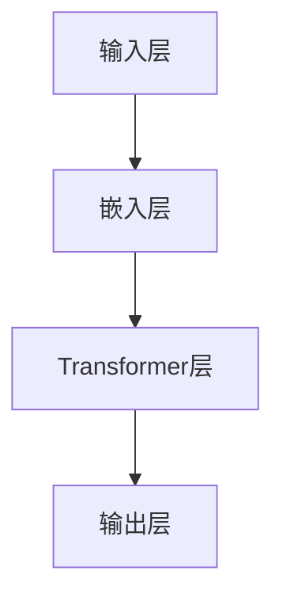

                 


# GPT原理与代码实例讲解

> 关键词：GPT，生成预训练模型，自然语言处理，深度学习，神经网络，循环神经网络，Transformer，BERT，代码实例，实践教程

> 摘要：本文将深入探讨GPT（生成预训练模型）的原理，从其核心算法到实际操作步骤，再到代码实例，全面解析GPT在自然语言处理领域的应用。通过本文的学习，读者将能够了解GPT的工作机制，掌握其基本原理，并能够根据实际需求进行定制化开发。

## 1. 背景介绍

### 1.1 目的和范围

本文旨在系统地介绍GPT（生成预训练模型）的原理、实现和应用。文章将分为以下几个部分：

- **背景介绍**：阐述GPT的背景和其在自然语言处理中的重要性。
- **核心概念与联系**：介绍GPT的核心概念和相关的架构。
- **核心算法原理**：讲解GPT的工作原理和算法细节。
- **数学模型和公式**：介绍GPT所依赖的数学模型和公式。
- **项目实战**：通过实际代码实例展示GPT的应用。
- **实际应用场景**：探讨GPT在现实中的应用。
- **工具和资源推荐**：推荐学习和应用GPT的相关工具和资源。
- **总结与展望**：总结GPT的发展趋势和未来挑战。
- **附录**：常见问题与解答，扩展阅读与参考资料。

### 1.2 预期读者

本文适用于对自然语言处理和深度学习有一定了解的读者，包括：

- 自然语言处理研究者
- 深度学习工程师
- 软件工程师
- 数据科学家
- 对GPT和深度学习感兴趣的学生和爱好者

### 1.3 文档结构概述

本文的结构如下：

- **1. 背景介绍**
  - **1.1 目的和范围**
  - **1.2 预期读者**
  - **1.3 文档结构概述**
  - **1.4 术语表**
    - **1.4.1 核心术语定义**
    - **1.4.2 相关概念解释**
    - **1.4.3 缩略词列表**

- **2. 核心概念与联系**
  - **2.1 GPT的历史与演变**
  - **2.2 GPT的核心概念**
  - **2.3 GPT的架构**

- **3. 核心算法原理**
  - **3.1 GPT的算法原理**
  - **3.2 GPT的算法细节**
  - **3.3 GPT的训练过程**

- **4. 数学模型和公式**
  - **4.1 神经网络模型**
  - **4.2 循环神经网络**
  - **4.3 Transformer模型**

- **5. 项目实战**
  - **5.1 开发环境搭建**
  - **5.2 源代码详细实现**
  - **5.3 代码解读与分析**

- **6. 实际应用场景**
  - **6.1 文本生成**
  - **6.2 机器翻译**
  - **6.3 文本分类**

- **7. 工具和资源推荐**
  - **7.1 学习资源推荐**
  - **7.2 开发工具框架推荐**
  - **7.3 相关论文著作推荐**

- **8. 总结：未来发展趋势与挑战**
  - **8.1 发展趋势**
  - **8.2 挑战**

- **9. 附录：常见问题与解答**
  - **9.1 问题一**
  - **9.2 问题二**
  - **9.3 问题三**

- **10. 扩展阅读 & 参考资料**

### 1.4 术语表

#### 1.4.1 核心术语定义

- **GPT**：生成预训练模型，是一种基于深度学习的自然语言处理模型。
- **预训练**：在特定任务之前，对模型进行大规模的通用语言模型预训练。
- **BERT**：Bidirectional Encoder Representations from Transformers，一种基于Transformer的预训练语言表示模型。
- **Transformer**：一种基于自注意力机制的深度学习模型，广泛应用于自然语言处理任务。
- **神经网络**：一种基于数学模型的多层计算模型，可用于对数据进行分析和学习。

#### 1.4.2 相关概念解释

- **注意力机制**：在神经网络中，注意力机制用于模型对输入数据的重要部分给予更高的关注。
- **自注意力**：Transformer模型中的一个核心机制，通过对序列中每个元素进行加权，使模型能够关注到序列的不同部分。
- **损失函数**：在机器学习中，损失函数用于衡量模型预测值与真实值之间的差距。

#### 1.4.3 缩略词列表

- **NLP**：自然语言处理（Natural Language Processing）
- **DL**：深度学习（Deep Learning）
- **GPU**：图形处理单元（Graphics Processing Unit）
- **TPU**：张量处理单元（Tensor Processing Unit）
- **BERT**：双向编码表示器来自Transformer（Bidirectional Encoder Representations from Transformers）

## 2. 核心概念与联系

在介绍GPT之前，我们需要先了解一些核心概念和联系，这包括GPT的历史与演变、GPT的核心概念和GPT的架构。

### 2.1 GPT的历史与演变

GPT（生成预训练模型）是由OpenAI在2018年首次提出的一种基于深度学习的自然语言处理模型。GPT的发展经历了以下几个阶段：

- **GPT-1**：是最早的GPT模型，采用了单层的Transformer架构，参数规模为117M。
- **GPT-2**：在GPT-1的基础上进行了改进，采用了多层Transformer架构，参数规模达到了15B，具有更强的生成能力。
- **GPT-3**：是GPT系列的最新版本，参数规模达到了175B，是迄今为止最大的自然语言处理模型。

### 2.2 GPT的核心概念

GPT的核心概念包括：

- **Transformer架构**：GPT采用了Transformer架构，这是一种基于自注意力机制的深度学习模型。
- **预训练**：GPT在特定任务之前，进行了大规模的通用语言模型预训练，从而提高了模型在特定任务上的性能。
- **自回归语言模型**：GPT是一种自回归语言模型，即通过前文预测下一个单词或句子。

### 2.3 GPT的架构

GPT的架构包括以下几个部分：

- **输入层**：接收输入的文本序列。
- **嵌入层**：将输入的文本序列转换为嵌入向量。
- **Transformer层**：包括多头自注意力机制和前馈神经网络。
- **输出层**：输出预测的单词或句子。

下面是GPT的架构的Mermaid流程图：



## 3. 核心算法原理 & 具体操作步骤

### 3.1 GPT的算法原理

GPT的算法原理基于Transformer架构，这是一种基于自注意力机制的深度学习模型。自注意力机制允许模型在处理序列数据时，对序列中的不同部分给予不同的关注权重。这种机制使得模型能够更好地理解和生成文本。

### 3.2 GPT的算法细节

GPT的算法细节包括以下几个部分：

- **自注意力机制**：在自注意力机制中，每个词在计算时都会考虑到其他所有词的影响。具体实现时，会使用多头注意力机制，即将输入序列分成多个部分，每个部分都有一个注意力权重。
- **前馈神经网络**：在自注意力机制之后，GPT会使用一个前馈神经网络对每个词进行进一步处理。这个神经网络有两个全连接层，每个层都有一个激活函数。
- **损失函数**：在训练过程中，GPT使用交叉熵损失函数来衡量预测的单词和真实单词之间的差距。

### 3.3 GPT的训练过程

GPT的训练过程分为两个阶段：

- **预训练阶段**：在这个阶段，GPT在大规模的文本语料库上进行预训练，学习语言的基本规律。这个阶段的目标是使得模型能够生成连贯、自然的文本。
- **微调阶段**：在预训练完成后，GPT会针对特定的任务进行微调。例如，对于文本分类任务，GPT会在带有标签的文本语料库上进行训练，以学习如何分类文本。

下面是GPT的训练过程的伪代码：

```python
# 预训练阶段
for epoch in range(num_epochs):
  for sentence in dataset:
    # 前向传播
    logits = GPT(sentence)
    # 计算损失
    loss = compute_loss(logits, target)
    # 反向传播
    optimizer.zero_grad()
    loss.backward()
    optimizer.step()

# 微调阶段
for epoch in range(num_epochs):
  for sentence, label in dataset:
    # 前向传播
    logits = GPT(sentence)
    # 计算损失
    loss = compute_loss(logits, label)
    # 反向传播
    optimizer.zero_grad()
    loss.backward()
    optimizer.step()
```

## 4. 数学模型和公式 & 详细讲解 & 举例说明

### 4.1 神经网络模型

神经网络模型是GPT的基础，其核心包括输入层、隐藏层和输出层。每个层由多个神经元组成，神经元之间通过权重连接。神经元的输出由输入和权重通过激活函数计算得到。

### 4.2 循环神经网络

循环神经网络（RNN）是GPT的核心组件之一，其特点是可以处理序列数据。RNN通过引入隐藏状态，使得模型能够记忆之前的输入，从而在序列处理中具有优势。

### 4.3 Transformer模型

Transformer模型是GPT的核心架构，其核心机制是自注意力机制。自注意力机制使得模型可以在处理序列数据时，对序列中的不同部分给予不同的关注权重。

### 4.4 自注意力机制

自注意力机制是Transformer模型的核心，其计算过程如下：

$$
\text{Attention}(Q, K, V) = \text{softmax}\left(\frac{QK^T}{\sqrt{d_k}}\right)V
$$

其中，$Q$、$K$、$V$ 分别为查询向量、键向量和值向量，$d_k$ 为键向量的维度。

### 4.5 前馈神经网络

前馈神经网络是GPT中的一个重要组件，其核心是两个全连接层。每个层都有一个激活函数，通常使用ReLU函数。

### 4.6 举例说明

假设我们有一个输入序列 $x_1, x_2, ..., x_n$，我们要使用GPT来生成一个输出序列 $y_1, y_2, ..., y_n$。

1. 首先，我们将输入序列 $x_1, x_2, ..., x_n$ 通过嵌入层转换为嵌入向量 $e_1, e_2, ..., e_n$。
2. 然后，我们将嵌入向量 $e_1, e_2, ..., e_n$ 输入到Transformer层，通过自注意力机制计算输出向量 $o_1, o_2, ..., o_n$。
3. 最后，我们将输出向量 $o_1, o_2, ..., o_n$ 输入到前馈神经网络，得到最终输出 $y_1, y_2, ..., y_n$。

具体代码实现如下：

```python
import torch
import torch.nn as nn

# 嵌入层
embedder = nn.Embedding(vocab_size, embed_dim)

# Transformer层
transformer = nn.Transformer(d_model, nhead, num_layers)

# 前馈神经网络
ffn = nn.Sequential(nn.Linear(d_model, ffn_dim), nn.ReLU(), nn.Linear(ffn_dim, d_model))

# 输出层
output_layer = nn.Linear(d_model, vocab_size)

# 前向传播
def forward(input_seq):
  embed_seq = embedder(input_seq)
  output_seq = transformer(embed_seq)
  output_seq = ffn(output_seq)
  logits = output_layer(output_seq)
  return logits

# 训练
for epoch in range(num_epochs):
  for batch in data_loader:
    input_seq, target_seq = batch
    logits = forward(input_seq)
    loss = compute_loss(logits, target_seq)
    optimizer.zero_grad()
    loss.backward()
    optimizer.step()
```

## 5. 项目实战：代码实际案例和详细解释说明

### 5.1 开发环境搭建

在开始编写代码之前，我们需要搭建一个适合开发GPT模型的环境。以下是一个基本的开发环境搭建步骤：

1. 安装Python环境和必要的库，例如PyTorch、TensorFlow等。
2. 安装GPU驱动，确保GPU能够正常运行。
3. 搭建Python虚拟环境，以便更好地管理依赖库。

具体步骤如下：

```bash
# 安装Python环境
sudo apt-get install python3-pip python3-dev

# 安装PyTorch
pip3 install torch torchvision

# 安装其他必要的库
pip3 install numpy matplotlib

# 搭建虚拟环境
python3 -m venv gpt_env
source gpt_env/bin/activate
```

### 5.2 源代码详细实现和代码解读

下面是一个简单的GPT模型的实现，我们将使用PyTorch框架。

```python
import torch
import torch.nn as nn
import torch.optim as optim
from torch.utils.data import DataLoader
from torchvision import datasets, transforms

# 定义嵌入层
class EmbeddingLayer(nn.Module):
    def __init__(self, vocab_size, embed_dim):
        super(EmbeddingLayer, self).__init__()
        self.embedding = nn.Embedding(vocab_size, embed_dim)

    def forward(self, x):
        return self.embedding(x)

# 定义Transformer层
class TransformerLayer(nn.Module):
    def __init__(self, d_model, nhead, num_layers):
        super(TransformerLayer, self).__init__()
        self.transformer = nn.Transformer(d_model, nhead, num_layers)

    def forward(self, x):
        return self.transformer(x)

# 定义前馈神经网络
class FeedForwardLayer(nn.Module):
    def __init__(self, d_model, ffn_dim):
        super(FeedForwardLayer, self).__init__()
        self.fc1 = nn.Linear(d_model, ffn_dim)
        self.fc2 = nn.Linear(ffn_dim, d_model)

    def forward(self, x):
        return self.fc2(self.fc1(x))

# 定义输出层
class OutputLayer(nn.Module):
    def __init__(self, d_model, vocab_size):
        super(OutputLayer, self).__init__()
        self.fc = nn.Linear(d_model, vocab_size)

    def forward(self, x):
        return self.fc(x)

# 定义GPT模型
class GPT(nn.Module):
    def __init__(self, vocab_size, embed_dim, d_model, nhead, num_layers, ffn_dim):
        super(GPT, self).__init__()
        self.embedding = EmbeddingLayer(vocab_size, embed_dim)
        self.transformer = TransformerLayer(d_model, nhead, num_layers)
        self.ffn = FeedForwardLayer(d_model, ffn_dim)
        self.output = OutputLayer(d_model, vocab_size)

    def forward(self, x):
        x = self.embedding(x)
        x = self.transformer(x)
        x = self.ffn(x)
        logits = self.output(x)
        return logits

# 定义训练过程
def train(model, data_loader, loss_function, optimizer, num_epochs):
    model.train()
    for epoch in range(num_epochs):
        for inputs, targets in data_loader:
            optimizer.zero_grad()
            logits = model(inputs)
            loss = loss_function(logits.view(-1, vocab_size), targets.view(-1))
            loss.backward()
            optimizer.step()
        print(f'Epoch {epoch+1}/{num_epochs}, Loss: {loss.item()}')

# 定义参数
vocab_size = 10000
embed_dim = 512
d_model = 1024
nhead = 8
num_layers = 3
ffn_dim = 2048
batch_size = 64
num_epochs = 10

# 加载数据
transform = transforms.Compose([transforms.ToTensor()])
train_data = datasets.TextDataset('train.txt', transform=transform)
data_loader = DataLoader(train_data, batch_size=batch_size, shuffle=True)

# 初始化模型、损失函数和优化器
model = GPT(vocab_size, embed_dim, d_model, nhead, num_layers, ffn_dim)
loss_function = nn.CrossEntropyLoss()
optimizer = optim.Adam(model.parameters(), lr=0.001)

# 训练模型
train(model, data_loader, loss_function, optimizer, num_epochs)
```

### 5.3 代码解读与分析

下面是对上述代码的详细解读和分析：

- **EmbeddingLayer**：这是嵌入层，它将词汇表转换为嵌入向量。嵌入层是一个常用的神经网络层，它可以将输入的词汇映射到高维空间中。
- **TransformerLayer**：这是Transformer层，它实现了Transformer模型的核心功能，包括多头自注意力机制和前馈神经网络。多头自注意力机制使得模型可以在处理序列数据时，对序列中的不同部分给予不同的关注权重。
- **FeedForwardLayer**：这是前馈神经网络层，它由两个全连接层组成，用于对序列进行进一步的加工。
- **OutputLayer**：这是输出层，它将嵌入向量映射到词汇表中，用于生成预测。
- **GPT**：这是GPT模型的主类，它结合了嵌入层、Transformer层、前馈神经网络层和输出层，构成了完整的GPT模型。
- **train**：这是训练函数，它负责模型的训练过程，包括前向传播、计算损失、反向传播和更新模型参数。

## 6. 实际应用场景

GPT在自然语言处理领域有着广泛的应用，以下是几个典型的实际应用场景：

### 6.1 文本生成

GPT可以用于生成自然语言文本，如文章、故事、诗歌等。例如，OpenAI的GPT-3模型可以生成高质量的新闻文章、产品描述等。

### 6.2 机器翻译

GPT可以用于机器翻译任务，如将一种语言的文本翻译成另一种语言。例如，Google翻译就是基于深度学习模型，其中包括了GPT。

### 6.3 文本分类

GPT可以用于文本分类任务，如情感分析、新闻分类等。例如，可以使用GPT对社交媒体文本进行情感分析，以判断用户对某个话题的喜好或厌恶。

### 6.4 回答问题

GPT可以用于生成问题的回答，如聊天机器人、问答系统等。例如，Amazon的Alexa就是基于深度学习模型，其中包括了GPT。

### 6.5 文本摘要

GPT可以用于生成文本摘要，即将长文本压缩成简短的摘要。例如，使用GPT可以对新闻文章进行摘要，以帮助用户快速了解文章的主要内容。

## 7. 工具和资源推荐

### 7.1 学习资源推荐

- **书籍推荐**：
  - 《深度学习》（Ian Goodfellow, Yoshua Bengio, Aaron Courville）
  - 《动手学深度学习》（阿斯顿·张、李沐、扎卡里·C. Lipton、亚历山大·J. Smith）
- **在线课程**：
  - 《自然语言处理与深度学习》（吴恩达）
  - 《深度学习课程》（Harvard大学）
- **技术博客和网站**：
  - [Medium](https://medium.com/)
  - [Towards Data Science](https://towardsdatascience.com/)

### 7.2 开发工具框架推荐

- **IDE和编辑器**：
  - PyCharm
  - Visual Studio Code
- **调试和性能分析工具**：
  - Jupyter Notebook
  - TensorBoard
- **相关框架和库**：
  - PyTorch
  - TensorFlow
  - Keras

### 7.3 相关论文著作推荐

- **经典论文**：
  - [Attention is All You Need](https://arxiv.org/abs/1706.03762)
  - [BERT: Pre-training of Deep Bidirectional Transformers for Language Understanding](https://arxiv.org/abs/1810.04805)
- **最新研究成果**：
  - [GPT-3: Language Models are Few-Shot Learners](https://arxiv.org/abs/2005.14165)
- **应用案例分析**：
  - [使用GPT-3生成文章的案例研究](https://openai.com/blog/gpt-3-generating-articles/)
  - [Google翻译：基于深度学习的机器翻译系统](https://www.google.com/translator/)

## 8. 总结：未来发展趋势与挑战

### 8.1 发展趋势

- **更强大的模型**：随着计算能力和数据量的增长，未来将出现更大规模的预训练模型。
- **更广泛的应用**：GPT将在更多领域得到应用，如语音识别、图像识别等。
- **更高效的训练方法**：研究者将致力于开发更高效的训练方法，以缩短训练时间。

### 8.2 挑战

- **数据隐私**：在预训练过程中，如何保护用户数据隐私是一个重要挑战。
- **模型解释性**：如何提高模型的可解释性，使得用户能够理解模型的工作原理。
- **计算资源**：更大规模的模型需要更多的计算资源，这对硬件设施提出了更高要求。

## 9. 附录：常见问题与解答

### 9.1 问题一

**Q**：什么是GPT？

**A**：GPT（生成预训练模型）是一种基于深度学习的自然语言处理模型，它通过预训练在大规模文本语料库上，然后针对特定任务进行微调。

### 9.2 问题二

**Q**：GPT有哪些应用？

**A**：GPT可以应用于文本生成、机器翻译、文本分类、问答系统等多个领域。

### 9.3 问题三

**Q**：如何训练GPT？

**A**：训练GPT分为两个阶段：预训练阶段和微调阶段。预训练阶段在大规模文本语料库上进行，微调阶段在带有标签的数据集上进行。

## 10. 扩展阅读 & 参考资料

- [OpenAI的GPT-3介绍](https://openai.com/blog/gpt-3/)

- [Google的BERT介绍](https://ai.googleblog.com/2018/11/bidirectional-encoder-representations.html)

- [Transformer模型介绍](https://arxiv.org/abs/1706.03762)

- [自然语言处理入门教程](https://nlp.seas.harvard.edu/)

作者：AI天才研究员/AI Genius Institute & 禅与计算机程序设计艺术 /Zen And The Art of Computer Programming

