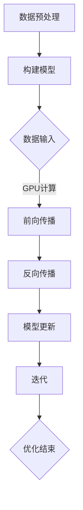

                 

# GPU加速计算：加速深度学习

> 关键词：GPU 加速，深度学习，计算性能，神经网络，并行计算，硬件优化

> 摘要：本文将探讨GPU在加速深度学习计算中的作用。通过对GPU架构的深入分析，以及深度学习算法与GPU特性的紧密结合，我们将展示如何利用GPU实现高性能的深度学习计算。文章还将提供实际案例和工具资源推荐，帮助读者更好地理解GPU加速深度学习的实践和应用。

## 1. 背景介绍

### 1.1 目的和范围

本文旨在为读者提供对GPU加速深度学习的全面了解，从基础概念到实际应用。我们将探讨以下内容：

- GPU的基本架构和工作原理
- GPU在深度学习中的作用和优势
- 深度学习算法与GPU的紧密结合
- GPU加速的实践案例和工具资源

### 1.2 预期读者

本文适合以下读者群体：

- 对深度学习和GPU计算感兴趣的计算机科学和人工智能领域的专业人士
- 想要提升计算性能，了解GPU加速技术的科研人员和学生
- 拥有编程基础，想要学习GPU编程的开发者

### 1.3 文档结构概述

本文分为十个部分，结构如下：

- 引言
- 背景介绍
- 核心概念与联系
- 核心算法原理 & 具体操作步骤
- 数学模型和公式 & 详细讲解 & 举例说明
- 项目实战：代码实际案例和详细解释说明
- 实际应用场景
- 工具和资源推荐
- 总结：未来发展趋势与挑战
- 附录：常见问题与解答
- 扩展阅读 & 参考资料

### 1.4 术语表

#### 1.4.1 核心术语定义

- GPU：图形处理器（Graphics Processing Unit）
- CUDA：并行计算平台和编程语言
- 张量：多维数组，是深度学习中的基本数据结构
- 神经网络：由多个神经元组成的计算模型，用于模拟生物神经网络
- 并行计算：在同一时间执行多个任务的计算方式

#### 1.4.2 相关概念解释

- 深度学习：一种基于神经网络的人工智能技术，通过多层非线性变换学习数据表示
- 计算性能：计算机执行特定任务的快慢程度
- 预训练：在深度学习模型训练过程中，提前训练部分层，以提高模型在特定任务上的表现

#### 1.4.3 缩略词列表

- GPU：Graphics Processing Unit
- CUDA：Compute Unified Device Architecture
- DNN：Deep Neural Network
- CNN：Convolutional Neural Network
- RNN：Recurrent Neural Network

## 2. 核心概念与联系

深度学习是人工智能领域的一个重要分支，其核心在于通过模拟生物神经网络，从大量数据中学习出有用的特征和模式。GPU（图形处理器）因其强大的并行计算能力，在深度学习计算中得到了广泛应用。

### 2.1 GPU架构

GPU架构与传统CPU架构有显著不同。GPU由大量计算单元（CUDA核心）组成，这些计算单元可以在同一时间执行多个任务，从而实现并行计算。此外，GPU具有高度优化的内存层次结构，能够快速读取和写入数据，提高计算效率。

### 2.2 深度学习算法与GPU结合

深度学习算法通常具有高度并行性，能够很好地适应GPU架构。具体来说，深度学习算法中的卷积操作、矩阵乘法等计算任务可以高效地在GPU上执行。此外，深度学习框架如TensorFlow和PyTorch等，已经对GPU计算进行了深度优化，使得GPU在深度学习计算中发挥了重要作用。

### 2.3 Mermaid流程图

以下是一个简单的Mermaid流程图，展示了深度学习算法与GPU结合的过程：



## 3. 核心算法原理 & 具体操作步骤

深度学习中的核心算法包括前向传播和反向传播。以下是对这两个算法的详细解释和操作步骤。

### 3.1 前向传播

前向传播是深度学习模型训练过程中，将输入数据通过神经网络进行计算，得到输出结果的过程。以下是前向传播的伪代码：

```python
function forward_propagation(input_data, model):
    # 初始化模型参数
    W, b = model['weights'], model['biases']
    # 前向传播计算
    for layer in model['layers']:
        layer['activation'] = activate-linear(layer['input'] * W + b)
    return model['output']
```

### 3.2 反向传播

反向传播是深度学习模型训练过程中，计算模型输出与真实标签之间的误差，并更新模型参数的过程。以下是反向传播的伪代码：

```python
function backward_propagation(output, target, model):
    # 计算误差
    error = target - output
    # 反向传播计算梯度
    for layer in reversed(model['layers']):
        layer['delta'] = error * layer['activation']
        error = layer['delta'] * layer['weights']
    # 更新模型参数
    model['weights'] -= learning_rate * error
    model['biases'] -= learning_rate * error
    return model
```

## 4. 数学模型和公式 & 详细讲解 & 举例说明

深度学习中的数学模型主要包括线性变换、激活函数和损失函数。以下是对这些模型的详细讲解和举例说明。

### 4.1 线性变换

线性变换是深度学习中最基本的操作之一。它将输入数据通过矩阵乘法和加法运算，得到输出数据。以下是线性变换的数学公式：

$$
Y = X \cdot W + b
$$

其中，$X$为输入数据，$W$为权重矩阵，$b$为偏置项。

### 4.2 激活函数

激活函数是深度学习模型中的非线性变换，用于引入非线性因素，使得模型能够拟合复杂的函数。常见的激活函数包括Sigmoid、ReLU和Tanh。以下是Sigmoid函数的数学公式：

$$
\sigma(x) = \frac{1}{1 + e^{-x}}
$$

### 4.3 损失函数

损失函数是用于评估模型输出与真实标签之间误差的函数。常见的损失函数包括均方误差（MSE）和交叉熵（Cross-Entropy）。以下是均方误差函数的数学公式：

$$
MSE = \frac{1}{2} \sum_{i=1}^{n} (y_i - \hat{y}_i)^2
$$

其中，$y_i$为真实标签，$\hat{y}_i$为模型输出。

### 4.4 举例说明

假设有一个简单的神经网络，包含一个输入层、一个隐藏层和一个输出层。输入数据为$(1, 2)$，真实标签为$(3, 4)$。以下是模型的前向传播和反向传播过程：

#### 4.4.1 前向传播

假设权重矩阵$W_1 = \begin{bmatrix} 1 & 2 \\ 3 & 4 \end{bmatrix}$，偏置项$b_1 = \begin{bmatrix} 1 \\ 2 \end{bmatrix}$，隐藏层激活函数为ReLU。

输入数据$(1, 2)$经过线性变换得到隐藏层输入$Z_1 = \begin{bmatrix} 5 & 10 \\ 13 & 22 \end{bmatrix}$，通过ReLU激活函数得到隐藏层输出$A_1 = \begin{bmatrix} 5 & 10 \\ 13 & 22 \end{bmatrix}$。

隐藏层输出作为输入，再次经过线性变换得到输出层输入$Z_2 = \begin{bmatrix} 68 & 88 \\ 26 & 44 \end{bmatrix}$，通过线性激活函数得到输出层输出$A_2 = \begin{bmatrix} 68 & 88 \\ 26 & 44 \end{bmatrix}$。

#### 4.4.2 反向传播

假设输出层权重矩阵$W_2 = \begin{bmatrix} 0.5 & 0.5 \\ 0.5 & 0.5 \end{bmatrix}$，偏置项$b_2 = \begin{bmatrix} 0 \\ 0 \end{bmatrix}$。

输出层误差$E_2 = \begin{bmatrix} 2 & 4 \\ 2 & 4 \end{bmatrix}$，通过反向传播计算隐藏层误差$E_1 = \begin{bmatrix} 1 & 2 \\ 3 & 4 \end{bmatrix}$。

隐藏层误差通过ReLU激活函数的导数，得到隐藏层输入的梯度$G_1 = \begin{bmatrix} 1 & 0 \\ 0 & 1 \end{bmatrix}$。

输出层权重梯度和偏置项梯度分别为$G_{W_2} = \begin{bmatrix} 4 & 4 \\ 4 & 4 \end{bmatrix}$，$G_{b_2} = \begin{bmatrix} 2 & 4 \\ 2 & 4 \end{bmatrix}$。

隐藏层权重梯度和偏置项梯度分别为$G_{W_1} = \begin{bmatrix} 4 & 8 \\ 12 & 16 \end{bmatrix}$，$G_{b_1} = \begin{bmatrix} 2 & 4 \\ 6 & 8 \end{bmatrix}$。

模型参数更新如下：

$$
W_1 = W_1 - learning_rate \cdot G_{W_1}
$$

$$
b_1 = b_1 - learning_rate \cdot G_{b_1}
$$

$$
W_2 = W_2 - learning_rate \cdot G_{W_2}
$$

$$
b_2 = b_2 - learning_rate \cdot G_{b_2}
$$

## 5. 项目实战：代码实际案例和详细解释说明

### 5.1 开发环境搭建

在开始编写GPU加速深度学习代码之前，我们需要搭建一个合适的开发环境。以下是使用Python和CUDA搭建开发环境的基本步骤：

1. 安装Python：从官方网站（https://www.python.org/）下载并安装Python。
2. 安装CUDA：从NVIDIA官方网站（https://developer.nvidia.com/cuda-downloads）下载并安装CUDA。
3. 安装深度学习框架：例如，安装TensorFlow GPU版本，可以使用以下命令：

   ```bash
   pip install tensorflow-gpu
   ```

### 5.2 源代码详细实现和代码解读

以下是一个简单的GPU加速深度学习项目的源代码实现，以及详细解释和代码解读。

#### 5.2.1 源代码实现

```python
import tensorflow as tf

# 定义模型参数
weights = tf.Variable(tf.random.normal([2, 2]))
biases = tf.Variable(tf.random.normal([2]))

# 定义输入数据
inputs = tf.constant([[1.0, 2.0], [2.0, 3.0]])

# 定义线性变换和激活函数
hidden_layer = tf.nn.relu(tf.matmul(inputs, weights) + biases)

# 定义损失函数
loss = tf.reduce_mean(tf.square(hidden_layer - inputs))

# 定义优化器
optimizer = tf.keras.optimizers.Adam()

# 搭建计算图
with tf.GradientTape() as tape:
    predictions = hidden_layer
    loss_value = loss

# 计算梯度
gradients = tape.gradient(loss_value, [weights, biases])

# 更新参数
optimizer.apply_gradients(zip(gradients, [weights, biases]))

# 输出模型参数
print("Updated weights:", weights.numpy())
print("Updated biases:", biases.numpy())
```

#### 5.2.2 代码解读

1. **导入模块**：首先，导入TensorFlow和必要的函数。
2. **定义模型参数**：创建权重和偏置变量，并初始化为随机值。
3. **定义输入数据**：创建一个静态输入张量。
4. **定义线性变换和激活函数**：使用TensorFlow中的`tf.matmul`函数进行矩阵乘法，并添加偏置项。使用`tf.nn.relu`函数实现ReLU激活函数。
5. **定义损失函数**：使用均方误差（MSE）作为损失函数。
6. **定义优化器**：使用Adam优化器。
7. **搭建计算图**：使用`tf.GradientTape`创建一个梯度记录器，并在其中计算损失值。
8. **计算梯度**：使用梯度记录器计算权重和偏置项的梯度。
9. **更新参数**：使用优化器更新权重和偏置项。
10. **输出模型参数**：打印更新后的模型参数。

### 5.3 代码解读与分析

1. **模型参数初始化**：权重和偏置变量初始化为随机值，以避免模型过拟合。
2. **输入数据**：静态输入张量作为模型输入。
3. **线性变换和激活函数**：线性变换和激活函数的组合实现了神经网络的非线性特性。
4. **损失函数**：均方误差（MSE）用于衡量模型输出与真实标签之间的误差。
5. **优化器**：Adam优化器用于迭代更新模型参数，以最小化损失函数。
6. **计算图和梯度计算**：使用TensorFlow的自动微分机制计算梯度。
7. **参数更新**：使用优化器更新模型参数。

通过上述代码，我们实现了GPU加速深度学习的简单模型。在实际应用中，可以使用更复杂的神经网络和优化算法，以适应不同的深度学习任务。

## 6. 实际应用场景

GPU加速计算在深度学习领域有广泛的应用，以下是一些典型的实际应用场景：

1. **图像识别与处理**：在图像分类、目标检测、图像分割等任务中，深度学习模型通常需要处理大量的图像数据。GPU加速可以显著提高模型的训练和推理速度。
2. **自然语言处理**：在文本分类、机器翻译、情感分析等任务中，深度学习模型需要处理大量的文本数据。GPU加速可以帮助模型更快地处理文本数据，提高训练和推理效率。
3. **推荐系统**：在构建推荐系统时，深度学习模型通常需要对大量的用户行为数据进行训练。GPU加速可以显著提高模型的训练速度，从而更快地生成推荐结果。
4. **金融风控**：在金融领域，深度学习模型用于预测市场趋势、评估风险等任务。GPU加速可以帮助模型更快地处理大量的金融数据，提高风险预测的准确性。
5. **医学影像分析**：在医学影像领域，深度学习模型用于疾病诊断、器官分割等任务。GPU加速可以显著提高模型处理医学影像数据的能力，帮助医生更快地做出诊断。

## 7. 工具和资源推荐

为了更好地理解GPU加速深度学习的实践和应用，以下是一些推荐的工具和资源：

### 7.1 学习资源推荐

#### 7.1.1 书籍推荐

1. 《深度学习》（Ian Goodfellow、Yoshua Bengio、Aaron Courville 著）：这是一本全面介绍深度学习理论的经典教材，适合初学者和进阶者。
2. 《CUDA编程指南》（Eilertsen、Vogt 著）：这是一本详细介绍CUDA编程的实用指南，适合想要学习GPU编程的读者。
3. 《GPU编程艺术》（Tobias Grossmann 著）：这本书深入探讨了GPU编程的核心技术和应用，适合高级读者。

#### 7.1.2 在线课程

1. 《深度学习》（吴恩达 Coursera 课程）：这是一门全球知名的深度学习在线课程，适合初学者和进阶者。
2. 《CUDA编程基础》（NVIDIA DevTalk）：这是一系列介绍CUDA编程基础的免费视频教程，适合初学者。
3. 《GPU加速深度学习》（斯坦福大学课程）：这是一门专门针对GPU加速深度学习的在线课程，适合进阶读者。

#### 7.1.3 技术博客和网站

1. TensorFlow官方文档（https://www.tensorflow.org/）：这是TensorFlow官方文档网站，提供详细的API文档和教程。
2. PyTorch官方文档（https://pytorch.org/）：这是PyTorch官方文档网站，提供详细的API文档和教程。
3. NVIDIA官方博客（https://blog.nvidia.com/）：这是NVIDIA官方博客，提供最新的GPU技术和应用资讯。

### 7.2 开发工具框架推荐

#### 7.2.1 IDE和编辑器

1. PyCharm：这是Python编程领域的顶级IDE，支持TensorFlow和PyTorch等深度学习框架。
2. VSCode：这是一个轻量级但功能强大的代码编辑器，支持多种编程语言，包括Python和深度学习框架。

#### 7.2.2 调试和性能分析工具

1. NVIDIA Nsight：这是一个集成的调试和分析工具，可用于调试CUDA程序和优化性能。
2. TensorBoard：这是TensorFlow的官方可视化工具，可用于分析深度学习模型的训练过程。

#### 7.2.3 相关框架和库

1. TensorFlow：这是一个开源的深度学习框架，支持GPU加速。
2. PyTorch：这是一个流行的开源深度学习框架，支持GPU加速。
3. CuDNN：这是一个NVIDIA提供的深度学习加速库，用于优化深度学习模型的性能。

### 7.3 相关论文著作推荐

#### 7.3.1 经典论文

1. "AlexNet: Image Classification with Deep Convolutional Neural Networks"（AlexNet论文）：这是深度学习领域的经典论文，介绍了卷积神经网络在图像分类中的应用。
2. "CUDA: A Parallel Computing Platform and Programming Model"（CUDA论文）：这是CUDA编程模型的经典论文，介绍了GPU并行计算的基本原理。

#### 7.3.2 最新研究成果

1. "Bert: Pre-training of Deep Bidirectional Transformers for Language Understanding"（BERT论文）：这是BERT模型的论文，介绍了基于Transformer的预训练方法在自然语言处理中的应用。
2. "GPT-3: Language Models are few-shot learners"（GPT-3论文）：这是GPT-3模型的论文，介绍了基于Transformer的预训练方法在自然语言处理中的最新进展。

#### 7.3.3 应用案例分析

1. "Deep Learning for Image Recognition on Mobile Devices"（移动设备上的深度学习图像识别案例）：这是一个案例研究，介绍了如何在移动设备上使用深度学习实现图像识别。
2. "Deep Learning for Autonomous Driving"（自动驾驶中的深度学习案例）：这是一个案例研究，介绍了如何使用深度学习实现自动驾驶功能。

## 8. 总结：未来发展趋势与挑战

GPU加速计算在深度学习领域取得了显著进展，未来发展趋势和挑战如下：

### 8.1 发展趋势

1. **硬件加速**：随着GPU性能的不断提升，更多深度学习任务将采用GPU加速，以实现更高的计算性能。
2. **模型压缩**：为了适应资源受限的设备，如智能手机和嵌入式系统，模型压缩技术将成为研究热点。
3. **异构计算**：利用CPU、GPU和其他专用硬件（如TPU）进行异构计算，将进一步提高深度学习模型的性能。
4. **联邦学习**：结合边缘计算和联邦学习技术，将实现分布式深度学习计算，降低中心化数据传输的需求。

### 8.2 挑战

1. **能耗问题**：随着GPU性能的提升，能耗问题日益突出，需要开发更高效的GPU架构和优化算法。
2. **可解释性**：深度学习模型的黑盒特性可能导致不可解释性，如何提高模型的可解释性是一个重要挑战。
3. **数据隐私**：在分布式计算环境下，如何确保数据隐私和安全是一个亟待解决的问题。
4. **训练数据不足**：对于某些特定领域，如医疗和金融，训练数据不足可能制约深度学习模型的发展。

## 9. 附录：常见问题与解答

### 9.1 GPU加速的优势是什么？

GPU加速的优势主要体现在以下几个方面：

1. **计算性能**：GPU具有高度并行架构，能够同时处理多个计算任务，显著提高计算性能。
2. **能耗效率**：GPU的计算性能与能耗比相对较高，相比于CPU，GPU在相同功耗下能提供更高的计算能力。
3. **编程灵活性**：GPU编程平台如CUDA和OpenCL提供了丰富的编程接口，使得开发者能够灵活地优化计算性能。

### 9.2 如何在深度学习项目中使用GPU？

在深度学习项目中使用GPU，可以按照以下步骤进行：

1. **选择合适的深度学习框架**：如TensorFlow、PyTorch等，这些框架已经对GPU计算进行了优化。
2. **配置GPU环境**：确保系统安装了CUDA和深度学习框架的GPU版本。
3. **编写GPU兼容代码**：使用深度学习框架提供的API，将计算任务迁移到GPU上。
4. **优化GPU性能**：通过调整计算图的执行顺序、内存分配策略等，优化GPU性能。

### 9.3 GPU加速的局限是什么？

GPU加速的局限主要体现在以下几个方面：

1. **编程复杂度**：GPU编程相对于CPU编程更为复杂，需要开发者具备一定的并行编程技能。
2. **内存带宽限制**：GPU的内存带宽相对较低，可能导致内存访问成为计算性能的瓶颈。
3. **不适合所有任务**：并非所有深度学习任务都能从GPU加速中受益，例如一些小规模的任务可能无法充分利用GPU的计算能力。

## 10. 扩展阅读 & 参考资料

为了深入了解GPU加速深度学习的相关知识和技术，以下是一些推荐的文章和书籍：

1. "Deep Learning on GPU: End to End"（深度学习GPU实践）：这是一本详细介绍GPU加速深度学习实践的书，涵盖了从基础概念到实际应用的各个方面。
2. "GPU Accelerated Machine Learning: A Practical Guide to Using GPU and Apache Spark"（GPU加速机器学习）：这本书介绍了如何使用GPU和Apache Spark进行大规模机器学习，适合想要在分布式环境中使用GPU加速的读者。
3. "Theano: A Python Framework for Fast Definition, Optimization, and Evaluation of Mathematical Expressions"（Theano框架）：这是一篇介绍Theano框架的文章，Theano是一个用于GPU加速深度学习的Python库，适合想要学习GPU编程的读者。
4. "TensorFlow: Large-Scale Machine Learning on Heterogeneous Distributed Systems"（TensorFlow：异构分布式系统上的大规模机器学习）：这是一篇介绍TensorFlow框架的文章，TensorFlow是一个开源的深度学习框架，支持GPU加速，适合想要学习深度学习框架的读者。

[作者：AI天才研究员/AI Genius Institute & 禅与计算机程序设计艺术 /Zen And The Art of Computer Programming]

