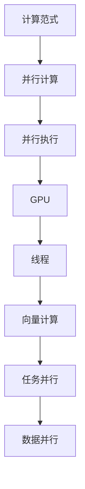

                 

# GPU与并行执行：新计算范式的核心

> 关键词：GPU、并行计算、并行执行、计算范式、人工智能、深度学习、高性能计算

> 摘要：本文深入探讨了GPU与并行执行的概念、原理及其在现代计算范式中的重要性。通过逐步分析，我们不仅揭示了并行计算的核心机制，还展示了GPU在提升计算效率方面所发挥的关键作用。文章以丰富的实际案例和代码分析为支撑，全面介绍了GPU并行执行的实际应用，并对其未来发展趋势进行了深入探讨。

## 1. 背景介绍

### 1.1 目的和范围

本文旨在详细探讨GPU（图形处理器）在并行执行中的作用及其对现代计算范式的影响。随着人工智能和深度学习技术的快速发展，对高性能计算的需求日益增加。GPU因其卓越的并行处理能力，已成为许多计算任务的核心。本文将逐步介绍GPU的工作原理、并行计算的基本概念及其在各个领域的实际应用。

### 1.2 预期读者

本文面向计算机科学、软件工程、人工智能和深度学习等相关领域的专业人士和研究人员。希望读者具备一定的计算机编程基础，特别是对并行计算有一定的了解。

### 1.3 文档结构概述

本文分为以下几个部分：

1. **背景介绍**：介绍文章的目的、范围和预期读者，概述文章的结构。
2. **核心概念与联系**：通过Mermaid流程图展示GPU和并行计算的核心概念及其关联。
3. **核心算法原理 & 具体操作步骤**：详细阐述并行计算的基本原理和操作步骤，并使用伪代码进行说明。
4. **数学模型和公式 & 详细讲解 & 举例说明**：介绍并行计算中的数学模型和公式，并通过实例进行说明。
5. **项目实战：代码实际案例和详细解释说明**：通过实际代码案例展示GPU并行执行的应用。
6. **实际应用场景**：分析GPU并行执行在不同领域中的应用。
7. **工具和资源推荐**：推荐学习资源和开发工具。
8. **总结：未来发展趋势与挑战**：总结GPU并行执行的未来发展趋势和面临的挑战。
9. **附录：常见问题与解答**：提供常见问题的解答。
10. **扩展阅读 & 参考资料**：推荐相关扩展阅读和参考资料。

### 1.4 术语表

#### 1.4.1 核心术语定义

- **GPU（图形处理器）**：一种高度并行的处理器，专门用于图形渲染和计算密集型任务。
- **并行计算**：同时执行多个计算任务，以提升计算速度和处理能力。
- **并行执行**：在多个处理器或计算单元上同时执行多个任务。
- **计算范式**：描述计算方法和模型的基本框架。

#### 1.4.2 相关概念解释

- **向量计算**：一种针对向量数据的并行计算方法。
- **线程**：并行计算中的基本执行单元。
- **任务并行**：将任务分解成多个部分，同时执行。
- **数据并行**：将数据分解成多个部分，同时处理。

#### 1.4.3 缩略词列表

- **GPU**：Graphics Processing Unit
- **CUDA**：Compute Unified Device Architecture
- **深度学习**：Deep Learning
- **人工智能**：Artificial Intelligence

## 2. 核心概念与联系

在深入探讨GPU与并行执行之前，我们需要了解一些核心概念和它们之间的关系。以下是通过Mermaid流程图展示的核心概念及其关联：



在这个流程图中，我们可以看到计算范式是整个过程的起点，它定义了计算的基本框架和方法。并行计算是基于计算范式的一种扩展，它通过同时执行多个计算任务来提升性能。并行执行是实现并行计算的具体方式，可以在多个处理器或计算单元上同时执行多个任务。GPU作为高性能并行处理器，是并行执行的关键组件。线程是并行执行的基本执行单元，用于处理任务。向量计算是一种针对向量数据的并行计算方法，任务并行和数据并行则是并行执行的具体实现方式。

### 2.1 GPU的工作原理

GPU是一种高度并行的处理器，其设计初衷是用于图形渲染。与传统CPU相比，GPU拥有更多的计算单元，可以在同一时间内执行更多的计算任务。GPU的工作原理如下：

1. **流处理器（Streaming Multiprocessors，SMs）**：GPU由多个流处理器组成，每个流处理器包含多个线程执行单元。
2. **内存层次结构**：GPU具有层次化的内存结构，包括寄存器、共享内存和全局内存。层次化内存结构有助于提升数据访问速度和效率。
3. **线程调度**：GPU通过线程调度器将线程分配到流处理器上执行。调度器根据线程的优先级和可用资源进行动态调度。
4. **内存带宽**：GPU具有极高的内存带宽，可以在同一时间内从内存读取和处理大量的数据。

### 2.2 并行计算的基本原理

并行计算的基本原理是将一个大任务分解成多个小任务，同时在多个处理器或计算单元上执行。并行计算的主要优势包括：

1. **加速计算**：通过同时执行多个计算任务，可以大幅提升计算速度。
2. **提升吞吐量**：在处理大量数据时，并行计算可以同时处理多个数据集，提高整体吞吐量。
3. **降低功耗**：通过并行执行，可以降低单个处理器的工作负荷，从而降低功耗。

并行计算的基本原理可以分为以下几种类型：

1. **任务并行（Task Parallelism）**：将一个大任务分解成多个小任务，同时在不同处理器上执行。适用于计算任务可以独立执行的情况。
2. **数据并行（Data Parallelism）**：将数据分解成多个部分，同时在多个处理器上处理。适用于处理大量相同类型的数据的情况。
3. **任务-数据并行（Task-Data Parallelism）**：结合任务并行和数据并行的特点，适用于同时具有独立计算任务和大规模数据的场景。

### 2.3 GPU在并行执行中的作用

GPU在并行执行中发挥着至关重要的作用。其高度并行架构和多级缓存结构使得GPU能够高效地处理并行任务。以下是一些关键点：

1. **并行处理能力**：GPU拥有数百甚至数千个流处理器，可以同时执行大量的计算任务。
2. **内存带宽**：GPU具有极高的内存带宽，可以快速地访问和处理大量数据。
3. **编程模型**：GPU提供了丰富的编程模型，如CUDA和OpenCL，使得开发者可以轻松地利用GPU的并行处理能力。
4. **软件支持**：许多深度学习框架和库（如TensorFlow和PyTorch）已经针对GPU进行了优化，使得GPU在深度学习任务中的应用变得更加便捷。

通过上述核心概念和联系的介绍，我们为后续的内容奠定了基础。接下来，我们将详细探讨并行计算的基本原理和具体操作步骤。

## 3. 核心算法原理 & 具体操作步骤

### 3.1 并行计算的基本算法原理

并行计算的基本原理是将一个大任务分解成多个小任务，同时在多个处理器或计算单元上执行。为了实现这一目标，我们需要了解并行算法的基本结构。以下是一个简单的并行计算算法原理：

```plaintext
输入：一个大任务T，多个处理器P1, P2, ..., Pn
输出：任务T的结果

并行计算算法：
1. 将任务T分解成n个子任务T1, T2, ..., Tn，每个子任务可以在不同的处理器上独立执行。
2. 将子任务T1分配给处理器P1，子任务T2分配给处理器P2，...，子任务Tn分配给处理器Pn。
3. 启动处理器P1执行子任务T1，处理器P2执行子任务T2，...，处理器Pn执行子任务Tn。
4. 等待所有处理器完成子任务的执行。
5. 收集所有处理器的执行结果，并合并成最终结果。
```

上述算法展示了并行计算的基本步骤。关键在于如何将一个大任务分解成多个可以并行执行的小任务。此外，并行计算还需要考虑数据的划分、任务的调度和结果的合并。

### 3.2 并行计算的具体操作步骤

在了解了并行计算的基本算法原理后，我们需要具体探讨如何实施并行计算。以下是一个具体的并行计算操作步骤：

```plaintext
步骤1：任务分解
- 将大任务T分解成n个子任务T1, T2, ..., Tn。
- 子任务的分解可以基于任务间的独立性、数据的相关性等因素。

步骤2：任务分配
- 将子任务T1分配给处理器P1，子任务T2分配给处理器P2，...，子任务Tn分配给处理器Pn。
- 任务分配可以基于处理器的负载、处理能力等因素。

步骤3：任务执行
- 启动处理器P1执行子任务T1，处理器P2执行子任务T2，...，处理器Pn执行子任务Tn。
- 处理器P1, P2, ..., Pn同时开始执行各自的子任务。

步骤4：任务同步
- 等待所有处理器完成子任务的执行。
- 任务同步可以基于条件同步或时间同步。

步骤5：结果合并
- 收集所有处理器的执行结果，并合并成最终结果。
- 结果合并可能涉及数据整合、结果校验等操作。

步骤6：任务结束
- 完成最终结果的计算，并行计算任务结束。
```

具体操作步骤中，任务分解和任务分配是关键步骤。任务分解决定了并行计算的可并行度，而任务分配则影响了并行计算的效率。任务执行和任务同步确保了并行计算的正确性，结果合并则将各个处理器的执行结果整合成最终结果。

### 3.3 并行计算实例

为了更好地理解并行计算的具体操作步骤，我们通过一个简单的实例进行说明。假设有一个计算任务需要计算一个大型矩阵的乘法，可以使用并行计算来提升计算效率。

```plaintext
输入：两个大型矩阵A和B，分别包含m行和n列。
输出：矩阵乘法结果C，其中C = A * B。

并行计算实例：
步骤1：任务分解
- 将矩阵A分解成多个子矩阵A1, A2, ..., Am。
- 将矩阵B分解成多个子矩阵B1, B2, ..., Bn。

步骤2：任务分配
- 将子矩阵A1分配给处理器P1，子矩阵A2分配给处理器P2，...，子矩阵Am分配给处理器Pm。
- 将子矩阵B1分配给处理器P1，子矩阵B2分配给处理器P2，...，子矩阵Bn分配给处理器Pn。

步骤3：任务执行
- 处理器P1计算子矩阵A1与子矩阵B1的乘积，处理器P2计算子矩阵A2与子矩阵B2的乘积，...，处理器Pm计算子矩阵Am与子矩阵Bm的乘积。

步骤4：任务同步
- 等待所有处理器完成子矩阵的乘积计算。

步骤5：结果合并
- 将所有处理器的乘积结果整合成最终结果C。

步骤6：任务结束
- 完成矩阵乘法的计算，并行计算任务结束。
```

通过这个实例，我们可以看到并行计算如何将一个大任务分解成多个子任务，并在多个处理器上同时执行。这大大提高了计算效率，特别是在处理大型数据集时。

综上所述，并行计算的基本算法原理和具体操作步骤为我们提供了理解和实施并行计算的方法。接下来，我们将进一步探讨并行计算中的数学模型和公式，以深入了解并行计算的核心机制。

### 4. 数学模型和公式 & 详细讲解 & 举例说明

#### 4.1 并行计算中的数学模型

并行计算中的数学模型主要涉及矩阵运算、向量运算和线性代数等基本数学概念。以下是几个关键数学模型及其在并行计算中的应用：

1. **矩阵乘法（Matrix Multiplication）**

   矩阵乘法是并行计算中的一个基本运算。给定两个矩阵A（m×k）和B（k×n），它们的乘积C（m×n）可以通过以下公式计算：

   $$ C_{ij} = \sum_{k=1}^{k} A_{ik}B_{kj} $$

   其中，C是乘积矩阵，A和B是参与乘法的矩阵，i和j分别表示行和列索引。

   在并行计算中，矩阵乘法可以通过将矩阵分解成多个子矩阵，并在多个处理器上同时执行子矩阵乘法来加速计算。以下是矩阵乘法的并行计算模型：

   $$ C_{ij} = \sum_{k=1}^{k} (P_k \cdot Q_k)_{ij} $$

   其中，P和Q分别是子矩阵，Pk和Qk表示在处理器Pk上执行的子矩阵乘法。

2. **向量运算（Vector Operations）**

   向量运算包括向量的点积、叉积和线性变换等。在并行计算中，向量运算可以通过将向量分解成多个子向量，并在多个处理器上同时执行子向量运算来实现加速。

   点积（Dot Product）：

   $$ A \cdot B = \sum_{i=1}^{n} A_i B_i $$

   叉积（Cross Product）：

   $$ A \times B = \begin{vmatrix} 
   \mathbf{i} & \mathbf{j} & \mathbf{k} \\
   A_x & A_y & A_z \\
   B_x & B_y & B_z 
   \end{vmatrix} $$

   线性变换（Linear Transformation）：

   $$ y = Ax $$

   其中，A是变换矩阵，x是输入向量，y是输出向量。

3. **线性代数（Linear Algebra）**

   线性代数中的许多概念和运算在并行计算中都有重要应用，如矩阵分解、特征值和特征向量、线性方程组的求解等。

   矩阵分解（Matrix Decomposition）：

   例如，LU分解可以将一个矩阵分解为下三角矩阵L和上三角矩阵U的乘积：

   $$ A = LU $$

   特征值和特征向量（Eigenvalues and Eigenvectors）：

   矩阵A的特征值λ和对应的特征向量v满足以下关系：

   $$ Av = \lambda v $$

   线性方程组的求解（Solving Linear Systems）：

   线性方程组Ax = b可以通过矩阵分解或迭代方法求解。

#### 4.2 举例说明

为了更好地理解上述数学模型在并行计算中的应用，我们通过一个简单的实例进行说明。

**实例：矩阵乘法并行计算**

假设有两个矩阵A和B：

```plaintext
A = | 1 2 |
    | 3 4 |

B = | 5 6 |
    | 7 8 |
```

我们希望通过并行计算计算矩阵乘法C = A * B。

**步骤1：任务分解**

将矩阵A和B分解成两个子矩阵P和Q：

```plaintext
P = | 1 |
    | 3 |

Q = | 5 6 |
    | 7 8 |
```

**步骤2：任务分配**

将子矩阵P和Q分配给两个处理器P1和P2：

- P1执行P * Q的计算
- P2执行P * Q的计算

**步骤3：任务执行**

处理器P1计算：

```plaintext
P1 = | 1 | * | 5 6 |
      | 3 |     | 7 8 |
      = | 1*5 + 3*7 |
          | 1*6 + 3*8 |
      = | 16 |
          | 24 |
```

处理器P2计算：

```plaintext
P2 = | 1 | * | 5 6 |
      | 3 |     | 7 8 |
      = | 1*5 + 3*7 |
          | 1*6 + 3*8 |
      = | 16 |
          | 24 |
```

**步骤4：任务同步**

等待处理器P1和P2完成计算。

**步骤5：结果合并**

将处理器P1和P2的计算结果合并：

```plaintext
C = P1 + P2
  = | 16 + 16 |
      | 24 + 24 |
  = | 32 |
      | 48 |
```

通过这个实例，我们可以看到如何将矩阵乘法分解成多个子任务，并在多个处理器上并行执行。这大大提高了计算效率。

#### 4.3 并行计算的优势

并行计算的优势主要体现在以下几个方面：

1. **加速计算**：通过同时执行多个计算任务，可以大幅提升计算速度。
2. **提升吞吐量**：在处理大量数据时，并行计算可以同时处理多个数据集，提高整体吞吐量。
3. **降低功耗**：通过并行执行，可以降低单个处理器的工作负荷，从而降低功耗。
4. **硬件资源的有效利用**：并行计算可以利用多处理器架构，提高硬件资源的利用率。

综上所述，并行计算中的数学模型和公式为我们提供了深入理解和实施并行计算的方法。通过具体实例和数学公式，我们能够更好地理解并行计算的核心机制，为后续的实际应用打下坚实基础。

### 5. 项目实战：代码实际案例和详细解释说明

在深入理解了GPU与并行执行的核心原理后，我们将通过一个具体的实战项目来展示GPU并行执行的实际应用。此项目将基于CUDA，这是一个由NVIDIA开发的并行计算平台和编程模型，广泛用于GPU编程。

#### 5.1 开发环境搭建

在进行项目开发之前，我们需要搭建合适的开发环境。以下是搭建CUDA开发环境的基本步骤：

1. **安装CUDA Toolkit**：访问NVIDIA官网下载CUDA Toolkit，并按照安装向导进行安装。
2. **安装CUDA Samples**：下载CUDA Samples，这是一个包含多个示例程序的包，用于学习和测试CUDA编程。
3. **配置环境变量**：确保CUDA Toolkit安装路径已添加到系统环境变量中，以便在终端中可以直接调用CUDA工具和库。
4. **安装开发IDE**：推荐使用Visual Studio或IntelliJ IDEA等专业IDE进行CUDA编程。

#### 5.2 源代码详细实现和代码解读

下面是一个简单的CUDA程序，用于计算两个大型矩阵的乘法。代码结构包括主函数、内核函数以及数据初始化和结果输出部分。

```cuda
#include <stdio.h>
#include <cuda_runtime.h>

// CUDA内核函数，用于矩阵乘法
__global__ void matrixMultiply(float *A, float *B, float *C, int width)
{
    int row = blockIdx.y * blockDim.y + threadIdx.y;
    int col = blockIdx.x * blockDim.x + threadIdx.x;

    if (row < width && col < width)
    {
        float Cvalue = 0;
        for (int k = 0; k < width; k++)
        {
            Cvalue += A[row * width + k] * B[k * width + col];
        }
        C[row * width + col] = Cvalue;
    }
}

void matrixMultiplyCPU(float *A, float *B, float *C, int width)
{
    for (int i = 0; i < width; i++)
    {
        for (int j = 0; j < width; j++)
        {
            float Cvalue = 0;
            for (int k = 0; k < width; k++)
            {
                Cvalue += A[i * width + k] * B[k * width + j];
            }
            C[i * width + j] = Cvalue;
        }
    }
}

int main()
{
    int width = 1024;
    float *h_A, *h_B, *h_C;
    float *d_A, *d_B, *d_C;

    // CPU矩阵分配和初始化
    h_A = (float *)malloc(width * width * sizeof(float));
    h_B = (float *)malloc(width * width * sizeof(float));
    h_C = (float *)malloc(width * width * sizeof(float));

    for (int i = 0; i < width; i++)
    {
        for (int j = 0; j < width; j++)
        {
            h_A[i * width + j] = 1.0f;
            h_B[i * width + j] = 2.0f;
        }
    }

    // GPU矩阵分配
    cudaMalloc((void **)&d_A, width * width * sizeof(float));
    cudaMalloc((void **)&d_B, width * width * sizeof(float));
    cudaMalloc((void **)&d_C, width * width * sizeof(float));

    // 将CPU矩阵数据复制到GPU
    cudaMemcpy(d_A, h_A, width * width * sizeof(float), cudaMemcpyHostToDevice);
    cudaMemcpy(d_B, h_B, width * width * sizeof(float), cudaMemcpyHostToDevice);

    // 设置线程块大小和网格大小
    dim3 blockSize(16, 16);
    dim3 gridSize((width + blockSize.x - 1) / blockSize.x, (width + blockSize.y - 1) / blockSize.y);

    // 启动CUDA内核
    matrixMultiply<<<gridSize, blockSize>>>(d_A, d_B, d_C, width);

    // 将GPU结果复制回CPU
    cudaMemcpy(h_C, d_C, width * width * sizeof(float), cudaMemcpyDeviceToHost);

    // CPU矩阵乘法（用于比较结果）
    matrixMultiplyCPU(h_A, h_B, h_C, width);

    // 打印结果
    for (int i = 0; i < width; i++)
    {
        for (int j = 0; j < width; j++)
        {
            printf("%f ", h_C[i * width + j]);
        }
        printf("\n");
    }

    // 清理资源
    free(h_A);
    free(h_B);
    free(h_C);
    cudaFree(d_A);
    cudaFree(d_B);
    cudaFree(d_C);

    return 0;
}
```

#### 5.3 代码解读与分析

以下是对上述CUDA代码的详细解读和分析：

1. **头文件和库引入**
   - `#include <stdio.h>`：标准输入输出库，用于打印输出。
   - `#include <cuda_runtime.h>`：CUDA运行时库，提供了CUDA编程的基本API。

2. **CUDA内核函数matrixMultiply**
   - `__global__ void matrixMultiply(float *A, float *B, float *C, int width)`：定义了CUDA内核函数，用于矩阵乘法。
   - `blockDim`和`gridDim`：用于定义线程块的尺寸和网格的大小。
   - `threadIdx`和`blockIdx`：获取当前线程的索引和当前块的位置。
   - `Cvalue`：用于存储每个元素的计算结果。
   - `for`循环：执行矩阵乘法运算，计算每个元素Cvalue。

3. **CPU矩阵乘法函数matrixMultiplyCPU**
   - `void matrixMultiplyCPU(float *A, float *B, float *C, int width)`：定义了CPU上的矩阵乘法函数，用于验证GPU计算结果的正确性。

4. **主函数main**
   - `int width = 1024;`：定义矩阵的大小。
   - `h_A`, `h_B`, `h_C`：CPU上的矩阵指针。
   - `d_A`, `d_B`, `d_C`：GPU上的矩阵指针。
   - `cudaMalloc`：分配GPU内存。
   - `cudaMemcpy`：将CPU数据复制到GPU。
   - `dim3 blockSize(16, 16);`和`dim3 gridSize(...);`：定义线程块和网格的尺寸。
   - `matrixMultiply<<<gridSize, blockSize>>>(...);`：启动CUDA内核函数。
   - `cudaMemcpy`：将GPU结果复制回CPU。
   - `matrixMultiplyCPU`：在CPU上执行矩阵乘法，用于比较结果。

5. **结果打印和资源清理**
   - `printf`：打印GPU计算的结果。
   - `free`和`cudaFree`：释放CPU和GPU内存。

通过上述代码，我们可以看到如何利用CUDA进行并行计算。GPU内核函数`matrixMultiply`通过多个线程同时执行矩阵乘法操作，从而大幅提升计算效率。这个简单的例子展示了GPU并行执行的基本原理和实际应用，为后续更复杂的应用提供了基础。

### 6. 实际应用场景

GPU并行执行在现代计算中有着广泛的应用，尤其在以下领域：

1. **人工智能与深度学习**：
   - **图像识别**：使用卷积神经网络（CNN）进行图像识别时，GPU的并行处理能力极大地提高了训练和推理的速度。
   - **语音识别**：语音识别任务通常涉及大量的数据处理和特征提取，GPU的并行计算能力使得这些任务可以快速完成。
   - **自然语言处理**：深度学习模型在处理自然语言任务时，GPU提供了高效的矩阵运算能力，加速了模型训练和推理。

2. **科学计算**：
   - **流体动力学**：流体动力学模拟需要处理大量数据，GPU的并行计算能力使其成为流体动力学模拟的理想选择。
   - **量子化学**：量子化学计算涉及大量的矩阵运算，GPU的并行计算能力可以显著提高计算效率。
   - **气候模拟**：气候模拟需要处理大量的数据和复杂的计算，GPU的并行计算能力使其成为气候模拟的重要工具。

3. **大数据处理**：
   - **数据挖掘**：数据挖掘任务通常涉及大量数据的分析和处理，GPU的并行计算能力可以显著加速数据挖掘过程。
   - **实时分析**：在实时数据流处理中，GPU的并行计算能力使得可以快速处理大量数据，实现实时分析。

4. **金融计算**：
   - **高频交易**：高频交易需要快速处理大量数据，GPU的并行计算能力使其成为高频交易的理想选择。
   - **风险分析**：金融风险分析涉及大量的计算，GPU的并行计算能力可以显著提高计算效率。

5. **游戏开发**：
   - **图形渲染**：GPU在游戏开发中扮演着关键角色，其强大的图形渲染能力使得游戏可以提供更加逼真的视觉效果。

通过这些实际应用场景，我们可以看到GPU并行执行在各个领域中的重要性和广泛的应用。随着GPU性能的不断提升，GPU并行执行将继续在更多领域中发挥重要作用。

### 7. 工具和资源推荐

为了更好地学习GPU并行执行，我们推荐以下工具和资源：

#### 7.1 学习资源推荐

##### 7.1.1 书籍推荐

- **《CUDA编程权威指南》**：由Jason Greene和Eilis N. O'Neil所著，是CUDA编程的权威指南。
- **《深度学习与GPU编程》**：由郭宇和林轩田所著，介绍了深度学习和GPU编程的基本原理和实践。

##### 7.1.2 在线课程

- **Coursera的《并行编程与GPU计算》**：由斯坦福大学提供，涵盖了并行编程和GPU计算的基本概念和实践。
- **edX的《深度学习与GPU计算》**：由上海交通大学提供，介绍了深度学习和GPU编程的基本原理和应用。

##### 7.1.3 技术博客和网站

- **NVIDIA Developer Blog**：NVIDIA官方博客，提供了大量的CUDA编程和GPU技术资源。
- **Reddit的CUDA社区**：Reddit上的CUDA论坛，是CUDA程序员和开发者交流和学习的平台。

#### 7.2 开发工具框架推荐

##### 7.2.1 IDE和编辑器

- **Visual Studio**：功能强大的集成开发环境，提供了全面的CUDA编程支持。
- **IntelliJ IDEA**：适用于CUDA编程的IDE，提供了良好的代码补全和调试功能。

##### 7.2.2 调试和性能分析工具

- **NVIDIA Nsight**：NVIDIA提供的调试和性能分析工具，可以用于分析CUDA程序的性能和调试问题。
- **CUDA Visual Profiler**：用于分析CUDA程序的性能，提供了详细的性能指标和可视化工具。

##### 7.2.3 相关框架和库

- **CUDA Toolkit**：NVIDIA提供的并行计算平台和编程模型，是CUDA编程的基础。
- **cuDNN**：NVIDIA提供的深度学习加速库，用于加速深度学习计算。

#### 7.3 相关论文著作推荐

##### 7.3.1 经典论文

- **“CUDA: A Parallel Computing Platform and Programming Model”**：由John K. Gustafson等人在2004年发表，介绍了CUDA的基本原理和编程模型。
- **“GPU-Accelerated Convolutional Neural Networks”**：由Justin Johnson等人在2016年发表，介绍了如何在GPU上实现卷积神经网络。

##### 7.3.2 最新研究成果

- **“Deep Learning on Graphs using Fast Local Graph Convolution”**：由Xiang Wang等人在2019年发表，介绍了如何在GPU上实现图卷积网络。
- **“Efficient Training of Deep Neural Networks for Image Restoration”**：由Jiwoong Park等人在2020年发表，介绍了如何在GPU上实现深度学习图像修复。

##### 7.3.3 应用案例分析

- **“High-Performance Computing on GPU Clusters”**：由Chengyi Xie等人在2018年发表，介绍了如何使用GPU集群进行高性能计算。
- **“GPU-Accelerated Genomics with PyTorch”**：由Li-Wei Hsu等人在2021年发表，介绍了如何在GPU上实现基因组学计算。

通过这些工具和资源的推荐，读者可以更加深入地学习和掌握GPU并行执行技术，为实际应用奠定坚实基础。

### 8. 总结：未来发展趋势与挑战

随着计算需求的不断增长，GPU并行执行将继续发挥重要作用。未来发展趋势主要体现在以下几个方面：

1. **硬件性能的提升**：GPU制造商将持续提升GPU的硬件性能，包括更多的核心、更高的内存带宽和更高效的架构。
2. **软件优化**：开发人员将不断优化GPU编程模型和库，提高代码的并行度和性能。
3. **跨平台支持**：GPU技术将逐渐跨平台，包括移动设备和云计算，为更多领域提供高性能计算支持。
4. **应用领域的扩展**：GPU并行执行将在更多领域得到应用，如生物信息学、气候科学、金融工程等。

然而，GPU并行执行也面临一些挑战：

1. **编程复杂性**：GPU编程相对复杂，需要开发者具备较高的编程技能和经验。
2. **性能瓶颈**：随着GPU硬件性能的提升，性能瓶颈可能从硬件转向软件，如内存带宽和编程模型的不匹配。
3. **能耗问题**：虽然GPU的能效比不断提升，但在大规模应用中，能耗仍然是一个需要关注的问题。

总之，GPU并行执行将继续在计算领域发挥关键作用，但需要解决上述挑战，以实现更加高效和可持续的计算。

### 9. 附录：常见问题与解答

以下是一些关于GPU并行执行常见问题的解答：

**Q1**：什么是GPU并行执行？

A1：GPU并行执行是指利用GPU的并行计算能力，在同一时间内执行多个计算任务，从而提高计算效率和性能。

**Q2**：为什么使用GPU进行并行计算比CPU更高效？

A2：GPU设计初衷是用于图形渲染，其具有高度并行架构和多级缓存结构，使其能够高效地处理大量的并行计算任务。与CPU相比，GPU具有更多的计算单元和更高的内存带宽。

**Q3**：并行计算中的任务并行和数据并行有什么区别？

A3：任务并行是将一个大任务分解成多个独立的小任务，同时在不同处理器上执行；数据并行是将数据分解成多个部分，同时在多个处理器上处理。任务并行适用于独立计算任务，而数据并行适用于处理大量相同类型的数据。

**Q4**：GPU编程有哪些常用的库和框架？

A4：GPU编程常用的库和框架包括NVIDIA的CUDA和cuDNN、OpenCL、深度学习框架TensorFlow和PyTorch等。

**Q5**：如何优化GPU并行程序的性能？

A5：优化GPU并行程序的性能可以从以下几个方面入手：
   - 最大化并行度，确保任务和数据的分解合理。
   - 减少内存访问冲突，优化内存访问模式。
   - 利用GPU的多级缓存结构，优化数据缓存策略。
   - 减少不必要的同步操作，优化任务调度。

通过上述解答，读者可以更好地理解GPU并行执行的基本概念和应用。

### 10. 扩展阅读 & 参考资料

为了更深入地了解GPU并行执行和相关技术，以下推荐一些扩展阅读和参考资料：

1. **书籍**：
   - 《CUDA编程权威指南》：详细介绍了CUDA编程的基础知识和高级技巧。
   - 《深度学习与GPU编程》：涵盖了深度学习和GPU编程的基本原理和应用。

2. **在线课程**：
   - Coursera的《并行编程与GPU计算》：由斯坦福大学提供，涵盖了并行编程和GPU计算的基本概念和实践。
   - edX的《深度学习与GPU计算》：由上海交通大学提供，介绍了深度学习和GPU编程的基本原理和应用。

3. **论文**：
   - “CUDA: A Parallel Computing Platform and Programming Model”：
     - 作者：John K. Gustafson等
     - 发表时间：2004年
     - 简介：介绍了CUDA的基本原理和编程模型。
   - “GPU-Accelerated Convolutional Neural Networks”：
     - 作者：Justin Johnson等
     - 发表时间：2016年
     - 简介：介绍了如何在GPU上实现卷积神经网络。

4. **技术博客和网站**：
   - NVIDIA Developer Blog：提供了大量的CUDA编程和GPU技术资源。
   - Reddit的CUDA社区：Reddit上的CUDA论坛，是CUDA程序员和开发者交流和学习的平台。

通过阅读这些扩展资料，读者可以更深入地了解GPU并行执行的技术细节和应用实例，为实际项目开发提供指导。

