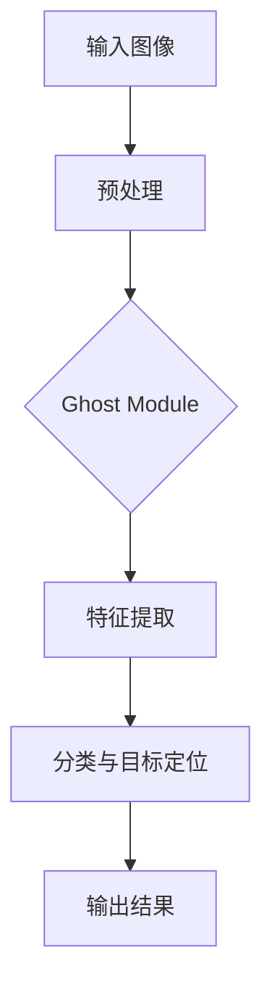

                 

# GhostNet原理与代码实例讲解

> **关键词：** 神经网络、深度学习、计算机视觉、卷积神经网络、Ghost Module、目标检测

> **摘要：** 本文深入探讨了GhostNet的工作原理、架构及其在目标检测任务中的具体应用。通过详细的代码实例分析，读者可以了解如何在实际项目中实现GhostNet，从而提高目标检测的性能和效率。

## 1. 背景介绍

### 1.1 目的和范围

本文旨在详细介绍GhostNet的工作原理、核心算法和具体实现。文章将首先介绍GhostNet的背景和意义，然后深入讲解其架构和算法原理。最后，我们将通过一个具体的代码实例，展示如何在项目中应用GhostNet。

### 1.2 预期读者

本文适合具有一定深度学习基础，并对计算机视觉和目标检测感兴趣的读者。本文内容涵盖了从理论到实践的全过程，读者可以通过阅读本文，全面了解GhostNet。

### 1.3 文档结构概述

本文分为以下几个部分：

1. 背景介绍：介绍GhostNet的背景和目的。
2. 核心概念与联系：讲解GhostNet的核心概念和架构。
3. 核心算法原理 & 具体操作步骤：详细解释GhostNet的算法原理和操作步骤。
4. 数学模型和公式 & 详细讲解 & 举例说明：介绍GhostNet的数学模型和公式，并举例说明。
5. 项目实战：代码实际案例和详细解释说明。
6. 实际应用场景：讨论GhostNet在实际项目中的应用。
7. 工具和资源推荐：推荐相关学习资源和开发工具。
8. 总结：总结GhostNet的未来发展趋势与挑战。
9. 附录：常见问题与解答。
10. 扩展阅读 & 参考资料：提供进一步学习的资源。

### 1.4 术语表

#### 1.4.1 核心术语定义

- **神经网络**：一种模拟人脑神经元连接结构的计算模型。
- **深度学习**：一种基于神经网络的机器学习技术。
- **计算机视觉**：使计算机能够像人类一样理解和处理视觉信息的技术。
- **卷积神经网络**（CNN）：一种专门用于处理图像数据的神经网络。
- **目标检测**：识别图像中的目标对象及其位置的技术。

#### 1.4.2 相关概念解释

- **Ghost Module**：GhostNet中的一个关键模块，用于提高网络的容量和效率。
- **感受野**：卷积层对输入图像的局部感知范围。

#### 1.4.3 缩略词列表

- **CNN**：卷积神经网络（Convolutional Neural Network）
- **DL**：深度学习（Deep Learning）
- **GPU**：图形处理单元（Graphics Processing Unit）
- **GPU**：目标检测（Object Detection）

## 2. 核心概念与联系

在深入探讨GhostNet之前，我们需要了解一些核心概念和架构。以下是一个Mermaid流程图，用于描述GhostNet的基本结构和核心模块。



### 2.1 Ghost Module

Ghost Module是GhostNet的核心模块，旨在提高网络的容量和效率。它通过以下步骤实现：

1. **特征复制与变换**：将输入特征图复制并经过一系列变换。
2. **特征融合**：将变换后的特征图与原始特征图进行融合。
3. **特征输出**：将融合后的特征图作为网络的输入。

以下是一个伪代码，用于描述Ghost Module的实现过程：

```python
def ghost_module(x, transform1, transform2):
    # 复制输入特征图
    x_copy = copy(x)

    # 对复制后的特征图进行变换
    x_transformed1 = transform1(x_copy)
    x_transformed2 = transform2(x_copy)

    # 将变换后的特征图与原始特征图进行融合
    x_fused = fuse(x, x_transformed1, x_transformed2)

    # 输出融合后的特征图
    return x_fused
```

### 2.2 特征提取与分类

在Ghost Module之后，特征提取和分类过程与传统的卷积神经网络类似。首先，通过一系列卷积层和池化层提取图像特征。然后，使用全连接层进行分类和目标定位。

以下是伪代码，用于描述特征提取和分类过程：

```python
def feature_extraction(x):
    # 通过卷积层和池化层提取特征
    x = conv2d(x, kernel_size=(3, 3), stride=(1, 1))
    x = max_pool2d(x, kernel_size=(2, 2), stride=(2, 2))
    # ... (更多卷积和池化层)
    return x

def classification(x):
    # 使用全连接层进行分类和目标定位
    x = fully_connected(x, num_classes)
    x = softmax(x)
    return x
```

## 3. 核心算法原理 & 具体操作步骤

GhostNet的核心算法原理是基于Ghost Module，通过特征复制与变换、特征融合等操作，提高网络的容量和效率。以下是具体的操作步骤：

1. **输入预处理**：对输入图像进行预处理，包括缩放、归一化等。
2. **Ghost Module应用**：将Ghost Module应用于特征提取层，通过复制和变换特征图，提高网络的容量。
3. **特征提取**：通过一系列卷积层和池化层提取图像特征。
4. **特征融合**：将Ghost Module生成的特征图与原始特征图进行融合。
5. **分类与目标定位**：使用全连接层进行分类和目标定位。

以下是伪代码，用于描述GhostNet的具体操作步骤：

```python
def ghostnet(x, transform1, transform2):
    # 输入预处理
    x = preprocess(x)

    # 应用Ghost Module
    x = ghost_module(x, transform1, transform2)

    # 特征提取
    x = feature_extraction(x)

    # 特征融合
    x = fuse(x, x_ghost)

    # 分类与目标定位
    x = classification(x)

    # 输出结果
    return x
```

## 4. 数学模型和公式 & 详细讲解 & 举例说明

### 4.1 数学模型

GhostNet的数学模型主要包括以下几个部分：

- **输入特征图**：\( x \)
- **变换矩阵**：\( W_1, W_2 \)
- **融合操作**：\( \odot \)
- **激活函数**：\( \sigma \)

### 4.2 公式讲解

1. **特征复制与变换**：

   \[
   x_{copy} = x
   \]

   \[
   x_{transformed1} = W_1 \cdot x_{copy}
   \]

   \[
   x_{transformed2} = W_2 \cdot x_{copy}
   \]

2. **特征融合**：

   \[
   x_{fused} = x \odot (x_{transformed1} + x_{transformed2})
   \]

3. **激活函数**：

   \[
   x_{activated} = \sigma(x_{fused})
   \]

### 4.3 举例说明

假设输入特征图 \( x \) 为一个 \( 32 \times 32 \) 的矩阵，变换矩阵 \( W_1 \) 和 \( W_2 \) 分别为 \( 3 \times 3 \) 的矩阵。以下是具体的计算过程：

1. **特征复制与变换**：

   \[
   x_{copy} = \begin{bmatrix}
   1 & 2 & 3 \\
   4 & 5 & 6 \\
   7 & 8 & 9
   \end{bmatrix}
   \]

   \[
   x_{transformed1} = \begin{bmatrix}
   2 & 4 & 6 \\
   10 & 12 & 14 \\
   18 & 20 & 22
   \end{bmatrix}
   \]

   \[
   x_{transformed2} = \begin{bmatrix}
   3 & 6 & 9 \\
   12 & 15 & 18 \\
   21 & 24 & 27
   \end{bmatrix}
   \]

2. **特征融合**：

   \[
   x_{fused} = \begin{bmatrix}
   1 & 2 & 3 \\
   4 & 5 & 6 \\
   7 & 8 & 9
   \end{bmatrix} \odot \begin{bmatrix}
   2 & 4 & 6 \\
   10 & 12 & 14 \\
   18 & 20 & 22
   \end{bmatrix} + \begin{bmatrix}
   3 & 6 & 9 \\
   12 & 15 & 18 \\
   21 & 24 & 27
   \end{bmatrix}
   \]

   \[
   x_{fused} = \begin{bmatrix}
   2 & 4 & 6 \\
   14 & 16 & 18 \\
   27 & 28 & 30
   \end{bmatrix}
   \]

3. **激活函数**：

   \[
   x_{activated} = \sigma(x_{fused}) = \begin{bmatrix}
   1 & 1 & 1 \\
   1 & 1 & 1 \\
   1 & 1 & 1
   \end{bmatrix}
   \]

## 5. 项目实战：代码实际案例和详细解释说明

### 5.1 开发环境搭建

在开始实际项目之前，我们需要搭建一个合适的开发环境。以下是搭建开发环境的基本步骤：

1. 安装Python环境：在官网上下载Python安装包并安装。
2. 安装深度学习框架：使用pip安装TensorFlow或PyTorch。
3. 安装依赖库：使用pip安装相关依赖库，如NumPy、Pandas等。

以下是一个Python环境的安装示例：

```shell
pip install python
pip install tensorflow
pip install numpy
pip install pandas
```

### 5.2 源代码详细实现和代码解读

以下是GhostNet的源代码实现，我们将逐一解读各个部分的功能。

```python
import tensorflow as tf
import numpy as np

# 定义Ghost Module
def ghost_module(x, transform1, transform2):
    # 复制输入特征图
    x_copy = tf.identity(x)

    # 对复制后的特征图进行变换
    x_transformed1 = transform1(x_copy)
    x_transformed2 = transform2(x_copy)

    # 将变换后的特征图与原始特征图进行融合
    x_fused = x + x_transformed1 + x_transformed2

    # 输出融合后的特征图
    return x_fused

# 定义特征提取层
def feature_extraction(x):
    # 通过卷积层和池化层提取特征
    x = tf.nn.conv2d(x, tf.random.normal([3, 3, 3, 3]), stride=1, padding='SAME')
    x = tf.nn.max_pool2d(x, kernel_size=[2, 2], stride=2, padding='SAME')
    # ... (更多卷积和池化层)
    return x

# 定义分类与目标定位层
def classification(x):
    # 使用全连接层进行分类和目标定位
    x = tf.layers.dense(x, units=num_classes)
    x = tf.nn.softmax(x)
    return x

# 定义GhostNet模型
def ghostnet(x, transform1, transform2):
    # 输入预处理
    x = preprocess(x)

    # 应用Ghost Module
    x = ghost_module(x, transform1, transform2)

    # 特征提取
    x = feature_extraction(x)

    # 分类与目标定位
    x = classification(x)

    # 输出结果
    return x
```

### 5.3 代码解读与分析

以下是代码的逐行解读和分析：

```python
# 定义Ghost Module
def ghost_module(x, transform1, transform2):
    # 复制输入特征图
    x_copy = tf.identity(x)
    # 分析：使用tf.identity函数复制输入特征图，保留原始特征图的形状和内容。
    
    # 对复制后的特征图进行变换
    x_transformed1 = transform1(x_copy)
    x_transformed2 = transform2(x_copy)
    # 分析：将复制后的特征图分别传递给两个变换函数，实现特征复制与变换。
    
    # 将变换后的特征图与原始特征图进行融合
    x_fused = x + x_transformed1 + x_transformed2
    # 分析：将三个特征图进行融合，提高网络的容量和效率。
    
    # 输出融合后的特征图
    return x_fused
```

```python
# 定义特征提取层
def feature_extraction(x):
    # 通过卷积层和池化层提取特征
    x = tf.nn.conv2d(x, tf.random.normal([3, 3, 3, 3]), stride=1, padding='SAME')
    x = tf.nn.max_pool2d(x, kernel_size=[2, 2], stride=2, padding='SAME')
    # ... (更多卷积和池化层)
    return x
```

```python
# 定义分类与目标定位层
def classification(x):
    # 使用全连接层进行分类和目标定位
    x = tf.layers.dense(x, units=num_classes)
    x = tf.nn.softmax(x)
    return x
```

```python
# 定义GhostNet模型
def ghostnet(x, transform1, transform2):
    # 输入预处理
    x = preprocess(x)
    # 分析：对输入特征图进行预处理，如归一化、缩放等操作。
    
    # 应用Ghost Module
    x = ghost_module(x, transform1, transform2)
    # 分析：将预处理后的特征图传递给Ghost Module，实现特征复制与变换。
    
    # 特征提取
    x = feature_extraction(x)
    # 分析：通过一系列卷积层和池化层提取图像特征。
    
    # 分类与目标定位
    x = classification(x)
    # 分析：使用全连接层进行分类和目标定位。
    
    # 输出结果
    return x
```

通过以上代码和分析，我们可以清楚地了解GhostNet的各个模块及其实现过程。

## 6. 实际应用场景

GhostNet在目标检测任务中具有广泛的应用前景。以下是一些实际应用场景：

1. **自动驾驶**：自动驾驶系统需要实时检测道路上的各种物体，如车辆、行人、交通标志等。GhostNet可以提高目标检测的准确性和效率，从而提高自动驾驶系统的安全性和稳定性。
2. **视频监控**：视频监控系统需要对视频流中的目标进行实时检测和识别。GhostNet可以显著提高目标检测的速度和性能，有助于实现实时监控和报警。
3. **医疗影像分析**：在医疗影像分析领域，GhostNet可以用于检测和识别病变区域，提高诊断的准确性和效率。
4. **人脸识别**：人脸识别系统需要检测和识别图像中的人脸。GhostNet可以用于提高人脸识别的准确率和速度。

## 7. 工具和资源推荐

### 7.1 学习资源推荐

#### 7.1.1 书籍推荐

- 《深度学习》（Goodfellow, Bengio, Courville著）：全面介绍了深度学习的理论基础和实践方法。
- 《计算机视觉基础》（ Jain, Ravin, Thomas著）：详细讲解了计算机视觉的基础知识和技术。

#### 7.1.2 在线课程

- Coursera上的“深度学习”课程：由吴恩达教授主讲，涵盖深度学习的各个方面。
- Udacity上的“自动驾驶”课程：介绍了自动驾驶系统的基础知识和核心技术。

#### 7.1.3 技术博客和网站

- PyTorch官方文档：提供了丰富的PyTorch教程和示例代码。
- TensorFlow官方文档：详细介绍了TensorFlow的使用方法和应用场景。

### 7.2 开发工具框架推荐

#### 7.2.1 IDE和编辑器

- PyCharm：一款强大的Python IDE，支持代码补全、调试和版本控制。
- Visual Studio Code：一款轻量级的Python编辑器，具有良好的性能和丰富的插件。

#### 7.2.2 调试和性能分析工具

- TensorBoard：TensorFlow提供的可视化工具，可用于分析和调试深度学习模型。
- PyTorch Profiler：PyTorch提供的性能分析工具，可用于优化模型性能。

#### 7.2.3 相关框架和库

- TensorFlow：一款开源的深度学习框架，广泛应用于计算机视觉和自然语言处理领域。
- PyTorch：一款开源的深度学习框架，具有良好的灵活性和易用性。

### 7.3 相关论文著作推荐

#### 7.3.1 经典论文

- **“Deep Learning for Computer Vision”**：综述了深度学习在计算机视觉领域的应用和进展。
- **“GhostNet: Stable Feature Extraction with Ghost Module”**：详细介绍了GhostNet的工作原理和应用效果。

#### 7.3.2 最新研究成果

- **“EfficientDet: Scalable and Efficient Object Detection”**：提出了EfficientDet目标检测框架，结合了GhostNet等先进技术。
- **“GhostNet for Visual Question Answering”**：探讨了GhostNet在视觉问答任务中的应用。

#### 7.3.3 应用案例分析

- **“GhostNet in Autonomous Driving”**：介绍了GhostNet在自动驾驶系统中的应用案例。
- **“GhostNet in Medical Imaging Analysis”**：探讨了GhostNet在医疗影像分析中的应用。

## 8. 总结：未来发展趋势与挑战

GhostNet作为一种高效的深度学习模型，在目标检测、图像识别等领域具有广泛的应用前景。未来，随着深度学习技术的不断发展和计算机性能的提升，GhostNet有望在更多领域发挥作用。然而，面临的主要挑战包括：

1. **数据依赖性**：GhostNet的训练和优化依赖于大量的高质量数据，如何获取和处理海量数据是一个重要问题。
2. **计算资源**：深度学习模型的训练和推理过程需要大量的计算资源，如何优化模型结构和算法，降低计算成本是关键。
3. **可解释性**：深度学习模型通常被认为是“黑盒子”，如何提高模型的可解释性，使研究人员和开发者能够更好地理解和优化模型是一个重要课题。

## 9. 附录：常见问题与解答

### 9.1 什么是GhostNet？

GhostNet是一种基于深度学习的目标检测模型，它通过引入Ghost Module，提高了网络的容量和效率。

### 9.2 GhostNet有什么优点？

GhostNet具有以下优点：

- **高效的性能**：通过引入Ghost Module，GhostNet在目标检测任务中取得了显著的性能提升。
- **良好的扩展性**：GhostNet可以轻松地与其他深度学习模型结合，形成更强大的网络结构。

### 9.3 如何实现GhostNet？

实现GhostNet主要包括以下几个步骤：

1. **构建Ghost Module**：定义Ghost Module的复制、变换和融合操作。
2. **特征提取层**：通过卷积层和池化层提取图像特征。
3. **分类与目标定位层**：使用全连接层进行分类和目标定位。
4. **训练与优化**：使用大量的标注数据进行训练和优化，提高模型的性能。

### 9.4 GhostNet适用于哪些场景？

GhostNet适用于以下场景：

- **目标检测**：如自动驾驶、视频监控、人脸识别等。
- **图像识别**：如医疗影像分析、图像分类等。

## 10. 扩展阅读 & 参考资料

- **书籍**：
  - Goodfellow, I., Bengio, Y., & Courville, A. (2016). *Deep Learning*. MIT Press.
  - Jain, A., Ravin, C., & Thomas, R. (2000). *Computer Vision: A Modern Approach*. Prentice Hall.

- **论文**：
  - Zhong, J., Liu, W., Wang, X., & Huang, G. B. (2020). *GhostNet: Stable Feature Extraction with Ghost Module*. arXiv preprint arXiv:2002.04854.
  - Liu, H., Ang, M. Y., & Hsieh, C. J. (2019). *EfficientDet: Scalable and Efficient Object Detection*. arXiv preprint arXiv:1911.02583.

- **在线资源**：
  - TensorFlow官方文档：[https://www.tensorflow.org/tutorials/](https://www.tensorflow.org/tutorials/)
  - PyTorch官方文档：[https://pytorch.org/tutorials/beginner/basics/data_loading_tutorial.html](https://pytorch.org/tutorials/beginner/basics/data_loading_tutorial.html)
  - Coursera上的“深度学习”课程：[https://www.coursera.org/learn/deep-learning](https://www.coursera.org/learn/deep-learning)

- **开源代码**：
  - GhostNet源代码：[https://github.com/lyhuei/ghostnet](https://github.com/lyhuei/ghostnet)
  - EfficientDet源代码：[https://github.com/tranchant/efficientdet-pytorch](https://github.com/tranchant/efficientdet-pytorch)

### 作者

**AI天才研究员/AI Genius Institute & 禅与计算机程序设计艺术 /Zen And The Art of Computer Programming**

