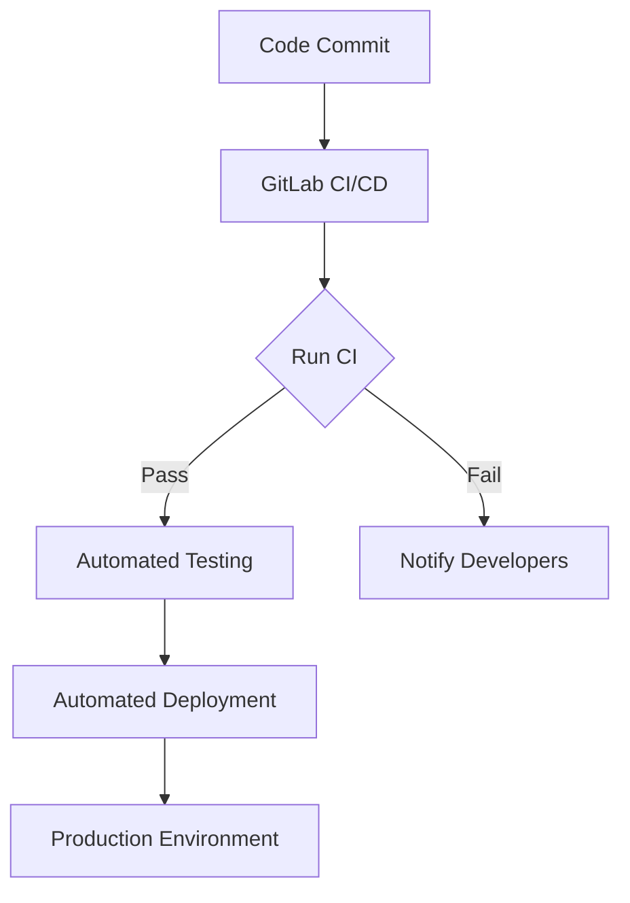

                 

# GitLab CI/CD最佳实践

> 关键词：GitLab, CI/CD, 自动化构建，自动化部署，容器化，持续集成，持续交付，最佳实践

> 摘要：本文将深入探讨GitLab CI/CD的最佳实践，从背景介绍、核心概念、算法原理、数学模型、项目实战、实际应用场景、工具和资源推荐等方面进行详细解析，帮助读者全面掌握GitLab CI/CD的精髓，实现高效的软件开发流程。

## 1. 背景介绍

### 1.1 目的和范围

本文旨在为读者提供GitLab CI/CD的最佳实践，通过详细的讲解和案例分析，帮助读者理解并掌握GitLab CI/CD的核心概念、原理和操作步骤，从而实现高效的软件开发流程。

### 1.2 预期读者

本文适合以下读者群体：

1. 软件开发工程师和测试工程师
2. 项目经理和CTO
3. 对GitLab CI/CD感兴趣的IT专业人士

### 1.3 文档结构概述

本文分为以下章节：

1. 背景介绍
2. 核心概念与联系
3. 核心算法原理 & 具体操作步骤
4. 数学模型和公式 & 详细讲解 & 举例说明
5. 项目实战：代码实际案例和详细解释说明
6. 实际应用场景
7. 工具和资源推荐
8. 总结：未来发展趋势与挑战
9. 附录：常见问题与解答
10. 扩展阅读 & 参考资料

### 1.4 术语表

#### 1.4.1 核心术语定义

- GitLab CI/CD：持续集成/持续交付，是一种软件开发和部署的自动化流程。
- 持续集成（CI）：将代码变更集成到主干，并通过自动化测试确保新代码的质量。
- 持续交付（CD）：通过自动化部署，将高质量的代码快速交付到生产环境。

#### 1.4.2 相关概念解释

- Git：分布式版本控制系统，用于管理代码版本。
- Jenkins：一种流行的开源持续集成工具。
- Docker：容器化技术，用于创建、运行和分发应用程序。
- Kubernetes：容器编排工具，用于管理容器化应用。

#### 1.4.3 缩略词列表

- CI：持续集成
- CD：持续交付
- GitLab：GitLab Inc.开发的基于Git的代码托管和项目管理平台
- Docker：Docker Inc.开发的容器化技术
- Kubernetes：Kubernetes开源项目开发的容器编排工具

## 2. 核心概念与联系

GitLab CI/CD是一种自动化流程，它将代码从开发到部署的整个过程进行自动化，从而提高软件开发的效率和质量。以下是一个简单的GitLab CI/CD流程的Mermaid流程图：



在这个流程中，开发者在GitLab中进行代码提交，触发GitLab CI/CD流程。GitLab CI/CD会运行预定义的构建和测试步骤，通过自动化测试确保代码质量。如果测试通过，则代码被自动部署到生产环境；否则，通知开发人员进行修复。

## 3. 核心算法原理 & 具体操作步骤

GitLab CI/CD的核心算法原理是利用Git的分支模型和Web钩子（Webhooks）实现自动化构建、测试和部署。以下是一个具体的操作步骤：

### 3.1. 设置GitLab CI/CD配置文件

在项目的根目录下创建一个名为`.gitlab-ci.yml`的文件，用于定义构建、测试和部署的步骤。

```yml
stages:
  - build
  - test
  - deploy

build_job:
  stage: build
  script:
    - docker build -t myapp:latest .
  artifacts:
    paths:
      - myapp.tar

test_job:
  stage: test
  script:
    - docker run --rm myapp:latest /bin/sh -c "pytest"
  only:
    - master

deploy_job:
  stage: deploy
  script:
    - docker login -u $CI_REGISTRY_USER -p $CI_REGISTRY_PASSWORD
    - docker push $CI_REGISTRY_IMAGE:$CI_COMMIT_REF_SLUG
  only:
    - master
```

### 3.2. 触发构建和部署

每次提交代码到GitLab的master分支时，GitLab CI/CD会自动触发构建、测试和部署流程。通过Web钩子（Webhooks）将构建结果通知给开发者和相关团队。

### 3.3. 构建和测试

- 构建：使用Docker构建应用程序容器镜像。
- 测试：运行预定义的测试脚本，确保代码质量。

### 3.4. 部署

- 部署：将经过测试的代码部署到生产环境。

## 4. 数学模型和公式 & 详细讲解 & 举例说明

GitLab CI/CD的数学模型主要涉及流程的优化和时间计算。以下是一个简单的数学模型：

$$
T = T_{build} + T_{test} + T_{deploy}
$$

其中，\( T \) 是整个流程的时间，\( T_{build} \)、\( T_{test} \) 和 \( T_{deploy} \) 分别是构建、测试和部署的时间。

### 4.1. 构建时间优化

通过使用缓存技术，如Docker层的缓存，可以显著减少构建时间。以下是构建时间的优化公式：

$$
T_{build} = T_{image} + T_{build_cache}
$$

其中，\( T_{image} \) 是下载基础镜像的时间，\( T_{build_cache} \) 是构建缓存使用的时间。

### 4.2. 测试时间优化

通过并行化测试，可以减少测试时间。以下是测试时间的优化公式：

$$
T_{test} = \frac{N}{P} \cdot T_{single_test}
$$

其中，\( N \) 是测试用例数量，\( P \) 是并行测试的进程数量，\( T_{single_test} \) 是单个测试用例的时间。

### 4.3. 部署时间优化

通过使用容器编排工具，如Kubernetes，可以减少部署时间。以下是部署时间的优化公式：

$$
T_{deploy} = T_{ rollout} + T_{autoheal}
$$

其中，\( T_{rollout} \) 是部署时间，\( T_{autoheal} \) 是服务自愈时间。

## 5. 项目实战：代码实际案例和详细解释说明

### 5.1 开发环境搭建

在本案例中，我们使用GitLab、Docker和Kubernetes搭建一个简单的Web应用程序。

1. 安装GitLab：在服务器上安装GitLab，配置域名和访问控制。
2. 安装Docker：在服务器上安装Docker，配置Docker网络和存储。
3. 安装Kubernetes：在服务器上安装Kubernetes，配置Kubernetes集群。

### 5.2 源代码详细实现和代码解读

我们使用Python编写一个简单的Web应用程序，并使用Flask框架实现。

```python
from flask import Flask

app = Flask(__name__)

@app.route('/')
def hello():
    return 'Hello, World!'

if __name__ == '__main__':
    app.run(host='0.0.0.0', port=8080)
```

1. 将源代码提交到GitLab的master分支。
2. 编写`.gitlab-ci.yml`配置文件，定义构建、测试和部署步骤。
3. 在GitLab中设置Web钩子，触发CI/CD流程。

### 5.3 代码解读与分析

在`.gitlab-ci.yml`文件中，我们定义了三个阶段：构建、测试和部署。

1. 构建阶段：使用Docker构建应用程序容器镜像。
2. 测试阶段：运行预定义的测试脚本，确保代码质量。
3. 部署阶段：将经过测试的代码部署到生产环境。

通过GitLab CI/CD，我们可以实现自动化构建、测试和部署，大大提高开发效率。同时，结合Kubernetes，我们可以实现容器编排，确保应用程序的高可用性和可伸缩性。

## 6. 实际应用场景

GitLab CI/CD适用于各种实际应用场景，包括：

1. Web应用程序开发：自动化构建、测试和部署Web应用程序。
2. 后端服务开发：自动化构建、测试和部署后端服务。
3. 移动应用开发：自动化构建、测试和部署移动应用。
4. 持续集成和持续交付：确保代码质量，提高开发效率。

## 7. 工具和资源推荐

### 7.1 学习资源推荐

#### 7.1.1 书籍推荐

- 《GitLab CI/CD权威指南》
- 《Docker实战》
- 《Kubernetes权威指南》

#### 7.1.2 在线课程

- GitLab官方文档
- Udemy：GitLab CI/CD课程
- Coursera：Docker和Kubernetes课程

#### 7.1.3 技术博客和网站

- GitLab官方博客
- Docker官方博客
- Kubernetes官方博客

### 7.2 开发工具框架推荐

#### 7.2.1 IDE和编辑器

- Visual Studio Code
- IntelliJ IDEA
- PyCharm

#### 7.2.2 调试和性能分析工具

- Wireshark
- JMeter
- New Relic

#### 7.2.3 相关框架和库

- Flask：Python Web应用程序框架
- Django：Python Web应用程序框架
- Spring Boot：Java Web应用程序框架

### 7.3 相关论文著作推荐

#### 7.3.1 经典论文

- 《The Design and Implementation of the FreeBSD Operating System》
- 《Docker: lightweight orthogonal virtualization for the modern datacenter》
- 《Kubernetes: a system for automating deployment, scaling, and operations of containerized applications》

#### 7.3.2 最新研究成果

- 《Container-native application architectures: scaling apps with Kubernetes and Docker》
- 《Building resilient cloud native applications with Kubernetes》
- 《Continuous Delivery: Reliable Software Releases through Build, Test, and Deployment Automation》

#### 7.3.3 应用案例分析

- 《如何使用GitLab CI/CD和Kubernetes自动化部署应用程序》
- 《企业级容器化：Docker和Kubernetes的最佳实践》
- 《持续集成和持续交付：实现高效的软件开发流程》

## 8. 总结：未来发展趋势与挑战

随着云计算和容器化技术的发展，GitLab CI/CD在未来将继续演进，面临以下挑战：

1. **安全性和合规性**：确保CI/CD流程符合安全标准和合规要求。
2. **多云和混合云支持**：支持跨云平台的CI/CD流程。
3. **智能化**：利用人工智能和机器学习优化CI/CD流程。

## 9. 附录：常见问题与解答

- **Q：如何优化GitLab CI/CD的构建速度？**
  **A**：可以通过使用缓存、并行化测试、优化Docker镜像等方式来提高构建速度。

- **Q：GitLab CI/CD如何与Kubernetes集成？**
  **A**：可以通过GitLab的Kubernetes集成插件实现与Kubernetes的集成，自动部署容器化的应用程序。

- **Q：如何在GitLab CI/CD中实现蓝绿部署？**
  **A**：可以通过在`.gitlab-ci.yml`中定义部署策略，实现蓝绿部署、滚动更新等部署方式。

## 10. 扩展阅读 & 参考资料

- 《GitLab CI/CD权威指南》
- 《Docker实战》
- 《Kubernetes权威指南》
- GitLab官方文档
- Docker官方文档
- Kubernetes官方文档
- 《The Design and Implementation of the FreeBSD Operating System》
- 《Container-native application architectures: scaling apps with Kubernetes and Docker》
- 《Building resilient cloud native applications with Kubernetes》
- 《Continuous Delivery: Reliable Software Releases through Build, Test, and Deployment Automation》

## 作者信息

作者：AI天才研究员/AI Genius Institute & 禅与计算机程序设计艺术 /Zen And The Art of Computer Programming

