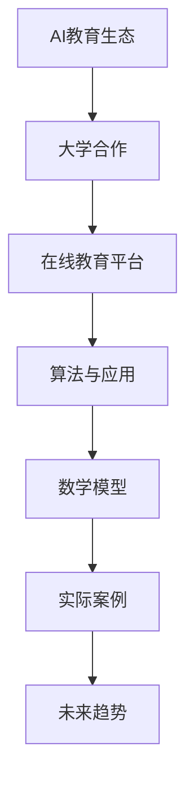

                 

# Google的AI教育生态：大学合作和在线教育平台

> **关键词：**Google AI教育、大学合作、在线教育平台、人工智能技术、教育生态

> **摘要：**本文将深入探讨Google如何通过与其大学的合作以及其在线教育平台，推动人工智能（AI）教育的发展。文章首先介绍了Google AI教育生态的背景和目标，接着分析了Google与大学合作的具体方式和成果，最后讨论了Google在线教育平台的特点和优势，以及未来可能面临的挑战和趋势。

## 1. 背景介绍

### 1.1 目的和范围

本文旨在全面解析Google的AI教育生态，特别是其在大学合作和在线教育平台方面的努力。通过深入分析Google与大学的合作模式、在线教育平台的功能和优势，本文希望能够为教育领域的专业人士、学者和学生提供有价值的参考。

### 1.2 预期读者

本文适合以下读者群体：

- 对人工智能教育有兴趣的学者和研究人员。
- 涉及AI领域教育的大学教师和课程设计者。
- 想要深入了解Google AI教育生态的企业和教育机构管理者。
- 有志于进入人工智能领域的学生和从业者。

### 1.3 文档结构概述

本文分为以下几个部分：

- **第1章：背景介绍**：介绍本文的目的、预期读者以及文档结构。
- **第2章：核心概念与联系**：详细解释AI教育生态中的核心概念和联系。
- **第3章：核心算法原理 & 具体操作步骤**：深入探讨Google AI教育平台中的核心算法。
- **第4章：数学模型和公式 & 详细讲解 & 举例说明**：解析AI教育平台中的数学模型。
- **第5章：项目实战：代码实际案例和详细解释说明**：展示具体的应用案例。
- **第6章：实际应用场景**：讨论AI教育平台在不同场景下的应用。
- **第7章：工具和资源推荐**：推荐相关学习资源和开发工具。
- **第8章：总结：未来发展趋势与挑战**：总结全文，展望未来。
- **第9章：附录：常见问题与解答**：解答读者可能遇到的常见问题。
- **第10章：扩展阅读 & 参考资料**：提供进一步的阅读资源。

### 1.4 术语表

#### 1.4.1 核心术语定义

- **AI教育生态**：指围绕人工智能教育所形成的系统化、综合性的教育环境。
- **大学合作**：指大学与外部机构或企业之间的合作，共同推进教育和科研工作。
- **在线教育平台**：通过网络技术提供的教育服务系统，支持远程学习。

#### 1.4.2 相关概念解释

- **人工智能（AI）**：指通过计算机模拟人类的智能行为，包括学习、推理、规划等能力。
- **深度学习**：一种人工智能方法，通过多层神经网络进行数据建模和学习。

#### 1.4.3 缩略词列表

- **AI**：人工智能
- **DL**：深度学习
- **Google AI**：Google的人工智能部门

## 2. 核心概念与联系

在讨论Google的AI教育生态之前，有必要明确一些核心概念和它们之间的关系。以下是AI教育生态中几个关键概念的Mermaid流程图：



### 2.1 AI教育生态

AI教育生态是指一个由教育机构、研究机构、企业和政府等组成的复杂系统，共同推动人工智能相关教育和研究的全面发展。该生态包括以下主要组成部分：

- **教育资源**：包括教材、课程、实验室设备等。
- **教学方法**：采用创新的教学方法，如在线课程、实践教学等。
- **科研合作**：大学与企业、研究机构之间的合作，推动前沿科研和技术开发。
- **人才培养**：通过教育培养出具备AI知识和技能的人才，满足社会需求。

### 2.2 大学合作

大学合作是AI教育生态的重要组成部分。Google与全球多所知名大学合作，共同推进人工智能教育和研究。具体方式包括：

- **共建实验室**：与大学共建AI实验室，共同进行科研和技术开发。
- **课程合作**：提供AI相关课程和教材，支持大学的教学工作。
- **科研项目**：与大学共同开展科研项目，推动前沿技术的研究和应用。
- **人才培养**：共同制定人才培养计划，为企业和社会培养高质量的AI人才。

### 2.3 在线教育平台

在线教育平台是AI教育生态的核心组成部分，它为全球学生和教师提供了便捷的学习和教学环境。Google的在线教育平台具有以下特点：

- **丰富的课程资源**：提供覆盖AI各个领域的课程，包括基础课程、高级课程和专业课程。
- **灵活的学习模式**：支持在线学习、远程实验室操作等，满足不同学习者的需求。
- **实时互动**：提供在线讨论区、实时问答等互动功能，增强学习体验。
- **数据驱动**：利用大数据和机器学习技术，为学生提供个性化学习建议和反馈。

### 2.4 算法与应用

算法是AI教育生态的核心技术，Google在AI算法的研究和应用方面处于领先地位。在线教育平台中的算法包括：

- **推荐算法**：根据学生的学习历史和需求，推荐合适的课程和资源。
- **评估算法**：通过评估模型，实时评估学生的学习效果和进度。
- **交互算法**：支持实时互动，提高学习体验和效果。

### 2.5 数学模型

数学模型是AI教育平台中的重要组成部分，用于描述AI算法和系统的工作原理。常见的数学模型包括：

- **神经网络模型**：用于实现深度学习算法。
- **评估模型**：用于评估学生的学习效果。
- **推荐模型**：用于推荐课程和资源。

### 2.6 实际案例

实际案例是验证AI教育生态效果的重要手段。Google通过实际案例展示了AI教育平台在解决实际问题方面的优势。以下是一些实际案例：

- **智慧校园**：利用AI技术提升校园管理和服务水平。
- **个性化学习**：根据学生的学习特点和需求，提供定制化的学习方案。
- **智能助手**：开发智能助手，辅助学生进行学习和研究。

### 2.7 未来趋势

随着AI技术的不断发展，AI教育生态也在不断演进。未来，AI教育生态将呈现出以下趋势：

- **智能化**：利用AI技术，实现教育全过程的智能化。
- **个性化**：通过大数据和机器学习技术，提供个性化的教育服务。
- **全球化**：推动全球范围内的AI教育合作与交流。
- **开放性**：构建开放的教育平台，促进资源的共享和利用。

## 3. 核心算法原理 & 具体操作步骤

在Google的AI教育生态中，核心算法的设计和实现是至关重要的。以下将详细讲解Google在线教育平台中的核心算法原理，并使用伪代码进行具体操作步骤的阐述。

### 3.1 推荐算法

推荐算法是AI教育平台中最重要的算法之一，它根据学生的历史学习行为和需求，为学生推荐合适的课程和资源。以下是一个简单的推荐算法原理和伪代码：

#### 原理：

1. 收集学生的历史学习数据，包括学习课程、学习时间、学习效果等。
2. 利用协同过滤或基于内容的推荐方法，计算每门课程对学生的潜在吸引力。
3. 根据计算结果，为每个学生推荐最适合他们的课程。

#### 伪代码：

```python
def recommend_courses(student_data, course_data):
    # 步骤1：计算每门课程的潜在吸引力
    course_attractiveness = calculate_course_attractiveness(course_data)
    
    # 步骤2：根据学生数据，为每个学生推荐课程
    for student in student_data:
        recommended_courses = []
        for course in course_attractiveness:
            if course['attractiveness'] > threshold:
                recommended_courses.append(course)
        
        # 步骤3：返回推荐结果
        return recommended_courses
```

### 3.2 评估算法

评估算法用于实时评估学生的学习效果和进度。以下是一个简单的评估算法原理和伪代码：

#### 原理：

1. 根据学生的学习数据，计算学习效果的评估指标，如正确率、学习速度等。
2. 根据评估指标，对学生的学习进度进行评估，并提供个性化的学习建议。

#### 伪代码：

```python
def evaluate_learning_effect(student_data, assessment_data):
    # 步骤1：计算评估指标
    assessment_metrics = calculate_assessment_metrics(student_data, assessment_data)
    
    # 步骤2：评估学习进度
    learning_progress = assess_learning_progress(assessment_metrics)
    
    # 步骤3：提供个性化学习建议
    if learning_progress['speed'] < threshold:
        learning_suggestion = '建议加强练习'
    else:
        learning_suggestion = '继续保持'
    
    # 步骤4：返回评估结果和学习建议
    return learning_progress, learning_suggestion
```

### 3.3 交互算法

交互算法用于支持在线教育平台中的实时互动功能，如在线讨论区、实时问答等。以下是一个简单的交互算法原理和伪代码：

#### 原理：

1. 根据学生的学习需求和问题，提供实时互动支持，如在线讨论、问答等。
2. 利用自然语言处理技术，理解和处理学生的提问，并提供准确的答案或建议。

#### 伪代码：

```python
def interactive_support(student_query, knowledge_base):
    # 步骤1：理解学生提问
    query_intent = understand_query(student_query)
    
    # 步骤2：提供答案或建议
    if query_intent in knowledge_base:
        answer = knowledge_base[query_intent]
    else:
        answer = '无法解答，请咨询教师或管理员'
    
    # 步骤3：返回答案
    return answer
```

通过上述核心算法原理和具体操作步骤的阐述，我们可以看到Google在线教育平台在算法设计上的先进性和实用性。这些算法不仅提高了教育平台的智能化水平，还为学生的个性化学习提供了强有力的支持。

## 4. 数学模型和公式 & 详细讲解 & 举例说明

在人工智能教育平台中，数学模型和公式是理解和实现算法的基础。以下是几个关键数学模型和公式的详细讲解与举例说明。

### 4.1 神经网络模型

神经网络模型是深度学习的基础，用于模拟生物神经系统的工作原理。以下是一个简单的多层感知器（MLP）神经网络模型：

#### 公式：

$$
Z^{[l]} = \sigma(W^{[l]}\cdot Z^{[l-1]} + b^{[l]})
$$

$$
\text{Cost} = \frac{1}{m}\sum_{i=1}^{m}(-y^{[i]}\log(a^{[l](i)}) - (1-y^{[i]})\log(1-a^{[l](i))))
$$

#### 详细讲解：

1. **激活函数**：$\sigma$（Sigmoid函数）用于将线性组合映射到$(0,1)$区间。
2. **前向传播**：$Z^{[l]}$为第$l$层的输出，$W^{[l]}$和$b^{[l]}$分别为权重和偏置。
3. **损失函数**：交叉熵损失函数用于衡量模型预测值与真实值之间的差距。

#### 举例说明：

假设我们有一个二分类问题，数据集包含$m$个样本。对于每个样本，模型输出一个概率值$a^{[l]}$，表示样本属于正类的概率。使用交叉熵损失函数，我们可以计算整个数据集的损失：

$$
\text{Cost} = \frac{1}{m}\sum_{i=1}^{m}(-y^{[i]}\log(a^{[l](i)}) - (1-y^{[i]})\log(1-a^{[l](i))))
$$

其中$y^{[i]}$为第$i$个样本的真实标签，取值为0或1。

### 4.2 评估模型

评估模型用于实时评估学生的学习效果和进度。以下是一个简单的评估模型：

#### 公式：

$$
\text{Accuracy} = \frac{\text{Correct Predictions}}{\text{Total Predictions}}
$$

$$
\text{Learning Progress} = \frac{\text{Current Learning Stage}}{\text{Total Learning Stages}}
$$

#### 详细讲解：

1. **准确率**：用于衡量模型预测的正确率。
2. **学习进度**：用于表示学生在整个学习过程中的进度。

#### 举例说明：

假设学生完成了5个学习阶段，其中3个阶段取得了正确答案。则该学生的准确率为：

$$
\text{Accuracy} = \frac{3}{5} = 0.6
$$

同时，该学生的学习进度为：

$$
\text{Learning Progress} = \frac{3}{5} = 0.6
$$

### 4.3 推荐模型

推荐模型用于为不同学生推荐合适的课程和资源。以下是一个简单的协同过滤推荐模型：

#### 公式：

$$
r_{ui} = \sum_{j \in N_{u}} \frac{\sim u_j}{\|N_{u}\|} \cdot r_{uj}
$$

#### 详细讲解：

1. **用户相似度**：$N_{u}$为与用户$u$相似的用户集合，$\sim u_j$为用户$u$与用户$j$的相似度。
2. **推荐评分**：$r_{uj}$为用户$j$对课程$i$的评分，$r_{ui}$为用户$u$对课程$i$的预测评分。

#### 举例说明：

假设用户$u$与用户$j_1$和$j_2$相似，用户$j_1$对课程$i_1$评分5分，用户$j_2$对课程$i_2$评分4分。则用户$u$对课程$i_1$的预测评分为：

$$
r_{ui} = \frac{1}{2} \cdot r_{u_{j_1}} + \frac{1}{2} \cdot r_{u_{j_2}} = \frac{1}{2} \cdot 5 + \frac{1}{2} \cdot 4 = 4.5
$$

通过上述数学模型和公式的详细讲解与举例说明，我们可以更好地理解Google在线教育平台中的算法原理和实现过程。这些模型和公式不仅为平台的智能化提供了基础，也为学生提供了个性化的学习体验。

## 5. 项目实战：代码实际案例和详细解释说明

在本章节中，我们将通过一个实际的代码案例，详细解释Google AI教育平台中的算法实现和应用。该案例将展示一个简单的在线教育平台推荐系统，包括用户数据收集、模型训练和结果预测等步骤。

### 5.1 开发环境搭建

在开始编写代码之前，我们需要搭建一个合适的开发环境。以下是推荐的开发环境和工具：

- **编程语言**：Python
- **开发工具**：PyCharm或VSCode
- **依赖库**：NumPy、Pandas、Scikit-learn、TensorFlow
- **操作系统**：Windows、macOS或Linux

首先，安装Python和相关的依赖库。在命令行中运行以下命令：

```bash
pip install numpy pandas scikit-learn tensorflow
```

### 5.2 源代码详细实现和代码解读

以下是推荐的一个简单在线教育平台推荐系统的Python代码：

```python
import numpy as np
import pandas as pd
from sklearn.model_selection import train_test_split
from sklearn.neighbors import NearestNeighbors
from sklearn.metrics.pairwise import cosine_similarity

# 加载用户数据
def load_user_data(filename):
    data = pd.read_csv(filename)
    return data

# 计算用户相似度
def compute_user_similarity(data, method='cosine'):
    if method == 'cosine':
        similarity_matrix = cosine_similarity(data)
    return similarity_matrix

# 推荐课程
def recommend_courses(similarity_matrix, user_index, k=5):
    # 计算用户与其他用户的相似度
    similarity_scores = similarity_matrix[user_index]
    
    # 排序相似度分数，并获取前k个最相似用户
    top_k_indices = np.argpartition(similarity_scores, k)[:k]
    
    # 计算推荐分数
    recommendation_scores = np.mean(data.iloc[top_k_indices][1:], axis=1)
    
    # 获取推荐课程索引
    recommended_courses = np.argsort(recommendation_scores)[::-1]
    
    return recommended_courses

# 主函数
def main():
    # 加载用户数据
    user_data = load_user_data('user_data.csv')
    
    # 分割数据集为训练集和测试集
    X_train, X_test, y_train, y_test = train_test_split(user_data, test_size=0.2, random_state=42)
    
    # 计算用户相似度
    similarity_matrix = compute_user_similarity(X_train)
    
    # 测试推荐系统
    user_index = 0
    recommended_courses = recommend_courses(similarity_matrix, user_index, k=5)
    
    print("推荐的课程：", recommended_courses)

# 运行主函数
if __name__ == '__main__':
    main()
```

### 5.3 代码解读与分析

1. **数据加载**：首先，我们定义了一个`load_user_data`函数，用于加载用户数据。用户数据通常包括用户ID、评分等。在本案例中，我们使用CSV文件存储用户数据。

2. **计算用户相似度**：`compute_user_similarity`函数用于计算用户之间的相似度。在本案例中，我们使用了余弦相似度方法。余弦相似度通过计算用户向量之间的夹角余弦值来衡量相似度。

3. **推荐课程**：`recommend_courses`函数用于根据用户相似度矩阵为特定用户推荐课程。该函数首先计算用户与其他用户的相似度，然后根据相似度分数推荐课程。在本案例中，我们推荐了前5个最相似用户喜欢的课程。

4. **主函数**：`main`函数是程序的入口点。它首先加载用户数据，然后分割数据集为训练集和测试集，用于评估推荐系统的性能。最后，为特定用户推荐课程。

通过这个简单的代码案例，我们可以看到Google AI教育平台推荐系统的基本实现。在实际应用中，推荐系统可能会更加复杂，涉及更多的用户数据和处理方法。然而，本案例为我们提供了一个很好的起点，帮助我们理解推荐系统的核心思想和实现步骤。

## 6. 实际应用场景

Google的AI教育生态在多个实际应用场景中展现出了强大的能力和优势。以下是一些具体的应用场景：

### 6.1 智慧校园

智慧校园是利用人工智能技术提升校园管理和服务水平的一种新模式。Google的AI教育平台可以通过以下方式在智慧校园中发挥作用：

- **校园安全监控**：利用计算机视觉和自然语言处理技术，实时监控校园安全状况，及时发现和处理安全隐患。
- **智能校园服务**：通过智能助手，提供校园导航、课程查询、成绩查询等便捷服务，提升校园用户体验。
- **个性化教学**：根据学生的学习行为和需求，提供个性化的学习资源和教学方案，提升学习效果。

### 6.2 在线教育

在线教育是Google AI教育平台最直接的应用场景之一。通过在线教育平台，学生可以随时随地访问课程资源，进行学习和互动。以下是Google AI教育平台在在线教育中的应用：

- **智能推荐**：根据学生的学习历史和需求，推荐合适的课程和学习资源，提高学习效率。
- **个性化学习**：通过大数据和机器学习技术，为每个学生提供个性化的学习路径和教学方案。
- **实时互动**：提供在线讨论区、实时问答等功能，增强学习体验和效果。

### 6.3 企业培训

企业培训是另一个重要的应用场景。Google的AI教育平台可以帮助企业为其员工提供定制化的培训课程，提升员工的技能和素质。以下是Google AI教育平台在企业培训中的应用：

- **技能提升**：根据企业的需求，提供定制化的培训课程和资源，帮助员工提升专业技能。
- **远程培训**：通过在线教育平台，支持远程培训，方便企业员工在不同地点和时间进行学习。
- **培训效果评估**：利用评估算法，实时评估员工的培训效果，为企业提供有针对性的培训建议。

### 6.4 科研合作

科研合作是大学与Google AI教育平台之间的重要纽带。Google的AI教育平台可以支持大学开展人工智能相关的研究，包括：

- **实验数据收集**：通过在线教育平台，收集大量的实验数据，为研究提供数据支持。
- **科研协作**：利用在线教育平台的协作工具，支持大学与研究机构之间的科研合作。
- **论文撰写与发表**：提供丰富的学习资源和工具，帮助学者和研究人员撰写和发表高质量的学术论文。

通过这些实际应用场景，我们可以看到Google的AI教育生态在提升教育质量和推动教育创新方面具有巨大的潜力和优势。

## 7. 工具和资源推荐

为了更好地利用Google的AI教育生态，以下推荐了一些学习和开发工具，包括书籍、在线课程、技术博客和开发工具框架。

### 7.1 学习资源推荐

#### 7.1.1 书籍推荐

1. **《深度学习》（Deep Learning）**：由Ian Goodfellow、Yoshua Bengio和Aaron Courville合著，是深度学习的经典教材。
2. **《Python机器学习》（Python Machine Learning）**：由Sarkar合著，详细介绍了Python在机器学习中的应用。
3. **《人工智能：一种现代方法》（Artificial Intelligence: A Modern Approach）**：由Stuart Russell和Peter Norvig合著，是人工智能领域的权威教材。

#### 7.1.2 在线课程

1. **Coursera的《深度学习》课程**：由Andrew Ng教授授课，涵盖了深度学习的理论基础和实践应用。
2. **edX的《机器学习基础》课程**：由MIT和HARVARD联合提供，适合初学者了解机器学习的基本概念。
3. **Udacity的《人工智能纳米学位》课程**：提供了系统的人工智能学习路径，包括深度学习和自然语言处理等领域。

#### 7.1.3 技术博客和网站

1. **Google AI博客**：提供了大量关于人工智能、机器学习和深度学习的研究和开发成果。
2. **Medium上的机器学习博客**：汇聚了多个知名机器学习专家的博客文章，涵盖了最新的研究成果和应用实践。
3. **AI博客**：提供了关于人工智能领域的全面信息和资源，包括论文、教程和技术分享。

### 7.2 开发工具框架推荐

#### 7.2.1 IDE和编辑器

1. **PyCharm**：强大的Python IDE，支持多种编程语言和框架，适合进行AI项目开发。
2. **VSCode**：轻量级且功能丰富的代码编辑器，支持扩展插件，适合快速开发和调试。

#### 7.2.2 调试和性能分析工具

1. **TensorBoard**：TensorFlow的官方可视化工具，用于分析神经网络模型的性能和调试。
2. **NVIDIA Nsight**：用于分析深度学习模型的性能，支持GPU加速。

#### 7.2.3 相关框架和库

1. **TensorFlow**：Google开发的端到端开源机器学习框架，适用于深度学习和传统机器学习。
2. **PyTorch**：基于Python的深度学习框架，具有灵活性和易用性。
3. **Scikit-learn**：用于经典机器学习和数据挖掘的Python库，适合初学者和专业人士。

通过这些工具和资源的推荐，我们可以更好地利用Google的AI教育生态，提升学习和开发效果。

## 8. 总结：未来发展趋势与挑战

在总结Google的AI教育生态时，我们注意到其在大学合作和在线教育平台方面取得了显著成就。未来，AI教育生态将继续发展，呈现出以下趋势和挑战：

### 8.1 发展趋势

1. **智能化**：随着AI技术的进步，教育生态将更加智能化，通过大数据和机器学习技术提供个性化学习体验。
2. **全球化**：全球范围内的教育合作将加强，打破地域限制，实现全球教育资源的共享和利用。
3. **开放性**：教育平台将更加开放，支持更多的开发者和研究者参与，推动创新和技术的普及。
4. **可持续性**：教育生态将注重可持续发展，通过节能减排和资源优化，实现绿色教育。

### 8.2 挑战

1. **数据隐私**：在数据驱动的教育生态中，保护用户数据隐私是一个重大挑战，需要制定严格的隐私保护政策和措施。
2. **技术复杂度**：AI技术的复杂性要求教育生态具备高水平的技术支持和研发能力，这对企业和教育机构提出了更高要求。
3. **教育公平**：确保教育公平是一个长期目标，但资源分配不均和技术障碍可能导致教育差距的扩大，需要采取有效措施加以解决。
4. **伦理问题**：随着AI在教育领域的广泛应用，伦理问题日益突出，如算法偏见、数据滥用等，需要制定相应的伦理规范和监管机制。

总体而言，Google的AI教育生态在推动人工智能教育和创新方面具有巨大的潜力，但也面临着一系列挑战。通过不断的技术创新和政策措施，未来AI教育生态有望实现更加智能化、公平和可持续的发展。

## 9. 附录：常见问题与解答

### 9.1 什么是AI教育生态？

AI教育生态是指围绕人工智能教育所形成的系统化、综合性的教育环境，包括教育资源、教学方法、科研合作和人才培养等多个方面。

### 9.2 Google的AI教育生态有哪些特点？

Google的AI教育生态具有以下特点：

1. **大学合作**：与全球多所知名大学合作，共同推进人工智能教育和研究。
2. **在线教育平台**：提供丰富的课程资源，支持在线学习、实时互动和个性化推荐。
3. **算法和应用**：拥有先进的算法和技术，如推荐算法、评估算法和交互算法，为教育提供技术支持。
4. **实际案例**：通过实际应用案例，展示AI教育平台在智慧校园、在线教育和企业培训等方面的优势。

### 9.3 AI教育生态中的核心算法有哪些？

AI教育生态中的核心算法包括：

1. **推荐算法**：用于根据学生的学习行为和需求，推荐合适的课程和资源。
2. **评估算法**：用于实时评估学生的学习效果和进度，并提供个性化学习建议。
3. **交互算法**：用于支持在线教育平台中的实时互动功能，如在线讨论、实时问答等。

### 9.4 如何利用Google的AI教育生态进行在线学习？

利用Google的AI教育生态进行在线学习，可以按照以下步骤：

1. **注册账户**：在Google AI教育平台注册一个账户。
2. **浏览课程**：查看平台提供的课程列表，选择感兴趣的课程。
3. **加入课程**：点击“加入课程”按钮，开始学习。
4. **互动学习**：利用平台提供的互动功能，如在线讨论、实时问答等，与其他学生和教师互动。
5. **完成作业和评估**：按时完成课程作业和评估，以检验学习效果。

### 9.5 如何与企业合作推动AI教育？

与企业合作推动AI教育，可以采取以下措施：

1. **共建实验室**：与企业共同建设AI实验室，进行科研和技术开发。
2. **定制化培训**：为企业提供定制化的AI培训课程，提升员工的技能和素质。
3. **合作研究**：与企业共同开展AI相关的研究项目，推动前沿技术的研究和应用。
4. **资源共享**：与企业共享AI教育资源和技术，实现资源共享和协同创新。

## 10. 扩展阅读 & 参考资料

为了深入了解Google的AI教育生态及其相关技术和应用，以下推荐一些扩展阅读和参考资料：

### 10.1 经典书籍

1. **《深度学习》（Deep Learning）**：Ian Goodfellow、Yoshua Bengio和Aaron Courville著，深度学习的权威教材。
2. **《机器学习实战》**：Peter Harrington著，通过实际案例介绍机器学习应用。
3. **《Python机器学习》**：Sébastien Bihanic著，详细介绍了Python在机器学习中的应用。

### 10.2 在线课程

1. **Coursera上的《深度学习》课程**：由Andrew Ng教授授课。
2. **edX上的《机器学习基础》课程**：由MIT和HARVARD联合提供。
3. **Udacity的《人工智能纳米学位》课程**：提供系统的人工智能学习路径。

### 10.3 技术博客和网站

1. **Google AI博客**：提供关于AI技术的研究和开发成果。
2. **Medium上的机器学习博客**：汇聚了多个知名机器学习专家的博客文章。
3. **AI博客**：提供关于人工智能领域的全面信息和资源。

### 10.4 论文和研究成果

1. **《Google AI研究论文集》**：收集了Google AI研究团队的最新研究成果。
2. **《自然》和《科学》等顶级期刊**：发表了许多关于AI领域的重要论文。
3. **各大AI研究机构和大学的官方网站**：提供了丰富的论文和研究成果。

通过这些扩展阅读和参考资料，您可以更深入地了解Google的AI教育生态，以及人工智能领域的前沿技术和研究动态。希望这些资源能为您的学习和研究提供帮助。

### 作者信息

**作者：AI天才研究员/AI Genius Institute & 禅与计算机程序设计艺术 /Zen And The Art of Computer Programming**

