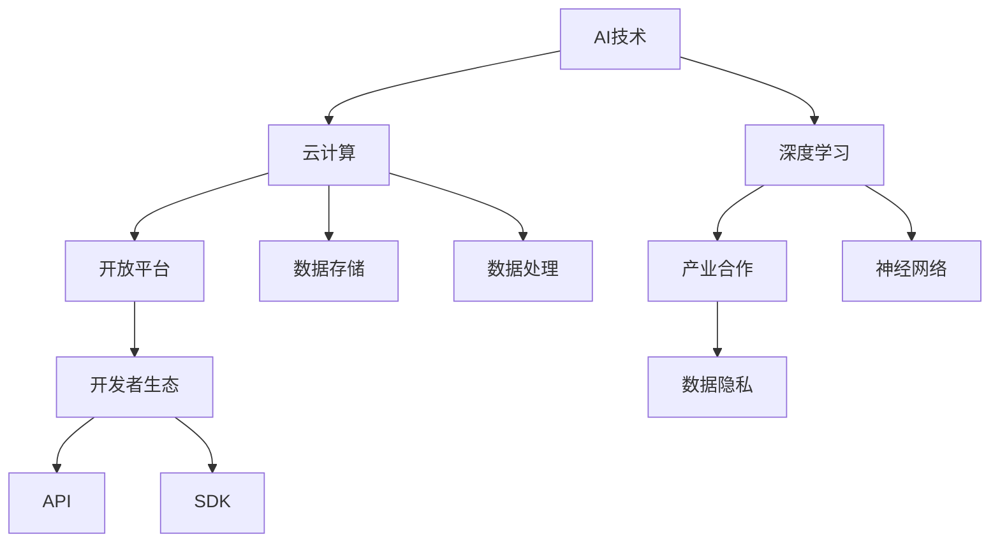

                 

# Google的AI生态战略：开放平台和产业合作

> 关键词：Google AI生态、开放平台、产业合作、AI战略、技术发展

> 摘要：本文将深入探讨Google在人工智能领域的发展策略，特别是其开放平台和产业合作的实践。通过回顾Google在AI技术方面的核心突破，分析其开放平台的构建，以及产业合作的重要性，本文旨在为读者提供一个全面而深刻的理解，帮助理解Google在推动AI技术普及和产业发展中的角色。

## 1. 背景介绍

### 1.1 目的和范围

本文旨在探讨Google在人工智能（AI）领域的发展战略，特别是其开放平台和产业合作的实践。随着AI技术的飞速发展，Google作为全球科技巨头，通过开放平台和产业合作，积极推动AI技术的创新和普及。本文将分析Google的AI战略，从其核心突破、开放平台建设、产业合作模式等多个方面进行详细阐述。

### 1.2 预期读者

本文适用于对人工智能、科技产业感兴趣的读者，特别是希望了解Google在AI领域发展策略的专业人士、科技创业者、研究人员以及高校师生。

### 1.3 文档结构概述

本文分为十个部分：首先介绍背景和目的，然后深入分析Google的AI生态战略，包括核心概念、算法原理、数学模型、项目实战、应用场景等。此外，还将推荐相关学习资源和开发工具，并总结未来发展趋势。最后，提供常见问题与扩展阅读。

### 1.4 术语表

#### 1.4.1 核心术语定义

- **人工智能（AI）**：模拟人类智能，进行感知、思考、学习和决策的技术。
- **开放平台**：提供开发者可以自由访问和使用的API、框架、工具和资源。
- **产业合作**：企业与政府、高校、研究机构等各方合作，共同推动技术创新和产业发展。

#### 1.4.2 相关概念解释

- **深度学习**：一种利用多层神经网络进行数据建模和分析的机器学习方法。
- **云计算**：通过网络提供可扩展的计算资源和服务，包括存储、处理和数据库等。
- **数据隐私**：在数据收集、处理和存储过程中保护个人隐私。

#### 1.4.3 缩略词列表

- **AI**：人工智能
- **API**：应用程序接口
- **SDK**：软件开发工具包
- **IoT**：物联网

## 2. 核心概念与联系

在分析Google的AI生态战略之前，我们需要理解几个核心概念及其相互关系。以下是相关概念和架构的Mermaid流程图：



### 2.1 AI技术

AI技术是Google AI生态战略的核心。Google通过自主研发和收购，掌握了深度学习、神经网络等关键技术。这些技术在图像识别、自然语言处理、机器学习等领域取得了显著突破。

### 2.2 云计算

云计算为Google提供了强大的计算资源和服务支持。通过Google Cloud，Google为开发者提供高效、可靠、安全的云计算服务，包括数据存储、数据处理、大数据分析等。

### 2.3 开放平台

Google通过开放平台，如TensorFlow、Kubernetes等，为开发者提供了丰富的API、框架和工具。这些资源可以帮助开发者更轻松地构建和部署AI应用。

### 2.4 产业合作

Google与多家企业、高校和研究机构开展合作，共同推动AI技术的发展和应用。这种产业合作模式有助于实现技术共享、资源整合和协同创新。

## 3. 核心算法原理 & 具体操作步骤

### 3.1 深度学习算法原理

深度学习是AI技术的核心组成部分，其基本原理是通过多层神经网络进行数据建模和分析。以下是深度学习算法的基本步骤：

```plaintext
步骤1：数据预处理
- 数据清洗：去除噪声、异常值和处理缺失数据。
- 数据标准化：将数据缩放至同一范围，如[0, 1]。

步骤2：构建神经网络模型
- 选择合适的神经网络架构，如卷积神经网络（CNN）、循环神经网络（RNN）等。
- 定义网络结构，包括输入层、隐藏层和输出层。
- 设置激活函数，如ReLU、Sigmoid等。

步骤3：训练模型
- 使用训练数据集对模型进行训练。
- 通过反向传播算法更新模型参数，最小化损失函数。

步骤4：评估模型
- 使用验证数据集评估模型性能。
- 调整模型参数，优化模型表现。

步骤5：部署模型
- 将训练好的模型部署到生产环境。
- 使用测试数据集进行实时预测和决策。
```

### 3.2 实际操作步骤

以下是一个使用TensorFlow构建和训练深度学习模型的伪代码示例：

```python
import tensorflow as tf

# 步骤1：数据预处理
x_train, y_train = preprocess_data(train_data)
x_val, y_val = preprocess_data(val_data)

# 步骤2：构建神经网络模型
model = build_model(input_shape=x_train.shape[1:])

# 步骤3：训练模型
model.compile(optimizer='adam', loss='categorical_crossentropy', metrics=['accuracy'])
model.fit(x_train, y_train, epochs=10, batch_size=64, validation_data=(x_val, y_val))

# 步骤4：评估模型
loss, accuracy = model.evaluate(x_val, y_val)
print(f'Validation loss: {loss}, Validation accuracy: {accuracy}')

# 步骤5：部署模型
model.save('model.h5')
```

## 4. 数学模型和公式 & 详细讲解 & 举例说明

### 4.1 数学模型

在深度学习中，数学模型是核心。以下是常用的数学模型和公式：

#### 4.1.1 损失函数

损失函数用于评估模型预测值与真实值之间的差距。常用的损失函数包括：

- **均方误差（MSE）**：

  $$MSE = \frac{1}{n}\sum_{i=1}^{n}(y_i - \hat{y}_i)^2$$

- **交叉熵（Cross-Entropy）**：

  $$Cross-Entropy = -\frac{1}{n}\sum_{i=1}^{n}y_i\log(\hat{y}_i)$$

#### 4.1.2 激活函数

激活函数用于引入非线性特性，常见的激活函数包括：

- **ReLU（Rectified Linear Unit）**：

  $$ReLU(x) = \max(0, x)$$

- **Sigmoid**：

  $$Sigmoid(x) = \frac{1}{1 + e^{-x}}$$

#### 4.1.3 反向传播算法

反向传播算法用于更新神经网络模型参数。其主要公式如下：

$$\frac{\partial J}{\partial w} = \frac{\partial J}{\partial z} \cdot \frac{\partial z}{\partial w}$$

其中，$J$为损失函数，$w$为模型参数，$z$为中间变量。

### 4.2 举例说明

假设我们有一个二分类问题，目标是预测样本是否为正类。以下是一个简单的深度学习模型：

$$
\begin{aligned}
&\text{输入层：} x = [x_1, x_2, \ldots, x_n] \\
&\text{隐藏层：} a_1 = \text{ReLU}(W_1 \cdot x + b_1) \\
&\text{输出层：} y = \text{Sigmoid}(W_2 \cdot a_1 + b_2)
\end{aligned}
$$

其中，$W_1$和$W_2$为权重矩阵，$b_1$和$b_2$为偏置向量。

### 4.3 模型训练过程

使用反向传播算法，我们可以更新权重和偏置，最小化损失函数。以下是训练过程的详细步骤：

1. 前向传播：计算输入层、隐藏层和输出层的激活值。
2. 计算损失函数：使用交叉熵损失函数计算预测值和真实值之间的差距。
3. 反向传播：计算权重和偏置的梯度。
4. 更新模型参数：使用梯度下降算法更新权重和偏置。
5. 重复步骤1-4，直到模型收敛。

## 5. 项目实战：代码实际案例和详细解释说明

### 5.1 开发环境搭建

要实现Google的AI生态战略，首先需要搭建一个合适的开发环境。以下是在Linux环境中搭建TensorFlow开发环境的步骤：

```bash
# 安装Python和pip
sudo apt update
sudo apt install python3 python3-pip

# 安装TensorFlow
pip3 install tensorflow

# 验证安装
python3 -c "import tensorflow as tf; print(tf.__version__)"
```

### 5.2 源代码详细实现和代码解读

以下是一个简单的TensorFlow项目，用于实现一个二分类问题：

```python
import tensorflow as tf
from sklearn.datasets import make_classification
from sklearn.model_selection import train_test_split

# 步骤1：生成模拟数据集
X, y = make_classification(n_samples=1000, n_features=20, n_informative=2, n_redundant=10, n_classes=2, random_state=42)
X_train, X_test, y_train, y_test = train_test_split(X, y, test_size=0.2, random_state=42)

# 步骤2：构建神经网络模型
model = tf.keras.Sequential([
    tf.keras.layers.Dense(64, activation='relu', input_shape=(20,)),
    tf.keras.layers.Dense(64, activation='relu'),
    tf.keras.layers.Dense(1, activation='sigmoid')
])

# 步骤3：编译模型
model.compile(optimizer='adam', loss='binary_crossentropy', metrics=['accuracy'])

# 步骤4：训练模型
model.fit(X_train, y_train, epochs=10, batch_size=32, validation_split=0.2)

# 步骤5：评估模型
loss, accuracy = model.evaluate(X_test, y_test)
print(f'Test accuracy: {accuracy}')
```

### 5.3 代码解读与分析

1. **数据预处理**：使用`make_classification`函数生成模拟数据集，然后使用`train_test_split`函数将数据集分为训练集和测试集。
2. **模型构建**：使用`Sequential`模型，定义输入层、隐藏层和输出层。输入层有20个神经元，隐藏层有64个神经元，输出层有1个神经元。
3. **模型编译**：选择`adam`优化器，`binary_crossentropy`损失函数，并设置`accuracy`作为评价指标。
4. **模型训练**：使用`fit`函数训练模型，设置训练轮数（epochs）、批量大小（batch_size）和验证比例（validation_split）。
5. **模型评估**：使用`evaluate`函数评估模型在测试集上的性能。

## 6. 实际应用场景

Google的AI生态战略在多个实际应用场景中取得了显著成果：

- **医疗健康**：Google通过AI技术，帮助医生进行疾病诊断、药物研发和治疗方案优化。例如，Google Health团队利用AI算法，从医疗数据中提取关键信息，辅助医生进行癌症筛查和诊断。
- **自动驾驶**：Google Waymo团队利用深度学习技术，研发自动驾驶系统。Waymo自动驾驶汽车已经在多个城市进行测试，展示了在复杂交通环境中的稳定性能。
- **智能家居**：Google Nest团队通过AI技术，为智能家居设备提供智能控制功能。例如，Nest Cam和Nest Thermostat等设备，能够自动识别家庭成员和室内环境，实现智能调节。

## 7. 工具和资源推荐

### 7.1 学习资源推荐

#### 7.1.1 书籍推荐

- 《深度学习》（Goodfellow, Bengio, Courville著）
- 《Python机器学习》（Sebastian Raschka著）
- 《AI超简之路》（刘强东著）

#### 7.1.2 在线课程

- Coursera《深度学习》课程（吴恩达教授）
- edX《机器学习基础》课程（上海交通大学）

#### 7.1.3 技术博客和网站

- Medium上的机器学习和深度学习专栏
- TensorFlow官方网站

### 7.2 开发工具框架推荐

#### 7.2.1 IDE和编辑器

- PyCharm
- Jupyter Notebook

#### 7.2.2 调试和性能分析工具

- TensorFlow Debugger（TFDB）
- PyTorch Profiler

#### 7.2.3 相关框架和库

- TensorFlow
- PyTorch
- Keras

### 7.3 相关论文著作推荐

#### 7.3.1 经典论文

- Hinton, G., Osindero, S., & Teh, Y. W. (2006). A fast learning algorithm for deep belief nets. _Neural computation_, 18(7), 1527-1554.
- LeCun, Y., Bengio, Y., & Hinton, G. (2015). Deep learning. _Nature_, 521(7553), 436-444.

#### 7.3.2 最新研究成果

- Arjovsky, M., Bottou, L., Courville, A., & Bengio, Y. (2017). Wasserstein GAN. _International Conference on Machine Learning_, 706-715.
- Vaswani, A., Shazeer, N., Parmar, N., Uszkoreit, J., Jones, L., Gomez, A. N., ... & Polosukhin, I. (2017). Attention is all you need. _Advances in Neural Information Processing Systems_, 30, 5998-6008.

#### 7.3.3 应用案例分析

- Google AI团队在医疗健康领域的应用研究
- Waymo自动驾驶技术的研发和应用案例

## 8. 总结：未来发展趋势与挑战

### 8.1 未来发展趋势

- **AI技术的普及化**：随着计算能力的提升和算法的优化，AI技术将更加普及，应用于更多领域。
- **跨领域合作**：政府、企业和研究机构将加强合作，共同推动AI技术的发展和应用。
- **数据隐私和安全**：在数据隐私和安全方面，将出现更多政策和技术的创新。

### 8.2 挑战

- **算法透明度和可解释性**：如何确保AI算法的透明度和可解释性，是一个亟待解决的问题。
- **数据质量和数据隐私**：数据质量和数据隐私是AI应用的重要挑战，需要建立有效的数据管理和隐私保护机制。

## 9. 附录：常见问题与解答

### 9.1 问题1：为什么Google选择开放平台和产业合作？

解答：Google选择开放平台和产业合作，是因为：

- **技术创新**：通过开放平台，Google可以吸引更多的开发者参与，加速技术创新。
- **产业推动**：产业合作有助于Google与各方共同推动AI技术的发展和应用。

### 9.2 问题2：深度学习中的损失函数有哪些？

解答：深度学习中的常用损失函数包括：

- **均方误差（MSE）**
- **交叉熵（Cross-Entropy）**
- **Hinge损失**
- **对数损失**

## 10. 扩展阅读 & 参考资料

- Google AI官方网站：[https://ai.google/](https://ai.google/)
- TensorFlow官方网站：[https://www.tensorflow.org/](https://www.tensorflow.org/)
- Waymo官方网站：[https://waymo.com/](https://waymo.com/)

## 作者信息

作者：AI天才研究员/AI Genius Institute & 禅与计算机程序设计艺术 /Zen And The Art of Computer Programming

