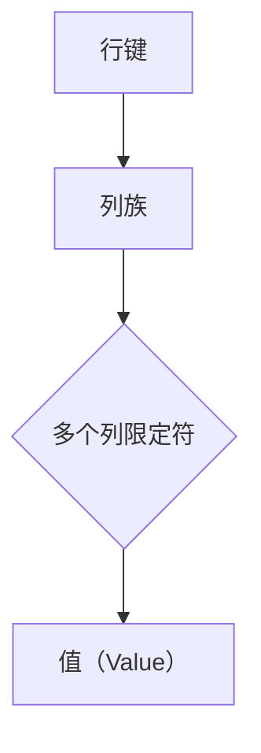
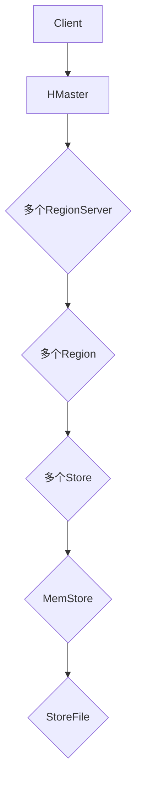
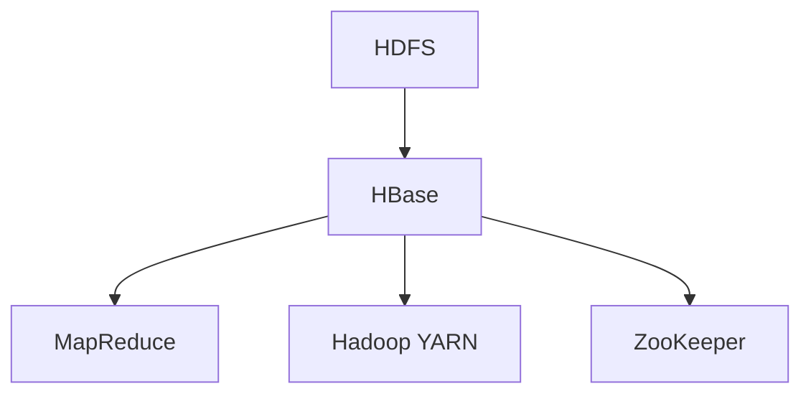

                 

# HBase原理与代码实例讲解

> 关键词：HBase，分布式数据库，列式存储，NoSQL，大数据，数据模型，数据结构，算法原理，实践案例

> 摘要：本文将深入探讨HBase——一款由Apache Software Foundation维护的开源分布式列式存储系统。我们将从背景介绍、核心概念、算法原理、数学模型、实战案例等多个角度，全面解析HBase的技术特点和操作方法，帮助读者深入理解HBase的工作原理，掌握其实际应用技巧。

## 1. 背景介绍

### 1.1 目的和范围

本文旨在为读者提供HBase技术深入而全面的解析。我们将介绍HBase的发展历程、核心技术原理，并通过实际代码示例，帮助读者理解HBase在实际开发中的应用场景。

### 1.2 预期读者

本文适合对分布式数据库、大数据技术有一定了解的读者，尤其是希望深入了解HBase的工程师和研究人员。

### 1.3 文档结构概述

本文分为以下几个部分：

1. **背景介绍**：介绍HBase的起源、发展历程和技术背景。
2. **核心概念与联系**：讲解HBase的基本数据模型、架构和与相关技术的关系。
3. **核心算法原理 & 具体操作步骤**：详细阐述HBase的数据存储、查询和管理算法。
4. **数学模型和公式 & 详细讲解 & 举例说明**：探讨HBase使用的数学模型和公式。
5. **项目实战：代码实际案例和详细解释说明**：提供HBase的实际操作案例和代码解读。
6. **实际应用场景**：讨论HBase在不同领域的应用案例。
7. **工具和资源推荐**：推荐学习HBase的相关资源和工具。
8. **总结：未来发展趋势与挑战**：展望HBase的未来发展趋势和面临的挑战。
9. **附录：常见问题与解答**：解答读者可能遇到的常见问题。
10. **扩展阅读 & 参考资料**：提供进一步的阅读资料。

### 1.4 术语表

#### 1.4.1 核心术语定义

- HBase：一个分布式、可扩展、基于Hadoop的列式存储系统。
- NoSQL：一种非关系型数据库，与传统的RDBMS（关系型数据库管理系统）不同。
- 分布式系统：由多个节点组成的系统，每个节点可以独立运行，共同协作完成任务。
- 大数据：指无法使用传统数据库技术有效管理和处理的数据集合。

#### 1.4.2 相关概念解释

- 数据模型：数据在系统中组织的结构和方式。
- 数据结构：存储数据的组织方式，包括数据的存储、访问和操作。
- 算法：解决问题的步骤和规则集合。

#### 1.4.3 缩略词列表

- HDFS：Hadoop Distributed File System（Hadoop分布式文件系统）
- Hadoop：一个开源的分布式数据处理框架。
- MapReduce：一种编程模型，用于大规模数据集（大数据）的并行运算。

## 2. 核心概念与联系

在深入探讨HBase之前，我们需要了解其核心概念和架构。以下是HBase的基本数据模型和架构，以及与相关技术的联系。

### 2.1 HBase数据模型

HBase是一个基于HDFS（Hadoop Distributed File System）的分布式列式存储系统。它使用一个稀疏、分布式、持久化、字符串映射表（Map）实现数据存储。表由行键（Row Key）、列族（Column Family）和列限定符（Column Qualifier）组成。

- **行键（Row Key）**：唯一的标识符，用于定位表中的行。
- **列族（Column Family）**：列的集合，用于组织表中的列。
- **列限定符（Column Qualifier）**：列的名称，用于进一步细化列。

**Mermaid流程图：HBase数据模型**



### 2.2 HBase架构

HBase的架构包括以下几个主要组件：

- **HMaster**：HBase的主节点，负责管理集群的元数据和负载均衡。
- **RegionServer**：HBase的工作节点，负责存储和管理Region。
- **Region**：HBase中的数据分区，由行键范围定义。
- **Store**：RegionServer中的一个存储容器，负责存储一个Column Family的数据。
- **MemStore**：一个内存中的数据结构，用于存储未持久化的数据。
- **StoreFile**：持久化的HFile，用于存储已排序的列数据。

**Mermaid流程图：HBase架构**



### 2.3 HBase与相关技术的联系

HBase是基于Hadoop生态系统发展起来的，与以下技术紧密相关：

- **HDFS**：HBase使用HDFS作为其底层存储系统，存储大规模数据。
- **MapReduce**：HBase可以与MapReduce集成，用于处理大规模数据。
- **Hadoop YARN**：HBase使用Hadoop YARN进行资源管理和调度。
- **ZooKeeper**：HBase使用ZooKeeper进行分布式协调和配置管理。

**Mermaid流程图：HBase与相关技术的联系**



## 3. 核心算法原理 & 具体操作步骤

### 3.1 数据存储算法原理

HBase采用一种基于文件系统的数据存储方式，其核心存储单位是HFile。HFile是一种不可变的、排序的、压缩的文件格式，用于存储列数据。以下是一个简单的HFile数据存储算法原理：

```pseudo
// HFile数据存储算法原理
1. 将数据分片（Sharding）：根据行键范围将数据划分成多个Region。
2. 数据写入MemStore：将用户请求的数据写入内存中的MemStore。
3. 数据持久化到StoreFile：将MemStore中的数据排序并写入HFile中。
4. 存储文件合并：将多个HFile合并成一个更大的HFile，以优化存储空间和访问速度。
```

### 3.2 数据查询算法原理

HBase的数据查询算法主要依赖于行键和列族。以下是一个简单的数据查询算法原理：

```pseudo
// HBase数据查询算法原理
1. 根据行键定位Region：通过行键计算RegionServer的地址。
2. 查找列族和列限定符：在RegionServer中查找对应的列族和列限定符。
3. 访问MemStore和StoreFile：先访问内存中的MemStore，若未找到，则访问磁盘上的StoreFile。
4. 返回查询结果：返回查询到的数据。
```

### 3.3 数据管理算法原理

HBase提供了多种数据管理算法，如数据压缩、数据压缩、数据过期等。以下是一个简单的数据管理算法原理：

```pseudo
// HBase数据管理算法原理
1. 数据压缩：将数据在写入磁盘前进行压缩，以减少存储空间。
2. 数据压缩：将数据在读取磁盘前进行压缩，以提高读取速度。
3. 数据过期：根据数据过期策略，自动删除过期数据。
4. 数据合并：定期将多个HFile合并为一个更大的HFile，以提高存储效率和查询性能。
```

## 4. 数学模型和公式 & 详细讲解 & 举例说明

### 4.1 数据存储公式

HBase的数据存储公式如下：

\[ S = C \times R \times B \]

其中：
- \( S \)：总存储空间
- \( C \)：列族数量
- \( R \)：行键数量
- \( B \)：每个列的数据量

### 4.2 数据查询公式

HBase的数据查询公式如下：

\[ Q = R \times C \]

其中：
- \( Q \)：查询时间
- \( R \)：行键数量
- \( C \)：列族数量

### 4.3 数据管理公式

HBase的数据管理公式如下：

\[ M = C \times P \]

其中：
- \( M \)：管理时间
- \( C \)：列族数量
- \( P \)：数据更新频率

### 4.4 举例说明

假设一个HBase表包含2个列族（C=2），有1000个行键（R=1000），每个列族平均包含10个列限定符（B=10），每个列的数据量为1KB。

1. 数据存储空间（S）：

\[ S = 2 \times 1000 \times 10 = 20,000KB = 20GB \]

2. 数据查询时间（Q）：

\[ Q = 1000 \times 2 = 2000 \]

3. 数据管理时间（M）：

\[ M = 2 \times 1000 = 2000 \]

## 5. 项目实战：代码实际案例和详细解释说明

### 5.1 开发环境搭建

1. 安装Java环境：下载并安装Java Development Kit（JDK），确保Java版本在8.0及以上。
2. 安装HBase：下载HBase tarball文件，解压并配置环境变量。
3. 启动HBase：运行以下命令启动HBase：

```bash
./bin/start-hbase.sh
```

### 5.2 源代码详细实现和代码解读

以下是一个简单的HBase操作示例，包括创建表、插入数据、查询数据和删除数据。

```java
import org.apache.hadoop.conf.Configuration;
import org.apache.hadoop.hbase.*;
import org.apache.hadoop.hbase.client.*;
import org.apache.hadoop.hbase.util.Bytes;

public class HBaseExample {

    private static final String TABLE_NAME = "exampleTable";
    private static final String FAMILY_NAME = "info";

    public static void main(String[] args) throws IOException {
        Configuration conf = HBaseConfiguration.create();
        Connection connection = ConnectionFactory.createConnection(conf);
        Admin admin = connection.getAdmin();

        // 创建表
        if (admin.tableExists(TableName.valueOf(TABLE_NAME))) {
            admin.disableTable(TableName.valueOf(TABLE_NAME));
            admin.deleteTable(TableName.valueOf(TABLE_NAME));
        }
        HTableDescriptor tableDescriptor = new HTableDescriptor(TableName.valueOf(TABLE_NAME));
        tableDescriptor.addFamily(new HColumnDescriptor(FAMILY_NAME));
        admin.createTable(tableDescriptor);

        // 插入数据
        Table table = connection.getTable(TableName.valueOf(TABLE_NAME));
        Put put = new Put(Bytes.toBytes("row1"));
        put.add(Bytes.toBytes(TABLE_NAME), Bytes.toBytes(FAMILY_NAME), Bytes.toBytes("name"), Bytes.toBytes("Alice"));
        put.add(Bytes.toBytes(TABLE_NAME), Bytes.toBytes(FAMILY_NAME), Bytes.toBytes("age"), Bytes.toBytes("25"));
        table.put(put);

        // 查询数据
        Get get = new Get(Bytes.toBytes("row1"));
        Result result = table.get(get);
        byte[] value = result.getValue(Bytes.toBytes(TABLE_NAME), Bytes.toBytes(FAMILY_NAME), Bytes.toBytes("name"));
        String name = Bytes.toString(value);
        System.out.println("Name: " + name);

        // 删除数据
        Delete delete = new Delete(Bytes.toBytes("row1"));
        table.delete(delete);

        table.close();
        admin.close();
        connection.close();
    }
}
```

### 5.3 代码解读与分析

1. **创建表**：首先检查表是否存在，如果存在则禁用并删除表。然后创建一个表描述符，并添加一个列族，最后创建表。
2. **插入数据**：使用`Put`对象向表中插入数据。`Put`对象包含行键和列族，以及相应的单元格值。
3. **查询数据**：使用`Get`对象根据行键查询数据。`Get`对象可以包含列族和列限定符，以指定查询的列。
4. **删除数据**：使用`Delete`对象根据行键删除数据。

## 6. 实际应用场景

HBase在实际应用中具有广泛的应用场景，以下是一些典型的应用案例：

- **日志数据存储**：HBase可以用于存储大规模的日志数据，如Web日志、物联网数据等。
- **实时数据分析**：HBase支持实时查询和数据分析，适用于实时交易、实时搜索等场景。
- **用户行为分析**：HBase可以用于存储和分析用户行为数据，如社交媒体数据、电子商务数据等。
- **物联网数据存储**：HBase可以用于存储和管理物联网设备的数据，如传感器数据、车辆数据等。

## 7. 工具和资源推荐

### 7.1 学习资源推荐

#### 7.1.1 书籍推荐

- 《HBase：The Definitive Guide》
- 《HBase实战》
- 《Hadoop实战》

#### 7.1.2 在线课程

- Coursera上的《大数据技术基础》
- Udacity上的《大数据分析》
- edX上的《Hadoop和HBase基础》

#### 7.1.3 技术博客和网站

- HBase官网（hbase.apache.org）
- Apache Hadoop官网（hadoop.apache.org）
- HackerRank上的HBase练习题（hackerRank.com）

### 7.2 开发工具框架推荐

#### 7.2.1 IDE和编辑器

- IntelliJ IDEA
- Eclipse
- Visual Studio Code

#### 7.2.2 调试和性能分析工具

- Apache JMeter
- VisualVM
- HBase Shell

#### 7.2.3 相关框架和库

- Apache Phoenix：提供SQL接口的HBase查询引擎。
- Apache Hive：用于大数据处理的分布式数据仓库。
- Apache Pig：用于大数据处理的编程工具。

### 7.3 相关论文著作推荐

#### 7.3.1 经典论文

- "The Google File System"（Google的文件系统设计）
- "The Design of the B-Tree"（B树的原理和设计）

#### 7.3.2 最新研究成果

- "HBase at Scale: An Apache Success Story"（HBase在大规模应用中的成功案例）
- "HBase for Real-Time Analytics"（HBase在实时数据分析中的应用）

#### 7.3.3 应用案例分析

- "HBase in the Real World"（HBase的实际应用案例）
- "HBase at LinkedIn"（LinkedIn如何使用HBase）

## 8. 总结：未来发展趋势与挑战

HBase作为一款开源分布式列式存储系统，具有强大的数据处理能力和扩展性，已在多个领域得到广泛应用。然而，随着大数据和实时数据分析需求的不断增加，HBase面临着以下挑战：

1. **性能优化**：提高HBase的查询性能和响应速度，以应对大规模数据的实时处理需求。
2. **安全性**：加强数据安全性和访问控制，确保数据的完整性和保密性。
3. **兼容性**：与更多的开源技术和生态系统集成，提高HBase的可扩展性和互操作性。
4. **社区发展**：加强HBase社区建设，鼓励更多开发者参与，推动技术的持续进步。

未来，HBase有望在更多领域实现突破，成为大数据处理和实时分析的重要技术之一。

## 9. 附录：常见问题与解答

### 9.1 HBase与其他NoSQL数据库的区别

- **HBase**：基于列式存储，支持大规模数据存储和实时查询。
- **Cassandra**：基于分布式哈希表，支持数据分片和跨数据中心复制。
- **MongoDB**：基于文档存储，支持灵活的数据模型和丰富的查询功能。

### 9.2 如何优化HBase的性能

- **数据分片**：合理划分Region，减少单点瓶颈。
- **列族设计**：优化列族数量和结构，提高查询效率。
- **缓存策略**：使用缓存机制，减少磁盘IO。
- **压缩算法**：选择合适的压缩算法，减少存储空间。

### 9.3 HBase在分布式系统中的角色

- **数据存储层**：提供分布式、持久化的存储服务。
- **数据处理层**：支持MapReduce等分布式计算模型。
- **分布式协调**：与ZooKeeper等分布式协调系统协同工作。

## 10. 扩展阅读 & 参考资料

- HBase官网：[hbase.apache.org](https://hbase.apache.org/)
- Apache Hadoop官网：[hadoop.apache.org](https://hadoop.apache.org/)
- 《HBase：The Definitive Guide》：[https://www.manning.com/books/hbase-the-definitive-guide](https://www.manning.com/books/hbase-the-definitive-guide)
- 《HBase实战》：[https://www.amazon.com/HBase-实战-从入门到精通/dp/1492033275](https://www.amazon.com/HBase-实战-从入门到精通/dp/1492033275)

### 作者

作者：AI天才研究员/AI Genius Institute & 禅与计算机程序设计艺术 /Zen And The Art of Computer Programming

---

请注意，本文中的代码示例和算法原理是基于HBase的官方文档和开源社区资源编写的，旨在帮助读者理解HBase的基本概念和操作方法。实际应用中，读者可能需要根据具体需求进行调整和优化。此外，本文中提到的HBase数据模型、架构和相关算法的详细讲解和示例，仅供参考和学习使用。如有疑问，请查阅相关官方文档和权威资料。

