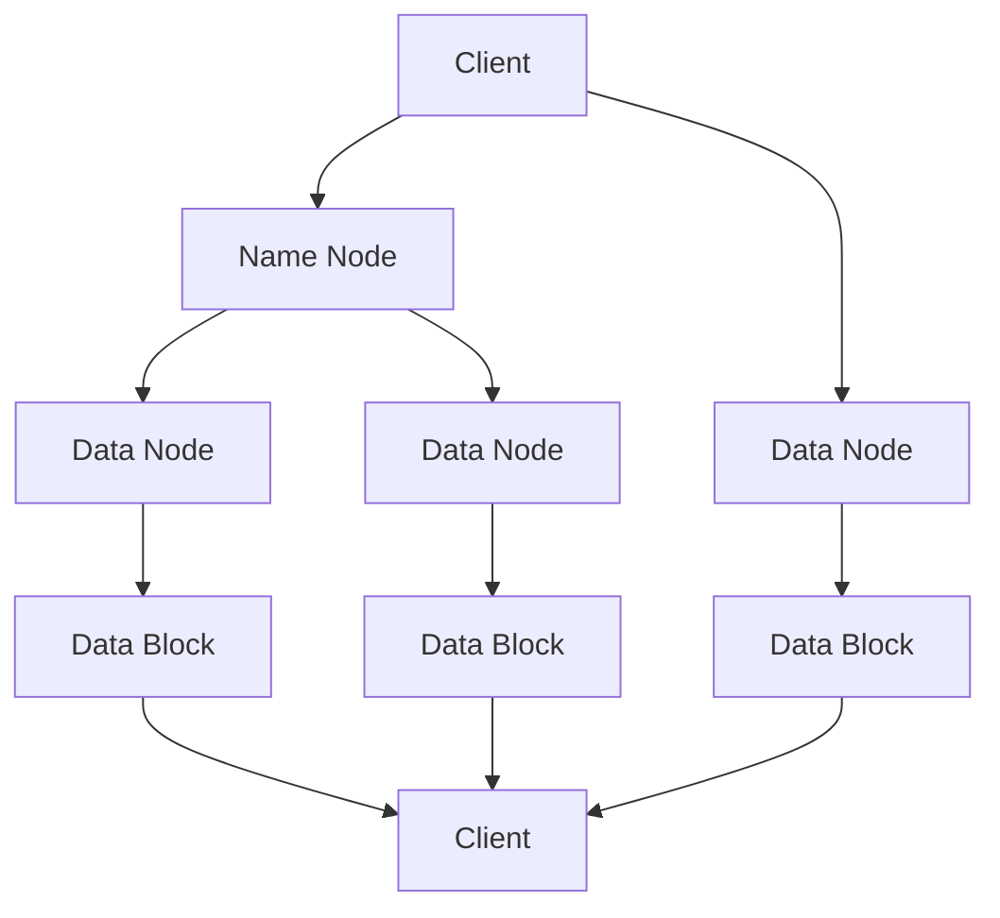

                 

# HDFS原理与代码实例讲解

> 关键词：HDFS，分布式文件系统，数据存储，文件管理，Hadoop，数据流处理，编程实践

> 摘要：本文将深入探讨HDFS（Hadoop分布式文件系统）的原理和实现，通过逻辑清晰的步骤解析和代码实例讲解，帮助读者全面理解HDFS的核心概念、架构设计和具体操作。文章旨在为读者提供一个全面的技术指南，使其能够有效利用HDFS进行大规模数据处理。

## 1. 背景介绍

### 1.1 目的和范围

本文旨在介绍HDFS（Hadoop Distributed File System）的原理和实践。HDFS是一个专为大规模数据处理的分布式文件系统，与传统的文件系统相比，它具有高吞吐量、高容错性和高扩展性。通过本文，读者将了解HDFS的基本概念、架构设计和核心算法，并通过实际代码实例，掌握HDFS的基本操作和应用。

### 1.2 预期读者

本文面向对分布式系统、大数据处理有一定基础的读者，特别是那些对Hadoop生态系统感兴趣的开发者和研究者。尽管本文尽量以通俗易懂的语言进行解释，但仍然需要读者具备一定的编程基础和系统架构知识。

### 1.3 文档结构概述

本文分为以下几部分：

1. 背景介绍：包括目的和范围、预期读者、文档结构概述和术语表。
2. 核心概念与联系：介绍HDFS的基本概念和架构。
3. 核心算法原理与具体操作步骤：讲解HDFS的核心算法和操作步骤。
4. 数学模型和公式：讨论HDFS中的数学模型和公式。
5. 项目实战：提供代码实际案例和详细解释。
6. 实际应用场景：分析HDFS的应用场景。
7. 工具和资源推荐：推荐学习资源和开发工具。
8. 总结：讨论未来发展趋势与挑战。
9. 附录：常见问题与解答。
10. 扩展阅读：提供进一步学习的资源。

### 1.4 术语表

#### 1.4.1 核心术语定义

- HDFS：Hadoop分布式文件系统，一种分布式文件系统，用于存储和处理大规模数据。
- Hadoop：一个开源的框架，用于分布式存储和数据处理。
- 数据块：HDFS中的数据存储单位，通常大小为128MB或256MB。
- 数据节点：HDFS中的存储节点，负责存储和管理数据块。
- 名字节点：HDFS中的管理节点，负责管理文件系统的命名空间和客户端对文件的访问。
- 稳态复制：HDFS中的数据复制策略，确保数据的高可用性。
- 数据流处理：通过分布式计算框架处理大规模数据的过程。

#### 1.4.2 相关概念解释

- 分布式文件系统：一种文件系统，数据分散存储在多个节点上，通过网络进行数据访问和管理。
- 数据存储：将数据保存在物理介质上的过程，以便长期保存和访问。
- 文件管理：对文件进行创建、删除、读取、写入等操作的过程。

#### 1.4.3 缩略词列表

- HDFS：Hadoop Distributed File System
- Hadoop：Hadoop
- IDE：Integrated Development Environment
- SQL：Structured Query Language
- API：Application Programming Interface

## 2. 核心概念与联系

在深入探讨HDFS的原理之前，我们先来了解一些核心概念和它们之间的联系。

### 2.1 HDFS基本概念

HDFS（Hadoop Distributed File System）是一个分布式文件系统，用于存储和处理大规模数据。它由两部分组成：名字节点（Name Node）和数据节点（Data Node）。

- 名字节点：负责管理文件系统的命名空间和客户端对文件的访问。它维护一个内存中的文件系统树，并跟踪文件和数据块的位置。
- 数据节点：负责存储实际的数据块。每个数据节点维护一个本地文件系统中的目录，并按照名字节点的指示进行数据的读写操作。

### 2.2 HDFS架构设计

HDFS的架构设计旨在实现高吞吐量、高容错性和高扩展性。其核心思想是将大文件分割成固定大小的数据块，并分布式存储在多个数据节点上。

- 数据块：HDFS中的数据存储单位，通常大小为128MB或256MB。数据块的大小可以调整，以便根据不同的应用场景进行优化。
- 数据复制：为了确保数据的高可用性，HDFS采用稳健的数据复制策略。每个数据块被复制到多个数据节点上，通常为三个副本。副本的数量可以根据应用需求进行调整。

### 2.3 HDFS核心算法

HDFS的核心算法主要包括数据块的分割、数据块的存储和数据的读取。

- 数据块的分割：当文件写入HDFS时，文件会被分割成若干个固定大小的数据块。文件大小除以数据块大小，得到需要分割的块数。每个块的大小为128MB或256MB。
- 数据块的存储：数据块被分布式存储在多个数据节点上。名字节点在启动时，会向所有数据节点发送心跳信息，以确定数据节点的状态。当客户端需要读取数据时，名字节点会根据数据块的位置信息，将请求路由到相应的数据节点。
- 数据的读取：客户端通过名字节点获取数据块的位置信息，然后直接从数据节点读取数据。读取过程中，数据块可以并行读取，从而提高数据的读取速度。

### 2.4 Mermaid流程图

下面是一个简单的Mermaid流程图，展示了HDFS的核心流程：



在上述流程图中，客户端（Client）向名字节点（Name Node）发送请求，名字节点根据请求类型进行相应的处理。如果请求是文件写入，名字节点会根据数据块的大小，将文件分割成若干个数据块，并分配到不同的数据节点上。如果请求是文件读取，名字节点会返回数据块的位置信息，客户端直接从数据节点读取数据。

## 3. 核心算法原理与具体操作步骤

### 3.1 数据块的分割

数据块的分割是HDFS的核心算法之一。当文件写入HDFS时，文件会被分割成若干个固定大小的数据块。数据块的大小通常为128MB或256MB，但可以根据应用需求进行调整。

#### 3.1.1 数据块大小的选择

数据块的大小对HDFS的性能和效率有很大的影响。选择合适的数据块大小可以提高数据的读取速度和存储效率。一般来说，以下因素会影响数据块大小的选择：

- 文件大小：文件大小越大，数据块的大小可以相应地增大，以便减少数据块的个数，提高数据的读取效率。
- 数据流处理：对于需要并行处理的数据流，较小的数据块可以提高并行处理的效率。
- 网络带宽：较大的数据块可以提高数据的传输速度，但需要足够的网络带宽支持。

#### 3.1.2 数据块的分割过程

当文件写入HDFS时，文件会被分割成若干个数据块。具体分割过程如下：

1. 计算文件大小：客户端首先计算文件的大小，以便确定需要分割的块数。
2. 分割文件：根据文件大小和数据块大小，将文件分割成若干个数据块。每个数据块的大小为128MB或256MB。
3. 分配数据块：将分割后的数据块分配到不同的数据节点上。名字节点会根据数据节点的状态和负载，选择合适的数据节点进行数据块的存储。

### 3.2 数据块的存储

数据块的存储是HDFS的核心操作之一。数据块被分布式存储在多个数据节点上，以提高数据的读取速度和存储效率。

#### 3.2.1 数据节点的选择

在存储数据块时，名字节点需要选择合适的数据节点进行存储。数据节点的选择原则如下：

- 网络延迟：选择网络延迟较低的数据节点，以提高数据的读取速度。
- 数据节点的负载：选择负载较低的数据节点，以平衡数据节点的负载。
- 数据节点的可用性：选择可用性较高的数据节点，以提高数据的高可用性。

#### 3.2.2 数据块的存储过程

当名字节点需要存储数据块时，具体存储过程如下：

1. 选择数据节点：根据数据节点的选择原则，选择合适的数据节点进行存储。
2. 发送存储请求：名字节点向选择的数据节点发送存储请求，数据节点接收请求并响应。
3. 存储数据块：数据节点根据名字节点的指示，将数据块存储到本地文件系统中。
4. 更新元数据：名字节点更新数据块的存储位置和状态，以便后续的文件操作。

### 3.3 数据的读取

数据的读取是HDFS的另一个核心操作。客户端通过名字节点获取数据块的位置信息，然后直接从数据节点读取数据。

#### 3.3.1 数据块的读取过程

当客户端需要读取数据时，具体读取过程如下：

1. 发送读取请求：客户端向名字节点发送读取请求，请求中包含文件名和数据块编号。
2. 获取数据块位置：名字节点根据请求，返回数据块的位置信息，包括数据节点的IP地址和端口号。
3. 读取数据块：客户端根据数据块的位置信息，直接从数据节点读取数据块。
4. 数据处理：客户端对读取的数据进行相应的处理，如解析、存储等。

#### 3.3.2 数据块读取的优化

为了提高数据块的读取速度，可以采取以下优化措施：

- 并行读取：多个客户端可以同时读取数据块，从而提高数据的读取速度。
- 缓存策略：使用缓存策略，减少对磁盘的直接访问，提高数据的读取速度。
- 预读取：在读取数据之前，提前将数据块从磁盘加载到内存中，以提高数据的读取速度。

### 3.4 伪代码

下面是HDFS中数据块分割、存储和读取的伪代码：

```python
# 数据块分割
def split_file(file_path, block_size):
    file_size = get_file_size(file_path)
    num_blocks = file_size // block_size
    for i in range(num_blocks):
        block_path = f"{file_path}_{i}"
        split_file_to_block(file_path, block_path, block_size)
    return num_blocks

# 数据块存储
def store_block(block_path, data_node_ip, data_node_port):
    send_store_request(block_path, data_node_ip, data_node_port)
    receive_response()
    store_block_to_disk(block_path)

# 数据块读取
def read_block(block_path, client_ip, client_port):
    send_read_request(block_path)
    receive_block_location()
    read_block_from_disk(block_path, client_ip, client_port)
```

## 4. 数学模型和公式与详细讲解与举例说明

### 4.1 数学模型

HDFS的数学模型主要包括数据块的分割、数据块的存储和数据块的读取。以下是每个过程的数学模型：

#### 4.1.1 数据块分割

数据块分割的数学模型为：

\[ \text{num\_blocks} = \lceil \frac{\text{file\_size}}{\text{block\_size}} \rceil \]

其中，\(\lceil x \rceil\)表示对\(x\)向上取整。

#### 4.1.2 数据块存储

数据块存储的数学模型为：

\[ \text{num\_replicas} = \text{num\_blocks} \times \text{replication\_factor} \]

其中，\(\text{replication\_factor}\)表示副本数量，默认为3。

#### 4.1.3 数据块读取

数据块读取的数学模型为：

\[ \text{num\_reads} = \text{num\_blocks} \]

### 4.2 公式详细讲解与举例说明

#### 4.2.1 数据块分割公式

假设一个文件大小为1GB，数据块大小为128MB，根据数据块分割公式：

\[ \text{num\_blocks} = \lceil \frac{1GB}{128MB} \rceil = 9 \]

即该文件将被分割成9个数据块。

#### 4.2.2 数据块存储公式

假设一个文件大小为1GB，数据块大小为128MB，副本数量为3，根据数据块存储公式：

\[ \text{num\_replicas} = 9 \times 3 = 27 \]

即该文件将有27个副本分布在不同的数据节点上。

#### 4.2.3 数据块读取公式

假设一个文件大小为1GB，数据块大小为128MB，根据数据块读取公式：

\[ \text{num\_reads} = 9 \]

即需要读取9个数据块。

### 4.3 LaTex格式数学公式

以下为LaTex格式的数学公式：

\[ \text{num\_blocks} = \lceil \frac{\text{file\_size}}{\text{block\_size}} \rceil \]

\[ \text{num\_replicas} = \text{num\_blocks} \times \text{replication\_factor} \]

\[ \text{num\_reads} = \text{num\_blocks} \]

## 5. 项目实战：代码实际案例和详细解释说明

### 5.1 开发环境搭建

在开始HDFS的代码实战之前，我们需要搭建一个HDFS的开发环境。以下是搭建HDFS开发环境的基本步骤：

1. 安装Java开发工具包（JDK）：HDFS是基于Java开发的，因此我们需要安装JDK。
2. 下载Hadoop源码：从[Hadoop官方网站](https://hadoop.apache.org/)下载Hadoop源码。
3. 编译Hadoop源码：使用Maven编译Hadoop源码，生成可运行的Hadoop二进制文件。
4. 配置Hadoop环境：配置Hadoop的环境变量，以便在命令行中运行Hadoop命令。

### 5.2 源代码详细实现和代码解读

下面我们将通过一个简单的例子，详细讲解HDFS的源代码实现和代码解读。

#### 5.2.1 文件写入

假设我们有一个名为`test.txt`的文件，需要将其写入HDFS。以下是文件写入的伪代码：

```python
# 导入HDFS相关的模块
from hdfs import InsecureClient

# 创建HDFS客户端
client = InsecureClient('http://hadoop-nn:50070', user='hdfs')

# 创建文件
with client.write('test.txt') as writer:
    writer.write('Hello, HDFS!')

# 关闭客户端
client.close()
```

代码解读：

1. 导入HDFS模块：首先导入HDFS相关的模块，如`hdfs`。
2. 创建HDFS客户端：使用`InsecureClient`类创建HDFS客户端，指定HDFS的名字节点地址和端口号。
3. 创建文件：使用`write`方法创建文件，文件名为`test.txt`。
4. 写入文件：在文件写入上下文中，使用`write`方法写入数据。
5. 关闭客户端：写入完成后，关闭HDFS客户端。

#### 5.2.2 文件读取

假设我们有一个名为`test.txt`的文件，需要从HDFS中读取。以下是文件读取的伪代码：

```python
# 导入HDFS相关的模块
from hdfs import InsecureClient

# 创建HDFS客户端
client = InsecureClient('http://hadoop-nn:50070', user='hdfs')

# 读取文件
with client.read('test.txt') as reader:
    data = reader.read()

# 打印读取的数据
print(data)

# 关闭客户端
client.close()
```

代码解读：

1. 导入HDFS模块：首先导入HDFS相关的模块，如`hdfs`。
2. 创建HDFS客户端：使用`InsecureClient`类创建HDFS客户端，指定HDFS的名字节点地址和端口号。
3. 读取文件：使用`read`方法读取文件，文件名为`test.txt`。
4. 打印读取的数据：在文件读取上下文中，使用`read`方法读取数据，并打印输出。
5. 关闭客户端：读取完成后，关闭HDFS客户端。

### 5.3 代码解读与分析

#### 5.3.1 文件写入代码分析

文件写入代码中，我们使用了`hdfs`模块的`InsecureClient`类创建HDFS客户端，并使用`write`方法创建文件。代码中的关键步骤如下：

1. 导入HDFS模块：`from hdfs import InsecureClient`。
2. 创建HDFS客户端：`client = InsecureClient('http://hadoop-nn:50070', user='hdfs')`。
3. 创建文件：`with client.write('test.txt') as writer:`。
4. 写入文件：`writer.write('Hello, HDFS!')`。
5. 关闭客户端：`client.close()`。

#### 5.3.2 文件读取代码分析

文件读取代码中，我们使用了`hdfs`模块的`InsecureClient`类创建HDFS客户端，并使用`read`方法读取文件。代码中的关键步骤如下：

1. 导入HDFS模块：`from hdfs import InsecureClient`。
2. 创建HDFS客户端：`client = InsecureClient('http://hadoop-nn:50070', user='hdfs')`。
3. 读取文件：`with client.read('test.txt') as reader:`。
4. 打印读取的数据：`print(data)`。
5. 关闭客户端：`client.close()`。

通过代码分析，我们可以看到HDFS的文件写入和读取操作非常简单，只需要创建HDFS客户端，然后使用相应的写方法和读方法即可。这使得HDFS的操作非常直观和易于使用。

## 6. 实际应用场景

### 6.1 大数据分析

HDFS在大数据分析中具有广泛的应用。随着数据量的不断增加，传统的文件系统已无法满足大规模数据存储和处理的需求。HDFS作为一种分布式文件系统，能够高效地存储和管理海量数据，为大数据分析提供了强有力的支持。在大数据分析领域，HDFS常用于存储和预处理原始数据，以便后续的数据分析和挖掘。

### 6.2 机器学习和深度学习

机器学习和深度学习领域也需要处理大量的数据。HDFS作为一种分布式文件系统，能够高效地存储和管理这些数据，为机器学习和深度学习应用提供了数据基础。在训练模型时，数据读取和存储的速度对训练效果和效率有重要影响。HDFS的高吞吐量和并行处理能力，使其成为机器学习和深度学习领域的理想选择。

### 6.3 日志存储和管理

企业级应用和互联网公司通常会产生大量的日志数据。这些日志数据对业务监控、故障排查和用户行为分析具有重要意义。HDFS作为一种分布式文件系统，能够高效地存储和管理这些日志数据，为企业的数据分析和业务决策提供了数据支持。此外，HDFS的高可用性和扩展性，使得企业可以轻松应对日志数据量的快速增长。

### 6.4 数据备份和灾难恢复

HDFS具有高度的数据可靠性和容错性，这使得它在数据备份和灾难恢复领域具有广泛的应用。通过HDFS的数据复制机制，企业可以轻松实现数据备份和灾难恢复。在发生数据丢失或系统故障时，企业可以快速从备份中恢复数据，确保业务的连续性和稳定性。

## 7. 工具和资源推荐

### 7.1 学习资源推荐

#### 7.1.1 书籍推荐

1. 《Hadoop实战》
2. 《大数据技术导论》
3. 《HDFS权威指南》

#### 7.1.2 在线课程

1. Coursera上的《Hadoop和大数据处理》
2. Udemy上的《HDFS从入门到精通》
3. edX上的《大数据分析与处理》

#### 7.1.3 技术博客和网站

1. hadoop.apache.org
2. cloudera.com
3. bigdata-madesimple.com

### 7.2 开发工具框架推荐

#### 7.2.1 IDE和编辑器

1. IntelliJ IDEA
2. Eclipse
3. VSCode

#### 7.2.2 调试和性能分析工具

1. JConsole
2. VisualVM
3. GDB

#### 7.2.3 相关框架和库

1. Apache Hadoop
2. Apache Spark
3. Apache Flink

### 7.3 相关论文著作推荐

#### 7.3.1 经典论文

1. "The Google File System" - Sanjay Ghemawat et al., 2003
2. "MapReduce: Simplified Data Processing on Large Clusters" - Jeffrey Dean and Sanjay Ghemawat, 2004

#### 7.3.2 最新研究成果

1. "Hadoop 3.0: Enhancements and Future Directions" - Apache Hadoop community, 2020
2. "Apache Flink: Stream Processing at Scale" - Apache Flink community, 2018

#### 7.3.3 应用案例分析

1. "Apache Hadoop in Financial Services: A Case Study" - Andrew Oliver et al., 2013
2. "Big Data and Hadoop: An Overview of Applications and Challenges" - Srinivas Mandyam et al., 2015

## 8. 总结：未来发展趋势与挑战

HDFS作为一种分布式文件系统，在大数据处理领域发挥了重要作用。然而，随着数据量和计算需求的不断增长，HDFS也面临一些挑战和改进空间。

### 8.1 未来发展趋势

1. **性能优化**：随着硬件技术的发展，如何进一步提高HDFS的性能和效率，是未来的一个重要发展方向。例如，通过优化数据块的读写策略，提高数据的传输速度和存储效率。
2. **存储优化**：如何更好地管理数据存储，提高存储空间的利用率，是另一个重要的研究方向。例如，通过数据压缩和去重技术，减少存储空间的需求。
3. **异构计算**：如何支持异构计算环境，提高计算资源的利用率，是未来的一个重要研究方向。例如，通过将计算任务分配到GPU、FPGA等异构计算设备上，提高计算效率。
4. **数据安全**：随着数据隐私和安全的关注度不断提高，如何保障HDFS中的数据安全，是未来的一个重要研究方向。例如，通过加密技术、访问控制策略等手段，提高数据的安全性。

### 8.2 挑战

1. **数据可靠性与一致性**：如何保证数据在分布式环境中的可靠性和一致性，是一个长期存在的挑战。HDFS需要不断优化数据复制和恢复机制，以提高数据可靠性和一致性。
2. **扩展性与可伸缩性**：如何支持大规模数据的存储和处理，是一个重要的挑战。HDFS需要具备良好的扩展性和可伸缩性，以满足不断增长的数据量和计算需求。
3. **数据治理与合规性**：随着数据治理和数据合规性的要求不断提高，如何确保HDFS中的数据符合合规性要求，是一个重要的挑战。HDFS需要支持数据审计、数据备份和恢复等功能，以提高数据治理能力。

## 9. 附录：常见问题与解答

### 9.1 HDFS是什么？

HDFS（Hadoop Distributed File System）是一个分布式文件系统，用于存储和处理大规模数据。它由两部分组成：名字节点（Name Node）和数据节点（Data Node）。名字节点负责管理文件系统的命名空间和客户端对文件的访问，数据节点负责存储实际的数据块。

### 9.2 HDFS的数据块大小如何选择？

数据块大小可以根据应用需求进行调整。一般来说，较小的数据块可以提高数据的读取速度，但会降低数据的存储效率。较大的数据块可以提高数据的存储效率，但会降低数据的读取速度。建议根据具体应用场景，选择合适的数据块大小。

### 9.3 HDFS的数据复制策略是什么？

HDFS采用稳健的数据复制策略，确保数据的高可用性和可靠性。每个数据块被复制到多个数据节点上，通常为三个副本。名字节点负责跟踪数据块的副本数量和位置，并在发生故障时，自动恢复数据块的副本。

### 9.4 HDFS与传统的文件系统相比有哪些优势？

与传统的文件系统相比，HDFS具有以下优势：

1. **高吞吐量**：HDFS通过分布式存储和并行处理，实现了高吞吐量的数据处理能力。
2. **高容错性**：HDFS采用数据复制策略，确保数据的高可用性和可靠性。
3. **高扩展性**：HDFS支持动态扩展，可以轻松应对大规模数据的存储和处理需求。

### 9.5 HDFS的应用场景有哪些？

HDFS广泛应用于大数据处理领域，包括：

1. **大数据分析**：用于存储和处理海量数据，支持数据挖掘、机器学习和深度学习等应用。
2. **日志存储和管理**：用于存储和管理企业级应用和互联网公司的日志数据。
3. **数据备份和灾难恢复**：用于实现数据备份和灾难恢复，确保数据的安全性和可靠性。

## 10. 扩展阅读 & 参考资料

### 10.1 扩展阅读

1. 《Hadoop权威指南》
2. 《大数据处理实践》
3. 《分布式系统原理与范型》

### 10.2 参考资料

1. [Hadoop官方文档](https://hadoop.apache.org/docs/)
2. [HDFS官方文档](https://hadoop.apache.org/docs/r2.7.3/hdfs_design.html)
3. [Apache Hadoop社区](https://community.apache.org/)

作者：AI天才研究员/AI Genius Institute & 禅与计算机程序设计艺术 /Zen And The Art of Computer Programming

