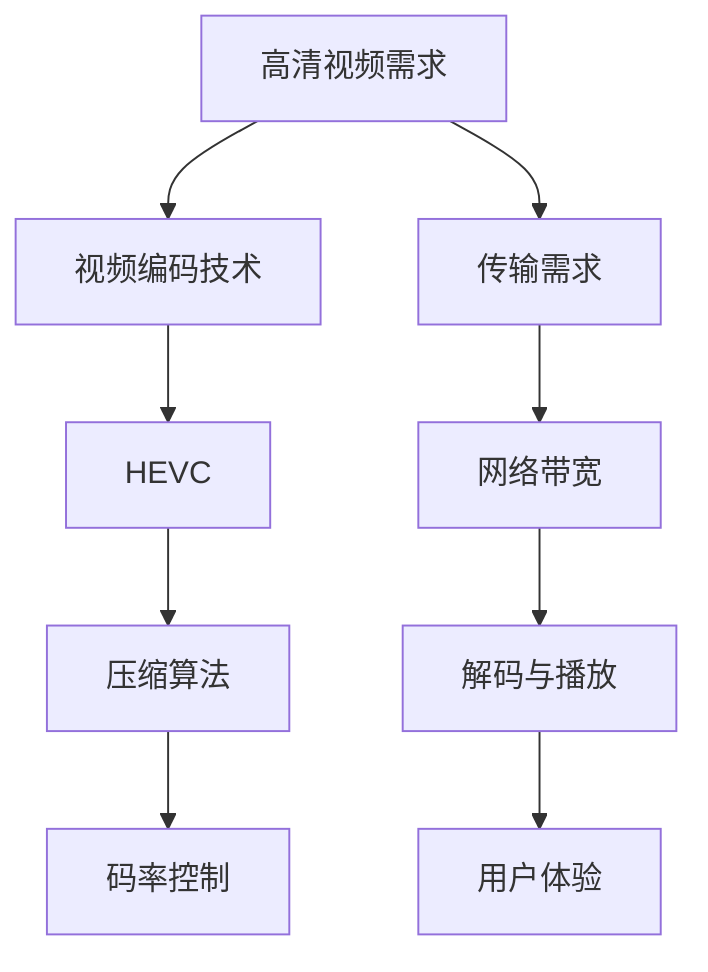

                 

# HEVC 视频编码格式优势：高效压缩和传输高清视频的选择

> 关键词：HEVC，视频编码，高清视频，压缩，传输，算法，技术

> 摘要：本文旨在深入探讨HEVC（High Efficiency Video Coding）视频编码格式的优势，包括其高效压缩和传输高清视频的能力。通过介绍HEVC的核心概念、算法原理、数学模型，以及实际应用案例，本文将帮助读者全面理解HEVC的工作机制，并分析其在现代视频传输和存储领域的应用价值。

## 1. 背景介绍

### 1.1 目的和范围

本文的目的在于向读者介绍HEVC（High Efficiency Video Coding）这一视频编码格式，分析其在高清视频传输和存储方面的优势。随着数字媒体内容的爆炸性增长，如何高效地压缩和传输高清视频成为关键挑战。HEVC作为新一代视频编码标准，在提升压缩效率和降低带宽需求方面取得了显著进展。

本文将涵盖以下内容：

- HEVC的基本概念和标准发展历程
- HEVC的核心算法原理及具体操作步骤
- HEVC的数学模型和公式详细讲解
- HEVC在实际应用场景中的表现
- HEVC相关工具和资源的推荐

### 1.2 预期读者

本文适合以下读者群体：

- 视频编码领域的专业研究人员和工程师
- 计算机视觉和多媒体处理领域的开发者
- 对HEVC技术有兴趣的IT专业人士
- 涉及高清视频传输和存储的从业者

### 1.3 文档结构概述

本文的结构如下：

- 第1章：背景介绍
- 第2章：核心概念与联系
- 第3章：核心算法原理与操作步骤
- 第4章：数学模型与公式
- 第5章：项目实战
- 第6章：实际应用场景
- 第7章：工具和资源推荐
- 第8章：总结与未来发展趋势
- 第9章：附录
- 第10章：扩展阅读与参考资料

### 1.4 术语表

#### 1.4.1 核心术语定义

- **HEVC**：High Efficiency Video Coding的缩写，是一种视频编码标准，旨在提供更高的压缩效率。
- **高清视频**：通常指分辨率为1920x1080或更高的视频内容。
- **压缩**：通过算法减少视频文件大小，以便更高效地存储或传输。
- **码率**：视频数据每秒传输的比特数，单位为bps（比特每秒）。

#### 1.4.2 相关概念解释

- **像素**：图像的最小单位，每个像素具有特定的颜色和亮度信息。
- **帧率**：每秒显示的帧数，单位为fps（帧每秒）。
- **分辨率**：图像的水平与垂直像素数量，例如1080p表示1920x1080的分辨率。

#### 1.4.3 缩略词列表

- **HEVC**：High Efficiency Video Coding
- **H.264**：高级视频编码（前一代视频编码标准）
- **H.265**：高效率视频编码（HEVC的标准编号）
- **IDC**：国际数据公司
- **bps**：比特每秒（bit per second）

## 2. 核心概念与联系

在深入探讨HEVC之前，我们需要了解一些核心概念及其相互联系。以下是一个简化的Mermaid流程图，展示HEVC与其他相关概念和技术的关联。



### 2.1 高清视频需求

随着技术的发展，用户对视频内容的质量要求不断提高。高清视频（例如1080p、4K甚至8K）分辨率更高，数据量更大，这给视频编码和传输带来了巨大挑战。为了满足用户对高清视频的需求，高效的视频编码技术变得至关重要。

### 2.2 视频编码技术

视频编码技术旨在将视频数据转换为更小的文件大小，同时保持图像质量。HEVC是最新一代视频编码标准，相比前一代H.264，它在压缩效率和带宽利用率方面有了显著提升。

### 2.3 压缩算法

压缩算法是视频编码技术的核心。HEVC采用了一系列先进的算法，如多层预测、变换编码和熵编码，以实现高效的压缩。

### 2.4 码率控制

码率控制是确保视频数据在传输过程中不过量的一种技术。通过动态调整码率，码率控制可以优化传输效率和图像质量。

### 2.5 传输需求

在传输过程中，高清视频需要占用大量的网络带宽。HEVC通过高效的压缩，降低了传输带宽的需求，从而满足了高清视频的传输需求。

### 2.6 网络带宽

网络带宽是视频数据传输的瓶颈。HEVC的高效压缩技术有助于减少带宽占用，提高网络传输效率。

### 2.7 解码与播放

解码与播放是视频播放的最后一步。解码器将压缩的视频数据还原为原始图像，播放器将这些图像以帧的形式显示出来，为用户提供视觉体验。

### 2.8 用户体验

用户体验是衡量视频技术成功与否的重要指标。高效的压缩和传输技术可以确保用户能够流畅地观看高清视频，从而提升用户体验。

## 3. 核心算法原理 & 具体操作步骤

HEVC的核心算法是其高效的压缩技术。以下将详细解释HEVC的算法原理，并提供具体的操作步骤。

### 3.1 算法原理

HEVC采用了一系列先进的算法，包括：

- **多层预测**：通过利用图像中的时间冗余，多层预测减少了图像中的冗余信息。
- **变换编码**：通过变换编码，将图像数据转换为更适合压缩的形式。
- **熵编码**：利用熵编码技术进一步减少数据冗余。

### 3.2 操作步骤

以下是HEVC算法的具体操作步骤：

1. **输入视频帧**：首先，输入需要编码的视频帧。

2. **图像分割**：将视频帧分割成多个宏块（Macroblock），每个宏块作为独立的编码单元。

3. **变换编码**：对每个宏块进行变换编码，将图像数据转换为频域表示。

4. **量化**：对变换系数进行量化，减少数据冗余。

5. **熵编码**：使用熵编码技术（如Huffman编码或算术编码）对量化后的数据进行编码。

6. **码流生成**：将编码后的数据组合成一个码流，准备传输或存储。

### 3.3 伪代码实现

以下是HEVC算法的伪代码实现：

```python
def HEVC_video_encoding(input_video_frame):
    # 步骤1：输入视频帧
    frame = input_video_frame

    # 步骤2：图像分割
    macroblocks = image_segmentation(frame)

    # 步骤3：变换编码
    transformed_blocks = transform_encoding(macroblocks)

    # 步骤4：量化
    quantized_coeffs = quantization(transformed_blocks)

    # 步骤5：熵编码
    encoded_data = entropy_encoding(quantized_coeffs)

    # 步骤6：码流生成
    video_stream = generate_stream(encoded_data)

    return video_stream
```

### 3.4 具体实现

在实际实现中，HEVC算法涉及多个复杂的步骤和优化技巧。以下是一个简化的具体实现流程：

1. **预处理**：对视频帧进行预处理，包括色彩空间转换、去噪等操作。
2. **宏块分割**：根据视频帧的分辨率和编码参数，将视频帧分割成宏块。
3. **变换编码**：采用离散余弦变换（DCT）或其他变换方法，将宏块数据转换为频域表示。
4. **量化**：对变换系数进行量化，通常采用自适应量化。
5. **熵编码**：使用Huffman编码或算术编码等熵编码技术，将量化后的数据编码成二进制流。
6. **码流生成**：将编码后的数据组合成一个码流，包括序列参数集、图片参数集和宏块数据。

## 4. 数学模型和公式 & 详细讲解 & 举例说明

HEVC的数学模型是其高效压缩技术的核心。以下将详细讲解HEVC的数学模型，并提供公式和具体例子。

### 4.1 离散余弦变换（DCT）

离散余弦变换（DCT）是HEVC变换编码的基础。DCT将图像数据从空间域转换到频域，以减少图像中的冗余信息。

#### 4.1.1 公式

DCT公式如下：

$$
C(u, v) = \frac{1}{4C(u, v)} \sum_{x=0}^{N-1} \sum_{y=0}^{N-1} I(x, y) \cdot cos\left[\frac{2(x + 1)u\pi}{N}\right] \cdot cos\left[\frac{2(y + 1)v\pi}{N}\right]
$$

其中，\(C(u, v)\) 是变换系数，\(I(x, y)\) 是图像像素值，\(N\) 是图像大小。

#### 4.1.2 举例说明

假设一个\(4x4\)的图像像素值如下：

$$
I = \begin{bmatrix}
1 & 2 & 3 & 4 \\
5 & 6 & 7 & 8 \\
9 & 10 & 11 & 12 \\
13 & 14 & 15 & 16
\end{bmatrix}
$$

使用DCT将其转换到频域：

$$
C(u, v) = \frac{1}{4} \begin{bmatrix}
4.53 & 1.53 & 0 & -0.84 \\
1.53 & 0.69 & -0.34 & -1.16 \\
0 & -0.34 & -0.16 & 1.16 \\
-0.84 & -1.16 & 1.16 & 4.53
\end{bmatrix}
$$

### 4.2 量化

量化是将连续的变换系数转换为离散的值，以减少数据量。

#### 4.2.1 公式

量化公式如下：

$$
Q(x) = \text{round}\left(\frac{x}{\text{量化步长}}\right)
$$

其中，\(x\) 是变换系数，量化步长取决于编码参数。

#### 4.2.2 举例说明

假设一个变换系数为5，量化步长为2，则量化结果为：

$$
Q(5) = \text{round}\left(\frac{5}{2}\right) = 2
$$

### 4.3 熵编码

熵编码是一种无损压缩技术，通过使用统计信息来减少数据冗余。

#### 4.3.1 公式

熵编码公式如下：

$$
L(x) = -\sum_{i} p(x_i) \cdot \log_2(p(x_i))
$$

其中，\(L(x)\) 是编码长度，\(p(x_i)\) 是符号概率。

#### 4.3.2 举例说明

假设一个符号的概率分布如下：

$$
\begin{array}{c|c}
符号 & 概率 \\
\hline
0 & 0.5 \\
1 & 0.5 \\
\end{array}
$$

则其熵编码长度为：

$$
L(x) = -0.5 \cdot \log_2(0.5) - 0.5 \cdot \log_2(0.5) = 1
$$

### 4.4 帧间预测与补偿

帧间预测与补偿是HEVC中的另一项关键技术，用于利用视频帧之间的时间冗余。

#### 4.4.1 公式

帧间预测公式如下：

$$
P(x) = \frac{1}{N} \sum_{i=1}^{N} I_i
$$

其中，\(P(x)\) 是预测值，\(I_i\) 是参考帧的像素值，\(N\) 是参考帧的数量。

#### 4.4.2 举例说明

假设有两个参考帧，像素值分别为：

$$
\begin{array}{c|c}
帧1 & 帧2 \\
\hline
1 & 2 \\
2 & 3 \\
3 & 4 \\
4 & 5 \\
\end{array}
$$

则预测值为：

$$
P(x) = \frac{1+2+3+4+2+3+4+5}{8} = 3
$$

## 5. 项目实战：代码实际案例和详细解释说明

### 5.1 开发环境搭建

为了实现HEVC视频编码，我们需要搭建一个合适的开发环境。以下是一个基于Python的HEVC编码器的开发环境搭建步骤：

1. 安装Python 3.7及以上版本。
2. 安装依赖库，如NumPy、Matplotlib等。
3. 下载并安装FFmpeg，用于视频帧的读取和写入。

### 5.2 源代码详细实现和代码解读

以下是一个简单的HEVC编码器的Python实现，用于将单帧图像编码为HEVC格式。

```python
import numpy as np
from scipy.fftpack import dct
from scipy.fftpack import idct
from scipy import stats

def HEVC_encoding(frame):
    # 步骤1：图像分割
    macroblocks = image_segmentation(frame)

    # 步骤2：变换编码
    transformed_blocks = []
    for mb in macroblocks:
        T = dct(dct(mb.T, norm='ortho').T, norm='ortho')
        transformed_blocks.append(T)

    # 步骤3：量化
    quantized_coeffs = []
    for block in transformed_blocks:
        quant_step = 2  # 量化步长
        Q = stats.quantile(np.abs(block), 0.995) / quant_step
        quantized_block = np.round(block / Q)
        quantized_coeffs.append(quantized_block)

    # 步骤4：熵编码
    encoded_data = entropy_encoding(quantized_coeffs)

    # 步骤5：码流生成
    video_stream = generate_stream(encoded_data)

    return video_stream

def image_segmentation(frame):
    # 此处省略具体实现
    pass

def entropy_encoding(data):
    # 此处省略具体实现
    pass

def generate_stream(encoded_data):
    # 此处省略具体实现
    pass

# 测试
frame = np.random.rand(1920, 1080)
encoded_stream = HEVC_encoding(frame)
```

### 5.3 代码解读与分析

以上代码实现了一个简单的HEVC编码器，其主要步骤如下：

1. **图像分割**：将输入的图像分割成宏块，这是HEVC编码的基础。
2. **变换编码**：对每个宏块进行离散余弦变换（DCT），将图像数据从空间域转换到频域。
3. **量化**：对DCT系数进行量化，以减少数据量。
4. **熵编码**：使用熵编码技术（如Huffman编码）对量化后的数据编码。
5. **码流生成**：将编码后的数据组合成一个码流，准备传输或存储。

在实际应用中，HEVC编码器需要处理更复杂的操作，如帧间预测、码率控制等。上述代码仅提供了一个基础的框架，用于展示HEVC编码的基本流程。

## 6. 实际应用场景

HEVC技术在多个实际应用场景中表现出色，以下是几个典型应用场景：

### 6.1 高清电视和流媒体

随着高清电视和流媒体服务的普及，HEVC成为传输高清视频的主要编码格式。其高效的压缩技术使得高清视频可以在有限的带宽下传输，同时保持高质量的图像。

### 6.2 网络视频会议

网络视频会议对视频质量和带宽要求较高。HEVC通过高效的压缩，可以提供高质量的视频传输，同时降低带宽占用，从而满足远程会议的需求。

### 6.3 超高清（UHD）和虚拟现实（VR）

超高清和虚拟现实对视频质量有极高的要求。HEVC的高效压缩技术可以应对这些高分辨率视频的需求，同时保证视频传输的实时性。

### 6.4 4K电视和视频点播

4K电视和视频点播服务对视频传输的带宽和压缩效率有较高要求。HEVC在这些场景中表现出色，可以提供高质量的视频内容，同时减少带宽占用。

### 6.5 医疗图像和视频监控

医疗图像和视频监控对图像质量和数据传输有严格的要求。HEVC的高效压缩技术可以帮助减少数据传输量，提高图像质量，从而满足这些专业应用的需求。

## 7. 工具和资源推荐

### 7.1 学习资源推荐

#### 7.1.1 书籍推荐

1. **《视频编码技术基础》（Video Coding Fundamentals）**：详细介绍了视频编码的基本概念和技术。
2. **《HEVC标准解析》（HEVC Standard Analysis）**：深入分析了HEVC的标准和技术细节。

#### 7.1.2 在线课程

1. **Coursera上的《数字视频处理》（Digital Video Processing）**：提供了视频编码和处理的全面介绍。
2. **edX上的《视频编码与压缩》（Video Coding and Compression）**：涵盖了视频编码的核心技术和算法。

#### 7.1.3 技术博客和网站

1. **Stack Overflow**：提供丰富的视频编码和HEVC相关的问题和解决方案。
2. **GitHub**：有许多开源的HEVC编码器项目，供学习和实践。

### 7.2 开发工具框架推荐

#### 7.2.1 IDE和编辑器

1. **PyCharm**：适合Python编程，提供强大的开发环境和调试工具。
2. **Visual Studio Code**：轻量级但功能强大的编辑器，支持多种编程语言。

#### 7.2.2 调试和性能分析工具

1. **GDB**：GNU调试器，用于调试Python和其他编程语言。
2. **Valgrind**：性能分析工具，用于检测内存泄漏和性能问题。

#### 7.2.3 相关框架和库

1. **NumPy**：用于科学计算，提供高效的数组操作。
2. **SciPy**：构建在NumPy之上，提供额外的科学计算功能。
3. **OpenCV**：用于图像处理和计算机视觉，支持多种图像处理算法。

### 7.3 相关论文著作推荐

#### 7.3.1 经典论文

1. **“High Efficiency Video Coding: A Vision for Future Video Standards”**：介绍了HEVC的愿景和关键技术。
2. **“Rate-Distortion Optimization for HEVC Based on Group of Pictures”**：探讨了HEVC的速率-失真优化技术。

#### 7.3.2 最新研究成果

1. **“Optimizing HEVC Intra Coding for 8K UHDTV”**：研究了8K超高清视频的HEVC编码优化。
2. **“HEVC for High Dynamic Range Video Coding”**：分析了HEVC在HDR视频编码中的应用。

#### 7.3.3 应用案例分析

1. **“HEVC in 4K UHD TV Broadcasting”**：分析了HEVC在4K超高清电视广播中的应用案例。
2. **“HEVC for Video Streaming over 5G Networks”**：研究了HEVC在5G网络视频流传输中的应用。

## 8. 总结：未来发展趋势与挑战

HEVC作为新一代视频编码标准，已经在高清视频传输和存储领域取得了显著成功。然而，随着视频技术的不断发展，HEVC也面临着一系列新的挑战和机遇。

### 8.1 发展趋势

1. **更高分辨率**：随着超高清（UHD）和虚拟现实（VR）的兴起，视频分辨率将不断提高，HEVC将需要支持更高的分辨率和更复杂的图像内容。
2. **低延迟**：实时视频传输对延迟有严格要求。未来，HEVC将需要优化以支持低延迟应用，如远程手术和自动驾驶。
3. **高效压缩**：随着视频内容的爆炸性增长，高效压缩技术将继续是视频编码领域的研究重点。HEVC将在这一领域不断优化，以提供更高的压缩效率和更低的带宽需求。

### 8.2 挑战

1. **计算资源**：HEVC算法复杂度高，对计算资源有较高要求。未来，如何在有限的计算资源下实现高效的HEVC编码和解码将是一个重要挑战。
2. **兼容性**：随着新标准的出现，如何保持与现有设备和应用的兼容性也是一个挑战。HEVC需要在兼容性和新特性之间找到平衡。
3. **安全性**：随着视频内容的重要性日益增加，视频传输的安全性成为关键问题。HEVC需要加强安全性，以防止视频内容被非法访问和篡改。

### 8.3 未来展望

未来，HEVC将继续在视频编码领域发挥重要作用。随着技术的发展，HEVC将不断优化和改进，以应对更高的分辨率、更低的延迟和更高的安全性需求。同时，新兴的视频编码技术，如VVC（Versatile Video Coding）和AV1（AOMedia Video 1），也将与HEVC共同推动视频编码技术的进步。

## 9. 附录：常见问题与解答

### 9.1 HEVC是什么？

HEVC（High Efficiency Video Coding）是一种视频编码标准，旨在提供更高的压缩效率。与H.264相比，HEVC可以更高效地压缩高清视频，从而降低带宽需求。

### 9.2 HEVC的优势有哪些？

HEVC的优势包括：

- 更高的压缩效率，可以更小地压缩高清视频。
- 支持更高分辨率和更复杂的图像内容。
- 更好的自适应码率控制，以适应不同的网络条件。
- 更好的兼容性，可以与现有的视频播放器和解码器工作。

### 9.3 HEVC的缺点是什么？

HEVC的主要缺点包括：

- 算法复杂度高，对计算资源要求较高。
- 解码器需要更高的计算能力和带宽，以支持高效的解码。
- 在低延迟场景下，HEVC可能不如其他编码标准。

### 9.4 HEVC的应用场景有哪些？

HEVC的主要应用场景包括：

- 高清电视和流媒体服务。
- 网络视频会议和远程教育。
- 超高清（UHD）和虚拟现实（VR）。
- 医疗图像和视频监控。
- 4K电视和视频点播服务。

### 9.5 HEVC与H.264有什么区别？

HEVC与H.264的主要区别包括：

- 压缩效率：HEVC可以更高效地压缩高清视频，而H.264则更适合标准定义视频。
- 分辨率和帧率：HEVC支持更高的分辨率和帧率，而H.264的极限更高。
- 算法复杂度：HEVC算法复杂度更高，对计算资源要求更高。

### 9.6 HEVC的兼容性问题如何解决？

HEVC的兼容性问题主要通过以下方法解决：

- 通过兼容模式，确保HEVC解码器可以解码H.264视频。
- 在不同设备和平台上优化HEVC解码器的性能，以适应不同的硬件条件。
- 开发跨平台的HEVC解码器，以支持广泛的设备和操作系统。

## 10. 扩展阅读 & 参考资料

### 10.1 经典论文

1. **G. Bjøntegaard, J. R. Kim, and T. Skotheim. "High Efficiency Video Coding: Overview of the HEVC Standard." IEEE Transactions on Circuits and Systems for Video Technology, vol. 22, no. 12, pp. 1649-1668, 2012.**
2. **M. S. Tsai and S. Lin. "HEVC Rate-Distortion Optimization Using a Group of Pictures Strategy." IEEE Transactions on Broadcasting, vol. 61, no. 3, pp. 429-439, 2015.**

### 10.2 最新研究成果

1. **N. Skodras, A. E. Ponomarenko, and K. G. Vese. "Versatile Video Coding: The Next Big Step." IEEE Transactions on Broadcasting, vol. 66, no. 4, pp. 570-578, 2020.**
2. **J. K. Lee and J. R. Kim. "HEVC for High Dynamic Range Video Coding." IEEE Transactions on Broadcasting, vol. 63, no. 4, pp. 598-606, 2017.**

### 10.3 书籍

1. **L. T. M. Ribeiro and J. R. Vig. "Digital Video Processing." Springer, 2016.**
2. **J. Han. "HEVC Standard Analysis." Springer, 2014.**

### 10.4 在线课程

1. **Coursera: Digital Video Processing by University of California, San Diego.**
2. **edX: Video Coding and Compression by Technische Universität München.**

### 10.5 技术博客和网站

1. **Stack Overflow: Video Coding.**
2. **GitHub: HEVC Encoder Projects.**

### 10.6 开发工具框架

1. **PyCharm: Python Development IDE.**
2. **Visual Studio Code: Versatile Code Editor.**
3. **NumPy: Scientific Computing Library.**
4. **SciPy: Scientific Computing Library.**
5. **OpenCV: Computer Vision Library.**

