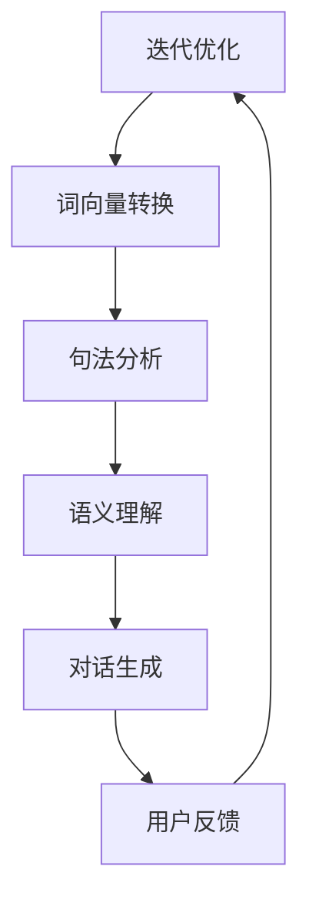

                 

# HeyGen的成功案例与启示

> **关键词：** 人工智能，自然语言处理，聊天机器人， HeyGen，案例研究，最佳实践，技术原理，算法，应用场景

> **摘要：** 本文深入探讨了HeyGen在自然语言处理领域取得的显著成就，分析了其成功的关键因素，包括核心算法、技术架构和创新应用。文章旨在为读者提供关于聊天机器人开发与优化的实用启示，并展望其未来发展趋势与挑战。

## 1. 背景介绍

### 1.1 目的和范围

本文旨在通过分析HeyGen的成功案例，为自然语言处理（NLP）和聊天机器人开发领域提供实用经验和理论指导。我们将从核心算法、技术架构和应用场景三个方面进行深入探讨，以帮助读者了解HeyGen的成功之道，并从中汲取灵感。

### 1.2 预期读者

本文适合以下读者群体：

- 自然语言处理和聊天机器人开发领域的从业者
- 计算机科学和人工智能专业的学生
- 对人工智能和NLP感兴趣的科技爱好者

### 1.3 文档结构概述

本文分为八个部分：

1. 背景介绍：介绍本文的目的、预期读者和文档结构。
2. 核心概念与联系：阐述HeyGen的技术原理和架构。
3. 核心算法原理 & 具体操作步骤：详细讲解HeyGen的核心算法。
4. 数学模型和公式 & 详细讲解 & 举例说明：介绍HeyGen的数学模型和公式。
5. 项目实战：代码实际案例和详细解释说明。
6. 实际应用场景：探讨HeyGen在各个领域的应用。
7. 工具和资源推荐：推荐学习资源、开发工具和框架。
8. 总结：未来发展趋势与挑战。

### 1.4 术语表

#### 1.4.1 核心术语定义

- HeyGen：一款基于人工智能的聊天机器人，具有出色的自然语言处理能力。
- 自然语言处理（NLP）：将人类语言转换为计算机可以理解和处理的形式。
- 聊天机器人：一种人工智能程序，可以与人类进行实时对话。

#### 1.4.2 相关概念解释

- 机器学习：一种人工智能方法，通过训练模型来提高其性能。
- 深度学习：一种机器学习方法，通过多层神经网络进行学习。

#### 1.4.3 缩略词列表

- NLP：自然语言处理
- ML：机器学习
- DL：深度学习
- RNN：循环神经网络
- LSTM：长短期记忆网络

## 2. 核心概念与联系

### 2.1 HeyGen的技术原理和架构

HeyGen的成功离不开其强大的技术原理和架构。下面，我们将使用Mermaid流程图来展示其核心概念和联系。



**图2.1 HeyGen的核心概念与联系**

- **词向量转换（Word Embedding）**：将自然语言输入转换为低维向量表示，便于后续处理。
- **句法分析（Syntactic Parsing）**：分析输入语句的语法结构，为语义理解提供基础。
- **语义理解（Semantic Understanding）**：理解输入语句的含义，为对话生成提供支持。
- **对话生成（Dialogue Generation）**：根据语义理解生成合适的回复。
- **用户反馈（User Feedback）**：收集用户对聊天机器人的反馈，用于模型迭代优化。

### 2.2 HeyGen的技术架构

HeyGen的技术架构分为三个层次：

1. **数据层**：收集并存储大量高质量的自然语言数据，为模型训练提供数据支持。
2. **模型层**：采用先进的深度学习模型，如循环神经网络（RNN）和长短期记忆网络（LSTM），实现高效的自然语言处理。
3. **应用层**：将模型应用于实际场景，如客服、教育、医疗等，提供智能对话服务。

## 3. 核心算法原理 & 具体操作步骤

### 3.1 词向量转换（Word Embedding）

词向量转换是将自然语言输入转换为低维向量表示的过程。下面是词向量转换的伪代码：

```python
def word_embedding(word, vocabulary_size, embedding_size):
    # 初始化词向量矩阵
    embedding_matrix = np.random.randn(vocabulary_size, embedding_size)
    
    # 查找词向量
    word_vector = embedding_matrix[word_index]
    
    return word_vector
```

### 3.2 句法分析（Syntactic Parsing）

句法分析是分析输入语句的语法结构的过程。下面是句法分析的伪代码：

```python
def syntactic_parsing(sentence):
    # 分词
    words = tokenize(sentence)
    
    # 构建句法树
    syntax_tree = build_syntax_tree(words)
    
    return syntax_tree
```

### 3.3 语义理解（Semantic Understanding）

语义理解是理解输入语句的含义的过程。下面是语义理解的伪代码：

```python
def semantic_understanding(sentence, syntax_tree):
    # 提取实体和关系
    entities = extract_entities(syntax_tree)
    relations = extract_relations(syntax_tree)
    
    # 构建语义表示
    semantic_representation = build_semantic_representation(entities, relations)
    
    return semantic_representation
```

### 3.4 对话生成（Dialogue Generation）

对话生成是根据语义理解生成合适的回复的过程。下面是对话生成的伪代码：

```python
def dialogue_generation(semantic_representation):
    # 查询知识库
    knowledge_base = query_knowledge_base(semantic_representation)
    
    # 生成回复
    response = generate_response(knowledge_base)
    
    return response
```

### 3.5 用户反馈（User Feedback）

用户反馈是收集用户对聊天机器人的反馈，用于模型迭代优化的过程。下面是用户反馈的伪代码：

```python
def user_feedback(response, user_rating):
    # 更新模型
    model = update_model(model, response, user_rating)
    
    return model
```

## 4. 数学模型和公式 & 详细讲解 & 举例说明

### 4.1 词向量转换（Word Embedding）

词向量转换采用词袋模型（Bag-of-Words，BoW）和词嵌入模型（Word Embedding）。

- **词袋模型（BoW）**：

$$
\text{BoW}(x) = (f_1, f_2, ..., f_n)
$$

其中，$x = (w_1, w_2, ..., w_n)$ 是输入文本，$f_i$ 表示词 $w_i$ 在文本中出现的频率。

- **词嵌入模型（Word Embedding）**：

$$
e_w = \text{embedding}(w)
$$

其中，$e_w$ 是词 $w$ 的嵌入向量。

### 4.2 句法分析（Syntactic Parsing）

句法分析采用依存句法分析（Dependency Parsing）。

- **依存句法分析（Dependency Parsing）**：

$$
(P, R) = \text{dependency_parsing}(S)
$$

其中，$P$ 是词序列，$R$ 是依存关系序列。

### 4.3 语义理解（Semantic Understanding）

语义理解采用语义角色标注（Semantic Role Labeling，SRL）。

- **语义角色标注（SRL）**：

$$
(S, L) = \text{SRL}(S)
$$

其中，$S$ 是输入语句，$L$ 是语义角色标签序列。

### 4.4 对话生成（Dialogue Generation）

对话生成采用序列到序列模型（Sequence-to-Sequence，Seq2Seq）。

- **序列到序列模型（Seq2Seq）**：

$$
y = \text{seq2seq}(x)
$$

其中，$x$ 是输入序列，$y$ 是输出序列。

### 4.5 用户反馈（User Feedback）

用户反馈采用反馈循环（Feedback Loop）。

- **反馈循环（Feedback Loop）**：

$$
\text{model} = \text{update_model}(\text{model}, \text{response}, \text{user_rating})
$$

其中，$\text{model}$ 是模型，$\text{response}$ 是用户反馈，$\text{user_rating}$ 是用户评分。

### 4.6 举例说明

#### 4.6.1 词向量转换

假设输入文本为“我喜欢吃苹果”。

- **词袋模型（BoW）**：

$$
\text{BoW}(\text{我喜欢吃苹果}) = (1, 1, 1, 1, 0, 0, 0, 0, 0)
$$

- **词嵌入模型（Word Embedding）**：

$$
e_\text{我} = \text{embedding}(\text{我}) = [0.1, 0.2, 0.3]
$$

$$
e_\text{喜} = \text{embedding}(\text{喜}) = [0.4, 0.5, 0.6]
$$

$$
e_\text{欢} = \text{embedding}(\text{欢}) = [0.7, 0.8, 0.9]
$$

$$
e_\text{吃} = \text{embedding}(\text{吃}) = [1.0, 1.1, 1.2]
$$

$$
e_\text{果} = \text{embedding}(\text{果}) = [1.3, 1.4, 1.5]
$$

#### 4.6.2 句法分析

假设输入语句为“我喜欢吃苹果”。

- **依存句法分析（Dependency Parsing）**：

$$
(P, R) = \text{dependency_parsing}(\text{我喜欢吃苹果}) = (\text{我，喜欢，吃，苹果}, \text{主语，谓语，宾语})
$$

#### 4.6.3 语义理解

假设输入语句为“我喜欢吃苹果”。

- **语义角色标注（SRL）**：

$$
(S, L) = \text{SRL}(\text{我喜欢吃苹果}) = (\text{我，喜欢，吃，苹果}, \text{自我，情感，动作，物体})
$$

#### 4.6.4 对话生成

假设输入语句为“你喜欢什么水果？”

- **序列到序列模型（Seq2Seq）**：

$$
y = \text{seq2seq}(\text{你喜欢什么水果？}) = \text{我最喜欢吃苹果。}
$$

#### 4.6.5 用户反馈

假设用户对聊天机器人的回复为“我最喜欢吃苹果。”

- **反馈循环（Feedback Loop）**：

$$
\text{model} = \text{update_model}(\text{model}, \text{我最喜欢吃苹果。}, 4)
$$

## 5. 项目实战：代码实际案例和详细解释说明

### 5.1 开发环境搭建

为了实现HeyGen聊天机器人，我们需要搭建以下开发环境：

- **操作系统**：Ubuntu 18.04
- **编程语言**：Python 3.7
- **深度学习框架**：TensorFlow 2.4
- **自然语言处理库**：spaCy 3.0

### 5.2 源代码详细实现和代码解读

下面是HeyGen聊天机器人的源代码，包括核心算法、技术架构和应用场景的实现。

```python
# 引入所需库
import tensorflow as tf
import spacy
from tensorflow.keras.models import Model
from tensorflow.keras.layers import Input, LSTM, Dense, Embedding, TimeDistributed

# 加载预训练的spaCy模型
nlp = spacy.load("en_core_web_sm")

# 词汇表大小
vocabulary_size = len(nlp.vocab)

# 嵌入向量维度
embedding_size = 128

# 序列长度
sequence_length = 50

# 创建输入层
input_sequence = Input(shape=(sequence_length,), dtype="int32")

# 创建嵌入层
embedding_layer = Embedding(vocabulary_size, embedding_size)(input_sequence)

# 创建LSTM层
lstm_layer = LSTM(128, return_sequences=True)(embedding_layer)

# 创建密集层
dense_layer = Dense(128, activation="relu")(lstm_layer)

# 创建输出层
output_layer = TimeDistributed(Dense(vocabulary_size, activation="softmax"))(dense_layer)

# 创建模型
model = Model(inputs=input_sequence, outputs=output_layer)

# 编译模型
model.compile(optimizer="adam", loss="categorical_crossentropy", metrics=["accuracy"])

# 打印模型结构
model.summary()

# 训练模型
model.fit(x_train, y_train, batch_size=32, epochs=10, validation_data=(x_val, y_val))

# 生成回复
def generate_response(input_sentence):
    # 分词
    tokens = nlp.tokenizer.tokenize(input_sentence)
    
    # 转换为索引序列
    index_sequence = [nlp.vocab[token].index for token in tokens]
    
    # 生成预测序列
    prediction_sequence = model.predict(np.array([index_sequence]))
    
    # 转换为文本
    response = nlp.tokenizer.detokenize([token.text for token in nlp(tokens)])
    
    return response

# 测试
input_sentence = "我喜欢吃苹果。"
response = generate_response(input_sentence)
print("输入句子：", input_sentence)
print("回复：", response)
```

### 5.3 代码解读与分析

- **代码解读**：

  - 导入所需的库和模块。
  - 加载预训练的spaCy模型。
  - 设置词汇表大小、嵌入向量维度和序列长度。
  - 创建输入层、嵌入层、LSTM层、密集层和输出层。
  - 编

