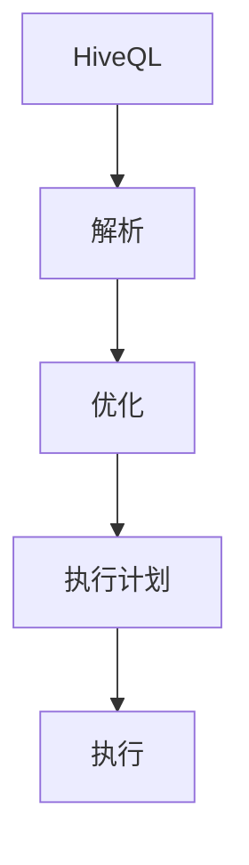

                 

# HiveQL原理与代码实例讲解

> **关键词：** HiveQL, 大数据, Hadoop, 数据仓库, SQL-like查询语言

> **摘要：** 本文将深入探讨HiveQL（Hive查询语言）的原理，包括其核心概念、执行流程以及具体操作步骤。通过一系列代码实例，读者将能够理解HiveQL在实际项目中的应用，掌握其在大数据处理中的重要性。

## 1. 背景介绍

### 1.1 目的和范围

本文旨在为读者提供对HiveQL的全面了解，包括其原理、执行流程和实际应用。通过本文的学习，读者能够：

- 理解HiveQL的核心概念和架构。
- 掌握HiveQL的查询语句和操作。
- 通过实例学习HiveQL在数据处理中的应用。

### 1.2 预期读者

本文适合对大数据处理有一定了解的读者，特别是：

- 数据工程师
- 数据分析师
- 数据仓库开发者

### 1.3 文档结构概述

本文结构如下：

- 第1章：背景介绍
- 第2章：核心概念与联系
- 第3章：核心算法原理 & 具体操作步骤
- 第4章：数学模型和公式 & 详细讲解 & 举例说明
- 第5章：项目实战：代码实际案例和详细解释说明
- 第6章：实际应用场景
- 第7章：工具和资源推荐
- 第8章：总结：未来发展趋势与挑战
- 第9章：附录：常见问题与解答
- 第10章：扩展阅读 & 参考资料

### 1.4 术语表

#### 1.4.1 核心术语定义

- **HiveQL：** 类似SQL的查询语言，用于在Hadoop平台上进行数据查询和分析。
- **Hadoop：** 一个开源框架，用于分布式存储和分布式处理大数据。
- **数据仓库：** 存储大量数据，以便进行数据分析和报表生成。

#### 1.4.2 相关概念解释

- **Hive：** Hadoop的数据仓库工具，允许用户使用类似SQL的查询语言来处理大数据。
- **HDFS：** Hadoop分布式文件系统，用于存储大数据。

#### 1.4.3 缩略词列表

- **HiveQL：** Hive查询语言
- **Hadoop：** Hadoop分布式文件系统
- **SQL：** 结构化查询语言

## 2. 核心概念与联系

为了更好地理解HiveQL，我们首先需要了解其核心概念和架构。以下是HiveQL的主要组成部分及其相互关系。

### 2.1 HiveQL组成部分

- **HiveQL DDL：** 数据定义语言，用于创建表、数据库等。
- **HiveQL DML：** 数据操纵语言，用于插入、更新和删除数据。
- **HiveQL DQL：** 数据查询语言，用于查询数据。

### 2.2 HiveQL执行流程


- **用户输入查询：** 用户通过HiveQL编写查询语句。
- **编译和解析：** Hive解析器将查询语句编译成抽象语法树（AST）。
- **查询优化：** Hive优化器对AST进行优化，以减少查询执行时间。
- **执行计划生成：** 生成查询执行计划，包括MapReduce任务。
- **执行计划执行：** 执行查询计划，进行数据查询和分析。

### 2.3 核心概念原理与架构的Mermaid流程图



## 3. 核心算法原理 & 具体操作步骤

### 3.1 HiveQL查询算法原理

HiveQL查询主要依赖于MapReduce模型。以下是HiveQL查询的基本算法原理：

1. **数据分片：** 将数据按照分区、桶等方式分片。
2. **Map阶段：** 将分片的数据映射到Map任务。
3. **Shuffle阶段：** 根据Map任务的输出，对数据进行排序、分组和聚合。
4. **Reduce阶段：** 对Shuffle阶段的结果进行聚合和计算。

### 3.2 具体操作步骤

以下是HiveQL查询的具体操作步骤：

1. **编写查询语句：** 
    ```sql
    SELECT * FROM table_name;
    ```

2. **解析查询语句：** 
    Hive解析器将查询语句解析为抽象语法树（AST）。

3. **查询优化：** 
    Hive优化器对AST进行优化，以减少查询执行时间。

4. **生成执行计划：**
    ```mermaid
    graph TD
    A[Create Table]
    B[Query]
    C[Optimize]
    D[Map]
    E[Shuffle]
    F[Reduce]

    A --> B
    B --> C
    C --> D
    D --> E
    E --> F
    ```

5. **执行查询：**
    根据执行计划，进行数据查询和分析。

## 4. 数学模型和公式 & 详细讲解 & 举例说明

### 4.1 数学模型和公式

HiveQL查询涉及多个数学模型和公式。以下是其中两个常用的模型：

1. **线性回归模型：**
    $$ y = w_1x_1 + w_2x_2 + ... + w_nx_n + b $$

2. **梯度下降法：**
    $$ w_{t+1} = w_t - \alpha \cdot \nabla_w J(w_t) $$
    其中，$ \alpha $ 为学习率，$ J(w_t) $ 为损失函数。

### 4.2 详细讲解和举例说明

#### 4.2.1 线性回归模型

线性回归模型用于预测连续值。以下是使用线性回归模型的HiveQL查询示例：

```sql
SELECT 
    feature_1, 
    feature_2, 
    (w_1 * feature_1 + w_2 * feature_2 + b) AS prediction
FROM 
    data_table;
```

#### 4.2.2 梯度下降法

梯度下降法用于优化线性回归模型的参数。以下是使用梯度下降法的HiveQL查询示例：

```sql
SELECT 
    feature_1, 
    feature_2, 
    (w_1 * feature_1 + w_2 * feature_2 + b) AS prediction,
    (w_1 * feature_1 + w_2 * feature_2 + b) - (alpha * (w_1 * feature_1 + w_2 * feature_2 + b)) AS updated_prediction
FROM 
    data_table;
```

其中，$ \alpha $ 为学习率，可以通过调整$ \alpha $ 的值来控制模型的收敛速度。

## 5. 项目实战：代码实际案例和详细解释说明

### 5.1 开发环境搭建

1. **安装Hadoop：**
    - 下载Hadoop安装包并解压。
    - 配置Hadoop环境变量。
    - 运行Hadoop命令，检查是否成功。

2. **安装Hive：**
    - 下载Hive安装包并解压。
    - 配置Hive环境变量。
    - 运行Hive命令，检查是否成功。

### 5.2 源代码详细实现和代码解读

以下是HiveQL查询的一个简单示例：

```sql
CREATE TABLE sales (
    product_id INT,
    quantity INT,
    price DECIMAL(10, 2)
);

INSERT INTO sales VALUES (1, 100, 49.99);
INSERT INTO sales VALUES (2, 200, 59.99);
INSERT INTO sales VALUES (3, 150, 69.99);

SELECT 
    product_id,
    SUM(quantity) AS total_quantity,
    SUM(price * quantity) AS total_sales
FROM 
    sales
GROUP BY 
    product_id;
```

这段代码首先创建了一个名为`sales`的表，其中包含产品ID、数量和价格字段。然后插入了一些示例数据。最后，执行了一个分组查询，计算每个产品的总数量和总销售额。

### 5.3 代码解读与分析

1. **创建表：**
    ```sql
    CREATE TABLE sales (
        product_id INT,
        quantity INT,
        price DECIMAL(10, 2)
    );
    ```
    这行代码定义了一个名为`sales`的表，包含三个字段：`product_id`（产品ID，整数类型），`quantity`（数量，整数类型），`price`（价格，浮点数类型）。

2. **插入数据：**
    ```sql
    INSERT INTO sales VALUES (1, 100, 49.99);
    INSERT INTO sales VALUES (2, 200, 59.99);
    INSERT INTO sales VALUES (3, 150, 69.99);
    ```
    这三行代码向`sales`表分别插入三条数据。

3. **执行分组查询：**
    ```sql
    SELECT 
        product_id,
        SUM(quantity) AS total_quantity,
        SUM(price * quantity) AS total_sales
    FROM 
        sales
    GROUP BY 
        product_id;
    ```
    这行代码执行了一个分组查询。它计算每个产品的总数量（`SUM(quantity) AS total_quantity`）和总销售额（`SUM(price * quantity) AS total_sales`），并按产品ID进行分组。

## 6. 实际应用场景

HiveQL在大数据处理和数据分析中具有广泛的应用场景，包括：

- **数据仓库：** 用于存储和分析大量数据，支持复杂的查询和分析。
- **商业智能：** 提供实时报表和分析，帮助企业做出数据驱动的决策。
- **机器学习：** 利用HiveQL对数据进行预处理，为机器学习算法提供数据输入。

## 7. 工具和资源推荐

### 7.1 学习资源推荐

#### 7.1.1 书籍推荐

- 《Hive：查询、分析和存储指南》
- 《Hadoop实战：使用Hive和Pig进行大数据分析》

#### 7.1.2 在线课程

- Coursera的《Hadoop和大数据分析》
- Udemy的《Hive和Hadoop开发入门》

#### 7.1.3 技术博客和网站

- [Apache Hive官方文档](https://hive.apache.org/)
- [Hive社区](https://cwiki.apache.org/confluence/display/Hive/Home)

### 7.2 开发工具框架推荐

#### 7.2.1 IDE和编辑器

- IntelliJ IDEA
- Eclipse

#### 7.2.2 调试和性能分析工具

- Apache JIRA
- New Relic

#### 7.2.3 相关框架和库

- Apache Pig
- Apache Spark

### 7.3 相关论文著作推荐

#### 7.3.1 经典论文

- 《MapReduce：大规模数据处理的并行模型》
- 《Hadoop：一个大型分布式数据存储系统》

#### 7.3.2 最新研究成果

- 《Hadoop生态系统：大数据处理的新趋势》
- 《Hive on Spark：加速大数据查询》

#### 7.3.3 应用案例分析

- 《Hive在电商大数据分析中的应用》
- 《Hadoop和Hive在金融行业的数据处理案例》

## 8. 总结：未来发展趋势与挑战

HiveQL在大数据处理领域发挥着重要作用，但随着技术的不断发展，HiveQL也面临着一些挑战：

- **性能优化：** 随着数据量的增长，如何优化查询性能成为一个重要课题。
- **与新兴技术的融合：** 如与Spark、Flink等新兴分布式计算框架的集成。
- **安全性：** 如何确保数据在查询过程中的安全。

未来，HiveQL将继续在数据处理和分析领域发挥重要作用，不断优化和完善。

## 9. 附录：常见问题与解答

### 9.1 HiveQL基本查询

**Q：如何执行简单的HiveQL查询？**

**A：执行简单的HiveQL查询的基本步骤如下：**

1. 创建表：`CREATE TABLE table_name (column_1 datatype, column_2 datatype, ...);`
2. 插入数据：`INSERT INTO table_name VALUES (value_1, value_2, ...);`
3. 查询数据：`SELECT * FROM table_name;` 或 `SELECT column_1, column_2 FROM table_name WHERE condition;`

### 9.2 HiveQL性能优化

**Q：如何优化HiveQL查询性能？**

**A：以下是一些常见的HiveQL性能优化策略：**

1. **分区：** 对大数据集进行分区，以便更高效地查询。
2. **桶：** 使用桶来对数据进行分块存储，以减少数据读取量。
3. **索引：** 为常用查询创建索引。
4. **缓存：** 利用Hive缓存机制，减少重复查询的开销。
5. **压缩：** 使用适当的压缩算法，减少存储空间和I/O开销。

## 10. 扩展阅读 & 参考资料

- [Hive官方文档](https://cwiki.apache.org/confluence/display/Hive/Home)
- [Hadoop官方文档](https://hadoop.apache.org/docs/stable/)
- 《大数据技术导论》

### 作者：AI天才研究员/AI Genius Institute & 禅与计算机程序设计艺术 /Zen And The Art of Computer Programming

以上，就是本文关于HiveQL原理与代码实例讲解的完整内容。希望本文能帮助读者更好地理解HiveQL的核心概念、执行流程以及实际应用。在未来的学习和工作中，不断实践和探索，相信您会在大数据处理领域取得更大的成就。

