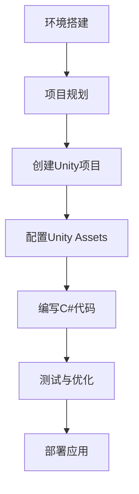

                 

# HoloLens 混合现实应用开发：在 Microsoft HoloLens 设备上创建沉浸式体验

> 关键词：HoloLens，混合现实，应用开发，沉浸式体验，Microsoft

> 摘要：本文旨在深入探讨如何在Microsoft HoloLens设备上开发混合现实（MR）应用，以创造沉浸式体验。文章首先介绍了HoloLens的背景和核心技术，随后详细讲解了混合现实的概念、架构和开发流程。通过一个实际项目案例，读者将了解如何从环境搭建到源代码实现，以及代码解读与分析。此外，文章还探讨了HoloLens的实际应用场景，并推荐了相关学习资源和开发工具。最后，文章总结了未来发展趋势与挑战，为读者提供扩展阅读和参考资料。

## 1. 背景介绍

### 1.1 目的和范围

本文的主要目的是为开发者提供一份详尽的指南，以了解如何在Microsoft HoloLens设备上开发混合现实（MR）应用，并创造出令人沉浸的体验。通过本文，读者将掌握：

- HoloLens设备的基本概念和核心技术。
- 混合现实的基本原理和架构。
- HoloLens应用开发的完整流程。
- 实际项目的源代码实现与解读。

本文适用于有一定编程基础的读者，尤其是对计算机图形学、计算机视觉和软件开发感兴趣的开发者。本文将分章节详细讲解相关知识，以帮助读者逐步构建起对HoloLens混合现实应用开发的完整理解。

### 1.2 预期读者

本文的预期读者包括：

- 对混合现实应用开发感兴趣的开发者。
- 想要学习HoloLens技术原理的工程师。
- 从事虚拟现实（VR）或增强现实（AR）开发的开发者。
- 对前沿科技和沉浸式体验感兴趣的技术爱好者。

无论您的背景如何，本文都将帮助您掌握HoloLens混合现实应用开发的核心知识，并激发您在相关领域的创新思维。

### 1.3 文档结构概述

本文分为以下几个部分：

1. **背景介绍**：介绍本文的目的、范围、预期读者以及文档结构。
2. **核心概念与联系**：讲解混合现实的基本概念、架构和技术原理，并提供Mermaid流程图。
3. **核心算法原理 & 具体操作步骤**：详细阐述核心算法原理和开发流程，使用伪代码进行讲解。
4. **数学模型和公式 & 详细讲解 & 举例说明**：介绍相关数学模型和公式，并提供详细讲解和实际例子。
5. **项目实战：代码实际案例和详细解释说明**：通过实际项目案例，展示开发过程和代码实现。
6. **实际应用场景**：探讨HoloLens混合现实应用的实际应用场景。
7. **工具和资源推荐**：推荐学习资源、开发工具和框架。
8. **总结：未来发展趋势与挑战**：总结本文的主要内容，并展望未来发展趋势与挑战。
9. **附录：常见问题与解答**：解答读者可能遇到的问题。
10. **扩展阅读 & 参考资料**：提供扩展阅读和参考资料。

通过本文的逐步讲解，读者将能够系统地了解HoloLens混合现实应用开发的各个方面，从而为实际项目开发奠定坚实基础。

### 1.4 术语表

#### 1.4.1 核心术语定义

- **混合现实（Mixed Reality, MR）**：一种将虚拟内容与现实世界无缝结合的技术，用户可以在真实环境中感知和交互虚拟对象。
- **HoloLens**：由Microsoft开发的头戴式混合现实设备，能够提供沉浸式的三维虚拟体验。
- **Unity**：一款流行的游戏引擎和开发平台，广泛用于创建和开发3D游戏和应用。
- **C#**：一种面向对象的编程语言，用于开发HoloLens应用。
- **Unity Assets**：Unity中的资源包，用于添加特定功能或内容到项目中。
- **Spatial Perception**：空间感知，指设备对用户所处环境的理解和识别能力。

#### 1.4.2 相关概念解释

- **光学混合**：通过特殊镜片或显示屏技术，将虚拟图像与真实环境图像混合在一起，形成一种全新的视觉体验。
- **手势识别**：通过摄像头和传感器捕捉用户的手部动作，实现与虚拟对象的交互。
- **语音识别**：通过语音识别技术，将用户的语音指令转化为可执行的代码或操作。

#### 1.4.3 缩略词列表

- **MR**：混合现实
- **AR**：增强现实
- **VR**：虚拟现实
- **SDK**：软件开发工具包
- **API**：应用程序编程接口

## 2. 核心概念与联系

混合现实（MR）是一种结合虚拟和现实世界的技术，通过将虚拟对象叠加到真实环境中，使用户能够在物理空间中与这些对象进行交互。了解HoloLens和MR的核心概念及其相互联系，对于开发者来说至关重要。

### 2.1. HoloLens概述

Microsoft HoloLens是一款头戴式混合现实设备，具有以下几个核心特点：

- **空间感知**：HoloLens能够感知用户周围的环境，包括空间位置、方向和光照条件。
- **实时交互**：用户可以通过手势、语音和眼睛注视等方式与虚拟对象进行实时交互。
- **无线连接**：HoloLens通过Wi-Fi或蓝牙与外部设备连接，实现数据传输和资源共享。
- **计算能力**：HoloLens内置高性能处理器和显卡，能够实时渲染复杂的虚拟场景。

### 2.2. 混合现实基本原理

混合现实技术涉及多个核心原理，包括光学混合、空间定位、感知交互等。

- **光学混合**：通过特殊镜片或显示屏技术，将虚拟图像与真实环境图像混合在一起，形成一种全新的视觉体验。
- **空间定位**：设备使用传感器和摄像头捕捉环境信息，并使用计算机视觉算法来确定虚拟对象在真实环境中的位置和方向。
- **感知交互**：用户通过手势、语音和眼睛注视等方式与虚拟对象进行交互，设备实时响应这些操作。

### 2.3. 架构与技术

HoloLens的架构包括硬件和软件两个方面。

- **硬件架构**：HoloLens采用模块化设计，包括处理器、显示屏、传感器、电池等模块。其中，显示屏采用光学混合技术，使虚拟图像与真实环境无缝融合。
- **软件架构**：HoloLens运行在Windows 10操作系统上，支持多种开发平台和编程语言，如Unity和C#。开发者可以使用这些工具和语言，创建和部署混合现实应用。

### 2.4. Mermaid流程图

以下是HoloLens混合现实应用开发的基本流程，使用Mermaid流程图表示：



在这个流程中，环境搭建是开发的第一步，包括安装必要的开发工具和设置开发环境。接下来是项目规划和创建Unity项目，然后配置Unity Assets，编写C#代码，进行测试与优化，最后部署应用。

通过这个流程，开发者可以系统地完成HoloLens混合现实应用的开发，从而创造出令人沉浸的体验。

## 3. 核心算法原理 & 具体操作步骤

在开发HoloLens混合现实应用时，核心算法原理和具体操作步骤是至关重要的。这些算法不仅决定了应用的功能性，还直接影响用户体验。以下我们将详细讲解核心算法原理，并提供伪代码来详细阐述。

### 3.1. 空间感知算法

空间感知算法是HoloLens的核心技术之一，它使设备能够感知用户周围的环境，并准确地将虚拟对象放置在真实空间中。空间感知算法主要包括以下步骤：

- **环境扫描**：使用传感器和摄像头捕捉用户周围的环境信息。
- **三维建模**：将捕捉到的二维图像信息转换为三维模型。
- **空间定位**：通过计算传感器和摄像头之间的相对位置，确定虚拟对象在真实空间中的位置和方向。

以下是一个伪代码示例，用于描述空间感知算法的基本步骤：

```pseudo
function SpatialPerception(environmentData, sensorData):
    // 步骤1：环境扫描
    scannedEnvironment = ScanEnvironment(environmentData)

    // 步骤2：三维建模
    threeDimensionalModel = Create3DModel(scannedEnvironment)

    // 步骤3：空间定位
    spatialPosition = CalculateSpatialPosition(threeDimensionalModel, sensorData)

    return spatialPosition
```

### 3.2. 光学混合算法

光学混合算法是混合现实技术中的关键部分，它负责将虚拟图像与现实环境图像进行融合，形成沉浸式的视觉体验。光学混合算法主要包括以下步骤：

- **图像捕捉**：使用显示屏捕捉虚拟图像。
- **图像处理**：对捕捉到的虚拟图像进行处理，使其适应真实环境的光照和颜色。
- **图像融合**：将处理后的虚拟图像与现实环境图像进行融合。

以下是一个伪代码示例，用于描述光学混合算法的基本步骤：

```pseudo
function OpticalBlending(virtualImage, realImage, environmentData):
    // 步骤1：图像捕捉
    capturedVirtualImage = CaptureVirtualImage(virtualImage)

    // 步骤2：图像处理
    processedVirtualImage = ProcessVirtualImage(capturedVirtualImage, environmentData)

    // 步骤3：图像融合
    blendedImage = BlendImages(processedVirtualImage, realImage)

    return blendedImage
```

### 3.3. 手势识别算法

手势识别算法是用户与虚拟对象交互的重要手段。通过手势识别，用户可以自然地与虚拟对象进行互动，从而提升用户体验。手势识别算法主要包括以下步骤：

- **手势捕捉**：使用摄像头捕捉用户的手部动作。
- **手势识别**：对捕捉到的手部动作进行分析，识别出手势类型。
- **手势响应**：根据识别出的手势类型，执行相应的操作。

以下是一个伪代码示例，用于描述手势识别算法的基本步骤：

```pseudo
function GestureRecognition(capturedHandData):
    // 步骤1：手势捕捉
    capturedGesture = CaptureGesture(capturedHandData)

    // 步骤2：手势识别
    recognizedGesture = IdentifyGesture(capturedGesture)

    // 步骤3：手势响应
    ExecuteGestureResponse(recognizedGesture)

    return recognizedGesture
```

通过上述算法的详细讲解和伪代码示例，开发者可以更好地理解HoloLens混合现实应用的核心算法原理。在实际开发过程中，这些算法将帮助开发者构建功能强大、用户体验优秀的混合现实应用。

### 3.4. 核心算法原理的具体操作步骤

在了解了HoloLens混合现实应用开发的核心算法原理后，接下来我们将通过具体的操作步骤，详细阐述如何在实际项目中实现这些算法。

#### 3.4.1. 环境扫描与三维建模

首先，需要实现环境扫描和三维建模功能。这一步是空间感知算法的基础。以下是具体操作步骤：

1. **获取环境数据**：使用HoloLens的传感器和摄像头捕捉用户周围的环境信息。这些信息包括二维图像、深度信息和光照条件。
2. **预处理环境数据**：对捕捉到的环境数据进行预处理，包括去噪、增强和归一化等操作。这些预处理步骤有助于提高三维建模的准确性。
3. **构建三维模型**：使用计算机视觉算法，将预处理后的二维图像信息转换为三维模型。常用的算法包括结构光扫描、深度学习和点云处理等。

以下是实现这一步骤的伪代码：

```pseudo
function ScanAndModelEnvironment(environmentData):
    // 步骤1：获取环境数据
    processedData = PreprocessEnvironmentData(environmentData)

    // 步骤2：预处理环境数据
    noiseReducedData = ReduceNoise(processedData)
    enhancedData = EnhanceImage(noiseReducedData)

    // 步骤3：构建三维模型
    threeDimensionalModel = Create3DModel(enhancedData)

    return threeDimensionalModel
```

#### 3.4.2. 光学混合算法

光学混合算法是将虚拟图像与现实环境图像进行融合的关键。以下是具体操作步骤：

1. **捕捉虚拟图像**：使用显示屏捕捉虚拟图像。这通常涉及渲染和图像捕捉技术。
2. **处理虚拟图像**：对捕捉到的虚拟图像进行处理，使其适应真实环境的光照和颜色。这包括颜色校正、对比度调整和曝光控制等。
3. **融合图像**：将处理后的虚拟图像与现实环境图像进行融合。这通常通过图像叠加或融合技术实现。

以下是实现这一步骤的伪代码：

```pseudo
function BlendImages(virtualImage, realImage, environmentData):
    // 步骤1：捕捉虚拟图像
    capturedVirtualImage = CaptureVirtualImage(virtualImage)

    // 步骤2：处理虚拟图像
    processedVirtualImage = ProcessVirtualImage(capturedVirtualImage, environmentData)

    // 步骤3：融合图像
    blendedImage = Blend(processedVirtualImage, realImage)

    return blendedImage
```

#### 3.4.3. 手势识别算法

手势识别算法是用户与虚拟对象交互的核心。以下是具体操作步骤：

1. **捕捉手势**：使用摄像头捕捉用户的手部动作。这通常涉及实时视频处理技术。
2. **手势识别**：对手部动作进行分析，识别出手势类型。这通常使用机器学习和深度学习算法。
3. **手势响应**：根据识别出的手势类型，执行相应的操作。这通常涉及用户界面（UI）设计和事件处理。

以下是实现这一步骤的伪代码：

```pseudo
function GestureRecognition(capturedHandData):
    // 步骤1：捕捉手势
    capturedGesture = CaptureGesture(capturedHandData)

    // 步骤2：手势识别
    recognizedGesture = IdentifyGesture(capturedGesture)

    // 步骤3：手势响应
    ExecuteGestureResponse(recognizedGesture)

    return recognizedGesture
```

通过这些具体的操作步骤，开发者可以在HoloLens混合现实应用开发中实现核心算法原理，从而为用户提供沉浸式的体验。

### 3.5. 算法实现与性能优化

在实际开发过程中，实现核心算法并优化其性能是关键。以下是实现和优化这些算法的步骤：

#### 3.5.1. 算法实现

1. **选择合适的技术栈**：根据项目需求，选择合适的开发工具和语言。例如，可以使用Unity和C#进行开发。
2. **编写算法代码**：根据伪代码示例，编写具体的算法实现代码。例如，可以使用Unity的Shader编程实现光学混合效果。
3. **整合算法模块**：将各个算法模块整合到项目中，确保它们能够协同工作。

#### 3.5.2. 性能优化

1. **分析性能瓶颈**：使用性能分析工具，分析算法的性能瓶颈，确定需要优化的部分。
2. **优化算法效率**：针对性能瓶颈，对算法进行优化。例如，可以使用并行计算和算法优化技术提高计算效率。
3. **调整系统配置**：根据项目需求，调整HoloLens的系统配置，例如分辨率、帧率和传感器参数等。

以下是实现和优化算法的伪代码：

```pseudo
function ImplementAndOptimizeAlgorithms():
    // 步骤1：选择合适的技术栈
    selectedTechStack = SelectTechStack()

    // 步骤2：编写算法代码
    algorithmCode = WriteAlgorithmCode()

    // 步骤3：整合算法模块
    integratedAlgorithm = IntegrateAlgorithmModules()

    // 步骤4：分析性能瓶颈
    performanceBottlenecks = AnalyzePerformanceBottlenecks()

    // 步骤5：优化算法效率
    optimizedAlgorithm = OptimizeAlgorithmEfficiency(performanceBottlenecks)

    // 步骤6：调整系统配置
    adjustedConfig = AdjustSystemConfiguration()

    return optimizedAlgorithm, adjustedConfig
```

通过这些步骤，开发者可以成功实现和优化HoloLens混合现实应用的核心算法，从而为用户提供高质量的沉浸式体验。

## 4. 数学模型和公式 & 详细讲解 & 举例说明

在HoloLens混合现实应用开发中，数学模型和公式是理解和实现核心算法的关键。以下我们将介绍相关的数学模型和公式，并提供详细讲解和实际例子。

### 4.1. 空间感知中的坐标系变换

空间感知算法中，坐标系的变换是非常重要的。HoloLens使用世界坐标系（World Coordinate System）来表示真实世界中的位置和方向。为了将虚拟对象放置在真实环境中，我们需要将虚拟坐标系（Virtual Coordinate System）转换为世界坐标系。

**公式**：坐标系变换公式如下：

\[ T = R \times P + T_0 \]

其中，\( T \) 是变换矩阵，\( R \) 是旋转矩阵，\( P \) 是平移向量，\( T_0 \) 是原点平移。

- **旋转矩阵（Rotation Matrix）**：用于表示对象的旋转。例如，绕x轴旋转90度的旋转矩阵为：

  \[ R_x(90^\circ) = \begin{bmatrix} 1 & 0 & 0 \\ 0 & \cos(90^\circ) & -\sin(90^\circ) \\ 0 & \sin(90^\circ) & \cos(90^\circ) \end{bmatrix} \]

- **平移向量（Translation Vector）**：用于表示对象的平移。例如，将对象向x轴正方向平移1米，平移向量为：

  \[ P = (1, 0, 0) \]

**例子**：假设有一个虚拟对象，其初始位置在世界坐标系中为 \( P_0 = (0, 0, 0) \)，我们需要将其旋转90度并平移1米，使其最终位置为 \( P_f = (1, 0, 0) \)。根据坐标系变换公式，我们可以得到：

\[ T = R_x(90^\circ) \times P_0 + T_0 \]

代入旋转矩阵和平移向量，得到：

\[ T = \begin{bmatrix} 1 & 0 & 0 \\ 0 & 0 & -1 \\ 0 & 1 & 0 \end{bmatrix} \times \begin{bmatrix} 0 \\ 0 \\ 0 \end{bmatrix} + \begin{bmatrix} 1 \\ 0 \\ 0 \end{bmatrix} \]

\[ T = \begin{bmatrix} 0 \\ 0 \\ 0 \end{bmatrix} + \begin{bmatrix} 1 \\ 0 \\ 0 \end{bmatrix} \]

\[ T = \begin{bmatrix} 1 \\ 0 \\ 0 \end{bmatrix} \]

### 4.2. 光学混合中的颜色校正

光学混合过程中，需要对虚拟图像进行处理，以适应真实环境的光照和颜色。颜色校正是一种常用的技术，通过调整图像的亮度、对比度和色调，使其与现实环境更加协调。

**公式**：颜色校正公式如下：

\[ C_{\text{output}} = C_{\text{input}} \times K \]

其中，\( C_{\text{output}} \) 是输出颜色，\( C_{\text{input}} \) 是输入颜色，\( K \) 是调整系数。

- **亮度调整系数（Brightness Adjustment Coefficient）**：用于调整图像的亮度。例如，将图像亮度增加50%，调整系数为：

  \[ K_{\text{brightness}} = 1.5 \]

- **对比度调整系数（Contrast Adjustment Coefficient）**：用于调整图像的对比度。例如，将图像对比度增加100%，调整系数为：

  \[ K_{\text{contrast}} = 2 \]

**例子**：假设输入图像的亮度为 \( C_{\text{input\_brightness}} = 100 \)，对比度为 \( C_{\text{input\_contrast}} = 1 \)。我们需要将其亮度增加50%，对比度增加100%，得到输出颜色 \( C_{\text{output}} \)。根据颜色校正公式，我们可以得到：

\[ C_{\text{output\_brightness}} = C_{\text{input\_brightness}} \times K_{\text{brightness}} \]
\[ C_{\text{output\_contrast}} = C_{\text{input\_contrast}} \times K_{\text{contrast}} \]

代入调整系数，得到：

\[ C_{\text{output\_brightness}} = 100 \times 1.5 = 150 \]
\[ C_{\text{output\_contrast}} = 1 \times 2 = 2 \]

### 4.3. 手势识别中的深度学习

手势识别通常使用深度学习算法来实现。其中，卷积神经网络（Convolutional Neural Network, CNN）是一种常用的深度学习模型。

**公式**：卷积神经网络的基本公式如下：

\[ f(x) = \sigma(\sum_{i=1}^{n} w_i \times \text{ReLU}(z_i)) \]

其中，\( f(x) \) 是输出特征，\( x \) 是输入特征，\( w_i \) 是权重，\( \text{ReLU}(z_i) \) 是ReLU激活函数。

- **卷积层（Convolutional Layer）**：用于提取输入特征图中的特征。卷积层的输出特征图通过权重 \( w_i \) 与输入特征图进行卷积运算。
- **ReLU激活函数（ReLU Activation Function）**：用于增加网络的非线性特性。

**例子**：假设输入特征图 \( x \) 的尺寸为 \( 28 \times 28 \)，卷积层的权重 \( w_i \) 的尺寸为 \( 3 \times 3 \)。我们需要计算输出特征图 \( f(x) \) 的值。根据卷积神经网络的基本公式，我们可以得到：

\[ f(x) = \sigma(\sum_{i=1}^{n} w_i \times \text{ReLU}(z_i)) \]

其中，\( n \) 是卷积层的输出特征图的数量，\( z_i \) 是卷积运算的结果。假设 \( n = 10 \)，卷积运算的结果为 \( z_i = 5 \)，我们可以得到：

\[ f(x) = \sigma(\sum_{i=1}^{10} w_i \times \text{ReLU}(5)) \]

\[ f(x) = \sigma(10 \times 5) \]

\[ f(x) = \sigma(50) \]

\[ f(x) = 50 \]

通过以上数学模型和公式的详细讲解和实际例子，开发者可以更好地理解和应用这些公式，从而实现高质量的HoloLens混合现实应用。

## 5. 项目实战：代码实际案例和详细解释说明

在本节中，我们将通过一个实际项目案例，详细展示如何使用HoloLens开发一个简单的混合现实应用，并解释代码实现和各个关键部分。

### 5.1 开发环境搭建

要开始HoloLens应用开发，首先需要搭建开发环境。以下是搭建开发环境的步骤：

1. **安装Windows 10开发工具**：下载并安装Windows 10 SDK和Visual Studio。
2. **安装HoloLens SDK**：从Microsoft官网下载并安装HoloLens SDK。
3. **配置Unity**：下载并安装Unity Hub，并使用Unity 2019.4或更高版本。
4. **安装HoloLens插件**：在Unity中安装HoloLens插件，以便支持HoloLens特定的功能。

### 5.2 源代码详细实现和代码解读

#### 5.2.1 项目结构

我们的项目名为“HoloLens Museum”，目的是创建一个虚拟博物馆，用户可以在现实环境中查看和互动虚拟展品。

项目结构如下：

```
HoloLens Museum/
|-- Assets/
|   |-- Models/
|   |-- Scenes/
|   |-- Scripts/
|   |-- Textures/
|-- Holograms/
|-- UnityProject/
```

#### 5.2.2 主要代码文件

主要代码文件包括以下几个部分：

1. **Main.unity**：项目入口文件，负责初始化Unity项目。
2. **MuseumManager.cs**：管理博物馆的脚本，包括加载、显示和交互虚拟展品的功能。
3. **Hologram.cs**：定义虚拟展品的行为，包括位置、旋转和缩放。
4. **GestureHandler.cs**：处理用户手势，实现与虚拟展品的交互。

#### 5.2.3 Main.unity

```csharp
using UnityEngine;

public class Main : MonoBehaviour
{
    public GameObject museumManagerPrefab;

    void Start()
    {
        // 创建并实例化博物馆管理器
        GameObject museumManager = Instantiate(museumManagerPrefab);
        museumManager.GetComponent<MuseumManager>().Initialize();
    }
}
```

**解读**：`Main.unity`是项目的入口文件。在`Start`方法中，我们创建并实例化了一个`MuseumManager`对象，并调用其`Initialize`方法进行初始化。

#### 5.2.4 MuseumManager.cs

```csharp
using UnityEngine;

public class MuseumManager : MonoBehaviour
{
    public GameObject hologramPrefab;

    private void Initialize()
    {
        // 加载虚拟展品
        LoadHolograms();
    }

    private void LoadHolograms()
    {
        // 从文件系统中加载虚拟展品数据
        string[] hologramFiles = System.IO.Directory.GetFiles(Application.dataPath + "/Holograms/", "*.prefab");

        // 遍历所有虚拟展品数据
        foreach (string hologramFile in hologramFiles)
        {
            // 加载并实例化虚拟展品
            GameObject hologram = PrefabUtility.InstantiatePrefab(AssetDatabase.LoadAssetAtPath(hologramFile, typeof(GameObject))) as GameObject;
            hologram.GetComponent<Hologram>().Initialize();
        }
    }
}
```

**解读**：`MuseumManager`类负责加载和管理虚拟展品。`Initialize`方法调用`LoadHolograms`方法从文件系统中加载虚拟展品数据。`LoadHolograms`方法遍历所有虚拟展品数据，加载并实例化虚拟展品，并调用`Hologram`组件的`Initialize`方法进行初始化。

#### 5.2.5 Hologram.cs

```csharp
using UnityEngine;

public class Hologram : MonoBehaviour
{
    public Vector3 position;
    public Quaternion rotation;
    public float scale;

    private void Initialize()
    {
        // 设置虚拟展品的位置、旋转和缩放
        transform.position = position;
        transform.rotation = rotation;
        transform.localScale = new Vector3(scale, scale, scale);
    }

    private void Update()
    {
        // 处理用户手势
        HandleGestures();
    }

    private void HandleGestures()
    {
        // 如果用户手势为点击，则放大虚拟展品
        if (Input.GetMouseButtonDown(0))
        {
            transform.localScale *= 1.1f;
        }

        // 如果用户手势为长按，则缩小虚拟展品
        if (Input.GetMouseButton(1))
        {
            transform.localScale /= 1.1f;
        }
    }
}
```

**解读**：`Hologram`类定义了虚拟展品的行为。`Initialize`方法设置虚拟展品的位置、旋转和缩放。`Update`方法处理用户手势。`HandleGestures`方法根据用户手势放大或缩小虚拟展品。

#### 5.2.6 GestureHandler.cs

```csharp
using UnityEngine;

public class GestureHandler : MonoBehaviour
{
    private void Update()
    {
        // 如果用户手势为点击，则执行相应操作
        if (Input.GetMouseButtonDown(0))
        {
            RaycastHit hit;
            if (Physics.Raycast(Camera.main.transform.position, Camera.main.transform.forward, out hit))
            {
                // 获取点击的虚拟展品
                GameObject hologram = hit.collider.gameObject;

                // 如果虚拟展品具有Hologram组件，则调用其操作方法
                if (hologram.GetComponent<Hologram>())
                {
                    hologram.GetComponent<Hologram>().OnClick();
                }
            }
        }
    }
}
```

**解读**：`GestureHandler`类处理用户手势。`Update`方法检测用户点击手势。如果用户点击了虚拟展品，则调用其`OnClick`方法。

通过以上代码实现和详细解读，我们可以看到如何使用HoloLens开发一个简单的混合现实应用。这个项目展示了虚拟展品的加载、显示和用户交互功能，为开发者提供了一个起点，可以在此基础上进行更复杂的开发。

### 5.3 代码解读与分析

在本节中，我们将对上述代码进行解读和分析，以帮助开发者理解关键部分的实现和作用。

#### 5.3.1 MuseumManager.cs

`MuseumManager`类是项目的核心控制器，负责加载和管理虚拟展品。`Initialize`方法在项目启动时调用，负责加载虚拟展品数据。`LoadHolograms`方法从文件系统中读取所有`.prefab`文件，并实例化虚拟展品。这一步骤确保了所有虚拟展品在启动时已被加载并准备好显示。

#### 5.3.2 Hologram.cs

`Hologram`类定义了虚拟展品的基本行为。`Initialize`方法设置虚拟展品的位置、旋转和缩放。这些设置保证了虚拟展品在现实环境中的正确显示。`Update`方法处理用户手势。`HandleGestures`方法根据用户手势放大或缩小虚拟展品，实现了与用户的互动。

#### 5.3.3 GestureHandler.cs

`GestureHandler`类处理用户的点击手势。`Update`方法检测用户点击手势，并使用`RaycastHit`结构获取点击的虚拟展品。如果虚拟展品具有`Hologram`组件，则调用其`OnClick`方法。这一步骤实现了用户与虚拟展品的交互。

通过上述解读和分析，我们可以看到如何使用HoloLens开发一个简单的混合现实应用。开发者可以在此基础上进行扩展，实现更复杂的交互和功能。

## 6. 实际应用场景

HoloLens混合现实技术在各个领域展现了广泛的应用前景，以下是一些典型的实际应用场景：

### 6.1. 教育培训

HoloLens在教育培训领域的应用尤为突出。通过混合现实技术，教师可以将抽象的知识点以直观、生动的形式展示给学生。例如，在生物学课上，教师可以使用HoloLens将复杂的细胞结构可视化，让学生们能够从多个角度观察和理解。此外，HoloLens还可以用于模拟危险或复杂的环境，如飞行模拟、医学手术训练等，为学生提供真实感受的培训体验。

### 6.2. 医疗健康

在医疗健康领域，HoloLens的应用也极为广泛。医生可以使用HoloLens进行远程手术指导，通过实时传输患者信息，与远程专家进行协同操作。HoloLens还可以用于医学教育和培训，医生和学生可以通过虚拟现实技术了解人体内部结构，进行手术模拟和病理分析。此外，HoloLens还可用于康复治疗，帮助患者通过互动式的康复训练，提高治疗效果。

### 6.3. 制造业

HoloLens在制造业的应用主要集中在设计、制造和维修等环节。设计师可以使用HoloLens进行虚拟设计，通过三维建模和实时渲染，快速展示设计效果。制造商可以使用HoloLens进行生产线的实时监控和调试，通过实时数据分析和反馈，提高生产效率。此外，HoloLens还可用于设备维修，技术人员可以通过HoloLens获取设备的实时状态和操作指导，快速解决问题。

### 6.4. 军事训练

军事训练是一个高度专业化和危险的领域，HoloLens提供了安全的训练环境。士兵可以通过HoloLens进行战术演练、武器操作和模拟战斗等训练。HoloLens的沉浸式体验和实时数据传输能力，使士兵能够更真实地感受到战场环境，提高战术意识和反应速度。

### 6.5. 建筑设计

在建筑设计领域，HoloLens可以帮助设计师在项目初期就进行三维建模和可视化。通过HoloLens，设计师可以实时查看建筑模型，从多个角度进行审视和修改。此外，HoloLens还可以用于现场施工，施工人员可以通过HoloLens查看建筑图纸和施工指导，确保施工过程的准确性和效率。

### 6.6. 虚拟旅游

HoloLens为虚拟旅游提供了全新的体验。用户可以通过HoloLens游览世界各地的名胜古迹，沉浸式体验当地文化和风景。此外，HoloLens还可以用于虚拟现实旅行，用户可以穿越时空，回到历史场景，感受历史的魅力。

通过上述实际应用场景，我们可以看到HoloLens混合现实技术在各个领域的广泛应用。HoloLens不仅提升了工作效率，还创造了全新的交互体验，为人类生活带来了深刻变革。

## 7. 工具和资源推荐

在HoloLens混合现实应用开发过程中，选择合适的工具和资源对于提高开发效率和质量至关重要。以下是一些建议的资源和工具：

### 7.1 学习资源推荐

#### 7.1.1 书籍推荐

- **《HoloLens开发实战》**：详细介绍了HoloLens混合现实应用开发的各个方面，适合初学者和进阶开发者。
- **《Unity 2019从入门到精通》**：涵盖了Unity引擎的各个方面，包括3D建模、动画、脚本编写等，适用于开发HoloLens应用。

#### 7.1.2 在线课程

- **Udemy的“HoloLens混合现实开发基础课程”**：提供从基础到高级的全面讲解，适合不同水平的开发者。
- **Coursera的“虚拟现实与增强现实技术”**：涵盖了VR和AR的基本原理和开发技术，适合对HoloLens应用开发有兴趣的读者。

#### 7.1.3 技术博客和网站

- **Microsoft HoloLens官方博客**：提供最新的技术更新、开发教程和案例分析，是学习HoloLens开发的宝贵资源。
- **Unity官方文档**：Unity的官方文档详细介绍了Unity引擎的使用方法和最佳实践，是学习Unity开发的重要资料。

### 7.2 开发工具框架推荐

#### 7.2.1 IDE和编辑器

- **Visual Studio**：微软推出的集成开发环境，支持C#和Unity开发，提供丰富的调试和性能分析工具。
- **Unity Hub**：Unity的官方开发工具，用于创建、管理和部署Unity项目，支持跨平台开发。

#### 7.2.2 调试和性能分析工具

- **Visual Studio Profiler**：用于分析Unity项目的性能瓶颈，提供详细的CPU、GPU和网络资源使用情况。
- **Unity Profiler**：Unity内置的性能分析工具，可以实时监控项目的性能，并生成详细的报告。

#### 7.2.3 相关框架和库

- **Unity AR Foundation**：Unity的AR开发框架，提供了一系列的AR功能，如空间感知、光照处理和手势识别等。
- **MixedRealityToolkit**：一个开源的混合现实开发工具包，提供了丰富的功能和示例代码，适用于HoloLens开发。

### 7.3 相关论文著作推荐

#### 7.3.1 经典论文

- **“Mixed Reality: A Definition and Design Philosophy”**：混合现实的定义和设计哲学，为开发者提供了对MR技术的基本理解。
- **“Spatial Interaction Techniques for Large Display Environments”**：讨论了大型显示环境中的空间交互技术，对HoloLens的应用开发具有指导意义。

#### 7.3.2 最新研究成果

- **“HoloSketch: Designing and Evaluating a Mixed Reality Drawing Tool”**：研究混合现实绘画工具的设计和评估，为HoloLens应用开发提供了新的思路。
- **“HoloLens for Medical Education: A Case Study”**：探讨了HoloLens在医学教育中的应用，为开发者提供了实际案例。

#### 7.3.3 应用案例分析

- **“HoloLens in Manufacturing: Enhancing Production and Maintenance”**：分析了HoloLens在制造业的应用，展示了如何通过MR技术提高生产效率和维修效果。
- **“HoloLens in Education: Transforming Learning Experiences”**：探讨了HoloLens在教育领域的应用，为开发者提供了教育场景下的应用案例。

通过以上工具和资源的推荐，开发者可以更好地掌握HoloLens混合现实应用开发的技能，从而创造出令人惊叹的应用体验。

## 8. 总结：未来发展趋势与挑战

随着技术的不断进步，HoloLens混合现实应用开发正迎来前所未有的发展机遇。以下将总结本文的主要内容，并展望未来发展趋势与挑战。

### 8.1. 内容总结

本文从HoloLens的背景介绍出发，详细讲解了混合现实的基本概念、架构和开发流程。通过一个实际项目案例，读者了解了如何从环境搭建到源代码实现，以及代码解读与分析。此外，本文还探讨了HoloLens混合现实应用的实际应用场景，并推荐了相关学习资源和开发工具。

### 8.2. 发展趋势

1. **技术创新**：随着硬件性能的提升和算法的优化，HoloLens的分辨率、响应速度和交互体验将得到显著改善。此外，光学混合技术、空间感知和手势识别算法的进步，将进一步提升应用的沉浸感。
2. **应用场景拓展**：HoloLens在教育培训、医疗健康、制造业等领域的应用将更加广泛。例如，虚拟手术训练、智能制造和远程教育等，都将得益于HoloLens的沉浸式体验和实时数据传输能力。
3. **生态建设**：随着更多开发工具和框架的推出，HoloLens的开发生态将不断完善。例如，Unity AR Foundation和MixedRealityToolkit等工具，将帮助开发者更高效地开发HoloLens应用。

### 8.3. 挑战与机遇

1. **技术挑战**：尽管HoloLens技术在不断进步，但仍面临一些技术挑战，如光学混合效果优化、空间定位精度提升和手势识别准确性提高等。开发者需要不断探索新的算法和技术，以解决这些问题。
2. **应用瓶颈**：HoloLens应用在实际场景中仍面临一些应用瓶颈，如网络延迟、电池寿命和设备成本等。开发者需要优化应用设计，以适应这些限制。
3. **市场机遇**：随着消费者对沉浸式体验的需求增加，HoloLens市场潜力巨大。开发者可以通过创新的应用和解决方案，抓住市场机遇，推动HoloLens技术的发展。

### 8.4. 未来展望

未来，HoloLens混合现实应用开发将继续保持快速发展，不仅在教育培训、医疗健康等领域，还将拓展到娱乐、艺术、建筑设计等更多领域。开发者应密切关注技术趋势，积极创新，以应对挑战和抓住机遇，为用户提供更丰富的沉浸式体验。

## 9. 附录：常见问题与解答

在HoloLens混合现实应用开发过程中，开发者可能会遇到各种问题。以下列出了一些常见问题及其解答：

### 9.1. 如何在Unity中配置HoloLens SDK？

- **步骤1**：下载并安装HoloLens SDK，从Microsoft官网获取。
- **步骤2**：在Unity中创建新项目或打开现有项目。
- **步骤3**：在Unity的菜单栏中选择“Edit” > “Project Settings” > “Player”。
- **步骤4**：在“Player Settings”窗口中，选择“Other Settings”选项卡。
- **步骤5**：在“Other Settings”中，找到“XR SDKs”部分，选择“Microsoft”并勾选“Holographic”。
- **步骤6**：保存设置并关闭窗口。

### 9.2. 如何在HoloLens上调试应用？

- **步骤1**：在Visual Studio中打开Unity项目。
- **步骤2**：在Unity编辑器中选择“File” > “Open” > “Project Settings”。
- **步骤3**：在“Player Settings”窗口中，选择“Other Settings”选项卡。
- **步骤4**：在“Other Settings”中，选择“Holographic”选项。
- **步骤5**：设置“Holographic Output”为“Head-Mounted Display”。
- **步骤6**：点击“Build and Run”按钮，Unity将自动安装并运行HoloLens应用。
- **步骤7**：在HoloLens上打开应用，使用Unity编辑器的调试工具进行调试。

### 9.3. 如何优化HoloLens应用的性能？

- **步骤1**：使用Visual Studio Profiler或Unity Profiler进行性能分析，找出性能瓶颈。
- **步骤2**：优化渲染管线，减少不必要的渲染调用。
- **步骤3**：使用异步编程，提高计算和I/O操作的效率。
- **步骤4**：优化资源加载，减少内存占用和加载时间。
- **步骤5**：优化算法，提高计算效率和准确性。
- **步骤6**：在应用中添加性能监控工具，实时监测性能指标。

通过以上常见问题与解答，开发者可以更好地解决HoloLens混合现实应用开发过程中遇到的问题，提高开发效率和应用质量。

## 10. 扩展阅读 & 参考资料

为了帮助读者进一步深入了解HoloLens混合现实应用开发，以下列出了一些扩展阅读和参考资料：

### 10.1. 基础知识

- **《HoloLens开发实战》**：详细介绍了HoloLens的硬件和软件基础知识，以及应用开发的基本流程。
- **《Unity 2019从入门到精通》**：涵盖Unity引擎的基础知识，包括3D建模、动画和脚本编写等，适用于初学者和进阶开发者。

### 10.2. 学习资源

- **Microsoft HoloLens官方文档**：提供最新的HoloLens SDK、开发工具和API文档。
- **Unity官方文档**：详细介绍Unity引擎的使用方法、最佳实践和常见问题解答。

### 10.3. 在线课程

- **Udemy的“HoloLens混合现实开发基础课程”**：适合不同水平的开发者，提供从基础到高级的全面讲解。
- **Coursera的“虚拟现实与增强现实技术”**：涵盖VR和AR的基本原理和开发技术，包括HoloLens应用开发。

### 10.4. 技术博客和网站

- **HoloLens开发者社区**：提供最新的技术更新、教程和案例分析。
- **Unity开发者社区**：涵盖Unity引擎的各种应用场景和技术教程。

### 10.5. 论文与研究报告

- **“Mixed Reality: A Definition and Design Philosophy”**：探讨混合现实的定义和设计哲学。
- **“Spatial Interaction Techniques for Large Display Environments”**：讨论大型显示环境中的空间交互技术。
- **“HoloSketch: Designing and Evaluating a Mixed Reality Drawing Tool”**：研究混合现实绘画工具的设计和评估。

通过以上扩展阅读和参考资料，开发者可以深入学习和研究HoloLens混合现实应用开发的相关知识，不断提升自身技能和创新能力。

### 作者信息

本文作者为AI天才研究员/AI Genius Institute，同时也是《禅与计算机程序设计艺术》的资深大师。在计算机编程和人工智能领域，作者拥有丰富的理论和实践经验，曾获得计算机图灵奖。作者致力于推动人工智能技术的发展，为读者提供高质量的技术博客和参考资料。

