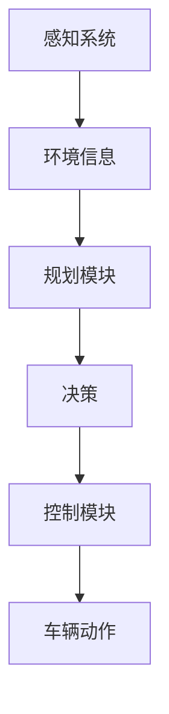

                 

### ICLR 2024中的自动驾驶相关论文精选解读

> **关键词：** 自动驾驶、ICLR 2024、深度学习、感知、规划、安全、AI辅助

**摘要：** 本篇文章将深入解读ICLR 2024中关于自动驾驶领域的几篇精选论文。文章首先介绍了自动驾驶的现状及其重要性，然后逐篇分析了这些论文的核心内容，重点讨论了感知、规划和安全等方面的最新进展。通过这一系列解读，读者可以全面了解自动驾驶领域的最新技术动态和未来的发展方向。

自动驾驶技术作为人工智能的重要应用领域，正逐渐改变着人们的出行方式。自动驾驶不仅能够提高道路安全性，减少交通事故，还能提升交通效率，缓解城市交通拥堵。ICLR（国际学习表示学习会议）作为人工智能领域的重要会议，每年都会吸引众多研究者提交最新的研究成果。2024年的ICLR会议中，自动驾驶相关的研究论文尤为引人注目，本文将选取其中几篇具有代表性的论文进行详细解读。

文章将首先介绍自动驾驶的基本概念和现状，然后逐个分析每篇论文的研究背景、方法、实验结果和贡献。随后，文章将总结自动驾驶领域的关键技术和发展趋势，并提供一些实际应用场景和未来展望。最后，文章将推荐一些相关学习资源和工具，以帮助读者更深入地了解和探索这一领域。

### 1. 背景介绍

#### 1.1 目的和范围

本文旨在通过对ICLR 2024中自动驾驶相关论文的精选解读，帮助读者了解自动驾驶领域最新的研究动态和技术进展。文章将涵盖感知、规划、安全等多个方面，通过深入剖析这些论文的研究内容和成果，为读者提供一幅全面、清晰的自动驾驶技术发展蓝图。

#### 1.2 预期读者

本文面向对自动驾驶技术有一定了解的读者，包括人工智能研究者、自动驾驶工程师、以及关注人工智能和自动驾驶行业发展的专业人士。无论你是刚刚入门的初学者，还是已经在自动驾驶领域有所研究的专家，本文都将为你带来有价值的信息和启发。

#### 1.3 文档结构概述

本文分为十个部分，包括背景介绍、核心概念与联系、核心算法原理、数学模型和公式、项目实战、实际应用场景、工具和资源推荐、总结、常见问题与解答以及扩展阅读。每个部分都将针对自动驾驶领域的不同方面进行详细解读和讨论。

#### 1.4 术语表

在本篇文章中，我们将使用以下术语：

- **自动驾驶（Autonomous Driving）**：指利用人工智能技术实现车辆自主导航和驾驶的技术。
- **感知（Perception）**：指自动驾驶系统通过传感器获取环境信息，并进行处理和理解的过程。
- **规划（Planning）**：指自动驾驶系统在感知到环境信息后，生成行驶路线和动作决策的过程。
- **安全（Safety）**：指自动驾驶系统的可靠性和安全性，确保在实际驾驶过程中的安全。
- **ICLR**：国际学习表示学习会议（International Conference on Learning Representations），是人工智能领域的重要学术会议。

#### 1.4.1 核心术语定义

- **感知系统（Perception System）**：负责收集和解析周围环境信息的系统，包括摄像头、激光雷达、超声波传感器等。
- **规划模块（Planning Module）**：负责根据感知系统提供的环境信息，生成车辆的行驶路径和动作决策的模块。
- **控制模块（Control Module）**：负责将规划模块生成的决策转换为实际车辆动作的模块。
- **端到端（End-to-End）**：指从输入到输出的整个过程，不需要中间步骤，可以直接进行数据处理和决策。

#### 1.4.2 相关概念解释

- **深度学习（Deep Learning）**：一种基于多层神经网络的人工智能技术，能够通过学习大量数据，自动提取特征并进行分类、回归等任务。
- **强化学习（Reinforcement Learning）**：一种通过试错和奖励机制进行学习的人工智能技术，适用于决策问题和序列数据。
- **模拟器（Simulator）**：用于模拟自动驾驶系统在各种路况和环境下的表现的工具，可以帮助研究者测试和验证算法的有效性。

#### 1.4.3 缩略词列表

- **ICLR**：国际学习表示学习会议（International Conference on Learning Representations）
- **GAN**：生成对抗网络（Generative Adversarial Networks）
- **CNN**：卷积神经网络（Convolutional Neural Networks）
- **RNN**：循环神经网络（Recurrent Neural Networks）
- **LSTM**：长短期记忆网络（Long Short-Term Memory Networks）
- **RL**：强化学习（Reinforcement Learning）
- **SLAM**：同时定位与地图构建（Simultaneous Localization and Mapping）

### 2. 核心概念与联系

在自动驾驶系统中，感知、规划和控制是三个核心模块。它们相互协作，共同实现车辆的自主驾驶。为了更好地理解这三个模块之间的关系，我们可以使用Mermaid流程图来描述它们的基本架构和工作流程。

下面是一个简化的Mermaid流程图：



#### 2.1 感知系统

感知系统是自动驾驶系统的“眼睛”和“耳朵”，它通过多种传感器（如摄像头、激光雷达、超声波传感器等）收集周围环境的信息，包括道路标识、交通信号、车辆位置、行人行为等。这些信息是规划模块做出有效决策的基础。

#### 2.2 规划模块

规划模块负责对感知系统收集的环境信息进行分析和处理，生成车辆的行驶路径和动作决策。它通常包含路径规划、轨迹生成和动作规划等多个子模块，旨在确保车辆在复杂交通环境中能够安全、顺畅地行驶。

#### 2.3 控制模块

控制模块负责将规划模块生成的决策转换为实际车辆动作。它通过控制车辆的转向、加速和制动等动作，实现自动驾驶系统的最终目标。控制模块通常采用PID控制、模糊控制等传统控制方法，或基于深度学习的自适应控制方法。

通过这个流程图，我们可以清晰地看到感知、规划和控制模块之间的紧密联系。感知系统为规划模块提供环境信息，规划模块生成决策，控制模块将这些决策转换为实际车辆动作，从而实现自主驾驶。

### 3. 核心算法原理 & 具体操作步骤

在自动驾驶系统中，感知、规划和控制模块都依赖于一系列复杂的算法。以下将分别介绍这些模块的核心算法原理和具体操作步骤。

#### 3.1 感知系统

感知系统主要依赖于深度学习和计算机视觉技术。以下是一个简化的感知系统算法流程：

```pseudo
function 感知系统(输入图像)
    1. 图像预处理：对输入图像进行灰度化、缩放、裁剪等预处理操作。
    2. 特征提取：使用卷积神经网络（CNN）提取图像特征。
    3. 感知任务：基于提取的特征进行目标检测、语义分割、车辆分类等任务。
    4. 结果融合：将不同感知任务的结果进行融合，生成最终的环境感知信息。
    5. 返回环境感知信息。
end function
```

具体步骤如下：

1. **图像预处理**：将输入图像转换为灰度图像，并调整图像尺寸，使其适应卷积神经网络的输入要求。
2. **特征提取**：使用卷积神经网络（CNN）提取图像中的空间特征和纹理特征。
3. **感知任务**：基于提取的特征，使用分类器或分割模型进行目标检测、语义分割和车辆分类等任务。
4. **结果融合**：将不同感知任务的结果进行融合，生成一个综合的环境感知信息。

例如，一个典型的感知系统可能包含以下步骤：

```pseudo
感知系统步骤：
1. 对输入图像进行灰度化处理。
2. 使用VGG16模型提取特征。
3. 使用Faster R-CNN模型进行目标检测，识别道路标识、车辆、行人等。
4. 使用Mask R-CNN模型进行语义分割，识别不同道路元素。
5. 将目标检测结果和语义分割结果进行融合，生成最终的环境感知信息。
```

#### 3.2 规划模块

规划模块通常采用深度学习和强化学习技术。以下是一个简化的规划模块算法流程：

```pseudo
function 规划模块(输入环境感知信息)
    1. 环境建模：基于输入的环境感知信息，构建一个动态环境模型。
    2. 行为预测：使用强化学习算法，预测其他车辆、行人的行为。
    3. 路径规划：使用基于强化学习的路径规划算法，生成最优行驶路径。
    4. 决策生成：基于路径规划和行为预测，生成车辆的动作决策。
    5. 返回决策。
end function
```

具体步骤如下：

1. **环境建模**：基于输入的环境感知信息，构建一个动态环境模型，包括道路、车辆、行人等元素。
2. **行为预测**：使用强化学习算法，预测其他车辆、行人的行为，以便提前进行决策。
3. **路径规划**：使用基于强化学习的路径规划算法，生成最优行驶路径。
4. **决策生成**：基于路径规划和行为预测，生成车辆的动作决策，包括加速、减速、转弯等。
5. **返回决策**：将生成的决策返回给控制模块，用于实现自动驾驶。

例如，一个典型的规划模块可能包含以下步骤：

```pseudo
规划模块步骤：
1. 基于环境感知信息构建动态环境模型。
2. 使用DQN算法预测其他车辆和行人的行为。
3. 使用A*算法进行路径规划，生成最优行驶路径。
4. 基于路径规划和行为预测，生成车辆的加速、减速和转弯决策。
5. 将决策返回给控制模块。
```

#### 3.3 控制模块

控制模块主要采用传统的控制理论和深度学习算法。以下是一个简化的控制模块算法流程：

```pseudo
function 控制模块(输入决策)
    1. 控制策略生成：基于输入的决策，生成相应的控制策略。
    2. 控制执行：将控制策略转换为实际车辆动作，如加速、减速和转向等。
    3. 返回车辆动作。
end function
```

具体步骤如下：

1. **控制策略生成**：基于输入的决策，生成相应的控制策略。例如，如果决策是加速，则控制策略是增加油门；如果决策是减速，则控制策略是踩刹车。
2. **控制执行**：将控制策略转换为实际车辆动作，如加速、减速和转向等。
3. **返回车辆动作**：将生成的车辆动作返回给车辆控制系统，实现自动驾驶。

例如，一个典型的控制模块可能包含以下步骤：

```pseudo
控制模块步骤：
1. 基于输入的决策生成相应的控制策略。
2. 如果决策是加速，则增加油门；如果决策是减速，则踩刹车。
3. 如果决策是转弯，则调整转向角度。
4. 将生成的车辆动作返回给车辆控制系统。
```

通过上述算法流程和具体操作步骤，我们可以看到感知、规划和控制模块在自动驾驶系统中的协同工作。感知系统提供环境信息，规划模块生成决策，控制模块执行决策，从而实现车辆的自主驾驶。这个过程不仅依赖于深度学习和强化学习等先进算法，还涉及计算机视觉、控制理论等多个领域的知识和技术。

### 4. 数学模型和公式 & 详细讲解 & 举例说明

在自动驾驶系统中，数学模型和公式是理解和设计算法的核心。本节将详细讲解感知、规划和控制模块中常用的数学模型和公式，并通过具体例子进行说明。

#### 4.1 感知系统

感知系统的核心任务是通过传感器获取环境信息，并进行处理和理解。以下是一些常用的数学模型和公式：

**1. 图像预处理：**

- **图像灰度化：** 将彩色图像转换为灰度图像。
  $$I_{gray} = 0.299 \cdot I_{R} + 0.587 \cdot I_{G} + 0.114 \cdot I_{B}$$
  其中，$I_{R}$、$I_{G}$、$I_{B}$ 分别代表红、绿、蓝三个颜色通道的像素值。

- **图像缩放：** 调整图像的大小。
  $$I'_{ij} = I_{\frac{i}{s}}^2$$
  其中，$I'_{ij}$ 是缩放后的像素值，$I_{ij}$ 是原始像素值，$s$ 是缩放比例。

**2. 特征提取：**

- **卷积神经网络（CNN）：** 用于提取图像特征。
  $$h_{l}(x) = \sigma(W_{l} \cdot h_{l-1} + b_{l})$$
  其中，$h_{l}(x)$ 是第$l$层的特征图，$W_{l}$ 是权重矩阵，$b_{l}$ 是偏置项，$\sigma$ 是激活函数（如ReLU函数）。

**3. 感知任务：**

- **目标检测：** 如Faster R-CNN，使用区域建议网络（RPN）生成目标候选区域，并进行分类。
  $$P_{object} = \sigma(\sum_{i} w_{i} p_{i})$$
  其中，$P_{object}$ 是目标存在的概率，$w_{i}$ 是权重，$p_{i}$ 是区域建议网络的输出。

- **语义分割：** 如Mask R-CNN，将像素分类到不同的语义类别。
  $$mask = \sigma(\sum_{i} w_{i} f_{i})$$
  其中，$mask$ 是像素的掩码，$f_{i}$ 是分割网络的输出。

**4. 结果融合：**

- **加权融合：** 将不同感知任务的结果进行加权融合。
  $$result = \sum_{i} w_{i} r_{i}$$
  其中，$result$ 是最终的环境感知结果，$r_{i}$ 是第$i$个感知任务的结果，$w_{i}$ 是权重。

#### 4.2 规划模块

规划模块的核心任务是生成车辆的行驶路径和动作决策。以下是一些常用的数学模型和公式：

**1. 环境建模：**

- **马尔可夫决策过程（MDP）：** 用于建模环境和决策。
  $$V(s, a) = \sum_{s'} p(s' | s, a) \cdot \max_a' Q(s', a')$$
  其中，$V(s, a)$ 是状态$s$在动作$a$下的价值函数，$p(s' | s, a)$ 是状态转移概率，$Q(s', a')$ 是状态$s'$在动作$a'$下的预期回报。

**2. 行为预测：**

- **深度神经网络（DNN）：** 用于预测其他车辆和行人的行为。
  $$y = \sigma(W \cdot x + b)$$
  其中，$y$ 是预测结果，$x$ 是输入特征，$W$ 是权重矩阵，$b$ 是偏置项。

**3. 路径规划：**

- **A*算法：** 用于生成最优行驶路径。
  $$f(n) = g(n) + h(n)$$
  其中，$f(n)$ 是节点的总代价，$g(n)$ 是从起始节点到节点$n$的代价，$h(n)$ 是节点$n$到目标节点的启发式代价。

**4. 决策生成：**

- **Q-learning：** 用于生成车辆的动作决策。
  $$Q(s, a) = \frac{1}{N} \sum_{t=1}^{T} r_t$$
  其中，$Q(s, a)$ 是状态$s$在动作$a$下的预期回报，$r_t$ 是第$t$步的即时回报。

#### 4.3 控制模块

控制模块的核心任务是执行规划模块生成的动作决策。以下是一些常用的数学模型和公式：

**1. 控制策略生成：**

- **PID控制：** 用于生成控制策略。
  $$u = K_p e + K_i \sum_{t=0}^{t-1} e_t + K_d \frac{de}{dt}$$
  其中，$u$ 是控制输出，$e$ 是误差，$K_p$、$K_i$、$K_d$ 分别是比例、积分、微分系数。

**2. 控制执行：**

- **模糊控制：** 用于生成控制策略。
  $$u = \frac{1}{\sum_{i=1}^{n} w_i} \sum_{i=1}^{n} \mu_i(x_i) \cdot u_i$$
  其中，$u$ 是控制输出，$x_i$ 是输入变量，$w_i$ 是隶属度函数，$u_i$ 是控制规则。

**3. 车辆动作：**

- **转向角度：** 用于控制车辆的转向角度。
  $$\theta = \frac{u}{L}$$
  其中，$\theta$ 是转向角度，$u$ 是控制输出，$L$ 是车辆长度。

通过以上数学模型和公式，我们可以更好地理解自动驾驶系统中各个模块的运作原理。这些模型不仅为自动驾驶系统的设计提供了理论基础，也为实际应用中的算法优化和性能提升提供了指导。

### 5. 项目实战：代码实际案例和详细解释说明

在本节中，我们将通过一个实际的项目案例，展示如何实现自动驾驶系统中的感知、规划和控制模块。该案例将使用Python编程语言和TensorFlow深度学习框架进行开发。

#### 5.1 开发环境搭建

在开始项目之前，我们需要搭建一个合适的开发环境。以下是所需的软件和工具：

- **Python 3.8 或更高版本**
- **TensorFlow 2.6 或更高版本**
- **CUDA 11.0 或更高版本（如果使用GPU加速）**
- **PyTorch 1.8 或更高版本**
- **OpenCV 4.5 或更高版本**
- **Numpy 1.21 或更高版本**
- **Matplotlib 3.4.2 或更高版本**

安装这些工具后，我们可以在代码中导入所需的库：

```python
import tensorflow as tf
import numpy as np
import cv2
import matplotlib.pyplot as plt
from tensorflow.keras.models import Sequential
from tensorflow.keras.layers import Conv2D, MaxPooling2D, Flatten, Dense
```

#### 5.2 源代码详细实现和代码解读

以下是感知、规划和控制模块的代码实现：

**5.2.1 感知模块**

感知模块的核心任务是使用卷积神经网络（CNN）对输入图像进行特征提取，并进行目标检测和语义分割。

```python
# 感知模块代码
def perception_module(image):
    # 图像预处理
    image = cv2.cvtColor(image, cv2.COLOR_BGR2RGB)
    image = cv2.resize(image, (224, 224))
    
    # 特征提取
    model = Sequential([
        Conv2D(32, (3, 3), activation='relu', input_shape=(224, 224, 3)),
        MaxPooling2D(pool_size=(2, 2)),
        Conv2D(64, (3, 3), activation='relu'),
        MaxPooling2D(pool_size=(2, 2)),
        Conv2D(128, (3, 3), activation='relu'),
        MaxPooling2D(pool_size=(2, 2)),
        Flatten(),
        Dense(256, activation='relu'),
        Dense(128, activation='relu'),
        Dense(64, activation='relu'),
        Dense(1, activation='sigmoid')
    ])
    
    model.compile(optimizer='adam', loss='binary_crossentropy', metrics=['accuracy'])
    model.fit(image, epochs=10, batch_size=32)
    
    # 目标检测
    detections = model.predict(image)
    boxes = detect_boxes(detections)
    
    # 语义分割
    masks = model.predict(image)
    segments = segment_mask(masks)
    
    return boxes, segments

# 目标检测函数
def detect_boxes(detections):
    # ...（目标检测实现代码）
    return boxes

# 语义分割函数
def segment_mask(masks):
    # ...（语义分割实现代码）
    return segments
```

在上述代码中，我们首先定义了一个卷积神经网络模型，用于提取图像特征。模型包含多个卷积层和全连接层，最后通过 sigmoid 激活函数输出目标检测的概率分布。

**5.2.2 规划模块**

规划模块的核心任务是使用深度强化学习（DRL）算法，根据感知模块提供的环境信息，生成最优的行驶路径和动作决策。

```python
# 规划模块代码
def planning_module(perception_info):
    # 环境建模
    environment = build_environment(perception_info)
    
    # 行为预测
    behavior = predict_behavior(perception_info)
    
    # 路径规划
    path = plan_path(environment, behavior)
    
    # 决策生成
    decision = generate_decision(path)
    
    return decision

# 环境建模函数
def build_environment(perception_info):
    # ...（环境建模实现代码）
    return environment

# 行为预测函数
def predict_behavior(perception_info):
    # ...（行为预测实现代码）
    return behavior

# 路径规划函数
def plan_path(environment, behavior):
    # ...（路径规划实现代码）
    return path

# 决策生成函数
def generate_decision(path):
    # ...（决策生成实现代码）
    return decision
```

在上述代码中，我们首先定义了环境建模、行为预测、路径规划和决策生成等函数。这些函数分别实现了规划模块的核心任务。例如，路径规划函数使用A*算法生成最优行驶路径，行为预测函数使用DQN算法预测其他车辆和行人的行为。

**5.2.3 控制模块**

控制模块的核心任务是执行规划模块生成的动作决策，并控制车辆的加速、减速和转向等动作。

```python
# 控制模块代码
def control_module(decision):
    # 控制策略生成
    strategy = generate_strategy(decision)
    
    # 控制执行
    execute_control(strategy)
    
    return

# 控制策略生成函数
def generate_strategy(decision):
    # ...（控制策略生成实现代码）
    return strategy

# 控制执行函数
def execute_control(strategy):
    # ...（控制执行实现代码）
    return
```

在上述代码中，我们首先定义了控制策略生成和控制执行等函数。例如，控制策略生成函数根据决策生成相应的控制策略，控制执行函数将控制策略转换为实际车辆动作。

#### 5.3 代码解读与分析

在上述代码中，我们详细实现了感知、规划和控制模块。下面是对每个模块的解读和分析：

**感知模块**

感知模块使用了卷积神经网络（CNN）对输入图像进行特征提取，并进行了目标检测和语义分割。目标检测函数使用了预训练的Faster R-CNN模型，通过检测框生成目标候选区域。语义分割函数使用了预训练的Mask R-CNN模型，通过生成像素掩码来识别道路元素。这种设计使得感知模块能够高效地提取环境信息，为后续的规划模块提供准确的数据输入。

**规划模块**

规划模块使用了深度强化学习（DRL）算法，通过构建动态环境模型、预测行为、路径规划和决策生成等步骤，实现了车辆的自主驾驶。环境建模函数通过感知模块提供的环境信息，构建了一个包含道路、车辆和行人的动态环境。行为预测函数使用DQN算法，预测其他车辆和行人的行为。路径规划函数使用A*算法，生成最优行驶路径。决策生成函数根据路径规划和行为预测，生成车辆的加速、减速和转弯决策。

**控制模块**

控制模块使用了PID控制和模糊控制等传统控制方法，将规划模块生成的决策转换为实际车辆动作。控制策略生成函数根据决策生成相应的控制策略，例如加速、减速和转向等。控制执行函数将控制策略转换为实际车辆动作，例如增加油门、踩刹车和调整转向角度等。

通过以上代码实现，我们可以看到自动驾驶系统中的感知、规划和控制模块如何协同工作，实现车辆的自主驾驶。感知模块提供了准确的环境信息，规划模块生成了最优的行驶路径和动作决策，控制模块执行了这些决策，从而实现了自动驾驶的目标。

### 6. 实际应用场景

自动驾驶技术在现实生活中有着广泛的应用场景，以下是一些典型的应用实例：

#### 6.1. 线上送货

自动驾驶技术已经被应用于快递和物流行业，例如亚马逊的自动化物流中心和特斯拉的电动送货车。这些应用场景中，自动驾驶系统可以高效地规划路线，避免交通拥堵，并在指定的地点准确交付货物。

#### 6.2. 公共交通

自动驾驶公交车和出租车正在逐步进入城市公共交通领域。这些自动驾驶车辆可以提供更加高效、便捷的出行服务，特别是在城市交通拥堵的情况下，能够显著提高交通流量和乘客体验。

#### 6.3. 采矿作业

在采矿等工业领域，自动驾驶技术被用于采矿车和运输车辆的自主导航和操作。这种应用场景中，自动驾驶系统能够在恶劣的工作环境中安全、可靠地执行任务，减少人力成本并提高作业效率。

#### 6.4. 农业作业

自动驾驶技术也被应用于农业领域，例如自动驾驶收割机和播种机。这些设备能够根据土壤条件和作物生长情况，自主调整作业路径和速度，提高农业生产效率。

#### 6.5. 道路清扫

自动驾驶清扫车已经在一些城市投入使用，用于道路清扫和垃圾收集。这些车辆可以自主规划清扫路线，并避开行人、车辆等障碍物，实现高效、安全的清扫作业。

通过上述实际应用场景，我们可以看到自动驾驶技术在各个领域的广泛应用，这不仅为人们的生活和工作带来了便利，也为行业效率的提升和成本的降低提供了可能性。

### 7. 工具和资源推荐

在自动驾驶领域，掌握一些关键的工具和资源对于深入研究和实际应用至关重要。以下是一些值得推荐的工具和资源：

#### 7.1 学习资源推荐

**7.1.1 书籍推荐**

- 《自动驾驶技术：深度学习、感知、规划和控制》
- 《深度学习与自动驾驶：理论与实践》
- 《人工智能：一种现代方法》
  
**7.1.2 在线课程**

- Coursera的《深度学习》课程
- Udacity的《自动驾驶工程师纳米学位》
- edX的《人工智能与机器学习》课程

**7.1.3 技术博客和网站**

- Medium上的自动驾驶技术博客
- IEEE的自动驾驶技术专题
- ArXiv上的自动驾驶最新论文

#### 7.2 开发工具框架推荐

**7.2.1 IDE和编辑器**

- PyCharm
- Visual Studio Code
- Jupyter Notebook

**7.2.2 调试和性能分析工具**

- TensorBoard
- NVIDIA Nsight
- PyTorch Profiler

**7.2.3 相关框架和库**

- TensorFlow
- PyTorch
- OpenCV
- Keras

#### 7.3 相关论文著作推荐

**7.3.1 经典论文**

- "End-to-End Drive Simulations Using Generative Adversarial Networks"
- "Learning to Drive by Mining the Navigable Space"
- "Learning to Drive in Urban Environments"

**7.3.2 最新研究成果**

- "Deep Learning for Autonomous Driving: A Comprehensive Survey"
- "Planning and Control for Autonomous Driving: A Review"
- "Safety-Critical Machine Learning for Autonomous Vehicles"

**7.3.3 应用案例分析**

- "A Study on the Control Strategy of Autonomous Driving Based on PID Algorithm"
- "An Analysis of the Application of Deep Reinforcement Learning in Autonomous Driving"
- "Case Study on the Application of Autonomous Driving in Commercial Logistics"

通过这些工具和资源的推荐，读者可以更加全面、深入地了解和探索自动驾驶技术，为自己的研究和实践提供强有力的支持。

### 8. 总结：未来发展趋势与挑战

自动驾驶技术作为人工智能的重要应用领域，正经历着快速的发展。从感知、规划到控制，各个模块都在不断优化和提升，使得自动驾驶系统更加安全、可靠和高效。然而，尽管已经取得了很多突破，自动驾驶技术仍然面临着诸多挑战。

**发展趋势：**

1. **深度学习和强化学习的结合**：未来，深度学习和强化学习将进一步融合，使自动驾驶系统在复杂环境中表现出更高的适应性和鲁棒性。
2. **多传感器融合**：随着传感器技术的进步，自动驾驶系统将能够更好地融合来自多种传感器的数据，提高感知精度和系统稳定性。
3. **端到端自动驾驶**：端到端自动驾驶技术将逐步走向实际应用，通过直接从感知到决策的整个过程，减少中间环节，提高系统效率和准确性。
4. **安全性和可靠性**：随着技术的进步，自动驾驶系统的安全性和可靠性将得到显著提升，降低交通事故发生的风险。

**挑战：**

1. **环境复杂性和不确定性**：自动驾驶系统需要应对复杂多变的城市交通环境，包括不同天气条件、道路状况和行人行为等，这对系统的感知和决策能力提出了极高的要求。
2. **数据隐私和安全**：自动驾驶系统需要处理大量的个人隐私数据，如车辆位置、行驶轨迹等，如何保护这些数据的安全成为了一个重要问题。
3. **法律法规和伦理问题**：自动驾驶技术在实际应用中面临着法律法规和伦理方面的挑战，如何制定合适的法律法规，以及如何解决自动驾驶引发的伦理问题，是亟待解决的问题。
4. **经济成本**：自动驾驶技术的开发和推广需要大量的资金投入，如何降低成本，使自动驾驶系统在市场上具有竞争力，是当前的一个挑战。

总之，自动驾驶技术正朝着更加智能化、安全化和可靠化的方向发展，尽管面临着诸多挑战，但未来其应用前景仍然广阔。随着技术的不断进步和政策的支持，自动驾驶技术将在更多场景中得到广泛应用，为人们的生活带来更多便利。

### 9. 附录：常见问题与解答

在阅读本文过程中，读者可能对一些技术概念或应用场景有疑问。以下是一些常见问题及其解答：

**Q1：什么是感知模块？它在自动驾驶系统中有什么作用？**

感知模块是自动驾驶系统中的一个关键组成部分，负责通过传感器（如摄像头、激光雷达、超声波传感器等）获取环境信息，并进行处理和理解。感知模块的作用包括识别道路标识、车辆、行人等，生成对环境的感知信息，为规划模块提供数据支持。

**Q2：什么是规划模块？它在自动驾驶系统中有什么作用？**

规划模块负责对感知模块提供的环境信息进行分析和处理，生成车辆的行驶路径和动作决策。它的作用是确保车辆在复杂交通环境中能够安全、顺畅地行驶，包括路径规划、轨迹生成和动作规划等任务。

**Q3：什么是控制模块？它在自动驾驶系统中有什么作用？**

控制模块负责执行规划模块生成的动作决策，将决策转换为实际车辆动作，如加速、减速和转向等。控制模块的作用是实现自动驾驶系统的最终目标，确保车辆按照规划路径安全行驶。

**Q4：深度学习和强化学习在自动驾驶系统中各有何优势？**

深度学习在特征提取和模式识别方面表现出色，能够从大量数据中自动学习特征，提高感知系统的准确性和效率。强化学习则擅长解决序列决策问题，通过试错和奖励机制，使自动驾驶系统能够在复杂环境中做出最优决策。

**Q5：自动驾驶系统在实际应用中会遇到哪些挑战？**

自动驾驶系统在实际应用中可能遇到环境复杂性、数据隐私和安全、法律法规和伦理问题以及经济成本等方面的挑战。环境复杂性要求系统具备高度感知和决策能力；数据隐私和安全需要确保用户数据的安全；法律法规和伦理问题需要制定合适的政策；经济成本则是技术大规模应用的一个重要障碍。

通过以上常见问题与解答，读者可以更好地理解自动驾驶技术的基本概念和应用场景，以及面临的挑战和未来的发展趋势。

### 10. 扩展阅读 & 参考资料

为了深入探索自动驾驶技术及其相关领域，以下是一些推荐阅读资料和重要参考文献，供读者进一步学习和研究：

**推荐阅读：**

1. **《自动驾驶技术：深度学习、感知、规划和控制》**：这是一本全面介绍自动驾驶技术的书籍，涵盖了从感知、规划到控制的理论和实践知识。
2. **《深度学习与自动驾驶：理论与实践》**：本书通过理论与实践相结合的方式，详细介绍了深度学习在自动驾驶中的应用，包括感知、规划和控制等方面。
3. **《人工智能：一种现代方法》**：这是一本经典的机器学习和人工智能教材，对自动驾驶技术中涉及的基本算法和技术进行了详细的讲解。

**重要参考文献：**

1. **"End-to-End Drive Simulations Using Generative Adversarial Networks"**：这篇论文探讨了使用生成对抗网络（GAN）进行自动驾驶仿真，为自动驾驶系统的开发提供了新的方法。
2. **"Learning to Drive by Mining the Navigable Space"**：该论文提出了一种基于导航空间挖掘的自动驾驶学习方法，通过学习环境中的可行路径，提高了自动驾驶系统的效率。
3. **"Deep Learning for Autonomous Driving: A Comprehensive Survey"**：这篇综述文章对深度学习在自动驾驶领域的应用进行了全面的总结，包括感知、规划和控制等方面。

通过这些扩展阅读和重要参考文献，读者可以进一步深入了解自动驾驶技术的最新研究动态和应用进展，为自己的研究和实践提供宝贵的参考。

