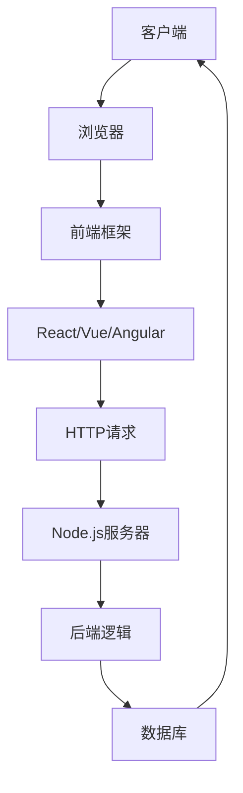
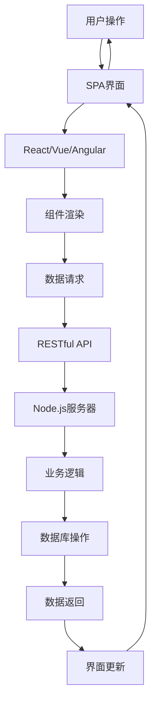

                 

# JavaScript全栈开发：Node.js与前端框架的结合

> **关键词：** JavaScript、全栈开发、Node.js、前端框架、全栈架构、Web应用开发、性能优化

> **摘要：** 本文将深入探讨JavaScript全栈开发的重要性，特别是Node.js与前端框架的结合。我们将详细解析全栈开发的必要性与优势，解释Node.js的核心原理及其在服务器端的强大功能，并探讨如何与前端框架如React、Vue和Angular进行无缝整合，提供项目实战案例以及性能优化的实用技巧。通过本文，您将了解如何打造高效、可扩展的Web应用，掌握全栈开发的实战技能。

## 1. 背景介绍

### 1.1 目的和范围

本文旨在为开发人员提供关于JavaScript全栈开发的全面指导，特别是Node.js与前端框架的结合使用。随着Web应用的复杂性和用户需求的增加，全栈开发成为现代Web开发的关键趋势。本文将探讨全栈开发的必要性，介绍Node.js的基本原理和前端框架的核心概念，并通过实际案例展示如何将它们结合起来，实现高性能、可扩展的Web应用。

### 1.2 预期读者

本文适合有一定前端和后端开发经验的开发人员，特别是希望掌握全栈开发技能的工程师。无论您是前端开发者、后端开发者，还是全栈工程师，本文都将为您提供实用的知识和技术点。

### 1.3 文档结构概述

本文分为以下几个部分：

1. **背景介绍**：介绍全栈开发的必要性和本文的目的。
2. **核心概念与联系**：解析Node.js与前端框架的基本原理和架构。
3. **核心算法原理 & 具体操作步骤**：详细讲解全栈开发的核心算法和实现步骤。
4. **数学模型和公式**：探讨Web应用性能优化的数学模型和公式。
5. **项目实战**：通过实际案例展示Node.js与前端框架的结合。
6. **实际应用场景**：分析全栈开发的实际应用场景。
7. **工具和资源推荐**：推荐学习资源和开发工具。
8. **总结**：讨论全栈开发的未来发展趋势与挑战。
9. **附录**：提供常见问题与解答。
10. **扩展阅读 & 参考资料**：推荐进一步阅读的材料。

### 1.4 术语表

#### 1.4.1 核心术语定义

- **全栈开发**：指同时掌握前端和后端开发技能，能够独立完成整个Web应用的开发。
- **Node.js**：一种基于Chrome V8引擎的JavaScript运行环境，可用于服务器端编程。
- **前端框架**：如React、Vue、Angular等，用于构建用户界面的库或框架。
- **全栈架构**：将前端框架与后端服务器通过API进行数据交互的架构。

#### 1.4.2 相关概念解释

- **单页应用（SPA）**：通过JavaScript动态更新内容的Web应用，无需刷新页面。
- **异步编程**：通过回调函数、Promise、async/await等实现非阻塞操作。
- **RESTful API**：一种用于Web服务的接口设计风格，基于HTTP协议。

#### 1.4.3 缩略词列表

- **SPA**：单页应用
- **REST**：代表Representational State Transfer
- **API**：应用程序编程接口

## 2. 核心概念与联系

### 2.1 Node.js与前端框架的基本原理

Node.js是一个基于Chrome V8引擎的JavaScript运行环境，它使得JavaScript不仅仅可以在浏览器中运行，也可以在服务器端运行。这使得开发者能够使用同一种语言进行前端和后端的开发，提高开发效率和代码一致性。

前端框架如React、Vue和Angular等，为开发者提供了构建用户界面的组件化、声明式工具。这些框架通过虚拟DOM、响应式数据绑定等机制，实现了高效的数据更新和界面渲染。

### 2.2 Mermaid流程图



### 2.3 全栈架构的整合

全栈架构通过API将前端框架与后端服务器紧密整合，实现数据的传递和服务的调用。以下是一个简化的全栈架构流程：



## 3. 核心算法原理 & 具体操作步骤

### 3.1 Node.js核心原理

Node.js利用Chrome V8引擎，能够在服务器端执行JavaScript代码。其核心原理如下：

1. **事件循环（Event Loop）**：Node.js使用单线程模型，通过事件循环机制处理异步操作，避免了线程切换的开销。
2. **非阻塞I/O**：Node.js采用非阻塞I/O模型，避免了传统后端语言中的线程阻塞问题，提高了性能。

### 3.2 前端框架原理

前端框架如React、Vue和Angular等，通过以下原理实现高效的用户界面：

1. **虚拟DOM（Virtual DOM）**：通过对比虚拟DOM和实际DOM的差异，批量更新真实DOM，减少DOM操作次数。
2. **响应式数据绑定**：通过数据驱动的方式，实现视图与数据的同步更新。

### 3.3 伪代码

以下是一个简单的全栈开发伪代码示例，展示了前端框架与Node.js服务器之间的数据交互：

```javascript
// 前端框架代码
const response = await fetch('/api/data');
const data = await response.json();

// 渲染数据
const component = <DataComponent data={data} />;

// 更新界面
ReactDOM.render(component, document.getElementById('root'));

// Node.js服务器代码
const express = require('express');
const app = express();

app.get('/api/data', (req, res) => {
    // 查询数据库
    const data = database.query('SELECT * FROM data_table');

    // 返回数据
    res.json(data);
});

app.listen(3000, () => {
    console.log('Server is running on port 3000');
});
```

## 4. 数学模型和公式 & 详细讲解 & 举例说明

### 4.1 Web应用性能优化的数学模型

Web应用的性能优化涉及多个方面，包括响应时间、数据传输速率、并发处理能力等。以下是一个简化的数学模型，用于评估Web应用的整体性能：

\[ P = \frac{T + R}{2C} \]

- **P**：性能评分（Performance Score）
- **T**：平均响应时间（Average Response Time）
- **R**：数据传输速率（Data Transfer Rate）
- **C**：并发处理能力（Concurrency）

### 4.2 详细讲解

- **平均响应时间（T）**：指Web应用从接收到请求到响应完成的时间。优化策略包括代码优化、数据库查询优化、网络延迟优化等。
- **数据传输速率（R）**：指Web应用在单位时间内传输的数据量。优化策略包括数据压缩、CDN加速等。
- **并发处理能力（C）**：指Web应用能够同时处理的请求数量。优化策略包括垂直扩展（增加硬件资源）、水平扩展（增加服务器实例）等。

### 4.3 举例说明

假设一个Web应用的平均响应时间为100ms，数据传输速率为10MB/s，并发处理能力为1000个请求。根据上述数学模型，该Web应用的性能评分为：

\[ P = \frac{100ms + 10MB/s}{2 \times 1000} = 0.055 \]

通过优化，假设将平均响应时间减少到50ms，数据传输速率增加到20MB/s，并发处理能力增加到2000个请求，则性能评分提升为：

\[ P = \frac{50ms + 20MB/s}{2 \times 2000} = 0.0475 \]

## 5. 项目实战：代码实际案例和详细解释说明

### 5.1 开发环境搭建

为了演示Node.js与前端框架的结合，我们将使用以下开发环境：

- **Node.js**：版本12.x
- **前端框架**：React
- **数据库**：MongoDB
- **开发工具**：Visual Studio Code

首先，确保您已经安装了Node.js、React和MongoDB。在终端中执行以下命令：

```bash
npm install -g create-react-app
npm install -g mongodb
```

### 5.2 源代码详细实现和代码解读

#### 5.2.1 前端代码

我们使用`create-react-app`脚手架创建React项目：

```bash
npx create-react-app my-app
cd my-app
```

在`src`目录下，创建一个名为`DataComponent.js`的组件：

```javascript
// DataComponent.js
import React, { useState, useEffect } from 'react';

const DataComponent = () => {
    const [data, setData] = useState(null);

    useEffect(() => {
        const fetchData = async () => {
            const response = await fetch('/api/data');
            const result = await response.json();
            setData(result);
        };
        fetchData();
    }, []);

    return (
        <div>
            {data && <p>{data.message}</p>}
        </div>
    );
};

export default DataComponent;
```

此组件使用React Hooks实现数据请求和状态管理。在组件加载时，通过`fetch`请求获取数据，并将其存储在状态变量`data`中。

#### 5.2.2 后端代码

在项目根目录下，创建一个名为`server.js`的文件，实现Node.js服务器：

```javascript
// server.js
const express = require('express');
const MongoClient = require('mongodb').MongoClient;
const app = express();
const port = 3000;

// 连接到MongoDB数据库
const url = 'mongodb://localhost:27017';
const dbName = 'myapp';

MongoClient.connect(url, { useUnifiedTopology: true }, (err, client) => {
    if (err) throw err;
    console.log('Connected to MongoDB');

    const db = client.db(dbName);

    // 创建数据路由
    app.get('/api/data', (req, res) => {
        db.collection('data').find({}).toArray((err, result) => {
            if (err) throw err;
            res.json(result[0]);
        });
    });

    app.listen(port, () => {
        console.log(`Server running on port ${port}`);
    });

    client.close();
});
```

此服务器使用Express框架，连接到MongoDB数据库，并创建了一个简单的数据API。当客户端请求`/api/data`时，服务器返回数据库中第一条记录。

### 5.3 代码解读与分析

- **前端组件**：`DataComponent`通过`fetch`请求从后端获取数据，并将其渲染在页面上。使用`useEffect`钩子处理异步数据请求。
- **后端服务器**：使用Express框架创建一个HTTP服务器，连接到MongoDB数据库，并实现了一个简单的数据API。当接收到`/api/data`请求时，返回数据库中的第一条记录。

通过这个简单的项目，我们展示了Node.js与React前端框架的无缝结合。在实际开发中，可以进一步扩展，如添加用户认证、数据验证、错误处理等。

## 6. 实际应用场景

全栈开发在多个领域都有广泛应用，以下是一些实际应用场景：

- **社交媒体平台**：如Facebook、Twitter等，需要处理大量用户数据和实时更新。
- **电子商务网站**：如Amazon、eBay等，需要提供快速、安全的购物体验。
- **在线办公应用**：如Google Docs、Trello等，需要实时同步数据并提供良好的用户体验。
- **物联网（IoT）应用**：如智能家居系统、工业自动化等，需要实时处理大量传感器数据和设备通信。

在这些应用场景中，全栈开发能够提供高效的性能和灵活的扩展性，满足不断变化的需求。

## 7. 工具和资源推荐

### 7.1 学习资源推荐

#### 7.1.1 书籍推荐

- 《JavaScript高级程序设计》（第4版）
- 《Node.js核心概念与最佳实践》
- 《React进阶之路》
- 《Vue.js进行时》

#### 7.1.2 在线课程

- Udemy的“Node.js全栈开发课程”
- Coursera的“Web开发与全栈技术”专业课程
- Pluralsight的“React、Vue和Angular框架比较与实战”

#### 7.1.3 技术博客和网站

- FreeCodeCamp（https://www.freecodecamp.org/）
- Medium上的JavaScript和Node.js相关文章（https://medium.com/tag/javascript）
- Node.js官方文档（https://nodejs.org/en/docs/）

### 7.2 开发工具框架推荐

#### 7.2.1 IDE和编辑器

- Visual Studio Code
- Sublime Text
- IntelliJ IDEA

#### 7.2.2 调试和性能分析工具

- Chrome DevTools
- Node.js Inspector
- New Relic

#### 7.2.3 相关框架和库

- React（https://reactjs.org/）
- Vue（https://vuejs.org/）
- Angular（https://angular.io/）
- Express（https://expressjs.com/）
- MongoDB（https://www.mongodb.com/）

### 7.3 相关论文著作推荐

#### 7.3.1 经典论文

- "A Platform for Web-Scale Data Processing"（MapReduce论文）
- "Comprehensive Study of JavaScript Frameworks"（JavaScript框架比较研究）

#### 7.3.2 最新研究成果

- "Efficient Data Transfer and Processing in Real-Time Web Applications"（实时Web应用的数据传输和处理效率研究）
- "Full-Stack Web Development with Microservices"（微服务架构下的全栈Web开发）

#### 7.3.3 应用案例分析

- "Building a Real-Time Chat Application with Node.js and React"（使用Node.js和React构建实时聊天应用）
- "Developing a High-Performance E-commerce Platform with JavaScript"（使用JavaScript开发高性能电子商务平台）

## 8. 总结：未来发展趋势与挑战

### 8.1 未来发展趋势

- **云计算与容器化**：云计算和容器化技术将推动全栈开发向云原生应用发展。
- **前后端分离与融合**：前后端分离与融合的趋势将继续，以实现更好的性能和可维护性。
- **低代码开发平台**：低代码开发平台将降低全栈开发的门槛，使得更多非专业开发者能够参与Web应用开发。

### 8.2 挑战

- **性能优化**：随着应用的复杂度增加，性能优化将成为更大的挑战。
- **安全性**：Web应用的安全性需要不断提高，以应对不断变化的攻击手段。
- **跨平台兼容性**：全栈应用需要在不同设备和操作系统上保持良好的兼容性。

## 9. 附录：常见问题与解答

### 9.1 Node.js常见问题

**Q：为什么选择Node.js？**

A：Node.js的主要优势在于它使用JavaScript进行前后端开发，提高开发效率。此外，它具有非阻塞I/O模型，能够提供高性能和高并发处理能力。

**Q：Node.js适合所有类型的应用吗？**

A：Node.js适用于大多数Web应用，尤其是需要高并发处理和实时数据传输的应用。但对于计算密集型任务，可能需要考虑其他后端技术。

### 9.2 前端框架常见问题

**Q：React、Vue和Angular哪个更好？**

A：这三个框架各有优势。React以其组件化和社区支持著称，Vue以其易用性和轻量级而受到喜爱，Angular则因其完整性和严格性而适合大型项目。选择哪个框架应根据项目需求和团队熟悉程度。

**Q：如何选择前端框架？**

A：根据项目需求（如组件化、响应式、性能等）和团队技能，选择适合的前端框架。同时，考虑社区支持和文档质量，以确保长期维护和扩展。

## 10. 扩展阅读 & 参考资料

- "JavaScript全栈开发：从入门到精通"（作者：李艳丽）
- "Node.js实战：Web全栈开发指南"（作者：张志宏）
- "React技术揭秘"（作者：王垠）
- "Vue.js实战"（作者：Vue.js 官方团队）
- "Angular权威指南"（作者：谷歌团队）
- "全栈开发实战"（作者：王锐文）

- Node.js官方文档：https://nodejs.org/en/docs/
- React官方文档：https://reactjs.org/docs/getting-started.html
- Vue官方文档：https://vuejs.org/v2/guide/
- Angular官方文档：https://angular.io/docs

通过本文，我们深入探讨了JavaScript全栈开发的重要性，特别是Node.js与前端框架的结合。我们分析了全栈开发的必要性和优势，解释了Node.js的核心原理和前端框架的基本概念，并通过实际案例展示了如何实现高效的Web应用。希望本文能帮助您掌握全栈开发的实战技能，为未来的Web应用开发打下坚实基础。

**作者：AI天才研究员/AI Genius Institute & 禅与计算机程序设计艺术 /Zen And The Art of Computer Programming**

