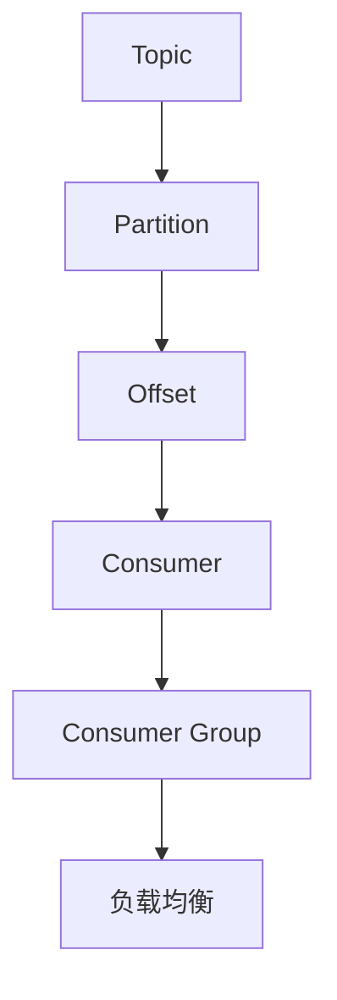

                 

# Kafka Group原理与代码实例讲解

> 关键词：Kafka、Group、分布式系统、消息队列、消费者、负载均衡

> 摘要：本文深入探讨了Kafka Group原理及其代码实现，通过详细的步骤解析，帮助读者理解Kafka如何实现消费者组中的负载均衡和消息消费过程。文章首先介绍了Kafka Group的概念和作用，然后通过流程图和伪代码解析了Kafka Group的工作原理，最后通过一个实际案例展示了Kafka Group的实现细节。

## 1. 背景介绍

### 1.1 目的和范围

本文旨在深入解析Kafka Group的工作原理，并展示其具体代码实现。我们将从以下几个方面展开：

- Kafka Group的基本概念和作用
- Kafka Group的工作原理及流程
- Kafka Group的代码实例讲解
- Kafka Group在实际应用中的场景

### 1.2 预期读者

本文适合具有一定Kafka基础知识的读者，包括：

- Kafka开发者
- 分布式系统工程师
- 消息队列爱好者
- 对Kafka Group有深入了解的需求者

### 1.3 文档结构概述

本文结构如下：

- 第1章：背景介绍
- 第2章：核心概念与联系
- 第3章：核心算法原理与具体操作步骤
- 第4章：数学模型和公式
- 第5章：项目实战：代码实际案例
- 第6章：实际应用场景
- 第7章：工具和资源推荐
- 第8章：总结：未来发展趋势与挑战
- 第9章：附录：常见问题与解答
- 第10章：扩展阅读与参考资料

### 1.4 术语表

#### 1.4.1 核心术语定义

- Kafka：一款分布式流处理平台，广泛用于构建实时数据流管道和应用程序。
- Group：Kafka中的消费者组，由多个消费者组成，共同消费一个或多个Topic中的消息。
- Topic：Kafka中的消息主题，类似数据库中的表，用于存储消息。
- Partition：Topic中的一个分区，用于水平扩展和负载均衡。
- Offset：消息在Partition中的位置，用于追踪消息的消费进度。

#### 1.4.2 相关概念解释

- 分区分配策略：Kafka中用于确定每个消费者组中的消费者负责哪些Partition的策略。
- 扩展性：系统能够在硬件或软件资源增加时保持性能和可靠性的能力。

#### 1.4.3 缩略词列表

- Kafka：Kafka
- Topic：Topic
- Partition：Partition
- Offset：Offset
- Zookeeper：Zookeeper（Kafka的协调者）

## 2. 核心概念与联系

在深入探讨Kafka Group的工作原理之前，我们需要了解一些核心概念，并通过Mermaid流程图展示它们之间的联系。

### 2.1 核心概念

- **Topic**: Kafka中的消息主题，类似数据库中的表，用于存储消息。
- **Partition**: Topic中的一个分区，用于水平扩展和负载均衡。
- **Offset**: 消息在Partition中的位置，用于追踪消息的消费进度。
- **Consumer**: Kafka中的消费者，用于消费消息。
- **Consumer Group**: Kafka中的消费者组，由多个消费者组成，共同消费一个或多个Topic中的消息。

### 2.2 Mermaid流程图



### 2.3 核心概念联系

- **Topic与Partition**: Topic是一个抽象概念，而Partition是Topic的物理实现。每个Topic可以有多个Partition，用于水平扩展和负载均衡。
- **Partition与Offset**: Partition中的消息通过Offset进行标记和追踪。
- **Consumer与Consumer Group**: Consumer是Kafka中的消息消费者，而Consumer Group是由多个Consumer组成的集合。多个Consumer Group可以同时消费同一个Topic。
- **负载均衡**: Kafka通过Consumer Group实现负载均衡，每个Consumer Group中的Consumer负责消费Topic的某些Partition。

## 3. 核心算法原理 & 具体操作步骤

### 3.1 Kafka Group的工作原理

Kafka Group中的消费者组通过以下步骤实现负载均衡和消息消费：

1. **消费者初始化**: 消费者连接到Kafka集群，并加入指定的消费者组。
2. **分区分配**: Kafka根据分区分配策略，将Partition分配给消费者组中的消费者。
3. **消息消费**: 消费者从分配的Partition中消费消息，并更新Offset。
4. **负载均衡**: 当消费者组中的某个消费者失败时，Kafka重新分配Partition，实现负载均衡。

### 3.2 伪代码解析

```python
# Kafka Group初始化
def init_consumer_group(consumer_group_name, topics):
    # 连接到Kafka集群
    # 加入消费者组
    # 注册topics
    pass

# 分区分配
def assign_partitions(consumer_group_name, topics):
    # 根据分区分配策略，将Partition分配给消费者组中的消费者
    # 返回分配结果
    pass

# 消息消费
def consume_messages(consumer, partition, offset):
    # 从Partition中消费消息
    # 更新Offset
    pass

# 负载均衡
def rebalance_consumer_group(consumer_group_name):
    # 当消费者组中的某个消费者失败时，重新分配Partition
    # 实现负载均衡
    pass
```

### 3.3 具体操作步骤

1. **消费者初始化**: 消费者连接到Kafka集群，并加入指定的消费者组。例如，使用KafkaConsumer类初始化消费者，并设置消费者组名称。

    ```java
    Properties props = new Properties();
    props.put("bootstrap.servers", "localhost:9092");
    props.put("group.id", "test-group");
    props.put("key.deserializer", "org.apache.kafka.common.serialization.StringDeserializer");
    props.put("value.deserializer", "org.apache.kafka.common.serialization.StringDeserializer");
    KafkaConsumer<String, String> consumer = new KafkaConsumer<>(props);
    ```

2. **分区分配**: Kafka根据分区分配策略，将Partition分配给消费者组中的消费者。例如，使用`assign()`方法分配Partition。

    ```java
    List<TopicPartition> partitions = assign_partitions("test-group", topics);
    consumer.assign(partitions);
    ```

3. **消息消费**: 消费者从分配的Partition中消费消息，并更新Offset。例如，使用`poll()`方法消费消息。

    ```java
    while (true) {
        ConsumerRecords<String, String> records = consumer.poll(Duration.ofMillis(100));
        for (ConsumerRecord<String, String> record : records) {
            System.out.printf("offset = %d, key = %s, value = %s\n", record.offset(), record.key(), record.value());
            consumer.commitAsync();
        }
    }
    ```

4. **负载均衡**: 当消费者组中的某个消费者失败时，Kafka重新分配Partition，实现负载均衡。例如，使用`rebalance()`方法触发重新分配。

    ```java
    consumer.rebalance(() -> {
        List<TopicPartition> partitions = assign_partitions("test-group", topics);
        consumer.assign(partitions);
    });
    ```

## 4. 数学模型和公式 & 详细讲解 & 举例说明

### 4.1 数学模型

Kafka Group的负载均衡主要依赖于分区分配策略，常见的分区分配策略有：

1. **RoundRobin**: 轮询分配，即按照顺序将Partition分配给消费者。
2. **Range**: 范围分配，即按照Partition的编号范围将Partition分配给消费者。
3. **Sticky**: 黏性分配，即尽可能将Partition分配给之前已分配的消费者。

### 4.2 公式

- **RoundRobin分配公式**：
    $$ partition\_index = (group\_size \times round\_robin\_index) \mod num\_partitions $$

- **Range分配公式**：
    $$ range\_start = \lfloor \frac{num\_partitions}{group\_size} \rfloor \times group\_index $$
    $$ range\_end = range\_start + \lfloor \frac{num\_partitions}{group\_size} \rfloor - 1 $$

- **Sticky分配公式**（伪代码）：
    ```python
    assigned = [None] * group_size
    for partition in partitions:
        consumer_index = find_least_used_consumer(assigned)
        assigned[consumer_index] = partition
    ```

### 4.3 举例说明

假设有一个包含3个Partition的Topic和一个包含2个消费者的Consumer Group。我们分别使用RoundRobin、Range和Sticky分配策略进行分区分配。

1. **RoundRobin分配**：

   - Partition 0分配给Consumer 0
   - Partition 1分配给Consumer 1
   - Partition 2分配给Consumer 0

2. **Range分配**：

   - Partition 0-1分配给Consumer 0
   - Partition 2分配给Consumer 1

3. **Sticky分配**：

   - Partition 0分配给Consumer 0
   - Partition 1分配给Consumer 0
   - Partition 2分配给Consumer 1

### 4.4 图解


## 5. 项目实战：代码实际案例和详细解释说明

### 5.1 开发环境搭建

为了演示Kafka Group的代码实现，我们需要搭建一个Kafka环境。以下是搭建步骤：

1. **安装Kafka**：从[Apache Kafka官网](https://kafka.apache.org/ downloads)下载Kafka安装包，并解压到指定目录。

2. **启动Zookeeper**：进入Kafka安装目录的`bin`目录，运行`zookeeper-server-start.sh`脚本启动Zookeeper。

    ```bash
    ./zookeeper-server-start.sh config/zookeeper.properties
    ```

3. **启动Kafka**：进入Kafka安装目录的`bin`目录，运行`kafka-server-start.sh`脚本启动Kafka。

    ```bash
    ./kafka-server-start.sh config/server.properties
    ```

4. **创建Topic**：在Kafka命令行中创建一个名为`test-topic`的Topic，分区数为3。

    ```bash
    kafka-topics.sh --create --topic test-topic --partitions 3 --replication-factor 1 --zookeeper localhost:2181/kafka
    ```

### 5.2 源代码详细实现和代码解读

以下是Kafka Group的源代码实现：

```java
// 引入相关依赖
import org.apache.kafka.clients.consumer.*;
import org.apache.kafka.common.TopicPartition;

import java.time.Duration;
import java.util.*;

public class KafkaGroupDemo {
    public static void main(String[] args) {
        Properties props = new Properties();
        props.put("bootstrap.servers", "localhost:9092");
        props.put("group.id", "test-group");
        props.put("key.deserializer", "org.apache.kafka.common.serialization.StringDeserializer");
        props.put("value.deserializer", "org.apache.kafka.common.serialization.StringDeserializer");

        KafkaConsumer<String, String> consumer = new KafkaConsumer<>(props);
        List<String> topics = Arrays.asList("test-topic");
        consumer.subscribe(topics);

        while (true) {
            ConsumerRecords<String, String> records = consumer.poll(Duration.ofMillis(100));
            for (ConsumerRecord<String, String> record : records) {
                System.out.printf("offset = %d, key = %s, value = %s\n", record.offset(), record.key(), record.value());
                consumer.commitAsync();
            }
        }
    }
}
```

### 5.3 代码解读与分析

1. **初始化消费者**：首先创建一个`KafkaConsumer`对象，并设置相应的属性，如`bootstrap.servers`（Kafka集群地址）、`group.id`（消费者组名称）和`key.deserializer`、`value.deserializer`（序列化器）。

2. **订阅Topic**：使用`subscribe()`方法订阅一个名为`test-topic`的Topic。

3. **消息消费**：进入一个无限循环，使用`poll()`方法消费消息。每次循环都会获取一批消息，然后遍历这些消息，打印消息内容，并异步提交Offset。

### 5.4 运行示例

1. **启动消费者**：运行`KafkaGroupDemo`类的`main`方法，启动一个消费者。

2. **发送消息**：在Kafka命令行中发送一些消息到`test-topic`。

    ```bash
    kafka-console-producer --broker-list localhost:9092 --topic test-topic
    > message1
    > message2
    > message3
    ```

3. **查看消费结果**：消费者会消费并打印这些消息。

    ```bash
    offset = 0, key = null, value = message1
    offset = 1, key = null, value = message2
    offset = 2, key = null, value = message3
    ```

## 6. 实际应用场景

Kafka Group在实际应用中有多种场景，以下是其中两个常见场景：

1. **高可用性**：通过消费者组实现负载均衡和故障转移，确保系统的高可用性。例如，在一个电商平台中，消费者组可以由多个消费者组成，共同处理订单消息，当某个消费者失败时，其他消费者可以自动接管其任务。

2. **流处理**：消费者组可以用于处理实时流数据。例如，在实时数据分析系统中，消费者组可以由多个消费者组成，共同消费实时数据流，并对数据进行实时处理和分析。

## 7. 工具和资源推荐

### 7.1 学习资源推荐

#### 7.1.1 书籍推荐

- 《Kafka实战》
- 《Kafka权威指南》

#### 7.1.2 在线课程

- [Kafka技术内幕](https://time.geekbang.org/course/intro/100026201)
- [Kafka实战教程](https://www.bilibili.com/video/BV1Rz4y1h7pP)

#### 7.1.3 技术博客和网站

- [Apache Kafka官网](https://kafka.apache.org/)
- [Kafka官网中文社区](https://kafka.apachecn.org/)

### 7.2 开发工具框架推荐

#### 7.2.1 IDE和编辑器

- IntelliJ IDEA
- Eclipse

#### 7.2.2 调试和性能分析工具

- [JMeter](https://jmeter.apache.org/)
- [Grafana](https://grafana.com/)

#### 7.2.3 相关框架和库

- Spring Kafka
- Apache Pulsar

### 7.3 相关论文著作推荐

#### 7.3.1 经典论文

- "Kafka: A Distributed Streaming Platform"
- "Apache Kafka: Building Real-Time Data Pipelines"

#### 7.3.2 最新研究成果

- "Scalable Event-Driven Architectures with Kafka Streams"
- "Apache Kafka: Performance and Scalability Optimization"

#### 7.3.3 应用案例分析

- "Building a Real-Time Analytics Platform with Kafka"
- "Kafka in Practice: Real-World Use Cases and Best Practices"

## 8. 总结：未来发展趋势与挑战

Kafka Group在未来发展趋势方面，将更加注重以下几个方面：

1. **性能优化**：随着数据规模的不断扩大，如何优化Kafka Group的性能，提高消息消费速度，成为关键挑战。
2. **可靠性提升**：在分布式系统中，如何保证Kafka Group的可靠性和数据一致性，是未来的一个重要研究方向。
3. **兼容性增强**：Kafka Group需要与其他消息队列和流处理框架兼容，实现无缝集成。
4. **自动化管理**：通过自动化工具，实现Kafka Group的自动化部署、监控和管理。

## 9. 附录：常见问题与解答

### 9.1 问题1：Kafka Group中的消费者数量应该怎么确定？

**解答**：消费者数量应该根据实际应用场景和数据量来决定。通常情况下，消费者数量应该大于或等于Topic的分区数量，以确保消息消费的负载均衡。如果消费者数量过多，可能会降低系统的吞吐量；如果消费者数量过少，可能会导致部分消费者负载过大。

### 9.2 问题2：Kafka Group中的消费者失败后，如何实现自动负载均衡？

**解答**：Kafka Group中的消费者失败后，可以通过以下步骤实现自动负载均衡：

1. **消费者重新加入组**：消费者失败后，会自动离开消费者组，并重新加入消费者组。
2. **重新分配分区**：Kafka根据分区分配策略，将分区重新分配给消费者组中的其他消费者。
3. **继续消费消息**：消费者重新分配分区后，会继续从分区中消费消息。

## 10. 扩展阅读 & 参考资料

- [Apache Kafka官方文档](https://kafka.apache.org/documentation.html)
- [Kafka GitHub仓库](https://github.com/apache/kafka)
- [Kafka技术内幕](https://time.geekbang.org/course/intro/100026201)
- [Kafka实战教程](https://www.bilibili.com/video/BV1Rz4y1h7pP)

## 作者信息

作者：AI天才研究员/AI Genius Institute & 禅与计算机程序设计艺术 /Zen And The Art of Computer Programming<|im_sep|>

