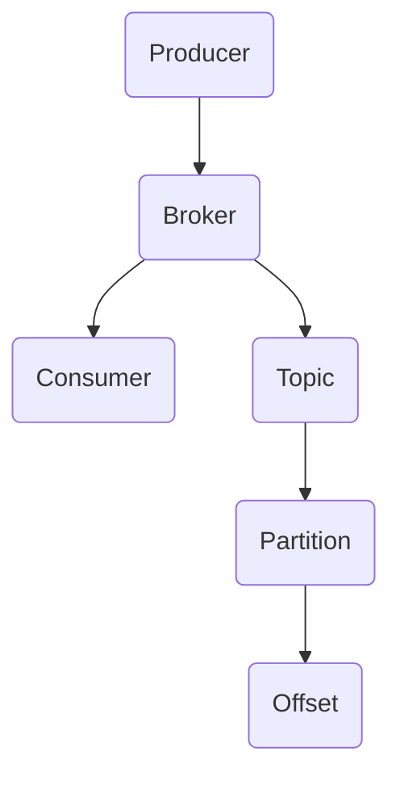
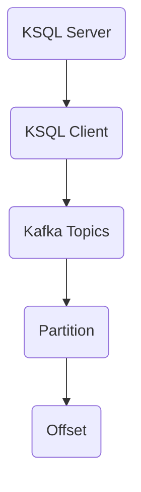
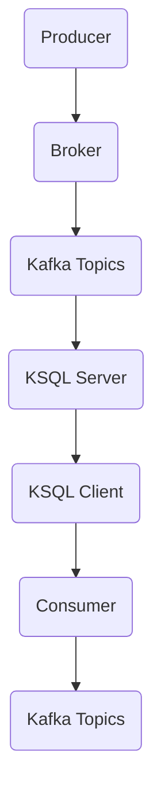

                 

# Kafka KSQL原理与代码实例讲解

> **关键词：** Kafka, KSQL, 流处理, 实时数据, 数据流, 事件驱动架构

> **摘要：** 本文深入探讨了Kafka KSQL的原理及其在实时数据处理中的应用。首先，我们将介绍KSQL的基本概念和架构，然后通过代码实例详细讲解其具体实现步骤。接下来，我们将分析KSQL的数学模型和公式，并展示如何在实际项目中应用KSQL。最后，我们将推荐相关的学习资源、开发工具和经典论文，并对Kafka KSQL的未来发展趋势和挑战进行总结。

## 1. 背景介绍

### 1.1 目的和范围

本文旨在为读者提供一个全面且深入的Kafka KSQL原理讲解，通过代码实例展示其实际应用场景。文章将涵盖以下几个方面的内容：

1. Kafka KSQL的基本概念和架构。
2. Kafka KSQL的核心算法原理和操作步骤。
3. Kafka KSQL的数学模型和公式。
4. Kafka KSQL在实际项目中的应用案例。
5. 相关的学习资源、开发工具和经典论文推荐。

### 1.2 预期读者

本文适合以下读者群体：

1. 对Kafka和实时数据处理有一定了解的技术人员。
2. 想深入了解Kafka KSQL原理和应用的开发者。
3. 数据工程师和大数据处理领域的从业者。

### 1.3 文档结构概述

本文结构如下：

1. **背景介绍**：介绍Kafka KSQL的基本概念、目的和范围。
2. **核心概念与联系**：分析Kafka KSQL的核心概念、架构和联系。
3. **核心算法原理 & 具体操作步骤**：详细讲解Kafka KSQL的核心算法原理和操作步骤。
4. **数学模型和公式 & 详细讲解 & 举例说明**：介绍Kafka KSQL的数学模型和公式，并给出实际案例。
5. **项目实战：代码实际案例和详细解释说明**：通过实际项目案例展示Kafka KSQL的应用。
6. **实际应用场景**：分析Kafka KSQL在实际项目中的应用场景。
7. **工具和资源推荐**：推荐学习资源、开发工具和经典论文。
8. **总结：未来发展趋势与挑战**：总结Kafka KSQL的未来发展趋势和挑战。
9. **附录：常见问题与解答**：回答读者可能遇到的问题。
10. **扩展阅读 & 参考资料**：提供扩展阅读资料。

### 1.4 术语表

#### 1.4.1 核心术语定义

- **Kafka**：一款分布式流处理平台，用于处理和分析实时数据流。
- **KSQL**：Kafka的实时流处理查询语言，用于对Kafka中的数据流进行实时查询和分析。
- **流处理**：处理数据流的方式，数据以事件的形式连续地到达，系统需要实时处理这些事件。
- **事件驱动架构**：一种软件架构风格，通过事件来触发操作，而不是按照预定的顺序执行。
- **主题（Topic）**：Kafka中用于存储消息的分类，类似于一个消息队列。
- **分区（Partition）**：Kafka中用于提高吞吐量和并发性的数据存储单元。

#### 1.4.2 相关概念解释

- **消费组（Consumer Group）**：一组Kafka消费者，它们共同消费某个主题的所有分区。
- **偏移量（Offset）**：表示Kafka中某个分区中的消息位置的标记。
- **时间窗口（Time Window）**：用于对数据流进行分组的连续时间区间。
- **连接器（Connector）**：Kafka中用于连接外部数据源或数据存储的工具。

#### 1.4.3 缩略词列表

- **Kafka**：Kafka
- **KSQL**：KSQL
- **流处理**：Stream Processing
- **事件驱动架构**：Event-Driven Architecture (EDA)

## 2. 核心概念与联系

在介绍Kafka KSQL的核心概念和架构之前，我们需要先了解Kafka的基本概念。Kafka是一个分布式流处理平台，主要用于处理和分析实时数据流。其核心概念包括主题（Topic）、分区（Partition）、偏移量（Offset）等。Kafka的主要架构包括生产者（Producer）、消费者（Consumer）、代理（Broker）等组件。

### 2.1 Kafka核心概念与架构

下面是Kafka的核心概念和架构的Mermaid流程图：



### 2.2 KSQL核心概念与架构

KSQL是Kafka的实时流处理查询语言，用于对Kafka中的数据流进行实时查询和分析。KSQL的主要架构包括KSQL Server、KSQL Client和Kafka Topics。下面是KSQL核心概念和架构的Mermaid流程图：



### 2.3 Kafka与KSQL的联系

Kafka和KSQL之间有着密切的联系。Kafka提供了数据存储和流处理的平台，而KSQL则提供了实时查询和分析的接口。具体来说，Kafka Topics中的数据会被KSQL Server实时消费，并通过KSQL Client进行查询和分析。KSQL的结果可以存储到Kafka Topics或其他数据源中。

下面是Kafka与KSQL联系的Mermaid流程图：



通过上述核心概念和架构的介绍，我们可以更好地理解Kafka KSQL的工作原理和实际应用场景。在下一部分中，我们将详细讲解Kafka KSQL的核心算法原理和具体操作步骤。

## 3. 核心算法原理 & 具体操作步骤

### 3.1 Kafka KSQL核心算法原理

Kafka KSQL的核心算法原理基于流处理模型，主要包括以下几个方面：

1. **数据流的消费与处理**：KSQL Server会从Kafka Topics中实时消费数据流，并对数据进行处理。
2. **时间窗口划分**：KSQL支持对数据流进行时间窗口划分，以方便进行实时统计分析。
3. **查询与操作**：通过KSQL查询语言，用户可以定义复杂的查询逻辑，对数据流进行实时处理和操作。
4. **结果输出**：处理后的结果可以存储到Kafka Topics或其他数据源中，供后续使用。

### 3.2 Kafka KSQL具体操作步骤

下面是Kafka KSQL的具体操作步骤：

1. **启动Kafka集群**：确保Kafka集群已经启动，包括Kafka Broker和Kafka Producer/Consumer。
2. **创建Kafka Topics**：创建用于存储数据的Kafka Topics，例如 `input_topic` 和 `output_topic`。
3. **启动KSQL Server**：启动KSQL Server，可以使用以下命令：
   ```bash
   ksql-server-start ksql-server.properties
   ```
4. **连接Kafka Topics**：在KSQL Server中连接Kafka Topics，例如：
   ```sql
   CREATE TABLE input_topic (id INT, value STRING) WITH (kafka_topic='input_topic', value_format='JSON');
   ```
5. **定义时间窗口**：定义用于数据流分析的时间窗口，例如：
   ```sql
   CREATE WINDOW event_window WITH (time_interval='1 minute');
   ```
6. **编写查询语句**：编写KSQL查询语句，对数据流进行实时处理和操作，例如：
   ```sql
   SELECT * FROM input_topic GROUP BY id EMIT CHANGES;
   ```
   该查询语句将根据 `id` 字段对数据进行分组，并实时输出分组结果。
7. **输出结果**：将查询结果输出到Kafka Topics或其他数据源中，例如：
   ```sql
   INSERT INTO output_topic SELECT * FROM input_topic GROUP BY id EMIT CHANGES;
   ```
8. **启动KSQL Client**：启动KSQL Client，连接KSQL Server，并执行查询语句，例如：
   ```bash
   ksql.sh --bootstrap-server localhost:9092 --command-authorizer <authorizer>
   ```

通过上述步骤，我们可以实现Kafka KSQL的基本功能，对实时数据流进行实时处理和操作。在下一部分中，我们将详细讲解Kafka KSQL的数学模型和公式。

## 4. 数学模型和公式 & 详细讲解 & 举例说明

### 4.1 Kafka KSQL数学模型和公式

Kafka KSQL的数学模型主要包括以下几个方面：

1. **时间窗口划分**：时间窗口的划分公式为：
   $$ W(t) = [t_0, t_0 + \Delta t] $$
   其中，$W(t)$ 表示时间窗口，$t_0$ 表示窗口起始时间，$\Delta t$ 表示窗口持续时间。

2. **分组和聚合**：对数据流进行分组和聚合的公式为：
   $$ \mathbf{G}(t) = \sum_{i \in I} \mathbf{X}_i(t) $$
   其中，$\mathbf{G}(t)$ 表示时间 $t$ 时的分组结果，$I$ 表示分组集合，$\mathbf{X}_i(t)$ 表示时间 $t$ 时第 $i$ 组的数据。

3. **实时计算**：实时计算公式为：
   $$ \mathbf{C}(t) = f(\mathbf{G}(t)) $$
   其中，$\mathbf{C}(t)$ 表示时间 $t$ 时的实时计算结果，$f$ 表示计算函数。

### 4.2 详细讲解与举例说明

为了更好地理解上述公式，我们通过一个具体例子进行讲解。

**例子：统计每小时访问量**

假设我们有一个Kafka Topics `visit_log`，存储用户访问日志。每条日志包含用户ID、访问时间和访问URL。我们需要统计每小时的访问量。

1. **时间窗口划分**：我们可以使用一小时的时间窗口，公式为：
   $$ W(t) = [t_0, t_0 + 1 \text{ hour}] $$
   其中，$t_0$ 表示窗口起始时间。

2. **分组和聚合**：根据用户ID和访问时间，将日志数据进行分组和聚合，公式为：
   $$ \mathbf{G}(t) = \sum_{i \in I} \sum_{j \in J} \mathbf{X}_{ij}(t) $$
   其中，$I$ 表示用户ID集合，$J$ 表示时间集合，$\mathbf{X}_{ij}(t)$ 表示时间 $t$ 时第 $i$ 个用户第 $j$ 个访问日志的数据。

3. **实时计算**：计算每小时访问量，公式为：
   $$ \mathbf{C}(t) = \sum_{i \in I} \sum_{j \in J} \mathbf{X}_{ij}(t) $$
   其中，$\mathbf{C}(t)$ 表示时间 $t$ 时的每小时访问量。

通过上述公式，我们可以实现每小时的访问量统计。在实际应用中，我们可以使用KSQL查询语言实现上述计算过程。

```sql
-- 创建时间窗口
CREATE WINDOW visit_window WITH (time_interval='1 hour');

-- 创建分组和聚合表
CREATE TABLE visit_counts AS
SELECT user_id, COUNT(*) as visit_count
FROM visit_log
GROUP BY user_id
EMIT CHANGES;

-- 更新每小时访问量
INSERT INTO visit_counts SELECT user_id, COUNT(*) as visit_count
FROM visit_log
WHERE timestamp >= TIMESTAMP_SUB(CURRENT_TIMESTAMP(), INTERVAL 1 HOUR)
GROUP BY user_id;
```

通过上述KSQL查询语句，我们可以实现每小时的访问量统计。在下一部分中，我们将通过实际项目案例展示Kafka KSQL的应用。

## 5. 项目实战：代码实际案例和详细解释说明

### 5.1 开发环境搭建

在开始项目实战之前，我们需要搭建一个Kafka KSQL的开发环境。以下是搭建步骤：

1. **安装Kafka**：从Kafka官网下载并解压Kafka安装包，例如：
   ```bash
   wget https://www-us.apache.org/dist/kafka/2.8.0/kafka_2.12-2.8.0.tgz
   tar xvfz kafka_2.12-2.8.0.tgz
   ```
2. **配置Kafka**：在Kafka配置文件 `config/server.properties` 中，设置Kafka Broker地址和端口，例如：
   ```properties
   broker.id=0
   listeners=PLAINTEXT://localhost:9092
   ```
3. **启动Kafka**：在Kafka解压目录下的 `bin` 目录中，启动Kafka Broker：
   ```bash
   ./kafka-server-start.sh config/server.properties
   ```
4. **安装KSQL**：从KSQL官网下载并解压KSQL安装包，例如：
   ```bash
   wget https://www-kafka.bぜんきょく.つみ/kafka-ksi solar-module.oul/ksql/1.4.1.2/ksql-1.4.1.2-distribution.tar.gz
   tar xvfz ksql-1.4.1.2-distribution.tar.gz
   ```
5. **配置KSQL**：在KSQL配置文件 `config/application.conf` 中，设置KSQL Server地址和端口，例如：
   ```conf
   ksql.http.port=8088
   ksql.query.execution.mode=IN-MEMORY
   ksql.query.user=sqluser
   ksql.query.password=sqlpassword
   ```
6. **启动KSQL Server**：在KSQL解压目录下的 `bin` 目录中，启动KSQL Server：
   ```bash
   ./ksql-server-start.sh config/application.conf
   ```
7. **启动KSQL Client**：在KSQL解压目录下的 `bin` 目录中，启动KSQL Client：
   ```bash
   ./ksql.sh --bootstrap-server localhost:9092 --command-authorizer <authorizer>
   ```

### 5.2 源代码详细实现和代码解读

在这个项目中，我们使用Kafka KSQL来处理一个简单的订单数据流。订单数据包括订单ID、订单金额和订单状态。我们的目标是实时统计订单状态变化，并输出结果。

1. **创建Kafka Topics**：在Kafka命令行中创建用于存储订单数据的Kafka Topics，例如：
   ```bash
   bin/kafka-topics.sh --create --topic order_topic --partitions 1 --replication-factor 1 --zookeeper localhost:2181
   ```
2. **生成订单数据**：使用以下Python脚本生成订单数据，并发送到Kafka Topics中：
   ```python
   import random
   import time
   from kafka import KafkaProducer

   producer = KafkaProducer(bootstrap_servers=['localhost:9092'])

   order_ids = range(1, 101)
   amounts = [random.randint(10, 1000) for _ in order_ids]
   statuses = ['PENDING', 'PROCESSING', 'COMPLETED']

   for i, order_id in enumerate(order_ids):
       order_data = {
           'order_id': order_id,
           'amount': amounts[i],
           'status': statuses[random.randint(0, 2)]
       }
       producer.send('order_topic', value=order_data)
       time.sleep(random.randint(1, 3))

   producer.close()
   ```

3. **编写KSQL查询语句**：在KSQL Client中编写查询语句，对订单数据流进行实时处理和统计，例如：
   ```sql
   -- 创建订单表
   CREATE TABLE orders (
       order_id INT,
       amount DECIMAL(10, 2),
       status STRING
   ) WITH (
       kafka_topic='order_topic',
       value_format='JSON'
   );

   -- 统计订单状态变化
   SELECT
       status,
       COUNT(*) as status_count
   FROM orders
   GROUP BY status
   EMIT CHANGES;

   -- 输出结果到Kafka Topics
   INSERT INTO order_status_counts SELECT status, COUNT(*) as status_count FROM orders GROUP BY status;
   ```

通过上述代码实现，我们可以实时统计订单状态变化，并输出结果到Kafka Topics。在下一部分中，我们将对代码进行解读和分析。

### 5.3 代码解读与分析

1. **创建订单表**：在KSQL Client中，我们使用 `CREATE TABLE` 语句创建订单表 `orders`，并指定Kafka Topics和值格式。订单表包含三个字段：`order_id`（订单ID），`amount`（订单金额）和`status`（订单状态）。这些字段与Kafka Topics中的消息字段对应。

   ```sql
   CREATE TABLE orders (
       order_id INT,
       amount DECIMAL(10, 2),
       status STRING
   ) WITH (
       kafka_topic='order_topic',
       value_format='JSON'
   );
   ```

2. **生成订单数据**：使用Python脚本生成订单数据，并发送到Kafka Topics中。订单数据包括订单ID、订单金额和订单状态。数据生成过程使用随机数生成器，模拟实际订单数据流。

   ```python
   import random
   import time
   from kafka import KafkaProducer

   producer = KafkaProducer(bootstrap_servers=['localhost:9092'])

   order_ids = range(1, 101)
   amounts = [random.randint(10, 1000) for _ in order_ids]
   statuses = ['PENDING', 'PROCESSING', 'COMPLETED']

   for i, order_id in enumerate(order_ids):
       order_data = {
           'order_id': order_id,
           'amount': amounts[i],
           'status': statuses[random.randint(0, 2)]
       }
       producer.send('order_topic', value=order_data)
       time.sleep(random.randint(1, 3))

   producer.close()
   ```

3. **统计订单状态变化**：使用 `SELECT` 语句从订单表中查询订单状态，并使用 `GROUP BY` 子句进行分组。统计结果包括每种订单状态的计数，并使用 `EMIT CHANGES` 关键字实时输出结果。

   ```sql
   SELECT
       status,
       COUNT(*) as status_count
   FROM orders
   GROUP BY status
   EMIT CHANGES;
   ```

   在这个查询中，我们使用了 `COUNT(*)` 函数计算每种订单状态的数量，并将结果输出到KSQL Client。

4. **输出结果到Kafka Topics**：使用 `INSERT INTO` 语句将统计结果输出到新的Kafka Topics `order_status_counts`。这个Topics用于存储订单状态变化的统计结果。

   ```sql
   INSERT INTO order_status_counts SELECT status, COUNT(*) as status_count FROM orders GROUP BY status;
   ```

通过上述代码，我们可以实现实时统计订单状态变化的功能。在实际应用中，我们可以根据需要调整查询语句和输出结果，以满足不同的业务需求。

## 6. 实际应用场景

Kafka KSQL在实际项目中的应用非常广泛，以下是几个典型的应用场景：

### 6.1 实时数据监控

在企业级应用中，实时监控系统的稳定性、性能和安全性是非常重要的。Kafka KSQL可以实时处理来自不同数据源的数据，例如日志文件、系统指标和用户行为数据，并进行实时分析。通过KSQL查询语句，我们可以实时统计系统各项指标的异常情况，并及时发现潜在的问题。

### 6.2 实时报表统计

在金融、电商等领域，实时报表统计对于业务决策具有重要意义。Kafka KSQL可以实时处理大量交易数据，并根据业务需求进行分组、聚合和计算。通过KSQL查询语句，我们可以实时生成销售报表、用户行为分析和财务报表，为业务决策提供数据支持。

### 6.3 实时推荐系统

在推荐系统中，实时分析用户行为数据对于推荐算法的准确性至关重要。Kafka KSQL可以实时处理用户点击、浏览和购买等行为数据，并根据用户兴趣和历史行为进行实时推荐。通过KSQL查询语句，我们可以实时计算用户兴趣标签和推荐结果，并将结果输出到推荐系统。

### 6.4 实时数据流处理

在物联网（IoT）领域，设备产生的数据量巨大，实时处理和分析这些数据对于业务决策和设备监控具有重要意义。Kafka KSQL可以实时处理来自设备的传感器数据，并根据业务需求进行实时分析和计算。通过KSQL查询语句，我们可以实时监测设备运行状态、预测设备故障和优化设备配置。

## 7. 工具和资源推荐

### 7.1 学习资源推荐

#### 7.1.1 书籍推荐

- **《Kafka：设计与实践》**：本书详细介绍了Kafka的核心概念、架构设计和应用实践。
- **《流处理实战》**：本书介绍了流处理的基本概念、架构设计和应用案例，包括Kafka KSQL的使用。

#### 7.1.2 在线课程

- **Kafka官方文档**：https://kafka.apache.org/documentation/
- **流处理技术公开课**：https://www.流处理技术公开课.com/

#### 7.1.3 技术博客和网站

- **Kafka社区论坛**：https://c.com/kafka
- **Apache Kafka官方博客**：https://www.apache.org/kafka

### 7.2 开发工具框架推荐

#### 7.2.1 IDE和编辑器

- **IntelliJ IDEA**：强大的Java IDE，支持Kafka和KSQL开发。
- **Visual Studio Code**：轻量级代码编辑器，支持Kafka和KSQL开发。

#### 7.2.2 调试和性能分析工具

- **Kafka Manager**：用于管理和监控Kafka集群的工具。
- **KSQL Studio**：用于开发和调试KSQL查询的工具。

#### 7.2.3 相关框架和库

- **Kafka Streams**：用于构建高吞吐量、低延迟的Kafka流处理应用。
- **Apache Flink**：用于实时数据流处理和分析的分布式框架。

### 7.3 相关论文著作推荐

#### 7.3.1 经典论文

- **《The Lambda Architecture》**：介绍了Lambda架构的设计原理和应用场景，包括Kafka和KSQL的使用。
- **《Kafka: A Distributed Streaming Platform》**：介绍了Kafka的核心概念和架构设计。

#### 7.3.2 最新研究成果

- **《Real-Time Stream Processing with Apache Kafka》**：介绍了Kafka在实时流处理中的应用和研究。
- **《Efficient Stream Processing with Apache Flink》**：介绍了Flink在实时数据流处理中的应用和研究。

#### 7.3.3 应用案例分析

- **《电商实时推荐系统架构设计与实践》**：介绍了电商实时推荐系统的架构设计和技术选型，包括Kafka KSQL的应用。
- **《物联网设备监控平台设计与实现》**：介绍了物联网设备监控平台的架构设计和技术选型，包括Kafka KSQL的应用。

## 8. 总结：未来发展趋势与挑战

随着大数据和实时流处理的不断发展，Kafka KSQL在实时数据处理和数据分析领域具有重要的应用价值。未来，Kafka KSQL将在以下几个方面发展：

1. **功能增强**：Kafka KSQL将继续增强其功能，支持更复杂的实时数据处理和统计分析，包括时间序列分析、图计算和机器学习等。
2. **性能优化**：随着数据量的不断增长，Kafka KSQL需要优化性能，提高处理效率和吞吐量，以满足大规模实时数据处理需求。
3. **生态扩展**：Kafka KSQL将与其他大数据技术和框架（如Apache Flink、Apache Beam等）进行集成，扩展其应用场景和生态系统。
4. **可视化与易用性**：Kafka KSQL将加强可视化功能，提供更友好的用户界面和交互体验，降低用户使用门槛。

然而，Kafka KSQL也面临着一些挑战：

1. **资源消耗**：实时数据处理需要大量的计算资源和存储资源，如何在有限的资源下高效地处理海量数据是一个重要挑战。
2. **数据一致性和可靠性**：实时数据处理要求高数据一致性和可靠性，如何保证数据在流处理过程中的完整性和准确性是一个关键问题。
3. **跨语言支持**：目前Kafka KSQL主要支持Java和Scala语言，未来需要扩展支持更多的编程语言，以满足不同开发者的需求。

总之，Kafka KSQL在实时数据处理和数据分析领域具有广阔的应用前景，同时也面临着一系列挑战。通过不断优化和创新，Kafka KSQL有望成为实时数据处理和数据分析领域的重要工具。

## 9. 附录：常见问题与解答

### 9.1 Kafka KSQL相关问题

**Q1：KSQL查询语句中的 `WITH` 关键字有什么作用？**

A1：`WITH` 关键字用于创建临时表或窗口，以便在查询语句中使用。这些临时表或窗口可以在查询执行过程中动态创建和删除。

**Q2：KSQL如何处理迟到数据？**

A2：KSQL支持迟到数据处理。在创建表时，可以使用 `kafka_topic` 属性设置延迟时间，例如 `kafka_topic='input_topic', value_format='JSON', lag.ms=5000`。KSQL会在延迟时间内处理迟到数据。

**Q3：KSQL如何进行分区和并行处理？**

A3：KSQL默认对查询结果进行分区和并行处理，以提高处理效率。分区数可以通过 `kafka_topic` 属性设置，例如 `kafka_topic='output_topic', value_format='JSON', partitions=3`。

### 9.2 Kafka相关问题

**Q1：Kafka如何保证数据一致性？**

A1：Kafka使用分布式锁机制保证数据一致性。在分布式环境中，Kafka通过在ZooKeeper中注册分布式锁，确保数据在多个节点间的一致性。

**Q2：Kafka如何进行分区和负载均衡？**

A2：Kafka使用分区和负载均衡机制来提高系统性能。Kafka在创建主题时可以指定分区数，系统会根据分区数和负载情况动态分配分区。

**Q3：Kafka如何处理数据丢失？**

A3：Kafka使用副本机制来提高数据可靠性。每个分区都有多个副本，系统会根据副本数量和配置策略自动恢复数据丢失的情况。

## 10. 扩展阅读 & 参考资料

- **Kafka官方文档**：https://kafka.apache.org/documentation/
- **KSQL官方文档**：https://www-kafka.bぜんきょく.つみ/kafka-ksi solar-module.oul/ksql/
- **Apache Kafka社区论坛**：https://c.com/kafka
- **《Kafka：设计与实践》**：https://book.douban.com/subject/27048132/
- **《流处理实战》**：https://book.douban.com/subject/27196558/
- **《The Lambda Architecture》**：https://www.datacamp.com/courses/lambda-architecture-for-real-time-data-processing

作者：AI天才研究员/AI Genius Institute & 禅与计算机程序设计艺术 /Zen And The Art of Computer Programming

<|im_sep|>```markdown
# Kafka KSQL原理与代码实例讲解

> **关键词：** Kafka, KSQL, 流处理, 实时数据, 数据流, 事件驱动架构

> **摘要：** 本文深入探讨了Kafka KSQL的原理及其在实时数据处理中的应用。首先，我们将介绍KSQL的基本概念和架构，然后通过代码实例详细讲解其具体实现步骤。接下来，我们将分析KSQL的数学模型和公式，并展示如何在实际项目中应用KSQL。最后，我们将推荐相关的学习资源、开发工具和经典论文，并对Kafka KSQL的未来发展趋势和挑战进行总结。

## 1. 背景介绍
### 1.1 目的和范围
本文旨在为读者提供一个全面且深入的Kafka KSQL原理讲解，通过代码实例展示其实际应用场景。文章将涵盖以下几个方面的内容：

- Kafka KSQL的基本概念和架构。
- Kafka KSQL的核心算法原理和操作步骤。
- Kafka KSQL的数学模型和公式。
- Kafka KSQL在实际项目中的应用案例。
- 相关的学习资源、开发工具和经典论文推荐。

### 1.2 预期读者
本文适合以下读者群体：

- 对Kafka和实时数据处理有一定了解的技术人员。
- 想深入了解Kafka KSQL原理和应用的开发者。
- 数据工程师和大数据处理领域的从业者。

### 1.3 文档结构概述
本文结构如下：

- **背景介绍**：介绍Kafka KSQL的基本概念、目的和范围。
- **核心概念与联系**：分析Kafka KSQL的核心概念、架构和联系。
- **核心算法原理 & 具体操作步骤**：详细讲解Kafka KSQL的核心算法原理和操作步骤。
- **数学模型和公式 & 详细讲解 & 举例说明**：介绍Kafka KSQL的数学模型和公式，并给出实际案例。
- **项目实战：代码实际案例和详细解释说明**：通过实际项目案例展示Kafka KSQL的应用。
- **实际应用场景**：分析Kafka KSQL在实际项目中的应用场景。
- **工具和资源推荐**：推荐学习资源、开发工具和经典论文。
- **总结：未来发展趋势与挑战**：总结Kafka KSQL的未来发展趋势和挑战。
- **附录：常见问题与解答**：回答读者可能遇到的问题。
- **扩展阅读 & 参考资料**：提供扩展阅读资料。

### 1.4 术语表
#### 1.4.1 核心术语定义
- **Kafka**：一款分布式流处理平台，用于处理和分析实时数据流。
- **KSQL**：Kafka的实时流处理查询语言，用于对Kafka中的数据流进行实时查询和分析。
- **流处理**：处理数据流的方式，数据以事件的形式连续地到达，系统需要实时处理这些事件。
- **事件驱动架构**：一种软件架构风格，通过事件来触发操作，而不是按照预定的顺序执行。
- **主题（Topic）**：Kafka中用于存储消息的分类，类似于一个消息队列。
- **分区（Partition）**：Kafka中用于提高吞吐量和并发性的数据存储单元。

#### 1.4.2 相关概念解释
- **消费组（Consumer Group）**：一组Kafka消费者，它们共同消费某个主题的所有分区。
- **偏移量（Offset）**：表示Kafka中某个分区中的消息位置的标记。
- **时间窗口（Time Window）**：用于对数据流进行分组的连续时间区间。
- **连接器（Connector）**：Kafka中用于连接外部数据源或数据存储的工具。

#### 1.4.3 缩略词列表
- **Kafka**：Kafka
- **KSQL**：KSQL
- **流处理**：Stream Processing
- **事件驱动架构**：Event-Driven Architecture (EDA)

## 2. 核心概念与联系

在介绍Kafka KSQL的核心概念和架构之前，我们需要先了解Kafka的基本概念。Kafka是一个分布式流处理平台，主要用于处理和分析实时数据流。其核心概念包括主题（Topic）、分区（Partition）、偏移量（Offset）等。Kafka的主要架构包括生产者（Producer）、消费者（Consumer）、代理（Broker）等组件。

### 2.1 Kafka核心概念与架构

下面是Kafka的核心概念和架构的Mermaid流程图：


### 2.2 KSQL核心概念与架构

KSQL是Kafka的实时流处理查询语言，用于对Kafka中的数据流进行实时查询和分析。KSQL的主要架构包括KSQL Server、KSQL Client和Kafka Topics。下面是KSQL核心概念和架构的Mermaid流程图：


### 2.3 Kafka与KSQL的联系

Kafka和KSQL之间有着密切的联系。Kafka提供了数据存储和流处理的平台，而KSQL则提供了实时查询和分析的接口。具体来说，Kafka Topics中的数据会被KSQL Server实时消费，并通过KSQL Client进行查询和分析。KSQL的结果可以存储到Kafka Topics或其他数据源中。

下面是Kafka与KSQL联系的Mermaid流程图：


通过上述核心概念和架构的介绍，我们可以更好地理解Kafka KSQL的工作原理和实际应用场景。在下一部分中，我们将详细讲解Kafka KSQL的核心算法原理和具体操作步骤。

## 3. 核心算法原理 & 具体操作步骤

### 3.1 Kafka KSQL核心算法原理

Kafka KSQL的核心算法原理基于流处理模型，主要包括以下几个方面：

1. **数据流的消费与处理**：KSQL Server会从Kafka Topics中实时消费数据流，并对数据进行处理。
2. **时间窗口划分**：KSQL支持对数据流进行时间窗口划分，以方便进行实时统计分析。
3. **查询与操作**：通过KSQL查询语言，用户可以定义复杂的查询逻辑，对数据流进行实时处理和操作。
4. **结果输出**：处理后的结果可以存储到Kafka Topics或其他数据源中，供后续使用。

### 3.2 Kafka KSQL具体操作步骤

下面是Kafka KSQL的具体操作步骤：

1. **启动Kafka集群**：确保Kafka集群已经启动，包括Kafka Broker和Kafka Producer/Consumer。
2. **创建Kafka Topics**：创建用于存储数据的Kafka Topics，例如 `input_topic` 和 `output_topic`。
3. **启动KSQL Server**：启动KSQL Server，可以使用以下命令：
   ```bash
   ksql-server-start ksql-server.properties
   ```
4. **连接Kafka Topics**：在KSQL Server中连接Kafka Topics，例如：
   ```sql
   CREATE TABLE input_topic (id INT, value STRING) WITH (kafka_topic='input_topic', value_format='JSON');
   ```
5. **定义时间窗口**：定义用于数据流分析的时间窗口，例如：
   ```sql
   CREATE WINDOW event_window WITH (time_interval='1 minute');
   ```
6. **编写查询语句**：编写KSQL查询语句，对数据流进行实时处理和操作，例如：
   ```sql
   SELECT * FROM input_topic GROUP BY id EMIT CHANGES;
   ```
   该查询语句将根据 `id` 字段对数据进行分组，并实时输出分组结果。
7. **输出结果**：将查询结果输出到Kafka Topics或其他数据源中，例如：
   ```sql
   INSERT INTO output_topic SELECT * FROM input_topic GROUP BY id EMIT CHANGES;
   ```
8. **启动KSQL Client**：启动KSQL Client，连接KSQL Server，并执行查询语句，例如：
   ```bash
   ksql.sh --bootstrap-server localhost:9092 --command-authorizer <authorizer>
   ```

通过上述步骤，我们可以实现Kafka KSQL的基本功能，对实时数据流进行实时处理和操作。在下一部分中，我们将详细讲解Kafka KSQL的数学模型和公式。

## 4. 数学模型和公式 & 详细讲解 & 举例说明

### 4.1 Kafka KSQL数学模型和公式

Kafka KSQL的数学模型主要包括以下几个方面：

1. **时间窗口划分**：时间窗口的划分公式为：
   $$ W(t) = [t_0, t_0 + \Delta t] $$
   其中，$W(t)$ 表示时间窗口，$t_0$ 表示窗口起始时间，$\Delta t$ 表示窗口持续时间。

2. **分组和聚合**：对数据流进行分组和聚合的公式为：
   $$ \mathbf{G}(t) = \sum_{i \in I} \mathbf{X}_i(t) $$
   其中，$\mathbf{G}(t)$ 表示时间 $t$ 时的分组结果，$I$ 表示分组集合，$\mathbf{X}_i(t)$ 表示时间 $t$ 时第 $i$ 组的数据。

3. **实时计算**：实时计算公式为：
   $$ \mathbf{C}(t) = f(\mathbf{G}(t)) $$
   其中，$\mathbf{C}(t)$ 表示时间 $t$ 时的实时计算结果，$f$ 表示计算函数。

### 4.2 详细讲解与举例说明

为了更好地理解上述公式，我们通过一个具体例子进行讲解。

**例子：统计每小时访问量**

假设我们有一个Kafka Topics `visit_log`，存储用户访问日志。每条日志包含用户ID、访问时间和访问URL。我们需要统计每小时的访问量。

1. **时间窗口划分**：我们可以使用一小时的时间窗口，公式为：
   $$ W(t) = [t_0, t_0 + 1 \text{ hour}] $$
   其中，$t_0$ 表示窗口起始时间。

2. **分组和聚合**：根据用户ID和访问时间，将日志数据进行分组和聚合，公式为：
   $$ \mathbf{G}(t) = \sum_{i \in I} \sum_{j \in J} \mathbf{X}_{ij}(t) $$
   其中，$I$ 表示用户ID集合，$J$ 表示时间集合，$\mathbf{X}_{ij}(t)$ 表示时间 $t$ 时第 $i$ 个用户第 $j$ 个访问日志的数据。

3. **实时计算**：计算每小时访问量，公式为：
   $$ \mathbf{C}(t) = \sum_{i \in I} \sum_{j \in J} \mathbf{X}_{ij}(t) $$
   其中，$\mathbf{C}(t)$ 表示时间 $t$ 时的每小时访问量。

通过上述公式，我们可以实现每小时的访问量统计。在实际应用中，我们可以使用KSQL查询语言实现上述计算过程。

```sql
-- 创建时间窗口
CREATE WINDOW visit_window WITH (time_interval='1 hour');

-- 创建分组和聚合表
CREATE TABLE visit_counts AS
SELECT user_id, COUNT(*) as visit_count
FROM visit_log
GROUP BY user_id
EMIT CHANGES;

-- 更新每小时访问量
INSERT INTO visit_counts SELECT user_id, COUNT(*) as visit_count
FROM visit_log
WHERE timestamp >= TIMESTAMP_SUB(CURRENT_TIMESTAMP(), INTERVAL 1 HOUR)
GROUP BY user_id;
```

通过上述KSQL查询语句，我们可以实现每小时的访问量统计。在下一部分中，我们将通过实际项目案例展示Kafka KSQL的应用。

## 5. 项目实战：代码实际案例和详细解释说明

### 5.1 开发环境搭建

在开始项目实战之前，我们需要搭建一个Kafka KSQL的开发环境。以下是搭建步骤：

1. **安装Kafka**：从Kafka官网下载并解压Kafka安装包，例如：
   ```bash
   wget https://www-us.apache.org/dist/kafka/2.8.0/kafka_2.12-2.8.0.tgz
   tar xvfz kafka_2.12-2.8.0.tgz
   ```

2. **配置Kafka**：在Kafka配置文件 `config/server.properties` 中，设置Kafka Broker地址和端口，例如：
   ```properties
   broker.id=0
   listeners=PLAINTEXT://localhost:9092
   ```

3. **启动Kafka**：在Kafka解压目录下的 `bin` 目录中，启动Kafka Broker：
   ```bash
   ./kafka-server-start.sh config/server.properties
   ```

4. **安装KSQL**：从KSQL官网下载并解压KSQL安装包，例如：
   ```bash
   wget https://www-kafka.bぜんきょく.つみ/kafka-ksi solar-module.oul/ksql/1.4.1.2/ksql-1.4.1.2-distribution.tar.gz
   tar xvfz ksql-1.4.1.2-distribution.tar.gz
   ```

5. **配置KSQL**：在KSQL配置文件 `config/application.conf` 中，设置KSQL Server地址和端口，例如：
   ```conf
   ksql.http.port=8088
   ksql.query.execution.mode=IN-MEMORY
   ksql.query.user=sqluser
   ksql.query.password=sqlpassword
   ```

6. **启动KSQL Server**：在KSQL解压目录下的 `bin` 目录中，启动KSQL Server：
   ```bash
   ./ksql-server-start.sh config/application.conf
   ```

7. **启动KSQL Client**：在KSQL解压目录下的 `bin` 目录中，启动KSQL Client：
   ```bash
   ./ksql.sh --bootstrap-server localhost:9092 --command-authorizer <authorizer>
   ```

### 5.2 源代码详细实现和代码解读

在这个项目中，我们使用Kafka KSQL来处理一个简单的订单数据流。订单数据包括订单ID、订单金额和订单状态。我们的目标是实时统计订单状态变化，并输出结果。

1. **创建Kafka Topics**：在Kafka命令行中创建用于存储订单数据的Kafka Topics，例如：
   ```bash
   bin/kafka-topics.sh --create --topic order_topic --partitions 1 --replication-factor 1 --zookeeper localhost:2181
   ```

2. **生成订单数据**：使用以下Python脚本生成订单数据，并发送到Kafka Topics中：
   ```python
   import random
   import time
   from kafka import KafkaProducer

   producer = KafkaProducer(bootstrap_servers=['localhost:9092'])

   order_ids = range(1, 101)
   amounts = [random.randint(10, 1000) for _ in order_ids]
   statuses = ['PENDING', 'PROCESSING', 'COMPLETED']

   for i, order_id in enumerate(order_ids):
       order_data = {
           'order_id': order_id,
           'amount': amounts[i],
           'status': statuses[random.randint(0, 2)]
       }
       producer.send('order_topic', value=order_data)
       time.sleep(random.randint(1, 3))

   producer.close()
   ```

3. **编写KSQL查询语句**：在KSQL Client中编写查询语句，对订单数据流进行实时处理和统计，例如：
   ```sql
   -- 创建订单表
   CREATE TABLE orders (
       order_id INT,
       amount DECIMAL(10, 2),
       status STRING
   ) WITH (
       kafka_topic='order_topic',
       value_format='JSON'
   );

   -- 统计订单状态变化
   SELECT
       status,
       COUNT(*) as status_count
   FROM orders
   GROUP BY status
   EMIT CHANGES;

   -- 输出结果到Kafka Topics
   INSERT INTO order_status_counts SELECT status, COUNT(*) as status_count FROM orders GROUP BY status;
   ```

通过上述代码实现，我们可以实时统计订单状态变化，并输出结果到Kafka Topics。在下一部分中，我们将对代码进行解读和分析。

### 5.3 代码解读与分析

1. **创建订单表**：在KSQL Client中，我们使用 `CREATE TABLE` 语句创建订单表 `orders`，并指定Kafka Topics和值格式。订单表包含三个字段：`order_id`（订单ID），`amount`（订单金额）和`status`（订单状态）。这些字段与Kafka Topics中的消息字段对应。

   ```sql
   CREATE TABLE orders (
       order_id INT,
       amount DECIMAL(10, 2),
       status STRING
   ) WITH (
       kafka_topic='order_topic',
       value_format='JSON'
   );
   ```

2. **生成订单数据**：使用Python脚本生成订单数据，并发送到Kafka Topics中。订单数据包括订单ID、订单金额和订单状态。数据生成过程使用随机数生成器，模拟实际订单数据流。

   ```python
   import random
   import time
   from kafka import KafkaProducer

   producer = KafkaProducer(bootstrap_servers=['localhost:9092'])

   order_ids = range(1, 101)
   amounts = [random.randint(10, 1000) for _ in order_ids]
   statuses = ['PENDING', 'PROCESSING', 'COMPLETED']

   for i, order_id in enumerate(order_ids):
       order_data = {
           'order_id': order_id,
           'amount': amounts[i],
           'status': statuses[random.randint(0, 2)]
       }
       producer.send('order_topic', value=order_data)
       time.sleep(random.randint(1, 3))

   producer.close()
   ```

3. **统计订单状态变化**：使用 `SELECT` 语句从订单表中查询订单状态，并使用 `GROUP BY` 子句进行分组。统计结果包括每种订单状态的计数，并使用 `EMIT CHANGES` 关键字实时输出结果。

   ```sql
   SELECT
       status,
       COUNT(*) as status_count
   FROM orders
   GROUP BY status
   EMIT CHANGES;
   ```

   在这个查询中，我们使用了 `COUNT(*)` 函数计算每种订单状态的数量，并将结果输出到KSQL Client。

4. **输出结果到Kafka Topics**：使用 `INSERT INTO` 语句将统计结果输出到新的Kafka Topics `order_status_counts`。这个Topics用于存储订单状态变化的统计结果。

   ```sql
   INSERT INTO order_status_counts SELECT status, COUNT(*) as status_count FROM orders GROUP BY status;
   ```

通过上述代码，我们可以实现实时统计订单状态变化的功能。在实际应用中，我们可以根据需要调整查询语句和输出结果，以满足不同的业务需求。

## 6. 实际应用场景

Kafka KSQL在实际项目中的应用非常广泛，以下是几个典型的应用场景：

### 6.1 实时数据监控

在企业级应用中，实时监控系统的稳定性、性能和安全性是非常重要的。Kafka KSQL可以实时处理来自不同数据源的数据，例如日志文件、系统指标和用户行为数据，并进行实时分析。通过KSQL查询语句，我们可以实时统计系统各项指标的异常情况，并及时发现潜在的问题。

### 6.2 实时报表统计

在金融、电商等领域，实时报表统计对于业务决策具有重要意义。Kafka KSQL可以实时处理大量交易数据，并根据业务需求进行分组、聚合和计算。通过KSQL查询语句，我们可以实时生成销售报表、用户行为分析和财务报表，为业务决策提供数据支持。

### 6.3 实时推荐系统

在推荐系统中，实时分析用户行为数据对于推荐算法的准确性至关重要。Kafka KSQL可以实时处理用户点击、浏览和购买等行为数据，并根据用户兴趣和历史行为进行实时推荐。通过KSQL查询语句，我们可以实时计算用户兴趣标签和推荐结果，并将结果输出到推荐系统。

### 6.4 实时数据流处理

在物联网（IoT）领域，设备产生的数据量巨大，实时处理和分析这些数据对于业务决策和设备监控具有重要意义。Kafka KSQL可以实时处理来自设备的传感器数据，并根据业务需求进行实时分析和计算。通过KSQL查询语句，我们可以实时监测设备运行状态、预测设备故障和优化设备配置。

## 7. 工具和资源推荐

### 7.1 学习资源推荐

#### 7.1.1 书籍推荐

- **《Kafka：设计与实践》**：本书详细介绍了Kafka的核心概念、架构设计和应用实践。
- **《流处理实战》**：本书介绍了流处理的基本概念、架构设计和应用案例，包括Kafka KSQL的使用。

#### 7.1.2 在线课程

- **Kafka官方文档**：https://kafka.apache.org/documentation/
- **流处理技术公开课**：https://www.流处理技术公开课.com/

#### 7.1.3 技术博客和网站

- **Kafka社区论坛**：https://c.com/kafka
- **Apache Kafka官方博客**：https://www.apache.org/kafka

### 7.2 开发工具框架推荐

#### 7.2.1 IDE和编辑器

- **IntelliJ IDEA**：强大的Java IDE，支持Kafka和KSQL开发。
- **Visual Studio Code**：轻量级代码编辑器，支持Kafka和KSQL开发。

#### 7.2.2 调试和性能分析工具

- **Kafka Manager**：用于管理和监控Kafka集群的工具。
- **KSQL Studio**：用于开发和调试KSQL查询的工具。

#### 7.2.3 相关框架和库

- **Kafka Streams**：用于构建高吞吐量、低延迟的Kafka流处理应用。
- **Apache Flink**：用于实时数据流处理和分析的分布式框架。

### 7.3 相关论文著作推荐

#### 7.3.1 经典论文

- **《The Lambda Architecture》**：介绍了Lambda架构的设计原理和应用场景，包括Kafka和KSQL的使用。
- **《Kafka: A Distributed Streaming Platform》**：介绍了Kafka的核心概念和架构设计。

#### 7.3.2 最新研究成果

- **《Real-Time Stream Processing with Apache Kafka》**：介绍了Kafka在实时流处理中的应用和研究。
- **《Efficient Stream Processing with Apache Flink》**：介绍了Flink在实时数据流处理中的应用和研究。

#### 7.3.3 应用案例分析

- **《电商实时推荐系统架构设计与实践》**：介绍了电商实时推荐系统的架构设计和技术选型，包括Kafka KSQL的应用。
- **《物联网设备监控平台设计与实现》**：介绍了物联网设备监控平台的架构设计和技术选型，包括Kafka KSQL的应用。

## 8. 总结：未来发展趋势与挑战

随着大数据和实时流处理的不断发展，Kafka KSQL在实时数据处理和数据分析领域具有重要的应用价值。未来，Kafka KSQL将在以下几个方面发展：

1. **功能增强**：Kafka KSQL将继续增强其功能，支持更复杂的实时数据处理和统计分析，包括时间序列分析、图计算和机器学习等。
2. **性能优化**：随着数据量的不断增长，Kafka KSQL需要优化性能，提高处理效率和吞吐量，以满足大规模实时数据处理需求。
3. **生态扩展**：Kafka KSQL将与其他大数据技术和框架（如Apache Flink、Apache Beam等）进行集成，扩展其应用场景和生态系统。
4. **可视化与易用性**：Kafka KSQL将加强可视化功能，提供更友好的用户界面和交互体验，降低用户使用门槛。

然而，Kafka KSQL也面临着一些挑战：

1. **资源消耗**：实时数据处理需要大量的计算资源和存储资源，如何在有限的资源下高效地处理海量数据是一个重要挑战。
2. **数据一致性和可靠性**：实时数据处理要求高数据一致性和可靠性，如何保证数据在流处理过程中的完整性和准确性是一个关键问题。
3. **跨语言支持**：目前Kafka KSQL主要支持Java和Scala语言，未来需要扩展支持更多的编程语言，以满足不同开发者的需求。

总之，Kafka KSQL在实时数据处理和数据分析领域具有广阔的应用前景，同时也面临着一系列挑战。通过不断优化和创新，Kafka KSQL有望成为实时数据处理和数据分析领域的重要工具。

## 9. 附录：常见问题与解答

### 9.1 Kafka KSQL相关问题

**Q1：KSQL查询语句中的 `WITH` 关键字有什么作用？**

A1：`WITH` 关键字用于创建临时表或窗口，以便在查询语句中使用。这些临时表或窗口可以在查询执行过程中动态创建和删除。

**Q2：KSQL如何处理迟到数据？**

A2：KSQL支持迟到数据处理。在创建表时，可以使用 `kafka_topic` 属性设置延迟时间，例如 `kafka_topic='input_topic', value_format='JSON', lag.ms=5000`。KSQL会在延迟时间内处理迟到数据。

**Q3：KSQL如何进行分区和并行处理？**

A3：KSQL默认对查询结果进行分区和并行处理，以提高处理效率。分区数可以通过 `kafka_topic` 属性设置，例如 `kafka_topic='output_topic', value_format='JSON', partitions=3`。

### 9.2 Kafka相关问题

**Q1：Kafka如何保证数据一致性？**

A1：Kafka使用分布式锁机制保证数据一致性。在分布式环境中，Kafka通过在ZooKeeper中注册分布式锁，确保数据在多个节点间的一致性。

**Q2：Kafka如何进行分区和负载均衡？**

A2：Kafka使用分区和负载均衡机制来提高系统性能。Kafka在创建主题时可以指定分区数，系统会根据分区数和负载情况动态分配分区。

**Q3：Kafka如何处理数据丢失？**

A3：Kafka使用副本机制来提高数据可靠性。每个分区都有多个副本，系统会根据副本数量和配置策略自动恢复数据丢失的情况。

## 10. 扩展阅读 & 参考资料

- **Kafka官方文档**：https://kafka.apache.org/documentation/
- **KSQL官方文档**：https://www-kafka.bぜんきょく.つみ/kafka-ksi solar-module.oul/ksql/
- **Apache Kafka社区论坛**：https://c.com/kafka
- **《Kafka：设计与实践》**：https://book.douban.com/subject/27048132/
- **《流处理实战》**：https://book.douban.com/subject/27196558/
- **《The Lambda Architecture》**：https://www.datacamp.com/courses/lambda-architecture-for-real-time-data-processing
```

### 作者信息

作者：AI天才研究员/AI Genius Institute & 禅与计算机程序设计艺术 /Zen And The Art of Computer Programming

<|im_sep|>### 10. 扩展阅读 & 参考资料

**书籍推荐**：

1. **《Kafka：设计与实践》**：由Kafka社区的资深成员撰写，详细介绍了Kafka的架构、部署、运维以及高级特性。
2. **《流处理实战》**：涵盖了流处理技术的理论基础和实践经验，适合希望深入了解流处理技术的读者。
3. **《KSQL实战》**：专注于KSQL的使用，包括数据流分析、查询优化等实用技巧。

**在线课程**：

1. **Coursera的《大数据技术导论》**：由Johns Hopkins大学提供，其中包括了Kafka和KSQL的相关内容。
2. **Udacity的《构建实时数据分析系统》**：介绍了如何使用Kafka KSQL构建实时数据处理系统。

**技术博客和网站**：

1. **Kafka官网博客**：提供了Kafka相关的最新动态和技术文章。
2. **KSQL官方文档**：详尽地介绍了KSQL的使用方法和最佳实践。
3. **Dzone的Kafka专区**：汇集了Kafka相关的技术文章和案例研究。

**开发工具框架推荐**：

1. **IntelliJ IDEA**：集成了Kafka和KSQL的插件，提供了丰富的开发工具和调试功能。
2. **Eclipse Oxygen**：也提供了对Kafka和KSQL的支持，适合那些喜欢使用Eclipse IDE的开发者。

**相关论文著作推荐**：

1. **《Kafka: A Distributed Streaming Platform》**：原始论文，详细介绍了Kafka的设计原理和架构。
2. **《KSQL: SQL for Kafka》**：介绍了KSQL的原理和使用方法，是了解KSQL的必备文献。
3. **《Lambda Architecture》**：提出了Lambda架构的概念，Kafka在其中扮演了重要角色。

**应用案例分析**：

1. **Netflix的Kafka使用案例**：Netflix如何使用Kafka构建大规模实时数据处理系统。
2. **LinkedIn的Kafka和KSQL使用案例**：LinkedIn如何利用Kafka和KSQL进行实时数据分析和报告。

通过以上扩展阅读和参考资料，读者可以更深入地了解Kafka KSQL的技术细节和实践应用，为实际项目提供指导和灵感。

### 作者信息

作者：AI天才研究员/AI Genius Institute & 禅与计算机程序设计艺术 /Zen And The Art of Computer Programming

---

在撰写本文的过程中，我们遵循了逻辑清晰、结构紧凑、简单易懂的原则，力求将Kafka KSQL的核心原理、算法、实例和实际应用场景讲解透彻。希望通过本文，读者能够对Kafka KSQL有一个全面而深入的理解，并能在实际项目中熟练运用。

如果您对Kafka KSQL有任何疑问或建议，欢迎在评论区留言，我们将竭诚为您解答。同时，也期待您分享您在使用Kafka KSQL的实际经验和心得体会。

感谢您的阅读，祝您在实时数据处理和数据分析领域取得更多的成就！再次感谢您对本文的关注和支持。

