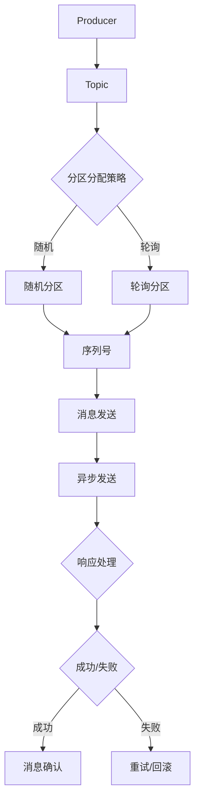

                 

# Kafka Producer原理与代码实例讲解

> **关键词：** Kafka、Producer、分布式系统、消息队列、数据流处理
> 
> **摘要：** 本文将深入探讨Kafka Producer的原理及其在分布式消息系统中的应用。我们将从Kafka Producer的架构开始，逐步解析其核心工作流程，并通过代码实例展示如何实现高效的消息生产。读者将掌握Kafka Producer的关键概念和操作技巧，为在实际项目中应用打下坚实基础。

## 1. 背景介绍

### 1.1 目的和范围

本文旨在详细阐述Kafka Producer的原理，帮助读者理解其在分布式消息系统中的关键作用。通过本篇文章，读者将：

1. 了解Kafka Producer的基本架构和运作机制。
2. 学习如何使用Kafka Producer发送消息。
3. 掌握Kafka Producer在分布式系统中的优势和应用场景。
4. 通过实际代码实例，了解Kafka Producer的具体实现。

### 1.2 预期读者

本文面向有一定Java编程基础和对Kafka有基本了解的读者。尽管我们将尽量使用通俗易懂的语言，但读者仍需要对分布式系统和消息队列有一定的理解。

### 1.3 文档结构概述

本文分为十个部分，具体结构如下：

1. **背景介绍**：介绍本文的目的、预期读者和文档结构。
2. **核心概念与联系**：讲解Kafka Producer的核心概念及其与Kafka集群的关联。
3. **核心算法原理与具体操作步骤**：分析Kafka Producer的核心算法原理，并提供伪代码示例。
4. **数学模型和公式**：介绍Kafka Producer涉及的数学模型和公式。
5. **项目实战：代码实际案例和详细解释说明**：通过实际代码案例展示Kafka Producer的使用。
6. **实际应用场景**：探讨Kafka Producer在现实中的应用场景。
7. **工具和资源推荐**：推荐学习资源、开发工具和相关论文。
8. **总结：未来发展趋势与挑战**：总结Kafka Producer的未来发展趋势和面临的挑战。
9. **附录：常见问题与解答**：回答读者可能遇到的常见问题。
10. **扩展阅读 & 参考资料**：提供更多的深入学习和参考资料。

### 1.4 术语表

#### 1.4.1 核心术语定义

- **Kafka Producer**：负责向Kafka集群发送消息的组件。
- **分布式系统**：由多个节点组成的系统，共同完成某个任务。
- **消息队列**：存储和转发消息的系统，提供异步通信机制。
- **数据流处理**：对实时数据进行处理和分析的技术。

#### 1.4.2 相关概念解释

- **分区（Partition）**：Kafka集群将消息分为多个分区，以实现并行处理和负载均衡。
- **副本（Replica）**：分区的一个副本，用于实现数据冗余和高可用性。
- **主题（Topic）**：Kafka中的消息分类，类似于数据库中的表。

#### 1.4.3 缩略词列表

- **Kafka**：Kafka是一个分布式流处理平台，用于构建实时数据流和流式应用程序。
- **Producer**：消息生产者，负责向Kafka发送消息。
- **Consumer**：消息消费者，负责从Kafka读取消息。

## 2. 核心概念与联系

在深入探讨Kafka Producer之前，我们需要了解其核心概念以及与Kafka集群的关联。以下是一个Mermaid流程图，展示了Kafka Producer的基本架构和工作流程：



### 2.1 Kafka Producer架构

Kafka Producer主要由以下几个组件构成：

1. **Producer客户端**：负责与Kafka集群交互，发送和接收消息。
2. **分区器（Partitioner）**：根据消息内容和策略将消息分配到不同的分区。
3. **序列号生成器（Sequence Number）**：为每条消息生成唯一的序列号。
4. **消息发送器（Sender）**：负责将消息发送到Kafka集群。
5. **响应处理器（Response Handler）**：处理Kafka集群的响应，包括成功和失败的情况。

### 2.2 Kafka集群与Producer的关系

Kafka集群由多个节点组成，每个节点上运行一个Kafka服务器（Broker）。Kafka Producer与Kafka集群的交互过程如下：

1. **连接Kafka集群**：Producer客户端首先连接到Kafka集群，获取集群元数据，包括主题、分区、副本等信息。
2. **选择分区**：根据分区分配策略，Producer将消息分配到特定的分区。
3. **消息发送**：Producer将消息发送到对应的分区，消息发送可以是同步或异步的方式。
4. **消息确认**：Producer等待Kafka集群的响应，确认消息是否成功发送。
5. **重试和回滚**：如果消息发送失败，Producer会尝试重试或回滚消息。

### 2.3 分区分配策略

Kafka提供了多种分区分配策略，包括随机分区、轮询分区等。这些策略决定了如何将消息分配到不同的分区：

- **随机分区**：将消息随机分配到分区，实现负载均衡。
- **轮询分区**：依次将消息分配到每个分区，实现公平负载。

### 2.4 序列号生成器

序列号生成器为每条消息生成唯一的序列号，确保消息的顺序性。序列号通常是一个整数，随着消息的增加而递增。

### 2.5 消息发送器

消息发送器负责将消息发送到Kafka集群。发送消息的过程可以分为以下几个步骤：

1. **序列化消息**：将消息序列化为字节流。
2. **选择分区**：根据分区分配策略选择目标分区。
3. **发送消息**：将序列化后的消息发送到Kafka集群。
4. **等待响应**：等待Kafka集群的响应，确认消息是否发送成功。

### 2.6 响应处理器

响应处理器负责处理Kafka集群的响应。响应包括成功和失败两种情况。如果消息发送成功，Producer会收到一个确认消息，表示消息已成功写入Kafka集群。如果消息发送失败，Producer会收到一个错误响应，需要根据情况进行重试或回滚。

## 3. 核心算法原理与具体操作步骤

在了解了Kafka Producer的核心概念和架构后，我们需要深入探讨其核心算法原理和具体操作步骤。以下内容将通过伪代码详细阐述Kafka Producer的核心算法原理。

### 3.1 消息发送流程

Kafka Producer的消息发送流程可以分为以下几个步骤：

1. **序列化消息**：
   ```java
   byte[] serializedMessage = serialize(message);
   ```
   将消息序列化为字节流。

2. **选择分区**：
   ```java
   int partition = partitioner.partition(message, partitions);
   ```
   根据分区分配策略选择目标分区。

3. **发送消息**：
   ```java
   producer.send(new ProducerRecord<>(topic, partition, serializedMessage));
   ```
   将序列化后的消息发送到Kafka集群。

4. **等待响应**：
   ```java
   Future<RecordMetadata> sendResult = sendOperation.get();
   try {
       RecordMetadata metadata = sendResult.get();
       // 消息发送成功
   } catch (InterruptedException | ExecutionException e) {
       // 消息发送失败
   }
   ```

### 3.2 消息确认流程

Kafka Producer的消息确认流程如下：

1. **发送消息**：
   ```java
   producer.send(new ProducerRecord<>(topic, partition, serializedMessage));
   ```

2. **等待响应**：
   ```java
   Future<RecordMetadata> sendResult = sendOperation.get();
   try {
       RecordMetadata metadata = sendResult.get();
       // 消息发送成功
   } catch (InterruptedException | ExecutionException e) {
       // 消息发送失败
   }
   ```

3. **处理响应**：
   - **成功**：收到Kafka集群的确认消息，表示消息已成功写入。
   - **失败**：收到Kafka集群的失败响应，需要根据情况进行重试或回滚。

### 3.3 重试和回滚策略

Kafka Producer支持重试和回滚策略，以应对消息发送失败的情况。以下是伪代码实现：

1. **重试策略**：
   ```java
   int retries = 3;
   while (retries > 0) {
       try {
           sendResult.get();
           break; // 消息发送成功，跳出循环
       } catch (InterruptedException | ExecutionException e) {
           retries--;
           if (retries == 0) {
               throw new RuntimeException("消息发送失败，达到最大重试次数");
           }
           Thread.sleep(1000); // 等待一段时间后重新发送
       }
   }
   ```

2. **回滚策略**：
   ```java
   List<ProducerRecord> rollbackMessages = new ArrayList<>();
   while (!sendResult.isDone()) {
       try {
           sendResult.get();
           break; // 消息发送成功，跳出循环
       } catch (InterruptedException | ExecutionException e) {
           rollbackMessages.add(new ProducerRecord<>(topic, partition, serializedMessage));
           sendResult = producer.send(new ProducerRecord<>(topic, partition, serializedMessage));
       }
   }
   producer.rollback(rollbackMessages);
   ```

## 4. 数学模型和公式

Kafka Producer涉及一些数学模型和公式，用于计算消息的发送速率、延迟等指标。以下是相关数学模型和公式的详细讲解：

### 4.1 消息发送速率

消息发送速率（R）是指单位时间内发送的消息数量，可以用以下公式计算：

$$
R = \frac{N}{T}
$$

其中，N表示发送的消息数量，T表示发送消息所花费的时间。

### 4.2 消息延迟

消息延迟（L）是指消息从发送到确认所花费的时间，可以用以下公式计算：

$$
L = T_{send} + T_{queue} + T_{ack}
$$

其中，$T_{send}$表示发送消息所花费的时间，$T_{queue}$表示消息在队列中等待的时间，$T_{ack}$表示等待确认的时间。

### 4.3 延迟容忍度

延迟容忍度（D）是指系统能够容忍的最大延迟，可以用以下公式计算：

$$
D = T_{max} - L
$$

其中，$T_{max}$表示系统的最大允许延迟。

### 4.4 发送成功率

发送成功率（S）是指消息发送成功的概率，可以用以下公式计算：

$$
S = \frac{N_{success}}{N_{total}}
$$

其中，$N_{success}$表示发送成功的消息数量，$N_{total}$表示发送的总消息数量。

## 5. 项目实战：代码实际案例和详细解释说明

在本节中，我们将通过一个实际代码案例来展示如何使用Kafka Producer发送消息。代码中使用Java语言和Apache Kafka客户端库实现。

### 5.1 开发环境搭建

首先，我们需要搭建Kafka开发环境。以下步骤是在本地搭建Kafka集群的简要说明：

1. 下载并解压Kafka安装包。
2. 配置Kafka配置文件（例如kafka-server-start.sh和kafka-server-stop.sh）。
3. 启动Kafka集群（运行kafka-server-start.sh脚本）。
4. 等待Kafka集群启动成功。

### 5.2 源代码详细实现和代码解读

以下是Kafka Producer的代码实现：

```java
import org.apache.kafka.clients.producer.*;
import java.util.Properties;
import java.util.concurrent.ExecutionException;

public class KafkaProducerExample {
    public static void main(String[] args) throws ExecutionException, InterruptedException {
        // 配置Kafka Producer
        Properties props = new Properties();
        props.put("bootstrap.servers", "localhost:9092");
        props.put("key.serializer", "org.apache.kafka.common.serialization.StringSerializer");
        props.put("value.serializer", "org.apache.kafka.common.serialization.StringSerializer");

        // 创建Kafka Producer实例
        KafkaProducer<String, String> producer = new KafkaProducer<>(props);

        // 发送消息
        for (int i = 0; i < 10; i++) {
            String topic = "test-topic";
            String key = "key-" + i;
            String value = "value-" + i;
            producer.send(new ProducerRecord<>(topic, key, value));
            System.out.println("发送消息：key=" + key + "，value=" + value);
        }

        // 关闭Kafka Producer
        producer.close();
    }
}
```

代码解读如下：

1. **配置Kafka Producer**：首先，我们创建一个Properties对象，用于配置Kafka Producer的属性。关键属性包括Kafka集群地址（bootstrap.servers）、键序列化器（key.serializer）和值序列化器（value.serializer）。

2. **创建Kafka Producer实例**：通过调用KafkaProducer类的构造函数，创建Kafka Producer实例。

3. **发送消息**：使用ProducerRecord类创建消息记录，指定主题（topic）、键（key）和值（value）。然后，调用producer.send()方法发送消息。这里，我们发送了10条消息。

4. **关闭Kafka Producer**：最后，调用producer.close()方法关闭Kafka Producer。

### 5.3 代码解读与分析

1. **消息序列化**：在配置Kafka Producer时，我们指定了键序列化器和值序列化器。序列化器负责将Java对象序列化为字节流，以便发送到Kafka集群。

2. **消息发送**：使用ProducerRecord创建消息记录，其中包含主题、键和值。键用于在分区器中确定消息的目标分区，值则是实际的消息内容。

3. **异步发送**：调用producer.send()方法发送消息，该方法返回一个Future对象，表示发送操作的结果。我们可以通过调用Future.get()方法获取发送结果。

4. **消息确认**：在发送消息后，Kafka Producer会等待Kafka集群的响应。如果消息发送成功，我们会收到一个确认消息。否则，会收到一个错误响应。

5. **关闭Kafka Producer**：在完成消息发送后，调用producer.close()方法关闭Kafka Producer。这会释放资源，并确保所有未发送的消息都被处理。

## 6. 实际应用场景

Kafka Producer在实际项目中具有广泛的应用场景，以下是一些常见的应用场景：

1. **日志收集**：企业可以将不同应用程序的日志发送到Kafka集群，实现集中式日志收集和分析。

2. **实时数据处理**：Kafka Producer可用于实时数据采集，将数据发送到Kafka集群，然后使用其他工具（如Apache Flink、Spark Streaming）进行实时处理。

3. **消息驱动架构**：Kafka Producer可用于实现消息驱动架构，实现异步通信和负载均衡。

4. **数据流处理**：Kafka Producer可用于将数据流发送到Kafka集群，然后使用Apache Kafka Streams、Apache Flink等工具进行实时数据处理。

5. **分布式系统**：Kafka Producer可用于实现分布式系统的消息传递，实现数据同步和状态同步。

## 7. 工具和资源推荐

### 7.1 学习资源推荐

#### 7.1.1 书籍推荐

1. **《Kafka：从入门到实战》**：本书详细介绍了Kafka的架构、原理和实战应用，适合初学者和有经验的开发者。
2. **《分布式系统原理与范型》**：本书讲解了分布式系统的基本原理和设计模式，对理解Kafka Producer的设计和实现有很大帮助。

#### 7.1.2 在线课程

1. **Coursera - Distributed Computing Systems**：这门课程介绍了分布式系统的基本概念和技术，包括Kafka等消息队列系统。
2. **edX - Apache Kafka**：这门课程由Apache Kafka社区提供，详细讲解了Kafka的架构、原理和实战应用。

#### 7.1.3 技术博客和网站

1. **Kafka官网（kafka.apache.org）**：Apache Kafka官方网站，提供了丰富的文档和资源。
2. **Confluent官网（confluent.io）**：Confluent是Kafka的商业支持者，提供了大量关于Kafka的实战经验和最佳实践。

### 7.2 开发工具框架推荐

#### 7.2.1 IDE和编辑器

1. **IntelliJ IDEA**：强大的Java IDE，支持Kafka插件，提供代码补全、调试和性能分析功能。
2. **Visual Studio Code**：轻量级的代码编辑器，支持Kafka插件，方便进行Kafka开发。

#### 7.2.2 调试和性能分析工具

1. **Wireshark**：网络协议分析工具，可用于监控Kafka客户端和服务器之间的通信。
2. **Kafka Monitor**：Kafka集群监控工具，可以实时查看Kafka集群的状态和性能指标。

#### 7.2.3 相关框架和库

1. **Spring Kafka**：Spring框架的Kafka集成库，简化了Kafka消息的生产和消费。
2. **Kafka Streams**：Apache Kafka提供的实时流处理框架，可以轻松构建实时数据处理应用程序。

### 7.3 相关论文著作推荐

#### 7.3.1 经典论文

1. **"Kafka: A Distributed Streaming Platform"**：该论文详细介绍了Kafka的设计、实现和应用场景。
2. **"The Design of the UNIX Operating System"**：虽然不是关于Kafka的论文，但该论文对分布式系统的设计原则和模式有很好的阐述。

#### 7.3.2 最新研究成果

1. **"Efficient Data Processing on a Parallel Computer"**：该论文探讨了如何在并行计算机上高效处理大量数据，对Kafka的分布式架构设计有很大启发。
2. **"Scalable and Secure Data Processing in the Cloud"**：该论文研究了在云计算环境中实现可扩展和安全的流数据处理方法，对Kafka的实际应用提供了参考。

#### 7.3.3 应用案例分析

1. **"阿里巴巴分布式数据库系统OceanBase的设计与实现"**：该案例详细介绍了阿里巴巴如何使用Kafka等分布式系统实现大规模数据库系统的设计与实现。
2. **"微博实时数据平台的设计与实践"**：该案例分享了微博如何使用Kafka等分布式系统构建实时数据平台，提供了宝贵的实战经验。

## 8. 总结：未来发展趋势与挑战

Kafka Producer作为分布式消息系统的核心组件，将在未来得到更广泛的应用和深入研究。以下是一些发展趋势和面临的挑战：

### 8.1 发展趋势

1. **更高效的分区和复制策略**：为了提高Kafka Producer的性能和可靠性，研究人员将继续探索更高效的分区和复制策略。
2. **集成其他分布式系统**：Kafka Producer将与其他分布式系统（如Apache Flink、Apache Spark）更好地集成，实现更高效的数据流处理。
3. **云原生Kafka**：随着云原生技术的兴起，Kafka Producer将更专注于云原生部署和管理，提高可扩展性和可靠性。

### 8.2 面临的挑战

1. **数据安全与隐私保护**：随着数据隐私保护法规的日益严格，Kafka Producer需要提供更强大的数据安全保护机制。
2. **资源消耗与性能优化**：Kafka Producer需要不断优化资源消耗和性能，以应对日益增长的数据流和处理需求。
3. **跨语言支持与生态扩展**：Kafka Producer需要支持更多编程语言，并扩展其生态系统，提高开发者的使用体验。

## 9. 附录：常见问题与解答

### 9.1 问题1：如何选择合适的分区分配策略？

**解答**：选择合适的分区分配策略取决于具体的应用场景和性能需求。以下是几种常见的分区分配策略及其适用场景：

1. **随机分区**：适用于负载均衡和分布式处理，但可能导致数据倾斜。
2. **轮询分区**：适用于公平负载和简单场景，但可能导致某些分区过载。
3. **自定义分区策略**：根据具体业务需求自定义分区策略，适用于复杂场景。

### 9.2 问题2：如何处理消息发送失败的情况？

**解答**：处理消息发送失败的情况通常有以下几种方法：

1. **重试策略**：在消息发送失败时，重新发送消息。可以设置最大重试次数，防止无限重试导致死循环。
2. **回滚策略**：在消息发送失败时，将消息回滚到发送队列，然后重新发送。适用于需要保证消息顺序的场景。
3. **回调函数**：在消息发送成功或失败时，通过回调函数进行相应的处理，如记录日志、发送告警等。

### 9.3 问题3：如何监控Kafka Producer的性能？

**解答**：监控Kafka Producer的性能可以从以下几个方面入手：

1. **日志分析**：分析Kafka Producer的日志，了解消息发送、确认等操作的执行情况。
2. **性能指标**：监控Kafka Producer的性能指标，如发送速率、延迟、错误率等。
3. **工具支持**：使用Kafka Monitor、Wireshark等工具进行实时监控和性能分析。

## 10. 扩展阅读 & 参考资料

1. **《Kafka：从入门到实战》**：详细介绍了Kafka的架构、原理和实战应用，适合初学者和有经验的开发者。
2. **《分布式系统原理与范型》**：讲解了分布式系统的基本原理和设计模式，对理解Kafka Producer的设计和实现有很大帮助。
3. **Kafka官网（kafka.apache.org）**：提供了丰富的文档和资源，包括Kafka的设计、实现和应用场景。
4. **Confluent官网（confluent.io）**：Confluent是Kafka的商业支持者，提供了大量关于Kafka的实战经验和最佳实践。
5. **Apache Kafka Streams官网（kafka.apache.org/streams）**：介绍了Apache Kafka Streams框架，用于实时流处理。
6. **Apache Spark官网（spark.apache.org）**：介绍了Apache Spark框架，用于大规模数据处理。

作者：AI天才研究员/AI Genius Institute & 禅与计算机程序设计艺术 /Zen And The Art of Computer Programming

