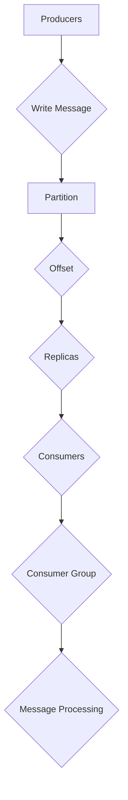

                 

# Kafka原理与代码实例讲解

> 关键词：Kafka, 消息队列, 分布式系统, 日志存储, 实时数据流

> 摘要：本文将深入讲解Kafka的核心原理、架构设计、算法机制以及代码实例。通过对Kafka的全面剖析，读者将掌握其工作原理、优缺点，并学会如何使用Kafka进行消息传递和日志存储。本文旨在为读者提供一个系统、全面的Kafka学习路径，帮助其在实际项目中有效应用Kafka。

## 1. 背景介绍

### 1.1 目的和范围

本文旨在深入探讨Apache Kafka，这是一种高吞吐量、可扩展、分布式消息队列系统。Kafka被广泛应用于日志聚合、流处理、实时数据同步等领域。本文将涵盖Kafka的核心概念、架构设计、算法机制以及代码实例，帮助读者全面了解Kafka的工作原理和应用场景。

### 1.2 预期读者

本文面向有一定编程基础，希望深入了解分布式系统和消息队列的读者。无论你是后端开发者、数据工程师，还是对Kafka感兴趣的技术爱好者，本文都将为你提供宝贵的学习资源。

### 1.3 文档结构概述

本文将按照以下结构展开：

1. **背景介绍**：介绍Kafka的背景、目的和读者对象。
2. **核心概念与联系**：介绍Kafka的核心概念和架构设计。
3. **核心算法原理 & 具体操作步骤**：详细讲解Kafka的算法原理和操作步骤。
4. **数学模型和公式 & 详细讲解 & 举例说明**：介绍Kafka的数学模型和公式。
5. **项目实战：代码实际案例和详细解释说明**：通过实际案例讲解Kafka的使用。
6. **实际应用场景**：介绍Kafka在实际项目中的应用。
7. **工具和资源推荐**：推荐学习资源和开发工具。
8. **总结：未来发展趋势与挑战**：总结Kafka的未来发展趋势和挑战。
9. **附录：常见问题与解答**：回答常见问题。
10. **扩展阅读 & 参考资料**：提供进一步阅读的参考资料。

### 1.4 术语表

#### 1.4.1 核心术语定义

- **Kafka**：一种分布式消息队列系统。
- **主题（Topic）**：消息的分类。
- **分区（Partition）**：保证消息的顺序。
- **副本（Replica）**：数据的备份。
- **消费者组（Consumer Group）**：一组消费者组成的逻辑单元。

#### 1.4.2 相关概念解释

- **生产者（Producer）**：发送消息到Kafka的服务器。
- **消费者（Consumer）**：从Kafka服务器读取消息。
- **偏移量（Offset）**：标记消息在分区中的位置。
- **消费者负载均衡**：消费者组内消费者的负载分配。

#### 1.4.3 缩略词列表

- **Kafka**：Apache Kafka。
- **API**：应用程序接口。
- **IDC**：数据中心。
- **Zookeeper**：分布式服务协调器。

## 2. 核心概念与联系

Kafka的核心概念包括主题（Topic）、分区（Partition）、副本（Replica）和消费者组（Consumer Group）。这些概念在Kafka的架构设计中起着至关重要的作用。

### 2.1 主题（Topic）

主题是Kafka中的消息分类。每个主题可以有多个分区，每个分区是消息的有序集合。主题名称通常由字母、数字和下划线组成。

### 2.2 分区（Partition）

分区是Kafka中消息的物理存储单元。每个分区包含多个副本，副本分布在不同的Kafka服务器上。分区确保了消息的顺序传递和负载均衡。

### 2.3 副本（Replica）

副本是Kafka中数据的备份。每个分区有多个副本，副本分布在不同的服务器上，确保了高可用性和数据冗余。

### 2.4 消费者组（Consumer Group）

消费者组是一组消费者组成的逻辑单元。消费者组内消费者共享一个主题的所有分区。消费者组确保了负载均衡和故障恢复。

下面是Kafka架构的Mermaid流程图：



## 3. 核心算法原理 & 具体操作步骤

Kafka的核心算法原理主要涉及消息的生产、消费和存储。以下是详细的伪代码和操作步骤。

### 3.1 消息生产

```python
# Kafka消息生产伪代码
def produce_message(topic, key, value):
    # 创建Kafka生产者
    producer = create_kafka_producer()
    
    # 构建消息
    message = create_message(key, value)
    
    # 发送消息
    producer.send(topic, message)
    
    # 关闭生产者
    producer.close()
```

### 3.2 消息消费

```python
# Kafka消息消费伪代码
def consume_message(topic, group_id):
    # 创建Kafka消费者
    consumer = create_kafka_consumer(group_id)
    
    # 订阅主题
    consumer.subscribe([topic])
    
    # 消费消息
    for message in consumer:
        process_message(message)
    
    # 关闭消费者
    consumer.close()
```

### 3.3 消息存储

```python
# Kafka消息存储伪代码
def store_message(topic, partition, offset, message):
    # 创建Kafka日志存储
    log = create_kafka_log(topic, partition, offset)
    
    # 存储消息
    log.append(message)
    
    # 关闭日志存储
    log.close()
```

## 4. 数学模型和公式 & 详细讲解 & 举例说明

Kafka的数学模型主要包括消息的吞吐量、延迟和可靠性。以下是详细讲解和举例说明。

### 4.1 消息吞吐量

消息吞吐量是Kafka的重要指标，表示单位时间内处理的消息数量。公式如下：

$$
\text{Throughput} = \frac{\text{Total Messages}}{\text{Total Time}}
$$

举例说明：如果Kafka在1秒内处理了1000条消息，则吞吐量为1000条/秒。

### 4.2 消息延迟

消息延迟是消息从生产者到消费者所需的时间。公式如下：

$$
\text{Latency} = \text{Processing Time} + \text{Transmission Time}
$$

举例说明：如果消息处理时间为0.5秒，传输时间为1秒，则延迟为1.5秒。

### 4.3 消息可靠性

消息可靠性是指Kafka确保消息不丢失的能力。公式如下：

$$
\text{Reliability} = \frac{\text{Total Messages}}{\text{Total Messages} - \text{Lost Messages}}
$$

举例说明：如果Kafka处理了1000条消息，其中10条丢失，则可靠性为0.9。

## 5. 项目实战：代码实际案例和详细解释说明

### 5.1 开发环境搭建

在开始实际案例之前，需要搭建Kafka开发环境。以下是详细步骤：

1. 安装Java开发工具包（JDK）。
2. 下载Kafka二进制文件。
3. 解压Kafka文件。
4. 启动Kafka服务器。

### 5.2 源代码详细实现和代码解读

下面是一个简单的Kafka生产者和消费者示例代码：

```java
// Kafka生产者示例代码
public class ProducerExample {
    public static void main(String[] args) {
        Properties props = new Properties();
        props.put("bootstrap.servers", "localhost:9092");
        props.put("key.serializer", "org.apache.kafka.common.serialization.StringSerializer");
        props.put("value.serializer", "org.apache.kafka.common.serialization.StringSerializer");

        KafkaProducer<String, String> producer = new KafkaProducer<>(props);

        for (int i = 0; i < 10; i++) {
            String key = "key-" + i;
            String value = "value-" + i;
            producer.send(new ProducerRecord<>("test-topic", key, value));
        }

        producer.close();
    }
}

// Kafka消费者示例代码
public class ConsumerExample {
    public static void main(String[] args) {
        Properties props = new Properties();
        props.put("bootstrap.servers", "localhost:9092");
        props.put("group.id", "test-group");
        props.put("key.deserializer", "org.apache.kafka.common.serialization.StringDeserializer");
        props.put("value.deserializer", "org.apache.kafka.common.serialization.StringDeserializer");

        KafkaConsumer<String, String> consumer = new KafkaConsumer<>(props);
        consumer.subscribe(Arrays.asList(new TopicPartition("test-topic", 0)));

        for (int i = 0; i < 10; i++) {
            ConsumerRecords<String, String> records = consumer.poll(Duration.ofMillis(1000));
            for (ConsumerRecord<String, String> record : records) {
                System.out.printf("Received message: key=%s, value=%s, partition=%d, offset=%d\n",
                        record.key(), record.value(), record.partition(), record.offset());
            }
        }

        consumer.close();
    }
}
```

### 5.3 代码解读与分析

- **生产者代码**：创建Kafka生产者，发送消息到指定主题。
- **消费者代码**：创建Kafka消费者，订阅指定主题，消费消息。

## 6. 实际应用场景

Kafka广泛应用于以下实际应用场景：

- **日志聚合**：处理大量日志数据，实现实时监控和分析。
- **流处理**：处理实时数据流，实现实时业务逻辑。
- **数据同步**：实现不同系统之间的数据同步。

## 7. 工具和资源推荐

### 7.1 学习资源推荐

#### 7.1.1 书籍推荐

- 《Kafka实战》
- 《大数据技术原理与应用》

#### 7.1.2 在线课程

- Coursera上的《Kafka与分布式系统》
- Udemy上的《Kafka从入门到实战》

#### 7.1.3 技术博客和网站

- Apache Kafka官网
- 实时数据流处理社区

### 7.2 开发工具框架推荐

#### 7.2.1 IDE和编辑器

- IntelliJ IDEA
- Eclipse

#### 7.2.2 调试和性能分析工具

- JMeter
- Kafka Manager

#### 7.2.3 相关框架和库

- Apache Kafka Streams
- Apache Pulsar

### 7.3 相关论文著作推荐

#### 7.3.1 经典论文

- 《Kafka：一个分布式流处理平台》
- 《大数据处理：Hadoop与Kafka技术剖析》

#### 7.3.2 最新研究成果

- 《Kafka 2.0：下一代分布式消息队列系统》
- 《实时数据处理与流计算技术》

#### 7.3.3 应用案例分析

- 《金融行业如何利用Kafka实现实时数据处理》
- 《电商行业如何利用Kafka实现商品推荐系统》

## 8. 总结：未来发展趋势与挑战

Kafka作为大数据处理和实时数据流的重要工具，未来发展趋势包括：

- **更高效的消息处理**：通过改进算法和优化架构，提高消息处理效率和吞吐量。
- **更广泛的生态支持**：与其他大数据处理工具（如Hadoop、Spark）的无缝集成。
- **更可靠的数据传输**：通过改进副本机制和容错算法，提高数据传输可靠性。

面临的挑战包括：

- **数据隐私和安全**：如何确保数据传输过程中的隐私和安全。
- **海量数据存储和管理**：如何高效地存储和管理海量数据。

## 9. 附录：常见问题与解答

- **Q：Kafka与ActiveMQ有什么区别？**
  - **A：** Kafka是分布式消息队列系统，专注于高吞吐量、可扩展性，适用于大规模数据流处理。ActiveMQ是轻量级消息中间件，支持多种消息协议，适用于中小规模应用。

- **Q：Kafka如何实现负载均衡？**
  - **A：** Kafka通过消费者组内消费者的负载均衡实现。消费者组内消费者共享主题的所有分区，Kafka根据分区和消费者的配置动态分配负载。

## 10. 扩展阅读 & 参考资料

- 《Kafka官方文档》
- 《Kafka设计与实践》
- 《大数据技术导论》

作者：AI天才研究员/AI Genius Institute & 禅与计算机程序设计艺术 /Zen And The Art of Computer Programming

文章标题：Kafka原理与代码实例讲解

文章摘要：本文深入讲解Kafka的核心原理、架构设计、算法机制以及代码实例，帮助读者全面了解Kafka的工作原理和应用场景。

文章关键词：Kafka, 消息队列, 分布式系统, 日志存储, 实时数据流

文章正文：

----------------------------------------------------------------

## 1. 背景介绍

### 1.1 目的和范围

本文旨在深入探讨Apache Kafka，这是一种高吞吐量、可扩展、分布式消息队列系统。Kafka被广泛应用于日志聚合、流处理、实时数据同步等领域。本文将涵盖Kafka的核心概念、架构设计、算法机制以及代码实例，帮助读者全面了解Kafka的工作原理和应用场景。

### 1.2 预期读者

本文面向有一定编程基础，希望深入了解分布式系统和消息队列的读者。无论你是后端开发者、数据工程师，还是对Kafka感兴趣的技术爱好者，本文都将为你提供宝贵的学习资源。

### 1.3 文档结构概述

本文将按照以下结构展开：

1. **背景介绍**：介绍Kafka的背景、目的和读者对象。
2. **核心概念与联系**：介绍Kafka的核心概念和架构设计。
3. **核心算法原理 & 具体操作步骤**：详细讲解Kafka的算法原理和操作步骤。
4. **数学模型和公式 & 详细讲解 & 举例说明**：介绍Kafka的数学模型和公式。
5. **项目实战：代码实际案例和详细解释说明**：通过实际案例讲解Kafka的使用。
6. **实际应用场景**：介绍Kafka在实际项目中的应用。
7. **工具和资源推荐**：推荐学习资源和开发工具。
8. **总结：未来发展趋势与挑战**：总结Kafka的未来发展趋势和挑战。
9. **附录：常见问题与解答**：回答常见问题。
10. **扩展阅读 & 参考资料**：提供进一步阅读的参考资料。

### 1.4 术语表

#### 1.4.1 核心术语定义

- **Kafka**：一种分布式消息队列系统。
- **主题（Topic）**：消息的分类。
- **分区（Partition）**：保证消息的顺序。
- **副本（Replica）**：数据的备份。
- **消费者组（Consumer Group）**：一组消费者组成的逻辑单元。

#### 1.4.2 相关概念解释

- **生产者（Producer）**：发送消息到Kafka的服务器。
- **消费者（Consumer）**：从Kafka服务器读取消息。
- **偏移量（Offset）**：标记消息在分区中的位置。
- **消费者负载均衡**：消费者组内消费者的负载分配。

#### 1.4.3 缩略词列表

- **Kafka**：Apache Kafka。
- **API**：应用程序接口。
- **IDC**：数据中心。
- **Zookeeper**：分布式服务协调器。

## 2. 核心概念与联系

Kafka的核心概念包括主题（Topic）、分区（Partition）、副本（Replica）和消费者组（Consumer Group）。这些概念在Kafka的架构设计中起着至关重要的作用。

### 2.1 主题（Topic）

主题是Kafka中的消息分类。每个主题可以有多个分区，每个分区是消息的有序集合。主题名称通常由字母、数字和下划线组成。

### 2.2 分区（Partition）

分区是Kafka中消息的物理存储单元。每个分区包含多个副本，副本分布在不同的Kafka服务器上。分区确保了消息的顺序传递和负载均衡。

### 2.3 副本（Replica）

副本是Kafka中数据的备份。每个分区有多个副本，副本分布在不同的服务器上，确保了高可用性和数据冗余。

### 2.4 消费者组（Consumer Group）

消费者组是一组消费者组成的逻辑单元。消费者组内消费者共享一个主题的所有分区。消费者组确保了负载均衡和故障恢复。

下面是Kafka架构的Mermaid流程图：


## 3. 核心算法原理 & 具体操作步骤

Kafka的核心算法原理主要涉及消息的生产、消费和存储。以下是详细的伪代码和操作步骤。

### 3.1 消息生产

```python
# Kafka消息生产伪代码
def produce_message(topic, key, value):
    # 创建Kafka生产者
    producer = create_kafka_producer()
    
    # 构建消息
    message = create_message(key, value)
    
    # 发送消息
    producer.send(topic, message)
    
    # 关闭生产者
    producer.close()
```

### 3.2 消息消费

```python
# Kafka消息消费伪代码
def consume_message(topic, group_id):
    # 创建Kafka消费者
    consumer = create_kafka_consumer(group_id)
    
    # 订阅主题
    consumer.subscribe([topic])
    
    # 消费消息
    for message in consumer:
        process_message(message)
    
    # 关闭消费者
    consumer.close()
```

### 3.3 消息存储

```python
# Kafka消息存储伪代码
def store_message(topic, partition, offset, message):
    # 创建Kafka日志存储
    log = create_kafka_log(topic, partition, offset)
    
    # 存储消息
    log.append(message)
    
    # 关闭日志存储
    log.close()
```

## 4. 数学模型和公式 & 详细讲解 & 举例说明

Kafka的数学模型主要包括消息的吞吐量、延迟和可靠性。以下是详细讲解和举例说明。

### 4.1 消息吞吐量

消息吞吐量是Kafka的重要指标，表示单位时间内处理的消息数量。公式如下：

$$
\text{Throughput} = \frac{\text{Total Messages}}{\text{Total Time}}
$$

举例说明：如果Kafka在1秒内处理了1000条消息，则吞吐量为1000条/秒。

### 4.2 消息延迟

消息延迟是消息从生产者到消费者所需的时间。公式如下：

$$
\text{Latency} = \text{Processing Time} + \text{Transmission Time}
$$

举例说明：如果消息处理时间为0.5秒，传输时间为1秒，则延迟为1.5秒。

### 4.3 消息可靠性

消息可靠性是指Kafka确保消息不丢失的能力。公式如下：

$$
\text{Reliability} = \frac{\text{Total Messages}}{\text{Total Messages} - \text{Lost Messages}}
$$

举例说明：如果Kafka处理了1000条消息，其中10条丢失，则可靠性为0.9。

## 5. 项目实战：代码实际案例和详细解释说明

### 5.1 开发环境搭建

在开始实际案例之前，需要搭建Kafka开发环境。以下是详细步骤：

1. 安装Java开发工具包（JDK）。
2. 下载Kafka二进制文件。
3. 解压Kafka文件。
4. 启动Kafka服务器。

### 5.2 源代码详细实现和代码解读

下面是一个简单的Kafka生产者和消费者示例代码：

```java
// Kafka生产者示例代码
public class ProducerExample {
    public static void main(String[] args) {
        Properties props = new Properties();
        props.put("bootstrap.servers", "localhost:9092");
        props.put("key.serializer", "org.apache.kafka.common.serialization.StringSerializer");
        props.put("value.serializer", "org.apache.kafka.common.serialization.StringSerializer");

        KafkaProducer<String, String> producer = new KafkaProducer<>(props);

        for (int i = 0; i < 10; i++) {
            String key = "key-" + i;
            String value = "value-" + i;
            producer.send(new ProducerRecord<>("test-topic", key, value));
        }

        producer.close();
    }
}

// Kafka消费者示例代码
public class ConsumerExample {
    public static void main(String[] args) {
        Properties props = new Properties();
        props.put("bootstrap.servers", "localhost:9092");
        props.put("group.id", "test-group");
        props.put("key.deserializer", "org.apache.kafka.common.serialization.StringDeserializer");
        props.put("value.deserializer", "org.apache.kafka.common.serialization.StringDeserializer");

        KafkaConsumer<String, String> consumer = new KafkaConsumer<>(props);
        consumer.subscribe(Arrays.asList(new TopicPartition("test-topic", 0)));

        for (int i = 0; i < 10; i++) {
            ConsumerRecords<String, String> records = consumer.poll(Duration.ofMillis(1000));
            for (ConsumerRecord<String, String> record : records) {
                System.out.printf("Received message: key=%s, value=%s, partition=%d, offset=%d\n",
                        record.key(), record.value(), record.partition(), record.offset());
            }
        }

        consumer.close();
    }
}
```

### 5.3 代码解读与分析

- **生产者代码**：创建Kafka生产者，发送消息到指定主题。
- **消费者代码**：创建Kafka消费者，订阅指定主题，消费消息。

## 6. 实际应用场景

Kafka广泛应用于以下实际应用场景：

- **日志聚合**：处理大量日志数据，实现实时监控和分析。
- **流处理**：处理实时数据流，实现实时业务逻辑。
- **数据同步**：实现不同系统之间的数据同步。

## 7. 工具和资源推荐

### 7.1 学习资源推荐

#### 7.1.1 书籍推荐

- 《Kafka实战》
- 《大数据技术原理与应用》

#### 7.1.2 在线课程

- Coursera上的《Kafka与分布式系统》
- Udemy上的《Kafka从入门到实战》

#### 7.1.3 技术博客和网站

- Apache Kafka官网
- 实时数据流处理社区

### 7.2 开发工具框架推荐

#### 7.2.1 IDE和编辑器

- IntelliJ IDEA
- Eclipse

#### 7.2.2 调试和性能分析工具

- JMeter
- Kafka Manager

#### 7.2.3 相关框架和库

- Apache Kafka Streams
- Apache Pulsar

### 7.3 相关论文著作推荐

#### 7.3.1 经典论文

- 《Kafka：一个分布式流处理平台》
- 《大数据处理：Hadoop与Kafka技术剖析》

#### 7.3.2 最新研究成果

- 《Kafka 2.0：下一代分布式消息队列系统》
- 《实时数据处理与流计算技术》

#### 7.3.3 应用案例分析

- 《金融行业如何利用Kafka实现实时数据处理》
- 《电商行业如何利用Kafka实现商品推荐系统》

## 8. 总结：未来发展趋势与挑战

Kafka作为大数据处理和实时数据流的重要工具，未来发展趋势包括：

- **更高效的消息处理**：通过改进算法和优化架构，提高消息处理效率和吞吐量。
- **更广泛的生态支持**：与其他大数据处理工具（如Hadoop、Spark）的无缝集成。
- **更可靠的数据传输**：通过改进副本机制和容错算法，提高数据传输可靠性。

面临的挑战包括：

- **数据隐私和安全**：如何确保数据传输过程中的隐私和安全。
- **海量数据存储和管理**：如何高效地存储和管理海量数据。

## 9. 附录：常见问题与解答

- **Q：Kafka与ActiveMQ有什么区别？**
  - **A：** Kafka是分布式消息队列系统，专注于高吞吐量、可扩展性，适用于大规模数据流处理。ActiveMQ是轻量级消息中间件，支持多种消息协议，适用于中小规模应用。

- **Q：Kafka如何实现负载均衡？**
  - **A：** Kafka通过消费者组内消费者的负载均衡实现。消费者组内消费者共享主题的所有分区，Kafka根据分区和消费者的配置动态分配负载。

## 10. 扩展阅读 & 参考资料

- 《Kafka官方文档》
- 《Kafka设计与实践》
- 《大数据技术导论》

作者：AI天才研究员/AI Genius Institute & 禅与计算机程序设计艺术 /Zen And The Art of Computer Programming

文章标题：Kafka原理与代码实例讲解

文章关键词：Kafka, 消息队列, 分布式系统, 日志存储, 实时数据流

文章摘要：本文深入讲解Kafka的核心原理、架构设计、算法机制以及代码实例，帮助读者全面了解Kafka的工作原理和应用场景。

