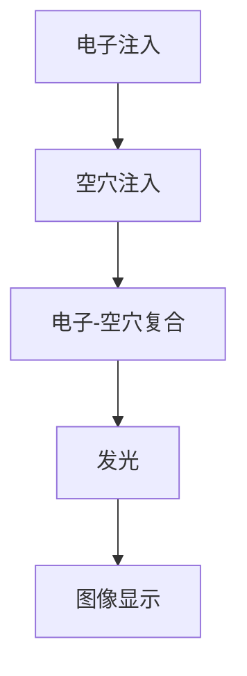
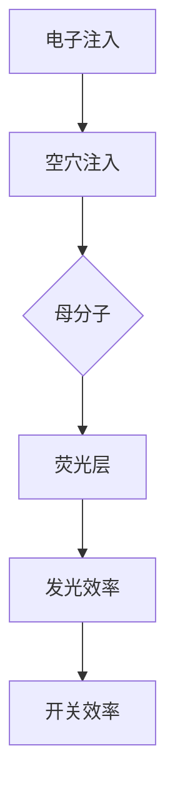

                 

# LG2024校招OLED显示技术工程师笔试题

> **关键词：OLED技术、显示技术、校招笔试、核心算法、数学模型、代码案例、应用场景、工具推荐。**

> **摘要：本文旨在深入探讨LG2024校招OLED显示技术工程师笔试题中的关键知识点，包括OLED技术的基本原理、核心算法、数学模型及其在实际项目中的应用。通过详细的伪代码分析、代码实现和案例分析，帮助读者更好地理解并掌握OLED显示技术，为未来的技术挑战做好充分准备。**

## 1. 背景介绍

### 1.1 目的和范围

本文的主要目的是针对LG2024校招OLED显示技术工程师笔试题中涉及的关键知识点进行深入剖析，帮助考生更好地理解OLED显示技术的核心原理和应用。本文将涵盖以下几个主要内容：

- OLED技术的基本原理和工作机制
- OLED显示技术的核心算法及其实现步骤
- OLED显示技术的数学模型及其应用
- OLED显示技术的实际应用场景
- OLED显示技术的开发工具和资源推荐

### 1.2 预期读者

本文的预期读者主要包括以下几类：

- 参加LG2024校招OLED显示技术工程师笔试的考生
- 对OLED显示技术感兴趣的科研人员和工程师
- 对显示技术领域有深入研究的学者和研究人员

### 1.3 文档结构概述

本文结构分为十个部分，具体如下：

1. 背景介绍
   - 目的和范围
   - 预期读者
   - 文档结构概述
   - 术语表
2. 核心概念与联系
   - OLED技术的基本原理和架构
   - OLED显示技术的核心概念和联系
3. 核心算法原理 & 具体操作步骤
   - OLED显示技术的核心算法原理
   - OLED显示技术的具体操作步骤
4. 数学模型和公式 & 详细讲解 & 举例说明
   - OLED显示技术的数学模型和公式
   - 数学模型的详细讲解和举例说明
5. 项目实战：代码实际案例和详细解释说明
   - 开发环境搭建
   - 源代码详细实现和代码解读
   - 代码解读与分析
6. 实际应用场景
   - OLED显示技术的实际应用场景
7. 工具和资源推荐
   - 学习资源推荐
   - 开发工具框架推荐
   - 相关论文著作推荐
8. 总结：未来发展趋势与挑战
9. 附录：常见问题与解答
10. 扩展阅读 & 参考资料

### 1.4 术语表

#### 1.4.1 核心术语定义

- OLED：有机发光二极管（Organic Light Emitting Diode），是一种能够自主发光的显示技术。
- 显示技术：用于显示图像、文字、视频等信息的电子技术。
- 母分子：OLED显示技术中，负责发光的核心有机分子。
- 电子注入层：OLED中用于注入电子的层。
- 空穴注入层：OLED中用于注入空穴的层。
- 荧光层：OLED中负责发光的层。

#### 1.4.2 相关概念解释

- 电子注入：将电子注入到OLED的电子注入层。
- 空穴注入：将空穴注入到OLED的空穴注入层。
- 发光效率：OLED发光的亮度与消耗电力的比值。
- 开关效率：OLED在开启和关闭状态下的效率。
- 色彩还原：OLED显示技术对各种颜色的还原程度。

#### 1.4.3 缩略词列表

- OLED：有机发光二极管（Organic Light Emitting Diode）
- AMOLED：主动矩阵有机发光二极管（Active Matrix Organic Light Emitting Diode）
- RGB：红绿蓝（Red Green Blue），OLED显示技术中的三种基本颜色。
- TFT：薄膜晶体管（Thin Film Transistor），AMOLED显示器中的关键元件。

## 2. 核心概念与联系

OLED（有机发光二极管）技术是一种具有自主发光特性的显示技术，相比传统的液晶显示技术，OLED具有自发光、对比度高、响应速度快、视角广等优点。OLED显示技术的核心原理是通过电子注入和空穴注入，使母分子在注入层中产生电子-空穴对，进而激发荧光层发光。

### 2.1 OLED技术的基本原理和架构

OLED技术的基本原理可以概括为以下几个步骤：

1. **电子注入**：在OLED的电子注入层中，通过外部电压的作用，将电子注入到电子注入层。
2. **空穴注入**：同样地，在OLED的空穴注入层中，通过外部电压的作用，将空穴注入到空穴注入层。
3. **电子-空穴复合**：在电子注入层和空穴注入层之间的母分子层中，电子和空穴相遇，形成电子-空穴对。
4. **发光**：电子-空穴对在母分子层中激发荧光层发光，从而产生图像。

OLED的架构主要包括以下几个部分：

- **电子注入层**：负责注入电子。
- **空穴注入层**：负责注入空穴。
- **母分子层**：包含负责发光的母分子。
- **荧光层**：负责发光。

下面是一个简单的Mermaid流程图，展示OLED技术的基本原理和架构：

### 2.2 OLED显示技术的核心概念和联系

在OLED显示技术中，核心概念包括：

- **电子注入**：通过外部电压将电子注入到电子注入层。
- **空穴注入**：通过外部电压将空穴注入到空穴注入层。
- **母分子**：负责发光的核心有机分子。
- **荧光层**：负责发光的层。

这些核心概念之间的联系如下：

1. **电子注入**和**空穴注入**是OLED显示技术的两个关键步骤，它们共同决定了OLED的发光效率。
2. **母分子**在注入层中激发**荧光层**发光，从而产生图像。
3. **电子注入**和**空穴注入**的效率决定了OLED的**开关效率**，进而影响OLED的**发光效率**。

下面是一个简单的Mermaid流程图，展示OLED显示技术的核心概念和联系：

通过上述流程图和核心概念的分析，我们可以更好地理解OLED显示技术的基本原理和架构。接下来，我们将进一步探讨OLED显示技术的核心算法原理和具体操作步骤。

