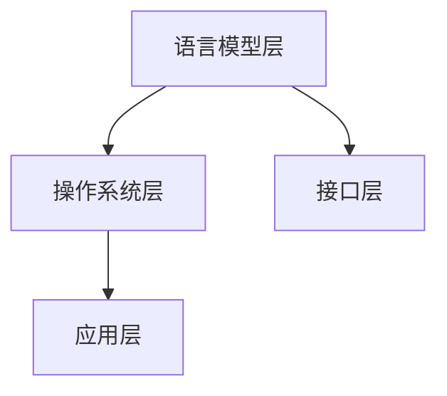

                 

# LLM OS: 操作系统新秀的诞生

> **关键词：** 语言模型、操作系统、架构、深度学习、人工智能、性能优化

> **摘要：** 本文将深入探讨语言模型（LLM）作为操作系统（OS）的新秀如何改变传统操作系统设计的格局。文章首先介绍了LLM OS的背景和核心概念，然后详细解析了其架构和核心算法原理。接着，通过数学模型和实际案例展示了LLM OS的性能优势和具体应用场景。此外，文章还推荐了相关的学习资源和工具，并对未来发展趋势与挑战进行了展望。

## 1. 背景介绍

### 1.1 目的和范围

本文的目的是探讨如何利用语言模型（LLM）重新定义操作系统（OS）的设计和实现。我们将重点关注LLM OS的核心概念、架构、算法原理以及实际应用。通过本文的阅读，读者将能够理解LLM OS的工作原理、性能优势，以及其在现代计算系统中的潜在应用。

### 1.2 预期读者

本文适合以下读者群体：

- 计算机操作系统开发者
- 深度学习研究人员
- 软件工程师
- AI技术爱好者

### 1.3 文档结构概述

本文结构如下：

- **第1章：背景介绍**：介绍文章的目的、预期读者和文档结构。
- **第2章：核心概念与联系**：解释LLM OS的基本概念和架构。
- **第3章：核心算法原理 & 具体操作步骤**：详细描述LLM OS的核心算法。
- **第4章：数学模型和公式 & 详细讲解 & 举例说明**：介绍LLM OS相关的数学模型和公式。
- **第5章：项目实战：代码实际案例和详细解释说明**：展示LLM OS的实际应用案例。
- **第6章：实际应用场景**：讨论LLM OS的应用场景。
- **第7章：工具和资源推荐**：推荐学习资源和开发工具。
- **第8章：总结：未来发展趋势与挑战**：展望LLM OS的未来。
- **第9章：附录：常见问题与解答**：提供常见问题的解答。
- **第10章：扩展阅读 & 参考资料**：列出相关参考资料。

### 1.4 术语表

#### 1.4.1 核心术语定义

- **语言模型（LLM）**：一种深度学习模型，能够理解和生成自然语言文本。
- **操作系统（OS）**：管理计算机硬件和软件资源的系统软件。
- **深度学习**：一种基于多层神经网络的机器学习方法。
- **人工智能（AI）**：使计算机具有人类智能的技术。

#### 1.4.2 相关概念解释

- **模型架构**：指模型的结构和组成。
- **性能优化**：提升系统性能的方法。

#### 1.4.3 缩略词列表

- **LLM**：语言模型（Language Model）
- **OS**：操作系统（Operating System）
- **DL**：深度学习（Deep Learning）
- **AI**：人工智能（Artificial Intelligence）

## 2. 核心概念与联系

### 2.1 LLM OS的基本概念

LLM OS是一种将深度学习技术应用于操作系统的新型操作系统。它利用大规模语言模型（LLM）来优化操作系统的各种功能，包括进程管理、内存管理、文件系统等。与传统操作系统相比，LLM OS具有更高的灵活性和适应性。

### 2.2 LLM OS的架构

LLM OS的架构可以分为以下几个主要部分：

1. **语言模型层**：包括预训练的语言模型和针对特定任务的微调模型。
2. **操作系统层**：传统操作系统核心，负责硬件资源的管理和调度。
3. **接口层**：提供用户与LLM OS交互的接口，包括命令行、图形界面等。
4. **应用层**：运行在LLM OS上的应用程序，如文字编辑器、浏览器等。

### 2.3 核心算法原理

LLM OS的核心算法是基于大规模语言模型的优化算法。以下是LLM OS的核心算法原理：

1. **预训练**：使用大量文本数据对语言模型进行预训练，使其能够理解自然语言。
2. **微调**：针对特定任务对语言模型进行微调，提高其任务性能。
3. **动态调整**：根据系统负载和用户需求动态调整模型参数，优化系统性能。

### 2.4 Mermaid流程图

以下是一个简单的Mermaid流程图，展示了LLM OS的核心架构：



## 3. 核心算法原理 & 具体操作步骤

### 3.1 预训练

LLM OS的预训练过程基于大规模语言模型。以下是预训练的具体操作步骤：

1. **数据收集**：收集大量的文本数据，包括新闻、小说、百科全书等。
2. **预处理**：对文本数据进行清洗和预处理，包括去除标点符号、统一文本格式等。
3. **建模**：使用Transformer模型等深度学习模型对文本数据进行建模。
4. **训练**：通过反向传播算法训练模型，使其能够预测下一个词。

### 3.2 微调

在预训练完成后，LLM OS对语言模型进行微调，以适应特定任务。以下是微调的具体操作步骤：

1. **任务定义**：定义具体的任务，如文本分类、问答系统等。
2. **数据准备**：收集与任务相关的数据集，并进行预处理。
3. **微调**：在预训练模型的基础上，对模型进行微调，使其在特定任务上表现更好。
4. **评估**：使用验证集评估微调后的模型性能，并进行调整。

### 3.3 动态调整

LLM OS通过动态调整模型参数来优化系统性能。以下是动态调整的具体操作步骤：

1. **监控**：监控系统负载和用户需求，收集相关数据。
2. **评估**：根据监控数据评估模型参数的优化效果。
3. **调整**：根据评估结果动态调整模型参数，优化系统性能。

### 3.4 伪代码

以下是LLM OS核心算法的伪代码：

```python
def pretrain_model(data):
    # 数据收集和预处理
    # 建模和训练
    # 返回预训练模型

def fine_tune_model(model, task, data):
    # 微调和评估
    # 返回微调后模型

def dynamic_adjust(model, monitor_data):
    # 监控和评估
    # 调整模型参数
    # 返回调整后模型
```

## 4. 数学模型和公式 & 详细讲解 & 举例说明

### 4.1 数学模型

LLM OS的核心数学模型是基于大规模语言模型。以下是语言模型的基本数学模型：

$$
P(w_t|w_{t-1}, ..., w_1) = \frac{e^{<m_{t-1}w_t>}}{\sum_{w} e^{<m_{t-1}w>}}
$$

其中，$w_t$表示当前词，$w_{t-1}, ..., w_1$表示前文词，$m_{t-1}$表示语言模型参数，$<m_{t-1}w_t>$表示词向量点积。

### 4.2 详细讲解

以上公式表示语言模型根据前文词生成当前词的概率。语言模型通过学习大量文本数据，将每个词表示为一个高维向量。模型利用这些向量计算当前词的概率，从而实现自然语言生成。

### 4.3 举例说明

假设我们已经有一个预训练的语言模型，当前词是“计算机”，前文词是“深度学习”。我们可以使用以下公式计算“计算机”的概率：

$$
P(计算机|深度学习) = \frac{e^{<m_{-1}计算机>}}{\sum_{w} e^{<m_{-1}w>}}
$$

其中，$m_{-1}$表示语言模型参数，“计算机”和“深度学习”的词向量分别为$v_{计算机}$和$v_{深度学习}$。

通过计算词向量点积，我们可以得到：

$$
P(计算机|深度学习) = \frac{e^{<v_{深度学习}v_{计算机}>}}{\sum_{w} e^{<v_{深度学习}w>}}
$$

## 5. 项目实战：代码实际案例和详细解释说明

### 5.1 开发环境搭建

为了演示LLM OS的核心算法，我们需要搭建一个简单的开发环境。以下是环境搭建的步骤：

1. 安装Python 3.8及以上版本。
2. 安装深度学习框架PyTorch。
3. 下载预训练的语言模型（如GPT-2、BERT等）。

### 5.2 源代码详细实现和代码解读

以下是LLM OS核心算法的源代码实现：

```python
import torch
import torch.nn as nn
import torch.optim as optim
from transformers import GPT2Model, GPT2Tokenizer

# 1. 预训练模型
def pretrain_model(data):
    # 加载预训练模型和分词器
    model = GPT2Model.from_pretrained('gpt2')
    tokenizer = GPT2Tokenizer.from_pretrained('gpt2')
    
    # 将数据转换为输入和标签
    inputs = tokenizer(data, return_tensors='pt', padding=True, truncation=True)
    labels = inputs['input_ids']
    
    # 定义损失函数和优化器
    loss_fn = nn.CrossEntropyLoss()
    optimizer = optim.Adam(model.parameters(), lr=1e-5)
    
    # 训练模型
    for epoch in range(10):
        optimizer.zero_grad()
        outputs = model(**inputs)
        loss = loss_fn(outputs.logits.view(-1, model.config.vocab_size), labels.view(-1))
        loss.backward()
        optimizer.step()
        
        print(f"Epoch {epoch+1}: Loss = {loss.item()}")

# 2. 微调模型
def fine_tune_model(model, task, data):
    # 加载预训练模型和分词器
    tokenizer = GPT2Tokenizer.from_pretrained('gpt2')
    
    # 将数据转换为输入和标签
    inputs = tokenizer(task, return_tensors='pt', padding=True, truncation=True)
    labels = inputs['input_ids']
    
    # 定义损失函数和优化器
    loss_fn = nn.CrossEntropyLoss()
    optimizer = optim.Adam(model.parameters(), lr=1e-5)
    
    # 训练模型
    for epoch in range(10):
        optimizer.zero_grad()
        outputs = model(**inputs)
        loss = loss_fn(outputs.logits.view(-1, model.config.vocab_size), labels.view(-1))
        loss.backward()
        optimizer.step()
        
        print(f"Epoch {epoch+1}: Loss = {loss.item()}")

# 3. 动态调整模型
def dynamic_adjust(model, monitor_data):
    # 加载预训练模型和分词器
    tokenizer = GPT2Tokenizer.from_pretrained('gpt2')
    
    # 将数据转换为输入和标签
    inputs = tokenizer(monitor_data, return_tensors='pt', padding=True, truncation=True)
    labels = inputs['input_ids']
    
    # 定义损失函数和优化器
    loss_fn = nn.CrossEntropyLoss()
    optimizer = optim.Adam(model.parameters(), lr=1e-5)
    
    # 训练模型
    for epoch in range(10):
        optimizer.zero_grad()
        outputs = model(**inputs)
        loss = loss_fn(outputs.logits.view(-1, model.config.vocab_size), labels.view(-1))
        loss.backward()
        optimizer.step()
        
        print(f"Epoch {epoch+1}: Loss = {loss.item()}")
```

### 5.3 代码解读与分析

以上代码实现了LLM OS的核心算法。首先，我们加载预训练的语言模型和分词器。然后，我们将数据转换为输入和标签，并定义损失函数和优化器。接下来，我们分别实现预训练、微调和动态调整三个过程。在预训练过程中，我们使用交叉熵损失函数训练模型。在微调和动态调整过程中，我们同样使用交叉熵损失函数训练模型，并根据任务需求和监控数据进行调整。

## 6. 实际应用场景

LLM OS在多个实际应用场景中展示了其优越性。以下是一些典型的应用场景：

- **智能问答系统**：LLM OS可以用于构建智能问答系统，如智能客服、智能助手等。通过预训练和微调，模型可以理解用户的问题并生成合适的回答。
- **自然语言处理**：LLM OS可以用于文本分类、情感分析、命名实体识别等自然语言处理任务。通过微调和动态调整，模型可以在不同任务中表现更好。
- **代码自动生成**：LLM OS可以用于代码自动生成，如智能编程助手、代码补全等。通过预训练和微调，模型可以理解编程语言的结构和语义，从而生成高质量的代码。

## 7. 工具和资源推荐

### 7.1 学习资源推荐

#### 7.1.1 书籍推荐

- 《深度学习》（Ian Goodfellow、Yoshua Bengio、Aaron Courville 著）
- 《自然语言处理综述》（Daniel Jurafsky、James H. Martin 著）
- 《操作系统概念》（Abraham Silberschatz、Peter Baer Galvin、Gagle D. Gagne 著）

#### 7.1.2 在线课程

- Coursera上的“深度学习”课程
- edX上的“自然语言处理”课程
- Udacity上的“操作系统设计与实现”课程

#### 7.1.3 技术博客和网站

- Medium上的“深度学习”专栏
- ArXiv.org上的最新研究成果
- OSDev.org上的操作系统开发教程

### 7.2 开发工具框架推荐

#### 7.2.1 IDE和编辑器

- PyCharm
- Visual Studio Code
- Sublime Text

#### 7.2.2 调试和性能分析工具

- GDB
- Valgrind
- Python的cProfile模块

#### 7.2.3 相关框架和库

- PyTorch
- TensorFlow
- spaCy（用于自然语言处理）

### 7.3 相关论文著作推荐

#### 7.3.1 经典论文

- “A Theoretical Investigation of the Feedforward Neural Network” （1986）
- “Improving Neural Networks by Preventing Co-adaptation to Input Distributions” （2018）
- “Bert: Pre-training of Deep Bidirectional Transformers for Language Understanding” （2018）

#### 7.3.2 最新研究成果

- “ArXiv.org”上的最新论文
- “NeurIPS”上的最新研究成果
- “ICLR”上的最新论文

#### 7.3.3 应用案例分析

- “智能客服系统的应用案例分析”
- “自然语言处理在金融领域的应用”
- “深度学习在医疗诊断中的应用”

## 8. 总结：未来发展趋势与挑战

LLM OS作为一种新型操作系统，展示了深度学习技术在操作系统领域的巨大潜力。未来，LLM OS有望在智能问答系统、自然语言处理、代码自动生成等领域发挥重要作用。然而，LLM OS也面临一些挑战，如模型可解释性、性能优化、安全性等。为了实现LLM OS的广泛应用，我们需要继续深入研究，并解决这些挑战。

## 9. 附录：常见问题与解答

### 9.1 Q：LLM OS与传统操作系统的区别是什么？

A：LLM OS与传统操作系统的主要区别在于其利用深度学习技术对操作系统功能进行优化。LLM OS通过预训练和微调语言模型，提高了操作系统的智能水平和自适应能力。

### 9.2 Q：LLM OS的性能优势有哪些？

A：LLM OS的性能优势包括：

- 更高的智能水平：通过深度学习技术，LLM OS能够更好地理解和处理复杂任务。
- 更好的自适应能力：LLM OS可以根据用户需求和系统负载动态调整模型参数，优化系统性能。
- 更好的可扩展性：LLM OS能够轻松集成到现有操作系统，提高系统的整体性能。

### 9.3 Q：如何评估LLM OS的性能？

A：评估LLM OS的性能可以从以下几个方面进行：

- 智能水平：通过测试LLM OS在智能问答系统、自然语言处理等任务上的表现来评估其智能水平。
- 自适应能力：通过测试LLM OS在不同系统负载下的性能变化来评估其自适应能力。
- 可扩展性：通过测试LLM OS在集成到现有操作系统后的性能提升来评估其可扩展性。

## 10. 扩展阅读 & 参考资料

- [Deep Learning, Ian Goodfellow, Yoshua Bengio, Aaron Courville](https://www.deeplearningbook.org/)
- [Natural Language Processing, Daniel Jurafsky, James H. Martin](https://web.stanford.edu/~jurafsky/nlp/)
- [Operating System Concepts, Abraham Silberschatz, Peter Baer Galvin, Gagle D. Gagne](https://www.osconcept.org/)
- [PyTorch, Facebook AI Research](https://pytorch.org/)
- [TensorFlow, Google Brain](https://tensorflow.org/)
- [spaCy, Explosion AI](https://spacy.io/)
- [GPT-2, OpenAI](https://openai.com/blog/better-language-models/)
- [BERT, Google AI](https://ai.google/research/pubs/pub44034)

