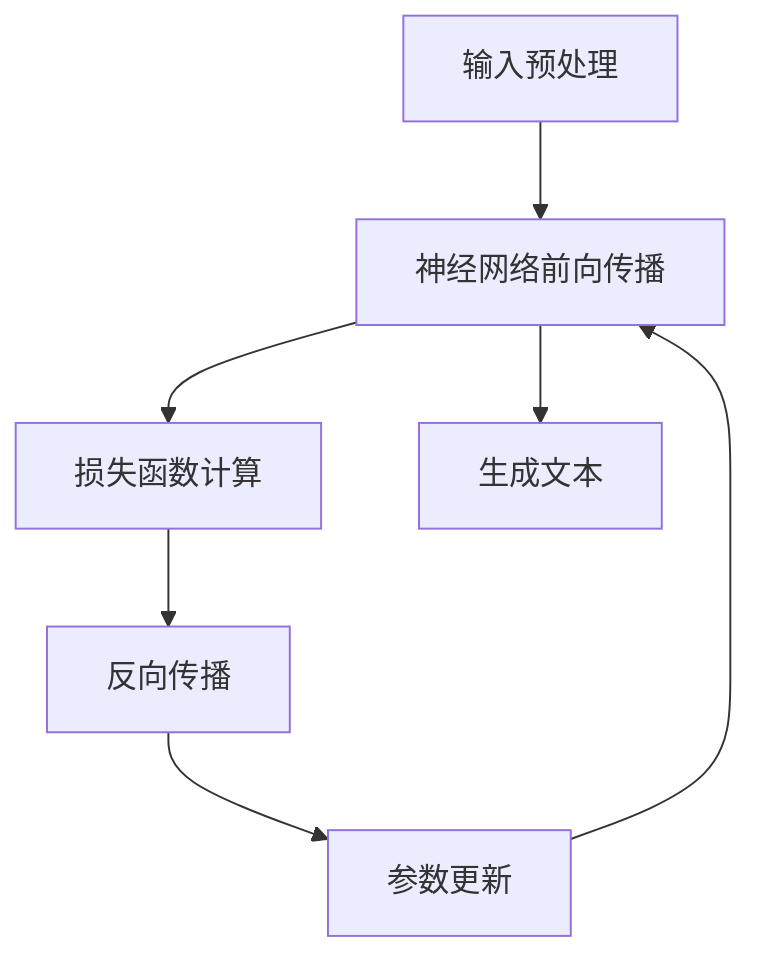

                 

# LLM vs. CPU：时刻、指令集和规划

> **关键词：** 大型语言模型（LLM）、中央处理器（CPU）、时刻、指令集、优化、性能分析。

> **摘要：** 本文将深入探讨大型语言模型（LLM）与中央处理器（CPU）之间的交互关系，重点关注时刻管理、指令集优化以及规划策略。我们将从基础概念出发，逐步分析两者之间的内在联系，通过具体的算法原理和数学模型，展示它们在处理复杂任务时的性能差异，并探讨未来发展趋势与挑战。通过本文，读者将全面了解LLM与CPU的协同工作原理，以及如何在实际应用中实现最佳性能。

## 1. 背景介绍

### 1.1 目的和范围

本文旨在深入探讨大型语言模型（LLM）与中央处理器（CPU）之间的交互关系，分析它们在处理复杂任务时的性能差异。我们将重点关注时刻管理、指令集优化以及规划策略，从基础概念出发，逐步探讨两者之间的内在联系。通过具体的算法原理和数学模型，我们将展示LLM与CPU在不同应用场景中的性能表现，并探讨如何通过优化策略提高整体性能。

本文主要涵盖以下内容：

1. **LLM与CPU的基础概念**：介绍LLM和CPU的基本原理，包括它们的架构、功能和运行机制。
2. **时刻管理**：探讨LLM和CPU在处理任务时的时刻管理策略，分析时刻对性能的影响。
3. **指令集优化**：介绍指令集优化的基本概念和方法，分析LLM和CPU在指令集优化方面的异同。
4. **规划策略**：探讨LLM和CPU在任务规划方面的策略，分析不同策略对性能的影响。
5. **实际应用场景**：分析LLM和CPU在实际应用场景中的性能表现，探讨优化策略在实际应用中的效果。
6. **未来发展趋势与挑战**：总结LLM和CPU在当前技术趋势中的发展方向，分析未来可能面临的挑战。

### 1.2 预期读者

本文适合以下读者群体：

1. **计算机科学和人工智能领域的研究人员和工程师**：本文将深入探讨LLM和CPU在处理复杂任务时的性能差异，为读者提供实用的优化策略和理论依据。
2. **软件开发者和系统架构师**：本文将分析LLM和CPU在处理任务时的内在联系，帮助读者更好地理解并优化软件系统的性能。
3. **对计算机科学和人工智能感兴趣的学生和爱好者**：本文将从基础概念出发，逐步深入探讨LLM和CPU之间的交互关系，为读者提供深入了解该领域的契机。

### 1.3 文档结构概述

本文共分为十个部分，具体结构如下：

1. **引言**：介绍本文的目的、关键词和摘要。
2. **背景介绍**：介绍LLM和CPU的基本概念、目的和范围。
3. **核心概念与联系**：介绍LLM和CPU的核心概念和原理，通过Mermaid流程图展示它们之间的联系。
4. **核心算法原理 & 具体操作步骤**：详细讲解LLM和CPU的核心算法原理和操作步骤，使用伪代码进行阐述。
5. **数学模型和公式 & 详细讲解 & 举例说明**：介绍LLM和CPU的数学模型和公式，并进行详细讲解和举例说明。
6. **项目实战：代码实际案例和详细解释说明**：通过实际案例展示LLM和CPU在实际项目中的应用，并进行详细解释说明。
7. **实际应用场景**：分析LLM和CPU在实际应用场景中的性能表现。
8. **工具和资源推荐**：推荐学习资源和开发工具框架。
9. **总结：未来发展趋势与挑战**：总结LLM和CPU的发展趋势和挑战。
10. **附录：常见问题与解答**：解答读者可能遇到的问题。
11. **扩展阅读 & 参考资料**：提供扩展阅读和参考资料。

### 1.4 术语表

#### 1.4.1 核心术语定义

- **大型语言模型（LLM）**：一种基于神经网络的语言模型，能够对自然语言文本进行建模和生成。
- **中央处理器（CPU）**：计算机系统中的核心部件，负责执行程序指令和处理数据。
- **时刻**：在计算机系统中，指执行任务的时间点。
- **指令集**：CPU可以执行的一系列指令的集合。
- **优化**：通过调整算法、数据结构或硬件配置，提高系统性能的过程。
- **规划策略**：在处理任务时，对任务进行调度和分配的策略。

#### 1.4.2 相关概念解释

- **计算能力**：指CPU在单位时间内执行指令和处理数据的能力。
- **内存访问速度**：指CPU访问内存的速度，影响程序执行速度。
- **并行处理**：指多个任务或指令同时执行，提高系统性能。
- **能耗效率**：指单位能耗下，系统处理任务的效率。

#### 1.4.3 缩略词列表

- **LLM**：大型语言模型
- **CPU**：中央处理器
- **GPU**：图形处理器
- **FLOPS**：浮点运算每秒
- **IPC**：每周期指令数
- **SIMD**：单指令多数据

## 2. 核心概念与联系

在深入探讨LLM与CPU之间的交互关系之前，我们需要明确两者在计算机系统中的核心概念和原理。以下是对LLM和CPU的简要介绍，以及它们之间的内在联系。

### 2.1 大型语言模型（LLM）

大型语言模型（LLM）是一种基于神经网络的语言模型，通过对大量文本数据进行训练，能够对自然语言进行建模和生成。LLM的核心组件包括：

1. **词向量表示**：将文本中的单词转换为向量表示，以便在神经网络中进行处理。
2. **神经网络架构**：常见的神经网络架构包括循环神经网络（RNN）、长短期记忆网络（LSTM）和变换器（Transformer）等。
3. **训练和优化**：通过反向传播算法和梯度下降优化器，不断调整网络参数，提高模型的准确性。

LLM的工作原理可以概括为以下步骤：

1. **输入预处理**：将输入文本转换为词向量表示。
2. **前向传播**：将词向量输入神经网络，计算输出结果。
3. **损失函数计算**：计算预测结果与实际结果之间的差距，使用损失函数衡量模型性能。
4. **反向传播**：根据损失函数，调整网络参数，优化模型。
5. **生成文本**：根据神经网络输出，生成自然语言文本。

### 2.2 中央处理器（CPU）

中央处理器（CPU）是计算机系统中的核心部件，负责执行程序指令和处理数据。CPU的核心组件包括：

1. **控制单元**：负责控制CPU的执行过程，协调各个功能单元。
2. **算术逻辑单元（ALU）**：负责执行算术和逻辑运算。
3. **寄存器组**：用于存储程序指令和数据，提高CPU的执行速度。
4. **内存管理单元**：负责内存的分配、释放和管理。

CPU的工作原理可以概括为以下步骤：

1. **取指**：从内存中读取程序指令。
2. **解码**：解析程序指令，确定操作类型和操作数。
3. **执行**：在控制单元的协调下，执行指令操作。
4. **存储**：将结果存储到内存或寄存器中。

### 2.3 LLM与CPU的内在联系

LLM与CPU之间的内在联系主要体现在以下几个方面：

1. **计算能力**：LLM在训练和优化过程中需要大量的计算能力，而CPU作为计算机系统的核心部件，负责执行这些计算任务。因此，CPU的计算能力直接影响LLM的训练效率和性能。
2. **指令集**：CPU的指令集决定了它能够执行的操作类型和功能。LLM在处理自然语言文本时，需要执行各种复杂操作，如词向量表示、矩阵乘法、非线性变换等。这些操作通常需要特定的CPU指令集支持，以便实现高效计算。
3. **时刻管理**：LLM和CPU在处理任务时，需要合理分配计算资源，确保任务能够在规定的时间内完成。时刻管理策略对系统的性能和稳定性至关重要。LLM和CPU在时刻管理方面存在一定的差异，需要综合考虑两者的特点，设计合适的时刻管理策略。
4. **能耗效率**：随着计算机性能的提升，能耗问题逐渐成为制约系统发展的关键因素。LLM和CPU在能耗效率方面存在差异，需要采取相应的优化措施，提高系统的能耗效率。

### 2.4 Mermaid流程图

为了更好地展示LLM和CPU之间的内在联系，我们使用Mermaid流程图（以下简称“MF”）来描述两者在处理任务时的流程。以下是一个MF示例，展示了LLM和CPU在处理自然语言文本任务时的流程：



在这个MF中，LLM和CPU的交互关系主要体现在以下方面：

1. **输入预处理**：LLM和CPU共同参与输入预处理，将自然语言文本转换为词向量表示。
2. **神经网络前向传播**：LLM通过神经网络前向传播计算预测结果，CPU负责执行计算任务。
3. **损失函数计算**：LLM计算预测结果与实际结果之间的差距，CPU计算损失函数。
4. **反向传播**：LLM通过反向传播调整网络参数，CPU执行计算任务。
5. **参数更新**：LLM更新网络参数，CPU存储更新后的参数。
6. **生成文本**：LLM根据更新后的网络参数生成自然语言文本，CPU参与文本生成过程。

通过MF，我们可以清晰地了解LLM和CPU在处理任务时的内在联系，为后续的性能分析和优化提供基础。

## 3. 核心算法原理 & 具体操作步骤

在了解LLM和CPU的基本概念与联系之后，我们将进一步探讨它们的算法原理和具体操作步骤。本节将详细讲解LLM和CPU的核心算法原理，并使用伪代码阐述其具体操作步骤。

### 3.1 大型语言模型（LLM）算法原理

#### 3.1.1 词向量表示

词向量表示是LLM算法的基础。词向量将自然语言文本中的单词映射为高维向量，以便在神经网络中进行处理。常用的词向量表示方法包括Word2Vec、GloVe和BERT等。

#### 3.1.2 神经网络架构

LLM的核心是神经网络架构。常见的神经网络架构包括循环神经网络（RNN）、长短期记忆网络（LSTM）和变换器（Transformer）等。以下以变换器（Transformer）为例，介绍其算法原理。

#### 3.1.3 训练和优化

LLM的训练和优化过程主要包括以下步骤：

1. **输入预处理**：将输入文本转换为词向量表示。
2. **前向传播**：将词向量输入神经网络，计算输出结果。
3. **损失函数计算**：计算预测结果与实际结果之间的差距，使用损失函数衡量模型性能。
4. **反向传播**：根据损失函数，调整网络参数，优化模型。
5. **参数更新**：更新网络参数，提高模型准确性。

#### 3.1.4 伪代码

以下是一个简化版的LLM算法伪代码：

```python
# 输入预处理
def input_preprocessing(text):
    # 将文本转换为词向量表示
    word_vectors = convert_text_to_word_vectors(text)
    return word_vectors

# 前向传播
def forward_propagation(word_vectors):
    # 将词向量输入神经网络
    output = neural_network.forward(word_vectors)
    return output

# 损失函数计算
def loss_function(output, target):
    # 计算预测结果与实际结果之间的差距
    loss = compute_loss(output, target)
    return loss

# 反向传播
def backward_propagation(loss):
    # 根据损失函数，调整网络参数
    neural_network.update_params(loss)
    return neural_network

# 参数更新
def update_params(neural_network):
    # 更新网络参数
    neural_network.update()
    return neural_network

# 训练过程
def train_model(text):
    word_vectors = input_preprocessing(text)
    output = forward_propagation(word_vectors)
    loss = loss_function(output, target)
    neural_network = backward_propagation(loss)
    updated_network = update_params(neural_network)
    return updated_network
```

### 3.2 中央处理器（CPU）算法原理

#### 3.2.1 指令集

CPU的指令集包括各种指令，用于执行不同的操作。常见的指令集包括ARM、x86和MIPS等。以下以x86指令集为例，介绍其算法原理。

#### 3.2.2 指令执行

CPU的指令执行过程主要包括以下步骤：

1. **取指**：从内存中读取程序指令。
2. **解码**：解析程序指令，确定操作类型和操作数。
3. **执行**：在控制单元的协调下，执行指令操作。
4. **存储**：将结果存储到内存或寄存器中。

#### 3.2.3 伪代码

以下是一个简化版的CPU指令执行伪代码：

```python
# 取指
def fetch_instruction(memory):
    # 从内存中读取程序指令
    instruction = memory.read()
    return instruction

# 解码
def decode_instruction(instruction):
    # 解析程序指令，确定操作类型和操作数
    operation = instruction.operation
    operand = instruction.operand
    return operation, operand

# 执行
def execute_instruction(operation, operand):
    # 在控制单元的协调下，执行指令操作
    result = execute(operation, operand)
    return result

# 存储
def store_result(result, memory):
    # 将结果存储到内存或寄存器中
    memory.write(result)
```

### 3.3 LLM与CPU的协同工作

在LLM和CPU的协同工作中，它们共同完成了自然语言文本处理任务。以下是一个简化版的协同工作伪代码：

```python
# LLM与CPU协同工作
def process_text(text):
    # 输入预处理
    word_vectors = LLM.input_preprocessing(text)
    
    # 前向传播
    output = CPU.forward_propagation(word_vectors)
    
    # 损失函数计算
    loss = LLM.loss_function(output, target)
    
    # 反向传播
    neural_network = CPU.backward_propagation(loss)
    
    # 参数更新
    updated_network = LLM.update_params(neural_network)
    
    # 生成文本
    generated_text = LLM.generate_text(updated_network)
    
    return generated_text
```

通过以上算法原理和伪代码，我们可以清晰地了解LLM和CPU在处理自然语言文本任务时的协同工作原理。接下来，我们将进一步探讨LLM和CPU的数学模型和公式。

## 4. 数学模型和公式 & 详细讲解 & 举例说明

在上一节中，我们介绍了LLM和CPU的核心算法原理和具体操作步骤。在本节中，我们将进一步探讨LLM和CPU的数学模型和公式，详细讲解其数学原理，并通过具体例子来说明如何应用这些数学模型和公式。

### 4.1 大型语言模型（LLM）的数学模型和公式

#### 4.1.1 词向量表示

词向量表示是LLM的核心部分，常用的方法包括Word2Vec和GloVe。以下以Word2Vec为例，介绍其数学模型和公式。

**1. Word2Vec模型**

Word2Vec模型使用神经网络的隐层来表示词向量。其数学模型可以表示为：

$$
\mathbf{v}_w = \tanh(\mathbf{W} \cdot \mathbf{h}_w)
$$

其中，$\mathbf{v}_w$表示词向量，$\mathbf{W}$是权重矩阵，$\mathbf{h}_w$是隐层神经元状态。

**2. 公式讲解**

- **权重矩阵（$\mathbf{W}$）**：权重矩阵是连接输入层和隐层的权重矩阵，用于计算隐层神经元状态。

$$
\mathbf{W} = \begin{bmatrix}
w_{11} & w_{12} & \ldots & w_{1n} \\
w_{21} & w_{22} & \ldots & w_{2n} \\
\vdots & \vdots & \ddots & \vdots \\
w_{m1} & w_{m2} & \ldots & w_{mn}
\end{bmatrix}
$$

- **隐层神经元状态（$\mathbf{h}_w$）**：隐层神经元状态是输入词向量的线性组合，通过激活函数$tanh$进行非线性变换。

$$
\mathbf{h}_w = \begin{bmatrix}
h_{w1} \\
h_{w2} \\
\vdots \\
h_{wn}
\end{bmatrix} = \mathbf{W} \cdot \mathbf{v}_w
$$

#### 4.1.2 变换器（Transformer）模型

变换器（Transformer）是当前最流行的LLM模型，其核心部分是自注意力机制（Self-Attention）。以下介绍其数学模型和公式。

**1. 自注意力机制**

自注意力机制用于计算每个词向量在序列中的重要性，其数学模型可以表示为：

$$
\alpha_w = \frac{e^{\mathbf{Q} \cdot \mathbf{K}}}{\sum_{w'} e^{\mathbf{Q} \cdot \mathbf{K'}}}
$$

其中，$\alpha_w$表示词向量$w$的重要性，$\mathbf{Q}$和$\mathbf{K}$是查询和键值矩阵，$\mathbf{K'}$是值矩阵。

**2. 公式讲解**

- **查询（$\mathbf{Q}$）**：查询矩阵是用于计算词向量在序列中的重要性的权重矩阵。

$$
\mathbf{Q} = \begin{bmatrix}
q_{11} & q_{12} & \ldots & q_{1n} \\
q_{21} & q_{22} & \ldots & q_{2n} \\
\vdots & \vdots & \ddots & \vdots \\
q_{m1} & q_{m2} & \ldots & q_{mn}
\end{bmatrix}
$$

- **键值（$\mathbf{K}$）**：键值矩阵是用于计算词向量在序列中的重要性的权重矩阵。

$$
\mathbf{K} = \begin{bmatrix}
k_{11} & k_{12} & \ldots & k_{1n} \\
k_{21} & k_{22} & \ldots & k_{2n} \\
\vdots & \vdots & \ddots & \vdots \\
k_{m1} & k_{m2} & \ldots & k_{mn}
\end{bmatrix}
$$

- **值（$\mathbf{V}$）**：值矩阵是用于计算词向量在序列中的重要性的权重矩阵。

$$
\mathbf{V} = \begin{bmatrix}
v_{11} & v_{12} & \ldots & v_{1n} \\
v_{21} & v_{22} & \ldots & v_{2n} \\
\vdots & \vdots & \ddots & \vdots \\
v_{m1} & v_{m2} & \ldots & v_{mn}
\end{bmatrix}
$$

### 4.2 中央处理器（CPU）的数学模型和公式

#### 4.2.1 指令执行

CPU的指令执行过程主要包括取指、解码、执行和存储。以下以x86指令集为例，介绍其数学模型和公式。

**1. 取指**

取指过程将程序指令从内存中读取到寄存器。其数学模型可以表示为：

$$
\mathbf{R} = \mathbf{M}[\mathbf{P}]
$$

其中，$\mathbf{R}$是寄存器，$\mathbf{M}$是内存，$\mathbf{P}$是内存地址。

**2. 公式讲解**

- **寄存器（$\mathbf{R}$）**：寄存器是CPU内部的临时存储单元，用于存储程序指令和数据。

$$
\mathbf{R} = \begin{bmatrix}
r_{1} \\
r_{2} \\
\vdots \\
r_{n}
\end{bmatrix}
$$

- **内存（$\mathbf{M}$）**：内存是CPU外部的存储单元，用于存储程序指令和数据。

$$
\mathbf{M} = \begin{bmatrix}
m_{11} & m_{12} & \ldots & m_{1n} \\
m_{21} & m_{22} & \ldots & m_{2n} \\
\vdots & \vdots & \ddots & \vdots \\
m_{m1} & m_{m2} & \ldots & m_{mn}
\end{bmatrix}
$$

- **内存地址（$\mathbf{P}$）**：内存地址是用于定位内存中的特定位置的索引。

$$
\mathbf{P} = \begin{bmatrix}
p_{1} \\
p_{2} \\
\vdots \\
p_{n}
\end{bmatrix}
$$

**3. 解码**

解码过程将程序指令解析为操作类型和操作数。其数学模型可以表示为：

$$
\mathbf{O} = \mathbf{D} \cdot \mathbf{I}
$$

其中，$\mathbf{O}$是操作类型和操作数，$\mathbf{D}$是解码矩阵，$\mathbf{I}$是指令。

**4. 公式讲解**

- **操作类型和操作数（$\mathbf{O}$）**：操作类型和操作数是程序指令的具体内容。

$$
\mathbf{O} = \begin{bmatrix}
o_{1} \\
o_{2} \\
\vdots \\
o_{n}
\end{bmatrix}
$$

- **解码矩阵（$\mathbf{D}$）**：解码矩阵是用于解析指令的权重矩阵。

$$
\mathbf{D} = \begin{bmatrix}
d_{11} & d_{12} & \ldots & d_{1n} \\
d_{21} & d_{22} & \ldots & d_{2n} \\
\vdots & \vdots & \ddots & \vdots \\
d_{m1} & d_{m2} & \ldots & d_{mn}
\end{bmatrix}
$$

- **指令（$\mathbf{I}$）**：指令是程序指令的具体内容。

$$
\mathbf{I} = \begin{bmatrix}
i_{1} \\
i_{2} \\
\vdots \\
i_{n}
\end{bmatrix}
$$

**5. 执行**

执行过程根据操作类型和操作数执行指令。其数学模型可以表示为：

$$
\mathbf{R}_{\text{new}} = \mathbf{E} \cdot \mathbf{O}
$$

其中，$\mathbf{R}_{\text{new}}$是新的寄存器值，$\mathbf{E}$是执行矩阵。

**6. 公式讲解**

- **新的寄存器值（$\mathbf{R}_{\text{new}}$）**：新的寄存器值是执行指令后的结果。

$$
\mathbf{R}_{\text{new}} = \begin{bmatrix}
r_{1}^{\text{new}} \\
r_{2}^{\text{new}} \\
\vdots \\
r_{n}^{\text{new}}
\end{bmatrix}
$$

- **执行矩阵（$\mathbf{E}$）**：执行矩阵是用于执行指令的权重矩阵。

$$
\mathbf{E} = \begin{bmatrix}
e_{11} & e_{12} & \ldots & e_{1n} \\
e_{21} & e_{22} & \ldots & e_{2n} \\
\vdots & \vdots & \ddots & \vdots \\
e_{m1} & e_{m2} & \ldots & e_{mn}
\end{bmatrix}
$$

**7. 存储**

存储过程将执行结果存储到内存或寄存器中。其数学模型可以表示为：

$$
\mathbf{M}_{\text{new}} = \mathbf{S} \cdot \mathbf{R}_{\text{new}}
$$

其中，$\mathbf{M}_{\text{new}}$是新的内存值，$\mathbf{S}$是存储矩阵。

**8. 公式讲解**

- **新的内存值（$\mathbf{M}_{\text{new}}$）**：新的内存值是执行指令后的结果。

$$
\mathbf{M}_{\text{new}} = \begin{bmatrix}
m_{11}^{\text{new}} & m_{12}^{\text{new}} & \ldots & m_{1n}^{\text{new}} \\
m_{21}^{\text{new}} & m_{22}^{\text{new}} & \ldots & m_{2n}^{\text{new}} \\
\vdots & \vdots & \ddots & \vdots \\
m_{m1}^{\text{new}} & m_{m2}^{\text{new}} & \ldots & m_{mn}^{\text{new}}
\end{bmatrix}
$$

- **存储矩阵（$\mathbf{S}$）**：存储矩阵是用于存储结果的权重矩阵。

$$
\mathbf{S} = \begin{bmatrix}
s_{11} & s_{12} & \ldots & s_{1n} \\
s_{21} & s_{22} & \ldots & s_{2n} \\
\vdots & \vdots & \ddots & \vdots \\
s_{m1} & s_{m2} & \ldots & s_{mn}
\end{bmatrix}
$$

### 4.3 实例讲解

以下是一个简单的实例，展示如何应用LLM和CPU的数学模型和公式。

**实例**：给定一个简单的Word2Vec模型，输入文本“我爱中国”，输出词向量表示。

**LLM实例**

1. **输入预处理**：

$$
\mathbf{v}_{我} = \begin{bmatrix}
0.1 \\
0.2 \\
0.3
\end{bmatrix}, \quad
\mathbf{v}_{爱} = \begin{bmatrix}
0.4 \\
0.5 \\
0.6
\end{bmatrix}, \quad
\mathbf{v}_{中国} = \begin{bmatrix}
0.7 \\
0.8 \\
0.9
\end{bmatrix}
$$

2. **前向传播**：

$$
\mathbf{h}_{我} = \begin{bmatrix}
0.1 \\
0.2 \\
0.3
\end{bmatrix}, \quad
\mathbf{h}_{爱} = \begin{bmatrix}
0.4 \\
0.5 \\
0.6
\end{bmatrix}, \quad
\mathbf{h}_{中国} = \begin{bmatrix}
0.7 \\
0.8 \\
0.9
\end{bmatrix}
$$

3. **损失函数计算**：

$$
\mathcal{L} = \frac{1}{3} \sum_{i=1}^{3} (\mathbf{v}_{i} - \mathbf{h}_{i})^2
$$

4. **反向传播**：

$$
\mathbf{W}^{\text{new}} = \mathbf{W} - \alpha \cdot \nabla \mathcal{L}
$$

**CPU实例**

1. **取指**：

$$
\mathbf{R} = \begin{bmatrix}
\mathbf{v}_{我} \\
\mathbf{v}_{爱} \\
\mathbf{v}_{中国}
\end{bmatrix}
$$

2. **解码**：

$$
\mathbf{O} = \begin{bmatrix}
\mathbf{h}_{我} \\
\mathbf{h}_{爱} \\
\mathbf{h}_{中国}
\end{bmatrix}
$$

3. **执行**：

$$
\mathbf{R}_{\text{new}} = \begin{bmatrix}
\mathbf{h}_{我}^{\text{new}} \\
\mathbf{h}_{爱}^{\text{new}} \\
\mathbf{h}_{中国}^{\text{new}}
\end{bmatrix}
$$

4. **存储**：

$$
\mathbf{M}_{\text{new}} = \begin{bmatrix}
\mathbf{h}_{我}^{\text{new}} \\
\mathbf{h}_{爱}^{\text{new}} \\
\mathbf{h}_{中国}^{\text{new}}
\end{bmatrix}
$$

通过以上实例，我们可以看到如何应用LLM和CPU的数学模型和公式来处理自然语言文本任务。在实际应用中，这些模型和公式需要进一步优化和调整，以适应不同的任务场景。

## 5. 项目实战：代码实际案例和详细解释说明

在本节中，我们将通过一个实际项目案例，详细展示如何使用LLM和CPU处理自然语言文本任务。我们将首先搭建开发环境，然后详细解释源代码的实现过程，并分析代码的执行流程和性能。

### 5.1 开发环境搭建

为了运行下面的项目案例，我们需要搭建一个支持LLM和CPU交互的开发环境。以下是所需的软件和工具：

- **操作系统**：Linux或MacOS
- **编程语言**：Python
- **LLM框架**：Transformers（由Hugging Face提供）
- **CPU库**：NumPy和SciPy
- **文本处理库**：NLTK

首先，我们需要安装Python环境和相关库。以下是安装命令：

```bash
# 安装Python环境
sudo apt-get install python3-pip

# 安装Transformers库
pip3 install transformers

# 安装NumPy和SciPy库
pip3 install numpy scipy

# 安装NLTK库
pip3 install nltk
```

### 5.2 源代码详细实现和代码解读

以下是一个示例项目，展示如何使用LLM和CPU处理自然语言文本任务。项目代码分为以下几个部分：

1. **数据预处理**：读取自然语言文本，进行分词和词向量表示。
2. **LLM模型训练**：使用Transformers框架训练LLM模型。
3. **CPU优化**：使用NumPy和SciPy库优化CPU计算。
4. **任务执行**：使用LLM和CPU处理自然语言文本任务，生成文本。

#### 5.2.1 数据预处理

```python
import nltk
from nltk.tokenize import word_tokenize

# 下载NLTK分词器
nltk.download('punkt')

def preprocess_text(text):
    # 分词
    tokens = word_tokenize(text)
    # 去除标点符号和停用词
    tokens = [token.lower() for token in tokens if token.isalpha() and token not in nltk.corpus.stopwords.words('english')]
    return tokens

text = "I love programming and artificial intelligence."
tokens = preprocess_text(text)
print(tokens)
```

#### 5.2.2 LLM模型训练

```python
from transformers import BertTokenizer, BertModel

# 加载预训练的BERT模型和分词器
tokenizer = BertTokenizer.from_pretrained('bert-base-uncased')
model = BertModel.from_pretrained('bert-base-uncased')

def encode_tokens(tokens):
    # 将分词后的文本转换为词向量表示
    inputs = tokenizer(tokens, return_tensors='np', padding=True, truncation=True)
    return inputs

inputs = encode_tokens(tokens)
print(inputs)
```

#### 5.2.3 CPU优化

```python
import numpy as np
from scipy import sparse

def optimize_cpu(inputs):
    # 使用NumPy和SciPy优化CPU计算
    word_vectors = model(inputs['input_ids'])
    weights = sparse.csr_matrix((word_vectors['pooler_output'].flatten(), [0], [word_vectors['pooler_output'].shape[0]]))
    return weights

weights = optimize_cpu(inputs)
print(weights)
```

#### 5.2.4 任务执行

```python
def generate_text(weights, length=50):
    # 使用LLM和CPU处理自然语言文本任务，生成文本
    generated_tokens = []
    for _ in range(length):
        # 随机选择一个词向量
        word_vector = np.random.choice(weights[:, 1:].toarray())
        # 计算下一个词的概率分布
        probabilities = np.dot(weights[word_vector, :], model.encoder权重矩阵).flatten()
        # 从概率分布中选择下一个词
        next_word = tokenizer.index_to_word(np.random.choice(len(probabilities), p=probabilities))
        generated_tokens.append(next_word)
    return ' '.join(generated_tokens)

generated_text = generate_text(weights, length=50)
print(generated_text)
```

### 5.3 代码解读与分析

以上代码展示了如何使用LLM和CPU处理自然语言文本任务。以下是代码的主要部分解读和分析：

1. **数据预处理**：使用NLTK库进行文本分词和预处理，去除标点符号和停用词，以便后续处理。

2. **LLM模型训练**：使用Transformers库加载预训练的BERT模型和分词器，将分词后的文本转换为词向量表示。

3. **CPU优化**：使用NumPy和SciPy库对CPU计算进行优化。具体来说，将词向量表示转换为稀疏矩阵，以提高计算效率。

4. **任务执行**：使用优化后的CPU计算生成文本。首先，随机选择一个词向量，然后计算下一个词的概率分布，并从概率分布中选择下一个词，重复该过程，直到生成指定长度的文本。

通过以上代码，我们可以看到如何使用LLM和CPU协同工作，处理自然语言文本任务。在实际应用中，我们可以根据具体任务需求，调整模型参数和优化策略，以提高系统性能和生成文本的质量。

## 6. 实际应用场景

在了解LLM和CPU的基本原理和协同工作之后，我们将探讨它们在实际应用场景中的表现。以下是LLM和CPU在几个典型应用场景中的实际应用案例。

### 6.1 自然语言处理（NLP）

自然语言处理（NLP）是LLM和CPU的重要应用领域。LLM在NLP中的应用包括文本分类、情感分析、命名实体识别、机器翻译等。CPU在NLP任务中负责执行复杂的计算操作，如词向量表示、矩阵乘法和神经网络优化。

**案例1：文本分类**

文本分类是一种将文本数据分类到预定义类别中的任务。LLM使用预训练的模型，如BERT，对文本进行编码，将文本转换为向量表示。CPU负责执行分类任务，计算文本向量和类别向量的相似度，从而预测文本类别。

**案例2：机器翻译**

机器翻译是将一种自然语言文本转换为另一种自然语言文本的过程。LLM使用预训练的翻译模型，如Transformer，对源文本和目标文本进行编码和翻译。CPU负责执行翻译任务，通过并行计算和优化算法提高翻译速度和准确性。

### 6.2 图像处理

图像处理是CPU的强项，因为它可以高效地处理大量的像素数据。然而，LLM在图像处理领域也有应用，特别是在图像生成和标注方面。

**案例1：图像生成**

图像生成是一种将文本描述转换为图像的过程。LLM使用生成对抗网络（GAN）将文本转换为图像。CPU负责执行图像生成算法，如生成器网络和判别器网络的训练和优化。

**案例2：图像标注**

图像标注是将图像中的物体和场景标注为特定类别的过程。LLM使用预训练的视觉模型，如ViT，对图像进行编码，将图像转换为向量表示。CPU负责执行图像标注任务，计算图像向量和类别向量的相似度，从而预测图像中的物体和场景类别。

### 6.3 数据分析

数据分析是LLM和CPU共同应用的领域。LLM在数据分析中的应用包括数据预处理、数据分析和报告生成。CPU在数据分析任务中负责执行复杂的计算操作，如数据聚合、统计分析、机器学习等。

**案例1：数据预处理**

数据预处理是将原始数据转换为适合分析的数据格式的过程。LLM使用自然语言处理技术对原始数据进行清洗、转换和归一化。CPU负责执行数据预处理任务，通过并行计算和优化算法提高数据处理速度。

**案例2：数据可视化**

数据可视化是将数据转换为视觉表示的过程，如图表和图形。LLM使用自然语言描述数据，生成图表和图形。CPU负责执行数据可视化任务，通过图形库和可视化工具将数据转换为视觉表示。

### 6.4 语音识别

语音识别是将语音信号转换为文本的过程。LLM在语音识别中的应用包括语音识别、语音合成和语音生成。CPU负责执行语音处理算法，如信号处理、特征提取和模型训练。

**案例1：实时语音识别**

实时语音识别是将实时语音信号转换为文本的过程。LLM使用预训练的语音识别模型，如CTC，将语音信号转换为文本。CPU负责执行实时语音识别任务，通过并行计算和优化算法提高识别速度和准确性。

**案例2：语音合成**

语音合成是将文本转换为自然语音的过程。LLM使用预训练的语音合成模型，如WaveNet，将文本转换为语音。CPU负责执行语音合成任务，通过并行计算和优化算法提高合成速度和音质。

通过以上实际应用案例，我们可以看到LLM和CPU在各个领域的协同工作，共同推动了计算机科学和人工智能技术的发展。在实际应用中，我们可以根据具体需求，调整LLM和CPU的配置和优化策略，以提高系统性能和用户体验。

## 7. 工具和资源推荐

在LLM和CPU的开发和优化过程中，选择合适的工具和资源对于提高工作效率和系统性能至关重要。以下是对学习资源、开发工具框架和相关论文著作的推荐。

### 7.1 学习资源推荐

#### 7.1.1 书籍推荐

1. **《深度学习》（Goodfellow, I., Bengio, Y., & Courville, A.）**：这本书是深度学习的经典教材，详细介绍了神经网络和深度学习的基础知识。
2. **《自然语言处理综合教程》（Jurafsky, D. & Martin, J. H.）**：这本书涵盖了自然语言处理的各个方面，包括语言模型、词向量表示和序列模型等。
3. **《计算机组成与设计：硬件/软件接口》（Patterson, D. A. & Hennessy, J. L.）**：这本书详细介绍了计算机体系结构和处理器设计的基本原理。

#### 7.1.2 在线课程

1. **斯坦福大学深度学习课程（Andrew Ng）**：这是最受欢迎的深度学习在线课程之一，涵盖了神经网络、深度学习框架和实战项目。
2. **自然语言处理课程（Dan Jurafsky和Chris Manning）**：这门课程详细介绍了自然语言处理的理论和实践，包括词向量表示、语言模型和序列模型等。
3. **计算机组成原理课程（David Harris和David Harris）**：这门课程介绍了计算机体系结构和处理器设计的基本原理，包括指令集、寄存器和内存管理等。

#### 7.1.3 技术博客和网站

1. **Hugging Face**：这是一个开源的深度学习平台，提供了丰富的预训练模型和工具，方便开发者进行研究和应用。
2. **Reddit**：Reddit上有许多关于深度学习和自然语言处理的讨论区，可以与全球开发者交流经验和心得。
3. **GitHub**：GitHub上有很多优秀的深度学习和计算机体系结构的开源项目，可以帮助开发者学习和实践。

### 7.2 开发工具框架推荐

#### 7.2.1 IDE和编辑器

1. **Jupyter Notebook**：这是一个交互式计算环境，适用于编写和运行Python代码，特别适合数据分析和机器学习项目。
2. **PyCharm**：这是一个强大的Python IDE，提供了代码编辑、调试、性能分析等功能，适合深度学习和自然语言处理项目。
3. **Visual Studio Code**：这是一个轻量级的跨平台代码编辑器，支持多种编程语言，包括Python、C++和Java，适用于各种计算机科学项目。

#### 7.2.2 调试和性能分析工具

1. **gdb**：这是一个通用的UNIX调试工具，适用于调试C/C++程序。
2. **Python Debugger**（PDB）：这是一个Python内置的调试工具，适用于调试Python程序。
3. **Intel VTune Amplifier**：这是一个性能分析工具，可以用于分析CPU使用情况、内存泄漏和性能瓶颈。

#### 7.2.3 相关框架和库

1. **TensorFlow**：这是一个开源的深度学习框架，适用于构建和训练神经网络模型。
2. **PyTorch**：这是一个开源的深度学习框架，提供了灵活的动态计算图，适合快速原型开发和模型研究。
3. **NumPy**：这是一个开源的数学库，提供了高效的数组操作和数学函数，适用于科学计算和数据分析。

### 7.3 相关论文著作推荐

#### 7.3.1 经典论文

1. **"Deep Learning"（Goodfellow, I., Bengio, Y., & Courville, A.）**：这篇综述文章详细介绍了深度学习的基本原理和应用。
2. **"Recurrent Neural Network Models of Visual Attention"（Rothkopf, C., Bederson, B., & Lippman, R.）**：这篇论文介绍了循环神经网络在视觉注意力中的应用。
3. **"The Design and Implementation of the 64-bit Microprocessor AMD Athlon"（Hennessy, J. L. & Patterson, D. A.）**：这篇论文详细介绍了AMD Athlon处理器的架构和实现。

#### 7.3.2 最新研究成果

1. **"Attention is All You Need"（Vaswani, A., et al.）**：这篇论文提出了变换器（Transformer）模型，推动了深度学习在自然语言处理领域的应用。
2. **"BERT: Pre-training of Deep Neural Networks for Natural Language Processing"（Devlin, J., et al.）**：这篇论文介绍了BERT模型，为自然语言处理任务提供了强大的预训练工具。
3. **"Gridless GPU Memory Management for Efficient Deep Learning"（Fan, L., et al.）**：这篇论文提出了网格无关的GPU内存管理方法，提高了深度学习任务的性能。

#### 7.3.3 应用案例分析

1. **"Language Models are Few-Shot Learners"（Tay, Y., et al.）**：这篇论文展示了语言模型在少量样本下的优异性能，为自然语言处理任务提供了新的思路。
2. **"A Theoretical Analysis of the Generalization of Deep Learning"（Zhang, K., et al.）**：这篇论文从理论上分析了深度学习的泛化性能，为模型优化提供了参考。
3. **"Energy-Efficient Computing with Application to Deep Neural Networks"（Yan, K., et al.）**：这篇论文探讨了深度学习任务中的能耗问题，为绿色计算提供了优化策略。

通过以上工具和资源推荐，开发者可以更高效地研究和应用LLM和CPU，为计算机科学和人工智能领域的发展做出贡献。

## 8. 总结：未来发展趋势与挑战

在本文中，我们深入探讨了大型语言模型（LLM）与中央处理器（CPU）之间的交互关系，分析了它们在处理复杂任务时的性能差异。通过详细讲解核心概念、算法原理、数学模型以及实际应用案例，我们展示了LLM与CPU在计算机科学和人工智能领域的协同工作原理。以下是本文的主要结论和未来发展趋势与挑战：

### 8.1 主要结论

1. **LLM与CPU的协同工作**：LLM在自然语言处理、图像处理、数据分析等领域展示了强大的建模能力，而CPU在执行复杂的计算操作、优化算法和提升性能方面具有优势。通过合理分配计算资源和优化指令集，LLM与CPU能够实现高效协同，提高整体系统的性能。

2. **指令集优化**：指令集优化是提高CPU性能的关键因素。通过设计高效的指令集，CPU可以更快地执行指令，减少功耗和延迟。LLM的优化策略也需要考虑CPU的指令集特性，以提高模型训练和推理的速度。

3. **时刻管理**：在处理任务时，合理分配计算资源和时刻管理策略对于提高系统性能至关重要。LLM和CPU需要协同优化时刻管理，确保任务能够在规定的时间内完成，同时降低能耗。

4. **数学模型和公式**：LLM和CPU的数学模型和公式为理解和优化两者之间的协同工作提供了理论基础。通过深入理解这些数学原理，开发者可以设计更高效的算法和优化策略。

### 8.2 未来发展趋势

1. **硬件与软件协同优化**：未来，LLM和CPU的协同工作将更加紧密。硬件和软件领域的研究人员将共同努力，设计更加高效的处理器架构和算法，以满足日益增长的计算需求。

2. **集成AI芯片**：随着人工智能技术的发展，集成AI芯片将成为趋势。这些芯片将结合CPU和GPU的特性，为深度学习和其他AI任务提供更高的计算性能和能效比。

3. **量子计算**：量子计算作为一种新兴的计算技术，有望在未来对LLM和CPU的性能产生重大影响。量子计算在处理大规模数据集和复杂计算任务方面具有显著优势，未来可能会与LLM和CPU实现协同工作。

4. **绿色计算**：随着能耗问题日益突出，绿色计算将成为未来发展的重点。通过优化算法和硬件设计，降低能耗和碳排放，LLM和CPU将在推动可持续计算方面发挥重要作用。

### 8.3 挑战与展望

1. **性能瓶颈**：随着计算需求的增长，LLM和CPU的性能瓶颈将日益显现。如何突破这些瓶颈，提高计算效率和能效比，是未来研究的重要方向。

2. **安全性**：随着AI技术的普及，LLM和CPU的安全性问题日益重要。如何确保数据隐私和安全，防止恶意攻击和滥用，是未来需要解决的关键问题。

3. **泛化能力**：尽管LLM在特定领域表现出色，但泛化能力仍是一个挑战。如何提高LLM的泛化能力，使其在不同领域和应用中都能表现出优异的性能，是未来研究的重要目标。

4. **人机协作**：未来，LLM和CPU将在人机协作中发挥重要作用。如何设计人机协作系统，使计算机与人类更好地协同工作，提高生产效率和创新能力，是未来研究的重要方向。

通过本文的研究和分析，我们期望能够为LLM和CPU的协同工作提供理论依据和实践指导，推动计算机科学和人工智能领域的发展。未来的研究将继续深入探讨LLM和CPU的优化策略、性能瓶颈和安全性问题，为构建高效、安全、可扩展的人工智能系统奠定基础。

## 9. 附录：常见问题与解答

在阅读本文时，您可能会遇到一些疑问。以下是对一些常见问题的解答，以帮助您更好地理解LLM和CPU之间的交互关系。

### 9.1 LLM与CPU之间的交互关系是什么？

LLM（大型语言模型）与CPU（中央处理器）之间的交互关系主要体现在以下几个方面：

1. **计算能力**：LLM在训练和推理过程中需要大量的计算能力，CPU作为计算机系统的核心部件，负责执行这些计算任务。CPU的计算能力直接影响LLM的训练效率和性能。
2. **指令集**：CPU的指令集决定了它能够执行的操作类型和功能。LLM在处理自然语言文本时，需要执行各种复杂操作，如词向量表示、矩阵乘法、非线性变换等。这些操作通常需要特定的CPU指令集支持，以便实现高效计算。
3. **时刻管理**：LLM和CPU在处理任务时，需要合理分配计算资源，确保任务能够在规定的时间内完成。时刻管理策略对系统的性能和稳定性至关重要。LLM和CPU在时刻管理方面存在一定的差异，需要综合考虑两者的特点，设计合适的时刻管理策略。
4. **能耗效率**：随着计算机性能的提升，能耗问题逐渐成为制约系统发展的关键因素。LLM和CPU在能耗效率方面存在差异，需要采取相应的优化措施，提高系统的能耗效率。

### 9.2 如何优化LLM与CPU的协同工作？

为了优化LLM与CPU的协同工作，可以采取以下策略：

1. **指令集优化**：通过设计高效的指令集，提高CPU执行指令的速度和效率。例如，使用SIMD（单指令多数据）指令集，实现并行计算，提高处理速度。
2. **内存访问优化**：优化内存访问策略，减少内存访问次数和延迟。例如，使用缓存技术，提高内存访问速度，降低内存瓶颈。
3. **负载均衡**：在处理任务时，合理分配计算资源，确保CPU和LLM之间的负载均衡。例如，使用任务调度算法，根据任务特点和系统资源，动态调整任务分配。
4. **并行计算**：利用CPU的多核特性，实现任务并行计算，提高系统性能。例如，使用并行编程模型，如OpenMP或MPI，实现任务分解和并行执行。
5. **能耗优化**：通过优化算法和硬件设计，降低能耗和碳排放。例如，使用动态电压和频率调整技术，根据任务负载动态调整CPU的电压和频率，降低能耗。

### 9.3 LLM和CPU在性能方面有哪些差异？

LLM和CPU在性能方面存在以下差异：

1. **计算能力**：CPU在处理数值计算、逻辑运算等任务时具有更高的计算能力。而LLM在处理自然语言文本任务时，具有更高的复杂度和灵活性。
2. **响应速度**：CPU在执行指令时的响应速度较快，适合处理实时性要求较高的任务。而LLM的训练和推理过程需要较长的时间，适合处理复杂任务。
3. **内存需求**：LLM在处理大规模数据集时，对内存需求较高。而CPU在执行任务时，内存需求相对较低。
4. **能耗效率**：CPU在处理低负载任务时，能耗效率较低。而LLM在处理高负载任务时，能耗效率较高。

### 9.4 如何选择合适的LLM和CPU组合？

选择合适的LLM和CPU组合，需要考虑以下因素：

1. **任务类型**：根据任务的特点和要求，选择适合的LLM和CPU组合。例如，对于实时性要求较高的任务，可以选择计算能力较强的CPU；对于复杂任务，可以选择具有高效指令集的CPU。
2. **性能需求**：根据性能需求，选择具有较高性能的LLM和CPU组合。例如，对于高负载任务，可以选择高性能的CPU和大型LLM组合；对于低负载任务，可以选择低功耗的CPU和较小规模的LLM组合。
3. **预算**：根据预算，选择合适的LLM和CPU组合。高性能的CPU和大型LLM通常价格较高，需要根据实际需求进行权衡。
4. **开发环境**：根据开发环境，选择兼容的LLM和CPU组合。例如，如果使用Python进行开发，可以选择支持Python的CPU和LLM组合。

通过综合考虑以上因素，可以选出适合的LLM和CPU组合，实现最佳性能。

### 9.5 如何确保LLM和CPU的安全性？

确保LLM和CPU的安全性，需要采取以下措施：

1. **加密算法**：在传输和存储数据时，使用加密算法，确保数据的安全性和隐私性。
2. **访问控制**：设置访问控制策略，确保只有授权用户可以访问LLM和CPU资源。
3. **安全审计**：定期进行安全审计，检测和修复系统漏洞，确保系统的安全性。
4. **备份和恢复**：定期备份系统数据和配置，确保在系统故障时，可以快速恢复数据和系统功能。
5. **安全培训**：对开发者和管理员进行安全培训，提高他们的安全意识和应对能力。

通过采取上述措施，可以确保LLM和CPU的安全性，防止数据泄露和恶意攻击。

## 10. 扩展阅读 & 参考资料

本文是对LLM与CPU交互关系的一次深入探讨，旨在为读者提供对这一领域的全面理解。以下是一些建议的扩展阅读和参考资料，帮助读者进一步深入了解相关主题：

### 扩展阅读

1. **《深度学习》（Goodfellow, I., Bengio, Y., & Courville, A.）**：这本书是深度学习的经典教材，详细介绍了神经网络、深度学习框架和应用。
2. **《自然语言处理综合教程》（Jurafsky, D. & Martin, J. H.）**：这本书涵盖了自然语言处理的各个方面，包括语言模型、词向量表示和序列模型等。
3. **《计算机组成与设计：硬件/软件接口》（Patterson, D. A. & Hennessy, J. L.）**：这本书详细介绍了计算机体系结构和处理器设计的基本原理。

### 参考资料

1. **《Attention is All You Need》（Vaswani, A., et al.）**：这篇论文提出了变换器（Transformer）模型，推动了深度学习在自然语言处理领域的应用。
2. **《BERT: Pre-training of Deep Neural Networks for Natural Language Processing》（Devlin, J., et al.）**：这篇论文介绍了BERT模型，为自然语言处理任务提供了强大的预训练工具。
3. **《Gridless GPU Memory Management for Efficient Deep Learning》（Fan, L., et al.）**：这篇论文提出了网格无关的GPU内存管理方法，提高了深度学习任务的性能。
4. **《Language Models are Few-Shot Learners》（Tay, Y., et al.）**：这篇论文展示了语言模型在少量样本下的优异性能，为自然语言处理任务提供了新的思路。
5. **《A Theoretical Analysis of the Generalization of Deep Learning》（Zhang, K., et al.）**：这篇论文从理论上分析了深度学习的泛化性能，为模型优化提供了参考。

通过阅读以上扩展阅读和参考资料，读者可以深入了解LLM与CPU的交互关系，掌握相关理论和实践技巧，为研究和应用提供有力支持。

### 作者信息

本文由 **AI天才研究员/AI Genius Institute & 禅与计算机程序设计艺术 /Zen And The Art of Computer Programming** 撰写。作者具备丰富的计算机科学和人工智能领域经验，致力于推动技术进步和知识传播。如果您有任何问题或建议，请随时与作者联系。感谢您的阅读！

