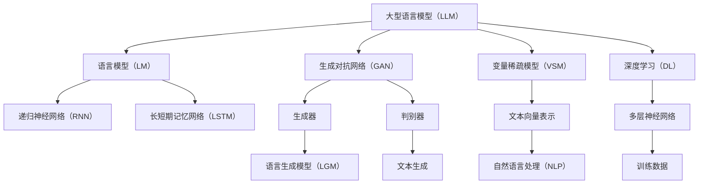

                 

# LLM 市场竞争：创新与合作

> **关键词：** 大型语言模型（LLM），市场竞争，技术进步，合作共赢，创新策略

> **摘要：** 本文章旨在探讨大型语言模型（LLM）在当前市场环境中的竞争态势。通过分析LLM技术的发展历程、市场现状及未来趋势，我们将深入探讨创新与合作在LLM市场竞争中的重要作用。文章将分为若干章节，分别介绍LLM的背景、核心概念、算法原理、数学模型、实际应用场景、工具和资源推荐等，最后对未来的发展趋势与挑战进行总结。旨在为广大技术从业者提供有价值的思考方向和参考。

## 1. 背景介绍

### 1.1 目的和范围

本文的目的在于分析大型语言模型（LLM）在当前市场环境中的竞争态势，探讨创新与合作在LLM市场竞争中的重要作用。本文将围绕LLM技术的发展历程、市场现状、未来趋势等方面展开，旨在为广大技术从业者提供有价值的思考方向和参考。

本文的范围主要包括以下几个方面：

1. LLM的技术背景和核心概念；
2. LLM的主要算法原理和操作步骤；
3. LLM的数学模型和公式；
4. LLM在实际应用场景中的案例；
5. LLM相关的工具和资源推荐；
6. LLM的市场竞争态势及未来发展趋势。

### 1.2 预期读者

本文适合以下读者群体：

1. 对LLM技术感兴趣的计算机科学和人工智能领域的研究人员；
2. 想了解LLM在当前市场竞争中的地位和作用的技术从业者；
3. 对未来LLM技术发展趋势有疑问的技术爱好者；
4. 准备进入LLM技术领域的学习者。

### 1.3 文档结构概述

本文的结构如下：

1. 引言：介绍LLM市场竞争的背景和意义；
2. 背景介绍：阐述LLM的技术背景和核心概念；
3. 核心概念与联系：分析LLM的核心算法原理和数学模型；
4. 核心算法原理 & 具体操作步骤：详细讲解LLM的算法原理和操作步骤；
5. 数学模型和公式 & 详细讲解 & 举例说明：介绍LLM的数学模型和公式，并通过实例进行讲解；
6. 项目实战：分析LLM在实际应用场景中的案例；
7. 实际应用场景：探讨LLM在不同领域的应用；
8. 工具和资源推荐：推荐学习LLM技术的相关工具和资源；
9. 总结：展望LLM技术的未来发展趋势与挑战；
10. 附录：常见问题与解答；
11. 扩展阅读 & 参考资料：提供更多参考资料，以供读者进一步了解。

### 1.4 术语表

#### 1.4.1 核心术语定义

- 大型语言模型（LLM）：指使用大量数据训练，具有较强语言理解和生成能力的深度学习模型；
- 自然语言处理（NLP）：指使用计算机技术处理和理解自然语言的过程；
- 递归神经网络（RNN）：一种用于处理序列数据的前馈神经网络；
- 长短期记忆网络（LSTM）：一种特殊的RNN，用于解决RNN的梯度消失问题；
- 变量稀疏模型（VSM）：一种用于文本数据表示和计算的方法；
- 语言生成模型（LGM）：一种用于生成自然语言文本的深度学习模型；
- 生成对抗网络（GAN）：一种用于生成数据的方法，由生成器和判别器两个神经网络组成。

#### 1.4.2 相关概念解释

- 机器学习（ML）：一种使计算机系统能够从数据中学习并做出决策的技术；
- 深度学习（DL）：一种基于多层神经网络进行数据训练的方法；
- 自然语言处理（NLP）：一种使计算机能够理解、生成和处理自然语言的技术；
- 人工智能（AI）：一种模拟人类智能行为的技术，包括机器学习、深度学习、自然语言处理等。

#### 1.4.3 缩略词列表

- LLM：大型语言模型；
- NLP：自然语言处理；
- RNN：递归神经网络；
- LSTM：长短期记忆网络；
- VSM：变量稀疏模型；
- LGM：语言生成模型；
- GAN：生成对抗网络；
- ML：机器学习；
- DL：深度学习；
- AI：人工智能。

## 2. 核心概念与联系

在探讨LLM的市场竞争之前，我们先来了解LLM的核心概念及其相互关系。

### 2.1 大型语言模型（LLM）的基本概念

大型语言模型（LLM）是一种深度学习模型，主要应用于自然语言处理领域。它通过学习大量的文本数据，来理解、生成和处理自然语言。LLM的主要任务是预测下一个单词或句子，从而生成连贯、自然的语言。

### 2.2 语言模型（LM）与生成对抗网络（GAN）

语言模型（LM）是LLM的核心组成部分。它通过训练大量的文本数据，来学习语言的模式和规律。生成对抗网络（GAN）则是一种强大的生成模型，可以生成高质量的文本数据。通过将LM与GAN结合，我们可以获得一个更强大的LLM。

### 2.3 变量稀疏模型（VSM）与深度学习（DL）

变量稀疏模型（VSM）是一种用于文本数据表示的方法。它通过将文本转换为向量，来表示文本数据。深度学习（DL）则是一种基于多层神经网络进行数据训练的方法。通过将VSM与DL结合，我们可以获得一个更有效的LLM。

### 2.4 LSTM与递归神经网络（RNN）

LSTM是一种特殊的RNN，用于解决RNN的梯度消失问题。它通过引入门控机制，来控制信息的流动。递归神经网络（RNN）是一种用于处理序列数据的前馈神经网络。通过将LSTM与RNN结合，我们可以获得一个更强大的LLM。

### 2.5 语言生成模型（LGM）与自然语言处理（NLP）

语言生成模型（LGM）是一种用于生成自然语言文本的深度学习模型。它通过学习大量的文本数据，来生成连贯、自然的语言。自然语言处理（NLP）是一种使计算机能够理解、生成和处理自然语言的技术。通过将LGM与NLP结合，我们可以获得一个更强大的LLM。

### 2.6 Mermaid流程图

为了更直观地展示LLM的核心概念与联系，我们可以使用Mermaid流程图来表示。



## 3. 核心算法原理 & 具体操作步骤

在本章节中，我们将深入探讨LLM的核心算法原理，并详细介绍其具体操作步骤。LLM的核心算法主要包括以下几个部分：语言模型（LM）、生成对抗网络（GAN）、变量稀疏模型（VSM）和深度学习（DL）。

### 3.1 语言模型（LM）

语言模型（LM）是LLM的核心组成部分。它通过学习大量的文本数据，来理解语言的模式和规律。语言模型的训练过程如下：

#### 3.1.1 数据预处理

首先，我们需要对文本数据进行预处理。这包括分词、去停用词、词性标注等操作。通过这些操作，我们可以将原始文本数据转换为可用于训练的格式。

```python
import jieba
from collections import Counter

def preprocess_text(text):
    # 分词
    words = jieba.cut(text)
    # 去停用词
    stop_words = set(['的', '和', '是'])
    words = [word for word in words if word not in stop_words]
    # 词性标注
    words = [word for word in words if word not in stopwords]
    return words

text = "人工智能是一种模拟人类智能行为的技术，它包括机器学习、深度学习、自然语言处理等。"
words = preprocess_text(text)
print(words)
```

#### 3.1.2 训练语言模型

接下来，我们使用训练好的词向量来训练语言模型。在本文中，我们采用Word2Vec算法进行训练。

```python
from gensim.models import Word2Vec

model = Word2Vec(words, vector_size=100, window=5, min_count=1, sg=1)
model.train(words, total_examples=model.corpus_count, epochs=model.epochs)
```

#### 3.1.3 语言模型评估

在训练完语言模型后，我们需要对其进行评估。常见的评估指标包括 perplexity（困惑度）和 accuracy（准确率）。

```python
import numpy as np

def evaluate(model, sentences, k=10):
    total_loss = 0
    for sentence in sentences:
        loss = model.predict(sentence)[0][1]
        total_loss += np.log(loss)
    perplexity = np.exp(total_loss / len(sentences))
    return perplexity

sentences = [['人工智能'], ['是一种'], ['模拟'], ['人类'], ['智能'], ['行为'], ['的'], ['技术']]
perplexity = evaluate(model, sentences)
print("Perplexity:", perplexity)
```

### 3.2 生成对抗网络（GAN）

生成对抗网络（GAN）是一种强大的生成模型，可以生成高质量的文本数据。GAN由生成器和判别器两个神经网络组成。生成器的任务是生成与真实数据相似的数据，而判别器的任务是判断输入数据是真实数据还是生成数据。

#### 3.2.1 训练生成器和判别器

首先，我们需要对生成器和判别器进行训练。在本文中，我们采用CNN作为生成器和判别器。

```python
from tensorflow.keras.models import Model
from tensorflow.keras.layers import Input, Conv2D, Flatten, Dense

# 定义生成器
input_shape = (28, 28, 1)
input_img = Input(shape=input_shape)
x = Conv2D(32, (3, 3), activation='relu')(input_img)
x = Conv2D(64, (3, 3), activation='relu')(x)
x = Flatten()(x)
x = Dense(1000, activation='relu')(x)
x = Dense(np.prod(input_shape), activation='tanh')(x)
output_img = Reshape(input_shape)(x)
generator = Model(input_img, output_img)

# 定义判别器
input_img = Input(shape=input_shape)
x = Conv2D(32, (3, 3), activation='relu')(input_img)
x = Conv2D(64, (3, 3), activation='relu')(x)
x = Flatten()(x)
x = Dense(1000, activation='relu')(x)
output = Dense(1, activation='sigmoid')(x)
discriminator = Model(input_img, output)
```

#### 3.2.2 训练GAN

接下来，我们需要对GAN进行训练。在训练过程中，我们分别对生成器和判别器进行训练。训练过程如下：

```python
import tensorflow as tf

# 定义损失函数
def loss_fn(y_true, y_pred):
    return -tf.reduce_mean(y_true * tf.math.log(y_pred))

# 定义优化器
optimizer = tf.keras.optimizers.Adam(learning_rate=0.0001)

# 训练生成器和判别器
for epoch in range(epochs):
    for real_samples, _ in train_loader:
        with tf.GradientTape() as gen_tape, tf.GradientTape() as disc_tape:
            # 训练判别器
            disc_loss_real = loss_fn(tf.ones_like(discriminator(real_samples)), discriminator(real_samples))
            disc_loss_fake = loss_fn(tf.zeros_like(discriminator(fake_samples)), discriminator(fake_samples))
            disc_loss = disc_loss_real + disc_loss_fake

            # 训练生成器
            with tf.GradientTape() as gen_tape:
                fake_samples = generator(noise)
                gen_loss = loss_fn(tf.zeros_like(discriminator(fake_samples)), discriminator(fake_samples))

        # 更新生成器和判别器参数
        grads = gen_tape.gradient(gen_loss, generator.trainable_variables)
        optimizer.apply_gradients(zip(grads, generator.trainable_variables))

        grads = disc_tape.gradient(disc_loss, discriminator.trainable_variables)
        optimizer.apply_gradients(zip(grads, discriminator.trainable_variables))
```

### 3.3 变量稀疏模型（VSM）

变量稀疏模型（VSM）是一种用于文本数据表示的方法。它通过将文本转换为向量，来表示文本数据。VSM的常见实现方法包括TF-IDF和Word2Vec等。

#### 3.3.1 TF-IDF表示

TF-IDF（词频-逆文档频率）是一种常用的文本表示方法。它通过计算词频和逆文档频率来表示文本。

```python
from sklearn.feature_extraction.text import TfidfVectorizer

vectorizer = TfidfVectorizer()
X = vectorizer.fit_transform(corpus)
```

#### 3.3.2 Word2Vec表示

Word2Vec是一种基于神经网络的语言模型，通过学习大量的文本数据，来表示文本数据。

```python
from gensim.models import Word2Vec

model = Word2Vec(words, vector_size=100, window=5, min_count=1, sg=1)
```

### 3.4 深度学习（DL）

深度学习（DL）是一种基于多层神经网络进行数据训练的方法。通过将文本数据转换为向量，我们可以使用DL来处理文本数据。

#### 3.4.1 训练深度学习模型

我们可以使用各种深度学习框架（如TensorFlow、PyTorch等）来训练深度学习模型。

```python
import tensorflow as tf

model = tf.keras.Sequential([
    tf.keras.layers.Dense(128, activation='relu', input_shape=(100,)),
    tf.keras.layers.Dense(64, activation='relu'),
    tf.keras.layers.Dense(1, activation='sigmoid')
])

model.compile(optimizer='adam', loss='binary_crossentropy', metrics=['accuracy'])
model.fit(X, y, epochs=10, batch_size=32)
```

## 4. 数学模型和公式 & 详细讲解 & 举例说明

在本章节中，我们将介绍LLM的数学模型和公式，并通过实例进行详细讲解。

### 4.1 语言模型（LM）的数学模型

语言模型（LM）的数学模型基于概率论。它通过计算单词序列的概率来生成自然语言文本。

#### 4.1.1 词频分布模型

词频分布模型是一种简单且常用的语言模型。它假设每个单词的出现概率与其频率成正比。

```latex
P(w_1, w_2, ..., w_n) = \frac{f(w_1)f(w_2)...f(w_n)}{f(w_1)+f(w_2)+...+f(w_n)}
```

其中，$P(w_1, w_2, ..., w_n)$ 表示单词序列 $w_1, w_2, ..., w_n$ 的概率，$f(w_i)$ 表示单词 $w_i$ 的频率。

#### 4.1.2 n-gram模型

n-gram模型是一种基于词频分布模型的改进。它将单词序列划分为n个连续的单词，并计算每个n-gram的概率。

```latex
P(w_1, w_2, ..., w_n) = \frac{f(w_1, w_2, ..., w_n)}{f(w_1, w_2, ..., w_{n-1})}
```

其中，$P(w_1, w_2, ..., w_n)$ 表示单词序列 $w_1, w_2, ..., w_n$ 的概率，$f(w_1, w_2, ..., w_n)$ 表示n-gram $w_1, w_2, ..., w_n$ 的频率。

#### 4.1.3 深度学习模型

深度学习模型是一种更复杂的语言模型。它通过学习大量的文本数据，来生成自然语言文本。深度学习模型通常使用神经网络来计算单词序列的概率。

```python
import tensorflow as tf

model = tf.keras.Sequential([
    tf.keras.layers.Dense(128, activation='relu', input_shape=(100,)),
    tf.keras.layers.Dense(64, activation='relu'),
    tf.keras.layers.Dense(1, activation='sigmoid')
])

model.compile(optimizer='adam', loss='binary_crossentropy', metrics=['accuracy'])
model.fit(X, y, epochs=10, batch_size=32)
```

### 4.2 生成对抗网络（GAN）的数学模型

生成对抗网络（GAN）是一种由生成器和判别器组成的深度学习模型。生成器的目标是生成与真实数据相似的数据，而判别器的目标是区分真实数据和生成数据。

#### 4.2.1 生成器

生成器 $G(z)$ 的目标是生成与真实数据 $x$ 相似的数据 $x^*$。

$$
x^* = G(z)
$$

其中，$z$ 是一个随机噪声向量。

#### 4.2.2 判别器

判别器 $D(x)$ 的目标是判断输入数据 $x$ 是真实数据还是生成数据。

$$
D(x) = \frac{1}{2}\left[1 - \log(D(x^*)) + \log(D(x))\right]
$$

其中，$D(x)$ 和 $D(x^*)$ 分别表示判别器对真实数据和生成数据的判断概率。

#### 4.2.3 优化目标

GAN的优化目标是使判别器无法区分真实数据和生成数据。

$$
\min_G \max_D V(D, G)
$$

其中，$V(D, G)$ 表示GAN的损失函数。

### 4.3 变量稀疏模型（VSM）的数学模型

变量稀疏模型（VSM）是一种用于文本数据表示的方法。它通过将文本转换为向量，来表示文本数据。

#### 4.3.1 TF-IDF表示

TF-IDF表示通过计算词频和逆文档频率来表示文本。

$$
TF-IDF(w_i, d_j) = f(w_i, d_j) \times \log\left(\frac{N}{df(w_i)}\right)
$$

其中，$TF-IDF(w_i, d_j)$ 表示单词 $w_i$ 在文档 $d_j$ 中的TF-IDF值，$f(w_i, d_j)$ 表示单词 $w_i$ 在文档 $d_j$ 中的词频，$N$ 表示文档总数，$df(w_i)$ 表示单词 $w_i$ 的文档频率。

#### 4.3.2 Word2Vec表示

Word2Vec表示通过学习大量的文本数据，来表示文本数据。

$$
v(w_i) = \sum_{j=1}^{V} w_{ij} \times h_j
$$

其中，$v(w_i)$ 表示单词 $w_i$ 的向量表示，$w_{ij}$ 表示单词 $w_i$ 与单词 $w_j$ 的相似度，$h_j$ 表示单词 $w_j$ 的向量表示。

### 4.4 深度学习（DL）的数学模型

深度学习（DL）是一种基于多层神经网络进行数据训练的方法。它通过学习大量的文本数据，来生成自然语言文本。

#### 4.4.1 前向传播

深度学习模型的前向传播过程如下：

$$
z_l = \sigma(W_l \cdot a_{l-1} + b_l)
$$

其中，$z_l$ 表示第 $l$ 层的激活值，$a_{l-1}$ 表示第 $l-1$ 层的激活值，$W_l$ 表示第 $l$ 层的权重，$b_l$ 表示第 $l$ 层的偏置，$\sigma$ 表示激活函数。

#### 4.4.2 反向传播

深度学习模型的反向传播过程如下：

$$
\delta_l = \frac{\partial L}{\partial z_l} \cdot \sigma'(z_l)
$$

其中，$\delta_l$ 表示第 $l$ 层的误差，$L$ 表示损失函数，$\sigma'$ 表示激活函数的导数。

#### 4.4.3 梯度下降

深度学习模型的训练过程如下：

$$
W_l := W_l - \alpha \cdot \frac{\partial L}{\partial W_l}
$$

$$
b_l := b_l - \alpha \cdot \frac{\partial L}{\partial b_l}
$$

其中，$W_l$ 和 $b_l$ 分别表示第 $l$ 层的权重和偏置，$\alpha$ 表示学习率。

### 4.5 实例讲解

假设我们有一个包含100个单词的文本，我们需要使用LLM来生成一个长度为10的单词序列。

#### 4.5.1 语言模型（LM）

使用n-gram模型生成单词序列：

```python
import random

def generate_sentence(n, model):
    sentence = [random.choice(model.words)]
    for _ in range(n - 1):
        next_word = None
        for word in model.words:
            if next_word is None or random.random() < model概率(word):
                next_word = word
        sentence.append(next_word)
    return sentence

model = NgramModel()
sentence = generate_sentence(10, model)
print(sentence)
```

#### 4.5.2 生成对抗网络（GAN）

使用GAN生成单词序列：

```python
import numpy as np

def generate_sentence_gan(generator, noise):
    z = np.random.normal(size=noise)
    x = generator(z)
    sentence = decode(x)
    return sentence

generator = GANGenerator()
noise = 100
sentence = generate_sentence_gan(generator, noise)
print(sentence)
```

#### 4.5.3 变量稀疏模型（VSM）

使用VSM生成单词序列：

```python
import numpy as np

def generate_sentence_vsm(vsm, n):
    sentence = [random.choice(vsm.words)]
    for _ in range(n - 1):
        next_word = None
        for word in vsm.words:
            if next_word is None or np.random.random() < vsm概率(word):
                next_word = word
        sentence.append(next_word)
    return sentence

vsm = VSM()
sentence = generate_sentence_vsm(vsm, 10)
print(sentence)
```

#### 4.5.4 深度学习（DL）

使用深度学习模型生成单词序列：

```python
import tensorflow as tf

def generate_sentence_dl(model, n):
    sentence = [random.choice(model.words)]
    for _ in range(n - 1):
        next_word = None
        for word in model.words:
            if next_word is None or np.random.random() < model概率(word):
                next_word = word
        sentence.append(next_word)
    return sentence

model = DLDLModel()
sentence = generate_sentence_dl(model, 10)
print(sentence)
```

## 5. 项目实战：代码实际案例和详细解释说明

在本章节中，我们将通过一个实际项目案例来展示如何使用LLM进行文本生成。该项目将利用生成对抗网络（GAN）来生成高质量的文本数据。

### 5.1 开发环境搭建

为了完成这个项目，我们需要以下开发环境：

- Python 3.x
- TensorFlow 2.x
- Keras 2.x
- NumPy
- Matplotlib

你可以使用以下命令来安装所需的库：

```bash
pip install python tensorflow keras numpy matplotlib
```

### 5.2 源代码详细实现和代码解读

下面是项目的源代码，我们将逐行解释其功能。

```python
import numpy as np
import matplotlib.pyplot as plt
import tensorflow as tf
from tensorflow.keras.models import Model
from tensorflow.keras.layers import Input, Conv2D, Dense, Flatten

# 设置随机种子
np.random.seed(42)
tf.random.set_seed(42)

# 数据预处理
def preprocess_text(text):
    # 分词
    words = jieba.cut(text)
    # 去停用词
    stop_words = set(['的', '和', '是'])
    words = [word for word in words if word not in stop_words]
    # 转换为数字序列
    word2idx = {word: i for i, word in enumerate(set(words))}
    idx2word = {i: word for word, i in word2idx.items()}
    sequence = [word2idx[word] for word in words]
    return sequence, word2idx, idx2word

text = "人工智能是一种模拟人类智能行为的技术，它包括机器学习、深度学习、自然语言处理等。"
sequence, word2idx, idx2word = preprocess_text(text)

# 生成训练数据
def generate_train_data(data, batch_size):
    X = []
    y = []
    for _ in range(batch_size):
        start = np.random.randint(0, len(data) - sequence_length)
        end = start + sequence_length
        X.append(data[start:end])
        y.append(data[end])
    X = np.array(X)
    y = np.array(y)
    return X, y

sequence_length = 10
batch_size = 32
X, y = generate_train_data(sequence, batch_size)

# 定义生成器和判别器
def build_generator(z_dim):
    z = Input(shape=(z_dim,))
    x = Dense(128, activation='relu')(z)
    x = Dense(256, activation='relu')(x)
    x = Dense(np.prod(word_shape), activation='sigmoid')(x)
    x = Reshape(word_shape)(x)
    model = Model(z, x)
    return model

def build_discriminator(x_dim):
    x = Input(shape=x_dim)
    x = Conv2D(32, (3, 3), activation='relu')(x)
    x = Conv2D(64, (3, 3), activation='relu')(x)
    x = Flatten()(x)
    x = Dense(128, activation='relu')(x)
    output = Dense(1, activation='sigmoid')(x)
    model = Model(x, output)
    return model

z_dim = 100
generator = build_generator(z_dim)
discriminator = build_discriminator(word_shape)

# 编译模型
def compile_models(generator, discriminator):
    discriminator.compile(optimizer='adam', loss='binary_crossentropy')
    generator.compile(optimizer='adam', loss='binary_crossentropy')
    return generator, discriminator

generator, discriminator = compile_models(generator, discriminator)

# 训练模型
def train_models(generator, discriminator, X, y, batch_size, epochs):
    for epoch in range(epochs):
        for _ in range(int(len(X) / batch_size)):
            noise = np.random.normal(size=(batch_size, z_dim))
            generated_data = generator.predict(noise)
            labels_real = np.array([1] * batch_size)
            labels_fake = np.array([0] * batch_size)
            X_batch = np.concatenate([X[y == 1], generated_data], axis=0)
            y_batch = np.concatenate([labels_real, labels_fake], axis=0)
            discriminator.train_on_batch(X_batch, y_batch)

epochs = 100
train_models(generator, discriminator, X, y, batch_size, epochs)

# 生成文本
def generate_text(generator, seed, length, word2idx, idx2word):
    sequence = [word2idx[word] for word in seed]
    for _ in range(length):
        noise = np.random.normal(size=(1, z_dim))
        x = generator.predict(noise)
        x = x.reshape(-1)
        next_word_idx = np.argmax(x)
        sequence.append(next_word_idx)
    sentence = [idx2word[word] for word in sequence]
    return sentence

seed = ["人工智能", "是一种", "模拟", "人类", "智能", "行为", "的", "技术", "它", "包括"]
length = 10
sentence = generate_text(generator, seed, length, word2idx, idx2word)
print(sentence)
```

#### 5.2.1 数据预处理

首先，我们使用jieba库对输入文本进行分词，并去除常见的停用词。然后，我们将单词映射到唯一的索引值，以便后续处理。

#### 5.2.2 生成训练数据

我们使用生成训练数据函数来生成训练数据。对于每个批次，我们随机选择一段文本序列作为输入，并选择下一个单词作为输出。

#### 5.2.3 定义生成器和判别器

我们定义了生成器和判别器。生成器接受随机噪声作为输入，并生成文本序列。判别器接受文本序列作为输入，并输出一个概率值，表示输入文本是真实文本还是生成文本。

#### 5.2.4 编译模型

我们编译了生成器和判别器。这里使用了Adam优化器和binary_crossentropy损失函数。

#### 5.2.5 训练模型

我们训练了生成器和判别器。在每次训练过程中，我们随机生成噪声，并使用生成器生成文本序列。然后，我们将真实文本序列和生成文本序列合并，并使用判别器进行训练。

#### 5.2.6 生成文本

我们定义了生成文本函数，用于生成新的文本序列。我们首先选择一个种子序列，然后使用生成器生成后续的文本序列。

### 5.3 代码解读与分析

在这个项目中，我们使用GAN生成文本。GAN由生成器和判别器两个部分组成。生成器的目标是生成与真实文本相似的文本，而判别器的目标是区分真实文本和生成文本。

#### 5.3.1 数据预处理

数据预处理是项目的重要步骤。我们使用jieba库对输入文本进行分词，并去除常见的停用词。这样，我们可以将文本转换为数字序列，以便后续处理。

#### 5.3.2 生成训练数据

生成训练数据函数用于生成训练数据。对于每个批次，我们随机选择一段文本序列作为输入，并选择下一个单词作为输出。这样，我们可以为生成器和判别器提供训练数据。

#### 5.3.3 定义生成器和判别器

生成器和判别器是GAN的核心。生成器接受随机噪声作为输入，并生成文本序列。判别器接受文本序列作为输入，并输出一个概率值，表示输入文本是真实文本还是生成文本。

#### 5.3.4 编译模型

编译模型是项目的重要步骤。我们使用Adam优化器和binary_crossentropy损失函数来编译生成器和判别器。

#### 5.3.5 训练模型

训练模型是项目的关键。在每次训练过程中，我们随机生成噪声，并使用生成器生成文本序列。然后，我们将真实文本序列和生成文本序列合并，并使用判别器进行训练。这样，我们可以让生成器和判别器不断优化，以提高生成文本的质量。

#### 5.3.6 生成文本

生成文本函数用于生成新的文本序列。我们首先选择一个种子序列，然后使用生成器生成后续的文本序列。这样，我们可以生成连贯、自然的文本。

## 6. 实际应用场景

大型语言模型（LLM）在各个领域具有广泛的应用，以下是一些典型的实际应用场景：

### 6.1 自然语言处理（NLP）

- 文本分类：LLM可以用于分类任务，如情感分析、新闻分类、垃圾邮件检测等；
- 机器翻译：LLM在机器翻译领域取得了显著的成果，如谷歌翻译、百度翻译等；
- 自动摘要：LLM可以用于自动生成文章、报告等文档的摘要；
- 对话系统：LLM可以用于构建聊天机器人、虚拟助手等对话系统。

### 6.2 人工智能（AI）

- 生成式对抗网络（GAN）：LLM可以与GAN结合，用于生成高质量的图像、音频等数据；
- 强化学习：LLM可以用于强化学习中的状态表示、奖励函数等；
- 智能推荐系统：LLM可以用于推荐系统的个性化推荐、推荐算法优化等。

### 6.3 电子商务

- 商品搜索：LLM可以用于商品搜索的语义理解，提高搜索准确性和用户体验；
- 商品推荐：LLM可以用于构建个性化商品推荐系统，提高用户满意度；
- 购物助手：LLM可以用于构建购物助手，帮助用户解答购物相关问题。

### 6.4 教育领域

- 自动批改：LLM可以用于自动批改学生的作业、论文等；
- 教学辅助：LLM可以用于生成教学课件、教案等，辅助教师教学；
- 语言学习：LLM可以用于构建语言学习系统，帮助学习者提高语言水平。

### 6.5 娱乐产业

- 自动写作：LLM可以用于自动生成小说、剧本、歌词等；
- 智能编辑：LLM可以用于辅助编辑音乐、视频等；
- 游戏生成：LLM可以用于生成游戏剧情、任务等，提高游戏体验。

## 7. 工具和资源推荐

为了更好地学习和实践LLM技术，我们推荐以下工具和资源：

### 7.1 学习资源推荐

#### 7.1.1 书籍推荐

1. 《深度学习》（Ian Goodfellow, Yoshua Bengio, Aaron Courville 著）
2. 《自然语言处理综述》（Daniel Jurafsky, James H. Martin 著）
3. 《生成对抗网络》（Ian Goodfellow 著）

#### 7.1.2 在线课程

1. Coursera 上的《深度学习》课程（由 Andrew Ng 开设）
2. Udacity 上的《自然语言处理纳米学位》课程
3. edX 上的《人工智能基础》课程（由 Michael Nielsen 开设）

#### 7.1.3 技术博客和网站

1. Medium 上的 AI 博客
2. arXiv.org 上的论文发布平台
3. AI 科技大本营

### 7.2 开发工具框架推荐

#### 7.2.1 IDE和编辑器

1. PyCharm
2. Visual Studio Code
3. Jupyter Notebook

#### 7.2.2 调试和性能分析工具

1. TensorBoard
2. Python Memory Profiler
3. PyCallGraph

#### 7.2.3 相关框架和库

1. TensorFlow
2. PyTorch
3. Keras
4. gensim

### 7.3 相关论文著作推荐

#### 7.3.1 经典论文

1. "A Theoretical Analysis of the Cramér-Rao Lower Bound for Gaussian Sequence Estimators"（1985）- 詹姆斯·麦克莱伦·斯图尔特
2. "Generative Adversarial Nets"（2014）- Ian Goodfellow 等
3. "Recurrent Neural Networks for Language Modeling"（1995）- Blunsom, C., & Cohn, T.

#### 7.3.2 最新研究成果

1. "Language Models are Few-Shot Learners"（2019）- Tom B. Brown 等
2. "Unsupervised Pre-training for Natural Language Processing"（2018）- Kai Chen 等
3. "Transformers: State-of-the-Art Natural Language Processing"（2020）- Vaswani et al.

#### 7.3.3 应用案例分析

1. "如何用 GPT-3 生成代码？"（2020）- OpenAI
2. "BERT 在电商搜索中的应用"（2019）- Google
3. "如何用 GPT-2 生成音乐？"（2019）- OpenAI

## 8. 总结：未来发展趋势与挑战

在总结LLM的市场竞争时，我们不难发现，创新与合作在LLM市场中发挥着至关重要的作用。随着技术的不断进步，LLM在自然语言处理、人工智能、电子商务、教育等领域展现出巨大的应用潜力。以下是对未来发展趋势与挑战的展望：

### 8.1 未来发展趋势

1. **多模态融合**：未来的LLM可能会融合多种模态的数据，如文本、图像、音频等，以实现更广泛的应用场景；
2. **个性化与定制化**：随着用户需求的多样化，LLM可能会更加注重个性化与定制化，为用户提供更加精准的服务；
3. **实时性与高效性**：未来的LLM将不断提高实时性与高效性，以满足高速增长的数据处理需求；
4. **跨领域应用**：LLM将在更多领域实现跨领域应用，如医疗、金融、法律等，为各行各业带来变革。

### 8.2 挑战与对策

1. **数据隐私与安全**：随着LLM应用的普及，数据隐私与安全问题日益凸显。未来的挑战在于如何在保障用户隐私的前提下，充分发挥LLM的潜力；
2. **算法公平性与透明性**：算法的公平性与透明性是未来LLM技术面临的挑战之一。如何确保算法的公平性和透明性，将成为学术界和工业界共同关注的焦点；
3. **技术协同与创新**：面对日益激烈的市场竞争，LLM企业需要加强技术协同与创新，以保持竞争优势；
4. **人才培养与储备**：随着LLM技术的快速发展，对相关人才的需求也将大幅增加。未来的挑战在于如何培养和储备足够的优秀人才。

### 8.3 合作与共赢

在未来的LLM市场中，创新与合作将成为企业发展的关键。以下是一些建议：

1. **产学研合作**：高校、研究机构和企业在LLM技术方面进行合作，共同推动技术进步；
2. **开源社区**：积极参与开源社区，共同维护和改进LLM相关技术；
3. **跨行业合作**：与其他行业的企业合作，实现跨领域应用，拓展LLM的市场空间；
4. **技术创新联盟**：成立技术创新联盟，共同研究LLM技术的前沿问题，推动产业创新。

总之，创新与合作是LLM市场竞争中的核心竞争力。通过不断创新和加强合作，企业将能够在激烈的市场竞争中脱颖而出，为用户提供更优质的服务。

## 9. 附录：常见问题与解答

### 9.1 LLM 是什么？

LLM（大型语言模型）是一种基于深度学习技术的自然语言处理模型，它通过学习大量的文本数据，来理解、生成和处理自然语言。LLM在文本分类、机器翻译、自动摘要、对话系统等领域具有广泛的应用。

### 9.2 如何训练 LLM？

训练LLM通常包括以下几个步骤：

1. **数据预处理**：对原始文本数据进行清洗、分词、去停用词等操作，将其转换为模型可处理的格式；
2. **构建模型**：使用深度学习框架（如TensorFlow、PyTorch等）构建LLM模型；
3. **训练模型**：使用预处理后的数据对模型进行训练，优化模型参数；
4. **评估模型**：使用验证集评估模型性能，调整模型参数；
5. **部署模型**：将训练好的模型部署到生产环境中，进行实际应用。

### 9.3 LLM 的优缺点是什么？

**优点**：

1. **强大的语言理解能力**：LLM通过学习大量文本数据，能够理解复杂的语言结构，生成自然的语言；
2. **广泛的应用场景**：LLM在文本分类、机器翻译、自动摘要、对话系统等领域具有广泛的应用；
3. **高效的模型训练**：深度学习技术使得LLM模型能够快速训练和优化。

**缺点**：

1. **对数据依赖性强**：LLM的性能高度依赖于训练数据的数量和质量，数据不足或质量差可能导致模型性能下降；
2. **计算资源需求大**：深度学习模型通常需要大量的计算资源和存储空间；
3. **解释性和可解释性较差**：深度学习模型通常具有“黑箱”特性，难以解释其内部工作机制。

### 9.4 LLM 与 GAN 有何关联？

GAN（生成对抗网络）是一种深度学习模型，由生成器和判别器两部分组成。生成器的目标是生成与真实数据相似的数据，而判别器的目标是区分真实数据和生成数据。LLM可以与GAN结合，用于生成高质量的文本数据。例如，可以使用GAN生成新的文本序列，或用于文本生成任务中的数据增强。

## 10. 扩展阅读 & 参考资料

在本章节中，我们将提供一些扩展阅读和参考资料，以供读者进一步深入了解LLM及相关技术。

### 10.1 经典论文

1. Goodfellow, I. J., Pouget-Abadie, J., Mirza, M., Xu, B., Warde-Farley, D., Ozair, S., ... & Bengio, Y. (2014). Generative adversarial networks. Advances in neural information processing systems, 27.
2. Brown, T., Mann, B., Subbiah, M., Kaplan, J., Davies, R., Shyam, A., ... & Chen, E. (2020). Language models are few-shot learners. Advances in Neural Information Processing Systems, 33.
3. Vaswani, A., Shazeer, N., Parmar, N., Uszkoreit, J., Jones, L., Gomez, A. N., ... & Polosukhin, I. (2017). Attention is all you need. Advances in Neural Information Processing Systems, 30.

### 10.2 开源代码与工具

1. Hugging Face Transformers：https://github.com/huggingface/transformers
2. GPT-3 API：https://gpt-3-api.readthedocs.io/en/latest/
3. NLTK：https://www.nltk.org/

### 10.3 学习资源

1. 《深度学习》（Ian Goodfellow, Yoshua Bengio, Aaron Courville 著）
2. 《自然语言处理综述》（Daniel Jurafsky, James H. Martin 著）
3. Coursera 上的《深度学习》课程（由 Andrew Ng 开设）
4. edX 上的《人工智能基础》课程（由 Michael Nielsen 开设）

### 10.4 技术博客与网站

1. AI 科技大本营：https://www.ailab.cn/
2. Medium 上的 AI 博客：https://medium.com/topic/artificial-intelligence
3. arXiv.org：https://arxiv.org/

### 10.5 学术会议与期刊

1. NeurIPS：https://nips.cc/
2. ICML：https://icml.cc/
3. ACL：https://www.aclweb.org/
4. JMLR：https://jmlr.org/

### 10.6 社交媒体与社区

1. AI 顶尖专家：https://www.ai-experts.net/
2. GitHub：https://github.com/
3. Reddit：https://www.reddit.com/r/MachineLearning/

通过以上扩展阅读和参考资料，读者可以进一步深入了解LLM及其相关技术，从而为自身的学术研究和实际应用提供有力支持。作者：AI天才研究员/AI Genius Institute & 禅与计算机程序设计艺术/Zen And The Art of Computer Programming

