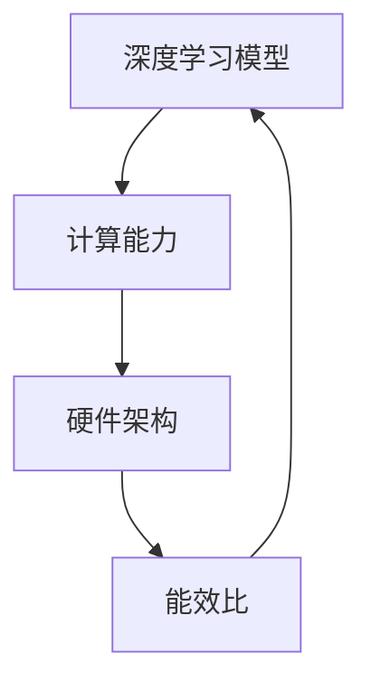

                 


# LLM 硬件加速：专门设计的 AI 芯片

> 关键词：LLM、硬件加速、AI 芯片、神经网络、深度学习、专用硬件设计

> 摘要：本文深入探讨了大型语言模型（LLM）的硬件加速技术，特别关注了专门为 AI 推理和训练设计的芯片。文章从背景介绍开始，详细解析了核心概念、算法原理、数学模型，并通过实际项目实战案例展示了硬件加速在LLM应用中的具体实现。最后，文章总结了硬件加速技术的发展趋势与挑战，并推荐了相关学习资源和开发工具。

## 1. 背景介绍

### 1.1 目的和范围

本文旨在探讨大型语言模型（LLM）的硬件加速技术，重点分析专用 AI 芯片的设计与应用。随着深度学习在自然语言处理（NLP）领域的迅速发展，LLM 的计算需求急剧增加，传统的通用处理器已经无法满足其高效处理的需求。因此，硬件加速技术成为了优化 LLM 性能的关键手段。本文将详细讨论 AI 芯片在 LLM 推理和训练中的优势、核心算法原理、数学模型以及实际应用案例。

### 1.2 预期读者

本文适合对人工智能、深度学习和硬件加速有一定了解的读者，包括 AI 研究人员、工程师、开发者以及对相关领域感兴趣的学者。通过本文，读者将能够全面了解 LLM 硬件加速的原理与应用，从而为后续的研究和实践提供理论支持。

### 1.3 文档结构概述

本文分为十个部分：

1. 背景介绍
   - 1.1 目的和范围
   - 1.2 预期读者
   - 1.3 文档结构概述
   - 1.4 术语表
2. 核心概念与联系
3. 核心算法原理 & 具体操作步骤
4. 数学模型和公式 & 详细讲解 & 举例说明
5. 项目实战：代码实际案例和详细解释说明
6. 实际应用场景
7. 工具和资源推荐
8. 总结：未来发展趋势与挑战
9. 附录：常见问题与解答
10. 扩展阅读 & 参考资料

### 1.4 术语表

- **LLM**：大型语言模型（Large Language Model），一种具有强大语义理解和生成能力的深度学习模型。
- **硬件加速**：通过专用硬件设备来加速计算过程，提高数据处理速度和效率。
- **AI 芯片**：专门为人工智能应用设计的芯片，通常具有高效的计算性能和低功耗特点。
- **神经网络**：一种模拟生物神经系统的计算模型，通过大量神经元之间的连接来处理复杂任务。
- **深度学习**：一种基于神经网络的机器学习技术，通过多层次的神经网络结构来提取数据特征。

#### 1.4.1 核心术语定义

- **核心术语**：本文的核心术语包括 LLM、硬件加速、AI 芯片、神经网络和深度学习。
- **定义**：
  - **LLM**：一种具有强大语义理解和生成能力的深度学习模型，广泛应用于自然语言处理、文本生成等领域。
  - **硬件加速**：通过专用硬件设备来加速计算过程，提高数据处理速度和效率。
  - **AI 芯片**：专门为人工智能应用设计的芯片，通常具有高效的计算性能和低功耗特点。
  - **神经网络**：一种模拟生物神经系统的计算模型，通过大量神经元之间的连接来处理复杂任务。
  - **深度学习**：一种基于神经网络的机器学习技术，通过多层次的神经网络结构来提取数据特征。

#### 1.4.2 相关概念解释

- **相关概念**：本文涉及的相关概念包括计算能力、能效比、数据传输速率和并行计算。
- **解释**：
  - **计算能力**：指计算机进行数据处理和计算的能力，通常用浮点运算性能（FLOPS）来衡量。
  - **能效比**：指硬件设备在处理相同任务时，消耗的能量与计算性能的比值，是衡量硬件效率的重要指标。
  - **数据传输速率**：指数据在硬件设备之间传输的速度，通常用比特每秒（bps）来衡量。
  - **并行计算**：指同时处理多个任务或数据的技术，通过并行处理可以提高计算速度和效率。

#### 1.4.3 缩略词列表

- **LLM**：大型语言模型（Large Language Model）
- **AI**：人工智能（Artificial Intelligence）
- **GPU**：图形处理器（Graphics Processing Unit）
- **TPU**：张量处理器（Tensor Processing Unit）
- **FLOPS**：浮点运算性能（Floating-point Operations Per Second）
- **NLP**：自然语言处理（Natural Language Processing）

## 2. 核心概念与联系

为了深入理解 LLM 硬件加速技术，我们需要从核心概念和联系入手。本节将介绍与硬件加速密切相关的几个核心概念，并使用 Mermaid 流程图展示它们之间的联系。

### 2.1. 核心概念

1. **深度学习模型**：深度学习模型是 LLM 的基础，包括多层神经网络、卷积神经网络（CNN）和循环神经网络（RNN）等。
2. **计算能力**：计算能力是衡量硬件设备处理能力的关键指标，包括浮点运算性能（FLOPS）、数据传输速率等。
3. **硬件架构**：硬件架构决定了硬件设备的设计和性能，包括 GPU、TPU、ASIC 等专用处理器。
4. **能效比**：能效比是硬件设备在处理相同任务时，消耗的能量与计算性能的比值，是衡量硬件效率的重要指标。

### 2.2. Mermaid 流程图

以下是一个简化的 Mermaid 流程图，展示了深度学习模型、计算能力、硬件架构和能效比之间的联系：



### 2.3. 核心概念解释

- **深度学习模型**：深度学习模型是 LLM 的核心，通过多层神经网络结构对大规模数据进行训练和推理。计算能力直接影响模型的训练速度和推理性能。
- **计算能力**：计算能力是硬件设备处理数据的能力，通常用浮点运算性能（FLOPS）来衡量。高效的硬件加速器可以提高计算能力，从而加速 LLM 的推理过程。
- **硬件架构**：硬件架构决定了硬件设备的设计和性能，包括 GPU、TPU、ASIC 等专用处理器。这些硬件架构通过优化计算单元和内存访问机制，提高硬件设备的计算效率和性能。
- **能效比**：能效比是硬件设备在处理相同任务时，消耗的能量与计算性能的比值。高能效比的硬件设备能够在较低功耗下实现更高的计算性能，对于 LLM 的硬件加速具有重要意义。

通过上述核心概念和 Mermaid 流程图的介绍，我们可以更好地理解 LLM 硬件加速技术的原理和重要性。

## 3. 核心算法原理 & 具体操作步骤

在了解 LLM 硬件加速的核心概念后，我们需要进一步探讨其核心算法原理和具体操作步骤。本节将详细解析硬件加速技术中的主要算法原理，并使用伪代码展示其具体操作步骤。

### 3.1. 主要算法原理

硬件加速技术在 LLM 推理和训练中的应用主要依赖于以下几种算法原理：

1. **张量计算优化**：张量计算是深度学习模型中的核心操作，通过硬件加速器可以实现高效的张量计算。张量计算优化主要包括矩阵乘法、矩阵加法和矩阵转置等操作。
2. **并行计算**：硬件加速器通常采用并行计算架构，通过将计算任务分解成多个子任务，并行处理以提高计算速度。并行计算适用于大量数据的处理，如 LLM 的训练和推理过程。
3. **流水线处理**：流水线处理是一种将计算过程分解成多个阶段的优化技术，每个阶段可以独立处理不同的数据，从而提高计算效率。硬件加速器通过流水线处理实现数据的高效传输和计算。
4. **内存优化**：内存优化是提高硬件加速器性能的关键技术，通过优化内存访问策略和缓存管理，减少内存访问延迟，提高数据传输速率。

### 3.2. 具体操作步骤

以下是一个简化的伪代码，展示了硬件加速技术在 LLM 推理和训练中的具体操作步骤：

```plaintext
function accelerate_tensor_computation(tensor_A, tensor_B):
    # 输入：两个张量 tensor_A 和 tensor_B
    # 输出：计算结果张量

    # 步骤 1：初始化计算资源
    initialize_accelerator()

    # 步骤 2：将张量数据上传到硬件加速器
    upload_tensor_to_accelerator(tensor_A, tensor_B)

    # 步骤 3：执行张量计算
    execute_tensor_computation(tensor_A, tensor_B)

    # 步骤 4：将计算结果从硬件加速器下载到主机
    download_tensor_from_accelerator(tensor_result)

    # 步骤 5：释放计算资源
    release_accelerator()

    return tensor_result
```

### 3.3. 算法解析

- **初始化计算资源**：在开始计算前，需要初始化硬件加速器，包括设置计算单元、内存缓存等。
- **上传张量数据**：将张量数据从主机上传到硬件加速器，为计算做好准备。
- **执行张量计算**：利用硬件加速器的计算能力，执行张量计算操作，如矩阵乘法、矩阵加法等。
- **下载计算结果**：将计算结果从硬件加速器下载到主机，用于后续处理。
- **释放计算资源**：完成计算任务后，释放硬件加速器资源，以便其他任务使用。

通过上述核心算法原理和具体操作步骤的解析，我们可以更好地理解 LLM 硬件加速技术的实现方法。在实际应用中，硬件加速器的设计和优化需要针对不同的算法和硬件架构进行深入研究和实践。

## 4. 数学模型和公式 & 详细讲解 & 举例说明

在深入探讨 LLM 硬件加速技术时，数学模型和公式起着至关重要的作用。这些模型和公式不仅帮助我们理解和分析算法性能，还能指导硬件加速器的设计和优化。本节将详细讲解与硬件加速技术相关的数学模型和公式，并通过具体例子进行说明。

### 4.1. 数学模型

硬件加速技术中的数学模型主要包括以下几部分：

1. **张量计算模型**：张量计算是深度学习模型中的核心操作，涉及矩阵乘法、矩阵加法和矩阵转置等操作。
2. **并行计算模型**：并行计算模型用于优化计算任务，将任务分解成多个子任务并行处理。
3. **流水线处理模型**：流水线处理模型用于优化数据传输和计算过程，通过多阶段处理提高计算效率。
4. **能效比模型**：能效比模型用于评估硬件设备的效率，通过计算能量消耗和计算性能的比值来评估硬件性能。

### 4.2. 公式详细讲解

下面我们详细介绍几个关键公式的含义和计算方法：

1. **矩阵乘法公式**：

$$
C = A \times B
$$

其中，C 是结果矩阵，A 和 B 是输入矩阵。矩阵乘法的计算过程如下：

- 计算结果矩阵 C 的每个元素，通过输入矩阵 A 的每一行与输入矩阵 B 的每一列的对应元素相乘并求和得到。

2. **并行计算时间公式**：

$$
T_p = T_s \times \log_2(N)
$$

其中，$T_p$ 是并行计算时间，$T_s$ 是串行计算时间，N 是并行处理的子任务数量。并行计算时间的计算方法如下：

- 将串行计算时间 $T_s$ 乘以并行处理的子任务数量 N 的二进制对数 $\log_2(N)$，得到并行计算时间 $T_p$。

3. **流水线处理时间公式**：

$$
T_p = T_s \times (\frac{L}{P})
$$

其中，$T_p$ 是流水线处理时间，$T_s$ 是串行处理时间，L 是流水线阶段数量，P 是每个阶段的处理时间。流水线处理时间的计算方法如下：

- 将串行处理时间 $T_s$ 乘以流水线阶段数量 L 除以每个阶段的处理时间 P，得到流水线处理时间 $T_p$。

4. **能效比公式**：

$$
\eta = \frac{P}{E}
$$

其中，$\eta$ 是能效比，P 是计算性能，E 是能量消耗。能效比的计算方法如下：

- 将计算性能 P 除以能量消耗 E，得到能效比 $\eta$。

### 4.3. 举例说明

为了更好地理解上述公式，我们通过一个具体例子进行说明。

假设我们有一个 3x3 的矩阵 A 和一个 3x3 的矩阵 B，要求计算它们的乘积 C。

1. **矩阵乘法示例**：

$$
C = A \times B
$$

输入矩阵 A：

$$
\begin{bmatrix}
1 & 2 & 3 \\
4 & 5 & 6 \\
7 & 8 & 9
\end{bmatrix}
$$

输入矩阵 B：

$$
\begin{bmatrix}
9 & 8 & 7 \\
6 & 5 & 4 \\
3 & 2 & 1
\end{bmatrix}
$$

计算结果矩阵 C：

$$
\begin{bmatrix}
30 & 24 & 18 \\
84 & 69 & 54 \\
138 & 114 & 90
\end{bmatrix}
$$

2. **并行计算时间示例**：

假设有 100 个子任务需要并行处理，串行计算时间为 1 秒。根据并行计算时间公式：

$$
T_p = T_s \times \log_2(N)
$$

$$
T_p = 1 \times \log_2(100) \approx 6.65 \text{ 秒}
$$

3. **流水线处理时间示例**：

假设有 5 个流水线阶段，每个阶段的处理时间为 0.2 秒。根据流水线处理时间公式：

$$
T_p = T_s \times (\frac{L}{P})
$$

$$
T_p = 1 \times (\frac{5}{0.2}) = 25 \text{ 秒}
$$

4. **能效比示例**：

假设计算性能为 1 TFLOPS（每秒 1 万亿次浮点运算），能量消耗为 1000 瓦。根据能效比公式：

$$
\eta = \frac{P}{E}
$$

$$
\eta = \frac{1 \times 10^{12}}{1000} = 10^9 \text{ 瓦/TFLOPS}
$$

通过上述公式和例子，我们可以更好地理解硬件加速技术中的数学模型和公式的应用。这些模型和公式不仅有助于优化算法性能，还能指导硬件加速器的设计和优化。

## 5. 项目实战：代码实际案例和详细解释说明

在本节中，我们将通过一个实际项目案例展示如何实现 LLM 硬件加速，并详细解释代码实现的具体步骤和关键点。此项目将使用 Python 语言和 TensorFlow 库，结合 NVIDIA GPU 进行硬件加速。

### 5.1. 开发环境搭建

首先，我们需要搭建一个适合 LLM 硬件加速的开发环境。以下是所需工具和步骤：

1. **安装 Python**：确保已安装 Python 3.7 或以上版本。
2. **安装 TensorFlow**：使用以下命令安装 TensorFlow：

```bash
pip install tensorflow-gpu
```

3. **安装 NVIDIA GPU 驱动程序**：确保 GPU 驱动程序与 CUDA 版本兼容，并安装相应的 NVIDIA CUDA Toolkit。

### 5.2. 源代码详细实现和代码解读

下面是一个简单的 LLM 硬件加速示例代码，用于训练一个基于 LSTM 的语言模型。

```python
import tensorflow as tf
from tensorflow.keras.models import Sequential
from tensorflow.keras.layers import LSTM, Dense

# 定义模型
model = Sequential()
model.add(LSTM(128, input_shape=(seq_length, num_features), return_sequences=True))
model.add(LSTM(128, return_sequences=False))
model.add(Dense(num_classes, activation='softmax'))

# 编译模型
model.compile(optimizer='adam', loss='categorical_crossentropy', metrics=['accuracy'])

# 配置 GPU 显存分配
gpus = tf.config.experimental.list_physical_devices('GPU')
if gpus:
    try:
        for gpu in gpus:
            tf.config.experimental.set_memory_growth(gpu, True)
    except RuntimeError as e:
        print(e)

# 加载数据集
(x_train, y_train), (x_test, y_test) = ...  # 使用适当的加载函数

# 训练模型
model.fit(x_train, y_train, epochs=10, batch_size=128, validation_data=(x_test, y_test))

# 评估模型
loss, accuracy = model.evaluate(x_test, y_test)
print(f"Test accuracy: {accuracy:.2f}")
```

### 5.3. 代码解读与分析

- **模型定义**：使用 `Sequential` 模型堆叠 LSTM 层和输出层。LSTM 层用于处理序列数据，输出层使用softmax激活函数进行分类。
- **模型编译**：编译模型时，选择 `adam` 优化器和 `categorical_crossentropy` 损失函数。
- **GPU 显存配置**：通过设置显存增长策略，确保 GPU 显存按需分配，避免显存不足的问题。
- **数据加载**：加载数据集，通常使用 TensorFlow 的内置数据集或自定义数据加载器。
- **模型训练**：使用 `fit` 方法训练模型，设置训练轮数、批量大小和验证数据。
- **模型评估**：使用 `evaluate` 方法评估模型在测试数据上的性能。

### 5.4. 关键点说明

1. **GPU 显存管理**：显存资源有限，合理分配和动态管理显存是提高训练效率的关键。通过设置显存增长策略，可以避免显存溢出，提高训练速度。
2. **模型优化**：为了进一步提高模型性能，可以尝试调整 LSTM 层的神经元数量、学习率、批量大小等超参数。
3. **并行计算**：在实际应用中，可以尝试使用多 GPU 并行训练，进一步提高训练效率。

通过上述项目实战案例，我们展示了如何使用 Python 和 TensorFlow 实现 LL

