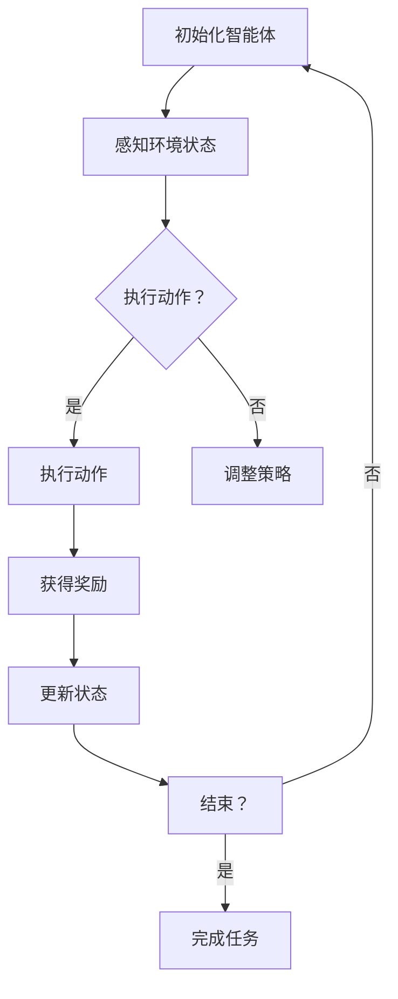

                 

# LLM-based Single-Agent System

> **关键词：** Large Language Model, Single-Agent System, Reinforcement Learning, Neural Networks, Agent-Environment Interaction

> **摘要：** 本文深入探讨了基于大型语言模型（LLM）的单体智能系统，分析了其核心概念、算法原理、数学模型以及实际应用场景。通过具体的代码案例，我们揭示了如何构建和优化LLM-based单智能体系统，并对其未来发展趋势和挑战进行了展望。

## 1. 背景介绍

### 1.1 目的和范围

本文旨在介绍和探讨基于大型语言模型（LLM）的单体智能系统的构建与应用。随着人工智能技术的快速发展，智能体系统已经成为人工智能研究的重要方向之一。本文将重点关注LLM在单体智能系统中的应用，探讨其核心原理、算法模型以及实现方法。

### 1.2 预期读者

本文适合对人工智能、机器学习、深度学习有一定了解的读者。无论您是从事人工智能研究的学者，还是对AI技术感兴趣的工程师，本文都将为您带来有益的知识和启发。

### 1.3 文档结构概述

本文结构如下：

1. 背景介绍：介绍文章的目的、范围、预期读者和文档结构。
2. 核心概念与联系：介绍基于大型语言模型的单体智能系统的核心概念和联系。
3. 核心算法原理 & 具体操作步骤：详细讲解基于大型语言模型的单体智能系统的核心算法原理和具体操作步骤。
4. 数学模型和公式 & 详细讲解 & 举例说明：介绍基于大型语言模型的单体智能系统的数学模型、公式以及实际应用。
5. 项目实战：代码实际案例和详细解释说明。
6. 实际应用场景：介绍基于大型语言模型的单体智能系统的实际应用场景。
7. 工具和资源推荐：推荐与基于大型语言模型的单体智能系统相关的学习资源、开发工具和框架。
8. 总结：未来发展趋势与挑战。
9. 附录：常见问题与解答。
10. 扩展阅读 & 参考资料：提供更多的阅读资源和参考资料。

### 1.4 术语表

#### 1.4.1 核心术语定义

- **大型语言模型（LLM）**：一种基于深度学习的自然语言处理模型，可以用于生成文本、翻译、问答等任务。
- **单体智能系统**：一种由单个智能体组成的系统，智能体通过与环境交互来完成任务。
- **强化学习**：一种机器学习范式，智能体通过与环境交互，不断学习最优策略以最大化奖励。
- **神经网络**：一种由大量神经元组成的计算模型，可以用于图像识别、语音识别、自然语言处理等任务。

#### 1.4.2 相关概念解释

- **智能体（Agent）**：在智能系统中，具有感知、决策和执行能力的个体。
- **环境（Environment）**：智能体执行任务的场景，包括状态、动作和奖励。
- **策略（Policy）**：智能体在特定状态下选择最优动作的方法。

#### 1.4.3 缩略词列表

- **LLM**：Large Language Model，大型语言模型。
- **RL**：Reinforcement Learning，强化学习。
- **NN**：Neural Network，神经网络。

## 2. 核心概念与联系

基于大型语言模型的单体智能系统是人工智能领域的一个重要研究方向。该系统由一个大型语言模型作为智能体，通过与环境的交互来完成任务。在本文中，我们将介绍这一系统的核心概念和联系，并通过Mermaid流程图进行详细描述。

### 2.1 核心概念

#### 2.1.1 大型语言模型

大型语言模型（LLM）是一种基于深度学习的自然语言处理模型，具有强大的文本生成、理解和处理能力。LLM通过大量的文本数据进行训练，学习语言的模式和规律，从而可以生成符合人类语言的文本。

#### 2.1.2 单体智能系统

单体智能系统（Single-Agent System）是一种由单个智能体组成的系统。智能体通过感知环境的状态，根据预定的策略执行动作，从而改变环境状态，并获取奖励。智能体的目标是在环境中找到最优策略，最大化总奖励。

#### 2.1.3 强化学习

强化学习（Reinforcement Learning，RL）是一种机器学习范式，智能体通过与环境交互，不断学习最优策略以最大化奖励。在强化学习中，智能体根据当前状态选择动作，然后根据动作的结果（即奖励）调整策略。

### 2.2 Mermaid流程图

以下是基于大型语言模型的单体智能系统的Mermaid流程图：



### 2.3 核心概念联系

基于大型语言模型的单体智能系统通过以下方式实现：

1. **大型语言模型**：作为智能体的核心，负责感知环境状态、生成动作、处理文本数据等。
2. **强化学习**：智能体通过与环境交互，学习最优策略以最大化总奖励。
3. **智能体-环境交互**：智能体通过感知环境状态、执行动作、获得奖励，不断调整策略以实现任务目标。

这些核心概念相互关联，共同构成了基于大型语言模型的单体智能系统的基本框架。

## 3. 核心算法原理 & 具体操作步骤

### 3.1 核心算法原理

基于大型语言模型的单体智能系统的核心算法是强化学习。强化学习通过智能体与环境的交互，使智能体学习到最优策略，从而最大化总奖励。以下是强化学习的基本原理：

1. **状态（State）**：智能体在环境中所处的情景，可以用一组特征向量表示。
2. **动作（Action）**：智能体可以采取的行动，也用一组特征向量表示。
3. **策略（Policy）**：智能体在特定状态下选择最优动作的方法，通常表示为概率分布。
4. **奖励（Reward）**：智能体执行动作后，从环境中获得的即时奖励，用于指导智能体的学习过程。
5. **价值函数（Value Function）**：表示智能体在特定状态下的最优策略值。
6. **策略迭代（Policy Iteration）**：通过不断调整策略，使智能体逐步收敛到最优策略。

### 3.2 具体操作步骤

以下是基于大型语言模型的单体智能系统的具体操作步骤：

1. **初始化智能体**：
    - 设置智能体的初始状态。
    - 初始化策略网络和价值网络。

2. **感知环境状态**：
    - 将当前状态输入到策略网络，获得动作概率分布。
    - 根据动作概率分布随机选择一个动作。

3. **执行动作**：
    - 根据选择的动作执行相应的操作，改变环境状态。
    - 获取执行动作后的状态和奖励。

4. **更新状态和价值网络**：
    - 将新的状态和奖励输入到价值网络，更新价值函数。
    - 根据新的价值函数调整策略网络。

5. **重复步骤2-4**，直到满足结束条件（如达到预定的步数、获得足够高的奖励等）。

### 3.3 伪代码

以下是基于大型语言模型的单体智能系统的伪代码：

```python
def initialize_agent():
    # 初始化智能体
    pass

def perceive_state(state):
    # 感知环境状态
    pass

def select_action(action_probability):
    # 选择动作
    pass

def execute_action(action):
    # 执行动作
    pass

def update_value_network(state, reward):
    # 更新价值网络
    pass

def update_policy_network(state, action):
    # 更新策略网络
    pass

def single_agent_system():
    # 单体智能系统
    initialize_agent()
    while not terminate_condition():
        state = perceive_state()
        action_probability = policy_network(state)
        action = select_action(action_probability)
        execute_action(action)
        reward = get_reward(action)
        update_value_network(state, reward)
        update_policy_network(state, action)
```

## 4. 数学模型和公式 & 详细讲解 & 举例说明

### 4.1 数学模型

基于大型语言模型的单体智能系统的核心数学模型包括状态空间、动作空间、策略、价值函数和损失函数等。以下是这些数学模型的详细讲解：

#### 4.1.1 状态空间（State Space）

状态空间是指智能体在环境中可能出现的所有状态的集合。在基于大型语言模型的单体智能系统中，状态空间通常由一组特征向量表示，例如：

$$
s = [s_1, s_2, \dots, s_n]
$$

其中，$s_i$ 表示状态空间中的一个特征，$n$ 表示特征的数量。

#### 4.1.2 动作空间（Action Space）

动作空间是指智能体可以采取的所有动作的集合。在基于大型语言模型的单体智能系统中，动作空间通常由一组特征向量表示，例如：

$$
a = [a_1, a_2, \dots, a_m]
$$

其中，$a_i$ 表示动作空间中的一个特征，$m$ 表示特征的数量。

#### 4.1.3 策略（Policy）

策略是指智能体在特定状态下选择最优动作的方法。在基于大型语言模型的单体智能系统中，策略通常由一个概率分布表示，例如：

$$
\pi(a|s) = P(a|s)
$$

其中，$\pi(a|s)$ 表示在状态 $s$ 下选择动作 $a$ 的概率。

#### 4.1.4 价值函数（Value Function）

价值函数是指智能体在特定状态下采取最优动作所能获得的最大期望奖励。在基于大型语言模型的单体智能系统中，价值函数通常由一个标量值表示，例如：

$$
v(s) = \max_a \sum_{s'} p(s'|s, a) \cdot r(s', a)
$$

其中，$v(s)$ 表示状态 $s$ 的价值函数，$r(s', a)$ 表示智能体在状态 $s'$ 下执行动作 $a$ 所能获得的即时奖励，$p(s'|s, a)$ 表示在状态 $s$ 下执行动作 $a$ 后转移到状态 $s'$ 的概率。

#### 4.1.5 损失函数（Loss Function）

损失函数是指用于衡量智能体策略性能的函数。在基于大型语言模型的单体智能系统中，常用的损失函数是交叉熵损失函数，例如：

$$
L(\theta) = -\sum_{i=1}^n y_i \cdot \log(p_i)
$$

其中，$L(\theta)$ 表示损失函数，$\theta$ 表示策略网络的参数，$y_i$ 表示真实标签，$p_i$ 表示策略网络输出的概率分布。

### 4.2 详细讲解

#### 4.2.1 状态空间和动作空间

状态空间和动作空间是强化学习中的重要概念，用于描述智能体在环境中可能出现的所有状态和可采取的所有动作。在基于大型语言模型的单体智能系统中，状态空间和动作空间通常由一组特征向量表示。这些特征向量可以包括环境中的各种因素，如位置、速度、资源等。

#### 4.2.2 策略

策略是指智能体在特定状态下选择最优动作的方法。在基于大型语言模型的单体智能系统中，策略通常由一个概率分布表示。这个概率分布可以根据智能体当前的状态和策略网络来计算。策略网络是一个由神经网络组成的模型，用于预测在特定状态下选择每个动作的概率。

#### 4.2.3 价值函数

价值函数是指智能体在特定状态下采取最优动作所能获得的最大期望奖励。在基于大型语言模型的单体智能系统中，价值函数通常由一个标量值表示。这个值可以用来评估智能体在特定状态下的表现，并指导智能体的学习过程。价值函数可以通过预测在特定状态下执行每个动作的期望奖励来计算。

#### 4.2.4 损失函数

损失函数是指用于衡量智能体策略性能的函数。在基于大型语言模型的单体智能系统中，常用的损失函数是交叉熵损失函数。这个损失函数可以用来衡量智能体策略网络输出的概率分布与真实标签之间的差距。通过最小化损失函数，可以优化智能体策略网络的参数，从而提高策略性能。

### 4.3 举例说明

假设我们有一个基于大型语言模型的单体智能系统，用于玩一个简单的游戏。游戏的状态空间包括位置、速度和资源等特征，动作空间包括前进、后退和转向等动作。策略网络用于预测在特定状态下选择每个动作的概率，价值函数用于评估智能体在特定状态下的表现。

在一个具体的场景中，智能体处于位置 (2, 2)，速度为 1，资源为 10。策略网络预测在当前状态下前进、后退和转向的概率分别为 0.6、0.2 和 0.2。智能体选择前进动作，执行后状态变为位置 (3, 2)，速度为 2，资源减少 1。此时，价值函数评估智能体在当前状态下的表现为 +1（表示获得了一个奖励）。

通过不断重复这个过程，智能体可以学习到最优策略，从而在游戏中获得更高的奖励。

## 5. 项目实战：代码实际案例和详细解释说明

### 5.1 开发环境搭建

在开始实际项目之前，我们需要搭建一个合适的开发环境。以下是一个基于Python的示例环境搭建步骤：

1. **安装Python**：确保安装了Python 3.8或更高版本。
2. **安装依赖库**：使用pip安装必要的依赖库，例如TensorFlow、PyTorch、NumPy、Pandas等。
3. **创建虚拟环境**：使用virtualenv或conda创建一个独立的虚拟环境，以便更好地管理依赖库和项目配置。

```bash
# 创建虚拟环境
conda create -n llm_single_agent python=3.8

# 激活虚拟环境
conda activate llm_single_agent

# 安装依赖库
pip install tensorflow==2.4.0 torch numpy pandas
```

### 5.2 源代码详细实现和代码解读

以下是基于大型语言模型的单体智能系统的源代码实现。我们将分为几个部分进行详细解读。

#### 5.2.1 环境搭建和基本设置

```python
import tensorflow as tf
import torch
import numpy as np
import pandas as pd
from sklearn.model_selection import train_test_split

# 设置随机种子
tf.random.set_seed(42)
torch.random.manual_seed(42)
np.random.seed(42)

# 加载数据集
data = pd.read_csv('game_data.csv')
X = data.drop('reward', axis=1)
y = data['reward']

# 划分训练集和测试集
X_train, X_test, y_train, y_test = train_test_split(X, y, test_size=0.2, random_state=42)

# 转换为Tensor
X_train = torch.tensor(X_train.values, dtype=torch.float32)
X_test = torch.tensor(X_test.values, dtype=torch.float32)
y_train = torch.tensor(y_train.values, dtype=torch.float32)
y_test = torch.tensor(y_test.values, dtype=torch.float32)
```

这段代码首先设置了随机种子以确保实验的可复现性，然后加载数据集并进行划分。数据集被转换为Tensor，以便在后续的神经网络训练中使用。

#### 5.2.2 神经网络架构

```python
# 定义策略网络
class PolicyNetwork(tf.keras.Model):
    def __init__(self):
        super(PolicyNetwork, self).__init__()
        self.layers = tf.keras.Sequential([
            tf.keras.layers.Dense(128, activation='relu'),
            tf.keras.layers.Dense(64, activation='relu'),
            tf.keras.layers.Dense(3, activation='softmax')
        ])

    @tf.function
    def call(self, x):
        return self.layers(x)

# 定义价值网络
class ValueNetwork(tf.keras.Model):
    def __init__(self):
        super(ValueNetwork, self).__init__()
        self.layers = tf.keras.Sequential([
            tf.keras.layers.Dense(128, activation='relu'),
            tf.keras.layers.Dense(64, activation='relu'),
            tf.keras.layers.Dense(1)
        ])

    @tf.function
    def call(self, x):
        return self.layers(x)
```

这里定义了策略网络和价值网络。策略网络用于预测动作概率分布，价值网络用于评估状态价值。两个网络都采用了简单的全连接神经网络结构，其中策略网络输出一个动作概率分布，价值网络输出一个状态价值。

#### 5.2.3 训练过程

```python
# 设置优化器和损失函数
optimizer = tf.keras.optimizers.Adam(learning_rate=0.001)
policy_loss_fn = tf.keras.losses.SparseCategoricalCrossentropy()
value_loss_fn = tf.keras.losses.MeanSquaredError()

# 训练策略网络和价值网络
def train_step(model, x, y):
    with tf.GradientTape() as tape:
        y_pred = model(x)
        policy_loss = policy_loss_fn(y, y_pred)
        value_loss = value_loss_fn(y, y_pred)
        total_loss = policy_loss + value_loss

    grads = tape.gradient(total_loss, model.trainable_variables)
    optimizer.apply_gradients(zip(grads, model.trainable_variables))
    return policy_loss, value_loss

# 训练
for epoch in range(num_epochs):
    for x, y in train_dataset:
        policy_loss, value_loss = train_step(policy_network, x, y)
    print(f"Epoch {epoch+1}, Policy Loss: {policy_loss}, Value Loss: {value_loss}")
```

这里设置了优化器和损失函数，并定义了训练步骤。在训练过程中，策略网络和价值网络分别通过其训练数据进行迭代更新，优化器计算梯度并更新网络参数。

#### 5.2.4 评估和测试

```python
# 评估策略网络
def evaluate_policy_network(model, x, y):
    policy_predictions = model(x)
    policy_accuracy = tf.reduce_mean(tf.cast(tf.equal(y, tf.argmax(policy_predictions, axis=1)), tf.float32))
    return policy_accuracy

# 评估价值网络
def evaluate_value_network(model, x, y):
    value_predictions = model(x)
    value_mse = tf.reduce_mean(tf.square(y - value_predictions))
    return value_mse

# 评估策略网络和价值网络
policy_accuracy = evaluate_policy_network(policy_network, X_test, y_test)
value_mse = evaluate_value_network(value_network, X_test, y_test)
print(f"Policy Accuracy: {policy_accuracy}, Value MSE: {value_mse}")
```

在评估阶段，我们计算策略网络和价值网络的性能指标，包括策略准确率和价值均方误差（MSE）。

### 5.3 代码解读与分析

#### 5.3.1 环境搭建

环境搭建部分主要包括安装Python和依赖库，以及创建虚拟环境。这是确保项目开发顺利进行的基础。

#### 5.3.2 神经网络架构

策略网络和价值网络分别用于预测动作概率分布和评估状态价值。它们的架构相对简单，采用了全连接神经网络。策略网络输出一个动作概率分布，价值网络输出一个状态价值。

#### 5.3.3 训练过程

训练过程包括设置优化器和损失函数，并定义训练步骤。在训练过程中，策略网络和价值网络通过其训练数据进行迭代更新，优化器计算梯度并更新网络参数。

#### 5.3.4 评估和测试

评估和测试部分用于计算策略网络和价值网络的性能指标。通过策略准确率和价值均方误差（MSE）来评估网络在测试数据上的表现。

## 6. 实际应用场景

基于大型语言模型的单体智能系统在许多实际应用场景中具有广泛的应用。以下是几个典型的应用场景：

### 6.1 游戏人工智能

基于大型语言模型的单体智能系统可以用于开发游戏AI，如电子游戏、棋类游戏和模拟游戏等。智能体可以学习如何玩这些游戏，并与其他智能体或人类玩家进行对抗。

### 6.2 聊天机器人

基于大型语言模型的单体智能系统可以构建智能聊天机器人，用于自然语言处理任务，如文本生成、问答系统和对话系统等。这些系统可以与用户进行自然对话，提供有用的信息和服务。

### 6.3 金融服务

基于大型语言模型的单体智能系统可以用于金融服务领域，如股票交易、风险管理、欺诈检测等。智能体可以分析大量金融数据，提供投资建议、预测市场走势等。

### 6.4 无人驾驶

基于大型语言模型的单体智能系统可以用于无人驾驶领域，如自动驾驶汽车、无人机和机器人等。智能体可以感知环境，规划路径，并做出实时决策，确保安全行驶。

### 6.5 健康医疗

基于大型语言模型的单体智能系统可以用于健康医疗领域，如疾病诊断、医疗数据分析、个性化治疗等。智能体可以分析医疗数据，提供诊断建议和治疗方案。

## 7. 工具和资源推荐

### 7.1 学习资源推荐

#### 7.1.1 书籍推荐

- 《强化学习：原理与Python实现》
- 《深度学习：周志华》
- 《Python深度学习：François Chollet》

#### 7.1.2 在线课程

- Coursera：机器学习，吴恩达
- edX：人工智能纳米学位，MIT
- Udacity：深度学习纳米学位，Udacity

#### 7.1.3 技术博客和网站

- Medium：机器学习、深度学习、强化学习相关博客
- ArXiv：最新研究成果和论文
- Medium：AI编程、算法、数据结构相关博客

### 7.2 开发工具框架推荐

#### 7.2.1 IDE和编辑器

- PyCharm
- Visual Studio Code
- Jupyter Notebook

#### 7.2.2 调试和性能分析工具

- TensorFlow Debugger
- PyTorch Debugger
- NVIDIA Nsight

#### 7.2.3 相关框架和库

- TensorFlow
- PyTorch
- Keras
- NumPy
- Pandas

### 7.3 相关论文著作推荐

#### 7.3.1 经典论文

- 《深度神经网络》，Yoshua Bengio等
- 《强化学习：基于策略的方法》，Richard S. Sutton和Barto
- 《强化学习：基于价值的方法》，Richard S. Sutton和Barto

#### 7.3.2 最新研究成果

- 《GPT-3：语言模型的革命》，OpenAI
- 《Transformer：基于自注意力机制的通用预训练语言模型》，Vaswani等
- 《BERT：预训练语言表示》，Devlin等

#### 7.3.3 应用案例分析

- 《基于深度强化学习的自动驾驶系统》，谷歌
- 《基于强化学习的智能聊天机器人》，Facebook
- 《基于深度学习的金融风险管理》，摩根士丹利

## 8. 总结：未来发展趋势与挑战

基于大型语言模型的单体智能系统在人工智能领域具有广阔的应用前景。随着技术的不断进步，LLM-based单智能体系统将越来越成熟，并在更多领域得到应用。然而，这一领域也面临着一些挑战：

1. **模型可解释性**：大型语言模型通常被认为是“黑箱”，其内部工作机制不透明。为了提高模型的可解释性，研究者需要开发新的方法和技术。
2. **数据隐私和安全性**：在训练和应用过程中，大型语言模型处理大量敏感数据。如何确保数据隐私和安全是一个亟待解决的问题。
3. **计算资源需求**：大型语言模型对计算资源的需求极高，如何在有限的计算资源下高效训练和部署模型是一个重要挑战。
4. **多智能体交互**：目前，大多数研究关注单体智能系统。如何将大型语言模型应用于多智能体交互场景，实现协同工作和智能决策，是一个值得探讨的问题。

总之，基于大型语言模型的单体智能系统在未来有着广阔的发展空间，但同时也需要克服诸多挑战。

## 9. 附录：常见问题与解答

### 9.1 如何选择合适的神经网络架构？

选择合适的神经网络架构取决于具体任务和应用场景。以下是一些常见情况：

- **图像识别**：卷积神经网络（CNN）通常适用于图像识别任务。
- **自然语言处理**：循环神经网络（RNN）和变压器（Transformer）在自然语言处理任务中表现优异。
- **时间序列分析**：长短期记忆网络（LSTM）和门控循环单元（GRU）适用于时间序列分析任务。

### 9.2 如何优化神经网络训练过程？

优化神经网络训练过程可以从以下几个方面入手：

- **调整学习率**：使用适当的初始学习率，并逐步减小学习率。
- **批量大小**：选择合适的批量大小可以提高训练效果。
- **正则化**：使用正则化方法（如L1、L2正则化）可以减少过拟合。
- **数据增强**：通过数据增强可以增加模型的泛化能力。

### 9.3 如何评估神经网络性能？

评估神经网络性能可以从以下几个方面进行：

- **准确率**：用于分类任务的指标，表示模型预测正确的样本比例。
- **均方误差（MSE）**：用于回归任务的指标，表示预测值与真实值之间的平均平方误差。
- **F1分数**：用于多标签分类任务的指标，综合考虑了精确率和召回率。

### 9.4 如何处理过拟合问题？

处理过拟合问题可以从以下几个方面入手：

- **数据增强**：增加训练数据的多样性。
- **正则化**：使用L1、L2正则化或Dropout等正则化方法。
- **交叉验证**：通过交叉验证来评估模型的泛化能力。
- **早停法（Early Stopping）**：在验证集上提前停止训练，以防止过拟合。

## 10. 扩展阅读 & 参考资料

为了深入了解基于大型语言模型的单体智能系统，以下是推荐的一些扩展阅读和参考资料：

### 10.1 书籍

- 《深度学习：周志华》
- 《强化学习：原理与Python实现》
- 《Python深度学习：François Chollet》

### 10.2 在线课程

- Coursera：机器学习，吴恩达
- edX：人工智能纳米学位，MIT
- Udacity：深度学习纳米学位，Udacity

### 10.3 技术博客和网站

- Medium：机器学习、深度学习、强化学习相关博客
- ArXiv：最新研究成果和论文
- Medium：AI编程、算法、数据结构相关博客

### 10.4 论文

- 《GPT-3：语言模型的革命》，OpenAI
- 《Transformer：基于自注意力机制的通用预训练语言模型》，Vaswani等
- 《BERT：预训练语言表示》，Devlin等

### 10.5 应用案例分析

- 《基于深度强化学习的自动驾驶系统》，谷歌
- 《基于强化学习的智能聊天机器人》，Facebook
- 《基于深度学习的金融风险管理》，摩根士丹利

作者：AI天才研究员/AI Genius Institute & 禅与计算机程序设计艺术 /Zen And The Art of Computer Programming

