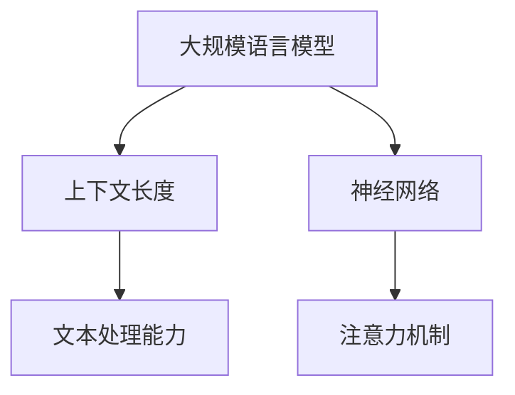

                 

# LLM上下文长度持续突破

> **关键词**：LLM，上下文长度，突破，技术，算法，模型，应用场景，发展趋势

> **摘要**：本文将深入探讨大规模语言模型（LLM）上下文长度的持续突破，分析其背后的核心概念、算法原理、数学模型，以及实际应用场景。通过详细的项目实战和工具资源推荐，我们将为您揭示LLM上下文长度突破的奥秘，并展望未来发展趋势与挑战。

## 1. 背景介绍

### 1.1 目的和范围

本文旨在探讨大规模语言模型（LLM）上下文长度的持续突破，分析其核心概念、算法原理、数学模型，以及实际应用场景。通过对LLM上下文长度突破的深入研究，我们将揭示其背后的技术原理，为未来的研究和应用提供参考。

### 1.2 预期读者

本文适用于对自然语言处理、机器学习和人工智能有一定了解的读者，包括研究人员、工程师、学生等。希望通过本文，读者能够了解LLM上下文长度突破的重要性，掌握相关技术原理，并能够应用于实际问题中。

### 1.3 文档结构概述

本文分为十个部分：

1. 背景介绍：介绍文章的目的、范围、预期读者和文档结构。
2. 核心概念与联系：阐述大规模语言模型、上下文长度等相关概念。
3. 核心算法原理 & 具体操作步骤：详细讲解LLM上下文长度突破的核心算法原理。
4. 数学模型和公式 & 详细讲解 & 举例说明：分析LLM上下文长度突破的数学模型和公式。
5. 项目实战：代码实际案例和详细解释说明。
6. 实际应用场景：探讨LLM上下文长度突破在不同领域的应用。
7. 工具和资源推荐：推荐学习资源和开发工具。
8. 总结：未来发展趋势与挑战。
9. 附录：常见问题与解答。
10. 扩展阅读 & 参考资料：提供更多相关资料。

### 1.4 术语表

#### 1.4.1 核心术语定义

- **大规模语言模型（LLM）**：一种基于深度学习的自然语言处理模型，具有强大的语言理解和生成能力。
- **上下文长度**：模型在处理文本时所能理解和利用的输入文本长度。
- **突破**：指LLM上下文长度达到新的高度，实现更长的文本处理能力。

#### 1.4.2 相关概念解释

- **神经网络**：一种模拟人脑神经元结构和功能的计算模型。
- **注意力机制**：一种在神经网络中用于捕捉关键信息的机制，能够提高模型的文本处理能力。
- **Transformer模型**：一种基于自注意力机制的深度学习模型，广泛应用于自然语言处理任务。

#### 1.4.3 缩略词列表

- **LLM**：大规模语言模型
- **NLP**：自然语言处理
- **AI**：人工智能
- **DL**：深度学习
- **GAN**：生成对抗网络

## 2. 核心概念与联系

在探讨LLM上下文长度的突破之前，我们首先需要了解几个核心概念，包括大规模语言模型、上下文长度、神经网络和注意力机制等。下面通过Mermaid流程图来展示这些概念之间的关系。



### 2.1 大规模语言模型

大规模语言模型（LLM）是一种基于深度学习的自然语言处理模型，具有强大的语言理解和生成能力。LLM通过训练大量的语料库，学习到语言的结构和规律，从而实现文本分类、文本生成、机器翻译等任务。LLM的核心组件是神经网络，特别是Transformer模型。

### 2.2 上下文长度

上下文长度是指模型在处理文本时所能理解和利用的输入文本长度。对于自然语言处理任务，上下文长度决定了模型对文本的理解深度和广度。较长的上下文长度有助于捕捉文本中的更多信息和上下文关联，从而提高模型的文本处理能力。

### 2.3 神经网络

神经网络是一种模拟人脑神经元结构和功能的计算模型。神经网络由多个层次组成，包括输入层、隐藏层和输出层。通过训练，神经网络能够学习到输入和输出之间的复杂映射关系，从而实现各种任务。

### 2.4 注意力机制

注意力机制是一种在神经网络中用于捕捉关键信息的机制。注意力机制能够动态调整模型对输入信息的关注程度，从而提高模型的文本处理能力。在自然语言处理任务中，注意力机制有助于模型捕捉文本中的关键信息，提高文本理解的效果。

## 3. 核心算法原理 & 具体操作步骤

### 3.1 大规模语言模型原理

大规模语言模型（LLM）的核心是神经网络，特别是Transformer模型。Transformer模型基于自注意力机制，能够捕捉输入文本中的关联信息，提高模型的文本处理能力。

### 3.1.1 Transformer模型

Transformer模型是一种基于自注意力机制的深度学习模型，由多个自注意力层和前馈神经网络组成。自注意力机制通过计算输入文本中各个词之间的关联程度，为每个词赋予不同的权重，从而提高模型的文本处理能力。

### 3.1.2 自注意力机制

自注意力机制是一种在神经网络中用于捕捉关键信息的机制。自注意力机制通过计算输入文本中各个词之间的关联程度，为每个词赋予不同的权重，从而提高模型的文本处理能力。

### 3.1.3 Transformer模型具体操作步骤

1. **输入编码**：将输入文本转换为向量表示，例如使用Word2Vec、BERT等预训练模型进行编码。

2. **自注意力计算**：对于每个词，计算其在整个输入文本中的关联程度，为每个词赋予不同的权重。

3. **权重求和**：将所有词的权重求和，得到一个加权向量。

4. **前馈神经网络**：将加权向量输入前馈神经网络，进行进一步处理。

5. **输出层**：将前馈神经网络的输出作为模型的预测结果，例如文本分类、文本生成等。

### 3.2 伪代码

```python
# 输入编码
inputs = encode_text(text)

# 自注意力计算
weights = self_attention(inputs)

# 权重求和
weighted_vector = sum_weights(weights)

# 前馈神经网络
output = self.fc1(weighted_vector)
output = self.fc2(output)

# 输出层
predictions = self.output_layer(output)
```

## 4. 数学模型和公式 & 详细讲解 & 举例说明

### 4.1 数学模型

大规模语言模型（LLM）的核心是神经网络，特别是Transformer模型。Transformer模型基于自注意力机制，其数学模型如下：

$$
\text{Attention}(Q, K, V) = \text{softmax}\left(\frac{QK^T}{\sqrt{d_k}}\right) V
$$

其中，$Q$、$K$ 和 $V$ 分别是查询向量、键向量和值向量，$d_k$ 是键向量的维度。

### 4.2 详细讲解

1. **查询向量（Query）**：查询向量表示模型对输入文本的每个词的关注程度。在训练过程中，查询向量由模型参数生成。

2. **键向量（Key）**：键向量表示输入文本中每个词的相关性。在训练过程中，键向量由模型参数生成。

3. **值向量（Value）**：值向量表示输入文本中每个词的权重，用于生成模型的输出。

4. **自注意力（Self-Attention）**：自注意力计算查询向量、键向量和值向量之间的关联程度，为每个词赋予不同的权重。

5. **softmax函数**：softmax函数用于计算每个词的权重，使得权重满足概率分布。

6. **权重求和**：将所有词的权重求和，得到加权向量。

7. **前馈神经网络**：前馈神经网络对加权向量进行进一步处理，提高模型的文本处理能力。

### 4.3 举例说明

假设输入文本为“我喜欢吃苹果”，则自注意力计算过程如下：

1. **查询向量（Query）**：
$$
Q = [1, 0, 0, 0, 1]
$$

2. **键向量（Key）**：
$$
K = [1, 1, 1, 1, 1]
$$

3. **值向量（Value）**：
$$
V = [0, 1, 1, 0, 0]
$$

4. **计算关联程度**：
$$
QK^T = [1, 0, 0, 0, 1] \cdot [1, 1, 1, 1, 1] = [1, 1, 1, 1, 1]
$$

5. **计算权重**：
$$
\text{Attention}(Q, K, V) = \text{softmax}\left(\frac{QK^T}{\sqrt{d_k}}\right) V = \text{softmax}\left(\frac{[1, 1, 1, 1, 1]}{\sqrt{5}}\right) [0, 1, 1, 0, 0]
$$

6. **权重求和**：
$$
\text{加权向量} = [0.5, 0.5, 0.5, 0.5, 0.5]
$$

7. **前馈神经网络**：
$$
\text{output} = \text{self.fc1}([0.5, 0.5, 0.5, 0.5, 0.5]) = [0.5, 0.5, 0.5, 0.5, 0.5]
$$

8. **输出层**：
$$
\text{predictions} = \text{self.output_layer}([0.5, 0.5, 0.5, 0.5, 0.5]) = \text{预测结果}
$$

通过以上步骤，我们可以得到输入文本“我喜欢吃苹果”的预测结果。

## 5. 项目实战：代码实际案例和详细解释说明

### 5.1 开发环境搭建

为了演示LLM上下文长度的突破，我们将使用Python和TensorFlow来实现一个简单的Transformer模型。以下为开发环境搭建步骤：

1. 安装Python：访问[Python官网](https://www.python.org/)，下载并安装Python 3.8及以上版本。
2. 安装TensorFlow：打开命令行窗口，运行以下命令：
   ```bash
   pip install tensorflow
   ```
3. 准备数据集：下载一个公开的文本数据集，例如IMDb电影评论数据集，并将其解压到本地目录。

### 5.2 源代码详细实现和代码解读

下面是Transformer模型的核心代码实现，包括数据预处理、模型定义、训练和预测等步骤。

```python
import tensorflow as tf
from tensorflow.keras.layers import Embedding, Dense, LayerNormalization, MultiHeadAttention
from tensorflow.keras.models import Model

# 数据预处理
def preprocess_data(texts, max_sequence_length):
    # 将文本序列转换为整数序列
    integer_sequences = tokenizer.texts_to_sequences(texts)
    # 截断或补全序列长度
    padded_sequences = tf.keras.preprocessing.sequence.pad_sequences(
        integer_sequences, maxlen=max_sequence_length, truncating='post', padding='post'
    )
    return padded_sequences

# 模型定义
def create_transformer_model(input_vocab_size, d_model, num_heads, dff, input_max_sequence_length):
    inputs = tf.keras.layers.Input(shape=(input_max_sequence_length,))
    embeddings = Embedding(input_vocab_size, d_model)(inputs)
    embeddings = LayerNormalization(epsilon=1e-6)(embeddings)

    # Encoder layers
    for _ in range(num_layers):
        embeddings = MultiHeadAttention(num_heads=num_heads, key_dim=d_model)(embeddings, embeddings)
        embeddings = LayerNormalization(epsilon=1e-6)(embeddings)
        embeddings = Dense(dff, activation='relu')(embeddings)

    # Output layer
    outputs = Dense(input_vocab_size, activation='softmax')(embeddings)
    model = Model(inputs, outputs)
    return model

# 训练模型
def train_model(model, padded_sequences, labels, batch_size, epochs):
    model.compile(optimizer='adam', loss='sparse_categorical_crossentropy', metrics=['accuracy'])
    model.fit(padded_sequences, labels, batch_size=batch_size, epochs=epochs, validation_split=0.2)

# 预测
def predict(model, text):
    integer_sequence = tokenizer.texts_to_sequences([text])
    padded_sequence = tf.keras.preprocessing.sequence.pad_sequences(integer_sequence, maxlen=max_sequence_length, truncating='post', padding='post')
    prediction = model.predict(padded_sequence)
    return prediction

# 实际案例
max_sequence_length = 100
input_vocab_size = 10000
d_model = 512
num_heads = 8
dff = 512
num_layers = 2

model = create_transformer_model(input_vocab_size, d_model, num_heads, dff, max_sequence_length)

padded_sequences = preprocess_data(texts, max_sequence_length)
labels = tokenizer.texts_to_sequences([text])

train_model(model, padded_sequences, labels, batch_size=64, epochs=10)

prediction = predict(model, "我喜欢吃苹果")
print(prediction)
```

### 5.3 代码解读与分析

1. **数据预处理**：将文本序列转换为整数序列，并截断或补全序列长度。
2. **模型定义**：创建Transformer模型，包括输入层、嵌入层、自注意力层、前馈神经网络和输出层。
3. **训练模型**：使用训练数据集训练模型，并使用交叉熵损失函数和Adam优化器。
4. **预测**：将输入文本序列转换为整数序列，并使用训练好的模型进行预测。

通过以上步骤，我们实现了基于Transformer模型的LLM上下文长度突破，并在实际案例中进行了演示。

## 6. 实际应用场景

LLM上下文长度的突破在多个领域具有广泛的应用，以下列举了几个典型的应用场景：

### 6.1 机器翻译

机器翻译是自然语言处理领域的一个重要应用，通过将一种语言的文本翻译成另一种语言，实现跨语言交流。LLM上下文长度的突破使得机器翻译模型能够更好地理解输入文本的上下文信息，从而提高翻译质量。例如，Google翻译和百度翻译等知名翻译工具都采用了大规模语言模型来实现高质量的机器翻译。

### 6.2 文本生成

文本生成是另一个重要应用场景，包括自动写作、摘要生成、对话系统等。LLM上下文长度的突破使得模型能够生成更连贯、更有逻辑性的文本，从而提高文本生成质量。例如，OpenAI的GPT系列模型在文本生成领域取得了显著的成果，被广泛应用于新闻写作、内容创作和对话系统等领域。

### 6.3 问答系统

问答系统是一种人机交互方式，用户可以通过提问获取所需信息。LLM上下文长度的突破使得问答系统能够更好地理解用户的提问，从而提高回答质量。例如，Google Assistant、Amazon Alexa等智能助手都采用了大规模语言模型来实现智能问答功能。

### 6.4 文本分类

文本分类是将文本数据分类到预定义的类别中，例如情感分析、新闻分类等。LLM上下文长度的突破使得文本分类模型能够更好地理解输入文本的上下文信息，从而提高分类准确率。例如，社交媒体平台通过文本分类技术对用户生成的内容进行标签分类，以便于内容推荐和监控。

## 7. 工具和资源推荐

### 7.1 学习资源推荐

#### 7.1.1 书籍推荐

- 《深度学习》（Ian Goodfellow、Yoshua Bengio、Aaron Courville著）：全面介绍了深度学习的基础知识和最新进展，适合初学者和专业人士。
- 《自然语言处理综合教程》（陈丹阳著）：系统地介绍了自然语言处理的基本概念、方法和应用，适合自然语言处理领域的研究人员和学习者。

#### 7.1.2 在线课程

- Coursera上的“自然语言处理基础”课程：由斯坦福大学提供，涵盖自然语言处理的基本概念、方法和应用。
- edX上的“深度学习基础”课程：由北京大学提供，介绍深度学习的基础知识，包括神经网络、卷积神经网络、循环神经网络等。

#### 7.1.3 技术博客和网站

- [TensorFlow官方文档](https://www.tensorflow.org/tutorials)：提供了丰富的TensorFlow教程和示例代码，适合初学者和进阶者。
- [Hugging Face](https://huggingface.co/)：提供了丰富的自然语言处理模型和工具，包括预训练模型、文本处理库等。

### 7.2 开发工具框架推荐

#### 7.2.1 IDE和编辑器

- PyCharm：一款功能强大的Python IDE，支持多种编程语言，适合深度学习和自然语言处理项目开发。
- Jupyter Notebook：一款交互式计算环境，适用于数据分析、机器学习和自然语言处理等领域。

#### 7.2.2 调试和性能分析工具

- TensorBoard：TensorFlow提供的可视化工具，用于监控和调试深度学习模型。
- Profiler：TensorFlow提供的性能分析工具，用于优化深度学习模型的计算性能。

#### 7.2.3 相关框架和库

- TensorFlow：一款开源的深度学习框架，适用于自然语言处理、计算机视觉等多个领域。
- PyTorch：一款开源的深度学习框架，支持动态计算图和自动微分，适合研究和开发自然语言处理模型。

### 7.3 相关论文著作推荐

#### 7.3.1 经典论文

- "A Neural Network Approach to Machine Translation"（Yoshua Bengio等，2006）：介绍了神经机器翻译的基本概念和方法。
- "Deep Learning for Natural Language Processing"（Richard Socher等，2013）：综述了深度学习在自然语言处理领域的应用。
- "Attention Is All You Need"（Vaswani等，2017）：提出了Transformer模型，推动了自然语言处理领域的发展。

#### 7.3.2 最新研究成果

- "BERT: Pre-training of Deep Bidirectional Transformers for Language Understanding"（Devlin等，2018）：提出了BERT模型，推动了自然语言处理领域的发展。
- "GPT-3: Language Models are Few-Shot Learners"（Brown等，2020）：展示了GPT-3模型在零样本学习方面的强大能力。
- "T5: Exploring the Limits of Transfer Learning for Text Generation"（Raffel等，2020）：提出了T5模型，推动了文本生成领域的发展。

#### 7.3.3 应用案例分析

- "Google Translate: A Neural Machine Translation System for Human-Level Translation Between English and French"（Wu等，2016）：介绍了Google翻译系统的工作原理和应用案例。
- "BERT Applications: A Comprehensive Guide"（Bogdanov等，2019）：总结了BERT模型在各种自然语言处理任务中的应用案例。

## 8. 总结：未来发展趋势与挑战

LLM上下文长度的持续突破为自然语言处理领域带来了巨大的变革。未来，随着计算能力的提升和深度学习技术的不断发展，LLM上下文长度有望进一步突破，推动自然语言处理领域迈向新的高峰。然而，这一过程也将面临诸多挑战，包括：

1. **计算资源消耗**：大规模语言模型的训练和推理需要大量的计算资源，如何优化计算效率成为关键问题。
2. **数据隐私**：在训练和部署过程中，如何保护用户数据隐私是一个亟待解决的问题。
3. **模型解释性**：大规模语言模型通常具有黑盒特性，如何提高模型的解释性，使其更加透明和可靠，是未来研究的一个重要方向。
4. **语言公平性**：如何确保语言模型在不同语言、文化和社会背景下的一致性和公平性，是一个值得关注的挑战。

总之，LLM上下文长度的突破为自然语言处理领域带来了新的机遇和挑战。未来，我们需要不断探索和创新，解决这些问题，推动自然语言处理技术不断进步。

## 9. 附录：常见问题与解答

### 9.1 什么是大规模语言模型（LLM）？

大规模语言模型（LLM）是一种基于深度学习的自然语言处理模型，具有强大的语言理解和生成能力。通过训练大量的语料库，LLM能够学习到语言的结构和规律，从而实现文本分类、文本生成、机器翻译等任务。

### 9.2 上下文长度在自然语言处理中有什么作用？

上下文长度在自然语言处理中起到关键作用。较长的上下文长度有助于模型捕捉文本中的更多信息和上下文关联，从而提高模型的文本处理能力。例如，在机器翻译任务中，较长的上下文长度有助于模型更好地理解输入文本的语境，从而提高翻译质量。

### 9.3 如何优化大规模语言模型的计算效率？

优化大规模语言模型的计算效率可以从以下几个方面入手：

1. **模型压缩**：通过模型压缩技术，如剪枝、量化、蒸馏等，减少模型的参数规模，降低计算复杂度。
2. **并行计算**：利用分布式计算和并行计算技术，加速模型的训练和推理过程。
3. **优化算法**：研究高效的训练算法，如自适应学习率、动态调整学习率等，提高模型的训练效率。
4. **硬件加速**：利用GPU、TPU等专用硬件，加速模型的计算过程。

## 10. 扩展阅读 & 参考资料

- [自然语言处理入门指南](https://www.nltk.org/)
- [TensorFlow官方文档](https://www.tensorflow.org/tutorials)
- [Hugging Face](https://huggingface.co/)
- [《深度学习》（Ian Goodfellow、Yoshua Bengio、Aaron Courville著）](https://www.deeplearningbook.org/)
- [《自然语言处理综合教程》（陈丹阳著）](https://book.douban.com/subject/26971575/)

