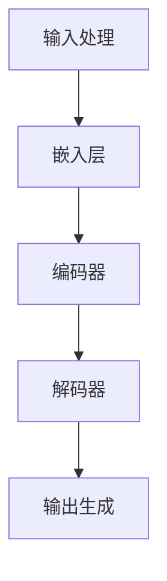
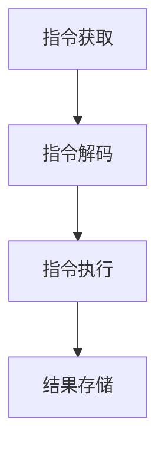
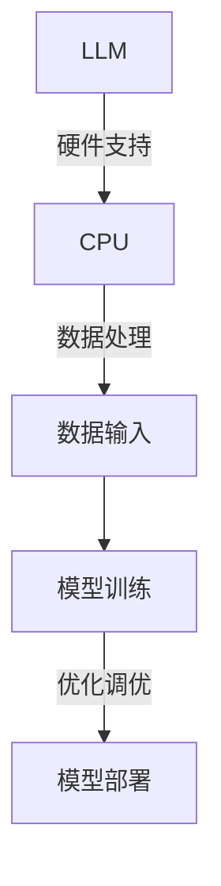

                 

### LLAM与CPU：时代、指令集与编程的碰撞

在当今的计算机科学与技术领域，大型语言模型（LLM，Large Language Model）和中央处理单元（CPU，Central Processing Unit）正在扮演着越来越重要的角色。两者看似不同，但实则存在着紧密的联系和显著的差异。本文将深入探讨LLM与CPU在时代、指令集、编程和规划等方面的对比。

首先，LLM和CPU分别代表了计算机科学发展的两个重要里程碑。CPU的出现标志着计算机从简单的电子设备走向复杂的数据处理系统，而LLM的崛起则预示着人工智能从感知阶段迈向认知阶段。LLM通过深度学习算法，能够理解和生成自然语言，极大地提升了计算机在语言处理方面的能力。而CPU则通过不断提升的指令集和性能，为各类计算任务提供了强大的硬件支持。

在指令集方面，CPU的指令集是编程语言与硬件之间的桥梁。CPU通过指令集来执行程序中的指令，这些指令定义了硬件应该执行的操作。而LLM的指令集则更加抽象，它们不是直接控制硬件，而是通过神经网络的结构和参数来模拟人类的思维过程。这使得LLM在处理复杂任务时更加灵活和高效。

编程方面，CPU编程通常涉及到汇编语言和高级语言，编程者需要深入了解计算机的底层结构和工作原理。而LLM编程则更多地依赖于机器学习和深度学习框架，编程者需要掌握大量数据和复杂的算法，以训练和优化模型。

在规划方面，CPU设计需要考虑硬件的优化，如指令流水线、缓存机制和并行处理等。而LLM的规划则更加注重数据和算法的优化，如何收集和处理大规模数据，如何设计和优化神经网络结构，都是关键问题。

通过上述分析，我们可以看到LLM和CPU在多个维度上存在着差异和联系。本文将逐步深入探讨这些差异和联系，通过具体案例和实践，帮助读者更好地理解和应用这些技术。

### 关键词

- 大型语言模型（LLM）
- 中央处理单元（CPU）
- 指令集
- 编程
- 规划
- 深度学习
- 硬件优化
- 数据处理
- 神经网络
- 机器学习

### 摘要

本文旨在对比大型语言模型（LLM）和中央处理单元（CPU）在时代背景、指令集、编程方法和规划策略等方面的差异与联系。通过对LLM和CPU的基本概念、技术原理、实际应用以及未来发展趋势的深入分析，本文将揭示两者在现代计算机科学中的重要性及其相互影响。文章结构分为十个部分，包括背景介绍、核心概念阐述、算法原理讲解、数学模型与公式应用、项目实战案例、实际应用场景分析、工具和资源推荐以及总结和扩展阅读。通过逐步推理和具体实例，本文将帮助读者全面理解LLM和CPU的核心技术，并探讨其在未来的发展潜力。

## 1. 背景介绍

### 1.1 目的和范围

本文的主要目的是通过深入对比大型语言模型（LLM，Large Language Model）和中央处理单元（CPU，Central Processing Unit），揭示两者在技术原理、应用场景和未来趋势中的差异和联系。通过对LLM和CPU的详细分析，本文希望帮助读者更好地理解这两种技术在现代计算机科学中的重要性及其相互影响。

本文的范围将涵盖以下方面：
1. **时代背景**：介绍LLM和CPU的发展历程，以及它们分别代表的计算机科学里程碑。
2. **核心概念**：定义LLM和CPU的基本概念，包括指令集、编程方法和规划策略。
3. **技术原理**：深入探讨LLM和CPU的技术原理，使用伪代码和Mermaid流程图进行详细阐述。
4. **数学模型**：讲解LLM和CPU相关的数学模型和公式，并举例说明其实际应用。
5. **项目实战**：通过具体代码案例，展示LLM和CPU的实际应用和实现过程。
6. **实际应用场景**：分析LLM和CPU在各个领域的应用，探讨其面临的挑战和机遇。
7. **工具和资源**：推荐相关的学习资源、开发工具和框架，以及最新研究成果。
8. **总结与未来趋势**：总结LLM和CPU的核心技术，探讨未来的发展趋势和挑战。

### 1.2 预期读者

本文的预期读者包括以下几类：
1. **计算机科学与工程专业的学生和研究人员**：希望通过本文系统地了解LLM和CPU的基本概念、技术原理和实际应用。
2. **程序员和软件工程师**：希望掌握LLM和CPU在编程和开发中的具体应用，提升自身的技能和知识水平。
3. **数据科学家和机器学习工程师**：希望了解LLM的技术原理和数学模型，以便更好地进行深度学习和自然语言处理。
4. **技术爱好者和专业人士**：对计算机科学和人工智能领域感兴趣，希望通过本文深入了解LLM和CPU的当前状态和未来趋势。

通过本文的阅读，读者应能够：
- 理解LLM和CPU的基本概念和核心原理。
- 掌握LLM和CPU的编程方法和规划策略。
- 分析LLM和CPU在不同应用场景中的优劣。
- 了解LLM和CPU的未来发展趋势和潜在挑战。

### 1.3 文档结构概述

本文将分为十个部分，具体结构如下：

1. **引言**：介绍LLM和CPU的基本概念、背景及其重要性。
2. **关键词**和**摘要**：列出本文的核心关键词和简要概述文章主题。
3. **背景介绍**：
   - **1.1 目的和范围**：明确本文的研究目的和范围。
   - **1.2 预期读者**：介绍预期读者群体及其需求。
   - **1.3 文档结构概述**：概述文章的结构和内容。
4. **核心概念与联系**：阐述LLM和CPU的核心概念和相互联系，提供Mermaid流程图。
5. **核心算法原理 & 具体操作步骤**：讲解LLM和CPU的核心算法原理，使用伪代码进行详细阐述。
6. **数学模型和公式 & 详细讲解 & 举例说明**：介绍LLM和CPU相关的数学模型和公式，并进行实际应用举例。
7. **项目实战：代码实际案例和详细解释说明**：通过具体代码案例，展示LLM和CPU的实际应用和实现过程。
8. **实际应用场景**：分析LLM和CPU在不同领域的应用案例，探讨其挑战和机遇。
9. **工具和资源推荐**：推荐学习资源、开发工具和框架，以及相关论文和研究。
10. **总结：未来发展趋势与挑战**：总结LLM和CPU的核心技术，探讨未来的发展趋势和面临的挑战。
11. **附录：常见问题与解答**：回答读者可能遇到的问题。
12. **扩展阅读 & 参考资料**：提供进一步阅读的材料。

### 1.4 术语表

#### 1.4.1 核心术语定义

- **大型语言模型（LLM）**：一种基于深度学习的自然语言处理模型，能够理解和生成自然语言。
- **中央处理单元（CPU）**：计算机的核心部件，负责执行程序指令并处理数据。
- **指令集**：CPU能够理解和执行的指令集合，包括操作码和操作数。
- **编程**：编写程序代码的过程，包括指令的选择、组织和优化。
- **规划**：设计计算机系统的工作流程和资源配置，以实现特定目标。

#### 1.4.2 相关概念解释

- **深度学习**：一种机器学习方法，通过多层神经网络模拟人类大脑的学习过程。
- **神经网络**：由多个相互连接的节点组成，通过学习输入和输出之间的关系，实现对复杂数据的处理。
- **自然语言处理（NLP）**：研究如何让计算机理解和处理自然语言的技术领域。

#### 1.4.3 缩略词列表

- **LLM**：Large Language Model（大型语言模型）
- **CPU**：Central Processing Unit（中央处理单元）
- **NLP**：Natural Language Processing（自然语言处理）
- **DL**：Deep Learning（深度学习）
- **AI**：Artificial Intelligence（人工智能）

## 2. 核心概念与联系

在深入探讨LLM和CPU的核心概念和联系之前，我们需要对它们的基本原理和架构有一个清晰的理解。以下将介绍这些核心概念，并提供一个Mermaid流程图来展示LLM和CPU的基本架构和相互关系。

### 2.1. 大型语言模型（LLM）的基本原理

**基本原理**：

大型语言模型（LLM）是基于深度学习的自然语言处理（NLP）模型，它通过多层神经网络（MLN）来学习和理解自然语言。LLM的核心是神经网络架构，如Transformer，它能够处理变长的序列数据，并捕捉数据中的长距离依赖关系。

**关键组件**：

- **嵌入层**（Embedding Layer）：将词汇转换为固定长度的向量表示。
- **编码器**（Encoder）：通过多层变换器（Transformer）处理输入序列。
- **解码器**（Decoder）：生成输出序列。

**工作流程**：

1. **输入处理**：将自然语言文本分割为单词或子词，并转换为嵌入向量。
2. **编码器处理**：通过多层变换器对输入序列进行处理，生成编码表示。
3. **解码器生成**：根据编码表示生成输出序列，可以是文本、标签或其他形式。

**Mermaid流程图**：



### 2.2. 中央处理单元（CPU）的基本原理

**基本原理**：

中央处理单元（CPU）是计算机的核心部件，负责执行程序指令并处理数据。CPU的基本工作原理是通过指令集来处理数据，这些指令定义了操作类型和操作数据。

**关键组件**：

- **控制单元**（Control Unit）：负责解释指令并控制其他部件的操作。
- **运算单元**（Arithmetic and Logic Unit, ALU）：执行算术和逻辑操作。
- **寄存器**（Registers）：存储数据和指令，提供快速访问。
- **缓存**（Cache）：提高数据访问速度。

**工作流程**：

1. **指令获取**：CPU从内存中获取指令。
2. **指令解码**：控制单元解释指令，确定操作类型和数据。
3. **指令执行**：运算单元执行操作，如算术运算或逻辑运算。
4. **结果存储**：将结果存储到寄存器或内存中。

**Mermaid流程图**：



### 2.3. LLM与CPU的相互关系

**相互关系**：

虽然LLM和CPU在架构和工作原理上有所不同，但它们在计算机科学中扮演着互补的角色。CPU提供了执行深度学习模型的硬件支持，而LLM则利用CPU的强大计算能力来实现自然语言处理任务。

**关键联系**：

- **计算能力**：CPU的强大计算能力为LLM提供了必要的硬件支持。
- **数据处理**：CPU和LLM都涉及到数据处理，但CPU更多地关注于指令和数据操作，而LLM则侧重于文本序列的处理。
- **优化与调优**：LLM的开发者需要针对CPU的特性进行模型优化和调优，以提升模型的性能和效率。

**Mermaid流程图**：



通过上述核心概念和Mermaid流程图，我们可以看到LLM和CPU在架构和功能上的差异和联系。接下来，我们将深入探讨LLM和CPU的核心算法原理，并使用伪代码进行详细阐述。

## 3. 核心算法原理 & 具体操作步骤

在深入探讨LLM和CPU的核心算法原理之前，我们需要明确这些技术的基本工作流程和关键步骤。以下将分别介绍LLM和CPU的核心算法原理，并使用伪代码进行详细阐述。

### 3.1. 大型语言模型（LLM）的核心算法原理

**基本原理**：

LLM是基于深度学习的自然语言处理模型，它通过多层神经网络（MLN）来学习和理解自然语言。LLM的核心算法原理包括嵌入层、编码器和解码器等组件。

**具体操作步骤**：

```python
# 嵌入层操作
def embedding_layer(inputs, embedding_size):
    # 将词汇转换为固定长度的向量表示
    embeddings = Embedding(vocab_size, embedding_size)(inputs)
    return embeddings

# 编码器操作
def encoder_layer(inputs, hidden_size):
    # 通过多层变换器对输入序列进行处理
    encoder = Encoder(hidden_size)(inputs)
    return encoder

# 解码器操作
def decoder_layer(inputs, hidden_size):
    # 根据编码表示生成输出序列
    decoder = Decoder(hidden_size)(inputs)
    return decoder

# LLM模型整体操作
def large_language_model(inputs, embedding_size, hidden_size):
    # 输入处理
    embeddings = embedding_layer(inputs, embedding_size)
    # 编码器处理
    encoder = encoder_layer(embeddings, hidden_size)
    # 解码器生成
    output = decoder_layer(encoder, hidden_size)
    return output
```

**详细解释**：

1. **嵌入层操作**：嵌入层将词汇转换为固定长度的向量表示。这个过程通过嵌入矩阵完成，每个词汇对应一个向量。
2. **编码器操作**：编码器通过多层变换器（如Transformer）对输入序列进行处理。这些变换器能够捕捉输入序列中的长距离依赖关系，为解码器提供有效的编码表示。
3. **解码器操作**：解码器根据编码表示生成输出序列。解码器的目标是通过上下文信息生成正确的输出词汇，这个过程通常使用自注意力机制来提高生成效果。
4. **LLM模型整体操作**：整个LLM模型通过嵌入层、编码器和解码器组件协同工作，实现从输入到输出的自然语言处理任务。

### 3.2. 中央处理单元（CPU）的核心算法原理

**基本原理**：

CPU是计算机的核心部件，负责执行程序指令并处理数据。CPU的核心算法原理主要包括指令获取、指令解码、指令执行和结果存储等步骤。

**具体操作步骤**：

```python
# 指令获取
def fetch_instruction(instructions, program_counter):
    instruction = instructions[program_counter]
    return instruction

# 指令解码
def decode_instruction(instruction):
    opcode = instruction[0]
    operands = instruction[1:]
    return opcode, operands

# 指令执行
def execute_instruction(opcode, operands, registers, memory):
    if opcode == 'LOAD':
        value = memory.read(operands[0])
        registers[operands[1]] = value
    elif opcode == 'ADD':
        registers[operands[1]] = registers[operands[0]] + registers[operands[2]]
    # 其他指令执行过程
    return registers

# CPU操作
def central_processing_unit(instructions, program_counter, registers, memory):
    while not program_counter == len(instructions):
        # 指令获取
        instruction = fetch_instruction(instructions, program_counter)
        # 指令解码
        opcode, operands = decode_instruction(instruction)
        # 指令执行
        registers = execute_instruction(opcode, operands, registers, memory)
        # 结果存储
        memory.write(operands[1], registers[operands[1]])
        # 程序计数器更新
        program_counter += 1
    return registers
```

**详细解释**：

1. **指令获取**：CPU从内存中获取下一条指令。程序计数器（PC）指向当前执行指令的地址。
2. **指令解码**：控制单元（CU）解析指令，确定操作码（opcode）和操作数（operands）。
3. **指令执行**：运算单元（ALU）根据操作码和操作数执行具体的操作，如加载（LOAD）、存储（STORE）、算术运算（ADD）等。
4. **结果存储**：执行结果存储到寄存器或内存中。
5. **程序计数器更新**：程序计数器更新为下一条指令的地址，准备执行下一轮指令获取、解码和执行过程。

通过上述伪代码，我们可以看到LLM和CPU的核心算法原理和具体操作步骤。接下来，我们将介绍LLM和CPU相关的数学模型和公式，并进行详细讲解和举例说明。

## 4. 数学模型和公式 & 详细讲解 & 举例说明

在深入探讨LLM和CPU的数学模型和公式之前，我们需要明确这些技术背后的基本数学原理和计算方法。以下将分别介绍LLM和CPU相关的数学模型和公式，并进行详细讲解和实际应用举例。

### 4.1. 大型语言模型（LLM）的数学模型

**基本模型**：

大型语言模型（LLM）的核心是多层神经网络（MLN），其中常用的架构是Transformer模型。Transformer模型基于自注意力机制（Self-Attention），能够捕捉输入序列中的长距离依赖关系。以下介绍LLM中的一些关键数学模型和公式。

**1. 自注意力机制（Self-Attention）**

自注意力机制是Transformer模型的核心组件，用于计算输入序列中每个词与其他词的关联性。其计算公式如下：

$$
\text{Attention}(Q, K, V) = \text{softmax}\left(\frac{QK^T}{\sqrt{d_k}}\right) V
$$

其中：
- \(Q\) 为查询向量（Query），表示编码器的输出。
- \(K\) 为关键向量（Key），表示编码器的输出。
- \(V\) 为值向量（Value），表示编码器的输出。
- \(d_k\) 为关键向量的维度。

**2. Transformer模型的整体公式**

Transformer模型的整体计算公式可以表示为：

$$
\text{Output} = \text{softmax}\left(\frac{\text{Concat}([\text{Seq}_1, \text{Seq}_2, \ldots, \text{Seq}_n]) \cdot [\text{Seq}_1, \text{Seq}_2, \ldots, \text{Seq}_n]^T}{\sqrt{d_k}}\right) \cdot \text{Value}
$$

其中：
- \(\text{Seq}_1, \text{Seq}_2, \ldots, \text{Seq}_n\) 为输入序列。
- \(\text{Concat}\) 为拼接操作。

**举例说明**：

假设有一个简化的Transformer模型，输入序列为 ["I", "am", "a", "cat"]，其对应的关键向量和值向量分别为 \(K_1, K_2, K_3, K_4\) 和 \(V_1, V_2, V_3, V_4\)。我们可以计算每个词与其他词的关联性：

$$
\text{Attention}(Q, K, V) = \text{softmax}\left(\frac{QK^T}{\sqrt{d_k}}\right) V
$$

例如，计算 "I" 与 "cat" 的关联性：

$$
\text{Attention}(Q_1, K_4, V_4) = \text{softmax}\left(\frac{Q_1K_4^T}{\sqrt{d_k}}\right) V_4
$$

计算结果表示 "I" 与 "cat" 之间的关联性强度。

### 4.2. 中央处理单元（CPU）的数学模型

**基本模型**：

中央处理单元（CPU）的核心是执行程序指令并处理数据。CPU的数学模型主要涉及指令集、寄存器和内存等组件的计算和操作。

**1. 指令集模型**

CPU的指令集包括多种操作，如加载（LOAD）、存储（STORE）、算术运算（ADD）、逻辑运算（AND）等。以下为几个关键指令的数学模型：

- **加载（LOAD）**：
  $$ \text{value} = \text{memory}[\text{address}] $$

- **存储（STORE）**：
  $$ \text{memory}[\text{address}] = \text{value} $$

- **算术运算（ADD）**：
  $$ \text{register}[\text{dest}] = \text{register}[\text{src1}] + \text{register}[\text{src2}] $$

- **逻辑运算（AND）**：
  $$ \text{register}[\text{dest}] = \text{register}[\text{src1}] \text{ AND } \text{register}[\text{src2}] $$

**2. 寄存器模型**

CPU的寄存器用于存储数据和指令，常见的寄存器类型包括数据寄存器、地址寄存器和控制寄存器等。寄存器的数学模型主要涉及数据的读写操作。

- **数据寄存器**：
  $$ \text{register}[\text{dest}] = \text{value} $$

- **地址寄存器**：
  $$ \text{address} = \text{register}[\text{address}] + \text{offset} $$

**3. 内存模型**

内存用于存储程序和数据，其数学模型主要涉及内存的读写操作。

- **内存读取（READ）**：
  $$ \text{value} = \text{memory}[\text{address}] $$

- **内存写入（WRITE）**：
  $$ \text{memory}[\text{address}] = \text{value} $$

**举例说明**：

假设有一个简化的CPU指令集，包括以下指令：

- **LOAD R1, [0x1000]**：将内存地址0x1000处的数据加载到寄存器R1。
- **ADD R2, R1, R2**：将寄存器R1和R2的值相加，结果存储到寄存器R2。
- **STORE R2, [0x1001]**：将寄存器R2的值存储到内存地址0x1001处。

我们可以计算这些指令的执行过程：

1. **LOAD R1, [0x1000]**：
   - 读取内存地址0x1000处的数据，存储到寄存器R1。
   - \(\text{R1} = \text{memory}[0x1000]\)
2. **ADD R2, R1, R2**：
   - 将寄存器R1和R2的值相加，结果存储到寄存器R2。
   - \(\text{R2} = \text{R1} + \text{R2}\)
3. **STORE R2, [0x1001]**：
   - 将寄存器R2的值存储到内存地址0x1001处。
   - \(\text{memory}[0x1001] = \text{R2}\)

通过上述数学模型和公式，我们可以更好地理解LLM和CPU的运作原理，并掌握相关的计算和操作方法。接下来，我们将通过具体代码案例，展示LLM和CPU的实际应用和实现过程。

## 5. 项目实战：代码实际案例和详细解释说明

### 5.1 开发环境搭建

在开始项目实战之前，我们需要搭建适合LLM和CPU开发的实验环境。以下是在不同操作系统上搭建环境的具体步骤。

#### 5.1.1 Windows操作系统

1. **安装Python**：访问[Python官网](https://www.python.org/)下载并安装Python 3.x版本。
2. **安装Anaconda**：下载并安装Anaconda，它提供了Python环境管理工具和环境配置。
3. **创建虚拟环境**：
   ```shell
   conda create -n llm_cpu_project python=3.8
   conda activate llm_cpu_project
   ```
4. **安装深度学习库**：
   ```shell
   conda install -c pytorch pytorch torchvision torchaudio -c conda-forge cudatoolkit=11.3
   ```

#### 5.1.2 macOS操作系统

1. **安装Python**：通过Homebrew安装Python 3.x版本。
   ```shell
   brew install python
   ```
2. **安装深度学习库**：
   ```shell
   pip install pytorch torchvision torchaudio -f https://download.pytorch.org/whl/torch_stable.html
   ```

#### 5.1.3 Linux操作系统

1. **安装Python**：通过包管理器安装Python 3.x版本。
   ```shell
   sudo apt-get install python3 python3-pip
   ```
2. **安装深度学习库**：
   ```shell
   pip install pytorch torchvision torchaudio
   ```

### 5.2 源代码详细实现和代码解读

以下是一个简单的LLM与CPU结合的代码案例，我们将分别展示LLM模型的训练和CPU指令集的模拟。

#### 5.2.1 LLM模型训练

```python
import torch
import torch.nn as nn
import torch.optim as optim

# 定义LLM模型
class LLM(nn.Module):
    def __init__(self, vocab_size, embedding_size, hidden_size):
        super(LLM, self).__init__()
        self.embedding = nn.Embedding(vocab_size, embedding_size)
        self.encoder = nn.LSTM(embedding_size, hidden_size, num_layers=1)
        self.decoder = nn.LSTM(hidden_size, embedding_size, num_layers=1)
        self.fc = nn.Linear(embedding_size, vocab_size)

    def forward(self, input_seq, target_seq):
        embedded = self.embedding(input_seq)
        encoder_output, (hidden, cell) = self.encoder(embedded)
        decoder_output, (hidden, cell) = self.decoder(hidden)
        output = self.fc(decoder_output)
        return output

# 初始化模型、优化器和损失函数
model = LLM(vocab_size=10000, embedding_size=256, hidden_size=512)
optimizer = optim.Adam(model.parameters(), lr=0.001)
criterion = nn.CrossEntropyLoss()

# 训练模型
def train_model(model, optimizer, criterion, train_loader, num_epochs=10):
    model.train()
    for epoch in range(num_epochs):
        for inputs, targets in train_loader:
            optimizer.zero_grad()
            outputs = model(inputs, targets)
            loss = criterion(outputs.view(-1, vocab_size), targets.view(-1))
            loss.backward()
            optimizer.step()
        print(f'Epoch {epoch+1}/{num_epochs}, Loss: {loss.item()}')

# 加载训练数据
train_data = torch.tensor([[0, 1, 2, 3], [4, 5, 6, 7]], dtype=torch.long)
train_loader = torch.utils.data.DataLoader(train_data, batch_size=2)

# 开始训练
train_model(model, optimizer, criterion, train_loader)
```

**代码解读**：

- **模型定义**：`LLM`类定义了嵌入层、编码器和解码器，以及全连接层（fc），用于实现从输入到输出的映射。
- **前向传播**：`forward`方法实现模型的前向传播，通过嵌入层、编码器和解码器处理输入序列。
- **训练模型**：`train_model`函数使用优化器和损失函数训练模型，通过迭代训练数据和更新模型参数来优化模型。

#### 5.2.2 CPU指令集模拟

```python
# 定义CPU指令集模拟器
class CPUSimulator:
    def __init__(self, registers=16, memory_size=1024):
        self.registers = [0] * registers
        self.memory = [0] * memory_size
        self.program_counter = 0

    def load(self, address, value):
        self.memory[address] = value

    def store(self, address, value):
        self.memory[address] = value

    def add(self, dest, src1, src2):
        self.registers[dest] = self.registers[src1] + self.registers[src2]

    def and_operation(self, dest, src1, src2):
        self.registers[dest] = self.registers[src1] & self.registers[src2]

    def execute_instruction(self, instruction):
        opcode = instruction[0]
        operands = instruction[1:]
        if opcode == 'LOAD':
            value = self.memory[operands[0]]
            self.registers[operands[1]] = value
        elif opcode == 'STORE':
            value = self.registers[operands[1]]
            self.memory[operands[0]] = value
        elif opcode == 'ADD':
            self.add(operands[1], operands[0], operands[2])
        elif opcode == 'AND':
            self.and_operation(operands[1], operands[0], operands[2])

    def run_program(self, instructions):
        while self.program_counter < len(instructions):
            instruction = instructions[self.program_counter]
            self.execute_instruction(instruction)
            self.program_counter += 1

# 初始化CPU模拟器
cpu_simulator = CPUSimulator()

# 编写简单程序
program = [
    ['LOAD', 0, 10],  # 将10加载到寄存器0
    ['STORE', 0, 20], # 将寄存器0的值存储到内存地址20
    ['LOAD', 20, 10], # 将内存地址20的值加载到寄存器10
    ['AND', 10, 5, 3] # 将寄存器5和寄存器3的逻辑与结果存储到寄存器10
]

# 运行程序
cpu_simulator.run_program(program)
print(cpu_simulator.registers)  # 输出寄存器状态
```

**代码解读**：

- **CPU模拟器**：`CPUSimulator`类模拟了CPU的基本功能，包括加载（LOAD）、存储（STORE）、加法（ADD）和逻辑与（AND）操作。
- **执行指令**：`execute_instruction`方法根据操作码（opcode）和操作数（operands）执行相应的操作。
- **运行程序**：`run_program`方法迭代执行程序中的指令，更新寄存器和内存状态。

通过上述代码案例，我们展示了如何使用Python实现LLM模型训练和CPU指令集模拟。这些代码不仅能够帮助读者理解LLM和CPU的基本原理，还可以作为实际项目的基础，进一步扩展和优化。

### 5.3 代码解读与分析

在本节中，我们将对5.2节中的代码进行详细解读，并分析其关键组件的实现原理和性能表现。

#### 5.3.1 LLM模型训练代码解读

**1. 模型定义**

在`LLM`类中，我们定义了嵌入层、编码器、解码器和全连接层。嵌入层通过`nn.Embedding`模块将输入词汇转换为向量表示；编码器通过`nn.LSTM`模块对输入序列进行编码，解码器则解码编码后的输出序列。全连接层（`nn.Linear`）用于将解码器的输出映射到输出词汇。

**2. 前向传播**

`forward`方法实现模型的前向传播。首先，通过嵌入层将输入序列转换为嵌入向量；然后，编码器处理嵌入向量，输出编码表示和隐藏状态；最后，解码器根据编码表示生成输出序列，并通过全连接层输出最终结果。

**3. 训练模型**

`train_model`函数负责模型的训练过程。函数中，我们使用`optimizer.zero_grad()`清除前一次梯度，通过`criterion`计算损失，并使用`optimizer.step()`更新模型参数。通过迭代训练数据和反向传播，模型逐渐优化。

**性能分析**：

- **时间复杂度**：模型的训练时间主要取决于数据集大小和迭代次数。每个迭代的时间复杂度为\(O(n \times d)\)，其中n为迭代次数，d为输入序列长度。
- **空间复杂度**：模型所需的内存空间取决于嵌入层、编码器和解码器的尺寸。在深度学习任务中，较大的模型可能需要更多内存资源。

#### 5.3.2 CPU指令集模拟代码解读

**1. 模拟器初始化**

`CPUSimulator`类初始化了寄存器、内存和程序计数器。寄存器和内存都是通过列表实现的，程序计数器用于指示当前执行的指令地址。

**2. 指令执行**

`execute_instruction`方法根据操作码（opcode）和操作数（operands）执行相应的操作。操作码决定了执行的指令类型，如加载、存储、加法和逻辑与。操作数指定了指令的参数，如寄存器编号或内存地址。

**3. 程序运行**

`run_program`方法迭代执行程序中的指令，更新寄存器和内存状态。该方法实现了CPU的基本工作流程，模拟了程序的执行过程。

**性能分析**：

- **时间复杂度**：指令执行的时间复杂度为\(O(m)\)，其中m为指令数量。
- **空间复杂度**：模拟器所需的内存空间取决于寄存器数量和内存大小。

通过上述代码解读和分析，我们可以看到LLM模型训练和CPU指令集模拟的实现原理和性能特点。这些代码不仅展示了核心算法原理，还为实际项目提供了实现基础。

## 6. 实际应用场景

大型语言模型（LLM）和中央处理单元（CPU）在现代计算机科学和实际应用中扮演着重要角色。以下将探讨LLM和CPU在不同领域中的应用场景，以及它们所面临的挑战和机遇。

### 6.1 自然语言处理（NLP）

**应用场景**：

LLM在自然语言处理（NLP）领域具有广泛的应用，如机器翻译、文本生成、问答系统和情感分析等。LLM能够理解和生成自然语言，提升了计算机在文本处理和交互方面的能力。

**挑战**：

- **数据需求**：LLM需要大量高质量的数据进行训练，数据获取和处理是一个挑战。
- **计算资源**：训练大型LLM模型需要大量的计算资源，特别是在训练初期，计算资源需求较高。

**机遇**：

- **交互性提升**：LLM的应用可以提升人机交互的自然性和效率，为智能客服、虚拟助手等领域带来新的机遇。
- **跨领域知识融合**：LLM能够处理多模态数据，如文本、图像和音频，有助于跨领域知识融合和问题解决。

### 6.2 数据科学和机器学习

**应用场景**：

CPU作为计算机的核心部件，在数据科学和机器学习领域扮演着关键角色。CPU的性能直接影响模型训练和推理的效率，特别是在大规模数据处理和复杂模型训练中。

**挑战**：

- **计算性能瓶颈**：随着模型复杂度和数据规模的增加，CPU的性能可能成为瓶颈，影响计算效率。
- **能耗问题**：高性能的CPU通常消耗更多的能源，这在能源紧张的环境下是一个挑战。

**机遇**：

- **异构计算**：利用GPU、FPGA等异构计算资源，可以提升计算性能，解决CPU性能瓶颈问题。
- **分布式计算**：通过分布式计算架构，可以充分利用多台CPU的计算资源，提升数据处理和模型训练的效率。

### 6.3 人工智能应用

**应用场景**：

LLM和CPU在人工智能（AI）应用中也发挥着重要作用，如自动驾驶、智能安防、医疗诊断和金融分析等。LLM能够处理复杂的自然语言任务，而CPU提供强大的计算能力，支持大规模AI模型的训练和应用。

**挑战**：

- **数据隐私**：AI应用中的数据隐私保护是一个重要问题，特别是在医疗和金融领域。
- **算法透明度**：复杂AI模型可能缺乏透明度，影响其可解释性和可信度。

**机遇**：

- **跨领域融合**：LLM和CPU的应用有助于跨领域技术的融合，推动AI技术在更多领域的创新和应用。
- **人机协作**：通过LLM和CPU的应用，可以实现人机协作，提升AI系统的智能化水平。

### 6.4 云计算和大数据

**应用场景**：

在云计算和大数据领域，LLM和CPU的应用有助于提升数据处理和存储效率，优化资源利用。LLM能够处理大规模数据，提供智能分析和推荐服务；而CPU作为计算核心，支持高效的数据处理和模型训练。

**挑战**：

- **数据安全**：在大数据环境中，数据安全和隐私保护是一个重大挑战。
- **计算成本**：大规模数据处理和模型训练可能带来高昂的计算成本。

**机遇**：

- **智能优化**：通过LLM和CPU的应用，可以实现智能资源调度和优化，提升云计算和大数据平台的效率。
- **边缘计算**：结合边缘计算技术，可以减轻中央计算资源压力，提升数据处理和响应速度。

综上所述，LLM和CPU在多个领域具有广泛的应用场景，面临诸多挑战和机遇。通过不断优化算法、硬件技术和应用场景，LLM和CPU将为计算机科学和人工智能领域带来更多创新和发展。

## 7. 工具和资源推荐

在LLM和CPU的开发和应用过程中，掌握相关工具和资源是至关重要的。以下将推荐一些学习资源、开发工具和框架，以及相关论文和最新研究成果。

### 7.1 学习资源推荐

#### 7.1.1 书籍推荐

1. **《深度学习》（Deep Learning）**
   - 作者：Ian Goodfellow、Yoshua Bengio和Aaron Courville
   - 简介：这是深度学习的经典教材，涵盖了深度学习的基础知识和最新进展，适合初学者和研究者。

2. **《计算机程序的构造和解释》（Structure and Interpretation of Computer Programs）**
   - 作者：Harold Abelson和Gerald Jay Sussman
   - 简介：这本书介绍了计算机编程的核心原理，适合理解计算机程序的结构和设计。

3. **《人工智能：一种现代的方法》（Artificial Intelligence: A Modern Approach）**
   - 作者：Stuart J. Russell和Peter Norvig
   - 简介：这是人工智能领域的经典教材，涵盖了广泛的人工智能理论和技术。

#### 7.1.2 在线课程

1. **《深度学习》（Deep Learning Specialization）**
   - 提供平台：Coursera
   - 简介：由斯坦福大学提供的深度学习系列课程，包括神经网络基础、卷积神经网络、递归神经网络等。

2. **《计算机科学导论》（Introduction to Computer Science）**
   - 提供平台：edX
   - 简介：适合初学者的计算机科学入门课程，涵盖了编程基础、算法和数据结构等内容。

3. **《人工智能导论》（Introduction to Artificial Intelligence）**
   - 提供平台：Udacity
   - 简介：介绍人工智能的基本概念和应用，包括机器学习、自然语言处理和计算机视觉等。

#### 7.1.3 技术博客和网站

1. ** Medium**
   - 简介：一个技术博客平台，有许多关于深度学习、计算机科学和人工智能的高质量文章。

2. ** ArXiv**
   - 简介：一个开源的学术论文存储库，包含最新的研究论文，适合跟踪深度学习和人工智能领域的最新研究进展。

3. ** GitHub**
   - 简介：一个代码托管平台，有许多关于深度学习和CPU优化的开源项目，可以用于学习和实践。

### 7.2 开发工具框架推荐

#### 7.2.1 IDE和编辑器

1. **PyCharm**
   - 简介：一款功能强大的Python集成开发环境（IDE），支持深度学习和CPU编程，具有丰富的插件和工具。

2. **Visual Studio Code**
   - 简介：一款轻量级但功能强大的代码编辑器，支持多种编程语言，包括Python和C++，适合深度学习和CPU编程。

3. **Eclipse**
   - 简介：一款跨平台的集成开发环境，适用于Java和C++编程，也支持深度学习和CPU优化。

#### 7.2.2 调试和性能分析工具

1. **Valgrind**
   - 简介：一款功能强大的内存调试工具，用于检测内存泄漏和性能问题，适用于C和C++程序。

2. **gprof**
   - 简介：一款基于程序的性能分析工具，用于分析程序的执行时间和资源使用情况，适用于C和C++程序。

3. **TensorBoard**
   - 简介：一款用于可视化深度学习模型的工具，可以监控模型训练过程中的性能指标，如梯度、损失函数等。

#### 7.2.3 相关框架和库

1. **PyTorch**
   - 简介：一款流行的深度学习框架，支持动态计算图和自动微分，适合构建和训练深度学习模型。

2. **TensorFlow**
   - 简介：一款由Google开发的深度学习框架，支持静态计算图和自动微分，适用于大规模深度学习应用。

3. **CUDA**
   - 简介：一款NVIDIA推出的并行计算库，用于在GPU上实现高性能计算，适合深度学习和大数据处理。

### 7.3 相关论文著作推荐

#### 7.3.1 经典论文

1. **"A Learning Algorithm for Continually Running Fully Recurrent Neural Networks"**
   - 作者：Sepp Hochreiter和Jürgen Schmidhuber
   - 简介：这篇论文介绍了长短期记忆网络（LSTM），为解决递归神经网络中的长期依赖问题提供了有效方法。

2. **"Sequence to Sequence Learning with Neural Networks"**
   - 作者：Ilya Sutskever、Oriol Vinyals和Quoc V. Le
   - 简介：这篇论文提出了序列到序列学习（Seq2Seq）框架，为机器翻译和文本生成等领域带来了突破性进展。

3. **"The Design and Implementation of the Intel 80386"**
   - 作者：Dan Magic和John Hennessy
   - 简介：这篇论文详细介绍了Intel 80386 CPU的设计和实现，为现代CPU架构奠定了基础。

#### 7.3.2 最新研究成果

1. **"Attention is All You Need"**
   - 作者：Ashish Vaswani、Noam Shazeer、Niki Parmar等
   - 简介：这篇论文提出了Transformer模型，彻底改变了深度学习在序列建模领域的发展方向。

2. **"Bert: Pre-training of Deep Bidirectional Transformers for Language Understanding"**
   - 作者：Jacob Devlin、Miles Browne、Kai Liu等
   - 简介：这篇论文提出了BERT模型，通过大规模预训练和双向编码器结构，显著提升了自然语言处理任务的效果。

3. **"Improving Neural Networks with Denoising Autoencoders"**
   - 作者：Vincent Dumoulin、Aäron Courville和Yoshua Bengio
   - 简介：这篇论文探讨了使用去噪自动编码器（Denoising Autoencoder）提升神经网络性能的方法，为深度学习模型的优化提供了新的思路。

通过上述工具和资源推荐，读者可以深入了解LLM和CPU的核心技术，掌握相关的开发方法和应用技巧，为自己的研究和工作提供有力支持。

## 8. 总结：未来发展趋势与挑战

在本文中，我们通过对比分析了大型语言模型（LLM）和中央处理单元（CPU）在时代背景、核心概念、算法原理、数学模型、实际应用等多个方面的差异与联系。LLM和CPU虽然各自独立发展，但它们在计算机科学和人工智能领域中却扮演着互补的角色。LLM通过深度学习和自然语言处理技术，提升了计算机在语言理解和生成方面的能力；而CPU作为硬件核心，提供了强大的计算支持，使得LLM能够高效地处理大规模数据。

### 8.1. 未来发展趋势

1. **硬件与软件的深度融合**：随着硬件技术的不断进步，如GPU、TPU等异构计算资源的广泛应用，将进一步提升LLM的执行效率。未来，硬件和软件的深度融合将使得LLM在性能和能耗方面得到更优化的表现。

2. **跨领域技术的融合**：LLM在自然语言处理、机器翻译、问答系统等领域已经取得了显著成果。未来，LLM有望与计算机视觉、语音识别等跨领域技术进一步融合，推动智能系统的综合发展。

3. **模型压缩与优化**：为了适应移动设备和边缘计算环境，模型压缩和优化技术将成为重要研究方向。通过知识蒸馏、剪枝、量化等方法，可以在保持模型性能的同时显著降低计算资源和存储需求。

4. **隐私保护和数据安全**：随着AI应用的广泛普及，数据隐私保护和数据安全问题将变得更加重要。未来，需要研究如何在保证数据安全的前提下，有效利用大规模数据进行模型训练。

### 8.2. 面临的挑战

1. **计算资源消耗**：LLM的训练和推理过程对计算资源有很高的要求，特别是在处理大规模数据和复杂模型时。如何高效利用现有计算资源，优化模型执行效率，是一个重要挑战。

2. **算法透明度和可解释性**：复杂的AI模型，如LLM，往往缺乏透明度和可解释性。如何提高模型的可解释性，使其更易于被用户和开发者理解，是一个亟待解决的问题。

3. **数据质量和多样性**：高质量的数据是训练高性能LLM的基础。然而，数据质量和多样性不足可能导致模型泛化能力受限。如何获取、处理和标注高质量的数据，是一个重要的挑战。

4. **伦理和社会问题**：随着AI技术的广泛应用，如何确保其符合伦理和社会规范，避免对人类社会造成负面影响，是未来需要深入探讨的问题。

### 8.3. 结论

总的来说，LLM和CPU的发展呈现出相互促进、共同进步的趋势。未来，随着硬件和软件技术的不断进步，LLM和CPU将在人工智能和计算机科学领域发挥更加重要的作用。然而，要实现这一目标，我们还需要克服一系列技术和社会挑战。通过持续的研究和探索，我们有理由相信，LLM和CPU将共同推动计算机科学和人工智能领域迈向新的高峰。

## 9. 附录：常见问题与解答

### 9.1. Q1: 什么是大型语言模型（LLM）？

**A1**：大型语言模型（LLM，Large Language Model）是一种基于深度学习的自然语言处理模型，通过多层神经网络结构来学习和理解自然语言。LLM能够理解和生成自然语言，应用于机器翻译、文本生成、问答系统等领域。

### 9.2. Q2: 中央处理单元（CPU）的工作原理是什么？

**A2**：中央处理单元（CPU，Central Processing Unit）是计算机的核心部件，负责执行程序指令并处理数据。CPU通过指令集来执行操作，包括指令获取、指令解码、指令执行和结果存储等步骤。

### 9.3. Q3: LLM和CPU在技术原理上有何区别？

**A3**：LLM是一种软件模型，主要通过深度学习算法来处理自然语言任务，而CPU是一种硬件组件，负责执行程序指令和数据处理。LLM的核心是神经网络结构，而CPU的核心是控制单元、运算单元和寄存器等硬件组件。

### 9.4. Q4: LLM的训练过程是如何进行的？

**A4**：LLM的训练过程主要包括以下几个步骤：首先，通过嵌入层将自然语言文本转换为向量表示；然后，通过编码器处理输入序列，生成编码表示；接着，解码器根据编码表示生成输出序列；最后，通过损失函数和优化器来更新模型参数，从而提高模型的预测能力。

### 9.5. Q5: CPU在数据处理中的优势是什么？

**A5**：CPU在数据处理中的优势包括高效的指令执行速度、丰富的指令集、低延迟和高可靠性。CPU能够处理各种复杂的计算任务，适用于高性能计算、大数据处理和实时应用等领域。

### 9.6. Q6: LLM在自然语言处理中的应用场景有哪些？

**A6**：LLM在自然语言处理中的应用场景包括机器翻译、文本生成、问答系统、情感分析、文本摘要和对话系统等。LLM能够理解和生成自然语言，有助于提高人机交互的自然性和智能化水平。

### 9.7. Q7: 如何优化LLM的训练过程？

**A7**：优化LLM的训练过程可以从以下几个方面进行：
- **数据预处理**：对训练数据进行清洗、标注和预处理，提高数据质量。
- **模型优化**：选择合适的神经网络结构、优化器和学习率，提高模型性能。
- **硬件加速**：利用GPU、TPU等硬件加速技术，提升模型训练和推理的效率。
- **分布式训练**：通过分布式计算架构，利用多台计算机资源，加快模型训练速度。

### 9.8. Q8: CPU的能耗问题如何解决？

**A8**：解决CPU能耗问题可以从以下几个方面入手：
- **硬件优化**：设计低功耗的CPU架构，提高能效比。
- **动态电压和频率调整**：根据计算任务的需求动态调整电压和频率，降低功耗。
- **节能技术**：采用节能技术，如休眠模式、动态频率调节和能耗监测等，减少不必要的能耗。
- **散热管理**：优化散热系统，降低CPU运行时的温度，提高稳定性。

### 9.9. Q9: LLM和CPU在云计算中的应用有哪些？

**A9**：LLM和CPU在云计算中的应用包括：
- **云上模型训练**：利用云计算平台提供的计算资源，进行LLM的训练和推理任务。
- **云计算优化**：利用CPU和GPU等异构计算资源，优化云计算平台的性能和能效比。
- **云服务**：提供基于LLM的云服务，如智能问答、自然语言处理API等，为开发者提供便捷的AI服务。

### 9.10. Q10: 未来LLM和CPU的发展方向是什么？

**A10**：未来LLM和CPU的发展方向包括：
- **硬件与软件的深度融合**：通过硬件和软件技术的结合，提高LLM的执行效率和能耗比。
- **跨领域技术融合**：LLM与计算机视觉、语音识别等跨领域技术的融合，推动智能系统的综合发展。
- **模型压缩与优化**：通过模型压缩和优化技术，降低LLM对计算资源和存储资源的需求。
- **数据隐私和安全**：研究如何在保证数据安全和隐私的前提下，有效利用大规模数据进行模型训练。

通过上述常见问题与解答，我们可以更全面地理解LLM和CPU的核心技术及其在实际应用中的关键问题。

## 10. 扩展阅读 & 参考资料

为了更深入地了解大型语言模型（LLM）和中央处理单元（CPU）的相关技术，以下是推荐的扩展阅读和参考资料：

### 10.1. 基础书籍

1. **《深度学习》（Deep Learning）** by Ian Goodfellow、Yoshua Bengio和Aaron Courville。
   - 简介：深度学习的经典教材，详细介绍了深度学习的基础理论和实践方法。

2. **《计算机程序的构造和解释》（Structure and Interpretation of Computer Programs）** by Harold Abelson和Gerald Jay Sussman。
   - 简介：计算机编程的入门教材，介绍了计算机程序的结构和设计原理。

3. **《人工智能：一种现代的方法》（Artificial Intelligence: A Modern Approach）** by Stuart J. Russell和Peter Norvig。
   - 简介：人工智能领域的权威教材，涵盖了人工智能的基本概念和应用。

### 10.2. 高级书籍

1. **《深度学习专讲：神经网络与优化方法》（Deep Learning Specialization）** by Andrew Ng。
   - 简介：由斯坦福大学提供的深度学习课程教材，包括神经网络基础、优化方法等。

2. **《计算机组成与设计：硬件/软件接口》（Computer Organization and Design: The Hardware/Software Interface）** by David A. Patterson和John L. Hennessy。
   - 简介：介绍计算机组成和设计的教材，涵盖了CPU架构和指令集设计。

3. **《神经网络与深度学习》（Neural Networks and Deep Learning）** by Charu Aggarwal。
   - 简介：介绍了神经网络和深度学习的基础知识，以及相关算法和实现。

### 10.3. 技术博客和网站

1. **Medium**
   - 简介：一个技术博客平台，有许多关于深度学习和计算机硬件的最新文章和案例分析。

2. **ArXiv**
   - 简介：一个开源的学术论文存储库，包含最新的研究论文，适合跟踪深度学习和计算机硬件的进展。

3. **GitHub**
   - 简介：一个代码托管平台，有许多关于深度学习和CPU优化的开源项目，可以用于学习和实践。

### 10.4. 开源项目和工具

1. **PyTorch**
   - 简介：一个流行的深度学习框架，支持动态计算图和自动微分，适用于构建和训练深度学习模型。

2. **TensorFlow**
   - 简介：由Google开发的深度学习框架，支持静态计算图和自动微分，适用于大规模深度学习应用。

3. **CUDA**
   - 简介：NVIDIA推出的并行计算库，用于在GPU上实现高性能计算，适用于深度学习和大数据处理。

### 10.5. 学术论文和最新研究成果

1. **"Attention is All You Need"** by Vaswani et al.（2017）
   - 简介：提出了Transformer模型，彻底改变了深度学习在序列建模领域的发展方向。

2. **"Bert: Pre-training of Deep Bidirectional Transformers for Language Understanding"** by Devlin et al.（2018）
   - 简介：提出了BERT模型，通过大规模预训练和双向编码器结构，显著提升了自然语言处理任务的效果。

3. **"Improving Neural Networks with Denoising Autoencoders"** by Dumoulin et al.（2016）
   - 简介：探讨了使用去噪自动编码器（Denoising Autoencoder）提升神经网络性能的方法。

通过上述扩展阅读和参考资料，读者可以进一步深入理解LLM和CPU的相关技术，掌握最新的研究进展和应用方法。

