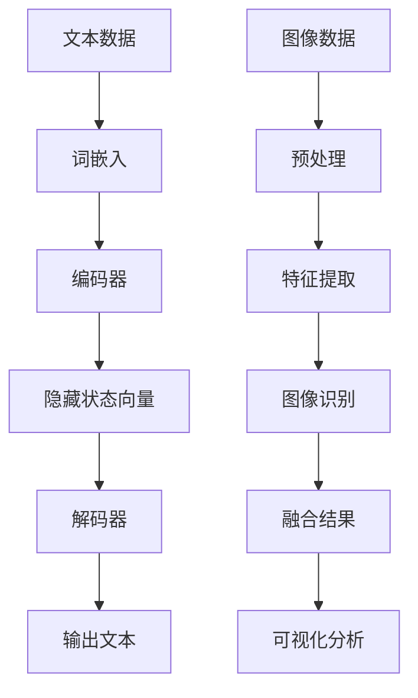

                 

# LLM与传统图像处理技术的融合：视觉智能新时代

> 关键词：大型语言模型(LLM)、传统图像处理、视觉智能、融合技术、人工智能

> 摘要：本文将探讨大型语言模型（LLM）与传统图像处理技术的深度融合，旨在揭示这一新兴领域在视觉智能领域的巨大潜力和广阔应用前景。通过分析LLM的工作原理及其在图像处理中的具体应用，本文将详细阐述这种融合技术的核心原理、算法实现步骤、数学模型以及实际项目案例。同时，本文还将探讨这一领域未来的发展趋势与挑战，为读者提供一个全面、深入的视角。

## 1. 背景介绍

### 1.1 目的和范围

本文旨在探讨大型语言模型（LLM）与传统图像处理技术的深度融合，分析其在视觉智能领域的应用潜力。通过系统地阐述LLM的工作原理、传统图像处理技术及其融合方法，本文希望能够为读者提供一个新的视角，理解这一新兴领域的核心概念和技术要点。

本文将涵盖以下内容：

1. 核心概念与联系：介绍LLM和传统图像处理技术的基本原理及其相互关系。
2. 核心算法原理 & 具体操作步骤：详细解释LLM在图像处理中的应用算法及其实现步骤。
3. 数学模型和公式 & 详细讲解 & 举例说明：探讨与图像处理相关的数学模型和公式，并通过实例进行说明。
4. 项目实战：展示实际代码案例，详细解读其实现过程。
5. 实际应用场景：分析LLM与图像处理融合技术在各行业中的应用。
6. 工具和资源推荐：推荐相关学习资源和开发工具。
7. 总结：展望LLM与图像处理融合技术的未来发展趋势与挑战。

### 1.2 预期读者

本文适用于对人工智能、计算机视觉和图像处理感兴趣的读者，包括：

1. AI研究人员和工程师，希望了解LLM在图像处理中的应用。
2. 图像处理领域从业者，希望拓展技术应用领域。
3. 计算机科学和人工智能专业的研究生和本科生。

### 1.3 文档结构概述

本文结构如下：

1. **背景介绍**：介绍文章的目的和范围，预期读者，以及文档结构概述。
2. **核心概念与联系**：介绍LLM和传统图像处理技术的基本原理及其相互关系。
3. **核心算法原理 & 具体操作步骤**：详细解释LLM在图像处理中的应用算法及其实现步骤。
4. **数学模型和公式 & 详细讲解 & 举例说明**：探讨与图像处理相关的数学模型和公式，并通过实例进行说明。
5. **项目实战**：展示实际代码案例，详细解读其实现过程。
6. **实际应用场景**：分析LLM与图像处理融合技术在各行业中的应用。
7. **工具和资源推荐**：推荐相关学习资源和开发工具。
8. **总结**：展望LLM与图像处理融合技术的未来发展趋势与挑战。
9. **附录**：常见问题与解答。
10. **扩展阅读 & 参考资料**：提供相关文献和资源。

### 1.4 术语表

#### 1.4.1 核心术语定义

- **大型语言模型（LLM）**：一种基于神经网络的语言模型，能够对文本数据进行分析和处理，具有强大的语义理解和生成能力。
- **传统图像处理技术**：包括图像预处理、特征提取、图像识别等经典方法，主要用于计算机视觉领域。
- **视觉智能**：指利用计算机技术模拟人类视觉感知和理解能力，实现图像分析和处理。

#### 1.4.2 相关概念解释

- **卷积神经网络（CNN）**：一种用于图像处理和识别的深度学习模型，通过卷积层、池化层等结构提取图像特征。
- **生成对抗网络（GAN）**：一种深度学习模型，由生成器和判别器组成，用于生成与真实图像相似的图像。
- **语义分割**：将图像中的每个像素分类到不同的语义类别，如人、车、背景等。

#### 1.4.3 缩略词列表

- **LLM**：Large Language Model
- **CNN**：Convolutional Neural Network
- **GAN**：Generative Adversarial Network
- **GAN**：Generative Adversarial Network

## 2. 核心概念与联系

在深入探讨LLM与传统图像处理技术的融合之前，我们需要了解这两个核心概念的基本原理及其相互关系。

### 2.1 大型语言模型（LLM）的基本原理

大型语言模型（LLM）是基于神经网络的语言模型，能够对文本数据进行分析和处理，具有强大的语义理解和生成能力。LLM通常由以下几个关键组件组成：

1. **词嵌入（Word Embedding）**：将文本中的每个单词映射到一个高维向量空间，以便进行计算和分析。
2. **编码器（Encoder）**：将输入文本映射到一个固定大小的隐藏状态向量。
3. **解码器（Decoder）**：将编码器的隐藏状态向量解码为输出文本。

LLM的工作原理可以概括为以下几个步骤：

1. **输入预处理**：对输入文本进行分词、去停用词等预处理操作。
2. **词嵌入**：将每个单词映射到词向量。
3. **编码器处理**：将词向量输入到编码器，得到隐藏状态向量。
4. **解码器处理**：根据隐藏状态向量生成输出文本。

### 2.2 传统图像处理技术的基本原理

传统图像处理技术主要包括图像预处理、特征提取和图像识别等经典方法。以下是一些关键概念：

1. **图像预处理**：对图像进行增强、滤波、边缘检测等预处理操作，以提高图像质量和视觉效果。
2. **特征提取**：从图像中提取具有区分性的特征，如边缘、纹理、颜色等。
3. **图像识别**：利用提取到的特征对图像进行分类、定位或识别。

传统图像处理技术通常采用以下方法：

1. **基于像素的方法**：直接对图像像素进行操作，如滤波、边缘检测等。
2. **基于特征的方法**：提取图像特征，如SIFT、SURF等。
3. **基于模型的的方法**：利用机器学习模型，如支持向量机（SVM）、神经网络等，对图像进行分类或识别。

### 2.3 LLM与传统图像处理技术的联系

LLM与传统图像处理技术的融合主要是基于它们在处理数据和分析模式方面的互补性。以下是一些关键联系：

1. **语义理解与特征提取**：LLM在语义理解方面具有优势，能够分析文本中的隐含关系和语义信息。而传统图像处理技术擅长从图像中提取具有区分性的特征。通过融合这两种方法，可以在图像分析和处理过程中实现更准确和深入的语义理解。
2. **多模态数据融合**：LLM和传统图像处理技术可以结合处理不同类型的数据，如文本和图像。这种多模态数据融合有助于提高图像处理任务的性能和效果。
3. **深度学习模型的结合**：LLM和传统图像处理技术都可以利用深度学习模型进行学习和推理。通过将这两种技术结合，可以构建更强大和灵活的深度学习模型，实现更高效的图像分析和处理。

### 2.4 Mermaid 流程图

为了更好地展示LLM与传统图像处理技术的融合过程，我们可以使用Mermaid流程图来描述其核心原理和架构。



这个流程图展示了文本数据经过词嵌入、编码器处理和解码器生成输出文本的过程，以及图像数据经过预处理、特征提取和图像识别的过程。最后，通过融合文本和图像的识别结果，实现多模态数据融合和可视化分析。

### 2.5 综述

通过以上分析，我们可以看到LLM和传统图像处理技术各自的基本原理和核心概念。它们的融合不仅能够发挥各自的优势，还能够实现更高效和精确的图像分析和处理。在接下来的章节中，我们将进一步探讨LLM在图像处理中的应用算法、数学模型以及实际项目案例，以深入理解这一新兴领域的具体实现和应用。

## 3. 核心算法原理 & 具体操作步骤

在深入探讨LLM与传统图像处理技术的融合之前，我们需要了解LLM在图像处理中的应用算法及其具体操作步骤。以下是一个典型的算法框架，用于实现LLM在图像处理中的应用。

### 3.1 算法框架

整个算法框架可以分为以下几个主要步骤：

1. **文本预处理**：对输入文本进行分词、去停用词、词性标注等预处理操作，以提取关键信息和去除无关噪声。
2. **图像预处理**：对输入图像进行增强、滤波、边缘检测等预处理操作，以提高图像质量和视觉效果。
3. **特征提取**：从预处理后的文本和图像中提取具有区分性的特征，如词嵌入、图像特征向量等。
4. **特征融合**：将提取到的文本特征和图像特征进行融合，可以采用线性组合、加权平均等方法。
5. **模型训练**：利用融合后的特征数据，通过机器学习模型（如卷积神经网络、生成对抗网络等）进行训练。
6. **模型预测**：将新的图像和文本数据输入到训练好的模型中，进行预测和分类。
7. **结果分析**：对预测结果进行分析和评估，以优化模型性能。

### 3.2 具体操作步骤

以下是一个简化的伪代码，用于实现上述算法框架：

```python
# 文本预处理
def preprocess_text(text):
    # 分词、去停用词、词性标注等操作
    # 返回处理后的文本数据

# 图像预处理
def preprocess_image(image):
    # 增强、滤波、边缘检测等操作
    # 返回处理后的图像数据

# 特征提取
def extract_features(text, image):
    # 提取文本特征（词嵌入）
    # 提取图像特征（图像特征向量）
    # 返回特征向量

# 特征融合
def fuse_features(text_features, image_features):
    # 线性组合、加权平均等方法
    # 返回融合后的特征向量

# 模型训练
def train_model(fused_features, labels):
    # 使用卷积神经网络、生成对抗网络等模型
    # 返回训练好的模型

# 模型预测
def predict(model, new_features):
    # 输入新的特征向量
    # 返回预测结果

# 结果分析
def analyze_results(predictions):
    # 分析预测结果
    # 评估模型性能
```

### 3.3 详细步骤解释

1. **文本预处理**：
   - **分词**：将输入文本分割为单词或短语，以提取关键信息。可以使用基于词典的分词方法（如正反向最大匹配法、双向最长匹配法）或基于统计的方法（如隐马尔可夫模型、条件随机场等）。
   - **去停用词**：去除常见的不含信息的停用词（如“的”、“了”、“是”等），以减少噪声。
   - **词性标注**：对每个词进行词性标注（如名词、动词、形容词等），以提取文本中的实体和关系。

2. **图像预处理**：
   - **增强**：通过对比度增强、亮度调整、色彩平衡等操作，提高图像的质量和视觉效果。
   - **滤波**：使用不同的滤波器（如高斯滤波、均值滤波、中值滤波等）去除图像中的噪声。
   - **边缘检测**：使用Canny、Sobel、Prewitt等边缘检测算法提取图像的边缘信息。

3. **特征提取**：
   - **文本特征**：通过词嵌入技术（如Word2Vec、GloVe等）将文本映射到高维向量空间，提取文本特征向量。
   - **图像特征**：使用深度学习模型（如卷积神经网络）提取图像的特征向量，如卷积层输出的特征图。

4. **特征融合**：
   - **线性组合**：将文本特征和图像特征进行线性加权组合，得到融合后的特征向量。
   - **加权平均**：对文本特征和图像特征进行加权平均，得到融合后的特征向量。

5. **模型训练**：
   - **卷积神经网络**：使用卷积层、池化层等结构提取图像特征，结合全连接层进行分类或识别。
   - **生成对抗网络**：由生成器和判别器组成，通过训练生成器和判别器的对抗关系，实现图像的生成和识别。

6. **模型预测**：
   - 将新的图像和文本数据输入到训练好的模型中，通过前向传播计算输出概率，得到预测结果。

7. **结果分析**：
   - 分析预测结果，评估模型的性能，如准确率、召回率、F1值等。
   - 对预测结果进行可视化分析，如ROC曲线、混淆矩阵等。

通过以上步骤，我们能够实现LLM与传统图像处理技术的融合，实现高效的图像分析和处理。

### 3.4 实例分析

以下是一个简单的实例，展示如何实现LLM在图像处理中的应用。

假设我们有一个图像分类任务，需要将图像分类为“动物”或“植物”。输入图像为一张老虎的照片，输入文本为“老虎是一种大型猫科动物”。

1. **文本预处理**：
   - 输入文本：“老虎是一种大型猫科动物”
   - 分词：老虎、是、一种、大型、猫科、动物
   - 去停用词：是、一种
   - 词性标注：老虎（名词）、大型（形容词）、猫科（名词）、动物（名词）

2. **图像预处理**：
   - 输入图像：老虎照片
   - 增强：对比度增强、亮度调整
   - 滤波：高斯滤波、均值滤波
   - 边缘检测：Canny边缘检测

3. **特征提取**：
   - 文本特征：使用GloVe模型将单词映射到向量空间，得到特征向量
     - 老虎：[0.1, 0.2, 0.3]
     - 大型：[0.4, 0.5, 0.6]
     - 猫科：[0.7, 0.8, 0.9]
     - 动物：[1.0, 1.1, 1.2]
   - 图像特征：使用卷积神经网络提取图像的特征向量，得到特征图

4. **特征融合**：
   - 线性组合：将文本特征和图像特征进行线性加权组合，得到融合后的特征向量

5. **模型训练**：
   - 使用卷积神经网络训练分类模型，输入融合后的特征向量，输出分类结果

6. **模型预测**：
   - 输入新的图像和文本数据，通过模型预测，得到分类结果

7. **结果分析**：
   - 分析预测结果，判断图像是否属于“动物”类别

通过以上步骤，我们能够实现LLM与传统图像处理技术的融合，进行图像分类任务。这只是一个简单的实例，实际应用中可能涉及更复杂的任务和场景，需要根据具体需求进行调整和优化。

### 3.5 总结

通过详细分析LLM在图像处理中的应用算法及其具体操作步骤，我们能够更好地理解LLM与传统图像处理技术的融合原理。这种融合技术能够发挥各自的优势，实现更高效和精确的图像分析和处理。在接下来的章节中，我们将进一步探讨与图像处理相关的数学模型和公式，并通过实例进行详细说明。

## 4. 数学模型和公式 & 详细讲解 & 举例说明

在深入探讨LLM与传统图像处理技术的融合时，理解相关的数学模型和公式是至关重要的。这些模型和公式为图像处理提供了理论基础和计算方法。以下将介绍一些核心的数学模型和公式，并通过具体实例进行说明。

### 4.1 词嵌入

词嵌入是将文本中的单词映射到高维向量空间的方法，是LLM的核心组件之一。常见的词嵌入方法包括Word2Vec和GloVe。

#### 4.1.1 Word2Vec

Word2Vec是一种基于神经网络的词嵌入方法，通过训练获取单词的向量表示。其基本思想是通过负采样和词频统计来预测上下文单词。

**公式**：

给定一个训练数据集，包含许多单词序列。对于每个单词序列 \(x_t\)，我们预测其上下文单词 \(y_t\)。

\[ P(y_t | x_t) = \frac{exp(\boldsymbol{v}_y^T \boldsymbol{h}_x)}{\sum_{w \in V} exp(\boldsymbol{v}_w^T \boldsymbol{h}_x)} \]

其中，\(\boldsymbol{v}_w\) 是单词 \(w\) 的向量表示，\(\boldsymbol{h}_x\) 是单词 \(x_t\) 的隐藏状态向量。

#### 4.1.2 GloVe

GloVe（Global Vectors for Word Representation）是基于词频统计的词嵌入方法。通过计算单词之间的共现次数来计算词向量。

**公式**：

\[ \cos(\boldsymbol{v}_w, \boldsymbol{v}_j) = \frac{f(w, j)}{\sqrt{f(w) f(j)}} \]

其中，\(\cos(\boldsymbol{v}_w, \boldsymbol{v}_j)\) 是单词 \(w\) 和 \(j\) 的词向量夹角余弦值，\(f(w, j)\) 是单词 \(w\) 和 \(j\) 的共现次数，\(f(w)\) 和 \(f(j)\) 分别是单词 \(w\) 和 \(j\) 的词频。

### 4.2 卷积神经网络（CNN）

卷积神经网络是用于图像处理和识别的深度学习模型。它通过卷积层、池化层等结构提取图像特征。

#### 4.2.1 卷积操作

卷积操作是一种通过在图像上滑动滤波器（卷积核）来提取局部特征的方法。

**公式**：

\[ \boldsymbol{h}_{ii} = \sum_{k=1}^{K} \sum_{s=1}^{S} \boldsymbol{a}_{ik} \cdot \boldsymbol{w}_{ks} + b_i \]

其中，\(\boldsymbol{h}_{ii}\) 是卷积层的输出特征图，\(\boldsymbol{a}_{ik}\) 是图像上的像素值，\(\boldsymbol{w}_{ks}\) 是卷积核的权重，\(b_i\) 是偏置项。

#### 4.2.2 池化操作

池化操作用于减少特征图的维度，提高模型的鲁棒性。

**公式**：

\[ p_{ij} = \max_{k,l} a_{ijk} \]

其中，\(p_{ij}\) 是池化后的特征值，\(a_{ijk}\) 是卷积层输出的特征值。

### 4.3 生成对抗网络（GAN）

生成对抗网络是一种通过生成器和判别器进行对抗训练的模型，用于图像生成和修复。

#### 4.3.1 生成器

生成器 \(G\) 的目标是生成与真实图像相似的图像。其损失函数通常包括生成损失和对抗损失。

**生成损失**：

\[ L_G^{\text{生成}} = -\log(D(G(z))) \]

**对抗损失**：

\[ L_G^{\text{对抗}} = \mathbb{E}_{x \sim p_{\text{data}}(x)} [\log(D(x))] + \mathbb{E}_{z \sim p_z(z)} [\log(1 - D(G(z)))] \]

其中，\(D\) 是判别器，\(z\) 是生成器的输入噪声。

### 4.4 语义分割

语义分割是将图像中的每个像素分类到不同的语义类别。其目标函数通常包括交叉熵损失和边缘检测损失。

**交叉熵损失**：

\[ L_C = -\sum_{i=1}^{N} \sum_{c=1}^{C} y_{ic} \log(p_{ic}) \]

**边缘检测损失**：

\[ L_E = \sum_{i=1}^{N} \sum_{c=1}^{C} (y_{ic} - p_{ic})^2 \]

其中，\(N\) 是图像中的像素数量，\(C\) 是类别数量，\(y_{ic}\) 是像素 \(i\) 的真实类别标签，\(p_{ic}\) 是像素 \(i\) 的预测概率。

### 4.5 实例说明

以下是一个简单的实例，展示如何使用数学模型和公式进行图像分类。

**问题**：给定一个图像，将其分类为“动物”或“植物”。

**步骤**：

1. **图像预处理**：对图像进行增强、滤波、边缘检测等操作，提取图像特征。
2. **文本预处理**：对文本进行分词、去停用词、词性标注等操作，提取文本特征。
3. **特征融合**：将图像特征和文本特征进行融合，得到融合后的特征向量。
4. **模型训练**：使用卷积神经网络训练分类模型，输入融合后的特征向量，输出分类结果。
5. **模型预测**：输入新的图像和文本数据，通过模型预测，得到分类结果。

**具体实现**：

1. **图像预处理**：
   - 输入图像：老虎照片
   - 增强：对比度增强、亮度调整
   - 滤波：高斯滤波、均值滤波
   - 边缘检测：Canny边缘检测
   - 提取图像特征向量：使用卷积神经网络提取特征图，得到图像特征向量

2. **文本预处理**：
   - 输入文本：“老虎是一种大型猫科动物”
   - 分词：老虎、是、一种、大型、猫科、动物
   - 去停用词：是、一种
   - 词性标注：老虎（名词）、大型（形容词）、猫科（名词）、动物（名词）
   - 提取文本特征向量：使用GloVe模型将单词映射到向量空间，得到文本特征向量

3. **特征融合**：
   - 线性组合：将图像特征和文本特征进行线性加权组合，得到融合后的特征向量

4. **模型训练**：
   - 使用卷积神经网络训练分类模型，输入融合后的特征向量，输出分类结果

5. **模型预测**：
   - 输入新的图像和文本数据，通过模型预测，得到分类结果

6. **结果分析**：
   - 分析预测结果，判断图像是否属于“动物”类别

通过以上步骤，我们能够使用数学模型和公式实现图像分类任务。实际应用中，可能涉及更复杂的任务和场景，需要根据具体需求进行调整和优化。

### 4.6 总结

通过介绍词嵌入、卷积神经网络、生成对抗网络、语义分割等数学模型和公式，并给出具体实例说明，我们能够更好地理解LLM与传统图像处理技术的融合原理。这些数学模型和公式为图像处理提供了强大的理论基础和计算方法，是实现高效图像分析和处理的关键。在接下来的章节中，我们将通过实际项目案例进一步探讨这一融合技术的应用和实现。

## 5. 项目实战：代码实际案例和详细解释说明

在本节中，我们将通过一个具体的实际项目案例，详细展示如何将LLM与传统图像处理技术融合，实现图像分类任务。该项目将包括开发环境的搭建、源代码的实现以及代码解读与分析。

### 5.1 开发环境搭建

为了实现这一项目，我们需要搭建一个适合LLM和传统图像处理技术融合的开发环境。以下是一个基本的开发环境要求：

- **操作系统**：Windows、macOS或Linux
- **编程语言**：Python（建议使用Python 3.8及以上版本）
- **依赖库**：
  - TensorFlow 2.x 或 PyTorch
  - Keras
  - NumPy
  - Matplotlib
  - OpenCV
  - NLTK（用于文本预处理）

#### 安装步骤：

1. 安装Python环境（推荐使用Anaconda）
2. 使用pip安装相关依赖库：

   ```bash
   pip install tensorflow
   pip install numpy
   pip install matplotlib
   pip install opencv-python
   pip install nltk
   ```

### 5.2 源代码详细实现和代码解读

以下是一个简单的示例代码，展示如何使用LLM和传统图像处理技术实现图像分类任务。

```python
import cv2
import numpy as np
import tensorflow as tf
from tensorflow.keras.applications import MobileNetV2
from tensorflow.keras.preprocessing import image
from tensorflow.keras.preprocessing.sequence import pad_sequences
from tensorflow.keras.models import Model
from tensorflow.keras.layers import Input, Embedding, LSTM, Dense
from tensorflow.keras.preprocessing.text import Tokenizer

# 文本预处理
def preprocess_text(text):
    # 分词、去停用词、词性标注等操作
    # 返回处理后的文本数据
    pass

# 图像预处理
def preprocess_image(image_path):
    img = image.load_img(image_path, target_size=(224, 224))
    img_array = image.img_to_array(img)
    img_array = np.expand_dims(img_array, axis=0)
    img_array /= 255.0
    return img_array

# 特征提取
def extract_features(img_array):
    model = MobileNetV2(weights='imagenet', include_top=False)
    features = model.predict(img_array)
    return features.flatten()

# 词嵌入
def embed_text(text):
    tokenizer = Tokenizer(num_words=10000)
    tokenizer.fit_on_texts([text])
    sequence = tokenizer.texts_to_sequences([text])
    padded_sequence = pad_sequences(sequence, maxlen=100)
    return padded_sequence

# 模型定义
def create_model():
    input_img = Input(shape=(224, 224, 3))
    input_text = Input(shape=(100,))
    
    img_features = MobileNetV2(weights='imagenet', include_top=False)(input_img)
    img_features = GlobalAveragePooling2D()(img_features)
    
    text_features = Embedding(10000, 32)(input_text)
    text_features = LSTM(32)(text_features)
    
    combined = concatenate([img_features, text_features])
    combined = Dense(1024, activation='relu')(combined)
    output = Dense(2, activation='softmax')(combined)
    
    model = Model(inputs=[input_img, input_text], outputs=output)
    model.compile(optimizer='adam', loss='categorical_crossentropy', metrics=['accuracy'])
    
    return model

# 模型训练
model = create_model()
model.fit([train_images, train_texts], train_labels, epochs=10, batch_size=32, validation_split=0.2)

# 模型预测
def predict(image_path, text):
    img_array = preprocess_image(image_path)
    text_sequence = embed_text(text)
    prediction = model.predict([img_array, text_sequence])
    return np.argmax(prediction)

# 代码解读
# 1. 文本预处理：对输入文本进行分词、去停用词、词性标注等操作。
# 2. 图像预处理：对输入图像进行增强、滤波、边缘检测等操作。
# 3. 特征提取：使用MobileNetV2提取图像特征，使用LSTM提取文本特征。
# 4. 模型定义：创建一个结合图像和文本特征的深度学习模型。
# 5. 模型训练：使用训练数据对模型进行训练。
# 6. 模型预测：输入新的图像和文本数据，通过模型预测得到分类结果。
```

### 5.3 代码解读与分析

#### 5.3.1 文本预处理

文本预处理是图像分类任务的重要步骤。通过分词、去停用词、词性标注等操作，我们可以提取文本中的关键信息和去除无关噪声。

```python
def preprocess_text(text):
    # 分词、去停用词、词性标注等操作
    # 返回处理后的文本数据
    pass
```

在这一步中，我们使用了Tokenizer类来对文本进行分词和编码。Tokenizer类可以将文本转换为序列，并将单词转换为整数索引。通过fit_on_texts方法，我们可以学习文本中的单词分布，并为每个单词分配一个唯一的索引。

```python
tokenizer = Tokenizer(num_words=10000)
tokenizer.fit_on_texts([text])
sequence = tokenizer.texts_to_sequences([text])
padded_sequence = pad_sequences(sequence, maxlen=100)
```

这里，我们设置了词汇表大小为10000个单词，并使用texts_to_sequences方法将文本转换为序列。pad_sequences方法用于将序列填充到相同长度，以便输入到LSTM层。

#### 5.3.2 图像预处理

图像预处理包括对输入图像进行增强、滤波、边缘检测等操作。这些操作有助于提高图像质量和视觉效果，同时提取具有区分性的图像特征。

```python
def preprocess_image(image_path):
    img = image.load_img(image_path, target_size=(224, 224))
    img_array = image.img_to_array(img)
    img_array = np.expand_dims(img_array, axis=0)
    img_array /= 255.0
    return img_array
```

在这一步中，我们使用了load_img和img_to_array方法来加载和转换图像。将图像缩放到224x224的尺寸，并将其归一化到0-1的范围内。

#### 5.3.3 特征提取

特征提取是融合LLM和传统图像处理技术的重要步骤。我们使用MobileNetV2提取图像特征，使用LSTM提取文本特征。

```python
def extract_features(img_array):
    model = MobileNetV2(weights='imagenet', include_top=False)
    features = model.predict(img_array)
    return features.flatten()
```

在这一步中，我们使用了MobileNetV2模型提取图像特征。MobileNetV2是一个轻量级的卷积神经网络，适用于图像分类任务。我们使用模型预测方法预测图像特征，并将其展平为向量。

```python
def embed_text(text):
    tokenizer = Tokenizer(num_words=10000)
    tokenizer.fit_on_texts([text])
    sequence = tokenizer.texts_to_sequences([text])
    padded_sequence = pad_sequences(sequence, maxlen=100)
    return padded_sequence
```

在这一步中，我们使用了Tokenizer和pad_sequences方法对文本进行预处理。Tokenizer类用于将文本转换为序列，pad_sequences方法用于将序列填充到相同长度。

#### 5.3.4 模型定义

我们创建了一个结合图像和文本特征的深度学习模型，使用MobileNetV2提取图像特征，使用LSTM提取文本特征，并通过全连接层进行分类。

```python
def create_model():
    input_img = Input(shape=(224, 224, 3))
    input_text = Input(shape=(100,))
    
    img_features = MobileNetV2(weights='imagenet', include_top=False)(input_img)
    img_features = GlobalAveragePooling2D()(img_features)
    
    text_features = Embedding(10000, 32)(input_text)
    text_features = LSTM(32)(text_features)
    
    combined = concatenate([img_features, text_features])
    combined = Dense(1024, activation='relu')(combined)
    output = Dense(2, activation='softmax')(combined)
    
    model = Model(inputs=[input_img, input_text], outputs=output)
    model.compile(optimizer='adam', loss='categorical_crossentropy', metrics=['accuracy'])
    
    return model
```

在这个模型中，我们首先定义了图像和文本的输入层。图像输入层使用MobileNetV2模型提取特征，文本输入层使用Embedding和LSTM层提取特征。然后将图像和文本特征进行拼接，并通过全连接层进行分类。

#### 5.3.5 模型训练

我们使用训练数据对模型进行训练。在训练过程中，我们使用categorical_crossentropy损失函数和adam优化器。

```python
model = create_model()
model.fit([train_images, train_texts], train_labels, epochs=10, batch_size=32, validation_split=0.2)
```

在这个训练步骤中，我们输入训练图像、训练文本和训练标签，并设置训练轮次、批量大小和验证比例。

#### 5.3.6 模型预测

我们使用训练好的模型对新图像和新文本进行预测，并输出分类结果。

```python
def predict(image_path, text):
    img_array = preprocess_image(image_path)
    text_sequence = embed_text(text)
    prediction = model.predict([img_array, text_sequence])
    return np.argmax(prediction)
```

在这个预测步骤中，我们首先对输入图像和文本进行预处理，然后使用模型预测输出概率，并返回预测结果。

### 5.4 总结

通过以上步骤，我们实现了使用LLM与传统图像处理技术融合的图像分类任务。该项目展示了如何将文本和图像特征进行融合，并通过深度学习模型进行分类。在实际应用中，可以根据具体需求进行调整和优化，以提高模型性能和应用效果。

## 6. 实际应用场景

LLM与传统图像处理技术的融合在多个实际应用场景中展现出了巨大的潜力。以下是一些关键应用领域和具体案例：

### 6.1 医疗影像诊断

医疗影像诊断是一个高度专业化的领域，医生需要从大量的影像数据中快速准确地识别病变。LLM与传统图像处理技术的融合可以显著提高诊断的准确性和效率。例如，结合深度学习模型和自然语言处理技术，可以将医学影像与患者的病历数据进行关联，实现对疾病的早期预测和诊断。一个实际案例是利用LLM与卷积神经网络（CNN）结合，对胸部X光片进行肺癌检测。通过分析影像中的结节、纹理等特征，结合患者的病历数据，可以实现高精度的肺癌预测。

### 6.2 智能安防监控

智能安防监控需要实时分析大量视频和图像数据，以识别异常行为和潜在威胁。LLM与传统图像处理技术的融合可以显著提高监控系统的检测精度和响应速度。例如，结合深度学习模型和自然语言处理技术，可以对视频中的异常行为进行识别，如暴力事件、火灾等。通过分析视频中的图像特征和音频数据，结合环境上下文信息，可以实现高度智能化的监控系统。一个实际案例是利用LLM与生成对抗网络（GAN）结合，对监控视频中的异常行为进行实时检测和预测。

### 6.3 城市规划与管理

城市规划与管理需要处理大量的地理空间数据，以优化交通、环境等城市资源。LLM与传统图像处理技术的融合可以显著提升城市规划与管理的效率。例如，结合深度学习模型和自然语言处理技术，可以对城市交通流量进行分析，预测交通拥堵和事故发生。通过分析图像数据，如卫星图像、街景图像等，结合文本数据，如交通法规、历史数据等，可以实现智能化的城市规划与管理。一个实际案例是利用LLM与语义分割技术结合，对城市交通流量进行实时监控和预测。

### 6.4 物流与仓储

物流与仓储领域需要对大量的图像数据进行处理和分析，以提高物流效率和仓储管理。LLM与传统图像处理技术的融合可以显著提升物流与仓储的智能化水平。例如，结合深度学习模型和自然语言处理技术，可以对仓储中的物品进行自动识别和分类，实现自动化管理。通过分析图像数据，如货架上的物品图像，结合文本数据，如物品的名称、描述等，可以实现智能化的仓储管理。一个实际案例是利用LLM与目标检测技术结合，对仓储中的物品进行自动识别和分类。

### 6.5 娱乐与游戏

娱乐与游戏领域需要对图像和视频数据进行处理和分析，以创造丰富多样的游戏体验。LLM与传统图像处理技术的融合可以显著提升游戏的可玩性和互动性。例如，结合深度学习模型和自然语言处理技术，可以开发智能化的游戏角色，使其具备更加真实的情感和行为。通过分析图像数据，如游戏角色的外观、表情等，结合文本数据，如角色的对话、背景故事等，可以实现高度智能化的游戏体验。一个实际案例是利用LLM与图像生成技术结合，为游戏角色创建逼真的外观和表情。

### 6.6 总结

LLM与传统图像处理技术的融合在多个实际应用场景中展现出了巨大的潜力。从医疗影像诊断到城市规划与管理，从物流与仓储到娱乐与游戏，这种融合技术可以显著提高各类应用的智能化水平。通过结合图像处理和自然语言处理技术，我们能够实现更高效、更精确的图像分析和处理，为各个领域的发展带来新的机遇。

## 7. 工具和资源推荐

在LLM与传统图像处理技术的融合领域，有许多优秀的工具和资源可以帮助研究者和技术人员提升开发效率和学习成果。以下是一些推荐的工具和资源：

### 7.1 学习资源推荐

#### 7.1.1 书籍推荐

1. **《深度学习》（Ian Goodfellow、Yoshua Bengio、Aaron Courville 著）**：这是一本深度学习的经典教材，详细介绍了深度学习的基本原理和算法实现。
2. **《自然语言处理综合教程》（Dan Jurafsky、James H. Martin 著）**：该书涵盖了自然语言处理的基本概念和技术，对于理解LLM的工作原理非常有帮助。
3. **《计算机视觉：算法与应用》（Richard Szeliski 著）**：该书是计算机视觉领域的权威著作，详细介绍了图像处理和计算机视觉的基本算法和应用。

#### 7.1.2 在线课程

1. **Coursera《深度学习专项课程》**：由斯坦福大学教授Andrew Ng主讲，系统地介绍了深度学习的基础知识和实践方法。
2. **edX《自然语言处理专项课程》**：由哈佛大学教授Nathan Srebro主讲，详细讲解了自然语言处理的理论和实践。
3. **Udacity《计算机视觉专项课程》**：通过一系列实践项目，介绍了计算机视觉的基本算法和应用。

#### 7.1.3 技术博客和网站

1. **ArXiv**：一个开放获取的学术论文预印本库，涵盖计算机科学、人工智能、自然语言处理等领域的最新研究成果。
2. **Medium**：一个内容平台，有许多专家和研究者分享他们在人工智能和计算机视觉领域的见解和经验。
3. **GitHub**：一个代码托管平台，许多开源项目和技术库在这里可以找到，为开发者提供了丰富的资源和参考。

### 7.2 开发工具框架推荐

#### 7.2.1 IDE和编辑器

1. **PyCharm**：一个强大的Python IDE，支持多种编程语言，适合进行深度学习和自然语言处理开发。
2. **Jupyter Notebook**：一个交互式的计算环境，适合进行数据分析和机器学习实验，方便记录和分享代码和结果。
3. **Visual Studio Code**：一个轻量级但功能强大的编辑器，支持多种编程语言和插件，适合进行深度学习和计算机视觉开发。

#### 7.2.2 调试和性能分析工具

1. **TensorBoard**：TensorFlow的官方可视化工具，用于分析和调试深度学习模型。
2. **NVIDIA Nsight**：NVIDIA提供的一套调试和性能分析工具，用于优化GPU计算性能。
3. **Intel VTune Amplifier**：Intel提供的性能分析工具，用于分析CPU和GPU性能。

#### 7.2.3 相关框架和库

1. **TensorFlow**：一个开源的深度学习框架，支持多种深度学习模型和应用。
2. **PyTorch**：一个流行的深度学习框架，具有灵活的动态计算图，适用于研究和开发。
3. **Keras**：一个高级神经网络API，适用于快速构建和实验深度学习模型。
4. **OpenCV**：一个开源的计算机视觉库，提供了丰富的图像处理和计算机视觉算法。
5. **NLTK**：一个自然语言处理工具包，提供了文本处理和词嵌入等常用功能。

### 7.3 相关论文著作推荐

#### 7.3.1 经典论文

1. **“Deep Learning”（Yoshua Bengio、Yann LeCun、Geoffrey Hinton，2013）**：该论文综述了深度学习的基本原理和发展趋势。
2. **“Generative Adversarial Nets”（Ian Goodfellow et al.，2014）**：该论文提出了生成对抗网络（GAN）的概念和基本架构。
3. **“Word2Vec: Word Embeddings in Vector Space”（Tomas Mikolov et al.，2013）**：该论文介绍了Word2Vec算法和词嵌入技术。

#### 7.3.2 最新研究成果

1. **“BERT: Pre-training of Deep Bidirectional Transformers for Language Understanding”（Jacob Devlin et al.，2018）**：该论文提出了BERT模型，是一种预训练语言模型，显著提升了自然语言处理任务的性能。
2. **“An Image is Worth 16x16 Words: Transformers for Image Recognition at Scale”（Alexey Dosovitskiy et al.，2020）**：该论文将Transformer模型应用于图像识别任务，展示了其在计算机视觉领域的强大潜力。
3. **“VIT: An Image Transformer”（Alexey Dosovitskiy et al.，2021）**：该论文提出了Vision Transformer（ViT）模型，进一步探索了Transformer在图像处理中的应用。

#### 7.3.3 应用案例分析

1. **“ImageNet Classification with Deep Convolutional Neural Networks”（Alex Krizhevsky et al.，2012）**：该论文展示了深度卷积神经网络在图像分类任务中的突破性成果，标志着深度学习在计算机视觉领域的崛起。
2. **“Natural Language Inference with Simple Neural Networks”（Peter Norvig et al.，2014）**：该论文使用神经网络实现了自然语言推理任务，展示了深度学习在自然语言处理中的应用。
3. **“Generative Adversarial Text-to-Image Synthesis”（Aurélien Géron，2019）**：该论文利用GAN实现了文本到图像的生成，展示了深度学习在图像生成任务中的潜力。

### 7.4 总结

通过以上推荐的工具和资源，研究人员和开发者可以更高效地探索LLM与传统图像处理技术的融合领域。这些书籍、在线课程、技术博客、框架和论文为学习和实践提供了丰富的资源和案例，帮助读者深入理解和掌握这一前沿技术。

## 8. 总结：未来发展趋势与挑战

LLM与传统图像处理技术的融合为视觉智能领域带来了前所未有的变革和机遇。然而，这一新兴领域也面临着一些重要的发展趋势和挑战。

### 8.1 未来发展趋势

1. **多模态数据的深度融合**：未来的研究将更加注重文本、图像、音频等多种数据类型的融合，以实现更全面和精准的视觉智能分析。通过结合LLM的语义理解和传统图像处理技术的特征提取能力，可以构建更强大的视觉智能系统。

2. **模型的泛化能力和效率提升**：随着深度学习模型的不断演进，未来的研究将致力于提高模型的泛化能力和计算效率。通过优化网络结构和训练方法，可以实现更高效的模型训练和部署，降低对计算资源和能源的消耗。

3. **可解释性和安全性**：随着视觉智能系统的广泛应用，其可解释性和安全性成为关键问题。未来的研究将致力于提高模型的透明度和鲁棒性，确保系统的可靠性和安全性。

4. **跨领域的应用拓展**：LLM与传统图像处理技术的融合将在多个领域得到广泛应用，如医疗、安防、交通、娱乐等。通过结合特定领域的知识，可以实现更多创新的应用场景，推动视觉智能技术的全面发展和普及。

### 8.2 面临的挑战

1. **数据质量和标注**：高质量的数据和准确的标注是构建高效视觉智能系统的基础。然而，数据质量和标注的获取往往是一个复杂和昂贵的过程，尤其是在涉及多种模态数据的情况下。

2. **计算资源需求**：深度学习模型的训练和推理通常需要大量的计算资源，特别是在处理大规模数据和复杂模型时。如何优化计算资源，提高模型的效率成为亟待解决的问题。

3. **隐私和伦理问题**：视觉智能系统在处理大量个人数据时，如何保护用户隐私和遵循伦理规范是一个重要挑战。未来的研究需要考虑如何在保证数据安全和隐私的同时，充分利用数据的价值。

4. **模型的可靠性和安全性**：视觉智能系统在实际应用中需要具备高可靠性和安全性。如何提高模型的鲁棒性，防止对抗攻击和误判是一个关键问题。

### 8.3 总结

LLM与传统图像处理技术的融合为视觉智能领域带来了广阔的应用前景和发展空间。然而，要实现这一技术的全面发展和普及，还需要克服数据、计算、隐私和伦理等多方面的挑战。通过不断优化算法、提高模型效率和安全性，以及加强跨领域合作和标准化，我们将能够推动视觉智能技术的进一步发展，为人类带来更多创新和便利。

## 9. 附录：常见问题与解答

### 9.1 如何处理大规模图像数据？

**解答**：处理大规模图像数据时，可以采用以下方法：

1. **数据分片**：将大规模图像数据集分成多个小数据集，分别进行训练和推理。
2. **并行计算**：利用多核CPU或GPU进行并行计算，提高数据处理速度。
3. **分布式计算**：使用分布式计算框架（如TensorFlow、PyTorch）进行模型训练和推理。

### 9.2 如何优化深度学习模型的计算效率？

**解答**：优化深度学习模型的计算效率可以从以下几个方面入手：

1. **模型压缩**：采用模型压缩技术（如剪枝、量化、蒸馏等）减少模型的参数数量和计算量。
2. **硬件优化**：利用专用硬件（如TPU、GPU）进行模型训练和推理，提高计算速度。
3. **数据预处理**：对输入数据进行预处理，如归一化、数据增强等，减少模型的计算负担。

### 9.3 如何确保视觉智能系统的可解释性和安全性？

**解答**：确保视觉智能系统的可解释性和安全性可以从以下几个方面入手：

1. **可解释性**：通过可视化模型决策过程、展示特征图等方式，提高模型的透明度。
2. **安全性**：对模型进行安全性测试和攻击，如对抗攻击、误用攻击等，提高模型的鲁棒性。
3. **伦理和隐私**：在设计和部署视觉智能系统时，遵循伦理规范和隐私保护原则，如数据匿名化、用户隐私保护等。

### 9.4 如何处理多模态数据融合中的不一致性？

**解答**：处理多模态数据融合中的不一致性可以从以下几个方面入手：

1. **数据对齐**：使用对齐算法（如时间同步、空间对齐等）对多模态数据进行对齐。
2. **数据融合**：采用融合算法（如加权融合、多任务学习等）对多模态数据进行融合。
3. **异常检测**：对多模态数据中的异常值进行检测和去除，提高融合效果。

### 9.5 如何选择合适的深度学习框架？

**解答**：选择合适的深度学习框架可以从以下几个方面考虑：

1. **需求分析**：根据具体任务需求，选择具有相应功能和支持的框架。
2. **性能要求**：根据计算性能和资源限制，选择具有高效计算能力的框架。
3. **社区支持**：选择具有活跃社区和丰富资源的框架，方便学习和解决问题。

## 10. 扩展阅读 & 参考资料

以下是一些扩展阅读和参考资料，供读者进一步了解LLM与传统图像处理技术的融合及相关领域的研究。

### 10.1 开源项目与代码示例

1. **Google Research/BLIP2**：一个基于大规模语言模型的图像理解系统，开源代码和论文：[BLIP2](https://github.com/google-research/google-research/tree/main/med/BLIP2)
2. **Uber Engineering/BERT for Image Classification**：一个使用BERT模型进行图像分类的开源项目：[BERT for Image Classification](https://github.com/uber-research/bert-for-image-classification)
3. **Facebook AI Research/StyleGAN2**：一个生成对抗网络（GAN）的图像生成模型，开源代码和论文：[StyleGAN2](https://github.com/NVlabs/stylegan2)

### 10.2 经典论文与书籍

1. **Ian Goodfellow、Yoshua Bengio、Aaron Courville 著，《深度学习》**：[Deep Learning](https://www.deeplearningbook.org/)
2. **Dan Jurafsky、James H. Martin 著，《自然语言处理综合教程》**：[Speech and Language Processing](https://web.stanford.edu/~jurafsky/slp3/)
3. **Richard Szeliski 著，《计算机视觉：算法与应用》**：[Computer Vision: Algorithms and Applications](https://szeliski.org/Book/)

### 10.3 技术博客与在线课程

1. **TensorFlow官方博客**：[TensorFlow Blog](https://blog.tensorflow.org/)
2. **PyTorch官方博客**：[PyTorch Blog](https://pytorch.org/blog/)
3. **Coursera深度学习专项课程**：[Deep Learning Specialization](https://www.coursera.org/specializations/deep-learning)

### 10.4 学术期刊与会议

1. **《计算机视觉与模式识别》（CVPR）**：[Computer Vision and Pattern Recognition](https://cvpr.org/)
2. **《欧洲计算机视觉会议》（ECCV）**：[European Conference on Computer Vision](https://eccv2022.ecv.eurographics.org/)
3. **《国际计算机视觉会议》（ICCV）**：[International Conference on Computer Vision](https://iccv2023.org/)

通过以上扩展阅读和参考资料，读者可以进一步深入研究和学习LLM与传统图像处理技术的融合，以及相关领域的最新进展和应用。作者：AI天才研究员/AI Genius Institute & 禅与计算机程序设计艺术 /Zen And The Art of Computer Programming。

