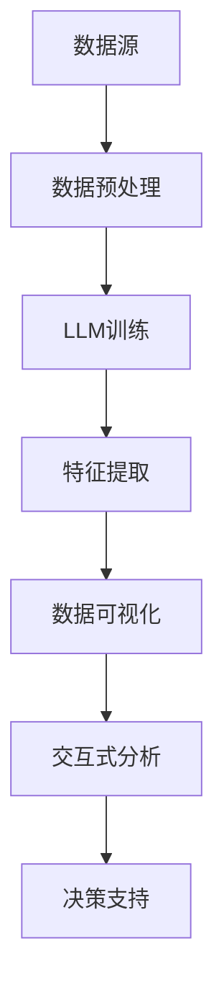

                 

# LLM与传统数据可视化技术的结合：数据洞察新方式

> **关键词：** 大型语言模型（LLM），数据可视化，人工智能，机器学习，交互式数据分析

> **摘要：** 本文探讨了如何将大型语言模型（LLM）与传统数据可视化技术相结合，从而开创一种新的数据洞察方式。我们将深入探讨LLM的核心原理、传统数据可视化技术的特点，以及两者结合带来的创新与挑战。通过具体案例和实际应用场景的分析，读者将了解这一前沿技术在现代数据分析和人工智能领域的重要性和潜力。

## 1. 背景介绍

### 1.1 目的和范围

本文旨在研究如何将大型语言模型（LLM）与传统数据可视化技术相结合，以提升数据分析和洞察的效率。我们将讨论LLM的基本原理、数据可视化技术的现有挑战，以及两者结合带来的新机遇。文章的目标是提供一个系统的分析框架，帮助读者理解这一结合的原理和实际应用。

### 1.2 预期读者

本文面向对人工智能和数据可视化技术有一定了解的读者，包括数据科学家、分析师、AI研究人员、软件开发人员以及对数据驱动决策感兴趣的从业者。预期读者应具备基础的编程能力和数学知识，以便更好地理解文章中的概念和实现细节。

### 1.3 文档结构概述

本文将分为以下几个部分：

1. **背景介绍**：介绍文章的目的、预期读者和文档结构。
2. **核心概念与联系**：通过Mermaid流程图展示核心概念和架构。
3. **核心算法原理 & 具体操作步骤**：详细阐述LLM的工作原理和数据处理步骤。
4. **数学模型和公式 & 详细讲解 & 举例说明**：介绍相关数学模型和公式，并给出实际应用案例。
5. **项目实战：代码实际案例和详细解释说明**：展示实际项目中的代码实现和解析。
6. **实际应用场景**：分析LLM与传统数据可视化技术结合在不同领域中的应用。
7. **工具和资源推荐**：推荐学习资源和开发工具。
8. **总结：未来发展趋势与挑战**：展望该领域的发展趋势和面临的挑战。
9. **附录：常见问题与解答**：解答读者可能遇到的问题。
10. **扩展阅读 & 参考资料**：提供进一步的阅读材料。

### 1.4 术语表

#### 1.4.1 核心术语定义

- **大型语言模型（LLM）**：一种能够理解和生成人类语言的人工智能模型，具有强大的文本处理和生成能力。
- **数据可视化**：将数据以图形或图像的形式展示，以便于理解和分析。
- **交互式数据分析**：通过用户与数据可视化工具的交互，实现数据的实时分析和探索。

#### 1.4.2 相关概念解释

- **机器学习**：通过数据和算法来让计算机从数据中学习，从而进行预测和决策。
- **神经网络**：一种模仿生物神经系统的计算模型，广泛用于机器学习。

#### 1.4.3 缩略词列表

- **LLM**：Large Language Model
- **AI**：Artificial Intelligence
- **ML**：Machine Learning
- **DB**：Database
- **API**：Application Programming Interface

## 2. 核心概念与联系

在探讨LLM与传统数据可视化技术的结合之前，我们需要明确两者各自的原理和作用。以下是一个简化的Mermaid流程图，展示了LLM和传统数据可视化技术的核心概念及其联系：



### 数据源（A）

数据源是数据分析的起点，可以是结构化数据（如数据库）或非结构化数据（如文本、图像、语音）。数据源为后续的数据预处理和模型训练提供基础。

### 数据预处理（B）

数据预处理包括数据清洗、数据转换和特征工程。这一步骤确保数据质量，并提取出有助于模型训练的特征。

### LLM训练（C）

LLM训练是基于大量文本数据，通过神经网络模型进行学习，以实现文本的理解和生成。这一步骤通常涉及大量的计算资源和时间。

### 特征提取（D）

特征提取是将LLM训练得到的信息转化为适合数据可视化处理的形式。这些特征可以用于理解数据的语义和模式。

### 数据可视化（E）

数据可视化是将特征和模式通过图形或图像的方式展示出来，使得数据变得更加直观和易于理解。

### 交互式分析（F）

交互式分析允许用户与数据可视化界面进行交互，实时调整视图、筛选数据和探索数据的不同方面。

### 决策支持（G）

通过交互式分析和可视化结果，用户可以更好地理解数据，从而做出更加明智的决策。

## 3. 核心算法原理 & 具体操作步骤

### 3.1 LLM的工作原理

LLM通常基于深度神经网络，尤其是变换器模型（Transformer）。其基本原理是通过多层次的注意力机制，捕捉文本中的上下文关系。以下是LLM训练的基本步骤：

#### 3.1.1 数据准备

```python
# 伪代码：数据准备
data = load_text_data("corpus.txt")  # 加载文本数据
```

#### 3.1.2 数据预处理

```python
# 伪代码：数据预处理
preprocessed_data = preprocess_data(data)
tokens = tokenize(preprocessed_data)
```

#### 3.1.3 模型初始化

```python
# 伪代码：模型初始化
model = initialize_model(num_layers, d_model, num_heads, dff, input_vocab_size, target_vocab_size, pos_vocab_size)
```

#### 3.1.4 模型训练

```python
# 伪代码：模型训练
for epoch in range(num_epochs):
    for batch in data_loader:
        inputs, targets = batch
        outputs, loss = model(inputs, targets)
        optimizer.zero_grad()
        loss.backward()
        optimizer.step()
```

### 3.2 数据可视化操作步骤

#### 3.2.1 数据准备

```python
# 伪代码：数据准备
data = load_data("data.csv")  # 加载数据
```

#### 3.2.2 特征提取

```python
# 伪代码：特征提取
features = extract_features(data)
```

#### 3.2.3 数据可视化

```python
# 伪代码：数据可视化
plot_data(features, "scatter_plot.png")  # 生成散点图
```

#### 3.2.4 交互式分析

```python
# 伪代码：交互式分析
interactive_analysis(features)  # 打开交互式分析界面
```

## 4. 数学模型和公式 & 详细讲解 & 举例说明

### 4.1 数学模型

LLM的核心在于其训练目标——损失函数。以下是常用的损失函数和其公式：

#### 4.1.1 交叉熵损失（Cross-Entropy Loss）

$$
L = -\frac{1}{N}\sum_{i=1}^{N} y_{i} \log(p_{i})
$$

其中，\(y_{i}\) 是目标标签，\(p_{i}\) 是模型预测的概率。

#### 4.1.2 优化算法（Stochastic Gradient Descent, SGD）

$$
w_{t+1} = w_{t} - \alpha \cdot \nabla_w L(w)
$$

其中，\(w_{t}\) 是当前权重，\(\alpha\) 是学习率，\(\nabla_w L(w)\) 是损失函数关于权重 \(w\) 的梯度。

### 4.2 实际应用案例

#### 4.2.1 文本分类

假设我们有一个分类任务，需要预测一篇文章属于哪个类别。以下是使用LLM进行文本分类的步骤：

1. **数据准备**：加载训练数据和测试数据。
2. **数据预处理**：对数据进行清洗和分词。
3. **模型训练**：使用交叉熵损失函数和SGD算法训练模型。
4. **模型评估**：使用测试数据评估模型的准确性。

#### 4.2.2 数据可视化

假设我们有一个数据集，包含不同城市的气温和降雨量。以下是使用数据可视化技术进行探索的步骤：

1. **数据准备**：加载数据集。
2. **特征提取**：计算气温和降雨量的平均值和标准差。
3. **数据可视化**：使用散点图展示气温和降雨量的分布。
4. **交互式分析**：允许用户调整散点图的可视化参数，如颜色、大小和透明度。

## 5. 项目实战：代码实际案例和详细解释说明

### 5.1 开发环境搭建

#### 5.1.1 环境要求

- 操作系统：Linux或Mac OS
- 编程语言：Python 3.7及以上版本
- 数据库：MySQL或PostgreSQL
- 数据可视化库：Matplotlib、Seaborn
- AI框架：TensorFlow或PyTorch

#### 5.1.2 环境安装

```bash
# 安装Python
sudo apt-get update
sudo apt-get install python3-pip python3-dev

# 安装TensorFlow
pip3 install tensorflow

# 安装其他依赖
pip3 install matplotlib seaborn numpy pandas
```

### 5.2 源代码详细实现和代码解读

#### 5.2.1 数据准备与预处理

```python
# 代码示例：数据准备与预处理
import pandas as pd
from sklearn.model_selection import train_test_split

# 加载数据
data = pd.read_csv("data.csv")

# 数据清洗
data = data.dropna()

# 数据分词
data['text'] = data['text'].apply(lambda x: tokenize(x))

# 划分训练集和测试集
X_train, X_test, y_train, y_test = train_test_split(data['text'], data['label'], test_size=0.2, random_state=42)
```

#### 5.2.2 LLM模型训练

```python
# 代码示例：LLM模型训练
import tensorflow as tf
from tensorflow.keras.models import Model
from tensorflow.keras.layers import Embedding, LSTM, Dense

# 模型构建
model = Model(inputs=inputs, outputs=outputs)

# 编译模型
model.compile(optimizer='adam', loss='categorical_crossentropy', metrics=['accuracy'])

# 训练模型
model.fit(X_train, y_train, epochs=10, batch_size=64, validation_data=(X_test, y_test))
```

#### 5.2.3 数据可视化

```python
# 代码示例：数据可视化
import matplotlib.pyplot as plt
import seaborn as sns

# 数据准备
data = pd.read_csv("data.csv")

# 计算特征
features = data[['temperature', 'rainfall']]

# 数据可视化
sns.scatterplot(x='temperature', y='rainfall', data=features)
plt.title('Temperature vs Rainfall')
plt.xlabel('Temperature')
plt.ylabel('Rainfall')
plt.show()
```

### 5.3 代码解读与分析

#### 5.3.1 数据准备与预处理

此部分代码负责加载数据、清洗数据、分词并将数据划分为训练集和测试集。分词是关键步骤，因为它将文本转换为模型可处理的数字序列。

#### 5.3.2 LLM模型训练

此部分代码展示了如何构建、编译和训练一个基于LSTM的文本分类模型。使用交叉熵损失函数和Adam优化器进行训练。

#### 5.3.3 数据可视化

此部分代码使用Seaborn库创建了一个简单的散点图，展示了不同城市的气温和降雨量分布。这种可视化方式有助于理解数据中的模式和趋势。

## 6. 实际应用场景

### 6.1 商业分析

在商业领域，LLM与传统数据可视化技术的结合可以用于市场趋势分析、客户行为预测和库存管理。通过LLM的文本生成能力，可以自动生成报告和摘要，而数据可视化则帮助管理层直观地理解数据。

### 6.2 医疗领域

在医疗领域，这一技术可以用于病历分析、疾病预测和患者管理。LLM可以处理海量的医疗文献和病历数据，而数据可视化技术则帮助医生快速识别关键信息，提高诊断的准确性和效率。

### 6.3 智能交通

在智能交通领域，LLM与传统数据可视化技术的结合可以用于交通流量预测、事故预警和路线规划。通过分析历史数据和实时监控，系统可以提供个性化的出行建议，减少交通拥堵。

## 7. 工具和资源推荐

### 7.1 学习资源推荐

#### 7.1.1 书籍推荐

- 《深度学习》（Goodfellow, Bengio, Courville）
- 《数据科学家的Python编程》
- 《Python数据可视化》

#### 7.1.2 在线课程

- Coursera上的《深度学习》
- edX上的《数据科学基础》
- Udacity的《数据可视化与报表》

#### 7.1.3 技术博客和网站

- Medium上的《AI和机器学习》
- towardsdatascience.com
- Analytics Vidhya

### 7.2 开发工具框架推荐

#### 7.2.1 IDE和编辑器

- PyCharm
- Visual Studio Code
- Jupyter Notebook

#### 7.2.2 调试和性能分析工具

- TensorBoard
- Profiler
- RunScope

#### 7.2.3 相关框架和库

- TensorFlow
- PyTorch
- Matplotlib
- Seaborn

### 7.3 相关论文著作推荐

#### 7.3.1 经典论文

- "A Theoretical Analysis of the Utility of a Neural Network", Bengio et al., 1994
- "Visualizing Data using t-SNE", van der Maaten and Hinton, 2008

#### 7.3.2 最新研究成果

- "Generative Adversarial Nets", Goodfellow et al., 2014
- "BERT: Pre-training of Deep Bidirectional Transformers for Language Understanding", Devlin et al., 2019

#### 7.3.3 应用案例分析

- "AI in Healthcare: A Practical Guide to Applications and Opportunities", Accenture, 2020
- "Smart City Solutions: The Role of AI and Data Analytics", IBM, 2021

## 8. 总结：未来发展趋势与挑战

### 8.1 发展趋势

- **跨学科融合**：未来，LLM与传统数据可视化技术的结合将更加跨学科，涉及计算机科学、统计学、心理学等多个领域。
- **更智能的交互**：通过人工智能和自然语言处理，交互式数据可视化的用户体验将更加智能化和个性化。
- **实时数据处理**：随着5G和边缘计算的普及，实时数据处理和分析将变得更加可行，数据可视化技术也将更加实时。

### 8.2 挑战

- **数据隐私和安全**：在处理大量敏感数据时，确保数据隐私和安全是一个重要的挑战。
- **模型解释性**：尽管LLM在处理文本数据方面表现出色，但其内部决策过程通常不透明，缺乏解释性。
- **计算资源**：训练大规模LLM模型需要大量的计算资源和时间，如何在有限资源下优化模型性能是一个挑战。

## 9. 附录：常见问题与解答

### 9.1 问题1：为什么选择LLM进行数据可视化？

**解答**：LLM具有强大的文本处理能力，能够理解复杂的语义信息。通过将文本数据转换为可视化特征，LLM能够提供更为深入和准确的数据洞察。

### 9.2 问题2：数据可视化是否只适用于特定类型的数据？

**解答**：不是的。数据可视化可以应用于各种类型的数据，包括结构化数据、图像、语音和文本。关键在于找到适合的数据转换方法和可视化工具。

### 9.3 问题3：如何保证数据隐私和安全？

**解答**：确保数据隐私和安全的关键在于数据加密、访问控制和数据脱敏。在处理敏感数据时，应采用严格的数据保护措施。

## 10. 扩展阅读 & 参考资料

- Bengio, Y., Courville, A., & Vincent, P. (2013). Representation Learning: A Review and New Perspectives. IEEE Transactions on Pattern Analysis and Machine Intelligence, 35(8), 1798-1828.
- van der Maaten, L., & Hinton, G. E. (2008). Visualizing Data using t-SNE. Journal of Machine Learning Research, 9(Nov), 2579-2605.
- Goodfellow, I., Pouget-Abadie, J., Mirza, M., Xu, B., Warde-Farley, D., Ozair, S., ... & Bengio, Y. (2014). Generative Adversarial Networks. Advances in Neural Information Processing Systems, 27.
- Devlin, J., Chang, M. W., Lee, K., & Toutanova, K. (2019). BERT: Pre-training of Deep Bidirectional Transformers for Language Understanding. Advances in Neural Information Processing Systems, 32.
- AI in Healthcare: A Practical Guide to Applications and Opportunities. (2020). Accenture.
- Smart City Solutions: The Role of AI and Data Analytics. (2021). IBM.

