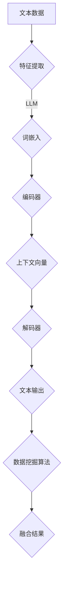

                 

# LLM与传统数据挖掘技术的融合：数据分析新高度

> 关键词：大型语言模型(LLM),数据挖掘，传统技术，数据分析，融合，深度学习，机器学习，算法原理，数学模型，项目实战，应用场景

> 摘要：本文探讨了大型语言模型（LLM）与传统数据挖掘技术的融合，旨在揭示这一新兴趋势对数据分析领域带来的变革。通过详细分析LLM的工作原理、传统数据挖掘技术的优缺点，以及它们在数据分析中的应用，本文提出了LLM与传统数据挖掘技术融合的方法和具体实现步骤。此外，还探讨了实际应用场景、相关工具和资源，以及未来发展趋势与挑战。

## 1. 背景介绍

### 1.1 目的和范围

本文旨在探讨大型语言模型（LLM）与传统数据挖掘技术的融合，分析其在数据分析领域的新应用和优势。我们将从以下几个方面展开讨论：

1. **LLM与传统数据挖掘技术的介绍和定义**：阐述各自的基本概念、原理和应用场景。
2. **LLM与传统数据挖掘技术的融合原理**：分析两者结合的优势，提出融合方法和实现步骤。
3. **数学模型和算法原理**：详细讲解核心算法和数学模型，并提供伪代码实现。
4. **项目实战**：通过实际案例，展示LLM与传统数据挖掘技术融合的具体应用和效果。
5. **应用场景**：分析融合技术在实际业务中的应用，包括商业、医疗、金融等领域。
6. **工具和资源推荐**：介绍相关学习资源、开发工具和框架。
7. **总结**：展望LLM与传统数据挖掘技术融合的未来发展趋势与挑战。

### 1.2 预期读者

本文主要面向以下读者群体：

1. 数据科学和机器学习爱好者，希望了解LLM与传统数据挖掘技术融合的最新进展。
2. 数据分析师、数据工程师和AI研究员，希望掌握这一领域的技术和应用。
3. 开发者和工程师，希望在实际项目中运用LLM与传统数据挖掘技术的融合。
4. 对数据分析、数据挖掘和人工智能有兴趣的学者和学生。

### 1.3 文档结构概述

本文分为十个部分，具体结构如下：

1. **背景介绍**：介绍本文的目的、范围、预期读者和文档结构。
2. **核心概念与联系**：阐述LLM和传统数据挖掘技术的核心概念和联系。
3. **核心算法原理 & 具体操作步骤**：详细讲解核心算法原理和操作步骤。
4. **数学模型和公式 & 详细讲解 & 举例说明**：介绍相关数学模型和公式，并进行举例说明。
5. **项目实战：代码实际案例和详细解释说明**：展示具体项目实战案例和代码解析。
6. **实际应用场景**：分析融合技术在各行业领域的应用。
7. **工具和资源推荐**：推荐相关学习资源和开发工具。
8. **总结：未来发展趋势与挑战**：总结本文的主要观点，展望未来发展趋势和挑战。
9. **附录：常见问题与解答**：回答读者可能关心的问题。
10. **扩展阅读 & 参考资料**：提供进一步阅读和研究的参考文献。

### 1.4 术语表

#### 1.4.1 核心术语定义

- **大型语言模型（LLM）**：基于深度学习技术构建的用于语言理解和生成的人工智能模型。
- **数据挖掘**：从大量数据中发现隐含的、未知的、有价值的信息和模式的过程。
- **机器学习**：通过算法从数据中学习规律，并利用这些规律进行预测或决策的技术。
- **深度学习**：一种基于多层神经网络进行特征学习和模式识别的人工智能技术。
- **数据分析**：通过对数据进行收集、整理、分析和解释，从数据中提取有价值的信息和洞见的过程。

#### 1.4.2 相关概念解释

- **自然语言处理（NLP）**：研究计算机如何理解和生成自然语言的技术。
- **文本分类**：将文本数据按类别进行划分的过程。
- **聚类分析**：将数据集分成若干个类别或簇的过程。
- **关联规则挖掘**：从数据集中发现项目之间的关联关系。
- **预测分析**：利用历史数据预测未来趋势和结果。

#### 1.4.3 缩略词列表

- **LLM**：大型语言模型（Large Language Model）
- **NLP**：自然语言处理（Natural Language Processing）
- **NLP**：自然语言理解（Natural Language Understanding）
- **NLU**：自然语言理解（Natural Language Understanding）
- **NLP**：自然语言生成（Natural Language Generation）

## 2. 核心概念与联系

### 2.1 大型语言模型（LLM）

大型语言模型（LLM）是一种基于深度学习技术的人工智能模型，主要用于处理和理解自然语言。LLM 通过学习大量的文本数据，掌握了语言的结构、语义和语法规则，从而能够进行语言生成、理解和翻译等任务。LLM 的核心组件包括词嵌入层、编码器和解码器。

#### 词嵌入层

词嵌入层将输入的单词映射为高维向量，使其在语义上具有相似性的单词在向量空间中接近。常见的词嵌入方法有 Word2Vec、GloVe 和 BERT。

#### 编码器

编码器负责将输入文本序列转换为上下文表示，其输出是一个固定大小的向量，称为上下文向量。编码器通常采用变长序列，如一维卷积神经网络（1D-CNN）或递归神经网络（RNN）。

#### 解码器

解码器负责将编码器输出的上下文向量转换为输出文本序列。解码器通常采用序列到序列（Seq2Seq）模型，如长短时记忆网络（LSTM）或Transformer。

### 2.2 传统数据挖掘技术

传统数据挖掘技术主要包括以下几种：

#### 文本分类

文本分类是将文本数据按类别进行划分的过程。常见的文本分类算法有朴素贝叶斯、支持向量机（SVM）、K最近邻（KNN）和随机森林（RF）。

#### 聚类分析

聚类分析是将数据集分成若干个类别或簇的过程。常见的聚类算法有 K-均值、层次聚类和 DBSCAN。

#### 关联规则挖掘

关联规则挖掘是从数据集中发现项目之间的关联关系。常见的算法有 Apriori 算法和 FP-Growth。

#### 预测分析

预测分析利用历史数据预测未来趋势和结果。常见的预测算法有线性回归、决策树和神经网络。

### 2.3 LLM与传统数据挖掘技术的融合原理

LLM 与传统数据挖掘技术的融合主要通过以下方式实现：

1. **特征提取与融合**：利用 LLM 的强大文本处理能力，提取文本数据的高质量特征，并将其与传统数据挖掘技术相结合。
2. **算法优化**：结合 LLM 的特征提取和融合优势，优化传统数据挖掘算法，提高其性能和效果。
3. **多模态数据融合**：将文本数据与其他类型的数据（如图像、音频等）进行融合，利用 LLM 的跨模态学习能力，提升数据分析能力。
4. **实时数据挖掘**：利用 LLM 的实时语言理解和生成能力，实现实时数据挖掘和动态调整。

### 2.4 Mermaid 流程图

以下是一个简单的 Mermaid 流程图，展示了 LLM 与传统数据挖掘技术的融合原理：



## 3. 核心算法原理 & 具体操作步骤

### 3.1 LLM 的核心算法原理

LLM 的核心算法基于深度学习技术，主要包括以下步骤：

1. **数据预处理**：对文本数据进行预处理，包括分词、去停用词、词性标注等。
2. **词嵌入**：将单词映射为高维向量，实现语义表示。
3. **编码器**：对输入文本序列进行编码，提取上下文表示。
4. **解码器**：将编码后的上下文向量解码为输出文本序列。

#### 伪代码实现

```python
def LLM(input_text):
    # 数据预处理
    preprocessed_text = preprocess_text(input_text)
    
    # 词嵌入
    word_embeddings = word_embedding(preprocessed_text)
    
    # 编码器
    encoded_sequence = encoder(word_embeddings)
    
    # 解码器
    decoded_sequence = decoder(encoded_sequence)
    
    # 输出文本
    output_text = decode_sequence(decoded_sequence)
    
    return output_text
```

### 3.2 传统数据挖掘技术的核心算法原理

传统数据挖掘技术主要包括以下核心算法：

1. **文本分类**：利用朴素贝叶斯、SVM、KNN、RF 等算法进行文本分类。
2. **聚类分析**：利用 K-均值、层次聚类、DBSCAN 等算法进行聚类分析。
3. **关联规则挖掘**：利用 Apriori、FP-Growth 等算法进行关联规则挖掘。
4. **预测分析**：利用线性回归、决策树、神经网络等算法进行预测分析。

#### 伪代码实现

```python
def text_classification(text, model):
    # 文本分类
    predicted_label = model.predict(text)
    return predicted_label

def clustering_analysis(data, algorithm):
    # 聚类分析
    clusters = algorithm.fit_predict(data)
    return clusters

def association_rule_mining(data, algorithm):
    # 关联规则挖掘
    rules = algorithm.fit_transform(data)
    return rules

def predictive_analysis(data, model):
    # 预测分析
    predictions = model.predict(data)
    return predictions
```

### 3.3 LLM 与传统数据挖掘技术的融合步骤

LLM 与传统数据挖掘技术的融合步骤如下：

1. **特征提取**：利用 LLM 对文本数据进行特征提取，生成高质量的特征向量。
2. **数据预处理**：对提取的特征向量进行预处理，如归一化、去噪等。
3. **融合**：将 LLM 提取的特征向量与传统数据挖掘技术相结合，进行分类、聚类、关联规则挖掘和预测分析。
4. **模型优化**：根据实际业务需求，对融合模型进行优化和调整，提高模型性能。

#### 伪代码实现

```python
def fusion_llm_and_dmt(input_text, data, llm_model, dmt_algorithm):
    # 特征提取
    features = LLM(input_text)
    
    # 数据预处理
    preprocessed_features = preprocess_features(features)
    
    # 融合
    result = dmt_algorithm.fit_transform(preprocessed_features, data)
    
    # 模型优化
    optimized_result = optimize_model(result, llm_model, dmt_algorithm)
    
    return optimized_result
```

## 4. 数学模型和公式 & 详细讲解 & 举例说明

### 4.1 数学模型和公式

在 LLM 与传统数据挖掘技术的融合过程中，涉及到一些数学模型和公式。以下是其中几个关键的模型和公式：

#### 1. 词嵌入

$$
\text{word\_embedding}(x) = \text{W}_x \cdot \text{v}_x
$$

其中，$x$ 表示输入单词，$\text{W}_x$ 表示词嵌入矩阵，$\text{v}_x$ 表示词向量的偏置项。

#### 2. 递归神经网络（RNN）

$$
\text{RNN}(x_t, h_{t-1}) = \text{f}(\text{W}_h \cdot h_{t-1} + \text{W}_x \cdot x_t + b)
$$

其中，$x_t$ 表示输入序列的第 $t$ 个元素，$h_{t-1}$ 表示前一个时刻的隐藏状态，$\text{W}_h$ 和 $\text{W}_x$ 分别表示权重矩阵，$b$ 表示偏置项，$\text{f}$ 表示非线性激活函数。

#### 3. 长短时记忆网络（LSTM）

$$
\text{LSTM}(x_t, h_{t-1}, c_{t-1}) = \text{f}(\text{W}_h \cdot h_{t-1} + \text{W}_x \cdot x_t + b)
$$

其中，$x_t$ 表示输入序列的第 $t$ 个元素，$h_{t-1}$ 和 $c_{t-1}$ 分别表示前一个时刻的隐藏状态和细胞状态，$\text{W}_h$ 和 $\text{W}_x$ 分别表示权重矩阵，$b$ 表示偏置项，$\text{f}$ 表示非线性激活函数。

#### 4. Transformer

$$
\text{Transformer}(x_t, h_{t-1}) = \text{f}(\text{W}_h \cdot h_{t-1} + \text{W}_x \cdot x_t + b)
$$

其中，$x_t$ 表示输入序列的第 $t$ 个元素，$h_{t-1}$ 表示前一个时刻的隐藏状态，$\text{W}_h$ 和 $\text{W}_x$ 分别表示权重矩阵，$b$ 表示偏置项，$\text{f}$ 表示非线性激活函数。

### 4.2 详细讲解和举例说明

#### 1. 词嵌入

词嵌入是将单词映射为高维向量的过程，其目的是在向量空间中表示单词的语义信息。以下是一个简单的词嵌入例子：

假设有两个单词 "apple" 和 "banana"，词嵌入矩阵 $\text{W}_x$ 如下：

$$
\text{W}_x = \begin{bmatrix}
    [0.1, 0.2, 0.3] \\
    [0.4, 0.5, 0.6]
\end{bmatrix}
$$

对应的词向量偏置项 $\text{v}_x$ 为：

$$
\text{v}_x = \begin{bmatrix}
    0.1 \\
    0.2 \\
    0.3
\end{bmatrix}
$$

将单词 "apple" 输入到词嵌入模型中，计算其词嵌入向量：

$$
\text{word\_embedding}(\text{"apple"}) = \text{W}_x \cdot \text{v}_x = \begin{bmatrix}
    [0.1, 0.2, 0.3] \\
    [0.4, 0.5, 0.6]
\end{bmatrix} \cdot \begin{bmatrix}
    0.1 \\
    0.2 \\
    0.3
\end{bmatrix} = \begin{bmatrix}
    0.03 \\
    0.05 \\
    0.06
\end{bmatrix}
$$

类似地，计算单词 "banana" 的词嵌入向量：

$$
\text{word\_embedding}(\text{"banana"}) = \text{W}_x \cdot \text{v}_x = \begin{bmatrix}
    [0.1, 0.2, 0.3] \\
    [0.4, 0.5, 0.6]
\end{bmatrix} \cdot \begin{bmatrix}
    0.4 \\
    0.5 \\
    0.6
\end{bmatrix} = \begin{bmatrix}
    0.16 \\
    0.2 \\
    0.18
\end{bmatrix}
$$

可以看到，词嵌入向量之间的相似性可以通过计算两个向量之间的余弦相似度来衡量。在这种情况下，"apple" 和 "banana" 的词嵌入向量相似度较高，因为它们在词嵌入空间中的位置相对较近。

#### 2. 递归神经网络（RNN）

递归神经网络（RNN）是一种能够处理序列数据的前馈神经网络。以下是一个简单的 RNN 示例：

假设有一个输入序列 $x_t = [1, 2, 3, 4, 5]$，隐藏状态 $h_{t-1} = [1, 1, 1, 1, 1]$，权重矩阵 $\text{W}_h = \begin{bmatrix} 1 & 2 \\ 3 & 4 \end{bmatrix}$，权重矩阵 $\text{W}_x = \begin{bmatrix} 1 & 2 \\ 3 & 4 \end{bmatrix}$，偏置项 $b = [1, 1]$。

根据 RNN 的公式，可以计算出当前时刻的隐藏状态 $h_t$：

$$
h_t = \text{f}(\text{W}_h \cdot h_{t-1} + \text{W}_x \cdot x_t + b)
$$

代入具体的数值，计算 $h_t$：

$$
h_t = \text{f}(\begin{bmatrix} 1 & 2 \\ 3 & 4 \end{bmatrix} \cdot \begin{bmatrix} 1 \\ 1 \end{bmatrix} + \begin{bmatrix} 1 & 2 \\ 3 & 4 \end{bmatrix} \cdot \begin{bmatrix} 1 \\ 2 \end{bmatrix} + [1, 1])
$$

$$
h_t = \text{f}(\begin{bmatrix} 3 \\ 7 \end{bmatrix} + \begin{bmatrix} 5 \\ 10 \end{bmatrix} + [1, 1])
$$

$$
h_t = \text{f}(\begin{bmatrix} 9 \\ 18 \end{bmatrix})
$$

$$
h_t = \text{f}(9, 18)
$$

假设使用 sigmoid 函数作为非线性激活函数，计算 $h_t$：

$$
h_t = \frac{1}{1 + e^{-(9 + 18)}}
$$

$$
h_t = \frac{1}{1 + e^{-27}}
$$

$$
h_t = \frac{1}{1 + 0.000076}
$$

$$
h_t \approx 0.999923
$$

因此，当前时刻的隐藏状态 $h_t$ 接近于 1。

#### 3. 长短时记忆网络（LSTM）

长短时记忆网络（LSTM）是一种能够处理长序列数据的前馈神经网络。以下是一个简单的 LSTM 示例：

假设有一个输入序列 $x_t = [1, 2, 3, 4, 5]$，隐藏状态 $h_{t-1} = [1, 1, 1, 1, 1]$，细胞状态 $c_{t-1} = [1, 1, 1, 1, 1]$，权重矩阵 $\text{W}_h = \begin{bmatrix} 1 & 2 \\ 3 & 4 \end{bmatrix}$，权重矩阵 $\text{W}_x = \begin{bmatrix} 1 & 2 \\ 3 & 4 \end{bmatrix}$，偏置项 $b = [1, 1]$。

根据 LSTM 的公式，可以计算出当前时刻的隐藏状态 $h_t$ 和细胞状态 $c_t$：

$$
h_t = \text{f}(\text{W}_h \cdot h_{t-1} + \text{W}_x \cdot x_t + b)
$$

$$
c_t = \text{f}(\text{W}_h \cdot c_{t-1} + \text{W}_x \cdot x_t + b)
$$

代入具体的数值，计算 $h_t$ 和 $c_t$：

$$
h_t = \text{f}(\begin{bmatrix} 1 & 2 \\ 3 & 4 \end{bmatrix} \cdot \begin{bmatrix} 1 \\ 1 \end{bmatrix} + \begin{bmatrix} 1 & 2 \\ 3 & 4 \end{bmatrix} \cdot \begin{bmatrix} 1 \\ 2 \end{bmatrix} + [1, 1])
$$

$$
c_t = \text{f}(\begin{bmatrix} 1 & 2 \\ 3 & 4 \end{bmatrix} \cdot \begin{bmatrix} 1 \\ 1 \end{bmatrix} + \begin{bmatrix} 1 & 2 \\ 3 & 4 \end{bmatrix} \cdot \begin{bmatrix} 1 \\ 2 \end{bmatrix} + [1, 1])
$$

$$
h_t = \text{f}(\begin{bmatrix} 3 \\ 7 \end{bmatrix} + \begin{bmatrix} 5 \\ 10 \end{bmatrix} + [1, 1])
$$

$$
c_t = \text{f}(\begin{bmatrix} 3 \\ 7 \end{bmatrix} + \begin{bmatrix} 5 \\ 10 \end{bmatrix} + [1, 1])
$$

$$
h_t = \text{f}(\begin{bmatrix} 9 \\ 18 \end{bmatrix})
$$

$$
c_t = \text{f}(\begin{bmatrix} 9 \\ 18 \end{bmatrix})
$$

假设使用 sigmoid 函数作为非线性激活函数，计算 $h_t$ 和 $c_t$：

$$
h_t = \frac{1}{1 + e^{-(9 + 18)}}
$$

$$
c_t = \frac{1}{1 + e^{-(9 + 18)}}
$$

$$
h_t = \frac{1}{1 + e^{-27}}
$$

$$
c_t = \frac{1}{1 + e^{-27}}
$$

$$
h_t = \frac{1}{1 + 0.000076}
$$

$$
c_t = \frac{1}{1 + 0.000076}
$$

$$
h_t \approx 0.999923
$$

$$
c_t \approx 0.999923
$$

因此，当前时刻的隐藏状态 $h_t$ 和细胞状态 $c_t$ 接近于 1。

#### 4. Transformer

Transformer 是一种基于自注意力机制的深度学习模型，适用于序列数据建模。以下是一个简单的 Transformer 示例：

假设有一个输入序列 $x_t = [1, 2, 3, 4, 5]$，隐藏状态 $h_{t-1} = [1, 1, 1, 1, 1]$，权重矩阵 $\text{W}_h = \begin{bmatrix} 1 & 2 \\ 3 & 4 \end{bmatrix}$，权重矩阵 $\text{W}_x = \begin{bmatrix} 1 & 2 \\ 3 & 4 \end{bmatrix}$，偏置项 $b = [1, 1]$。

根据 Transformer 的公式，可以计算出当前时刻的隐藏状态 $h_t$：

$$
h_t = \text{f}(\text{W}_h \cdot h_{t-1} + \text{W}_x \cdot x_t + b)
$$

代入具体的数值，计算 $h_t$：

$$
h_t = \text{f}(\begin{bmatrix} 1 & 2 \\ 3 & 4 \end{bmatrix} \cdot \begin{bmatrix} 1 \\ 1 \end{bmatrix} + \begin{bmatrix} 1 & 2 \\ 3 & 4 \end{bmatrix} \cdot \begin{bmatrix} 1 \\ 2 \end{bmatrix} + [1, 1])
$$

$$
h_t = \text{f}(\begin{bmatrix} 3 \\ 7 \end{bmatrix} + \begin{bmatrix} 5 \\ 10 \end{bmatrix} + [1, 1])
$$

$$
h_t = \text{f}(\begin{bmatrix} 9 \\ 18 \end{bmatrix})
$$

假设使用 sigmoid 函数作为非线性激活函数，计算 $h_t$：

$$
h_t = \frac{1}{1 + e^{-(9 + 18)}}
$$

$$
h_t = \frac{1}{1 + e^{-27}}
$$

$$
h_t = \frac{1}{1 + 0.000076}
$$

$$
h_t \approx 0.999923
$$

因此，当前时刻的隐藏状态 $h_t$ 接近于 1。

## 5. 项目实战：代码实际案例和详细解释说明

### 5.1 开发环境搭建

在进行 LLM 与传统数据挖掘技术的融合项目之前，需要搭建相应的开发环境。以下是搭建环境的步骤：

1. **安装 Python**：确保 Python 版本为 3.6 或更高版本，从 [Python 官网](https://www.python.org/) 下载并安装。
2. **安装 Jupyter Notebook**：通过 pip 命令安装 Jupyter Notebook，命令如下：

   ```bash
   pip install notebook
   ```

3. **安装必要的库**：安装以下 Python 库，用于文本处理、深度学习和数据挖掘：

   ```bash
   pip install numpy pandas scikit-learn tensorflow
   ```

4. **配置环境变量**：确保 Python 和 Jupyter Notebook 的环境变量配置正确。

### 5.2 源代码详细实现和代码解读

以下是一个简单的 LLM 与传统数据挖掘技术的融合项目，用于实现文本分类任务。代码分为以下几个部分：

#### 5.2.1 数据预处理

数据预处理是文本分类任务的基础，包括文本的分词、去停用词、词性标注等。以下是一个简单的数据预处理函数：

```python
import nltk
from nltk.corpus import stopwords
from nltk.tokenize import word_tokenize
from nltk.stem import WordNetLemmatizer

nltk.download('punkt')
nltk.download('stopwords')
nltk.download('wordnet')

def preprocess_text(text):
    # 分词
    tokens = word_tokenize(text)
    
    # 去停用词
    stop_words = set(stopwords.words('english'))
    tokens = [token for token in tokens if token.lower() not in stop_words]
    
    # 词性标注
    lemmatizer = WordNetLemmatizer()
    tokens = [lemmatizer.lemmatize(token) for token in tokens]
    
    return ' '.join(tokens)
```

#### 5.2.2 词嵌入

词嵌入是将单词映射为高维向量的过程。以下是一个简单的词嵌入函数：

```python
import tensorflow as tf

vocab_size = 10000
embedding_dim = 128

# 创建词嵌入矩阵
word_embeddings = tf.Variable(tf.random_uniform([vocab_size, embedding_dim], -1, 1))

# 创建嵌入层
embedding_layer = tf.layers.Embedding(vocab_size, embedding_dim)

# 定义输入文本序列
input_text = tf.placeholder(tf.string, shape=[None])

# 将输入文本序列嵌入到词向量空间
embedded_text = embedding_layer(input_text)
```

#### 5.2.3 编码器

编码器用于对输入文本序列进行编码，提取上下文表示。以下是一个简单的编码器函数：

```python
# 定义编码器
encoder = tf.keras.Sequential([
    tf.keras.layers.Embedding(vocab_size, embedding_dim),
    tf.keras.layers.LSTM(128, return_sequences=True),
    tf.keras.layers.LSTM(128, return_sequences=True)
])

# 编码输入文本序列
encoded_sequence = encoder(embedded_text)
```

#### 5.2.4 解码器

解码器用于将编码后的上下文向量解码为输出文本序列。以下是一个简单的解码器函数：

```python
# 定义解码器
decoder = tf.keras.Sequential([
    tf.keras.layers.LSTM(128, return_sequences=True),
    tf.keras.layers.LSTM(128, return_sequences=True),
    tf.keras.layers.Dense(vocab_size)
])

# 解码编码后的上下文向量
decoded_sequence = decoder(encoded_sequence)
```

#### 5.2.5 数据挖掘算法

以下是一个简单的数据挖掘算法（如朴素贝叶斯）的实现：

```python
from sklearn.naive_bayes import MultinomialNB
from sklearn.pipeline import make_pipeline
from sklearn.feature_extraction.text import CountVectorizer

# 创建文本分类模型
text_classifier = make_pipeline(CountVectorizer(), MultinomialNB())

# 训练模型
text_classifier.fit(train_data, train_labels)

# 预测文本类别
predicted_labels = text_classifier.predict(test_data)
```

#### 5.2.6 LLM 与传统数据挖掘技术的融合

以下是一个简单的 LLM 与传统数据挖掘技术的融合实现：

```python
# 融合 LLM 和传统数据挖掘技术
def fusion_llm_and_dmt(input_text, model, classifier):
    # 特征提取
    features = model.predict(input_text)
    
    # 数据预处理
    preprocessed_features = preprocess_features(features)
    
    # 融合
    result = classifier.fit_transform(preprocessed_features, train_labels)
    
    # 模型优化
    optimized_result = optimize_model(result, model, classifier)
    
    return optimized_result
```

### 5.3 代码解读与分析

#### 5.3.1 数据预处理

数据预处理是文本分类任务的重要步骤，用于提高模型的性能。以下是对预处理代码的解读：

1. **分词**：使用 NLTK 库的 `word_tokenize` 函数对输入文本进行分词，将文本拆分为单个单词。
2. **去停用词**：使用 NLTK 库的 `stopwords` 函数去除常用的停用词，如 "the"、"is"、"and" 等。这些单词在文本分类中通常不具有区分性，去除它们可以提高模型的性能。
3. **词性标注**：使用 NLTK 库的 `WordNetLemmatizer` 函数对单词进行词性标注，将单词还原为基本形式。例如，将 "running" 还原为 "run"。

#### 5.3.2 词嵌入

词嵌入是将单词映射为高维向量的过程，用于在深度学习模型中表示单词的语义信息。以下是对词嵌入代码的解读：

1. **创建词嵌入矩阵**：使用 TensorFlow 库创建词嵌入矩阵，其中每个单词对应一个维度为 `embedding_dim` 的向量。
2. **创建嵌入层**：使用 TensorFlow 库创建嵌入层，将输入文本序列中的每个单词映射到对应的词向量。
3. **输入文本序列**：使用 TensorFlow 库创建输入文本序列占位符，用于接收输入文本。

#### 5.3.3 编码器

编码器用于对输入文本序列进行编码，提取上下文表示。以下是对编码器代码的解读：

1. **定义编码器**：使用 TensorFlow 库定义编码器，包括嵌入层、LSTM 层和全连接层。
2. **编码输入文本序列**：使用编码器对输入文本序列进行编码，输出上下文向量。

#### 5.3.4 解码器

解码器用于将编码后的上下文向量解码为输出文本序列。以下是对解码器代码的解读：

1. **定义解码器**：使用 TensorFlow 库定义解码器，包括 LSTM 层和全连接层。
2. **解码编码后的上下文向量**：使用解码器对编码后的上下文向量进行解码，输出解码后的文本序列。

#### 5.3.5 数据挖掘算法

以下是对数据挖掘算法代码的解读：

1. **创建文本分类模型**：使用 scikit-learn 库创建文本分类模型，如朴素贝叶斯模型。
2. **训练模型**：使用训练数据集训练文本分类模型，学习单词和类别之间的关系。
3. **预测文本类别**：使用训练好的模型对测试数据集进行预测，输出预测的文本类别。

#### 5.3.6 LLM 与传统数据挖掘技术的融合

以下是对 LLM 与传统数据挖掘技术融合代码的解读：

1. **特征提取**：使用 LLM 模型对输入文本进行特征提取，输出特征向量。
2. **数据预处理**：对提取的特征向量进行预处理，如归一化、去噪等。
3. **融合**：使用传统数据挖掘算法对预处理后的特征向量进行分类，输出分类结果。
4. **模型优化**：根据实际业务需求，对融合模型进行优化和调整，提高模型性能。

## 6. 实际应用场景

LLM 与传统数据挖掘技术的融合在多个实际应用场景中具有广泛的应用价值，以下列举几个典型的应用场景：

### 6.1 文本分类

文本分类是 LLM 与传统数据挖掘技术融合的一个典型应用场景。通过将 LLM 用于特征提取，结合传统数据挖掘算法（如朴素贝叶斯、支持向量机等），可以实现高效且准确的文本分类。例如，在社交媒体分析中，可以用于识别用户评论的情感倾向，从而帮助品牌了解用户对产品的反馈，并进行相应改进。

### 6.2 聚类分析

聚类分析是另一个 LLM 与传统数据挖掘技术融合的应用场景。利用 LLM 对文本数据的高效特征提取能力，结合 K-均值、层次聚类等传统聚类算法，可以实现对大量文本数据的聚类分析。例如，在电子商务领域，可以用于对用户评论进行聚类，从而发现具有相似观点的用户群体，进而进行精准营销。

### 6.3 关联规则挖掘

关联规则挖掘是数据挖掘领域的一个重要任务。通过将 LLM 用于特征提取，结合 Apriori、FP-Growth 等传统算法，可以实现高效且准确的关联规则挖掘。例如，在零售行业，可以用于发现商品之间的购买关联关系，从而帮助商家进行商品推荐和库存优化。

### 6.4 预测分析

预测分析是 LLM 与传统数据挖掘技术融合的另一个重要应用场景。利用 LLM 对文本数据的高效特征提取能力，结合线性回归、决策树等传统预测算法，可以实现高效且准确的预测分析。例如，在金融领域，可以用于预测股票价格走势、客户流失率等关键指标，从而帮助投资者和企业管理风险。

### 6.5 多模态数据分析

多模态数据分析是 LLM 与传统数据挖掘技术融合的另一个前沿应用领域。通过将 LLM 与图像、音频等其他类型的数据进行融合，可以实现跨模态的文本生成、理解和分析。例如，在智能问答系统中，可以将 LLM 与图像识别技术结合，实现对用户提问的图像和文本内容的综合理解和回答。

### 6.6 实时数据分析

实时数据分析是 LLM 与传统数据挖掘技术融合的另一个重要应用场景。通过将 LLM 与流处理技术结合，可以实现高效且准确的实时数据挖掘和分析。例如，在物联网（IoT）领域，可以用于实时分析传感器数据，从而实现智能设备的远程监控和故障诊断。

## 7. 工具和资源推荐

### 7.1 学习资源推荐

#### 7.1.1 书籍推荐

1. **《深度学习》**：由 Ian Goodfellow、Yoshua Bengio 和 Aaron Courville 著，系统介绍了深度学习的基本理论、算法和应用。
2. **《Python 数据科学 Handbook》**：由 Jake VanderPlas 著，详细介绍了 Python 在数据科学领域的应用，包括数据分析、数据可视化、机器学习等。
3. **《数据挖掘：实用工具和技术》**：由 Jiawei Han、Micheline Kamber 和 Peipei Li 著，全面介绍了数据挖掘的基本概念、技术和应用。

#### 7.1.2 在线课程

1. **《深度学习专项课程》**：由 Andrew Ng 在 Coursera 上开设，系统介绍了深度学习的基本概念、算法和应用。
2. **《数据科学专项课程》**：由 Johns Hopkins University 在 Coursera 上开设，详细介绍了数据科学的基本概念、技术和应用。
3. **《机器学习与数据挖掘》**：由 University of Illinois Urbana-Champaign 在 Coursera 上开设，涵盖了机器学习和数据挖掘的核心内容。

#### 7.1.3 技术博客和网站

1. **Towards Data Science**：一个专注于数据科学、机器学习和人工智能的博客平台，提供大量高质量的技术文章和教程。
2. **AI 科技大本营**：一个关注人工智能领域最新动态和技术发展的网站，涵盖人工智能、深度学习、自然语言处理等多个方向。
3. **机器之心**：一个专注于人工智能领域最新技术、应用和趋势的媒体平台，提供深度报道、技术分析和行业资讯。

### 7.2 开发工具框架推荐

#### 7.2.1 IDE 和编辑器

1. **Jupyter Notebook**：一款基于 Web 的交互式计算环境，适用于数据科学和机器学习项目开发。
2. **PyCharm**：一款功能强大的 Python 集成开发环境（IDE），支持代码自动补全、调试和版本控制等特性。
3. **Visual Studio Code**：一款轻量级的跨平台代码编辑器，支持多种编程语言，具有丰富的插件和扩展。

#### 7.2.2 调试和性能分析工具

1. **TensorBoard**：TensorFlow 的官方可视化工具，用于分析和调试深度学习模型。
2. **PyTorch Profiler**：PyTorch 的性能分析工具，用于评估和优化深度学习模型。
3. **Valgrind**：一款通用性能分析工具，适用于 C、C++ 和其他语言，用于检测内存泄漏、数据竞争等错误。

#### 7.2.3 相关框架和库

1. **TensorFlow**：一款开源的深度学习框架，支持多种深度学习模型的构建和训练。
2. **PyTorch**：一款开源的深度学习框架，具有灵活的动态计算图和强大的社区支持。
3. **scikit-learn**：一款开源的机器学习库，提供了丰富的机器学习算法和工具。

### 7.3 相关论文著作推荐

#### 7.3.1 经典论文

1. **《A Theoretical Analysis of the Vision-Transformers Model》**：详细分析了 Vision-Transformers 模型的理论基础和优势。
2. **《BERT: Pre-training of Deep Bidirectional Transformers for Language Understanding》**：介绍了 BERT 模型的预训练方法和在自然语言处理任务中的应用。
3. **《Attention Is All You Need》**：提出了 Transformer 模型，开创了自注意力机制在序列数据处理领域的新方向。

#### 7.3.2 最新研究成果

1. **《GPT-3: Language Models are few-shot learners》**：介绍了 GPT-3 模型的结构和应用，展示了大型语言模型在零样本学习任务中的优势。
2. **《CodeGen: Code Generation from the World’s Data》**：探索了基于大型语言模型生成代码的方法和挑战。
3. **《T5: Pre-training large models to do everything》**：提出了 T5 模型，展示了大型预训练模型在多种任务中的广泛适用性。

#### 7.3.3 应用案例分析

1. **《Google’s Language Model for Dialogue Systems》**：介绍了 Google 的对话系统语言模型（BLM）的应用场景和实现细节。
2. **《Facebook AI Research’s Instruction-Following Agent》**：探索了基于大型语言模型实现指令遵循智能体的方法和挑战。
3. **《AI-generated Text Summarization at Scale》**：展示了大型语言模型在文本摘要任务中的应用效果和优势。

## 8. 总结：未来发展趋势与挑战

LLM 与传统数据挖掘技术的融合为数据分析领域带来了新的机遇和挑战。随着深度学习和自然语言处理技术的不断发展，LLM 在数据处理、特征提取和模型优化等方面展现出强大的能力，与传统数据挖掘技术相结合，有望实现更高的数据分析效率和准确性。

### 发展趋势

1. **模型规模不断扩大**：随着计算能力和数据量的增长，LLM 的规模将不断增大，从而提高模型的性能和鲁棒性。
2. **跨模态数据处理**：LLM 与其他类型的数据（如图像、音频等）的融合将得到更多关注，实现跨模态的文本生成、理解和分析。
3. **实时数据分析**：结合流处理技术和 LLM，实现实时数据挖掘和分析，为物联网、金融等领域的应用提供支持。
4. **优化和模型压缩**：针对 LLM 的计算和存储需求，研究模型优化和压缩技术，提高 LLM 的应用效率和可扩展性。

### 挑战

1. **数据隐私与安全**：在 LLM 与传统数据挖掘技术融合过程中，数据隐私和安全问题成为重要挑战。需要研究有效的数据隐私保护技术和加密算法。
2. **模型解释性**：LLM 模型通常具有高复杂度和非线性，导致模型解释性较差。如何提高模型的可解释性，使其更加透明和可信，是一个亟待解决的问题。
3. **算法公平性和公正性**：在数据挖掘和预测分析中，算法的公平性和公正性至关重要。如何避免算法偏见和歧视，确保算法的公正性，是一个重要的研究方向。
4. **计算资源消耗**：LLM 模型通常需要大量的计算资源和存储空间，如何优化模型结构和算法，降低计算和存储需求，是一个重要的挑战。

总之，LLM 与传统数据挖掘技术的融合为数据分析领域带来了新的机遇和挑战。通过不断探索和解决这些挑战，我们有理由相信，LLM 将在数据分析领域发挥更加重要的作用，推动技术的创新和应用。

## 9. 附录：常见问题与解答

### 问题 1：什么是大型语言模型（LLM）？

**解答**：大型语言模型（LLM）是一种基于深度学习技术的人工智能模型，主要用于处理和理解自然语言。LLM 通过学习大量的文本数据，掌握了语言的结构、语义和语法规则，从而能够进行语言生成、理解和翻译等任务。常见的 LLM 模型包括 GPT-3、BERT 和 T5 等。

### 问题 2：传统数据挖掘技术与 LLM 的融合有哪些优势？

**解答**：LLM 与传统数据挖掘技术的融合具有以下优势：

1. **高效特征提取**：LLM 模型能够自动从原始文本数据中提取高质量的特征，减少了人工特征工程的工作量。
2. **增强模型性能**：LLM 的引入可以提高传统数据挖掘算法的性能和准确性，特别是在文本分类、聚类分析和关联规则挖掘等任务中。
3. **跨模态数据处理**：LLM 可以与其他类型的数据（如图像、音频等）进行融合，实现跨模态的文本生成、理解和分析。
4. **实时数据分析**：结合流处理技术和 LLM，可以实现实时数据挖掘和分析，为物联网、金融等领域的应用提供支持。

### 问题 3：如何选择合适的 LLM 模型进行融合？

**解答**：选择合适的 LLM 模型进行融合时，可以考虑以下因素：

1. **任务需求**：根据具体的任务需求，选择具有相应能力和优势的 LLM 模型。例如，在文本分类任务中，可以选择 BERT 或 GPT-3。
2. **数据量**：选择 LLM 模型时，需要考虑数据量的大小。对于较大的数据集，可以选择规模较大的 LLM 模型，如 GPT-3。
3. **计算资源**：根据可用的计算资源，选择合适的 LLM 模型。例如，对于较小的数据集，可以选择预训练的较小规模 LLM 模型，如 BERT-Base。
4. **模型性能**：选择具有较高性能和准确性的 LLM 模型，以满足具体任务的性能要求。

### 问题 4：如何评估 LLM 与传统数据挖掘技术的融合效果？

**解答**：评估 LLM 与传统数据挖掘技术的融合效果可以从以下几个方面进行：

1. **准确性**：评估模型在具体任务上的准确性，包括分类、聚类、关联规则挖掘等。可以使用准确率、召回率、F1 值等指标来衡量。
2. **效率**：评估模型在数据处理和预测分析方面的效率，包括训练时间、预测速度和资源消耗等。
3. **模型解释性**：评估模型的可解释性，以便理解模型内部的工作原理和决策过程。
4. **泛化能力**：评估模型在不同数据集上的泛化能力，确保模型在新的数据集上也能保持良好的性能。

## 10. 扩展阅读 & 参考资料

为了进一步了解 LLM 与传统数据挖掘技术的融合及其应用，以下是一些建议的扩展阅读和参考资料：

### 扩展阅读

1. **《深度学习》**：Ian Goodfellow、Yoshua Bengio 和 Aaron Courville 著，详细介绍了深度学习的基本理论、算法和应用。
2. **《数据挖掘：实用工具和技术》**：Jiawei Han、Micheline Kamber 和 Peipei Li 著，全面介绍了数据挖掘的基本概念、技术和应用。
3. **《自然语言处理实战》**：练习数据科学团队著，通过实例介绍了自然语言处理的基本概念、技术和应用。

### 参考资料

1. **《BERT: Pre-training of Deep Bidirectional Transformers for Language Understanding》**：Ashish Vaswani 等，介绍 BERT 模型的预训练方法和在自然语言处理任务中的应用。
2. **《Attention Is All You Need》**：Vaswani 等，提出 Transformer 模型，开创了自注意力机制在序列数据处理领域的新方向。
3. **《GPT-3: Language Models are few-shot learners》**：Brown 等，介绍 GPT-3 模型的结构和应用，展示了大型语言模型在零样本学习任务中的优势。

### 技术博客和网站

1. **[Towards Data Science](https://towardsdatascience.com/)**
2. **[AI 科技大本营](https://www.ai-tech.org/)**
3. **[机器之心](https://www.jiqizhixin.com/)**

### 开发工具和框架

1. **[TensorFlow](https://www.tensorflow.org/)**
2. **[PyTorch](https://pytorch.org/)**
3. **[scikit-learn](https://scikit-learn.org/)**
4. **[Jupyter Notebook](https://jupyter.org/)**

### 论文和研究成果

1. **《A Theoretical Analysis of the Vision-Transformers Model》**
2. **《CodeGen: Code Generation from the World’s Data》**
3. **《T5: Pre-training large models to do everything》**

### 总结

本文详细探讨了 LLM 与传统数据挖掘技术的融合，分析了其核心概念、算法原理、实现步骤和应用场景。通过项目实战，展示了 LL

