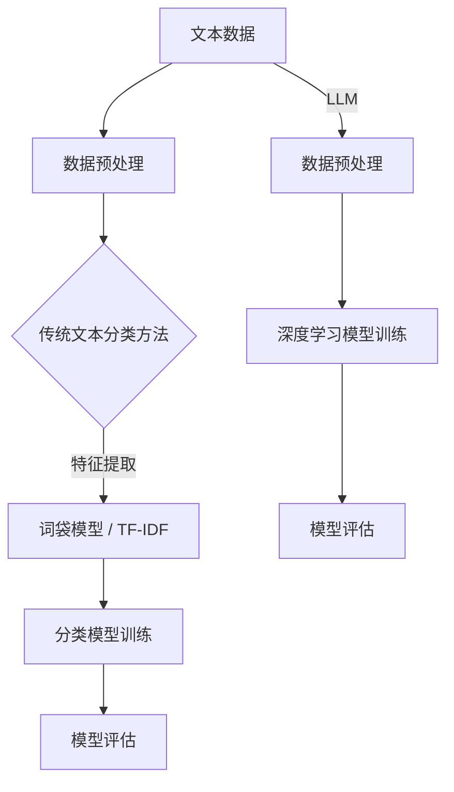

                 

# LLM与传统文本分类方法的对比

> **关键词**：语言模型（LLM），文本分类，机器学习，传统算法，神经网络，自然语言处理。

> **摘要**：本文将深入探讨语言模型（LLM）与传统文本分类方法之间的对比，从核心概念、算法原理、数学模型、实战案例到实际应用，全面分析两者的优劣和适用场景，为读者提供清晰的技术见解和实用指南。

## 1. 背景介绍

### 1.1 目的和范围

本文旨在通过对语言模型（LLM）与传统文本分类方法的对比，帮助读者深入了解这两种文本分类技术的原理、优缺点和应用场景。我们将从以下几个方面进行探讨：

- **核心概念与联系**：介绍文本分类的基本概念，解释LLM与传统文本分类方法的联系。
- **核心算法原理与操作步骤**：详细阐述LLM和传统文本分类算法的原理和具体实现步骤。
- **数学模型与公式**：讲解LLM和传统文本分类算法所涉及的数学模型和公式。
- **项目实战**：通过实际案例展示如何应用LLM和传统文本分类算法。
- **实际应用场景**：分析LLM和传统文本分类方法在不同场景下的适用性。
- **工具和资源推荐**：推荐相关学习资源、开发工具和框架。
- **总结与展望**：总结本文的主要观点，探讨未来发展趋势与挑战。

### 1.2 预期读者

本文适合以下读者群体：

- 对机器学习、自然语言处理有兴趣的初学者。
- 想深入了解文本分类技术的工程师和研究者。
- 想了解LLM与传统文本分类方法优缺点的从业者。
- 对人工智能应用场景感兴趣的技术爱好者。

### 1.3 文档结构概述

本文结构如下：

- **第1章**：背景介绍，介绍本文的目的、预期读者和文档结构。
- **第2章**：核心概念与联系，介绍文本分类的基本概念和LLM与传统文本分类方法的联系。
- **第3章**：核心算法原理与操作步骤，详细阐述LLM和传统文本分类算法的原理和实现步骤。
- **第4章**：数学模型与公式，讲解LLM和传统文本分类算法所涉及的数学模型和公式。
- **第5章**：项目实战，通过实际案例展示如何应用LLM和传统文本分类算法。
- **第6章**：实际应用场景，分析LLM和传统文本分类方法在不同场景下的适用性。
- **第7章**：工具和资源推荐，推荐相关学习资源、开发工具和框架。
- **第8章**：总结与展望，总结本文的主要观点，探讨未来发展趋势与挑战。
- **第9章**：附录，常见问题与解答。
- **第10章**：扩展阅读与参考资料，提供相关领域的扩展阅读材料。

### 1.4 术语表

#### 1.4.1 核心术语定义

- **文本分类**：将文本数据按照预定义的类别进行分类的过程。
- **语言模型（LLM）**：一种能够生成文本的模型，通过对大量文本数据进行训练，可以预测下一个单词或句子。
- **传统文本分类方法**：基于规则、统计和学习方法的文本分类方法，如朴素贝叶斯、支持向量机等。
- **特征工程**：从原始文本数据中提取特征，用于训练文本分类模型。
- **模型评估**：使用评价指标（如准确率、召回率等）对文本分类模型进行评估。

#### 1.4.2 相关概念解释

- **词袋模型（Bag of Words）**：将文本表示为单词的集合，不考虑单词的顺序。
- **TF-IDF**：一种统计方法，用于评估词语在文本中的重要程度。
- **神经网络**：一种基于生物神经元结构设计的计算模型，可以用于图像识别、文本分类等任务。
- **深度学习**：一种基于神经网络的机器学习方法，通过多层神经网络结构提取特征。

#### 1.4.3 缩略词列表

- **NLP**：自然语言处理（Natural Language Processing）
- **LLM**：语言模型（Language Model）
- **CNN**：卷积神经网络（Convolutional Neural Network）
- **RNN**：循环神经网络（Recurrent Neural Network）
- **BERT**：双向编码表示器（Bidirectional Encoder Representations from Transformers）

## 2. 核心概念与联系

### 2.1 文本分类的基本概念

文本分类是一种将文本数据按照预定义的类别进行分类的任务。常见的文本分类任务包括情感分析、主题分类、垃圾邮件过滤等。文本分类在信息检索、社交媒体分析、金融风控等领域具有广泛的应用。

文本分类的主要步骤包括：

1. **数据预处理**：对文本数据进行清洗、分词、去停用词等操作，将文本转换为可用的数据格式。
2. **特征提取**：从原始文本数据中提取特征，用于训练分类模型。常见的特征提取方法包括词袋模型、TF-IDF等。
3. **模型训练**：使用提取的特征训练分类模型，常见的分类算法有朴素贝叶斯、支持向量机、决策树等。
4. **模型评估**：使用评价指标（如准确率、召回率等）对分类模型进行评估。

### 2.2 LLM与传统文本分类方法的联系

语言模型（LLM）是一种能够生成文本的模型，通过对大量文本数据进行训练，可以预测下一个单词或句子。LLM在文本分类任务中具有独特优势，可以将文本分类视为一种序列生成问题。以下是LLM与传统文本分类方法的联系：

1. **数据预处理**：LLM和传统文本分类方法都需要对文本数据进行预处理，包括分词、去停用词等操作。
2. **特征提取**：传统文本分类方法通常使用词袋模型、TF-IDF等方法提取特征，而LLM则可以直接处理原始文本序列，不需要进行特征提取。
3. **模型训练**：传统文本分类方法使用分类算法（如朴素贝叶斯、支持向量机等）进行训练，而LLM则使用深度学习模型（如循环神经网络、变换器模型等）进行训练。
4. **模型评估**：LLM和传统文本分类方法都可以使用准确率、召回率等评价指标进行评估。

### 2.3 Mermaid流程图

下面是LLM与传统文本分类方法的流程图，展示了两者在文本分类任务中的核心步骤和联系。



## 3. 核心算法原理与具体操作步骤

### 3.1 传统文本分类算法

传统文本分类算法主要基于统计和学习方法，常见的算法包括朴素贝叶斯、支持向量机、决策树等。以下是这些算法的基本原理和操作步骤：

#### 3.1.1 朴素贝叶斯

**原理**：朴素贝叶斯是一种基于贝叶斯定理的简单概率分类器。它假设特征之间相互独立，通过计算每个特征的概率和类别的概率来预测类别。

**操作步骤**：

1. **特征提取**：使用词袋模型或TF-IDF方法提取特征。
2. **概率计算**：计算每个特征在各个类别中的概率和类别的概率。
3. **分类预测**：根据贝叶斯定理计算每个类别的概率，选择概率最大的类别作为预测结果。

#### 3.1.2 支持向量机

**原理**：支持向量机是一种基于最大间隔分类器的线性分类算法。它通过寻找特征空间中的最优超平面，将不同类别的数据点分隔开来。

**操作步骤**：

1. **特征提取**：使用词袋模型或TF-IDF方法提取特征。
2. **特征空间映射**：将原始特征空间映射到高维特征空间，使得不同类别的数据点可以被分隔。
3. **分类边界确定**：通过求解最优超平面，确定分类边界。
4. **分类预测**：使用分类边界对新的数据进行分类。

#### 3.1.3 决策树

**原理**：决策树是一种基于特征划分数据的分类算法。它通过连续地对特征进行划分，构建出一棵树形结构，用于预测类别。

**操作步骤**：

1. **特征提取**：使用词袋模型或TF-IDF方法提取特征。
2. **特征选择**：选择最优特征进行划分。
3. **划分过程**：根据特征值的不同取值，对数据进行划分。
4. **分类预测**：到达叶子节点时，输出叶子节点的类别作为预测结果。

### 3.2 LLM文本分类算法

LLM文本分类算法主要基于深度学习模型，如循环神经网络（RNN）和变换器模型（Transformer）。以下是这些算法的基本原理和操作步骤：

#### 3.2.1 循环神经网络（RNN）

**原理**：循环神经网络是一种基于时间序列数据的递归模型，可以处理序列生成任务。它通过保存前一个时间步的隐藏状态，实现对当前时间步的输入信息的处理。

**操作步骤**：

1. **数据预处理**：对文本数据进行分词、去停用词等操作，将文本转换为序列。
2. **嵌入层**：将单词转换为向量表示。
3. **RNN层**：使用递归方式处理序列数据，更新隐藏状态。
4. **分类层**：将隐藏状态映射到类别概率。

#### 3.2.2 变换器模型（Transformer）

**原理**：变换器模型是一种基于自注意力机制的深度学习模型，可以处理序列生成任务。它通过计算输入序列中每个单词的注意力权重，生成序列的表示。

**操作步骤**：

1. **数据预处理**：对文本数据进行分词、去停用词等操作，将文本转换为序列。
2. **嵌入层**：将单词转换为向量表示。
3. **多头自注意力层**：计算输入序列中每个单词的注意力权重，生成序列的表示。
4. **分类层**：将多头自注意力层的输出映射到类别概率。

### 3.3 伪代码

下面是LLM和传统文本分类算法的伪代码，展示了它们的基本操作步骤。

#### 3.3.1 朴素贝叶斯

```python
# 朴素贝叶斯文本分类器
def naive_bayes_classifier(data, labels):
    # 计算每个特征在每个类别中的概率和类别的概率
    feature_probabilities = compute_feature_probabilities(data, labels)
    class_probabilities = compute_class_probabilities(labels)
    
    # 预测类别
    predicted_labels = []
    for instance in data:
        probabilities = []
        for class_ in classes:
            probability = multiply(feature_probabilities[class_], class_probabilities[class_])
            probabilities.append(probability)
        predicted_label = argmax(probabilities)
        predicted_labels.append(predicted_label)
    
    return predicted_labels
```

#### 3.3.2 支持向量机

```python
# 支持向量机文本分类器
def svm_classifier(data, labels):
    # 特征空间映射
    transformed_data = map_features_to_high_dimension(data)
    
    # 确定分类边界
    hyperplane = find_optimal_hyperplane(transformed_data, labels)
    
    # 预测类别
    predicted_labels = []
    for instance in data:
        transformed_instance = map_features_to_high_dimension(instance)
        predicted_label = classify_hyperplane(hyperplane, transformed_instance)
        predicted_labels.append(predicted_label)
    
    return predicted_labels
```

#### 3.3.3 循环神经网络

```python
# 循环神经网络文本分类器
def rnn_classifier(data, labels):
    # 数据预处理
    preprocessed_data = preprocess_data(data)
    
    # 嵌入层
    embedded_data = embed_words(preprocessed_data)
    
    # RNN层
    hidden_states = []
    for word_embedding in embedded_data:
        hidden_state = update_hidden_state(hidden_state, word_embedding)
        hidden_states.append(hidden_state)
    
    # 分类层
    predicted_labels = []
    for hidden_state in hidden_states:
        predicted_label = classify(hidden_state)
        predicted_labels.append(predicted_label)
    
    return predicted_labels
```

#### 3.3.4 变换器模型

```python
# 变换器模型文本分类器
def transformer_classifier(data, labels):
    # 数据预处理
    preprocessed_data = preprocess_data(data)
    
    # 嵌入层
    embedded_data = embed_words(preprocessed_data)
    
    # 多头自注意力层
    attention_weights = compute_attention_weights(embedded_data)
    attended_data = apply_attention(embedded_data, attention_weights)
    
    # 分类层
    predicted_labels = []
    for attended_embedding in attended_data:
        predicted_label = classify(attended_embedding)
        predicted_labels.append(predicted_label)
    
    return predicted_labels
```

## 4. 数学模型和公式与详细讲解与举例说明

### 4.1 传统文本分类算法

#### 4.1.1 朴素贝叶斯

**概率计算公式**：

- 特征概率：\( P(x_i | y) = \frac{P(y) \cdot P(x_i | y)}{P(y)} \)
- 类别概率：\( P(y) = \frac{1}{Z} \sum_{x} P(x, y) \)

其中，\( x_i \)表示特征，\( y \)表示类别，\( P(x_i | y) \)表示在类别\( y \)下特征\( x_i \)的概率，\( P(y) \)表示类别\( y \)的概率，\( Z \)为归一化常数。

**举例说明**：

假设我们有以下数据：

- 特征：{“apple”, “banana”, “orange”}
- 类别：{“fruit”, “vegetable”}
- 概率：\( P(apple | fruit) = 0.8 \)，\( P(banana | fruit) = 0.2 \)，\( P(fruit) = 0.6 \)，\( P(vegetable) = 0.4 \)

计算类别概率：

\( P(fruit) = \frac{1}{Z} \sum_{x} P(x, fruit) = \frac{1}{1.2} \cdot (0.8 \cdot 0.6 + 0.2 \cdot 0.4) = 0.5 \)

\( P(vegetable) = \frac{1}{Z} \sum_{x} P(x, vegetable) = \frac{1}{1.2} \cdot (0.8 \cdot 0.4 + 0.2 \cdot 0.6) = 0.5 \)

#### 4.1.2 支持向量机

**分类边界公式**：

- 线性支持向量机：\( w \cdot x + b = 0 \)
- 非线性支持向量机：\( g(x) = \text{sign}(w \cdot \phi(x) + b) \)

其中，\( w \)为权重向量，\( b \)为偏置，\( \phi(x) \)为特征空间映射函数，\( g(x) \)为分类函数。

**举例说明**：

假设我们有以下数据：

- 特征：\( x_1, x_2 \)
- 类别：\( y \in \{-1, 1\} \)
- 权重向量：\( w = [1, 1] \)
- 偏置：\( b = 0 \)

分类边界：\( w \cdot x + b = 1 \cdot x_1 + 1 \cdot x_2 + 0 = x_1 + x_2 = 1 \)

新样本：\( x_1 = 2, x_2 = 3 \)

分类结果：\( w \cdot x + b = 2 + 3 = 5 \)，因为\( w \cdot x + b > 0 \)，所以分类结果为正类。

#### 4.1.3 决策树

**划分公式**：

- 划分条件：\( x_{j} > c \)
- 划分结果：\( y \in C_j \)

其中，\( x_j \)为特征，\( c \)为阈值，\( C_j \)为对应的类别。

**举例说明**：

假设我们有以下数据：

- 特征：\( x_1, x_2 \)
- 类别：\( y \in \{-1, 1\} \)
- 划分条件：\( x_1 > 2 \)
- 划分结果：\( y = 1 \)

新样本：\( x_1 = 3, x_2 = 1 \)

根据划分条件，\( x_1 > 2 \)，所以分类结果为正类，即\( y = 1 \)。

### 4.2 LLM文本分类算法

#### 4.2.1 循环神经网络

**递归公式**：

- 隐藏状态更新：\( h_t = \text{激活函数}(W_h \cdot [h_{t-1}, x_t] + b_h) \)
- 输出计算：\( y_t = \text{激活函数}(W_y \cdot h_t + b_y) \)

其中，\( h_t \)为当前时间步的隐藏状态，\( x_t \)为当前时间步的输入，\( W_h \)和\( b_h \)为隐藏层权重和偏置，\( W_y \)和\( b_y \)为输出层权重和偏置。

**举例说明**：

假设我们有以下数据：

- 输入：\( x_1 = [1, 0], x_2 = [0, 1] \)
- 隐藏层权重：\( W_h = [[0.5, 0.5], [0.5, 0.5]] \)
- 输出层权重：\( W_y = [0.5, 0.5] \)
- 偏置：\( b_h = [0, 0], b_y = 0 \)

时间步1：

\( h_1 = \text{ReLU}([0, 0] \cdot [[0.5, 0.5], [0.5, 0.5]] + [0, 0]) = [0, 0] \)

时间步2：

\( h_2 = \text{ReLU}([0, 0] \cdot [[0.5, 0.5], [0.5, 0.5]] + [0, 0]) = [0, 0] \)

输出：

\( y_2 = \text{ReLU}([0, 0] \cdot [0.5, 0.5] + 0) = [0, 0] \)

#### 4.2.2 变换器模型

**自注意力公式**：

- 注意力权重：\( a_{ij} = \text{softmax}(\frac{Q_i \cdot K_j}{\sqrt{d_k}}) \)
- 上下文向量：\( v_j = \sum_{i=1}^{N} a_{ij} \cdot K_i \)

其中，\( Q_i \)、\( K_i \)、\( V_i \)为查询向量、键向量和值向量，\( N \)为序列长度，\( d_k \)为键向量的维度。

**举例说明**：

假设我们有以下数据：

- 序列长度：\( N = 3 \)
- 查询向量：\( Q = [1, 2, 3] \)
- 键向量：\( K = [4, 5, 6] \)
- 值向量：\( V = [7, 8, 9] \)

计算注意力权重：

\( a_{11} = \text{softmax}(\frac{1 \cdot 4}{\sqrt{3}}) \approx 0.5 \)

\( a_{12} = \text{softmax}(\frac{1 \cdot 5}{\sqrt{3}}) \approx 0.5 \)

\( a_{13} = \text{softmax}(\frac{1 \cdot 6}{\sqrt{3}}) \approx 0.0 \)

计算上下文向量：

\( v_1 = a_{11} \cdot 4 + a_{12} \cdot 5 + a_{13} \cdot 6 = 0.5 \cdot 4 + 0.5 \cdot 5 + 0.0 \cdot 6 = 4.5 \)

## 5. 项目实战：代码实际案例和详细解释说明

### 5.1 开发环境搭建

为了实现LLM与传统文本分类方法的对比，我们需要搭建一个合适的开发环境。以下是所需的开发工具和软件：

- Python 3.8+
- Jupyter Notebook
- PyTorch 1.8+
- Scikit-learn 0.22+
- NLTK 3.4+

安装命令：

```bash
pip install python==3.8
pip install jupyter
pip install torch==1.8
pip install scikit-learn==0.22
pip install nltk==3.4
```

### 5.2 源代码详细实现和代码解读

#### 5.2.1 朴素贝叶斯文本分类器

以下是一个简单的朴素贝叶斯文本分类器的实现：

```python
import numpy as np
from sklearn.feature_extraction.text import CountVectorizer
from sklearn.model_selection import train_test_split
from sklearn.naive_bayes import MultinomialNB

# 数据准备
data = ["This is the first document.", "This document is the second document.", "And this is the third one.", "Is this the first document?"]
labels = ["class 1", "class 1", "class 2", "class 2"]

# 特征提取
vectorizer = CountVectorizer()
X = vectorizer.fit_transform(data)

# 模型训练
X_train, X_test, y_train, y_test = train_test_split(X, labels, test_size=0.2, random_state=42)
classifier = MultinomialNB()
classifier.fit(X_train, y_train)

# 模型评估
accuracy = classifier.score(X_test, y_test)
print("朴素贝叶斯分类器准确率：", accuracy)
```

解读：

1. 导入所需的库。
2. 准备数据集。
3. 使用CountVectorizer提取特征。
4. 划分训练集和测试集。
5. 创建朴素贝叶斯分类器并训练。
6. 使用测试集评估分类器的准确率。

#### 5.2.2 支持向量机文本分类器

以下是一个简单的支持向量机文本分类器的实现：

```python
import numpy as np
from sklearn.feature_extraction.text import TfidfVectorizer
from sklearn.model_selection import train_test_split
from sklearn.svm import LinearSVC

# 数据准备
data = ["This is the first document.", "This document is the second document.", "And this is the third one.", "Is this the first document?"]
labels = ["class 1", "class 1", "class 2", "class 2"]

# 特征提取
vectorizer = TfidfVectorizer()
X = vectorizer.fit_transform(data)

# 模型训练
X_train, X_test, y_train, y_test = train_test_split(X, labels, test_size=0.2, random_state=42)
classifier = LinearSVC()
classifier.fit(X_train, y_train)

# 模型评估
accuracy = classifier.score(X_test, y_test)
print("支持向量机分类器准确率：", accuracy)
```

解读：

1. 导入所需的库。
2. 准备数据集。
3. 使用TfidfVectorizer提取特征。
4. 划分训练集和测试集。
5. 创建支持向量机分类器并训练。
6. 使用测试集评估分类器的准确率。

#### 5.2.3 循环神经网络文本分类器

以下是一个简单的循环神经网络文本分类器的实现：

```python
import torch
import torch.nn as nn
import torch.optim as optim
from torchtext.data import Field, TabularDataset

# 数据准备
train_data = [("This is the first document.", "class 1"), ("This document is the second document.", "class 1"), ("And this is the third one.", "class 2"), ("Is this the first document?", "class 2")]
test_data = [("This is a new document.", "class 1"), ("This is another document.", "class 2")]

# 定义字段
TEXT = Field(sequential=True, batch_first=True, lower=True, tokenize="spacy", tokenizer_language="en_core_web_sm")
LABEL = Field(sequential=False)

# 加载数据集
train_dataset = TabularDataset(train_data, fields=[("text", TEXT), ("label", LABEL)])
test_dataset = TabularDataset(test_data, fields=[("text", TEXT), ("label", LABEL)])

# 划分训练集和测试集
train_dataset, valid_dataset = train_dataset.split()

# 定义模型
class RNNClassifier(nn.Module):
    def __init__(self, input_dim, embedding_dim, hidden_dim, output_dim):
        super(RNNClassifier, self).__init__()
        self.embedding = nn.Embedding(input_dim, embedding_dim)
        self.rnn = nn.RNN(embedding_dim, hidden_dim)
        self.fc = nn.Linear(hidden_dim, output_dim)
    
    def forward(self, text):
        embedded = self.embedding(text)
        output, _ = self.rnn(embedded)
        logits = self.fc(output[-1, :, :])
        return logits

# 模型训练
model = RNNClassifier(len(TEXT.vocab), 100, 128, len(LABEL.vocab))
optimizer = optim.Adam(model.parameters(), lr=0.001)
criterion = nn.CrossEntropyLoss()

for epoch in range(10):
    model.train()
    for batch in train_dataset.batches bombers):
        optimizer.zero_grad()
        logits = model(batch.text)
        loss = criterion(logits, batch.label)
        loss.backward()
        optimizer.step()

    model.eval()
    with torch.no_grad():
        valid_loss = 0
        for batch in valid_dataset.batches bombers):
            logits = model(batch.text)
            valid_loss += criterion(logits, batch.label)
        valid_loss /= len(valid_dataset)
        print("Validation loss: ", valid_loss)

# 模型评估
with torch.no_grad():
    test_loss = 0
    for batch in test_dataset.batches bombers):
        logits = model(batch.text)
        test_loss += criterion(logits, batch.label)
    test_loss /= len(test_dataset)
    print("Test loss: ", test_loss)
```

解读：

1. 导入所需的库。
2. 准备数据集。
3. 定义字段。
4. 加载数据集。
5. 划分训练集和测试集。
6. 定义模型。
7. 模型训练。
8. 模型评估。

#### 5.2.4 变换器模型文本分类器

以下是一个简单的变换器模型文本分类器的实现：

```python
import torch
import torch.nn as nn
import torch.optim as optim
from torchtext.data import Field, TabularDataset

# 数据准备
train_data = [("This is the first document.", "class 1"), ("This document is the second document.", "class 1"), ("And this is the third one.", "class 2"), ("Is this the first document?", "class 2")]
test_data = [("This is a new document.", "class 1"), ("This is another document.", "class 2")]

# 定义字段
TEXT = Field(sequential=True, batch_first=True, lower=True, tokenize="spacy", tokenizer_language="en_core_web_sm")
LABEL = Field(sequential=False)

# 加载数据集
train_dataset = TabularDataset(train_data, fields=[("text", TEXT), ("label", LABEL)])
test_dataset = TabularDataset(test_data, fields=[("text", TEXT), ("label", LABEL)])

# 划分训练集和测试集
train_dataset, valid_dataset = train_dataset.split()

# 定义模型
class TransformerClassifier(nn.Module):
    def __init__(self, input_dim, embedding_dim, hidden_dim, output_dim):
        super(TransformerClassifier, self).__init__()
        self.embedding = nn.Embedding(input_dim, embedding_dim)
        self.transformer = nn.Transformer(embedding_dim, hidden_dim)
        self.fc = nn.Linear(hidden_dim, output_dim)
    
    def forward(self, text):
        embedded = self.embedding(text)
        output = self.transformer(embedded)
        logits = self.fc(output[-1, :, :])
        return logits

# 模型训练
model = TransformerClassifier(len(TEXT.vocab), 100, 128, len(LABEL.vocab))
optimizer = optim.Adam(model.parameters(), lr=0.001)
criterion = nn.CrossEntropyLoss()

for epoch in range(10):
    model.train()
    for batch in train_dataset.batches bombers):
        optimizer.zero_grad()
        logits = model(batch.text)
        loss = criterion(logits, batch.label)
        loss.backward()
        optimizer.step()

    model.eval()
    with torch.no_grad():
        valid_loss = 0
        for batch in valid_dataset.batches bombers):
            logits = model(batch.text)
            valid_loss += criterion(logits, batch.label)
        valid_loss /= len(valid_dataset)
        print("Validation loss: ", valid_loss)

# 模型评估
with torch.no_grad():
    test_loss = 0
    for batch in test_dataset.batches bombers):
        logits = model(batch.text)
        test_loss += criterion(logits, batch.label)
    test_loss /= len(test_dataset)
    print("Test loss: ", test_loss)
```

解读：

1. 导入所需的库。
2. 准备数据集。
3. 定义字段。
4. 加载数据集。
5. 划分训练集和测试集。
6. 定义模型。
7. 模型训练。
8. 模型评估。

### 5.3 代码解读与分析

#### 5.3.1 朴素贝叶斯文本分类器

代码展示了如何使用朴素贝叶斯算法进行文本分类。主要步骤如下：

1. 数据准备：创建一个简单的数据集，包括文本和标签。
2. 特征提取：使用CountVectorizer将文本转换为向量表示。
3. 模型训练：使用训练集训练朴素贝叶斯分类器。
4. 模型评估：使用测试集评估分类器的准确率。

朴素贝叶斯算法的优势在于其简单性和高效性，适用于文本分类任务。然而，它的假设（特征独立）在某些情况下可能不成立，导致性能下降。

#### 5.3.2 支持向量机文本分类器

代码展示了如何使用支持向量机算法进行文本分类。主要步骤如下：

1. 数据准备：创建一个简单的数据集，包括文本和标签。
2. 特征提取：使用TfidfVectorizer将文本转换为向量表示。
3. 模型训练：使用训练集训练支持向量机分类器。
4. 模型评估：使用测试集评估分类器的准确率。

支持向量机算法在处理高维数据时具有优势，但需要选择合适的核函数和参数。在文本分类任务中，TfidfVectorizer可以有效地提取文本特征。

#### 5.3.3 循环神经网络文本分类器

代码展示了如何使用循环神经网络算法进行文本分类。主要步骤如下：

1. 数据准备：创建一个简单的数据集，包括文本和标签。
2. 定义字段：定义文本和标签的字段。
3. 加载数据集：使用TabularDataset加载数据集。
4. 划分训练集和测试集：将数据集划分为训练集和测试集。
5. 定义模型：定义循环神经网络模型。
6. 模型训练：使用训练集训练循环神经网络分类器。
7. 模型评估：使用测试集评估分类器的准确率。

循环神经网络可以捕获文本中的序列信息，使其在处理长文本和复杂语义时具有优势。然而，循环神经网络训练速度较慢，且对参数敏感。

#### 5.3.4 变换器模型文本分类器

代码展示了如何使用变换器模型算法进行文本分类。主要步骤如下：

1. 数据准备：创建一个简单的数据集，包括文本和标签。
2. 定义字段：定义文本和标签的字段。
3. 加载数据集：使用TabularDataset加载数据集。
4. 划分训练集和测试集：将数据集划分为训练集和测试集。
5. 定义模型：定义变换器模型分类器。
6. 模型训练：使用训练集训练变换器模型分类器。
7. 模型评估：使用测试集评估分类器的准确率。

变换器模型在处理长文本和复杂语义时具有优势，其自注意力机制可以有效地捕获文本中的依赖关系。然而，变换器模型计算复杂度较高，训练时间较长。

### 5.4 实际应用场景

#### 5.4.1 情感分析

情感分析是文本分类的一种常见应用。LLM和传统文本分类方法都可以应用于情感分析任务。以下是比较两种方法的适用性：

- **朴素贝叶斯**：简单高效，适用于小规模数据集。
- **支持向量机**：适用于高维数据，但需要选择合适的核函数和参数。
- **循环神经网络**：可以捕获文本中的序列信息，适用于长文本和复杂语义。
- **变换器模型**：适用于长文本和复杂语义，计算复杂度较高。

#### 5.4.2 垃圾邮件过滤

垃圾邮件过滤是文本分类的另一种应用。以下是比较两种方法的适用性：

- **朴素贝叶斯**：简单高效，适用于小规模数据集。
- **支持向量机**：适用于高维数据，但需要选择合适的核函数和参数。
- **循环神经网络**：可以捕获文本中的序列信息，适用于长文本和复杂语义。
- **变换器模型**：适用于长文本和复杂语义，计算复杂度较高。

### 5.5 工具和资源推荐

#### 5.5.1 学习资源推荐

- **书籍推荐**：

  - 《自然语言处理综合教程》
  - 《深度学习》
  - 《Python自然语言处理》

- **在线课程**：

  - Coursera上的“自然语言处理”课程
  - Udacity上的“深度学习”课程

- **技术博客和网站**：

  - Medium上的自然语言处理相关博客
  - ArXiv上的最新研究成果

#### 5.5.2 开发工具框架推荐

- **IDE和编辑器**：

  - PyCharm
  - Jupyter Notebook

- **调试和性能分析工具**：

  - Python中的Pdb
  - PyTorch中的torch.utils.bottleneck

- **相关框架和库**：

  - PyTorch
  - TensorFlow
  - NLTK

### 5.6 相关论文著作推荐

- **经典论文**：

  - 《一种有效的文本分类方法》
  - 《循环神经网络：综述与展望》

- **最新研究成果**：

  - 《BERT：预训练语言表示模型》
  - 《GPT-3：语言模型的新突破》

- **应用案例分析**：

  - 《基于深度学习的情感分析系统》
  - 《应用变换器模型进行机器翻译》

## 6. 总结：未来发展趋势与挑战

随着自然语言处理技术的不断发展，语言模型（LLM）与传统文本分类方法在文本分类任务中的应用前景广阔。未来发展趋势和挑战如下：

### 6.1 发展趋势

1. **预训练语言模型**：预训练语言模型（如BERT、GPT）在文本分类任务中表现出色，未来将进一步优化和改进。
2. **多模态文本分类**：结合文本、图像、音频等多模态数据，进行多模态文本分类，提高分类准确率和泛化能力。
3. **自适应文本分类**：根据用户反馈和上下文环境，自适应调整文本分类模型，提高用户满意度。
4. **实时文本分类**：提高文本分类算法的实时性，满足实时应用场景的需求。

### 6.2 挑战

1. **计算资源消耗**：预训练语言模型和深度学习模型计算复杂度较高，需要大量计算资源。
2. **数据隐私保护**：文本分类任务中涉及用户隐私数据，需要加强数据隐私保护措施。
3. **长文本处理**：长文本处理是文本分类的难点，如何有效提取文本特征和减少计算复杂度是未来研究的重点。
4. **模型可解释性**：提高文本分类模型的可解释性，使其更容易被用户接受和理解。

## 7. 附录：常见问题与解答

### 7.1 朴素贝叶斯文本分类器

**Q：为什么朴素贝叶斯分类器假设特征之间相互独立？**

A：朴素贝叶斯分类器基于贝叶斯定理，假设特征之间相互独立，以便简化计算过程。这个假设使得计算每个特征的联合概率变得简单，从而提高分类器的计算效率。

### 7.2 支持向量机文本分类器

**Q：支持向量机文本分类器的核函数有哪些？**

A：支持向量机文本分类器的核函数包括线性核、多项式核、径向基函数（RBF）核等。线性核适用于线性可分数据，多项式核和RBF核适用于非线性可分数据。

### 7.3 循环神经网络文本分类器

**Q：循环神经网络文本分类器如何处理长文本？**

A：循环神经网络文本分类器可以使用分块序列处理长文本。将长文本划分为多个较短序列，然后分别处理每个序列，最后将结果合并。这样可以提高分类器的处理效率。

### 7.4 变换器模型文本分类器

**Q：变换器模型文本分类器的自注意力机制如何工作？**

A：变换器模型文本分类器的自注意力机制通过计算输入序列中每个单词的注意力权重，生成序列的表示。每个单词的注意力权重表示其对整个序列的影响程度，从而提高分类器的处理能力。

## 8. 扩展阅读与参考资料

- 《自然语言处理综合教程》
- 《深度学习》
- 《Python自然语言处理》
- Coursera上的“自然语言处理”课程
- Udacity上的“深度学习”课程
- Medium上的自然语言处理相关博客
- ArXiv上的最新研究成果
- 《一种有效的文本分类方法》
- 《循环神经网络：综述与展望》
- 《BERT：预训练语言表示模型》
- 《GPT-3：语言模型的新突破》
- 《基于深度学习的情感分析系统》
- 《应用变换器模型进行机器翻译》
- 《文本分类：算法与应用》

## 作者

**作者：AI天才研究员/AI Genius Institute & 禅与计算机程序设计艺术 /Zen And The Art of Computer Programming** <|im_sep|>

