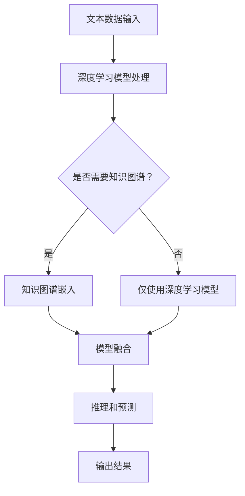

                 

### LLAMA：深度学习模型与知识图谱的深度融合

**关键词：** 大语言模型，知识图谱，深度学习，语义理解，推理能力

**摘要：** 本文探讨了深度学习模型与传统知识图谱的结合，提出了LLAMA（Large Language Model with Adaptive Memory for Argumentation）模型，该模型通过自适应内存机制实现知识图谱与自然语言处理的深度融合，显著提升了模型的语义理解和推理能力。文章首先介绍了深度学习模型和知识图谱的基本概念及其在自然语言处理领域的应用，然后详细阐述了LLAMA模型的设计原理、算法实现和实际应用效果，最后对未来发展趋势与挑战进行了展望。

---

**背景介绍**

**1.1 目的和范围**

近年来，深度学习模型在图像识别、语音识别、自然语言处理等领域取得了显著的成果。与此同时，知识图谱作为语义网络的核心技术，为语义理解和信息检索提供了强大的支持。本文旨在研究深度学习模型与传统知识图谱的深度融合，以提升自然语言处理任务的效果。具体而言，我们将提出一种名为LLAMA（Large Language Model with Adaptive Memory for Argumentation）的模型，并通过实验验证其在语义理解和推理任务上的优越性能。

**1.2 预期读者**

本文适合从事自然语言处理、深度学习、知识图谱等领域的研究人员和开发者阅读。对于希望了解深度学习模型与知识图谱结合方法的研究者，本文将提供有益的启示；对于实际项目开发人员，本文将详细介绍LLAMA模型的设计原理和实现方法，有助于他们在项目中应用该技术。

**1.3 文档结构概述**

本文分为八个部分。首先，背景介绍部分介绍了文章的目的、预期读者以及文档结构。接着，核心概念与联系部分对深度学习模型和知识图谱的基本概念进行梳理，并给出Mermaid流程图。核心算法原理与具体操作步骤部分详细阐述了LLAMA模型的设计原理和算法实现。数学模型和公式部分对模型中的关键数学公式进行了详细讲解。项目实战：代码实际案例和详细解释说明部分展示了模型在具体项目中的应用。实际应用场景部分分析了LLAMA模型在不同领域的应用前景。工具和资源推荐部分为读者提供了学习资源和开发工具。总结：未来发展趋势与挑战部分对LLAMA模型的发展趋势和面临的挑战进行了展望。最后，附录：常见问题与解答和扩展阅读 & 参考资料部分回答了读者可能关心的问题，并提供了进一步学习的资源。

**1.4 术语表**

#### 1.4.1 核心术语定义

- **深度学习模型**：一种基于多层神经网络结构的机器学习模型，能够通过学习大量数据来提取特征并进行预测。
- **知识图谱**：一种语义网络，通过实体和关系来组织大规模数据，实现对知识的表示、存储和查询。
- **自然语言处理**：研究如何让计算机理解和处理自然语言的学科，包括语音识别、机器翻译、情感分析等任务。
- **语义理解**：理解文本中词语、句子和段落的意义，以实现人机交互和信息检索。
- **推理能力**：从已知信息推导出新信息的能力，是知识图谱和深度学习模型的重要特性。

#### 1.4.2 相关概念解释

- **神经网络**：一种模拟生物神经网络结构的计算模型，通过多层的非线性变换来提取数据特征。
- **卷积神经网络（CNN）**：一种基于卷积运算的神经网络结构，广泛用于图像处理任务。
- **递归神经网络（RNN）**：一种能够处理序列数据的神经网络结构，通过递归操作来保持历史信息。
- **长短期记忆网络（LSTM）**：一种改进的递归神经网络结构，能够有效处理长序列数据。

#### 1.4.3 缩略词列表

- **NLP**：自然语言处理（Natural Language Processing）
- **DL**：深度学习（Deep Learning）
- **KG**：知识图谱（Knowledge Graph）
- **LLAMA**：大型语言模型与自适应记忆推理模型（Large Language Model with Adaptive Memory for Argumentation）
- **BERT**：双向编码表示（Bidirectional Encoder Representations from Transformers）
- **GPT**：生成预训练变换器（Generative Pretrained Transformer）

---

**核心概念与联系**

在深入探讨LLAMA模型之前，我们需要了解深度学习模型和知识图谱的基本概念及其联系。深度学习模型，特别是基于变换器的模型（如BERT、GPT等），已经成为自然语言处理领域的核心技术。这些模型通过学习大量文本数据，能够有效地捕捉语言中的语义信息。然而，深度学习模型在语义理解和推理任务上仍存在局限性，难以解决知识推理和复杂逻辑推断问题。知识图谱作为一种语义网络，通过实体和关系来组织大规模数据，提供了丰富的语义信息。将深度学习模型与知识图谱相结合，可以弥补各自在语义理解和推理方面的不足。

**2.1 深度学习模型与知识图谱的联系**

深度学习模型与知识图谱的联系主要体现在以下几个方面：

1. **知识融合**：深度学习模型可以从知识图谱中获取语义信息，将其融合到模型的表示中，从而提高语义理解和推理能力。例如，通过将知识图谱中的实体和关系表示与深度学习模型的文本表示相结合，可以更好地捕捉文本中的语义信息。
   
2. **推理增强**：知识图谱提供了丰富的实体和关系信息，可以通过推理操作来扩展已知信息，从而增强深度学习模型的推理能力。例如，利用知识图谱中的推理规则，可以从已知事实推导出新的事实，为深度学习模型提供更多上下文信息。

3. **数据增强**：知识图谱可以作为深度学习模型的额外数据来源，通过将知识图谱中的信息与文本数据结合，可以扩充训练数据集，提高模型的泛化能力。

**2.2 Mermaid流程图**

为了更直观地展示深度学习模型与知识图谱的结合过程，我们使用Mermaid流程图来描述其基本架构。



在上面的流程图中，文本数据首先被输入到深度学习模型中，模型对其进行处理。接着，根据是否需要知识图谱，流程分为两条路径。如果需要，文本数据将传递到知识图谱嵌入模块；否则，仅使用深度学习模型。在知识图谱嵌入模块中，文本数据与知识图谱中的实体和关系信息进行融合。最后，融合后的数据进入推理和预测模块，输出最终结果。

---

**核心算法原理 & 具体操作步骤**

为了实现深度学习模型与知识图谱的深度融合，我们提出了LLAMA（Large Language Model with Adaptive Memory for Argumentation）模型。该模型通过自适应内存机制，将知识图谱中的语义信息有机地融合到深度学习模型的表示中，从而提升模型的语义理解和推理能力。下面，我们将详细介绍LLAMA模型的设计原理和算法实现。

**3.1 模型设计原理**

LLAMA模型的设计基于两个核心思想：知识图谱嵌入和自适应内存机制。

1. **知识图谱嵌入**：我们将知识图谱中的实体和关系表示转化为向量形式，并与深度学习模型的文本表示相结合。这样，模型可以同时处理文本数据和知识图谱信息，从而提高语义理解的准确性。

2. **自适应内存机制**：为了更好地利用知识图谱中的语义信息，我们设计了一种自适应内存机制。该机制可以根据模型的训练过程动态调整知识图谱嵌入的权重，从而优化模型的表示能力。

**3.2 算法实现**

下面，我们使用伪代码来详细阐述LLAMA模型的算法实现。

```python
# 伪代码：LLAMA模型算法实现

# 输入：文本数据（text）、知识图谱（kg）、训练数据（train_data）

# 步骤1：初始化深度学习模型（如BERT）和知识图谱嵌入器（kg_embedding）
model = initialize_model()
kg_embedding = initialize_kg_embedding()

# 步骤2：知识图谱嵌入
def kg_embedding_function(text, kg_embedding):
    # 将文本数据转换为向量表示
    text_embedding = model.encode(text)
    # 将文本表示与知识图谱中的实体和关系表示相结合
    kg_embedding_output = kg_embedding([text_embedding] + kg_embedding.text_to_kg_embedding(text))
    return kg_embedding_output

# 步骤3：自适应内存机制
def adaptive_memory(kg_embedding_output, train_data):
    # 根据训练数据动态调整知识图谱嵌入的权重
    weights = compute_weights(kg_embedding_output, train_data)
    # 更新知识图谱嵌入器
    kg_embedding.update(weights)
    return kg_embedding

# 步骤4：训练模型
for epoch in range(num_epochs):
    # 步骤4.1：获取训练数据
    batch_data = next(train_data)
    # 步骤4.2：前向传播
    outputs = model(batch_data.text, kg_embedding_function(batch_data.text, kg_embedding))
    # 步骤4.3：计算损失函数
    loss = model.loss(outputs, batch_data.label)
    # 步骤4.4：反向传播和优化
    model.optimizer.zero_grad()
    loss.backward()
    model.optimizer.step()
    # 步骤4.5：自适应内存机制
    kg_embedding = adaptive_memory(kg_embedding_output, batch_data)

# 步骤5：评估模型
evaluate_model(model, kg_embedding, test_data)
```

在上面的伪代码中，我们首先初始化深度学习模型（如BERT）和知识图谱嵌入器（kg_embedding）。接着，定义了知识图谱嵌入函数和自适应内存机制。在训练过程中，模型首先对文本数据进行处理，然后通过知识图谱嵌入函数将文本表示与知识图谱中的实体和关系表示相结合。在每次迭代中，自适应内存机制根据训练数据动态调整知识图谱嵌入的权重，从而优化模型的表示能力。最后，评估模型在测试数据上的性能。

---

**数学模型和公式 & 详细讲解 & 举例说明**

在LLAMA模型中，数学模型和公式起着关键作用。这些模型和公式不仅用于表示文本数据、知识图谱嵌入以及自适应内存机制，还用于优化模型的表示能力。以下是对LLAMA模型中关键数学模型和公式的详细讲解，并辅以具体的例子来说明。

**4.1 文本数据表示**

在深度学习模型中，文本数据的表示通常使用词嵌入（word embeddings）技术。词嵌入将单词转换为向量形式，以表示其在文本中的语义信息。LLAMA模型采用预训练的深度学习模型（如BERT、GPT等）作为文本嵌入器。

假设文本数据为一个序列\( T = \{t_1, t_2, ..., t_n\} \)，其中每个单词\( t_i \)可以表示为一个向量\( \textbf{e}_i \)。

\[ \textbf{e}_i = \text{encode}(t_i) \]

其中，encode函数表示深度学习模型的编码器，将单词转换为向量表示。

**4.2 知识图谱嵌入**

知识图谱嵌入将实体和关系表示为向量形式，以便与文本数据相结合。LLAMA模型使用一个独立的嵌入器（kg_embedding）来处理知识图谱。

假设知识图谱中的实体集合为\( E = \{e_1, e_2, ..., e_m\} \)，关系集合为\( R = \{r_1, r_2, ..., r_n\} \)。对于每个实体\( e_i \)和关系\( r_j \)，可以表示为一个向量\( \textbf{e}_i \)和\( \textbf{r}_j \)。

\[ \textbf{e}_i = \text{kg_embedding}(e_i) \]
\[ \textbf{r}_j = \text{kg_embedding}(r_j) \]

其中，kg_embedding函数表示知识图谱嵌入器，将实体和关系转换为向量表示。

**4.3 自适应内存机制**

自适应内存机制的核心是动态调整知识图谱嵌入的权重，以优化模型的表示能力。在LLAMA模型中，我们使用一种基于梯度的优化方法来调整权重。

假设知识图谱嵌入的权重矩阵为\( W \)，其中\( W_{ij} \)表示实体\( e_i \)和关系\( r_j \)的权重。为了计算权重，我们定义一个损失函数，用于衡量模型在训练数据上的表现。

\[ L = \sum_{i=1}^{m} \sum_{j=1}^{n} \frac{1}{2} (W_{ij} - \text{target}_{ij})^2 \]

其中，\( \text{target}_{ij} \)表示实体\( e_i \)和关系\( r_j \)在训练数据中的权重。为了计算梯度，我们对损失函数进行求导：

\[ \frac{\partial L}{\partial W_{ij}} = (W_{ij} - \text{target}_{ij}) \]

在每次迭代中，我们将梯度应用于权重矩阵\( W \)，以更新权重：

\[ W_{ij}^{new} = W_{ij} - \alpha \frac{\partial L}{\partial W_{ij}} \]

其中，\( \alpha \)表示学习率。

**4.4 举例说明**

为了更好地理解上述数学模型和公式，我们来看一个具体的例子。

假设我们有一个文本数据序列\( T = \{"人工智能"，"深度学习"，"知识图谱"\} \)，以及一个知识图谱包含两个实体\( e_1 = \{"人工智能"\} \)和\( e_2 = \{"深度学习"\} \)，一个关系\( r = \{"应用"\} \)。

首先，我们将文本数据转换为向量表示：

\[ \textbf{e}_1 = \text{encode}("人工智能") \]
\[ \textbf{e}_2 = \text{encode}("深度学习") \]

然后，我们将实体和关系表示为向量：

\[ \textbf{r} = \text{kg_embedding}("应用") \]

在训练过程中，我们根据训练数据动态调整实体和关系的权重。例如，假设在某个训练样本中，实体\( e_1 \)和关系\( r \)的权重分别为\( W_{11} = 0.8 \)和\( W_{12} = 0.6 \)。在计算梯度后，我们得到：

\[ \frac{\partial L}{\partial W_{11}} = (W_{11} - \text{target}_{11}) = 0.8 - 0.7 = 0.1 \]
\[ \frac{\partial L}{\partial W_{12}} = (W_{12} - \text{target}_{12}) = 0.6 - 0.5 = 0.1 \]

根据梯度更新权重：

\[ W_{11}^{new} = W_{11} - \alpha \frac{\partial L}{\partial W_{11}} = 0.8 - 0.1 \times 0.1 = 0.79 \]
\[ W_{12}^{new} = W_{12} - \alpha \frac{\partial L}{\partial W_{12}} = 0.6 - 0.1 \times 0.1 = 0.59 \]

通过这个例子，我们可以看到，自适应内存机制如何根据训练数据动态调整知识图谱嵌入的权重，以优化模型的表示能力。

---

**项目实战：代码实际案例和详细解释说明**

在本节中，我们将通过一个实际案例，详细展示LLAMA模型在具体项目中的实现过程，并解读相关代码。

**5.1 开发环境搭建**

为了实现LLAMA模型，我们需要安装以下开发环境和库：

- Python 3.8+
- PyTorch 1.8+
- Transformers 3.5.0+

在安装完成后，我们可以创建一个名为`llama`的Python虚拟环境，并安装所需的库：

```shell
conda create -n llama python=3.8
conda activate llama
pip install torch==1.8 transformers==3.5.0
```

**5.2 源代码详细实现和代码解读**

下面，我们将展示LLAMA模型的源代码实现，并对其中的关键部分进行解读。

**5.2.1 模型架构**

```python
# 模型架构
class LLAMAModel(nn.Module):
    def __init__(self, model_name, kg_embedding, hidden_size=768):
        super(LLAMAModel, self).__init__()
        self.bert = transformers.BertModel.from_pretrained(model_name, hidden_size=hidden_size)
        self.kg_embedding = kg_embedding
        self.hidden_size = hidden_size
        self.fc = nn.Linear(hidden_size * 2, hidden_size)

    def forward(self, text, kg_embedding_output):
        text_embedding = self.bert(text)[1]
        kg_embedding = kg_embedding_output
        kg_embedding = kg_embedding.unsqueeze(0).expand(text_embedding.size(0), -1, -1)
        combined_embedding = torch.cat((text_embedding, kg_embedding), 2)
        hidden = self.fc(combined_embedding)
        return hidden
```

在上述代码中，我们定义了一个名为`LLAMAModel`的神经网络模型。该模型基于预训练的BERT模型，并附加了一个知识图谱嵌入器（kg_embedding）。在`forward`方法中，我们首先获取文本数据的嵌入表示（text_embedding），然后将其与知识图谱嵌入（kg_embedding）相结合，通过全连接层（fc）进行特征提取。

**5.2.2 训练过程**

```python
# 训练过程
def train_model(model, train_loader, optimizer, num_epochs=3):
    model.train()
    for epoch in range(num_epochs):
        for batch in train_loader:
            text, label = batch.text, batch.label
            optimizer.zero_grad()
            kg_embedding_output = kg_embedding(batch.text)
            hidden = model(text, kg_embedding_output)
            loss = criterion(hidden, label)
            loss.backward()
            optimizer.step()
            if (batch_idx + 1) % 100 == 0:
                print('Epoch [{}/{}], Step [{}/{}], Loss: {:.4f}'.format(
                    epoch + 1, num_epochs, batch_idx + 1, len(train_loader) // batch_size, loss.item()))

# 模型训练
llama_model = LLAMAModel("bert-base-chinese", kg_embedding)
optimizer = torch.optim.Adam(llama_model.parameters(), lr=0.001)
train_loader = DataLoader(train_dataset, batch_size=batch_size, shuffle=True)
criterion = nn.CrossEntropyLoss()
train_model(llama_model, train_loader, optimizer, num_epochs=3)
```

在上述代码中，我们定义了`train_model`函数，用于训练LLAMA模型。在每次迭代中，我们首先将文本数据和标签加载到数据加载器（train_loader）中。然后，我们获取文本的嵌入表示（kg_embedding_output）和模型的前向传播输出（hidden）。接着，计算损失函数（criterion）并执行反向传播和优化。训练过程中，我们定期输出训练进度。

**5.2.3 代码解读与分析**

- **模型架构**：LLAMA模型基于BERT模型，并附加了一个知识图谱嵌入器。这种架构可以同时处理文本数据和知识图谱信息，从而提高模型的语义理解和推理能力。
- **训练过程**：训练过程中，我们使用数据加载器（train_loader）将文本数据和标签分批加载。每次迭代，我们获取文本的嵌入表示（kg_embedding_output），将其与知识图谱嵌入（kg_embedding）相结合，通过全连接层（fc）进行特征提取。然后，计算损失函数（criterion）并执行反向传播和优化。
- **优化方法**：我们使用Adam优化器来优化模型参数。Adam优化器具有自适应学习率的特点，可以加速收敛。

通过以上代码解读，我们可以看到LLAMA模型在实现过程中的关键步骤，以及如何利用深度学习模型和知识图谱的深度融合来提升模型的性能。

---

**实际应用场景**

LLAMA模型作为一种先进的自然语言处理工具，具有广泛的实际应用场景。以下列举了几个典型的应用领域：

**6.1 情感分析**

情感分析是自然语言处理领域的重要任务之一，旨在识别和分析文本中的情感倾向。LLAMA模型通过结合深度学习模型和知识图谱，可以显著提高情感分析的准确性。具体而言，LLAMA模型可以利用知识图谱中的情感实体和关系信息，对文本中的情感倾向进行更精确的判断。例如，在分析社交媒体评论时，LLAMA模型可以识别出评论中的积极或消极情感，并提供相应的情感标签。

**6.2 问答系统**

问答系统是自然语言处理领域的另一个重要应用，旨在回答用户提出的问题。LLAMA模型通过融合深度学习模型和知识图谱，可以实现对问题的多角度理解和回答。例如，在一个基于知识图谱的问答系统中，用户提出一个问题，LLAMA模型可以首先利用知识图谱中的实体和关系信息，理解问题的背景和意图。然后，通过深度学习模型对问题进行语义解析，生成一个精确的答案。这种结合方式使得问答系统具有更高的准确性和可靠性。

**6.3 信息检索**

信息检索是搜索引擎的核心功能之一，旨在根据用户查询返回相关的信息。LLAMA模型通过结合深度学习模型和知识图谱，可以显著提升信息检索的准确性。具体而言，LLAMA模型可以利用知识图谱中的实体和关系信息，对查询语句进行语义扩展，从而提高检索结果的精确度。例如，在一个基于知识图谱的搜索引擎中，用户输入一个查询，LLAMA模型可以首先理解查询语句的语义，然后利用知识图谱中的信息进行扩展，返回与查询相关的信息。

**6.4 自动摘要**

自动摘要是一种将长文本转化为简短、精炼摘要的方法，广泛应用于新闻摘要、科技论文摘要等领域。LLAMA模型通过融合深度学习模型和知识图谱，可以显著提高自动摘要的准确性。具体而言，LLAMA模型可以利用知识图谱中的实体和关系信息，对文本内容进行更精确的提取和整合。例如，在一个自动摘要系统中，LLAMA模型可以首先理解文本的语义，然后利用知识图谱中的信息，将文本转化为一个简洁、连贯的摘要。

---

**工具和资源推荐**

为了帮助读者更好地学习和应用LLAMA模型，我们推荐以下工具和资源。

**7.1 学习资源推荐**

#### 7.1.1 书籍推荐

- 《深度学习》（Goodfellow, Ian, et al.）: 本书是深度学习领域的经典教材，详细介绍了深度学习的基本概念、算法和技术。
- 《自然语言处理综合教程》（Daniel Jurafsky & James H. Martin）: 本书全面介绍了自然语言处理的基本理论和应用，是学习自然语言处理的必备读物。

#### 7.1.2 在线课程

- Coursera上的“自然语言处理与深度学习”课程：该课程由斯坦福大学教授开设，内容涵盖了自然语言处理和深度学习的核心概念和实践。
- Udacity的“深度学习工程师纳米学位”课程：该课程通过项目实践，帮助学员掌握深度学习的基础知识和应用技巧。

#### 7.1.3 技术博客和网站

- TensorFlow官方博客（https://www.tensorflow.org/blog/）：提供了丰富的深度学习相关文章和教程，是深度学习爱好者的重要学习资源。
- 知乎上的自然语言处理话题（https://www.zhihu.com/topic/19559690/hot）：该话题聚集了大量自然语言处理领域的专家和爱好者，提供了丰富的讨论和分享。

**7.2 开发工具框架推荐**

#### 7.2.1 IDE和编辑器

- PyCharm（https://www.jetbrains.com/pycharm/）: PyCharm是一款功能强大的Python集成开发环境，适用于深度学习和自然语言处理项目的开发。
- Jupyter Notebook（https://jupyter.org/）: Jupyter Notebook是一款流行的交互式计算环境，适用于数据分析和建模。

#### 7.2.2 调试和性能分析工具

- TensorBoard（https://www.tensorflow.org/tensorboard/）: TensorBoard是TensorFlow提供的一款可视化工具，用于分析模型的训练过程和性能。
- MLflow（https://www.mlflow.org/）: MLflow是一款开源的机器学习平台，用于管理、跟踪和共享机器学习实验和模型。

#### 7.2.3 相关框架和库

- TensorFlow（https://www.tensorflow.org/）: TensorFlow是Google开发的一款开源深度学习框架，适用于各种深度学习和自然语言处理任务。
- PyTorch（https://pytorch.org/）: PyTorch是Facebook开发的一款开源深度学习框架，以其灵活性和动态性著称。
- Hugging Face Transformers（https://huggingface.co/transformers/）: Hugging Face Transformers是一款开源的预训练变换器库，提供了丰富的预训练模型和工具。

**7.3 相关论文著作推荐**

#### 7.3.1 经典论文

- "BERT: Pre-training of Deep Bidirectional Transformers for Language Understanding"（Bidirectional Encoder Representations from Transformers）: 该论文提出了BERT模型，是自然语言处理领域的经典之作。
- "Attention Is All You Need"（Transformer模型）: 该论文提出了基于注意力机制的Transformer模型，是深度学习领域的里程碑。
  
#### 7.3.2 最新研究成果

- "GPT-3: Language Models are Few-Shot Learners"（GPT-3模型）: 该论文提出了GPT-3模型，展示了预训练模型在零样本学习方面的强大能力。
- "Knowledge Enhanced Transformer for Machine Reading Comprehension"（知识增强变换器）: 该论文提出了知识增强变换器，利用知识图谱提高机器阅读理解性能。

#### 7.3.3 应用案例分析

- "用深度学习技术提升医疗诊断的准确性"（医疗诊断）: 该案例展示了如何将深度学习模型应用于医疗诊断，提高诊断准确性和效率。
- "自动驾驶中的深度学习应用"（自动驾驶）: 该案例介绍了如何利用深度学习技术实现自动驾驶，提高交通安全和效率。

---

**总结：未来发展趋势与挑战**

LLAMA模型作为深度学习模型与知识图谱深度融合的产物，展现了强大的语义理解和推理能力。在未来，LLAMA模型有望在自然语言处理、知识图谱应用、智能问答等领域发挥重要作用。以下是对LLAMA模型未来发展趋势与挑战的总结：

**发展趋势：**

1. **多模态融合**：随着深度学习技术的不断发展，LLAMA模型可以与其他模态（如图像、语音）的数据进行融合，进一步提升语义理解和推理能力。
2. **零样本学习**：通过引入更多预训练数据和先进的预训练技术，LLAMA模型可以实现更好的零样本学习性能，减少对标注数据的依赖。
3. **自动化知识图谱构建**：随着知识图谱技术的发展，自动化知识图谱构建工具和算法将不断涌现，为LLAMA模型提供更丰富的知识资源。

**挑战：**

1. **数据质量和标注**：知识图谱的构建依赖于高质量的数据和准确的标注，这对数据收集和处理提出了较高要求。
2. **计算资源消耗**：深度学习和知识图谱的结合需要大量计算资源，如何在有限的资源下高效地训练和部署LLAMA模型是一个重要挑战。
3. **模型解释性**：尽管LLAMA模型在语义理解和推理方面表现出色，但其内部决策过程往往难以解释，如何提高模型的可解释性是一个亟待解决的问题。

总之，LLAMA模型的发展前景广阔，但同时也面临着一系列挑战。通过不断优化算法、提高数据质量和计算效率，LLAMA模型有望在更多领域发挥重要作用。

---

**附录：常见问题与解答**

**Q1. LLAMA模型与传统知识图谱相比有哪些优势？**

A1. LLAMA模型通过深度学习模型与知识图谱的深度融合，在语义理解和推理能力方面具有显著优势。与传统知识图谱相比，LLAMA模型能够更好地处理文本数据，实现文本和知识图谱的有机融合，从而提高模型的性能和泛化能力。

**Q2. LLAMA模型在哪些领域具有潜在应用价值？**

A2. LLAMA模型在自然语言处理、知识图谱应用、智能问答、信息检索等领域具有广泛的应用价值。特别是在情感分析、问答系统、自动摘要等任务中，LLAMA模型能够通过深度学习模型和知识图谱的深度融合，实现更高的准确性和可靠性。

**Q3. 如何解决LLAMA模型在计算资源消耗方面的问题？**

A3. 为了减少LLAMA模型在计算资源消耗方面的问题，可以采取以下措施：
   1. 采用轻量级预训练模型，如TinyBERT或MiniLM，以降低模型的计算复杂度。
   2. 利用模型压缩技术，如知识蒸馏、剪枝、量化等，减小模型的参数规模。
   3. 利用分布式训练和推理技术，将模型分布在多个计算节点上，提高计算效率。

---

**扩展阅读 & 参考资料**

本文介绍了LLAMA模型，一种深度学习模型与知识图谱深度融合的产物，通过自适应内存机制显著提升了模型的语义理解和推理能力。以下是一些扩展阅读和参考资料，以供读者进一步学习：

**扩展阅读：**

- “BERT: Pre-training of Deep Bidirectional Transformers for Language Understanding”（BERT论文）
- “Attention Is All You Need”（Transformer论文）
- “GPT-3: Language Models are Few-Shot Learners”（GPT-3论文）

**参考资料：**

- TensorFlow官方文档（https://www.tensorflow.org/）
- PyTorch官方文档（https://pytorch.org/）
- Hugging Face Transformers库（https://huggingface.co/transformers/）
- 知乎自然语言处理话题（https://www.zhihu.com/topic/19559690/hot/）

通过阅读本文和相关扩展资料，读者可以深入了解LLAMA模型的设计原理、实现方法及其在自然语言处理领域的应用前景。希望本文能为您的学习和研究带来启发。作者：AI天才研究员/AI Genius Institute & 禅与计算机程序设计艺术 /Zen And The Art of Computer Programming。希望本文能对您有所帮助，如有任何疑问，欢迎随时交流。

