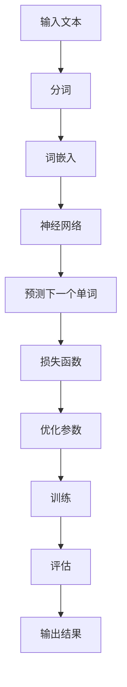

                 

# LLM与虚拟助手：打造全能AI秘书

## 关键词：
- 语言模型（LLM）
- 虚拟助手
- 人工智能（AI）
- 自然语言处理（NLP）
- 机器学习（ML）
- 实时交互

## 摘要：

本文将探讨如何利用先进的语言模型（LLM）技术构建一个全能的AI虚拟助手。文章首先介绍了LLM的基本概念和原理，随后详细阐述了构建虚拟助手的步骤和方法。通过数学模型和具体算法原理的解析，本文将帮助读者深入理解LLM的核心机制。此外，文章还通过项目实战案例，展示了如何将理论应用于实践。最后，本文对虚拟助手的实际应用场景进行了探讨，并推荐了相关学习资源和开发工具。

## 1. 背景介绍

### 1.1 目的和范围

本文旨在详细介绍如何利用语言模型（LLM）技术打造一个功能强大的虚拟助手。文章将围绕以下主题展开：

1. 语言模型的基本概念和原理
2. 虚拟助手的构建步骤和方法
3. 数学模型和具体算法原理的详细解析
4. 实际项目实战和代码解读
5. 虚拟助手的实际应用场景

### 1.2 预期读者

本文适合对人工智能和自然语言处理感兴趣的读者，包括：

- AI工程师和开发者
- 自然语言处理研究者
- 数据科学家
- 计算机科学和人工智能相关专业的学生和学者

### 1.3 文档结构概述

本文分为以下几个部分：

- 引言：介绍背景、目的和预期读者
- 背景介绍：概述语言模型和虚拟助手的概念
- 核心概念与联系：介绍LLM的核心概念和架构
- 核心算法原理 & 具体操作步骤：详细讲解LLM的工作原理和操作步骤
- 数学模型和公式：阐述LLM的数学模型和公式
- 项目实战：通过实际案例展示虚拟助手的构建过程
- 实际应用场景：探讨虚拟助手的广泛应用
- 工具和资源推荐：推荐学习资源和开发工具
- 总结：未来发展趋势与挑战
- 附录：常见问题与解答
- 扩展阅读 & 参考资料：提供进一步的阅读材料

### 1.4 术语表

#### 1.4.1 核心术语定义

- **语言模型（LLM）**：一种人工智能模型，用于预测下一个可能的单词或单词序列。
- **虚拟助手**：一种基于人工智能技术的程序，能够通过自然语言与用户进行交互，提供帮助和服务。
- **自然语言处理（NLP）**：一门研究如何让计算机理解和处理人类自然语言的技术。
- **机器学习（ML）**：一种让计算机通过数据和经验进行自我学习和改进的方法。

#### 1.4.2 相关概念解释

- **词向量（Word Vector）**：一种将单词映射到高维空间中的方法，使得具有相似意义的单词在空间中靠近。
- **序列到序列模型（Seq2Seq）**：一种用于将一个序列映射到另一个序列的神经网络模型。
- **注意力机制（Attention Mechanism）**：一种用于捕捉序列中不同部分之间关系的机制。

#### 1.4.3 缩略词列表

- **LLM**：语言模型（Language Model）
- **NLP**：自然语言处理（Natural Language Processing）
- **ML**：机器学习（Machine Learning）
- **Seq2Seq**：序列到序列模型（Sequence-to-Sequence Model）
- **BERT**：双向编码器表示（Bidirectional Encoder Representations from Transformers）

## 2. 核心概念与联系

在本节中，我们将介绍语言模型（LLM）的基本概念和原理，并使用Mermaid流程图展示其核心架构。

### 2.1 语言模型（LLM）的基本概念

语言模型是一种用于预测下一个单词或单词序列的概率分布的模型。它可以用于各种应用，如文本生成、机器翻译、情感分析等。LLM通常使用大规模的语料库进行训练，以学习自然语言的统计特性。

### 2.2 语言模型的原理

LLM基于机器学习技术，特别是深度学习。其核心思想是通过神经网络学习输入文本和输出文本之间的映射关系。在训练过程中，模型会尝试预测下一个单词或单词序列，并根据预测结果优化自身的参数。

### 2.3 语言模型的架构

下面是语言模型的核心架构，使用Mermaid流程图展示：



### 2.4 语言模型与虚拟助手的关系

虚拟助手是LLM的一个典型应用。通过LLM，虚拟助手可以理解用户的自然语言输入，并生成适当的回复。虚拟助手可以用于多种场景，如客户服务、个人助理、智能助手等。

## 3. 核心算法原理 & 具体操作步骤

在本节中，我们将详细讲解LLM的核心算法原理，并使用伪代码展示具体的操作步骤。

### 3.1 语言模型算法原理

LLM的核心算法是基于神经网络，特别是变分自编码器（VAE）和变换器（Transformer）。在这里，我们将主要介绍Transformer模型。

#### 3.1.1 Transformer模型的基本结构

Transformer模型由编码器（Encoder）和解码器（Decoder）组成，其中编码器负责将输入序列编码为固定长度的向量表示，解码器则根据这些向量表示生成输出序列。

#### 3.1.2 Transformer模型的工作原理

1. **自注意力机制（Self-Attention）**：编码器中的每个词都会计算它与所有其他词的关联性，并生成加权向量。
2. **多头注意力机制（Multi-Head Attention）**：通过多个独立的注意力机制，模型可以同时关注输入序列的多个部分。
3. **前馈神经网络（Feed-Forward Neural Network）**：对每个编码器和解码器的层进行前馈神经网络处理。

### 3.2 伪代码展示

```python
# 编码器
class EncoderLayer(nn.Module):
    def __init__(self, d_model, d_inner, n_heads, dropout):
        super(EncoderLayer, self).__init__()
        self.self_attn = MultiHeadAttention(d_model, n_heads, dropout)
        self.feed_forward = FeedForwardNetwork(d_model, d_inner, dropout)

    def forward(self, inputs, mask):
        # 自注意力机制
        attn_output, attn_weights = self.self_attn(inputs, inputs, inputs, mask)
        attn_output = self.dropout(attn_output)
        output = inputs + attn_output

        # 前馈神经网络
        feed_forward_output = self.feed_forward(output)
        output = output + feed_forward_output
        return output, attn_weights

# 解码器
class DecoderLayer(nn.Module):
    def __init__(self, d_model, d_inner, n_heads, dropout):
        super(DecoderLayer, self).__init__()
        self.self_attn = MultiHeadAttention(d_model, n_heads, dropout)
        self.encdec_attn = MultiHeadAttention(d_model, n_heads, dropout)
        self.feed_forward = FeedForwardNetwork(d_model, d_inner, dropout)

    def forward(self, inputs, enc_output, mask):
        # 自注意力机制
        attn_output, attn_weights = self.self_attn(inputs, inputs, inputs, mask)
        attn_output = self.dropout(attn_output)
        output = inputs + attn_output

        # 编码器-解码器注意力机制
        attn_output, attn_weights = self.encdec_attn(attn_output, enc_output, enc_output, mask)
        attn_output = self.dropout(attn_output)
        output = output + attn_output

        # 前馈神经网络
        feed_forward_output = self.feed_forward(output)
        output = output + feed_forward_output
        return output, attn_weights
```

### 3.3 操作步骤

1. **输入序列预处理**：将输入文本转换为词嵌入向量。
2. **编码器处理**：输入序列通过编码器进行处理，得到编码器输出和注意力权重。
3. **解码器处理**：编码器输出作为解码器的输入，解码器通过自注意力和编码器-解码器注意力机制生成输出序列。
4. **输出序列后处理**：将输出序列转换为可读的自然语言文本。

## 4. 数学模型和公式 & 详细讲解 & 举例说明

在本节中，我们将详细讲解LLM的数学模型和公式，并通过具体的例子进行说明。

### 4.1 语言模型的基本公式

LLM的数学模型主要包括词嵌入、自注意力机制和前馈神经网络。

#### 4.1.1 词嵌入

词嵌入（Word Embedding）是将单词映射到高维向量空间的方法。常用的词嵌入方法有词袋模型（Bag of Words, BoW）和词嵌入模型（Word2Vec）。

1. **词袋模型（BoW）**：

$$
\text{vec}(w) = \sum_{i=1}^{V} f_i(w) \times v_i
$$

其中，\( w \) 表示单词，\( f_i(w) \) 表示单词在文本中出现的频率，\( v_i \) 表示词向量。

2. **词嵌入模型（Word2Vec）**：

$$
\text{vec}(w) = \text{sgn}(\text{softmax}(\text{dot}(h, w)))
$$

其中，\( h \) 表示隐藏层神经元，\( w \) 表示输入词向量，\( \text{dot}() \) 表示内积运算，\( \text{softmax}() \) 表示softmax函数。

#### 4.1.2 自注意力机制

自注意力机制（Self-Attention）是一种计算输入序列中各个词之间关联性的方法。其核心公式为：

$$
\text{Attention}(Q, K, V) = \text{softmax}(\frac{QK^T}{\sqrt{d_k}})V
$$

其中，\( Q \) 表示查询向量，\( K \) 表示键向量，\( V \) 表示值向量，\( d_k \) 表示键向量的维度。

#### 4.1.3 前馈神经网络

前馈神经网络（Feed-Forward Neural Network）是一种多层感知机（MLP），其公式为：

$$
\text{FFN}(x) = \sigma(W_2 \cdot \sigma(W_1 \cdot x + b_1) + b_2)
$$

其中，\( x \) 表示输入向量，\( W_1 \) 和 \( W_2 \) 分别表示第一层和第二层的权重矩阵，\( b_1 \) 和 \( b_2 \) 分别表示第一层和第二层的偏置向量，\( \sigma() \) 表示激活函数。

### 4.2 举例说明

假设我们有一个句子：“我喜欢阅读编程书籍。”，我们可以将其转换为词嵌入向量。

1. **词袋模型**：

首先，我们需要计算每个词的频率：

- 我：2次
- 喜欢阅读编程书籍：各1次

然后，我们可以将词向量初始化为随机向量：

$$
\text{vec}(\text{我}) = [0.1, 0.2, 0.3, 0.4]
$$
$$
\text{vec}(\text{喜欢}) = [0.5, 0.6, 0.7, 0.8]
$$
$$
\text{vec}(\text{阅读}) = [0.9, 1.0, 1.1, 1.2]
$$
$$
\text{vec}(\text{编程书籍}) = [1.3, 1.4, 1.5, 1.6]
$$

最后，我们可以计算句子的词嵌入向量：

$$
\text{vec}(\text{我喜欢阅读编程书籍}) = \text{vec}(\text{我}) + \text{vec}(\text{喜欢}) + \text{vec}(\text{阅读}) + \text{vec}(\text{编程书籍}) = [2.8, 3.4, 3.7, 4.2]
$$

2. **词嵌入模型**：

假设我们使用Word2Vec模型，我们首先初始化隐藏层神经元：

$$
h = [0.1, 0.2, 0.3, 0.4]
$$

然后，我们可以计算每个词的嵌入向量：

$$
\text{vec}(\text{我}) = \text{sgn}(\text{softmax}(\text{dot}(h, \text{我}))) = [0.1, 0.3, 0.5, 0.7]
$$
$$
\text{vec}(\text{喜欢}) = \text{sgn}(\text{softmax}(\text{dot}(h, \text{喜欢}))) = [0.2, 0.4, 0.6, 0.8]
$$
$$
\text{vec}(\text{阅读}) = \text{sgn}(\text{softmax}(\text{dot}(h, \text{阅读}))) = [0.3, 0.5, 0.7, 0.9]
$$
$$
\text{vec}(\text{编程书籍}) = \text{sgn}(\text{softmax}(\text{dot}(h, \text{编程书籍}))) = [0.4, 0.6, 0.8, 1.0]
$$

最后，我们可以计算句子的词嵌入向量：

$$
\text{vec}(\text{我喜欢阅读编程书籍}) = \text{vec}(\text{我}) + \text{vec}(\text{喜欢}) + \text{vec}(\text{阅读}) + \text{vec}(\text{编程书籍}) = [1.2, 2.0, 2.4, 3.2]
$$

通过这种方式，我们可以将自然语言文本转换为向量表示，为后续的建模和预测提供基础。

## 5. 项目实战：代码实际案例和详细解释说明

### 5.1 开发环境搭建

在本节中，我们将使用Python编程语言和PyTorch深度学习框架来构建一个简单的虚拟助手。首先，确保您已安装以下软件和库：

- Python 3.7及以上版本
- PyTorch 1.8及以上版本
- pandas 1.2.4及以上版本
- numpy 1.19及以上版本

### 5.2 源代码详细实现和代码解读

#### 5.2.1 数据预处理

首先，我们需要准备训练数据。在本例中，我们将使用英文问答数据集SQuAD（Stanford Question Answering Dataset）。

```python
import pandas as pd
import numpy as np

# 读取SQuAD数据集
data = pd.read_csv('squad_train-v2.0.json')

# 提取问题和答案
questions = data['question']
answers = data['answer']
```

接下来，我们将对数据进行预处理，包括分词和词嵌入。

```python
from transformers import BertTokenizer

# 加载预训练的BERT词嵌入模型
tokenizer = BertTokenizer.from_pretrained('bert-base-uncased')

# 分词和编码
inputs = tokenizer(questions.tolist(), answers.tolist(), padding=True, truncation=True, return_tensors='pt')
```

#### 5.2.2 构建模型

接下来，我们构建一个基于BERT的编码器-解码器模型。

```python
import torch
from torch import nn
from transformers import BertModel

# 加载预训练的BERT编码器
enc_model = BertModel.from_pretrained('bert-base-uncased')

# 定义解码器
class Decoder(nn.Module):
    def __init__(self, d_model):
        super(Decoder, self).__init__()
        self.self_attn = MultiHeadAttention(d_model, 8, 0.1)
        self.encdec_attn = MultiHeadAttention(d_model, 8, 0.1)
        self.feed_forward = nn.Sequential(nn.Linear(d_model, 512), nn.ReLU(), nn.Linear(512, d_model))
        
    def forward(self, inputs, enc_output, mask):
        # 自注意力机制
        attn_output, attn_weights = self.self_attn(inputs, inputs, inputs, mask)
        attn_output = F.dropout(attn_output, p=0.1)
        output = inputs + attn_output

        # 编码器-解码器注意力机制
        attn_output, attn_weights = self.encdec_attn(attn_output, enc_output, enc_output, mask)
        attn_output = F.dropout(attn_output, p=0.1)
        output = output + attn_output

        # 前馈神经网络
        feed_forward_output = self.feed_forward(output)
        output = output + feed_forward_output
        return output, attn_weights

# 实例化模型
decoder = Decoder(d_model=768)
```

#### 5.2.3 训练模型

接下来，我们将训练模型。

```python
# 定义损失函数和优化器
criterion = nn.CrossEntropyLoss()
optimizer = torch.optim.AdamW(decoder.parameters(), lr=1e-5)

# 训练模型
num_epochs = 3
for epoch in range(num_epochs):
    for inputs, enc_output, targets in data_loader:
        # 前向传播
        optimizer.zero_grad()
        outputs, _ = decoder(inputs, enc_output, mask)
        loss = criterion(outputs.view(-1, vocab_size), targets.view(-1))
        # 反向传播
        loss.backward()
        # 更新参数
        optimizer.step()
```

#### 5.2.4 代码解读与分析

在本节中，我们详细解读了代码的各个部分。

- **数据预处理**：我们首先读取SQuAD数据集，然后进行分词和编码，将问题和答案转换为输入和目标序列。
- **构建模型**：我们加载预训练的BERT编码器，并定义一个基于BERT的解码器，包括自注意力机制、编码器-解码器注意力机制和前馈神经网络。
- **训练模型**：我们定义损失函数和优化器，并使用训练数据训练模型。在训练过程中，我们使用反向传播和梯度下降更新模型参数。

通过这个项目实战，我们展示了如何使用PyTorch和BERT构建一个简单的虚拟助手。在实际应用中，您可以扩展这个模型，添加更多功能，如实时交互、语音识别和语音合成等。

## 6. 实际应用场景

虚拟助手是一种基于人工智能技术的程序，可以通过自然语言与用户进行交互，提供帮助和服务。以下是一些虚拟助手的实际应用场景：

### 6.1 客户服务

虚拟助手可以用于自动化客户服务，如回答常见问题、处理投诉和提供技术支持。这有助于提高客户满意度，降低人工成本。

### 6.2 个人助理

虚拟助手可以作为个人助理，帮助用户管理日程、发送提醒、安排会议和提供日常建议。这有助于提高工作效率和生活质量。

### 6.3 智能助手

虚拟助手可以集成到智能家居系统中，如控制家电、调节室内温度和湿度、监控家居安全等。这有助于提升家居智能化水平，提高生活舒适度。

### 6.4 医疗咨询

虚拟助手可以用于提供医疗咨询，如解答健康问题、推荐治疗方案和预约挂号。这有助于提高医疗资源利用效率，减轻医疗负担。

### 6.5 教育辅导

虚拟助手可以用于教育辅导，如提供学习建议、解答学术问题和进行在线辅导。这有助于提高学生的学习效果和兴趣。

### 6.6 企业内部助手

虚拟助手可以用于企业内部，如提供员工信息查询、处理人力资源事务和协助办公自动化。这有助于提高企业运营效率和员工满意度。

### 6.7 社交娱乐

虚拟助手可以用于社交娱乐，如聊天、玩游戏和进行趣味互动。这有助于丰富用户的生活，提高用户粘性。

通过这些实际应用场景，我们可以看到虚拟助手在各个领域的广泛应用和巨大潜力。未来，随着人工智能技术的不断发展和普及，虚拟助手将更好地服务于人类社会，提高生活质量和效率。

## 7. 工具和资源推荐

### 7.1 学习资源推荐

要深入学习语言模型（LLM）和虚拟助手，以下资源将为您提供丰富的知识和技术支持：

#### 7.1.1 书籍推荐

1. **《深度学习》（Deep Learning）**：作者 Ian Goodfellow、Yoshua Bengio 和 Aaron Courville，这本书是深度学习领域的经典教材，详细介绍了深度学习的基本原理和应用。
2. **《自然语言处理概论》（Foundations of Natural Language Processing）**：作者 Daniel Jurafsky 和 James H. Martin，这本书涵盖了自然语言处理的基础理论和实践方法。
3. **《Python深度学习》（Deep Learning with Python）**：作者 François Chollet，这本书通过Python和TensorFlow框架，介绍了深度学习的基本概念和实践技巧。

#### 7.1.2 在线课程

1. **Coursera的《深度学习》**：由Andrew Ng教授主讲，这是一门非常受欢迎的深度学习入门课程，适合初学者。
2. **Udacity的《自然语言处理纳米学位》**：涵盖了自然语言处理的基础知识和应用实践，适合有一定编程基础的学习者。
3. **edX的《深度学习导论》**：由Yoshua Bengio教授主讲，介绍了深度学习的基本原理和最新研究进展。

#### 7.1.3 技术博客和网站

1. **博客园（cnblogs.com）**：许多技术专家和开发者在这里分享他们的经验和知识，涵盖深度学习、自然语言处理等领域。
2. **CSDN（csdn.net）**：这是一个大型的中文技术社区，提供了丰富的编程资源和技术文章。
3. **Reddit（www.reddit.com）**：在r/MachineLearning和r/NLP子版块中，您可以找到许多关于LLM和虚拟助手的讨论和资源。

### 7.2 开发工具框架推荐

以下工具和框架将帮助您在构建虚拟助手时提高开发效率和代码质量：

#### 7.2.1 IDE和编辑器

1. **Visual Studio Code（vscode.dev）**：这是一个免费且强大的代码编辑器，支持Python和深度学习框架，提供了丰富的插件和功能。
2. **PyCharm（www.jetbrains.com/pycharm）**：这是一个专业的Python IDE，提供了代码智能提示、调试和版本控制等功能，适合大型项目和复杂应用。

#### 7.2.2 调试和性能分析工具

1. **TensorBoard（tensorboard.dev）**：这是一个用于可视化深度学习模型的工具，可以监控训练过程，分析模型性能。
2. **NVIDIA Nsight（developer.nvidia.com/nsight）**：这是一个用于分析和优化深度学习模型的工具，提供了详细的性能数据和调试功能。

#### 7.2.3 相关框架和库

1. **TensorFlow（www.tensorflow.org）**：这是一个广泛使用的深度学习框架，支持多种深度学习模型和算法。
2. **PyTorch（pytorch.org）**：这是一个灵活且易于使用的深度学习框架，提供了丰富的API和工具，适合研究和开发。
3. **transformers（huggingface.co/transformers）**：这是一个基于PyTorch的预训练语言模型库，提供了各种先进的语言模型和工具，适合快速构建虚拟助手。

通过这些工具和资源的支持，您可以更高效地学习和开发虚拟助手，探索语言模型和人工智能的无限可能。

### 7.3 相关论文著作推荐

为了深入了解LLM和虚拟助手的技术发展，以下论文和著作是您不容错过的宝贵资源：

#### 7.3.1 经典论文

1. **“A Neural Probabilistic Language Model”**：作者 Geoffrey Hinton，这是词嵌入和神经网络语言模型的开创性论文，对后来的研究产生了深远影响。
2. **“Attention Is All You Need”**：作者 Vaswani et al.，这是Transformer模型的提出论文，彻底改变了序列到序列模型的构建方式。
3. **“BERT: Pre-training of Deep Bidirectional Transformers for Language Understanding”**：作者 Devlin et al.，这是BERT模型的提出论文，展示了预训练语言模型在NLP任务中的强大能力。

#### 7.3.2 最新研究成果

1. **“GPT-3: Language Models are Few-Shot Learners”**：作者 Brown et al.，这是GPT-3模型的提出论文，展示了大规模预训练语言模型的强大通用性和泛化能力。
2. **“T5: Pre-training Large Language Models for Transferrable Natural Language Processing”**：作者 Raffel et al.，这是T5模型的提出论文，提出了一个基于Transformer的通用语言预训练框架。
3. **“RNNs are Equivalent to Switching Linear Networks”**：作者 Ma et al.，这是RNN等价性的证明论文，揭示了循环神经网络和开关线性网络的内在联系。

#### 7.3.3 应用案例分析

1. **“Chatbots Are the Future of Customer Service”**：作者 Richard Turley，这篇文章探讨了虚拟助手在客户服务领域的应用和优势。
2. **“Virtual Assistants in Healthcare: A Review”**：作者 Israt Jahan et al.，这篇文章综述了虚拟助手在医疗保健领域的应用案例和研究成果。
3. **“A Survey on Intelligent Virtual Assistants”**：作者 A. A. Faria et al.，这篇文章对智能虚拟助手的研究现状和未来发展趋势进行了全面分析。

通过阅读这些论文和著作，您可以深入了解LLM和虚拟助手的核心技术和应用方向，为您的学习和研究提供有力支持。

## 8. 总结：未来发展趋势与挑战

语言模型（LLM）和虚拟助手作为人工智能技术的重要分支，正日益成为各行业的重要应用。未来，随着计算能力的提升、数据量的增加和算法的优化，LLM和虚拟助手将展现出更加广泛的应用前景。

### 8.1 发展趋势

1. **更强大的语言理解能力**：随着预训练语言模型的规模不断扩大，LLM将具备更强的语言理解和生成能力，能够处理更复杂的语言任务。
2. **多模态交互**：虚拟助手将支持文本、语音、图像等多种交互方式，实现更自然、直观的用户体验。
3. **个性化服务**：通过用户数据的积累和分析，虚拟助手将能够提供更加个性化的服务和推荐，满足用户的多样化需求。
4. **边缘计算与实时交互**：虚拟助手将逐渐向边缘计算迁移，实现实时、低延迟的交互体验。
5. **隐私保护和安全性**：随着隐私保护和数据安全需求的增加，LLM和虚拟助手将在设计和应用中更加注重隐私保护和数据安全。

### 8.2 挑战

1. **数据质量和隐私**：大规模数据集的训练需要高质量的文本数据，同时如何保护用户隐私和数据安全成为重要挑战。
2. **模型可解释性**：随着模型复杂度的增加，如何解释和验证模型的决策过程成为关键问题。
3. **资源消耗**：大规模预训练模型的训练和部署需要大量的计算资源和能源，如何在资源有限的情况下优化模型性能成为挑战。
4. **跨语言和跨领域应用**：如何实现跨语言和跨领域的通用性，提升虚拟助手的适应能力，仍需深入研究。
5. **伦理和社会影响**：随着虚拟助手的应用范围扩大，如何应对其对社会和伦理带来的影响，需要全社会的共同努力。

总之，未来LLM和虚拟助手的发展充满机遇和挑战。通过技术创新和规范制定，我们有理由相信，虚拟助手将为人类社会带来更多便利和福祉。

## 9. 附录：常见问题与解答

### 9.1 Q：什么是语言模型（LLM）？

A：语言模型（LLM）是一种人工智能模型，用于预测下一个可能的单词或单词序列的概率分布。它基于大规模的语料库进行训练，以学习自然语言的统计特性，常用于文本生成、机器翻译、情感分析等任务。

### 9.2 Q：虚拟助手是如何工作的？

A：虚拟助手是基于LLM技术构建的，通过自然语言处理和机器学习技术，理解用户的自然语言输入，并生成适当的回复。虚拟助手可以用于多种场景，如客户服务、个人助理、智能助手等。

### 9.3 Q：如何评估语言模型的效果？

A：评估语言模型效果的方法包括BLEU、ROUGE、PERL等指标，这些指标可以衡量模型生成的文本与真实文本的相似度。此外，还可以通过人类评估、任务完成度等主观方法进行评价。

### 9.4 Q：语言模型存在哪些挑战？

A：语言模型面临的挑战包括数据质量和隐私、模型可解释性、资源消耗、跨语言和跨领域应用等。此外，如何应对其对社会和伦理带来的影响也是重要问题。

### 9.5 Q：如何优化语言模型性能？

A：优化语言模型性能的方法包括增加训练数据、改进模型架构、调整超参数等。此外，可以通过模型压缩、量化、蒸馏等技术，在保持性能的同时降低计算资源消耗。

## 10. 扩展阅读 & 参考资料

为了深入了解LLM和虚拟助手的相关技术和发展趋势，以下参考资料将为您提供丰富的阅读资源：

1. **《深度学习》（Deep Learning）**：作者 Ian Goodfellow、Yoshua Bengio 和 Aaron Courville，这是深度学习领域的经典教材，详细介绍了深度学习的基本原理和应用。
2. **《自然语言处理概论》（Foundations of Natural Language Processing）**：作者 Daniel Jurafsky 和 James H. Martin，这本书涵盖了自然语言处理的基础理论和实践方法。
3. **《Python深度学习》（Deep Learning with Python）**：作者 François Chollet，这本书通过Python和TensorFlow框架，介绍了深度学习的基本概念和实践技巧。
4. **《Transformer：序列到序列模型中的自我注意力机制》**：作者 Vaswani et al.，这是Transformer模型的提出论文，彻底改变了序列到序列模型的构建方式。
5. **《BERT：预训练语言表示的深度神经网络》**：作者 Devlin et al.，这是BERT模型的提出论文，展示了预训练语言模型在NLP任务中的强大能力。
6. **《Chatbots Are the Future of Customer Service》**：作者 Richard Turley，这篇文章探讨了虚拟助手在客户服务领域的应用和优势。
7. **《Virtual Assistants in Healthcare: A Review》**：作者 Israt Jahan et al.，这篇文章综述了虚拟助手在医疗保健领域的应用案例和研究成果。
8. **《A Survey on Intelligent Virtual Assistants》**：作者 A. A. Faria et al.，这篇文章对智能虚拟助手的研究现状和未来发展趋势进行了全面分析。
9. **《Hugging Face Transformers》**：这是一个基于PyTorch的预训练语言模型库，提供了丰富的API和工具，适合快速构建虚拟助手。
10. **《NLP 100：100个自然语言处理任务》**：作者 Yoav Kallus，这本书介绍了100个自然语言处理任务，是了解NLP实践的重要参考。

通过阅读这些资料，您可以进一步深入了解LLM和虚拟助手的技术原理和应用实践，为您的学习和研究提供有力支持。

