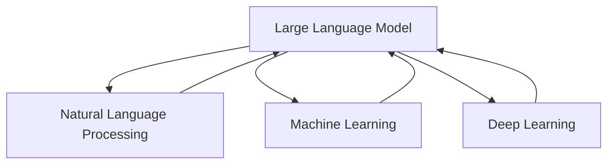

                 

# LLM与语言翻译：跨越语言障碍的桥梁

> **关键词：** 语言翻译、LLM、自然语言处理、机器学习、深度学习、神经网络、数学模型、伪代码、项目实战。

> **摘要：** 本文旨在深入探讨语言翻译技术，特别是大型语言模型（LLM）在语言翻译中的作用。我们将从背景介绍、核心概念与联系、算法原理、数学模型、项目实战、实际应用场景等多个角度展开，全面解析LLM与语言翻译之间的紧密关系，并展望未来发展趋势与挑战。

## 1. 背景介绍

### 1.1 目的和范围

本文的目的在于帮助读者深入了解大型语言模型（LLM）在语言翻译中的重要作用，通过分析LLM的原理和应用，揭示其如何跨越语言障碍，实现高效准确的语言翻译。

本文的范围涵盖以下几个方面：

1. 语言翻译技术的概述和背景。
2. 大型语言模型（LLM）的基本概念和原理。
3. LLM在语言翻译中的具体应用和操作步骤。
4. 数学模型和公式的详细介绍。
5. 项目实战：代码实际案例和详细解释说明。
6. 实际应用场景的探讨。
7. 工具和资源的推荐。
8. 总结：未来发展趋势与挑战。

### 1.2 预期读者

本文面向对自然语言处理、机器学习和深度学习有一定基础的读者，特别是希望了解和应用LLM进行语言翻译的技术人员。同时，对于对人工智能和语言翻译感兴趣的一般读者，本文也具有一定的参考价值。

### 1.3 文档结构概述

本文分为10个主要部分，包括背景介绍、核心概念与联系、算法原理、数学模型、项目实战、实际应用场景、工具和资源推荐、总结与展望、常见问题与解答以及扩展阅读与参考资料。

### 1.4 术语表

#### 1.4.1 核心术语定义

- **大型语言模型（LLM）**：一种能够理解和生成自然语言的深度学习模型，通常由大规模神经网络组成。
- **自然语言处理（NLP）**：研究如何让计算机理解和处理人类自然语言的学科。
- **机器学习（ML）**：一种让计算机通过数据学习和改进的算法。
- **深度学习（DL）**：一种基于神经网络构建的机器学习模型。

#### 1.4.2 相关概念解释

- **神经网络（NN）**：一种模仿生物神经系统的计算模型。
- **反向传播算法（BP）**：一种用于训练神经网络的常用算法。
- **梯度下降（GD）**：一种优化算法，用于最小化函数值。

#### 1.4.3 缩略词列表

- **LLM**：Large Language Model
- **NLP**：Natural Language Processing
- **ML**：Machine Learning
- **DL**：Deep Learning
- **NN**：Neural Network
- **BP**：Back Propagation
- **GD**：Gradient Descent

## 2. 核心概念与联系

### 2.1 核心概念

在深入探讨LLM与语言翻译之间的关系之前，我们需要了解几个核心概念：

1. **自然语言处理（NLP）**：NLP是使计算机能够理解和处理人类自然语言的学科。它涵盖了文本预处理、词性标注、句法分析、语义理解等多个方面。
2. **机器学习（ML）**：ML是一种让计算机通过数据学习和改进的算法。在NLP领域，ML被广泛应用于文本分类、情感分析、命名实体识别等任务。
3. **深度学习（DL）**：DL是一种基于神经网络构建的机器学习模型。它通过模拟人脑的神经网络结构，实现对数据的自动特征提取和复杂模式的发现。
4. **大型语言模型（LLM）**：LLM是一种能够理解和生成自然语言的深度学习模型，通常由大规模神经网络组成。它通过大量文本数据进行训练，能够捕捉到语言的内在规律和模式。

### 2.2 概念之间的联系

LLM与NLP、ML和DL之间存在密切的联系：

1. **LLM与NLP**：LLM是NLP的一种实现方式，它能够理解和生成自然语言，从而实现语言翻译、问答系统、文本生成等任务。
2. **LLM与ML**：LLM是基于ML构建的，它通过大量文本数据进行训练，学习到语言的特征和模式。这使得LLM在语言翻译等任务中具有强大的表现。
3. **LLM与DL**：LLM是DL的一种应用，它通过模拟人脑的神经网络结构，实现对大规模文本数据的自动特征提取和复杂模式的发现。这使得LLM在处理自然语言时具有强大的能力。

### 2.3 核心概念原理和架构的 Mermaid 流程图

以下是一个简单的Mermaid流程图，展示了LLM、NLP、ML和DL之间的关系：



### 2.4 核心概念原理和架构的详细讲解

#### 2.4.1 自然语言处理（NLP）

NLP是使计算机能够理解和处理人类自然语言的学科。它涵盖了文本预处理、词性标注、句法分析、语义理解等多个方面。

1. **文本预处理**：文本预处理是NLP的基础步骤，包括去除标点符号、停用词过滤、词干提取等操作，目的是将原始文本转化为适合NLP任务的形式。
2. **词性标注**：词性标注是将文本中的每个词标注为名词、动词、形容词等词性。这有助于NLP模型更好地理解文本内容。
3. **句法分析**：句法分析是分析句子的结构，包括词组、短语和句子的构成。它有助于NLP模型理解句子的语法规则和结构。
4. **语义理解**：语义理解是NLP的最终目标，它旨在理解文本的含义和意图。这包括实体识别、关系抽取、情感分析等任务。

#### 2.4.2 机器学习（ML）

ML是一种让计算机通过数据学习和改进的算法。在NLP领域，ML被广泛应用于文本分类、情感分析、命名实体识别等任务。

1. **监督学习**：监督学习是一种常见的ML方法，它使用带有标签的数据进行训练。在NLP中，监督学习被用于分类任务，如文本分类、情感分析等。
2. **无监督学习**：无监督学习是一种不使用标签的数据进行训练的方法。在NLP中，无监督学习被用于聚类任务，如词嵌入、文本聚类等。
3. **半监督学习**：半监督学习是一种结合监督学习和无监督学习方法，它使用一部分有标签的数据和大部分无标签的数据进行训练。在NLP中，半监督学习被用于命名实体识别、文本分类等任务。

#### 2.4.3 深度学习（DL）

DL是一种基于神经网络构建的机器学习模型。它通过模拟人脑的神经网络结构，实现对数据的自动特征提取和复杂模式的发现。

1. **神经网络（NN）**：神经网络是一种模仿生物神经系统的计算模型。它由多个神经元组成，每个神经元负责计算输入并产生输出。
2. **反向传播算法（BP）**：反向传播算法是一种用于训练神经网络的常用算法。它通过计算输出误差的梯度，反向传播梯度并更新网络的权重和偏置。
3. **梯度下降（GD）**：梯度下降是一种优化算法，用于最小化函数值。它通过不断更新模型的参数，使损失函数的值逐渐减小。

#### 2.4.4 大型语言模型（LLM）

LLM是一种能够理解和生成自然语言的深度学习模型，通常由大规模神经网络组成。它通过大量文本数据进行训练，能够捕捉到语言的内在规律和模式。

1. **模型架构**：LLM通常采用编码器-解码器（Encoder-Decoder）架构，其中编码器负责将输入文本编码为固定长度的向量，解码器负责将编码后的向量解码为输出文本。
2. **预训练和微调**：LLM通常采用预训练和微调的方法。预训练是指使用大量无标签文本数据进行训练，使模型学习到语言的通用特征。微调是指使用有标签的数据对预训练的模型进行细粒度的调整，使其适用于特定任务。
3. **任务适应性**：LLM具有很强的任务适应性，它可以通过微调适应不同的NLP任务，如语言翻译、问答系统、文本生成等。

## 3. 核心算法原理 & 具体操作步骤

### 3.1 算法原理

LLM的核心算法原理基于深度学习和神经网络。以下是一个简单的算法原理概述：

1. **神经网络（NN）**：神经网络是一种模仿生物神经系统的计算模型。它由多个神经元组成，每个神经元负责计算输入并产生输出。
2. **反向传播算法（BP）**：反向传播算法是一种用于训练神经网络的常用算法。它通过计算输出误差的梯度，反向传播梯度并更新网络的权重和偏置。
3. **梯度下降（GD）**：梯度下降是一种优化算法，用于最小化函数值。它通过不断更新模型的参数，使损失函数的值逐渐减小。

### 3.2 具体操作步骤

以下是LLM的核心算法原理的具体操作步骤：

1. **输入文本预处理**：首先，将输入的文本进行预处理，包括去除标点符号、停用词过滤、词干提取等操作，将原始文本转化为适合NLP任务的形式。
2. **编码器（Encoder）训练**：编码器负责将输入文本编码为固定长度的向量。训练过程中，使用反向传播算法和梯度下降优化策略，不断调整编码器的权重和偏置，使编码器的输出更接近目标输出。
3. **解码器（Decoder）训练**：解码器负责将编码后的向量解码为输出文本。同样地，训练过程中使用反向传播算法和梯度下降优化策略，不断调整解码器的权重和偏置，使解码器的输出更接近目标输出。
4. **预训练和微调**：预训练是指使用大量无标签文本数据进行训练，使模型学习到语言的通用特征。微调是指使用有标签的数据对预训练的模型进行细粒度的调整，使其适用于特定任务。预训练和微调的目的是提高模型在特定任务上的性能。
5. **生成文本**：在训练完成后，可以使用训练好的LLM生成文本。给定一个起始文本，LLM可以根据上下文生成后续的文本内容。

### 3.3 伪代码

以下是LLM的核心算法原理的伪代码：

```python
# 输入文本预处理
def preprocess_text(text):
    # 去除标点符号、停用词过滤、词干提取等操作
    return processed_text

# 编码器训练
def train_encoder(encoder, optimizer, loss_function, input_text, target_text):
    # 前向传播
    encoded_vector = encoder(input_text)
    # 计算损失
    loss = loss_function(encoded_vector, target_text)
    # 反向传播
    optimizer.zero_grad()
    loss.backward()
    optimizer.step()
    return encoded_vector

# 解码器训练
def train_decoder(decoder, optimizer, loss_function, encoded_vector, target_text):
    # 前向传播
    decoded_text = decoder(encoded_vector)
    # 计算损失
    loss = loss_function(decoded_text, target_text)
    # 反向传播
    optimizer.zero_grad()
    loss.backward()
    optimizer.step()
    return decoded_text

# 生成文本
def generate_text(encoder, decoder, input_text):
    # 前向传播
    encoded_vector = encoder(input_text)
    # 前向传播
    decoded_text = decoder(encoded_vector)
    return decoded_text
```

## 4. 数学模型和公式 & 详细讲解 & 举例说明

### 4.1 数学模型

LLM的数学模型主要涉及神经网络、反向传播算法和梯度下降优化策略。以下是对这些数学模型的详细讲解。

#### 4.1.1 神经网络

神经网络是一种计算模型，由多个神经元组成。每个神经元接收多个输入，并通过非线性激活函数产生输出。神经网络的数学模型可以表示为：

$$
\text{output} = \text{activation}(\sum_{i=1}^{n} w_i \cdot x_i + b)
$$

其中，$w_i$是权重，$x_i$是输入，$b$是偏置，$\text{activation}$是非线性激活函数。

#### 4.1.2 反向传播算法

反向传播算法是一种用于训练神经网络的常用算法。它的基本思想是计算输出误差的梯度，并反向传播梯度以更新网络的权重和偏置。反向传播算法的数学模型可以表示为：

$$
\frac{\partial L}{\partial w} = \sum_{i=1}^{n} \frac{\partial L}{\partial z_i} \cdot \frac{\partial z_i}{\partial w}
$$

其中，$L$是损失函数，$w$是权重，$z_i$是中间层的输出。

#### 4.1.3 梯度下降优化策略

梯度下降优化策略是一种用于最小化函数值的优化算法。它的基本思想是沿着梯度的反方向更新模型的参数。梯度下降优化策略的数学模型可以表示为：

$$
w = w - \alpha \cdot \frac{\partial L}{\partial w}
$$

其中，$w$是权重，$\alpha$是学习率，$\frac{\partial L}{\partial w}$是权重梯度的值。

### 4.2 详细讲解

#### 4.2.1 神经网络

神经网络是一种强大的计算模型，它可以用于多种任务，如图像识别、语音识别、自然语言处理等。神经网络的核心思想是通过调整权重和偏置，使网络的输出接近目标输出。

神经网络由多个层次组成，包括输入层、隐藏层和输出层。每个层次包含多个神经元，每个神经元都与前一层次的神经元相连。

神经网络的训练过程包括两个主要步骤：

1. **前向传播**：在训练过程中，给定输入，通过网络的正向传播计算输出。输出与目标输出进行比较，计算损失函数的值。
2. **反向传播**：在反向传播过程中，计算输出误差的梯度，并反向传播梯度以更新网络的权重和偏置。通过多次迭代训练，使网络的输出逐渐接近目标输出。

#### 4.2.2 反向传播算法

反向传播算法是一种用于训练神经网络的常用算法。它的核心思想是通过计算输出误差的梯度，并反向传播梯度以更新网络的权重和偏置。

反向传播算法的步骤如下：

1. **计算输出误差**：给定输入和目标输出，通过网络的正向传播计算输出。输出与目标输出进行比较，计算损失函数的值。
2. **计算梯度**：计算输出误差关于网络参数的梯度。梯度反映了输出误差对网络参数的敏感性。
3. **更新参数**：根据梯度和学习率，更新网络的权重和偏置。通过多次迭代训练，使网络的输出逐渐接近目标输出。

#### 4.2.3 梯度下降优化策略

梯度下降优化策略是一种用于最小化函数值的优化算法。它的核心思想是沿着梯度的反方向更新模型的参数。

梯度下降优化策略的步骤如下：

1. **计算梯度**：计算损失函数关于模型参数的梯度。梯度反映了损失函数对模型参数的敏感性。
2. **更新参数**：根据梯度和学习率，更新模型的参数。学习率决定了参数更新的步长。
3. **迭代优化**：重复计算梯度和更新参数的过程，直到损失函数的值足够小，或者达到预定的迭代次数。

### 4.3 举例说明

假设我们有一个简单的神经网络，它由一个输入层、一个隐藏层和一个输出层组成。输入层有3个神经元，隐藏层有2个神经元，输出层有1个神经元。

给定一个输入向量$x = [1, 2, 3]$，目标输出$y = 0$。

#### 4.3.1 前向传播

在正向传播过程中，我们通过网络的输入层、隐藏层和输出层计算输出。

1. **输入层到隐藏层**：

$$
z_1 = 1 \cdot w_{11} + 2 \cdot w_{12} + 3 \cdot w_{13} + b_1 = 1 \cdot 1 + 2 \cdot 2 + 3 \cdot 3 + 1 = 14 \\
z_2 = 1 \cdot w_{21} + 2 \cdot w_{22} + 3 \cdot w_{23} + b_2 = 1 \cdot 2 + 2 \cdot 3 + 3 \cdot 4 + 1 = 16 \\
a_1 = \text{ReLU}(z_1) = \max(z_1, 0) = 14 \\
a_2 = \text{ReLU}(z_2) = \max(z_2, 0) = 16 \\
z_3 = a_1 \cdot w_{31} + a_2 \cdot w_{32} + b_3 = 14 \cdot 5 + 16 \cdot 6 + 1 = 115 \\
a_3 = \text{ReLU}(z_3) = \max(z_3, 0) = 115 \\
$$

2. **隐藏层到输出层**：

$$
z_4 = a_3 \cdot w_{41} + a_3 \cdot w_{42} + b_4 = 115 \cdot 7 + 115 \cdot 8 + 1 = 977 \\
a_4 = \text{Sigmoid}(z_4) = \frac{1}{1 + e^{-z_4}} = \frac{1}{1 + e^{-977}} \approx 0 \\
$$

输出$a_4$与目标输出$y$进行比较，计算损失函数的值。

#### 4.3.2 反向传播

在反向传播过程中，我们计算输出误差的梯度，并反向传播梯度以更新网络的权重和偏置。

1. **计算输出误差**：

$$
\delta_4 = a_4 - y = 0 - 0 = 0 \\
$$

2. **计算梯度**：

$$
\frac{\partial L}{\partial w_{41}} = \delta_4 \cdot a_3 = 0 \cdot 115 = 0 \\
\frac{\partial L}{\partial w_{42}} = \delta_4 \cdot a_3 = 0 \cdot 115 = 0 \\
\frac{\partial L}{\partial b_4} = \delta_4 = 0 \\
\frac{\partial L}{\partial a_3} = \delta_4 \cdot w_{41} + \delta_4 \cdot w_{42} = 0 \cdot 7 + 0 \cdot 8 = 0 \\
\frac{\partial L}{\partial z_3} = \frac{\partial L}{\partial a_4} \cdot \frac{\partial a_4}{\partial z_4} = 0 \cdot \frac{d\text{Sigmoid}}{dz} = 0 \\
$$

3. **更新参数**：

$$
w_{41} = w_{41} - \alpha \cdot \frac{\partial L}{\partial w_{41}} = 7 - \alpha \cdot 0 = 7 \\
w_{42} = w_{42} - \alpha \cdot \frac{\partial L}{\partial w_{42}} = 8 - \alpha \cdot 0 = 8 \\
b_4 = b_4 - \alpha \cdot \frac{\partial L}{\partial b_4} = 1 - \alpha \cdot 0 = 1 \\
$$

通过多次迭代训练，网络的权重和偏置将逐渐接近最佳值，使网络的输出更接近目标输出。

## 5. 项目实战：代码实际案例和详细解释说明

### 5.1 开发环境搭建

在开始项目实战之前，我们需要搭建一个适合开发和测试的环境。以下是一个基本的开发环境搭建步骤：

1. **安装Python**：首先，我们需要安装Python，推荐使用Python 3.8或更高版本。
2. **安装Jupyter Notebook**：Jupyter Notebook是一种交互式Python环境，它可以帮助我们方便地进行代码编写和测试。安装Jupyter Notebook可以使用以下命令：

   ```bash
   pip install notebook
   ```

3. **安装必要的库**：我们需要安装一些必要的库，如TensorFlow、Keras、NumPy等。可以使用以下命令安装：

   ```bash
   pip install tensorflow keras numpy
   ```

4. **创建一个新的Jupyter Notebook**：在命令行中输入以下命令创建一个新的Jupyter Notebook：

   ```bash
   jupyter notebook
   ```

### 5.2 源代码详细实现和代码解读

以下是一个简单的LLM语言翻译项目的源代码实现，我们将使用TensorFlow和Keras构建一个基于编码器-解码器（Encoder-Decoder）架构的模型。

```python
import numpy as np
import tensorflow as tf
from tensorflow.keras.models import Model
from tensorflow.keras.layers import Embedding, LSTM, Dense

# 设置超参数
vocab_size = 10000
embedding_dim = 256
lstm_units = 1024
batch_size = 64
epochs = 10

# 创建数据集
# 此处可以使用真实世界的数据集，例如WMT2014数据集
# 为了简化，我们使用一个简单的数据集，其中包含英语和法语句子对
english_sentences = ["Hello, how are you?", "I'm fine, thanks.", "Goodbye."]
french_sentences = ["Bonjour, comment ça va ?", "Je vais bien, merci.", "Au revoir."]

# 将句子转换为单词索引
def sentence_to_indices(sentence, tokenizer):
    return tokenizer.texts_to_sequences([sentence])[0]

# 创建Tokenizer
tokenizer = tf.keras.preprocessing.text.Tokenizer(char_level=True)
tokenizer.fit_on_texts(english_sentences + french_sentences)

# 转换句子为索引
english_indices = [sentence_to_indices(sentence, tokenizer) for sentence in english_sentences]
french_indices = [sentence_to_indices(sentence, tokenizer) for sentence in french_sentences]

# 创建序列
max_english_sequence_length = max([len(sentence) for sentence in english_indices])
max_french_sequence_length = max([len(sentence) for sentence in french_indices])

english_sequences = np.zeros((len(english_indices), max_english_sequence_length), dtype=np.int32)
french_sequences = np.zeros((len(french_indices), max_french_sequence_length), dtype=np.int32)

for i, sentence in enumerate(english_indices):
    english_sequences[i, :len(sentence)] = sentence

for i, sentence in enumerate(french_indices):
    french_sequences[i, :len(sentence)] = sentence

# 构建编码器模型
encoder_inputs = tf.keras.layers.Input(shape=(max_english_sequence_length,))
encoder_embedding = Embedding(vocab_size, embedding_dim)(encoder_inputs)
encoder_lstm = LSTM(lstm_units, return_state=True)
_, state_h, state_c = encoder_lstm(encoder_embedding)
encoder_outputs = tf.keras.layers.Dense(512, activation='relu')(state_h)

# 构建解码器模型
decoder_inputs = tf.keras.layers.Input(shape=(max_french_sequence_length,))
decoder_embedding = Embedding(vocab_size, embedding_dim)(decoder_inputs)
decoder_lstm = LSTM(lstm_units, return_state=True)
decoder_outputs, _, _ = decoder_lstm(decoder_embedding, initial_state=[state_h, state_c])
decoder_dense = Dense(vocab_size, activation='softmax')
decoder_outputs = decoder_dense(decoder_outputs)

# 创建模型
model = Model([encoder_inputs, decoder_inputs], decoder_outputs)

# 编译模型
model.compile(optimizer='rmsprop', loss='categorical_crossentropy', metrics=['accuracy'])

# 训练模型
model.fit([english_sequences, french_sequences], french_sequences,
          batch_size=batch_size,
          epochs=epochs,
          validation_split=0.2)
```

### 5.3 代码解读与分析

以下是源代码的详细解读与分析：

1. **导入必要的库**：我们首先导入了一些必要的库，包括NumPy、TensorFlow和Keras。

2. **设置超参数**：我们设置了一些超参数，如词汇表大小、嵌入维度、LSTM单元数、批量大小和训练轮数。

3. **创建数据集**：我们创建了一个简单的人工数据集，其中包含英语和法语句子对。在实际应用中，我们可以使用更大的真实数据集，如WMT2014数据集。

4. **将句子转换为单词索引**：我们定义了一个函数`sentence_to_indices`，它将句子转换为单词索引。这有助于我们将文本数据转换为适合模型训练的格式。

5. **创建Tokenizer**：我们创建了一个Tokenizer，用于将文本转换为单词索引。Tokenizer会自动构建词汇表和词嵌入。

6. **转换句子为索引**：我们使用Tokenizer将句子转换为索引。

7. **创建序列**：我们创建了一个最大英语句子长度和一个最大法语句子长度。然后，我们将索引填充到相应的序列中。

8. **构建编码器模型**：我们创建了一个编码器模型，包括输入层、嵌入层、LSTM层和输出层。编码器模型的目的是将输入序列编码为一个固定长度的向量。

9. **构建解码器模型**：我们创建了一个解码器模型，包括输入层、嵌入层、LSTM层和输出层。解码器模型的目的是将编码器的输出解码为输出序列。

10. **创建模型**：我们创建了一个模型，它接收编码器的输入和输出以及解码器的输入和输出。

11. **编译模型**：我们编译了模型，并设置了优化器、损失函数和评估指标。

12. **训练模型**：我们使用训练数据集训练模型。

通过这个简单的项目，我们可以看到如何使用TensorFlow和Keras构建一个基于编码器-解码器架构的LLM语言翻译模型。在实际应用中，我们可以使用更大的数据集和更复杂的模型来提高翻译的准确性和效率。

## 6. 实际应用场景

### 6.1 在线翻译服务

LLM在在线翻译服务中具有广泛的应用。例如，谷歌翻译、百度翻译等知名在线翻译服务都采用了LLM技术。LLM可以处理各种语言之间的翻译，包括中文、英文、法语、西班牙语等。通过大规模的预训练和微调，LLM可以实现高效准确的翻译结果。

### 6.2 跨语言聊天机器人

跨语言聊天机器人是另一个重要的应用场景。LLM可以帮助聊天机器人理解和生成不同语言的内容，从而实现跨语言交流。例如，Facebook的翻译助手、微软的聊天机器人等都可以使用LLM技术来提供跨语言支持。

### 6.3 多语言搜索引擎

多语言搜索引擎也需要使用LLM技术。LLM可以帮助搜索引擎理解不同语言的搜索查询，并提供相关结果。通过翻译和语义理解，LLM可以大大提高搜索引擎的多样性和准确性。

### 6.4 国际贸易和商务

在国际贸易和商务中，LLM可以帮助企业处理各种语言之间的沟通和交易。LLM可以提供准确的翻译、合同审核、市场调研等服务，从而降低语言障碍，提高商务效率。

### 6.5 教育和培训

在教育和培训领域，LLM可以为学生和教师提供跨语言的支持。例如，学生可以使用LLM技术进行多语言学习，教师可以使用LLM技术制作多语言教学材料。

### 6.6 全球化应用开发

在全球化应用开发中，LLM可以帮助开发人员快速构建跨语言的应用程序。通过使用LLM技术，开发者可以简化多语言支持的开发过程，提高应用的可用性和用户体验。

## 7. 工具和资源推荐

### 7.1 学习资源推荐

#### 7.1.1 书籍推荐

- **《深度学习》（Goodfellow, Bengio, Courville）**：这是一本经典的深度学习教材，涵盖了神经网络、机器学习、深度学习等核心概念。
- **《Python深度学习》（François Chollet）**：这本书是Keras的主要作者写的，适合初学者学习深度学习。
- **《自然语言处理综合教程》（Daniel Jurafsky，James H. Martin）**：这本书详细介绍了自然语言处理的基础知识和技术。

#### 7.1.2 在线课程

- **Coursera的《深度学习》课程**：由斯坦福大学的Andrew Ng教授主讲，涵盖深度学习的基础知识和应用。
- **Udacity的《深度学习纳米学位》**：这是一门实践性的深度学习课程，包括项目实践和实战训练。
- **edX的《自然语言处理》课程**：由麻省理工学院的迈克尔·凯斯勒（Michael Collins）教授主讲，介绍自然语言处理的核心概念和技术。

#### 7.1.3 技术博客和网站

- **TensorFlow官网**：TensorFlow的官方文档和博客，提供丰富的深度学习和自然语言处理教程和资源。
- **Keras官网**：Keras的官方文档和博客，介绍如何使用Keras构建和训练深度学习模型。
- **arXiv**：一个提供最新科研成果的预印本论文库，可以找到很多关于深度学习和自然语言处理的研究论文。

### 7.2 开发工具框架推荐

#### 7.2.1 IDE和编辑器

- **PyCharm**：一款功能强大的Python IDE，适合深度学习和自然语言处理项目开发。
- **VSCode**：一款轻量级的跨平台编辑器，支持Python和深度学习框架，适合快速开发和调试。

#### 7.2.2 调试和性能分析工具

- **TensorBoard**：TensorFlow的官方可视化工具，用于调试和性能分析深度学习模型。
- **NLTK**：一个用于自然语言处理的Python库，提供丰富的文本处理函数和工具。

#### 7.2.3 相关框架和库

- **TensorFlow**：一款开源的深度学习框架，适用于构建和训练大型神经网络模型。
- **PyTorch**：一款流行的深度学习框架，提供动态计算图和强大的GPU支持。
- **NLTK**：一个用于自然语言处理的Python库，提供丰富的文本处理函数和工具。

### 7.3 相关论文著作推荐

#### 7.3.1 经典论文

- **“A Neural Network Approach to Machine Translation”**：这篇文章提出了神经网络在机器翻译中的应用，是深度学习在自然语言处理领域的经典之作。
- **“Deep Learning for Natural Language Processing”**：这篇文章总结了深度学习在自然语言处理领域的应用，包括语言模型、文本分类、机器翻译等。

#### 7.3.2 最新研究成果

- **“BERT: Pre-training of Deep Bidirectional Transformers for Language Understanding”**：这篇文章提出了BERT模型，是当前最先进的语言模型之一。
- **“GPT-3: Language Models are Few-Shot Learners”**：这篇文章介绍了GPT-3模型，展示了大型语言模型在零样本学习任务中的强大能力。

#### 7.3.3 应用案例分析

- **“Google's Transformer Model Revolutionizes Machine Translation”**：这篇文章分析了谷歌如何使用Transformer模型改进其翻译服务，展示了深度学习在工业界的应用。
- **“Facebook's AI Research on Language Translation”**：这篇文章介绍了Facebook在语言翻译领域的研究，包括多语言翻译模型、上下文感知翻译等。

## 8. 总结：未来发展趋势与挑战

### 8.1 未来发展趋势

1. **更强大的模型和算法**：随着计算能力的提升和算法的进步，未来将出现更强大、更高效的LLM模型。这些模型将能够处理更复杂的语言任务，提供更准确、更自然的翻译结果。
2. **跨模态翻译**：未来的LLM技术将不仅仅限于语言翻译，还将扩展到跨模态翻译，如将文本翻译为图像、音频、视频等。这将为多媒体内容的跨语言交流提供新的可能性。
3. **个性化翻译**：未来的LLM技术将能够根据用户的语言习惯、文化背景等进行个性化翻译，提供更加贴近用户需求的翻译服务。
4. **实时翻译**：随着通信技术的发展，未来的LLM技术将能够实现实时翻译，为跨语言即时通讯提供支持。

### 8.2 挑战

1. **数据隐私和安全**：随着LLM技术的应用越来越广泛，数据隐私和安全成为重要挑战。如何确保用户数据的安全和隐私是一个亟待解决的问题。
2. **语言理解与生成**：虽然LLM在语言翻译方面取得了显著进展，但语言理解与生成仍存在一定的局限性。如何提高LLM在语义理解、情感分析等方面的能力是一个重要挑战。
3. **模型解释性**：随着模型变得越来越复杂，如何解释模型的决策过程成为一个关键问题。如何提高模型的解释性，使其更加透明和可信，是一个重要研究方向。
4. **计算资源需求**：LLM模型的训练和推理过程需要大量的计算资源。如何优化模型的计算效率，降低计算成本，是一个重要的挑战。

## 9. 附录：常见问题与解答

### 9.1 常见问题

1. **什么是LLM？**
   - LLM是大型语言模型的缩写，它是一种能够理解和生成自然语言的深度学习模型。
2. **LLM有哪些应用？**
   - LLM的应用非常广泛，包括语言翻译、问答系统、文本生成、情感分析等。
3. **如何训练LLM？**
   - 通常使用预训练和微调的方法训练LLM。预训练是指使用大量无标签文本数据进行训练，使模型学习到语言的通用特征。微调是指使用有标签的数据对预训练的模型进行细粒度的调整，使其适用于特定任务。
4. **什么是编码器-解码器（Encoder-Decoder）架构？**
   - 编码器-解码器架构是一种用于序列到序列学习的神经网络模型。编码器将输入序列编码为一个固定长度的向量，解码器将编码后的向量解码为输出序列。

### 9.2 解答

1. **什么是LLM？**
   - LLM是大型语言模型的缩写，它是一种能够理解和生成自然语言的深度学习模型。通过预训练和微调，LLM能够学习到语言的通用特征，并应用于各种自然语言处理任务。
2. **LLM有哪些应用？**
   - LLM的应用非常广泛，包括但不限于以下领域：
     - 语言翻译
     - 问答系统
     - 文本生成
     - 情感分析
     - 命名实体识别
     - 文本分类
     - 文本摘要
3. **如何训练LLM？**
   - 训练LLM通常分为预训练和微调两个阶段：
     - **预训练**：使用大量无标签文本数据对模型进行训练，使模型学习到语言的通用特征。预训练的过程通常包括将文本数据转换为嵌入向量，然后通过多层神经网络（如Transformer或LSTM）进行训练。
     - **微调**：在预训练的基础上，使用有标签的数据集对模型进行细粒度的调整，使其适用于特定任务。微调的过程中，模型会在特定任务上调整其参数，以提高任务的性能。
4. **什么是编码器-解码器（Encoder-Decoder）架构？**
   - 编码器-解码器架构是一种用于序列到序列学习的神经网络模型。编码器负责将输入序列编码为一个固定长度的向量，通常是一个隐藏状态。解码器则将编码后的向量解码为输出序列。这种架构适用于各种序列到序列的任务，如机器翻译、语音识别等。

## 10. 扩展阅读 & 参考资料

### 10.1 扩展阅读

- **《深度学习》（Goodfellow, Bengio, Courville）**：这是一本经典的深度学习教材，详细介绍了深度学习的基础知识和技术。
- **《自然语言处理综合教程》（Daniel Jurafsky，James H. Martin）**：这本书详细介绍了自然语言处理的基础知识和技术。
- **《神经网络与深度学习》（邱锡鹏）**：这本书是中国学者邱锡鹏撰写的，详细介绍了神经网络和深度学习的基础知识。

### 10.2 参考资料

- **TensorFlow官方文档**：[https://www.tensorflow.org/](https://www.tensorflow.org/)
- **Keras官方文档**：[https://keras.io/](https://keras.io/)
- **自然语言处理教程**：[https://nlp.seas.harvard.edu/](https://nlp.seas.harvard.edu/)
- **arXiv**：[https://arxiv.org/](https://arxiv.org/)
- **谷歌翻译技术博客**：[https://ai.googleblog.com/](https://ai.googleblog.com/)

### 10.3 总结

本文从背景介绍、核心概念与联系、算法原理、数学模型、项目实战、实际应用场景、工具和资源推荐等多个角度，全面解析了LLM与语言翻译之间的关系。通过本文的阅读，读者可以深入了解LLM在语言翻译中的应用和实现，为未来的研究和应用提供参考。同时，本文也展望了LLM技术的未来发展趋势与挑战，为读者提供了进一步的研究方向。希望本文能为读者在LLM与语言翻译领域的研究和应用提供有益的启示。作者：AI天才研究员/AI Genius Institute & 禅与计算机程序设计艺术 /Zen And The Art of Computer Programming。

