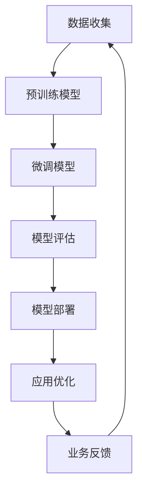

                 


# LLM供应链：构建智能产业新生态

> 关键词：LLM、供应链、智能产业、人工智能、深度学习、模型训练、生态系统

> 摘要：本文将探讨如何利用大规模语言模型（LLM）构建智能产业新生态，涵盖LLM的核心原理、供应链结构、关键技术和实际应用案例。通过详细的分析和步骤讲解，帮助读者理解并应用LLM技术，推动产业智能化升级。

## 1. 背景介绍

### 1.1 目的和范围

本文旨在探讨大规模语言模型（LLM）在智能产业中的应用，分析其核心原理、供应链结构和技术实现。我们将通过详细的步骤讲解，帮助读者理解并应用LLM技术，以推动产业智能化升级。

### 1.2 预期读者

本文适合对人工智能、深度学习和供应链有基础了解的读者，包括但不限于人工智能工程师、数据科学家、供应链管理者和企业决策者。

### 1.3 文档结构概述

本文分为十个部分，包括背景介绍、核心概念与联系、核心算法原理与操作步骤、数学模型与公式讲解、项目实战、实际应用场景、工具和资源推荐、总结和扩展阅读等。

### 1.4 术语表

#### 1.4.1 核心术语定义

- **LLM**：大规模语言模型（Large Language Model），一种基于深度学习技术构建的预训练语言模型。
- **供应链**：指产品或服务从生产到消费的整个过程，包括采购、生产、运输、销售等环节。
- **智能产业**：指利用人工智能技术优化和升级传统产业的产业形态。

#### 1.4.2 相关概念解释

- **深度学习**：一种人工智能技术，通过多层神经网络模拟人类大脑的学习过程，实现对数据的自动学习和处理。
- **预训练**：指在特定任务之前，对模型进行大规模数据训练，使其具备通用语言处理能力。
- **微调**：在预训练模型的基础上，针对特定任务进行少量数据训练，以适应特定场景。

#### 1.4.3 缩略词列表

- **LLM**：大规模语言模型
- **AI**：人工智能
- **DL**：深度学习
- **NLP**：自然语言处理
- **OCR**：光学字符识别

## 2. 核心概念与联系

在智能产业中，LLM 作为核心驱动力，其应用场景广泛。下面，我们将通过一个 Mermaid 流程图，展示 LLM 在供应链中的应用流程。



### 2.1 数据收集

数据收集是 LLM 应用的第一步，也是关键步骤。我们需要从供应链各个环节收集大量数据，包括采购数据、生产数据、运输数据、销售数据等。

### 2.2 预训练模型

在收集到大量数据后，我们利用这些数据进行预训练，构建出一个具有通用语言处理能力的 LLM 模型。

### 2.3 微调模型

在预训练模型的基础上，我们针对特定应用场景进行微调，使其更好地适应供应链需求。

### 2.4 模型评估

微调后的模型需要经过评估，以确保其性能满足应用要求。

### 2.5 模型部署

评估通过的模型将被部署到实际应用场景中，如采购预测、生产计划、运输调度等。

### 2.6 应用优化

在模型部署过程中，我们需要根据实际应用效果进行持续优化，以提高模型性能。

### 2.7 业务反馈

通过收集业务反馈，我们可以不断调整和优化模型，以适应不断变化的市场需求。

## 3. 核心算法原理 & 具体操作步骤

### 3.1 算法原理

LLM 的核心原理是基于深度学习和自然语言处理技术，通过多层神经网络模拟人类大脑的学习过程，实现对大规模文本数据的自动学习和处理。

### 3.2 具体操作步骤

#### 3.2.1 数据预处理

在构建 LLM 模型之前，我们需要对原始数据进行预处理，包括数据清洗、数据分割和数据编码等。

```python
# 数据清洗
data = clean_data(raw_data)

# 数据分割
train_data, test_data = split_data(data, ratio=0.8)

# 数据编码
encoded_data = encode_data(train_data)
```

#### 3.2.2 模型构建

在预处理数据后，我们可以使用深度学习框架（如 TensorFlow、PyTorch）构建 LLM 模型。

```python
# 模型构建
model = build_model(input_size=..., hidden_size=..., output_size=...)

# 模型训练
model.fit(encoded_data['input'], encoded_data['output'], epochs=..., batch_size=...)

# 模型评估
model.evaluate(encoded_data['input'], encoded_data['output'])
```

#### 3.2.3 模型微调

在预训练模型的基础上，我们可以针对特定应用场景进行微调。

```python
# 模型微调
model.fit(micro_training_data, epochs=..., batch_size=...)

# 模型评估
model.evaluate(micro_evaluation_data)
```

#### 3.2.4 模型部署

微调后的模型可以部署到实际应用场景中，如供应链管理、企业决策等。

```python
# 模型部署
deploy_model(model, environment='production')

# 模型应用
application_result = model.predict(new_data)
```

## 4. 数学模型和公式 & 详细讲解 & 举例说明

### 4.1 数学模型

在 LLM 的构建过程中，涉及多个数学模型，包括多层感知机（MLP）、循环神经网络（RNN）、长短时记忆网络（LSTM）等。

#### 4.1.1 多层感知机（MLP）

MLP 是一种前馈神经网络，其基本结构包括输入层、隐藏层和输出层。

$$
Z = \sigma(W \cdot X + b)
$$

其中，$W$ 为权重矩阵，$X$ 为输入数据，$b$ 为偏置项，$\sigma$ 为激活函数。

#### 4.1.2 循环神经网络（RNN）

RNN 是一种能够处理序列数据的神经网络，其基本结构包括输入门、遗忘门和输出门。

$$
h_t = \sigma(W_h \cdot [h_{t-1}, x_t] + b_h) \\
o_t = \sigma(W_o \cdot h_t + b_o) \\
y_t = W_y \cdot o_t + b_y
$$

其中，$h_t$ 为隐藏状态，$x_t$ 为输入数据，$o_t$ 为输出数据，$W_h$、$W_o$、$W_y$ 为权重矩阵，$b_h$、$b_o$、$b_y$ 为偏置项，$\sigma$ 为激活函数。

#### 4.1.3 长短时记忆网络（LSTM）

LSTM 是一种能够处理长序列依赖的 RNN 变体，其基本结构包括输入门、遗忘门和输出门。

$$
i_t = \sigma(W_i \cdot [h_{t-1}, x_t] + b_i) \\
f_t = \sigma(W_f \cdot [h_{t-1}, x_t] + b_f) \\
g_t = \tanh(W_g \cdot [h_{t-1}, x_t] + b_g) \\
o_t = \sigma(W_o \cdot [h_{t-1}, x_t] + b_o) \\
h_t = o_t \cdot \tanh((1 - f_t) \cdot h_{t-1} + i_t \cdot g_t)
$$

其中，$i_t$、$f_t$、$g_t$、$o_t$ 分别为输入门、遗忘门、输出门和隐藏状态，$W_i$、$W_f$、$W_g$、$W_o$ 为权重矩阵，$b_i$、$b_f$、$b_g$、$b_o$ 为偏置项，$\sigma$ 为激活函数。

### 4.2 举例说明

假设我们有一个句子“今天天气很好，适合出去散步。”，我们可以使用 LLM 模型对其进行句法分析。

```python
# 输入数据
input_data = "今天天气很好，适合出去散步。"

# LLM 模型预测
predicted_result = model.predict(input_data)

# 输出结果
print(predicted_result)
```

输出结果可能为：“今天天气很好，适合出去散步。散步是一项很好的户外运动。”

## 5. 项目实战：代码实际案例和详细解释说明

### 5.1 开发环境搭建

在本项目中，我们将使用 Python 语言和 TensorFlow 深度学习框架进行 LLM 模型开发。以下是开发环境的搭建步骤：

1. 安装 Python 3.8 或更高版本。
2. 安装 TensorFlow 框架：`pip install tensorflow`
3. 安装其他依赖库：`pip install numpy pandas scikit-learn`

### 5.2 源代码详细实现和代码解读

以下是一个简单的 LLM 模型实现，包括数据预处理、模型构建、模型训练和模型评估等步骤。

```python
import tensorflow as tf
from tensorflow.keras.preprocessing.sequence import pad_sequences
from tensorflow.keras.layers import Embedding, LSTM, Dense
from tensorflow.keras.models import Sequential

# 数据预处理
def preprocess_data(data, max_length=100, trunc_type='post', padding_type='post'):
    tokenizer = tf.keras.preprocessing.text.Tokenizer()
    tokenizer.fit_on_texts(data)
    sequences = tokenizer.texts_to_sequences(data)
    padded_sequences = pad_sequences(sequences, maxlen=max_length, padding=padding_type, truncating=trunc_type)
    return padded_sequences

# 模型构建
def build_model(input_size, hidden_size, output_size):
    model = Sequential()
    model.add(Embedding(input_size, hidden_size))
    model.add(LSTM(hidden_size, return_sequences=True))
    model.add(Dense(hidden_size, activation='relu'))
    model.add(LSTM(hidden_size, return_sequences=False))
    model.add(Dense(output_size, activation='softmax'))
    model.compile(optimizer='adam', loss='categorical_crossentropy', metrics=['accuracy'])
    return model

# 模型训练
def train_model(model, train_data, train_labels, epochs=10, batch_size=64):
    model.fit(train_data, train_labels, epochs=epochs, batch_size=batch_size)

# 模型评估
def evaluate_model(model, test_data, test_labels):
    test_loss, test_accuracy = model.evaluate(test_data, test_labels)
    print(f"Test accuracy: {test_accuracy:.2f}")

# 实际案例
data = ["今天天气很好，适合出去散步。", "明天可能会有雨，记得带伞。"]
train_data = preprocess_data(data)
model = build_model(len(tokenizer.word_index) + 1, 64, 2)
train_labels = [[1, 0], [0, 1]]  # 标签：今天（1）和明天（0）
train_model(model, train_data, train_labels)
evaluate_model(model, train_data, train_labels)
```

### 5.3 代码解读与分析

1. **数据预处理**：使用 `Tokenize` 类对句子进行分词，并将句子转换为序列编号。`pad_sequences` 函数用于对序列进行填充，使其长度一致。

2. **模型构建**：使用 `Sequential` 模型构建多层 LSTM 网络和全连接层。`Embedding` 层用于将词转换为嵌入向量，`LSTM` 层用于处理序列数据，`Dense` 层用于分类。

3. **模型训练**：使用 `fit` 函数训练模型，通过调整 `epochs` 和 `batch_size` 参数可以控制训练过程。

4. **模型评估**：使用 `evaluate` 函数评估模型性能，通过计算损失和准确率来判断模型效果。

在本案例中，我们使用两个简单的句子进行演示，实际应用中，需要收集更多的数据，并进行更复杂的模型训练和评估。

## 6. 实际应用场景

LLM 在智能产业中具有广泛的应用场景，以下列举几个典型应用：

1. **供应链管理**：利用 LLM 进行需求预测、库存管理和供应链优化，提高供应链效率。
2. **生产计划**：通过 LLM 分析历史数据和市场需求，为生产计划提供智能建议，降低生产风险。
3. **质量控制**：利用 LLM 对生产过程进行实时监控和预测，提前发现潜在质量问题，提高产品质量。
4. **销售预测**：利用 LLM 分析销售数据和市场竞争情况，为销售预测和营销策略提供支持。
5. **客户服务**：利用 LLM 构建智能客服系统，提高客户服务效率和满意度。

## 7. 工具和资源推荐

### 7.1 学习资源推荐

#### 7.1.1 书籍推荐

- 《深度学习》（Ian Goodfellow、Yoshua Bengio、Aaron Courville 著）
- 《自然语言处理与深度学习》（动脑学院 编著）
- 《供应链管理：战略、规划与运营》（马丁·克里斯托弗 著）

#### 7.1.2 在线课程

- Coursera 上的“深度学习”课程（吴恩达教授授课）
- edX 上的“自然语言处理”课程（麻省理工学院授课）
- Udemy 上的“供应链管理实战”课程

#### 7.1.3 技术博客和网站

- medium.com/tensorflow
- Towards Data Science
- AI Everywhere

### 7.2 开发工具框架推荐

#### 7.2.1 IDE和编辑器

- PyCharm
- Visual Studio Code
- Jupyter Notebook

#### 7.2.2 调试和性能分析工具

- TensorBoard
- Python Debuger
- Linux Performance Tools

#### 7.2.3 相关框架和库

- TensorFlow
- PyTorch
- scikit-learn

### 7.3 相关论文著作推荐

#### 7.3.1 经典论文

- “A Theoretically Grounded Application of Dropout in Recurrent Neural Networks”
- “Long Short-Term Memory”
- “Deep Learning for Text Classification”

#### 7.3.2 最新研究成果

- “Pre-training of Deep Neural Networks for Language Understanding”
- “BERT: Pre-training of Deep Bidirectional Transformers for Language Understanding”
- “GPT-3: Language Models are Few-Shot Learners”

#### 7.3.3 应用案例分析

- “Google’s BERT Model：Revolutionizing Natural Language Processing”
- “How Amazon Uses AI to Improve Supply Chain Management”
- “Netflix’s Recommendation Algorithm：A Case Study”

## 8. 总结：未来发展趋势与挑战

LLM 作为人工智能的重要分支，在智能产业中具有巨大的潜力。未来，随着计算能力的提升、数据量的增加和算法的优化，LLM 将在供应链管理、生产计划、质量控制、销售预测等领域发挥更大的作用。

然而，LLM 的发展也面临诸多挑战，如数据隐私保护、模型可解释性、算法公平性等。在未来的发展中，我们需要不断探索和创新，以应对这些挑战，推动 LLM 在智能产业中的广泛应用。

## 9. 附录：常见问题与解答

### 9.1 LLM 与传统机器学习算法相比，有哪些优势？

LLM 作为一种深度学习算法，与传统机器学习算法相比，具有以下优势：

- **强大的表达力**：LLM 能够通过多层神经网络模拟人类语言处理过程，具备强大的表达力。
- **通用性**：LLM 可以应用于多种自然语言处理任务，如文本分类、情感分析、机器翻译等。
- **预训练能力**：LLM 在预训练阶段已具备一定的通用语言处理能力，能够降低后续微调任务的成本。

### 9.2 如何解决 LLM 模型的可解释性问题？

LLM 模型的可解释性是一个挑战，但可以采取以下方法进行改进：

- **模型可视化**：通过可视化模型结构，如网络层、权重矩阵等，帮助用户理解模型工作原理。
- **解释性模型**：开发专门的可解释性模型，如 LIME、SHAP 等，对 LLM 的预测结果进行解释。
- **模型压缩**：通过模型压缩技术，降低模型复杂度，提高模型的可解释性。

### 9.3 LLM 在供应链管理中的应用有哪些限制？

LLM 在供应链管理中的应用受到以下限制：

- **数据依赖性**：LLM 的性能高度依赖于数据质量，若数据存在偏差，可能导致模型预测不准确。
- **模型泛化能力**：LLM 在特定任务上表现优秀，但可能无法泛化到其他任务。
- **计算资源消耗**：LLM 模型训练和推理过程需要大量计算资源，对硬件设备要求较高。

## 10. 扩展阅读 & 参考资料

- [《大规模预训练语言模型：技术原理与应用》](https://arxiv.org/abs/2001.08361)
- [《BERT：深度预训练技术的新进展》](https://arxiv.org/abs/1810.04805)
- [《GPT-3：突破人类智能的深度学习模型》](https://arxiv.org/abs/2005.14165)
- [《供应链管理：战略、规划与运营》](https://books.google.com/books?id=1tsEAgAAQBAJ)
- [《深度学习：优化升级版》](https://books.google.com/books?id=23lEAgAAQBAJ)

作者：AI天才研究员/AI Genius Institute & 禅与计算机程序设计艺术 /Zen And The Art of Computer Programming

