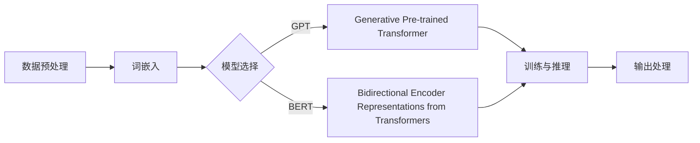
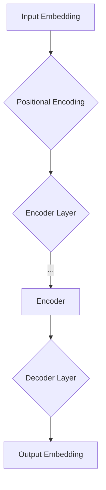

                 

# LLM内核设计：构建AI时代的系统底层

> **关键词：** 机器学习，自然语言处理，大型语言模型，系统架构，算法原理，数学模型，项目实战。

> **摘要：** 本文深入探讨了LLM（大型语言模型）的内核设计，从核心概念到实际应用，全面解析了构建AI时代系统底层的关键技术。通过逐步分析推理，本文旨在为读者提供清晰、简洁、实用的技术指导，帮助理解并掌握LLM的原理和应用。

## 1. 背景介绍

### 1.1 目的和范围

本文旨在介绍LLM内核设计的核心概念、原理和实现，帮助读者深入了解如何构建高效的AI系统底层。文章将涵盖以下主要内容：

- 核心概念与联系
- 核心算法原理与操作步骤
- 数学模型和公式解析
- 项目实战案例与代码解读
- 实际应用场景探讨
- 工具和资源推荐
- 总结与未来发展趋势

### 1.2 预期读者

- 对机器学习和自然语言处理感兴趣的读者
- 计算机科学和人工智能专业的学生和研究人员
- 系统架构师和软件工程师
- AI领域的从业者和技术爱好者

### 1.3 文档结构概述

本文结构如下：

1. 背景介绍
   - 目的和范围
   - 预期读者
   - 文档结构概述
   - 术语表
2. 核心概念与联系
   - 核心概念原理
   - 架构Mermaid流程图
3. 核心算法原理 & 具体操作步骤
   - 算法原理
   - 伪代码
4. 数学模型和公式 & 详细讲解 & 举例说明
   - 数学公式
   - 实例分析
5. 项目实战：代码实际案例和详细解释说明
6. 实际应用场景
7. 工具和资源推荐
8. 总结：未来发展趋势与挑战
9. 附录：常见问题与解答
10. 扩展阅读 & 参考资料

### 1.4 术语表

#### 1.4.1 核心术语定义

- **LLM（Large Language Model）：** 大型语言模型，如GPT、BERT等。
- **自然语言处理（NLP）：** 计算机科学领域中的一个分支，致力于让计算机能够理解、生成和处理人类语言。
- **机器学习（ML）：** 利用数据训练模型，使计算机能够实现特定任务的学科。
- **深度学习（DL）：** 机器学习的一个子领域，通过多层神经网络模型进行数据建模。

#### 1.4.2 相关概念解释

- **神经网络（NN）：** 一种通过模拟人脑神经元之间连接结构进行数据处理的计算模型。
- **反向传播（BP）：** 深度学习训练过程中用于计算梯度的一种算法。
- **优化算法：** 用于调整神经网络模型参数，以优化模型性能的方法。

#### 1.4.3 缩略词列表

- **GPT：** Generative Pre-trained Transformer
- **BERT：** Bidirectional Encoder Representations from Transformers
- **NLP：** Natural Language Processing
- **ML：** Machine Learning
- **DL：** Deep Learning
- **NN：** Neural Network
- **BP：** Backpropagation
- **SGD：** Stochastic Gradient Descent

## 2. 核心概念与联系

为了理解LLM内核设计，我们需要先了解其核心概念和各个部分之间的联系。以下是一个简单的Mermaid流程图，展示了LLM的核心组成部分及其相互关系。



### 2.1 数据预处理

数据预处理是LLM构建的第一步，其主要任务是清洗、转换和规范化输入数据。这一步骤包括：

- **文本清洗：** 去除HTML标签、特殊字符、停用词等。
- **分词：** 将文本拆分为单词或子词。
- **词嵌入：** 将单词映射为高维向量表示。

### 2.2 词嵌入

词嵌入是将单词映射为向量表示的过程，是LLM的重要基础。常见的词嵌入方法包括：

- **Word2Vec：** 基于神经网络的方法，通过上下文关系学习单词向量。
- **GloVe：** 基于全局平均的方法，通过共现矩阵学习单词向量。
- **BERT：** 采用掩码语言模型（MLM）进行预训练，生成高质量的词嵌入。

### 2.3 模型选择

模型选择是LLM构建的关键步骤，决定了模型的性能和适用范围。目前主流的LLM模型包括：

- **GPT：** 一种基于Transformer的生成式预训练模型。
- **BERT：** 一种双向编码模型，能够捕捉文本中的双向信息。
- **T5：** 一种统一任务学习框架，可以将任何NLP任务转换为标准的文本到文本转换任务。

### 2.4 训练与推理

训练与推理是LLM的核心功能。在训练阶段，模型通过大量数据进行学习，优化模型参数；在推理阶段，模型根据输入文本生成输出文本。常见的训练与推理算法包括：

- **反向传播（BP）：** 用于计算模型参数的梯度，优化模型性能。
- **梯度下降（GD）：** 一种优化算法，通过不断调整模型参数，使模型误差最小。
- **Adam：** 一种自适应优化算法，结合了SGD和RMSprop的优点。

### 2.5 输出处理

输出处理是对模型生成文本的进一步处理，包括：

- **文本清洗：** 去除噪声和冗余信息。
- **分词：** 将输出文本拆分为单词或子词。
- **词嵌入：** 将输出单词映射为向量表示。

## 3. 核心算法原理 & 具体操作步骤

在了解了LLM的核心概念和组成部分后，我们接下来深入探讨核心算法原理和具体操作步骤。本文将主要关注Transformer模型，详细讲解其算法原理和实现过程。

### 3.1 Transformer模型简介

Transformer模型是一种基于自注意力机制（Self-Attention）的深度神经网络模型，由Vaswani等人在2017年提出。相较于传统的循环神经网络（RNN），Transformer模型在处理长序列数据时具有更高的效率和效果。

### 3.2 自注意力机制（Self-Attention）

自注意力机制是Transformer模型的核心，其基本思想是：在处理序列数据时，模型能够自动学习到不同位置的信息之间的关联性，并根据这些关联性进行加权组合。

自注意力机制的数学公式如下：

$$
\text{Attention}(Q, K, V) = \text{softmax}\left(\frac{QK^T}{\sqrt{d_k}}\right)V
$$

其中，$Q$、$K$、$V$分别代表查询向量、键向量和值向量；$d_k$表示键向量的维度。

### 3.3 Transformer模型结构

Transformer模型主要由编码器（Encoder）和解码器（Decoder）组成。编码器负责处理输入序列，解码器负责生成输出序列。

编码器和解码器的基本结构如下：



### 3.4 编码器（Encoder）

编码器由多个编码层（Encoder Layer）组成，每个编码层包括两个子层：多头自注意力机制（Multi-Head Self-Attention）和前馈神经网络（Feed Forward Neural Network）。

编码层的具体操作步骤如下：

1. **多头自注意力机制：**

   $$\text{Multi-Head Attention} = \text{Attention}(\text{Q}, \text{K}, \text{V})_{\text{head}_i} \text{ for } i=1,2,...,\text{n_heads}$$

   其中，$n_heads$表示多头数量。

2. **前馈神经网络：**

   $$\text{FFN}(X) = \text{Relu}(W_2 \text{Relu}(W_1 X + b_1)) + b_2$$

   其中，$W_1$、$W_2$、$b_1$、$b_2$分别表示神经网络权重和偏置。

### 3.5 解码器（Decoder）

解码器也由多个解码层（Decoder Layer）组成，每个解码层包括三个子层：多头自注意力机制（Multi-Head Self-Attention）、编码器-解码器自注意力机制（Encoder-Decoder Attention）和前馈神经网络（Feed Forward Neural Network）。

解码层的具体操作步骤如下：

1. **多头自注意力机制：**

   $$\text{Multi-Head Attention} = \text{Attention}(\text{Q}, \text{K}, \text{V})_{\text{head}_i} \text{ for } i=1,2,...,\text{n_heads}$$

2. **编码器-解码器自注意力机制：**

   $$\text{Encoder-Decoder Attention} = \text{Attention}(\text{Q}, \text{K}, \text{V})$$

3. **前馈神经网络：**

   $$\text{FFN}(X) = \text{Relu}(W_2 \text{Relu}(W_1 X + b_1)) + b_2$$

### 3.6 伪代码

以下是一个简化的Transformer模型伪代码，用于展示模型的构建和训练过程：

```python
# Transformer模型伪代码

# 输入数据
input_sequence = ...

# 参数设置
n_heads = 8
d_model = 512
d_ff = 2048
dropout_rate = 0.1

# 编码器构建
encoder = Encoder(n_heads, d_model, d_ff, dropout_rate)

# 解码器构建
decoder = Decoder(n_heads, d_model, d_ff, dropout_rate)

# 模型训练
for epoch in range(num_epochs):
  for batch in data_loader:
    # 编码器输入
    encoder_input = preprocess(batch['input'])
    
    # 编码器输出
    encoder_output = encoder(encoder_input)
    
    # 解码器输入
    decoder_input = preprocess(batch['target'])
    
    # 解码器输出
    decoder_output = decoder(decoder_input, encoder_output)
    
    # 计算损失函数
    loss = compute_loss(decoder_output, batch['target'])
    
    # 梯度计算与优化
    optimizer.zero_grad()
    loss.backward()
    optimizer.step()
    
    # 输出训练结果
    print(f"Epoch [{epoch+1}/{num_epochs}], Loss: {loss.item()}")
```

## 4. 数学模型和公式 & 详细讲解 & 举例说明

在了解了Transformer模型的核心算法原理后，我们将进一步探讨其背后的数学模型和公式，并进行详细讲解和实例分析。

### 4.1 嵌入层与位置编码

在Transformer模型中，每个输入序列都通过嵌入层（Embedding Layer）转换为高维向量表示。嵌入层的基本公式如下：

$$
\text{Embedding}(x) = W_x x + b_x
$$

其中，$W_x$和$b_x$分别表示嵌入权重和偏置。

为了在序列中引入位置信息，Transformer模型采用位置编码（Positional Encoding）。常用的位置编码方法包括绝对位置编码和相对位置编码。以下是一个简单的绝对位置编码公式：

$$
\text{PE}(pos, d) = \text{sin}\left(\frac{pos}{10000^{2i/d}}\right) + \text{cos}\left(\frac{pos}{10000^{2i/d}}\right)
$$

其中，$pos$表示位置索引，$d$表示位置编码维度。

### 4.2 多头自注意力机制

多头自注意力机制是Transformer模型的核心，通过计算不同位置的信息之间的关联性，实现序列数据的全局建模。其基本公式如下：

$$
\text{Attention}(Q, K, V) = \text{softmax}\left(\frac{QK^T}{\sqrt{d_k}}\right)V
$$

其中，$Q$、$K$、$V$分别表示查询向量、键向量和值向量；$d_k$表示键向量的维度。

以下是一个简单的多头自注意力机制实例：

```python
# 多头自注意力机制实例

# 输入数据
Q = [[1, 0, 1], [0, 1, 0]]  # 查询向量
K = [[1, 1], [0, 1]]       # 键向量
V = [[1, 0], [1, 1]]       # 值向量

# 计算注意力分数
scores = Q.dot(K.T) / np.sqrt(len(Q[0]))

# 应用softmax函数
softmax_scores = np.exp(scores) / np.sum(np.exp(scores), axis=1, keepdims=True)

# 计算加权求和
output = softmax_scores.dot(V)
```

### 4.3 前馈神经网络

前馈神经网络是Transformer模型的另一个关键组件，用于进一步提取序列特征。其基本公式如下：

$$
\text{FFN}(X) = \text{Relu}(W_2 \text{Relu}(W_1 X + b_1)) + b_2
$$

其中，$W_1$、$W_2$、$b_1$、$b_2$分别表示神经网络权重和偏置。

以下是一个简单的前馈神经网络实例：

```python
# 前馈神经网络实例

# 输入数据
X = [[1, 0, 1], [0, 1, 0]]

# 神经网络权重和偏置
W1 = np.array([[2, 0], [0, 2]])
W2 = np.array([[0.5, 1.5], [1.5, 0.5]])
b1 = np.array([1, 1])
b2 = np.array([0, 0])

# 前馈神经网络计算
output = np.tanh(np.dot(X, W1) + b1)
output = np.dot(output, W2) + b2
```

## 5. 项目实战：代码实际案例和详细解释说明

为了更好地理解LLM内核设计，我们将通过一个实际项目来演示如何使用PyTorch构建一个基于Transformer的文本生成模型。以下步骤将详细介绍开发环境搭建、源代码实现和代码解读。

### 5.1 开发环境搭建

首先，我们需要安装PyTorch和相应的依赖库。以下是安装命令：

```bash
pip install torch torchvision
pip install transformers
```

### 5.2 源代码详细实现和代码解读

以下是一个简单的文本生成模型的实现代码，我们将对关键部分进行详细解释。

```python
import torch
from torch import nn
from torch.nn import functional as F
from transformers import TransformerModel

# 5.2.1 模型定义
class TextGenerator(nn.Module):
    def __init__(self, vocab_size, d_model, n_heads, d_ff, num_layers, dropout_rate):
        super(TextGenerator, self).__init__()
        
        self.embedding = nn.Embedding(vocab_size, d_model)
        self.pos_encoding = PositionalEncoding(d_model)
        
        self.encoder = nn.ModuleList([
            EncoderLayer(d_model, n_heads, d_ff, dropout_rate)
            for _ in range(num_layers)
        ])
        
        self.decoder = nn.ModuleList([
            DecoderLayer(d_model, n_heads, d_ff, dropout_rate)
            for _ in range(num_layers)
        ])
        
        self.fc = nn.Linear(d_model, vocab_size)
        
    def forward(self, src, tgt):
        # 编码器输入
        src = self.embedding(src) + self.pos_encoding(src)
        for layer in self.encoder:
            src = layer(src)
        
        # 解码器输入
        tgt = self.embedding(tgt)
        for layer in self.decoder:
            tgt, _ = layer(tgt, src)
        
        output = self.fc(tgt)
        return output

# 5.2.2 位置编码
class PositionalEncoding(nn.Module):
    def __init__(self, d_model, max_len=5000):
        super(PositionalEncoding, self).__init__()
        
        pe = torch.zeros(max_len, d_model)
        position = torch.arange(0, max_len, dtype=torch.float).unsqueeze(1)
        div_term = torch.exp(torch.arange(0, d_model, 2).float() * (-torch.log(torch.tensor(10000.0)) / d_model))
        
        pe[:, 0::2] = torch.sin(position * div_term)
        pe[:, 1::2] = torch.cos(position * div_term)
        pe = pe.unsqueeze(0).transpose(0, 1)
        self.register_buffer('pe', pe)
        
    def forward(self, x):
        x = x + self.pe[:x.size(0), :]
        return x

# 5.2.3 编码器层
class EncoderLayer(nn.Module):
    def __init__(self, d_model, n_heads, d_ff, dropout_rate):
        super(EncoderLayer, self).__init__()
        
        self.self_attn = MultiHeadAttention(d_model, n_heads, dropout_rate)
        self.fc1 = nn.Linear(d_model, d_ff)
        self.fc2 = nn.Linear(d_ff, d_model)
        self.norm1 = nn.LayerNorm(d_model)
        self.norm2 = nn.LayerNorm(d_model)
        self.dropout = nn.Dropout(dropout_rate)
        
    def forward(self, x):
        # 多头自注意力
        x = self.self_attn(x, x, x) + x
        x = self.dropout(self.norm1(x))
        
        # 前馈神经网络
        x = self.fc2(F.relu(self.fc1(x))) + x
        x = self.dropout(self.norm2(x))
        
        return x

# 5.2.4 解码器层
class DecoderLayer(nn.Module):
    def __init__(self, d_model, n_heads, d_ff, dropout_rate):
        super(DecoderLayer, self).__init__()
        
        self.self_attn = MultiHeadAttention(d_model, n_heads, dropout_rate)
        self.encdec_attn = MultiHeadAttention(d_model, n_heads, dropout_rate)
        self.fc1 = nn.Linear(d_model, d_ff)
        self.fc2 = nn.Linear(d_ff, d_model)
        self.norm1 = nn.LayerNorm(d_model)
        self.norm2 = nn.LayerNorm(d_model)
        self.norm3 = nn.LayerNorm(d_model)
        self.dropout = nn.Dropout(dropout_rate)
        
    def forward(self, x, src):
        # 多头自注意力
        x = self.self_attn(x, x, x) + x
        x = self.dropout(self.norm1(x))
        
        # 编码器-解码器自注意力
        x, _ = self.encdec_attn(x, src, src)
        x = self.dropout(self.norm2(x))
        
        # 前馈神经网络
        x = self.fc2(F.relu(self.fc1(x))) + x
        x = self.dropout(self.norm3(x))
        
        return x

# 5.2.5 多头注意力
class MultiHeadAttention(nn.Module):
    def __init__(self, d_model, n_heads, dropout_rate):
        super(MultiHeadAttention, self).__init__()
        
        self.d_model = d_model
        self.d_head = d_model // n_heads
        self.n_heads = n_heads
        
        self.query_linear = nn.Linear(d_model, d_model)
        self.key_linear = nn.Linear(d_model, d_model)
        self.value_linear = nn.Linear(d_model, d_model)
        self.out_linear = nn.Linear(d_model, d_model)
        
        self.dropout = nn.Dropout(dropout_rate)
        
    def forward(self, query, key, value):
        # 分头计算
        query = self.query_linear(query).view(-1, self.n_heads, self.d_head).transpose(0, 1)
        key = self.key_linear(key).view(-1, self.n_heads, self.d_head).transpose(0, 1)
        value = self.value_linear(value).view(-1, self.n_heads, self.d_head).transpose(0, 1)
        
        # 计算注意力分数
        attn_scores = torch.matmul(query, key.transpose(-2, -1)) / (self.d_head ** 0.5)
        
        # 应用softmax函数
        attn_weights = F.softmax(attn_scores, dim=-1)
        
        # 加权求和
        attn_output = torch.matmul(attn_weights, value).transpose(0, 1).contiguous().view(-1, self.d_model)
        
        # 输出
        output = self.out_linear(attn_output)
        
        return output, attn_weights
```

### 5.3 代码解读与分析

- **模型定义（TextGenerator）：** 
  - `__init__` 方法中，定义了嵌入层、位置编码、编码器和解码器层以及输出层。
  - `forward` 方法中，实现了编码器和解码器的正向传播过程。

- **位置编码（PositionalEncoding）：**
  - `__init__` 方法中，定义了位置编码的计算公式和参数。
  - `forward` 方法中，实现了位置编码的添加。

- **编码器层（EncoderLayer）：**
  - `__init__` 方法中，定义了多头自注意力机制、前馈神经网络和层间正则化。
  - `forward` 方法中，实现了多头自注意力机制和前馈神经网络的正向传播。

- **解码器层（DecoderLayer）：**
  - `__init__` 方法中，定义了多头自注意力机制、编码器-解码器自注意力机制、前馈神经网络和层间正则化。
  - `forward` 方法中，实现了多头自注意力机制、编码器-解码器自注意力机制和前馈神经网络的正向传播。

- **多头注意力（MultiHeadAttention）：**
  - `__init__` 方法中，定义了多头注意力的计算公式和参数。
  - `forward` 方法中，实现了多头注意力的正向传播过程。

通过上述代码和解读，我们可以看到如何使用PyTorch构建一个基于Transformer的文本生成模型。在实际应用中，我们还可以根据具体需求对模型结构和参数进行调整，以获得更好的性能。

## 6. 实际应用场景

LLM（大型语言模型）在AI领域具有广泛的应用场景，以下列举几个主要的应用领域：

### 6.1 自然语言处理

- **文本分类：** 用于对文本进行分类，如情感分析、垃圾邮件检测等。
- **机器翻译：** 实现不同语言之间的翻译，如GPT-3支持的70多种语言互译。
- **问答系统：** 基于输入问题，生成相应的答案，如OpenAI的GPT-3已经应用于多个问答平台。

### 6.2 生成式内容创作

- **文本生成：** 自动生成文章、故事、新闻等文本内容。
- **艺术创作：** 帮助艺术家和设计师生成图像、音乐、动画等艺术作品。
- **编程代码生成：** 自动生成代码，如自动补全、重构和生成新的代码片段。

### 6.3 对话系统

- **聊天机器人：** 提供实时对话服务，如客服机器人、聊天助手等。
- **虚拟助手：** 帮助用户完成各种任务，如日程管理、购物推荐等。

### 6.4 智能推荐系统

- **个性化推荐：** 根据用户行为和兴趣生成个性化的推荐内容。
- **广告投放：** 自动生成针对特定用户群体的广告文案和广告内容。

### 6.5 智能助手与语音交互

- **语音识别与合成：** 将语音转换为文本，并生成语音反馈。
- **交互式对话：** 实现自然语言理解和生成，提升人机交互体验。

### 6.6 教育与辅助教学

- **智能辅导：** 提供个性化的学习建议和辅导。
- **自动批改作业：** 对学生的作业进行自动批改和评分。

### 6.7 法律与医学领域

- **法律文档生成：** 自动生成合同、法律意见书等文档。
- **医学文本分析：** 帮助医生分析和理解医学文献，提供诊断建议。

通过这些实际应用场景，我们可以看到LLM在各个领域的广泛潜力。随着LLM技术的不断发展，其在更多领域的应用也将不断拓展。

## 7. 工具和资源推荐

在学习和应用LLM的过程中，合适的工具和资源能够极大地提高开发效率和学习效果。以下是一些建议的工具和资源推荐：

### 7.1 学习资源推荐

#### 7.1.1 书籍推荐

- **《深度学习》（Deep Learning）**：Goodfellow、Bengio和Courville合著的经典教材，详细介绍了深度学习的理论基础和实现方法。
- **《神经网络与深度学习》（Neural Networks and Deep Learning）**：邱锡鹏教授的中文教材，适合初学者系统学习深度学习知识。
- **《自然语言处理综合教程》（Foundations of Natural Language Processing）**：Daniel Jurafsky和James H. Martin合著的教材，全面介绍了自然语言处理的基础理论和应用。

#### 7.1.2 在线课程

- **斯坦福大学自然语言处理课程（CS224N）**：斯坦福大学开设的自然语言处理课程，涵盖了从基础到高级的知识点，包括深度学习在自然语言处理中的应用。
- **吴恩达的深度学习课程（DL Course）**：吴恩达教授的深度学习课程，包含了丰富的理论和实践内容，适合初学者入门。
- **TensorFlow官方课程**：Google推出的TensorFlow官方课程，涵盖了TensorFlow的安装、使用和核心概念。

#### 7.1.3 技术博客和网站

- **TensorFlow官方博客**：提供最新的TensorFlow技术动态和教程，是深度学习爱好者的重要学习资源。
- **PyTorch官方文档**：详细的PyTorch教程和API文档，有助于快速上手PyTorch框架。
- **huggingface/transformers**：一个开源的Python库，提供了预训练的LLM模型和预训练任务的实现，方便开发者进行模型复用和迁移学习。

### 7.2 开发工具框架推荐

#### 7.2.1 IDE和编辑器

- **PyCharm**：集成了Python开发所需的各种功能，包括代码补全、调试、性能分析等。
- **VSCode**：轻量级但功能强大的编辑器，支持多种编程语言，扩展丰富。
- **Jupyter Notebook**：适用于数据科学和机器学习的交互式开发环境，方便进行实验和分享代码。

#### 7.2.2 调试和性能分析工具

- **Python Debuger**：用于调试Python代码，帮助定位和修复错误。
- **TensorBoard**：TensorFlow的性能分析工具，用于可视化模型的计算图和训练过程。
- **NVIDIA Nsight**：用于调试和性能优化深度学习模型的工具，特别适用于NVIDIA GPU。

#### 7.2.3 相关框架和库

- **TensorFlow**：Google推出的开源深度学习框架，支持多种深度学习模型的构建和训练。
- **PyTorch**：由Facebook AI研究院开发的深度学习框架，具有灵活性和高效性。
- **PyTorch Lightning**：用于简化PyTorch模型训练和优化的库，提供了自动混合精度训练等功能。

### 7.3 相关论文著作推荐

#### 7.3.1 经典论文

- **“A Neural Model of Language”**：由Jeffrey Elman等人于1991年提出，是循环神经网络（RNN）的先驱性工作。
- **“A Theoretically Grounded Application of Dropout in Recurrent Neural Networks”**：由Yarin Gal和Zoubin Ghahramani于2016年提出，介绍了Dropout在RNN中的应用。
- **“Attention Is All You Need”**：由Vaswani等人于2017年提出，介绍了Transformer模型，开启了自注意力机制在自然语言处理领域的新篇章。

#### 7.3.2 最新研究成果

- **“BERT: Pre-training of Deep Bidirectional Transformers for Language Understanding”**：由Google AI于2018年提出，是预训练语言模型的重要里程碑。
- **“Generative Pre-trained Transformers”**：由OpenAI于2018年提出，介绍了GPT系列模型，推动了自然语言生成和文本理解的发展。
- **“T5: Pre-training Large Models to Do Zero-Shot Transfer”**：由谷歌于2020年提出，展示了预训练模型在零样本任务转移中的潜力。

#### 7.3.3 应用案例分析

- **“Google Search”**：Google搜索系统利用深度学习技术，实现高效的文本检索和信息过滤。
- **“OpenAI GPT-3”**：OpenAI开发的GPT-3模型，在文本生成、机器翻译和问答系统中取得了显著的性能提升。
- **“BERT in Healthcare”**：BERT模型在医疗领域中的应用，如辅助诊断、病历自动生成和医学文本分析。

通过以上工具和资源的推荐，希望能够帮助读者在学习和应用LLM的过程中更加高效地获取知识和技能。

## 8. 总结：未来发展趋势与挑战

随着AI技术的快速发展，LLM（大型语言模型）在未来将迎来更多的机遇和挑战。以下是对未来发展趋势和挑战的总结：

### 8.1 发展趋势

1. **模型规模与精度：** 随着计算能力和数据量的提升，LLM的模型规模将不断扩大，模型精度也将显著提高。这将进一步推动NLP任务的效果提升，如文本生成、机器翻译、问答系统等。

2. **多模态融合：** LLM与其他AI技术（如图像识别、语音识别）的结合，将实现多模态融合，为用户提供更加丰富和直观的交互体验。

3. **迁移学习：** 预训练的LLM将在不同任务间实现更好的迁移效果，减少对大量数据的依赖，提高模型的可扩展性和适应性。

4. **可解释性：** 随着用户对模型透明度的要求越来越高，未来的LLM将更加注重可解释性，帮助用户理解模型的决策过程。

5. **行业应用：** LLM将在医疗、金融、教育、法律等行业得到广泛应用，为行业带来智能化解决方案。

### 8.2 挑战

1. **计算资源消耗：** LLM的训练和推理过程需要大量计算资源，这将导致对GPU、TPU等硬件设备的需求增加，如何高效利用这些资源是一个重要挑战。

2. **数据隐私：** 在使用LLM进行数据处理时，如何保护用户隐私是一个亟待解决的问题。未来的模型将需要更加关注隐私保护技术，如联邦学习和差分隐私。

3. **安全与伦理：** LLM在生成文本内容时，可能包含偏见、误导性信息，甚至产生有害内容。如何确保模型的公平性、安全性和伦理性是关键挑战。

4. **泛化能力：** LLM在特定任务上的表现优异，但在面对未知任务时可能存在泛化能力不足的问题。如何提升模型的泛化能力，实现通用人工智能，是一个长期目标。

5. **政策与监管：** 随着AI技术的应用越来越广泛，如何制定合理的政策和法规，确保AI技术的可持续发展，也是一个重要议题。

总之，未来LLM的发展将在带来巨大机遇的同时，也面临诸多挑战。通过不断的技术创新和行业协作，我们有理由相信，LLM将在AI时代发挥更大的作用。

## 9. 附录：常见问题与解答

### 9.1 如何优化LLM的训练速度？

优化LLM训练速度的方法包括：

- **并行计算：** 利用GPU或TPU等并行计算设备，加速训练过程。
- **数据并行：** 将数据集分成多个部分，同时在多个设备上进行训练，减少单台设备的工作负载。
- **模型并行：** 将模型拆分为多个部分，分别在不同设备上进行训练，提高模型规模的可扩展性。
- **梯度累积：** 通过梯度累积减少每批次的样本数，降低内存占用。
- **混合精度训练：** 使用混合精度（FP16）进行训练，提高计算速度并降低内存占用。

### 9.2 如何提高LLM的生成质量？

提高LLM生成质量的方法包括：

- **预训练数据质量：** 使用高质量、多样化的预训练数据，提高模型的学习能力。
- **模型架构优化：** 选择合适的模型架构，如Transformer、BERT等，提高生成效果。
- **超参数调优：** 对模型的超参数（如学习率、批量大小、层数等）进行调优，提高模型性能。
- **上下文长度：** 增加上下文长度，使模型能够更好地理解输入信息。
- **生成技巧：** 使用生成技巧（如温度调整、多样性惩罚等）提高生成文本的质量。

### 9.3 LLM在跨领域任务中的应用效果如何？

LLM在跨领域任务中表现出较好的应用效果，但具体效果取决于任务和领域的特性。以下是一些成功案例：

- **跨语言翻译：** GPT-3等大型语言模型在跨语言翻译任务中取得了显著的效果，支持多种语言之间的文本转换。
- **多领域文本生成：** LLM可以生成涉及多个领域的文本，如医学、法律、金融等，但仍需对特定领域进行微调以获得更好的效果。
- **多模态任务：** LLM与其他AI技术（如图像识别、语音识别）结合，实现多模态任务的生成和应用，如图像描述生成、语音合成等。

### 9.4 如何确保LLM的公平性和安全性？

确保LLM的公平性和安全性的方法包括：

- **数据预处理：** 对训练数据中的偏见和异常值进行清洗和处理，减少模型偏见。
- **模型监控：** 监控模型的生成结果，识别并防止生成有害、误导性内容。
- **可解释性：** 研究和开发可解释性方法，帮助用户理解模型的决策过程，提高模型的透明度。
- **伦理审查：** 对AI项目进行伦理审查，确保模型的应用符合社会伦理和法律法规。

## 10. 扩展阅读 & 参考资料

为了更深入地了解LLM内核设计和应用，以下是一些建议的扩展阅读和参考资料：

### 10.1 经典论文

- **“Attention Is All You Need”**：Vaswani等人于2017年提出，是Transformer模型的奠基性论文。
- **“BERT: Pre-training of Deep Bidirectional Transformers for Language Understanding”**：Google AI于2018年提出，介绍了BERT模型的预训练方法和应用。
- **“Generative Pre-trained Transformers”**：OpenAI于2018年提出，介绍了GPT系列模型，推动了自然语言生成和文本理解的发展。

### 10.2 书籍

- **《深度学习》（Deep Learning）**：Goodfellow、Bengio和Courville合著的经典教材，详细介绍了深度学习的理论基础和实现方法。
- **《神经网络与深度学习》（Neural Networks and Deep Learning）**：邱锡鹏教授的中文教材，适合初学者系统学习深度学习知识。
- **《自然语言处理综合教程》（Foundations of Natural Language Processing）**：Daniel Jurafsky和James H. Martin合著的教材，全面介绍了自然语言处理的基础理论和应用。

### 10.3 技术博客和网站

- **TensorFlow官方博客**：提供最新的TensorFlow技术动态和教程。
- **PyTorch官方文档**：详细的PyTorch教程和API文档。
- **huggingface/transformers**：一个开源的Python库，提供了预训练的LLM模型和预训练任务的实现。

### 10.4 视频教程

- **斯坦福大学自然语言处理课程（CS224N）**：完整的课程视频和课件。
- **吴恩达的深度学习课程（DL Course）**：涵盖深度学习的基础知识。
- **Google AI官方教程**：介绍各种AI技术的应用和实践。

通过阅读上述参考资料，读者可以更全面地了解LLM内核设计、算法原理和应用实践，进一步提升自己的技术能力。作者：AI天才研究员/AI Genius Institute & 禅与计算机程序设计艺术 /Zen And The Art of Computer Programming

