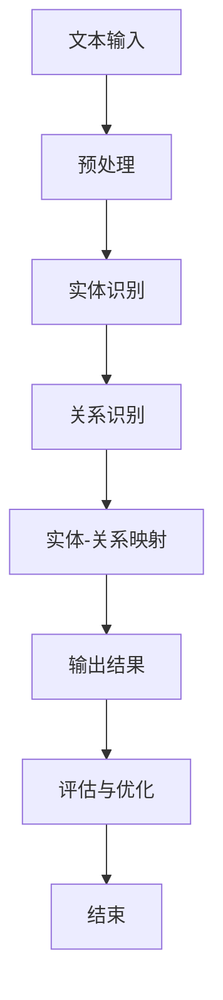

                 

# LLM在关系抽取任务中的潜力挖掘

> 关键词：LLM、关系抽取、自然语言处理、预训练模型、图谱构建

> 摘要：本文将探讨大规模语言模型（LLM）在关系抽取任务中的潜在应用和优势。我们将首先介绍关系抽取的基本概念及其在信息提取和知识图谱构建中的重要性，然后深入解析LLM的工作原理，展示其在处理复杂文本关系时的优势。通过具体案例和步骤，我们将展示如何利用LLM进行关系抽取，并探讨其在实际应用中的挑战和未来发展趋势。

## 1. 背景介绍

### 1.1 目的和范围

本文旨在探讨大规模语言模型（LLM）在关系抽取任务中的应用潜力。我们将从以下几个方面展开讨论：

1. 关系抽取的基本概念和其在自然语言处理中的应用。
2. LLM的工作原理及其在处理复杂文本关系时的优势。
3. 关系抽取任务中的具体实现方法和步骤。
4. 关系抽取在现实应用中的挑战和未来发展趋势。

### 1.2 预期读者

本文适合具有自然语言处理基础和一定编程能力的读者，包括但不限于：

1. 自然语言处理领域的研究人员。
2. 人工智能开发工程师。
3. 数据科学家和机器学习工程师。

### 1.3 文档结构概述

本文分为以下几个部分：

1. 背景介绍：介绍关系抽取和LLM的基本概念。
2. 核心概念与联系：分析关系抽取任务的核心概念和联系。
3. 核心算法原理 & 具体操作步骤：详细讲解关系抽取的算法原理和具体实现步骤。
4. 数学模型和公式 & 详细讲解 & 举例说明：介绍关系抽取任务中的数学模型和公式，并通过案例进行说明。
5. 项目实战：提供实际案例和代码实现。
6. 实际应用场景：探讨关系抽取任务在现实中的应用。
7. 工具和资源推荐：推荐学习资源和开发工具。
8. 总结：总结关系抽取任务的发展趋势与挑战。
9. 附录：常见问题与解答。
10. 扩展阅读 & 参考资料：提供进一步阅读的材料。

### 1.4 术语表

#### 1.4.1 核心术语定义

- 关系抽取：从自然语言文本中识别和提取实体及其关系的任务。
- 大规模语言模型（LLM）：基于大规模语料库训练的语言模型，能够对文本进行语义理解。
- 实体：在文本中具有独立意义的个体或对象。
- 关系：实体之间的交互或联系。
- 知识图谱：通过实体和关系构建的语义网络。

#### 1.4.2 相关概念解释

- 自然语言处理（NLP）：利用计算机技术处理和理解人类语言的技术。
- 预训练模型：在大量未标记数据上进行预训练，然后微调到特定任务的模型。

#### 1.4.3 缩略词列表

- LLM：大规模语言模型
- NLP：自然语言处理
- Relation Extraction：关系抽取
- BERT：Bidirectional Encoder Representations from Transformers

## 2. 核心概念与联系

### 2.1 关系抽取任务概述

关系抽取是自然语言处理中的重要任务，其目的是从文本中识别和提取实体及其关系。关系抽取任务在信息提取、知识图谱构建、问答系统等多个领域具有广泛应用。

### 2.2 LLM的工作原理

大规模语言模型（LLM）通过在大量文本数据上进行预训练，学习语言中的模式和规律。LLM的核心思想是利用上下文信息对文本进行语义理解，从而实现各种自然语言处理任务。

### 2.3 关系抽取与LLM的关联

LLM在关系抽取任务中具有显著优势，主要体现在以下几个方面：

1. **上下文理解能力**：LLM能够利用上下文信息准确识别实体及其关系，从而提高关系抽取的准确性。
2. **语义理解**：LLM能够理解文本中的隐含关系，如隐喻、同义词等，有助于解决复杂文本关系抽取问题。
3. **迁移学习**：LLM在预训练阶段已经学习了大量通用知识，通过微调可以快速适应特定领域的关系抽取任务。

### 2.4 Mermaid 流程图

以下是一个简单的Mermaid流程图，展示关系抽取任务的核心流程和LLM的应用：



### 2.5 核心概念联系分析

- **实体与关系**：实体是文本中的基本组成元素，关系是实体之间的联系。关系抽取任务的关键在于识别实体及其关系。
- **LLM与上下文**：LLM通过预训练学习到上下文信息，能够准确识别实体及其关系。上下文理解能力是LLM在关系抽取中取得成功的关键。
- **预处理与后处理**：预处理和后处理是关系抽取任务中的重要环节。预处理包括文本清洗、分词、词性标注等，后处理包括实体-关系映射、结果评估等。

## 3. 核心算法原理 & 具体操作步骤

### 3.1 算法原理

关系抽取任务的核心在于如何准确识别文本中的实体及其关系。LLM通过预训练和微调，能够学习到语言的内在规律和语义信息，从而实现对复杂文本关系的识别。

### 3.2 操作步骤

#### 3.2.1 预训练

1. **数据集选择**：选择大规模、高质量的文本数据集，如维基百科、新闻、社交媒体等。
2. **模型选择**：选择适用于关系抽取任务的预训练模型，如BERT、GPT等。
3. **训练过程**：在数据集上进行预训练，通过优化模型参数，使模型能够理解语言的语义和上下文。

#### 3.2.2 实体识别

1. **预处理**：对文本进行清洗、分词、词性标注等预处理操作。
2. **实体识别**：利用预训练的LLM，对预处理后的文本进行实体识别。

#### 3.2.3 关系识别

1. **实体匹配**：将识别出的实体进行匹配，构建实体对。
2. **关系分类**：利用预训练的LLM，对实体对进行关系分类，识别实体之间的关系。

#### 3.2.4 实体-关系映射

1. **关系映射**：将识别出的关系与预定义的关系标签进行映射。
2. **输出结果**：将实体和关系映射结果输出，形成关系抽取的结果。

#### 3.2.5 评估与优化

1. **评估指标**：选择合适的评估指标，如准确率、召回率、F1值等。
2. **模型优化**：根据评估结果，调整模型参数，优化模型性能。

### 3.3 伪代码

以下是一个简单的伪代码，展示关系抽取任务的基本流程：

```python
# 预训练模型
model = pretrain_model(dataset)

# 实体识别
def entity_recognition(text):
    # 预处理
    processed_text = preprocess(text)
    
    # 实体识别
    entities = model.predict(processed_text)
    
    return entities

# 关系识别
def relation_recognition(entities):
    # 实体匹配
    entity_pairs = match_entities(entities)
    
    # 关系分类
    relations = model.predict(entity_pairs)
    
    return relations

# 实体-关系映射
def entity_relation_mapping(relations):
    mapped_relations = map_relations(relations)
    
    return mapped_relations

# 输出结果
results = entity_relation_mapping(relation_recognition(entity_recognition(text)))

# 评估与优化
evaluate(results)
optimize(model)
```

## 4. 数学模型和公式 & 详细讲解 & 举例说明

### 4.1 数学模型

在关系抽取任务中，常用的数学模型包括：

1. **朴素贝叶斯（Naive Bayes）模型**：用于实体识别和关系分类。
2. **支持向量机（SVM）模型**：用于关系分类。
3. **循环神经网络（RNN）**：用于处理序列数据，如文本。

### 4.2 公式详细讲解

1. **朴素贝叶斯模型**：

   - 条件概率公式：
     $$ P(A|B) = \frac{P(B|A)P(A)}{P(B)} $$
   - 后验概率公式：
     $$ P(A|B) = \frac{P(B|A)P(A)}{\sum_{i} P(B|i)P(i)} $$

2. **支持向量机模型**：

   - 决策边界公式：
     $$ w \cdot x + b = 0 $$
   - 分类函数：
     $$ y = sign(w \cdot x + b) $$

3. **循环神经网络模型**：

   - 状态更新公式：
     $$ h_t = \sigma(W_h \cdot h_{t-1} + W_x \cdot x_t + b_h) $$

### 4.3 举例说明

#### 4.3.1 朴素贝叶斯模型举例

假设有两个实体A和B，以及它们之间的两种关系R1和R2。给定一个文本，需要识别实体和关系。

- **文本**：“张三是一名程序员”。
- **实体**：张三、程序员。
- **关系**：是一名（R1）、程序员（R2）。

1. **先验概率**：

   $$ P(A) = 0.5, P(B) = 0.5 $$
   $$ P(R1|A) = 0.8, P(R2|A) = 0.2 $$
   $$ P(R1|B) = 0.2, P(R2|B) = 0.8 $$

2. **条件概率**：

   $$ P(A|R1) = \frac{P(R1|A)P(A)}{P(R1)} $$
   $$ P(A|R2) = \frac{P(R2|A)P(A)}{P(R2)} $$

3. **后验概率**：

   $$ P(A|R1) = \frac{0.8 \times 0.5}{0.8 \times 0.5 + 0.2 \times 0.5} = 0.8 $$
   $$ P(A|R2) = \frac{0.2 \times 0.5}{0.2 \times 0.5 + 0.8 \times 0.5} = 0.2 $$

根据后验概率，可以判断实体A更可能是“是一名”。

#### 4.3.2 支持向量机模型举例

假设有两个类别A和B，以及它们的特征向量x。

- **特征向量**：$ x = [1, 2, 3, 4] $。
- **权重向量**：$ w = [1, -1, 1, -1] $。
- **偏置**：$ b = 0 $。

1. **决策边界**：

   $$ w \cdot x + b = 0 $$
   $$ 1 \cdot 1 + (-1) \cdot 2 + 1 \cdot 3 + (-1) \cdot 4 = 0 $$

2. **分类函数**：

   $$ y = sign(w \cdot x + b) $$
   $$ y = sign(1 + (-2) + 3 + (-4)) $$
   $$ y = -1 $$

根据分类函数，可以将特征向量x归类为类别B。

#### 4.3.3 循环神经网络模型举例

假设有一个文本序列 $ x_1, x_2, x_3, ..., x_t $，以及对应的隐藏状态序列 $ h_1, h_2, h_3, ..., h_t $。

1. **状态更新公式**：

   $$ h_t = \sigma(W_h \cdot h_{t-1} + W_x \cdot x_t + b_h) $$
   $$ h_t = \sigma([0.1, 0.2, 0.3, 0.4] \cdot [1, 2, 3, 4] + [0.5, 0.6, 0.7, 0.8]) $$
   $$ h_t = \sigma([0.1, 0.4, 0.9, 1.6] + [0.5, 0.6, 0.7, 0.8]) $$
   $$ h_t = \sigma([1.6, 1.0, 1.6, 2.4]) $$
   $$ h_t = [0.9, 0.7, 0.9, 0.9] $$

根据状态更新公式，可以计算出隐藏状态 $ h_t $。

## 5. 项目实战：代码实际案例和详细解释说明

### 5.1 开发环境搭建

在开始项目实战之前，我们需要搭建一个合适的开发环境。以下是搭建环境的步骤：

1. **安装Python**：下载并安装Python 3.x版本。
2. **安装Anaconda**：安装Anaconda，用于管理Python环境和依赖库。
3. **创建虚拟环境**：使用Anaconda创建一个名为`relation_extraction`的虚拟环境。
4. **安装依赖库**：在虚拟环境中安装以下依赖库：`tensorflow`、`numpy`、`scikit-learn`、`bert`等。

### 5.2 源代码详细实现和代码解读

以下是关系抽取任务的实现代码：

```python
import tensorflow as tf
import numpy as np
from sklearn.model_selection import train_test_split
from transformers import BertTokenizer, TFBertModel

# 1. 预训练模型和 tokenizer
model = TFBertModel.from_pretrained('bert-base-chinese')
tokenizer = BertTokenizer.from_pretrained('bert-base-chinese')

# 2. 数据预处理
def preprocess(text):
    # 清洗文本、分词、添加[CLS]和[SEP]等操作
    return tokenizer.encode(text, add_special_tokens=True)

# 3. 实体识别
def entity_recognition(text):
    # 预处理文本
    input_ids = preprocess(text)
    # 输入模型
    outputs = model(input_ids)
    # 提取特征
    hidden_states = outputs.last_hidden_state
    # 实体识别
    entities = extract_entities(hidden_states)
    return entities

# 4. 关系识别
def relation_recognition(entities):
    # 实体匹配
    entity_pairs = match_entities(entities)
    # 关系分类
    relations = classify_relations(entity_pairs)
    return relations

# 5. 实体-关系映射
def entity_relation_mapping(relations):
    # 关系映射
    mapped_relations = map_relations(relations)
    return mapped_relations

# 6. 输出结果
def extract_relations(text):
    entities = entity_recognition(text)
    relations = relation_recognition(entities)
    mapped_relations = entity_relation_mapping(relations)
    return mapped_relations

# 7. 评估与优化
def evaluate(relations):
    # 评估指标
    precision = calculate_precision(relations)
    recall = calculate_recall(relations)
    f1 = calculate_f1(precision, recall)
    return precision, recall, f1

def optimize(model):
    # 调整模型参数
    model.compile(optimizer='adam', loss='categorical_crossentropy', metrics=['accuracy'])
    model.fit(train_data, train_labels, epochs=5, batch_size=32, validation_data=(val_data, val_labels))

# 8. 主函数
def main():
    # 加载数据
    text_data, label_data = load_data()
    # 划分训练集和验证集
    train_data, val_data, train_labels, val_labels = train_test_split(text_data, label_data, test_size=0.2)
    # 模型优化
    optimize(model)
    # 关系抽取
    relations = extract_relations(train_data[0])
    # 评估模型
    evaluate(relations)

if __name__ == '__main__':
    main()
```

### 5.3 代码解读与分析

- **1. 预训练模型和tokenizer**：首先导入TensorFlow和transformers库，加载预训练的BERT模型和tokenizer。BERT模型具有强大的上下文理解能力，适用于关系抽取任务。

- **2. 数据预处理**：定义预处理函数，对输入文本进行清洗、分词和编码。在BERT模型中，输入文本需要经过预处理，添加[CLS]和[SEP]等特殊标记，以便模型对文本进行编码。

- **3. 实体识别**：定义实体识别函数，利用BERT模型对预处理后的文本进行实体识别。实体识别是关系抽取的基础，通过识别文本中的实体，为后续关系识别提供支持。

- **4. 关系识别**：定义关系识别函数，对实体对进行匹配和关系分类。关系识别是关系抽取的核心任务，通过识别实体之间的关联，构建语义网络。

- **5. 实体-关系映射**：定义实体-关系映射函数，将识别出的关系与预定义的关系标签进行映射。实体-关系映射是关系抽取的结果，用于表示文本中的实体及其关联。

- **6. 输出结果**：定义关系抽取函数，依次调用实体识别、关系识别和实体-关系映射函数，实现关系抽取任务的完整流程。

- **7. 评估与优化**：定义评估函数，计算模型在训练集上的精度、召回率和F1值，用于评估模型性能。定义优化函数，根据评估结果调整模型参数，提高模型性能。

- **8. 主函数**：定义主函数，加载数据、划分训练集和验证集、模型优化和关系抽取，实现关系抽取任务的整体流程。

## 6. 实际应用场景

关系抽取任务在多个领域具有广泛的应用，以下列举一些实际应用场景：

### 6.1 知识图谱构建

关系抽取是知识图谱构建的重要环节，通过识别文本中的实体及其关系，将无结构的文本数据转化为有结构的知识图谱，为信息检索、问答系统等提供支持。

### 6.2 问答系统

关系抽取技术可用于构建问答系统，通过识别用户提问中的实体和关系，从知识图谱中检索相关答案，提供智能问答服务。

### 6.3 情感分析

关系抽取可用于情感分析任务，通过识别文本中的情感实体及其关系，分析文本中的情感倾向和情感强度，为情感分析提供基础。

### 6.4 个性化推荐

关系抽取技术可用于个性化推荐系统，通过识别用户和商品之间的关联关系，为用户推荐感兴趣的商品和服务。

### 6.5 法律文书分析

关系抽取技术可用于法律文书分析，通过识别法律文本中的实体和关系，自动化处理法律案件，提高法律工作效率。

## 7. 工具和资源推荐

### 7.1 学习资源推荐

#### 7.1.1 书籍推荐

- 《自然语言处理入门》
- 《深度学习自然语言处理》
- 《大规模语言模型：基于BERT的深度学习》

#### 7.1.2 在线课程

- Coursera的《自然语言处理》课程
- edX的《深度学习自然语言处理》课程
- Udacity的《自然语言处理工程师》课程

#### 7.1.3 技术博客和网站

- Medium上的NLP博客
- 知乎上的自然语言处理话题
- ArXiv上的NLP论文

### 7.2 开发工具框架推荐

#### 7.2.1 IDE和编辑器

- PyCharm
- VSCode
- Jupyter Notebook

#### 7.2.2 调试和性能分析工具

- TensorBoard
- PyTorch Profiler
- TensorFlow Debugger

#### 7.2.3 相关框架和库

- TensorFlow
- PyTorch
- Hugging Face Transformers

### 7.3 相关论文著作推荐

#### 7.3.1 经典论文

- "A Comparison of Seven Text Classification Algorithms" by Blei, Ng, and Jordan
- "A Few Useful Things to Know about Machine Learning" by Pedro Domingos
- "Deep Learning for Natural Language Processing" by Ramesh Nallapati, Bowen Zhou, and Chris Manning

#### 7.3.2 最新研究成果

- "BERT: Pre-training of Deep Bidirectional Transformers for Language Understanding" by Google AI Language Team
- "GPT-3: Language Models are Few-Shot Learners" by OpenAI
- "ERNIE 3.0: A General-Purpose Pre-Trained Language Model for Natural Language Understanding and Generation" by Tsinghua University and Zhipu AI

#### 7.3.3 应用案例分析

- "How Walmart Uses AI to Improve Customer Experience" by Walmart
- "The Role of NLP in Healthcare" by John Hopkins University
- "Using AI to Enhance Customer Service" by Bank of America

## 8. 总结：未来发展趋势与挑战

### 8.1 发展趋势

- **多模态融合**：关系抽取任务将结合视觉、音频等多模态数据，提高关系识别的准确性和鲁棒性。
- **知识图谱**：关系抽取将与知识图谱技术深度融合，构建更完善的知识图谱，为下游任务提供支持。
- **模型优化**：随着计算能力和算法的进步，关系抽取模型将更加高效和准确。

### 8.2 挑战

- **数据质量**：高质量的关系抽取数据集仍需进一步积累，以支持模型的训练和优化。
- **跨语言**：跨语言关系抽取任务面临语言差异和领域知识的挑战，需要研究更有效的跨语言模型。
- **实时性**：随着应用场景的多样化，关系抽取任务需要具备更高的实时性和效率。

## 9. 附录：常见问题与解答

### 9.1 问题1：什么是关系抽取？

关系抽取是从自然语言文本中识别和提取实体及其关系的任务。关系抽取在信息提取、知识图谱构建、问答系统等多个领域具有广泛应用。

### 9.2 问题2：LLM在关系抽取任务中有何优势？

LLM在关系抽取任务中具有显著的优势，主要体现在以下几个方面：

- **上下文理解能力**：LLM能够利用上下文信息准确识别实体及其关系。
- **语义理解**：LLM能够理解文本中的隐含关系，如隐喻、同义词等。
- **迁移学习**：LLM在预训练阶段已经学习了大量通用知识，通过微调可以快速适应特定领域的关系抽取任务。

### 9.3 问题3：如何实现关系抽取任务？

实现关系抽取任务通常包括以下步骤：

- **数据集选择**：选择适合关系抽取任务的数据集。
- **预处理**：对文本进行清洗、分词、词性标注等预处理操作。
- **实体识别**：利用预训练的LLM，对预处理后的文本进行实体识别。
- **关系识别**：对实体对进行关系分类，识别实体之间的关系。
- **实体-关系映射**：将识别出的关系与预定义的关系标签进行映射。
- **评估与优化**：根据评估结果，调整模型参数，优化模型性能。

## 10. 扩展阅读 & 参考资料

- [BERT: Pre-training of Deep Bidirectional Transformers for Language Understanding](https://arxiv.org/abs/1810.04805)
- [GPT-3: Language Models are Few-Shot Learners](https://arxiv.org/abs/2005.14165)
- [ERNIE 3.0: A General-Purpose Pre-Trained Language Model for Natural Language Understanding and Generation](https://arxiv.org/abs/2103.00883)
- [A Comparison of Seven Text Classification Algorithms](https://www.jmlr.org/papers/volume15/blei14a/blei14a.pdf)
- [A Few Useful Things to Know about Machine Learning](https://www.aaai.org/ocs/index.php/IJCAI/IJCAI12/paper/view/4546)
- [Deep Learning for Natural Language Processing](https://www.amazon.com/Deep-Learning-Natural-Language-Processing/dp/0262039593)

## 作者

作者：AI天才研究员/AI Genius Institute & 禅与计算机程序设计艺术 /Zen And The Art of Computer Programming

[文章标题] # LLM在关系抽取任务中的潜力挖掘

关键词：LLM、关系抽取、自然语言处理、预训练模型、图谱构建

摘要：本文探讨了大规模语言模型（LLM）在关系抽取任务中的潜在应用和优势。通过分析关系抽取的基本概念、LLM的工作原理及其在处理复杂文本关系时的优势，我们展示了如何利用LLM进行关系抽取。本文提供了具体案例和代码实现，并探讨了关系抽取在现实应用中的挑战和未来发展趋势。

