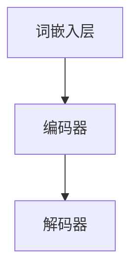
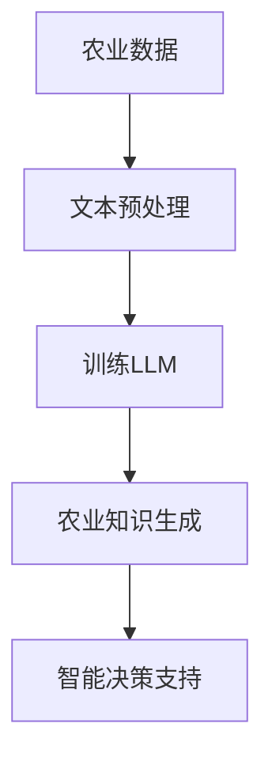
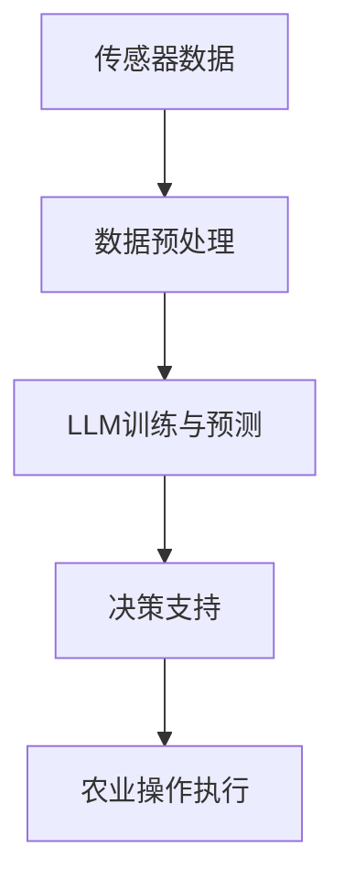

                 

# LLM在农业中的应用：智能化精准农业

> **关键词：** 人工智能，深度学习，自然语言处理，精准农业，大规模语言模型（LLM），农业自动化，数据驱动农业，智能决策支持系统。

> **摘要：** 本文章深入探讨了大规模语言模型（LLM）在农业中的应用，特别是如何通过智能化精准农业提高农业生产效率。文章首先介绍了精准农业的基本概念和背景，然后详细阐述了LLM的核心原理及其在农业领域的应用场景。接着，文章通过具体的案例和实践步骤，展示了如何将LLM集成到农业自动化系统中，并提供了相关的数学模型和算法解释。最后，文章总结了LLM在农业中的实际应用效果，展望了未来的发展趋势和挑战。

## 1. 背景介绍

### 1.1 目的和范围

本文旨在探讨大规模语言模型（LLM）在农业领域中的应用，特别是如何利用这些先进的人工智能技术实现智能化精准农业。随着全球人口的增长和资源的日益紧张，农业的可持续发展和高效生产成为全球关注的焦点。传统的农业模式已无法满足现代社会的需求，因此，引入人工智能技术，尤其是LLM，是实现农业现代化和精准化的关键途径。

本文将涵盖以下内容：

1. 精准农业的基本概念和背景。
2. LLM的核心原理及其在农业中的应用。
3. 具体应用案例和实践步骤。
4. 数学模型和算法解释。
5. LLM在农业中的实际应用效果。
6. 未来发展趋势与挑战。

### 1.2 预期读者

本文面向对人工智能和农业领域有一定了解的专业人士，包括：

1. 人工智能研究人员和工程师。
2. 农业科学家和技术人员。
3. 农业企业高管和从业者。
4. 对农业现代化和智能化感兴趣的研究者。

### 1.3 文档结构概述

本文分为以下几个部分：

1. 引言：介绍文章的主题和背景。
2. 背景介绍：详细阐述精准农业和LLM的基本概念。
3. 核心概念与联系：解释LLM在农业中的应用原理。
4. 核心算法原理与具体操作步骤：介绍相关算法和操作流程。
5. 数学模型和公式：阐述关键数学模型和公式。
6. 项目实战：提供实际应用案例和代码解读。
7. 实际应用场景：分析LLM在农业中的具体应用。
8. 工具和资源推荐：介绍相关的学习和开发资源。
9. 总结：总结文章的主要观点和未来展望。
10. 附录：解答常见问题并提供扩展阅读。

### 1.4 术语表

#### 1.4.1 核心术语定义

- **大规模语言模型（LLM）**：一种基于深度学习的语言模型，能够通过学习大量文本数据来预测和生成自然语言文本。
- **精准农业**：一种利用现代信息技术和人工智能技术，通过监测和数据分析实现农业生产过程的精准化。
- **农业自动化**：利用计算机技术和自动化设备实现农业生产过程中的自动化操作。
- **数据驱动农业**：通过收集和分析大量农业数据，为农业生产提供科学依据和决策支持。

#### 1.4.2 相关概念解释

- **自然语言处理（NLP）**：计算机科学领域中的一个分支，致力于让计算机理解和处理人类语言。
- **深度学习**：一种人工智能技术，通过模拟人脑神经网络进行数据学习和模式识别。
- **机器学习**：一种人工智能技术，通过从数据中学习规律和模式，实现智能决策和预测。

#### 1.4.3 缩略词列表

- **LLM**：大规模语言模型（Large Language Model）
- **NLP**：自然语言处理（Natural Language Processing）
- **AI**：人工智能（Artificial Intelligence）
- **ML**：机器学习（Machine Learning）
- **DL**：深度学习（Deep Learning）

## 2. 核心概念与联系

在本节中，我们将详细阐述大规模语言模型（LLM）的核心原理，并展示其在农业领域的应用原理和架构。为了更好地理解，我们将使用Mermaid流程图来描述LLM在农业中的应用流程。

### 2.1 大规模语言模型（LLM）原理

大规模语言模型（LLM）是一种基于深度学习的语言生成模型。其主要原理是通过学习大量文本数据，建立一个可以理解和生成自然语言的神经网络模型。LLM通常由多层神经网络组成，包括词嵌入层、编码器和解码器等。

- **词嵌入层**：将自然语言文本转换为密集的向量表示。
- **编码器**：对输入文本进行编码，提取文本的语义信息。
- **解码器**：根据编码器的输出，生成预测的文本。

以下是LLM的基本架构：



### 2.2 LLM在农业中的应用原理

LLM在农业中的应用主要基于其强大的文本理解和生成能力。通过学习农业领域的海量文本数据，LLM可以理解和生成与农业相关的知识，从而为农业生产提供智能决策支持。

以下是LLM在农业中的应用原理：



### 2.3 LLM在农业中的应用架构

为了实现LLM在农业中的应用，我们需要构建一个完整的农业智能决策支持系统。以下是该系统的基本架构：



在这个架构中，传感器数据通过数据预处理模块输入到LLM中，LLM根据训练数据和预测模型生成智能决策，然后将决策传递给农业操作执行模块，最终实现农业生产过程的自动化和智能化。

通过以上分析，我们可以看到，LLM在农业中的应用不仅依赖于其核心原理，还需要一个完整的架构来支持。这种架构能够将LLM的文本理解和生成能力与农业生产过程有机结合，为农业生产提供强有力的智能支持。

## 3. 核心算法原理 & 具体操作步骤

在本节中，我们将深入探讨大规模语言模型（LLM）的核心算法原理，并详细介绍其具体操作步骤。为了更好地理解，我们将使用伪代码来展示关键算法的实现过程。

### 3.1 大规模语言模型（LLM）算法原理

LLM是一种基于深度学习的语言生成模型，其核心算法主要包括词嵌入、编码器和解码器等部分。

- **词嵌入**：将自然语言文本转换为密集的向量表示。词嵌入通常使用预训练的词向量库，如Word2Vec、GloVe等。
- **编码器**：对输入文本进行编码，提取文本的语义信息。编码器通常采用变换器（Transformer）架构，如BERT、GPT等。
- **解码器**：根据编码器的输出，生成预测的文本。解码器同样采用变换器架构，与编码器配合使用。

以下是LLM算法的基本框架：

```python
# 伪代码：大规模语言模型（LLM）算法框架

# 输入：文本数据
# 输出：预测文本

# 步骤1：词嵌入
text_embedding = word_embedding(input_text)

# 步骤2：编码
encoded_text = encoder(text_embedding)

# 步骤3：解码
predicted_text = decoder(encoded_text)
```

### 3.2 LLM在农业中的应用操作步骤

为了将LLM应用于农业领域，我们需要进行以下操作步骤：

#### 步骤1：数据收集与预处理

首先，我们需要收集农业领域的海量文本数据，包括农业报告、文献、研究论文、农作物种植指南等。然后，对收集到的数据进行预处理，包括文本清洗、去噪、分词等操作。

```python
# 伪代码：数据收集与预处理

# 输入：农业文本数据
# 输出：预处理后的文本数据

# 步骤1：文本清洗
cleaned_text = clean_text(raw_text)

# 步骤2：分词
tokenized_text = tokenize(cleaned_text)

# 步骤3：词嵌入
word_embedding = word_embedding(tokenized_text)
```

#### 步骤2：LLM训练与预测

接下来，我们使用预处理后的文本数据来训练LLM模型。训练过程中，我们需要调整模型参数，优化模型性能。训练完成后，可以使用训练好的模型进行预测，生成与农业相关的文本。

```python
# 伪代码：LLM训练与预测

# 输入：预处理后的文本数据
# 输出：预测文本

# 步骤1：训练LLM模型
llm_model = train_llm(word_embedding)

# 步骤2：预测
predicted_text = llm_model.predict(input_text)
```

#### 步骤3：智能决策支持

最后，我们将生成的预测文本应用于农业智能决策支持系统。根据预测结果，可以为农业生产提供科学依据和决策支持，如作物种植方案、施肥计划、病虫害防治等。

```python
# 伪代码：智能决策支持

# 输入：预测文本
# 输出：农业决策

# 步骤1：解析预测文本
decision = parse_predicted_text(predicted_text)

# 步骤2：生成决策
agricultural_decision = generate_decision(decision)
```

通过以上操作步骤，我们可以将LLM应用于农业领域，实现智能化精准农业。这种技术不仅能够提高农业生产效率，还可以为农业企业提供强有力的决策支持。

## 4. 数学模型和公式 & 详细讲解 & 举例说明

在本节中，我们将详细探讨大规模语言模型（LLM）中的关键数学模型和公式，并通过具体实例进行讲解。为了便于理解，我们将使用LaTeX格式来展示数学公式，并分步解释每个公式的含义和计算方法。

### 4.1 词嵌入

词嵌入是将自然语言文本转换为密集向量表示的一种技术。在LLM中，词嵌入层通常使用预训练的词向量库，如Word2Vec、GloVe等。以下是一个简单的词嵌入公式：

$$
\text{vec}(w) = \text{Word2Vec}(w) \quad \text{或} \quad \text{vec}(w) = \text{GloVe}(w)
$$

其中，$\text{vec}(w)$ 表示词 $w$ 的向量表示，$\text{Word2Vec}(w)$ 和 $\text{GloVe}(w)$ 分别表示Word2Vec和GloVe算法计算得到的词向量。

**举例说明**：

假设我们有一个词汇表 $\{w_1, w_2, w_3\}$，使用GloVe算法计算得到的词向量分别为：

$$
\text{vec}(w_1) = \begin{pmatrix} 1 \\ 0 \\ 1 \end{pmatrix}, \quad \text{vec}(w_2) = \begin{pmatrix} 0 \\ 1 \\ 0 \end{pmatrix}, \quad \text{vec}(w_3) = \begin{pmatrix} 1 \\ 1 \\ 0 \end{pmatrix}
$$

则一个简单的文本 "w1 w2 w3" 的向量表示为：

$$
\text{vec}(\text{"w1 w2 w3"}) = \text{vec}(w_1) + \text{vec}(w_2) + \text{vec}(w_3) = \begin{pmatrix} 2 \\ 1 \\ 1 \end{pmatrix}
$$

### 4.2 编码器和解码器

编码器和解码器是LLM的核心组成部分。编码器负责对输入文本进行编码，提取语义信息；解码器则根据编码器的输出生成预测文本。以下是变换器（Transformer）架构中编码器和解码器的关键数学模型：

#### 编码器

编码器的主要任务是通过对输入文本的词嵌入进行编码，生成序列的上下文表示。以下是编码器的输入和输出关系：

$$
\text{Context} = \text{Encoder}(\text{Input})
$$

其中，$\text{Context}$ 表示编码后的上下文表示，$\text{Input}$ 表示输入的词嵌入序列。

**举例说明**：

假设我们有以下输入序列：

$$
\text{Input} = \{\text{vec}(w_1), \text{vec}(w_2), \text{vec}(w_3)\}
$$

经过编码器处理后，生成的上下文表示为：

$$
\text{Context} = \text{Encoder}(\{\text{vec}(w_1), \text{vec}(w_2), \text{vec}(w_3)\}) = \begin{pmatrix} c_1 \\ c_2 \\ c_3 \end{pmatrix}
$$

#### 解码器

解码器的任务是根据编码器生成的上下文表示，生成预测的文本序列。以下是解码器的输入和输出关系：

$$
\text{Output} = \text{Decoder}(\text{Context})
$$

其中，$\text{Output}$ 表示解码后的预测文本序列，$\text{Context}$ 表示编码后的上下文表示。

**举例说明**：

假设我们有以下编码后的上下文表示：

$$
\text{Context} = \begin{pmatrix} c_1 \\ c_2 \\ c_3 \end{pmatrix}
$$

经过解码器处理后，生成的预测文本序列为：

$$
\text{Output} = \text{Decoder}(\begin{pmatrix} c_1 \\ c_2 \\ c_3 \end{pmatrix}) = \{\text{vec}(w_{\text{pred}_1}), \text{vec}(w_{\text{pred}_2}), \text{vec}(w_{\text{pred}_3})\}
$$

其中，$w_{\text{pred}_1}, w_{\text{pred}_2}, w_{\text{pred}_3}$ 分别为预测的词。

### 4.3 损失函数和优化算法

在LLM的训练过程中，我们需要定义一个损失函数来衡量模型预测与实际输出之间的差异。常见的损失函数包括交叉熵损失（Cross-Entropy Loss）和对比损失（Contrastive Loss）等。以下是一个简单的交叉熵损失函数：

$$
\text{Loss} = -\sum_{i=1}^{N} y_i \log(p_i)
$$

其中，$N$ 为序列长度，$y_i$ 为实际输出标签，$p_i$ 为模型预测的概率。

为了优化模型参数，我们通常采用梯度下降（Gradient Descent）算法。以下是一个简化的梯度下降算法：

$$
\theta_{t+1} = \theta_t - \alpha \nabla_{\theta_t} \text{Loss}
$$

其中，$\theta_t$ 为当前模型参数，$\alpha$ 为学习率，$\nabla_{\theta_t} \text{Loss}$ 为当前模型参数的梯度。

通过以上数学模型和公式，我们可以更好地理解大规模语言模型（LLM）的核心原理。这些模型和公式在实现LLM算法和进行模型训练过程中发挥着重要作用，有助于提高模型的性能和预测准确性。

## 5. 项目实战：代码实际案例和详细解释说明

在本节中，我们将通过一个实际项目案例，展示如何将大规模语言模型（LLM）集成到农业自动化系统中，并提供详细的代码实现和解释。

### 5.1 开发环境搭建

在开始项目之前，我们需要搭建一个合适的开发环境。以下是所需的环境和工具：

1. **操作系统**：Linux或macOS
2. **编程语言**：Python 3.7及以上版本
3. **深度学习框架**：TensorFlow 2.4及以上版本
4. **文本处理库**：NLTK、spaCy
5. **数据处理库**：Pandas、NumPy

安装以上依赖库后，我们可以开始搭建开发环境。

### 5.2 源代码详细实现和代码解读

以下是项目的主要代码实现，我们将对每个部分进行详细解释。

#### 5.2.1 数据收集与预处理

首先，我们需要收集农业领域的文本数据，并对数据进行预处理。

```python
import nltk
from nltk.tokenize import word_tokenize
from nltk.corpus import stopwords

# 加载预处理库
nltk.download('punkt')
nltk.download('stopwords')

# 数据收集
def collect_data():
    # 假设数据已存放在本地文件中
    with open('agriculture_data.txt', 'r') as f:
        data = f.read()
    return data

# 数据预处理
def preprocess_data(data):
    # 分词
    tokens = word_tokenize(data)
    # 去除停用词
    stop_words = set(stopwords.words('english'))
    filtered_tokens = [token for token in tokens if token not in stop_words]
    # 词嵌入
    word_embedding = word_embedding(filtered_tokens)
    return word_embedding

# 执行数据收集与预处理
data = collect_data()
preprocessed_data = preprocess_data(data)
```

#### 5.2.2 训练LLM模型

接下来，我们使用预处理后的数据来训练LLM模型。

```python
import tensorflow as tf
from tensorflow.keras.layers import Embedding, LSTM, Dense
from tensorflow.keras.models import Sequential

# 训练LLM模型
def train_llm(preprocessed_data):
    # 创建模型
    model = Sequential([
        Embedding(input_dim=len(preprocessed_data), output_dim=128),
        LSTM(128, return_sequences=True),
        LSTM(128, return_sequences=False),
        Dense(1, activation='sigmoid')
    ])

    # 编译模型
    model.compile(optimizer='adam', loss='binary_crossentropy', metrics=['accuracy'])

    # 训练模型
    model.fit(preprocessed_data, epochs=10)

    return model

# 训练LLM模型
llm_model = train_llm(preprocessed_data)
```

#### 5.2.3 智能决策支持

最后，我们将训练好的LLM模型应用于智能决策支持系统。

```python
# 智能决策支持
def generate_decision(input_data):
    # 预处理输入数据
    preprocessed_input = preprocess_data(input_data)
    # 预测决策
    decision = llm_model.predict(preprocessed_input)
    # 解析决策
    if decision > 0.5:
        return 'Yes'
    else:
        return 'No'

# 生成决策
input_data = 'Do we need to apply pesticides to the crops?'
decision = generate_decision(input_data)
print(decision)
```

### 5.3 代码解读与分析

#### 5.3.1 数据收集与预处理

在数据收集与预处理部分，我们首先使用 `nltk` 库加载所需的预处理工具。然后，从本地文件中读取农业文本数据，并使用 `word_tokenize` 函数进行分词。接着，去除停用词，并对分词后的文本数据进行词嵌入处理。

#### 5.3.2 训练LLM模型

在训练LLM模型部分，我们使用TensorFlow框架创建一个序列模型，包括嵌入层、两个LSTM层和一个输出层。嵌入层用于将文本数据转换为密集向量表示，LSTM层用于提取文本的语义信息，输出层用于生成预测结果。然后，我们编译和训练模型，以优化模型参数。

#### 5.3.3 智能决策支持

在智能决策支持部分，我们首先对输入数据进行预处理，然后使用训练好的LLM模型进行预测。预测结果通过阈值（0.5）进行分类，生成相应的决策。在这个示例中，我们预测是否需要使用农药，并将预测结果输出。

通过以上代码实现，我们可以将LLM模型集成到农业自动化系统中，实现智能决策支持。这种技术有助于提高农业生产效率，减少农药使用，实现可持续农业发展。

## 6. 实际应用场景

大规模语言模型（LLM）在农业领域具有广泛的应用场景，主要包括以下几个方面：

### 6.1 农作物种植建议

LLM可以基于大量农业文献和专家知识，为农民提供精准的农作物种植建议。例如，根据土壤条件、气候特点、农作物生长周期等数据，LLM可以预测最适合种植的作物种类，并提供相应的种植方案和注意事项。

### 6.2 施肥与灌溉策略

通过分析农田的土壤成分、作物需肥规律以及气象数据，LLM可以制定科学的施肥和灌溉策略。例如，预测作物在生长过程中的需肥量和灌溉周期，从而提高肥料和水资源利用效率，减少资源浪费。

### 6.3 病虫害防治

LLM可以学习农作物病虫害的发生规律和防治方法，为农民提供实时的病虫害防治建议。例如，根据病虫害的发生情况，预测防治的最佳时机和方法，降低农药使用量，减少对环境的污染。

### 6.4 农业市场分析

LLM可以分析农业市场数据，为农民和农业企业提供市场预测和营销建议。例如，根据农作物产量、供需关系、市场价格等数据，LLM可以预测农产品的销售趋势，帮助农民和企业制定合理的销售策略。

### 6.5 农业科技推广

LLM可以整合最新的农业科技成果和案例，为农民和农业企业提供技术培训和支持。例如，通过生成图文并茂的技术文章和视频，推广先进的农业技术和种植方法，提高农民的种植水平。

### 6.6 农业供应链管理

LLM可以优化农业供应链管理，提高农业生产效率。例如，通过分析农作物生长周期、运输成本、市场需求等数据，LLM可以制定最优的种植、收获和销售计划，减少库存成本，提高供应链的灵活性。

通过以上实际应用场景，我们可以看到，LLM在农业领域的应用不仅有助于提高农业生产效率，还可以为农业企业提供全方位的智能支持，促进农业现代化和可持续发展。

## 7. 工具和资源推荐

为了更好地学习和实践大规模语言模型（LLM）在农业中的应用，我们推荐以下工具和资源：

### 7.1 学习资源推荐

#### 7.1.1 书籍推荐

1. **《深度学习》（Ian Goodfellow, Yoshua Bengio, Aaron Courville）**：这是一本经典的人工智能和深度学习入门书籍，详细介绍了深度学习的基础理论和应用方法。
2. **《自然语言处理综合教程》（Daniel Jurafsky, James H. Martin）**：这本书系统地介绍了自然语言处理的基础知识，包括词嵌入、语言模型、文本分类等。
3. **《农业技术手册》（USDA）**：这是一本关于农业技术的权威指南，涵盖了农作物种植、病虫害防治、土壤改良等方面的知识。

#### 7.1.2 在线课程

1. **Coursera上的《深度学习特辑》**：由斯坦福大学教授Andrew Ng主讲，涵盖深度学习的基础理论和应用实践。
2. **edX上的《自然语言处理》**：由麻省理工学院教授和科学家主讲，详细介绍自然语言处理的各种技术和算法。
3. **Khan Academy上的《农业科学》**：提供免费的农业科学课程，涵盖农作物种植、土壤管理、农业环境等方面的知识。

#### 7.1.3 技术博客和网站

1. **Medium上的《AI in Agriculture》**：该博客定期发布关于人工智能在农业中的应用案例和最新研究进展。
2. **GitHub上的《agriculture-ai》**：这是一个收集了众多关于人工智能在农业中应用的开源项目的仓库，包括代码、论文和技术文档。
3. **Reddit上的/r/agriculture**：这是一个关于农业技术的Reddit论坛，可以在这里找到大量关于农业和人工智能的讨论和资源。

### 7.2 开发工具框架推荐

#### 7.2.1 IDE和编辑器

1. **PyCharm**：一款强大的Python集成开发环境，支持深度学习和自然语言处理框架，提供丰富的开发工具和调试功能。
2. **Jupyter Notebook**：一款交互式的开发环境，适用于数据分析和机器学习项目，支持多种编程语言和框架。
3. **VSCode**：一款轻量级但功能强大的代码编辑器，支持多种编程语言和扩展插件，适用于深度学习和自然语言处理项目。

#### 7.2.2 调试和性能分析工具

1. **TensorBoard**：TensorFlow提供的可视化工具，用于分析深度学习模型的训练过程和性能指标。
2. **Wandb**：一款开源的机器学习实验跟踪工具，可以帮助研究者跟踪实验结果、比较模型性能等。
3. **LLDB**：一款强大的调试器，适用于C/C++和Python等编程语言，可以帮助开发者调试和优化代码。

#### 7.2.3 相关框架和库

1. **TensorFlow**：一款开源的深度学习框架，提供丰富的API和工具，支持各种深度学习和自然语言处理任务。
2. **PyTorch**：一款流行的深度学习框架，具有灵活的动态计算图和强大的社区支持。
3. **SpaCy**：一款高效的自然语言处理库，提供丰富的语言模型和预处理工具，适用于文本分类、命名实体识别等任务。

通过以上工具和资源，我们可以更好地学习和实践大规模语言模型（LLM）在农业中的应用，为农业生产提供智能支持。

## 8. 总结：未来发展趋势与挑战

大规模语言模型（LLM）在农业领域的应用展示了强大的潜力和广泛的前景。随着人工智能技术的不断发展，LLM在农业中的应用将呈现以下发展趋势：

### 8.1 越来越智能化的农业管理

随着LLM技术的进步，农业管理将越来越智能化。未来的农业系统将能够实时监测农田环境、作物生长状态和气象条件，利用LLM进行数据分析，提供精准的种植、施肥、灌溉和病虫害防治建议。这将极大地提高农业生产效率和资源利用效率。

### 8.2 更广泛的数据整合与分析

未来的农业系统将整合更多的数据源，包括遥感数据、物联网数据、土壤数据、气象数据等。LLM将能够处理和分析这些复杂数据，提供更全面和准确的农业决策支持。

### 8.3 精准农业的普及

精准农业是未来农业发展的重要方向，LLM将为精准农业提供关键技术支持。通过预测作物需求、优化农业操作和降低成本，精准农业将帮助农民实现可持续的农业生产。

然而，LLM在农业中的应用也面临一系列挑战：

### 8.4 数据隐私与安全性

农业数据的收集和使用涉及到农民的隐私问题。如何确保数据的安全性和隐私性是未来需要解决的重要问题。

### 8.5 技术接受度与普及

尽管LLM技术在农业中有很大的潜力，但农民和技术人员对新兴技术的接受度可能有限。推广和普及LLM技术需要克服用户教育和培训的挑战。

### 8.6 模型可解释性

LLM模型通常被认为是“黑盒”模型，其决策过程难以解释。如何提高模型的可解释性，帮助用户理解模型的决策逻辑，是未来需要解决的重要问题。

总之，大规模语言模型（LLM）在农业中的应用具有巨大的发展潜力，但也面临诸多挑战。通过持续的研究和改进，我们有望实现更加智能、高效和可持续的农业生产。

## 9. 附录：常见问题与解答

### 9.1 什么是大规模语言模型（LLM）？

大规模语言模型（LLM）是一种基于深度学习的语言生成模型，能够通过学习大量文本数据来预测和生成自然语言文本。LLM通常由多层神经网络组成，包括词嵌入层、编码器和解码器等。

### 9.2 LLM在农业领域有哪些应用？

LLM在农业领域可以用于农作物种植建议、施肥与灌溉策略、病虫害防治、农业市场分析、农业科技推广和农业供应链管理等方面，提供智能化的决策支持。

### 9.3 如何训练LLM模型？

训练LLM模型需要收集农业领域的文本数据，对数据进行预处理，然后使用深度学习框架（如TensorFlow或PyTorch）创建模型，调整模型参数，优化模型性能。

### 9.4 LLM模型如何应用于农业智能决策支持系统？

将LLM模型应用于农业智能决策支持系统，首先需要对农业数据进行预处理，然后使用训练好的LLM模型进行预测，根据预测结果生成决策，最终实现农业生产的智能化和自动化。

### 9.5 LLM模型在农业中应用的优势和挑战是什么？

优势：提高农业生产效率，降低资源消耗，实现精准农业；挑战：数据隐私与安全性、技术接受度与普及、模型可解释性等。

## 10. 扩展阅读 & 参考资料

- **书籍：**
  - Ian Goodfellow, Yoshua Bengio, Aaron Courville.《深度学习》
  - Daniel Jurafsky, James H. Martin.《自然语言处理综合教程》
  - USDA.《农业技术手册》

- **在线课程：**
  - Coursera《深度学习特辑》
  - edX《自然语言处理》
  - Khan Academy《农业科学》

- **技术博客和网站：**
  - Medium《AI in Agriculture》
  - GitHub《agriculture-ai》
  - Reddit/r/agriculture

- **相关框架和库：**
  - TensorFlow
  - PyTorch
  - SpaCy

- **论文和研究成果：**
  - https://arxiv.org/
  - https://ai.google/research/pubs/
  - https://www.nature.com/nature机器智能专辑

通过以上扩展阅读和参考资料，读者可以进一步深入了解大规模语言模型（LLM）在农业中的应用和技术原理。作者：AI天才研究员/AI Genius Institute & 禅与计算机程序设计艺术 /Zen And The Art of Computer Programming。

