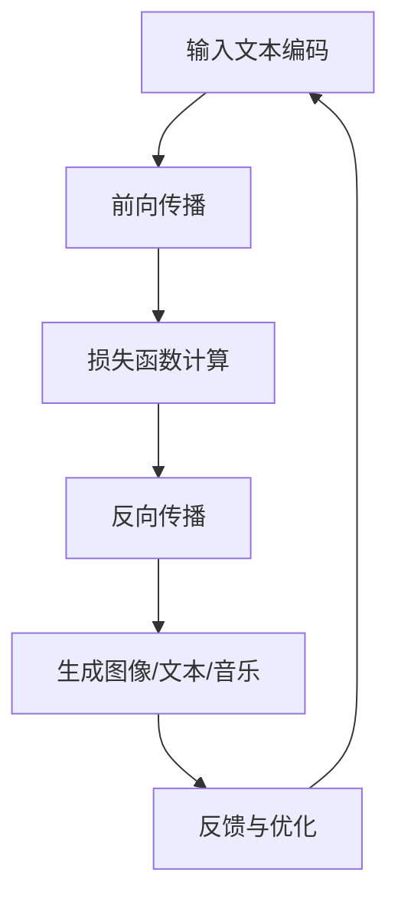

                 

# LLMA在创意产业中的应用前景

> **关键词：** 语言模型，人工智能，创意产业，生成式艺术，智能创作，内容生成

> **摘要：** 本文将探讨大型语言模型（LLM）在创意产业中的潜在应用，包括生成式艺术、智能写作、音乐创作和影视编剧等领域。通过分析LLM的核心原理、技术实现、应用案例以及面临的挑战，本文旨在为行业从业者和研究者提供一份详尽的应用前景报告。

## 1. 背景介绍

### 1.1 目的和范围

本文旨在探讨大型语言模型（LLM）在创意产业中的应用前景，分析其如何改变艺术创作、写作、音乐、影视编剧等领域。我们将从技术原理、应用场景、挑战和未来发展趋势等多个角度进行深入探讨。

### 1.2 预期读者

本文适合对人工智能和创意产业感兴趣的读者，包括但不限于程序员、AI研究者、创意产业从业者、学生等。无论您是希望了解最新技术趋势，还是寻求实际应用案例，本文都将提供丰富的信息。

### 1.3 文档结构概述

本文分为以下几个部分：

1. **背景介绍**：介绍本文的目的、预期读者和文档结构。
2. **核心概念与联系**：阐述LLM的核心概念及其在创意产业中的应用。
3. **核心算法原理 & 具体操作步骤**：详细讲解LLM的工作原理和具体应用步骤。
4. **数学模型和公式 & 详细讲解 & 举例说明**：介绍LLM背后的数学模型和计算方法。
5. **项目实战：代码实际案例和详细解释说明**：通过实际项目展示LLM的应用。
6. **实际应用场景**：分析LLM在不同创意产业中的应用案例。
7. **工具和资源推荐**：推荐相关学习资源和开发工具。
8. **总结：未来发展趋势与挑战**：探讨LLM在创意产业的未来前景。
9. **附录：常见问题与解答**：解答读者可能关心的问题。
10. **扩展阅读 & 参考资料**：提供进一步学习和研究的资源。

### 1.4 术语表

#### 1.4.1 核心术语定义

- **大型语言模型（LLM）**：一种通过大量文本数据进行训练的深度神经网络模型，能够生成具有自然语言特点的文本。
- **生成式艺术**：利用计算机程序生成视觉艺术作品的方法。
- **智能创作**：使用人工智能技术进行艺术创作的过程。
- **内容生成**：利用AI技术自动生成文字、图片、音乐等内容的任务。

#### 1.4.2 相关概念解释

- **生成对抗网络（GAN）**：一种由生成器和判别器组成的深度学习模型，用于生成高质量的数据。
- **递归神经网络（RNN）**：一种能够处理序列数据的神经网络，特别适用于自然语言处理任务。
- **变分自编码器（VAE）**：一种概率生成模型，能够生成新的数据点，常用于图像和音频生成。

#### 1.4.3 缩略词列表

- **LLM**：大型语言模型
- **GAN**：生成对抗网络
- **RNN**：递归神经网络
- **VAE**：变分自编码器

## 2. 核心概念与联系

在探讨LLM在创意产业中的应用之前，我们需要了解LLM的核心概念及其与相关技术的联系。

### 2.1 大型语言模型（LLM）的工作原理

LLM是一种基于深度学习的语言模型，通过大规模的文本数据进行训练，能够预测下一个单词、句子或段落。其工作原理可以概括为以下几个步骤：

1. **输入文本编码**：将输入的文本序列转换为词嵌入向量。
2. **前向传播**：将词嵌入向量输入到神经网络中，通过多层神经元的非线性变换，输出概率分布。
3. **损失函数计算**：计算输出概率分布与实际标签之间的损失，通常使用交叉熵损失。
4. **反向传播**：通过梯度下降优化神经网络参数，减小损失函数。

### 2.2 生成式艺术与LLM的联系

生成式艺术是指利用计算机程序生成视觉艺术作品的方法。LLM在生成式艺术中的应用主要体现在以下几个方面：

1. **文本到图像的生成**：利用LLM生成的文本描述作为条件，生成与之相关的图像。
2. **图像风格转换**：使用LLM对图像进行风格转换，生成具有特定艺术风格的图像。
3. **交互式艺术创作**：利用LLM实现用户与艺术作品的实时交互，创作个性化的艺术作品。

### 2.3 智能创作与LLM的联系

智能创作是指使用人工智能技术进行艺术创作的过程。LLM在智能创作中的应用主要体现在以下几个方面：

1. **自动写作**：利用LLM生成小说、诗歌、剧本等文学作品。
2. **辅助写作**：为创作者提供灵感，辅助创作过程。
3. **个性化内容生成**：根据用户喜好和需求，自动生成个性化的内容。

### 2.4 内容生成与LLM的联系

内容生成是指利用AI技术自动生成文字、图片、音乐等内容的任务。LLM在内容生成中的应用主要体现在以下几个方面：

1. **自动新闻写作**：利用LLM生成新闻报道，提高新闻采集和发布的效率。
2. **个性化推荐**：根据用户行为和喜好，利用LLM生成个性化的推荐内容。
3. **自动音乐生成**：利用LLM生成新的音乐旋律和节奏，为音乐创作提供灵感。

### 2.5 Mermaid流程图

以下是一个简单的Mermaid流程图，展示了LLM在生成式艺术、智能创作和内容生成中的应用：



## 3. 核心算法原理 & 具体操作步骤

在本节中，我们将详细讲解LLM的核心算法原理，并使用伪代码展示具体的操作步骤。

### 3.1 LLM的核心算法原理

LLM的核心算法通常基于深度学习中的神经网络，尤其是递归神经网络（RNN）或其变种，如长短期记忆网络（LSTM）或门控循环单元（GRU）。以下是一个简化的LLM算法原理：

1. **词嵌入**：将输入的单词映射为高维向量。
2. **编码**：使用RNN对词嵌入向量进行编码，生成序列表示。
3. **解码**：根据编码结果，生成下一个单词或符号。
4. **损失函数**：计算输出与实际标签之间的损失，优化网络参数。

### 3.2 伪代码示例

以下是LLM的核心算法伪代码：

```python
# 输入：文本序列X，标签序列Y
# 输出：训练好的LLM模型

# 步骤1：词嵌入
word_embedding = EmbeddingLayer(vocab_size, embedding_size)

# 步骤2：编码
encoded_sequence = RNNLayer(word_embedding, hidden_size)

# 步骤3：解码
decoded_sequence = DecodeLayer(encoded_sequence, vocab_size)

# 步骤4：损失函数
loss = CrossEntropyLoss(decoded_sequence, Y)

# 步骤5：反向传播
optimizer = AdamOptimizer(learning_rate)
optimizer.minimize(loss)

# 迭代训练
for epoch in range(num_epochs):
    for x, y in dataset:
        # 前向传播
        embeddings = word_embedding(x)
        encoded = RNNLayer(embeddings, hidden_size)
        decoded = DecodeLayer(encoded, vocab_size)
        
        # 计算损失
        loss_value = CrossEntropyLoss(decoded, y)
        
        # 反向传播
        gradients = loss_value.gradients
        optimizer.apply_gradients(gradients)
```

### 3.3 深入解析

以下是伪代码的详细解析：

1. **词嵌入（EmbeddingLayer）**：词嵌入是将单词映射为高维向量的过程。通常使用预训练的词嵌入模型，如Word2Vec或GloVe。
2. **编码（RNNLayer）**：编码层使用RNN对词嵌入向量进行编码，生成序列表示。RNN可以是LSTM或GRU，以避免梯度消失问题。
3. **解码（DecodeLayer）**：解码层根据编码结果生成下一个单词或符号。解码方法可以是贪心解码、采栽数解或beam search。
4. **损失函数（CrossEntropyLoss）**：交叉熵损失用于计算输出与实际标签之间的差异，是训练神经网络的关键。
5. **优化器（Optimizer）**：优化器用于更新网络参数，以减小损失函数。常见的优化器有梯度下降、Adam等。
6. **迭代训练**：通过迭代训练，神经网络不断优化参数，直到收敛或达到预设的训练次数。

通过上述伪代码，我们可以清晰地了解LLM的核心算法原理和具体操作步骤。接下来，我们将进一步介绍LLM在数学模型和公式方面的内容。

## 4. 数学模型和公式 & 详细讲解 & 举例说明

在本节中，我们将详细讲解LLM背后的数学模型和计算方法，并使用LaTeX格式展示相关公式。

### 4.1 词嵌入

词嵌入是将单词映射为高维向量的过程，其数学模型可以表示为：

$$
\text{word\_embedding}(word) = \text{weight\_matrix}[\text{word\_index}]
$$

其中，$\text{weight\_matrix}$ 是一个高维矩阵，包含所有词汇的嵌入向量。$\text{word\_index}$ 是单词在词汇表中的索引。

### 4.2 递归神经网络（RNN）

递归神经网络（RNN）是一种能够处理序列数据的神经网络。其基本原理如下：

$$
h_t = \text{sigmoid}(W_x \cdot x_t + W_h \cdot h_{t-1} + b)
$$

其中，$h_t$ 是当前时刻的隐藏状态，$x_t$ 是当前输入，$W_x$ 和 $W_h$ 分别是输入权重和隐藏权重，$b$ 是偏置项。

### 4.3 长短期记忆网络（LSTM）

长短期记忆网络（LSTM）是RNN的一种变种，能够解决梯度消失问题。其基本结构包括三个门控单元：

1. **遗忘门（Forget Gate）**：

$$
f_t = \text{sigmoid}(W_f \cdot [h_{t-1}, x_t] + b_f)
$$

2. **输入门（Input Gate）**：

$$
i_t = \text{sigmoid}(W_i \cdot [h_{t-1}, x_t] + b_i)
$$

3. **输出门（Output Gate）**：

$$
o_t = \text{sigmoid}(W_o \cdot [h_{t-1}, x_t] + b_o)
$$

其中，$f_t$、$i_t$ 和 $o_t$ 分别是遗忘门、输入门和输出门的激活值。$W_f$、$W_i$ 和 $W_o$ 分别是遗忘门、输入门和输出门的权重，$b_f$、$b_i$ 和 $b_o$ 分别是遗忘门、输入门和输出门的偏置项。

### 4.4 门控循环单元（GRU）

门控循环单元（GRU）是LSTM的简化版本，其结构包括两个门控单元：

1. **更新门（Update Gate）**：

$$
z_t = \text{sigmoid}(W_z \cdot [h_{t-1}, x_t] + b_z)
$$

2. **重置门（Reset Gate）**：

$$
r_t = \text{sigmoid}(W_r \cdot [h_{t-1}, x_t] + b_r)
$$

其中，$z_t$ 和 $r_t$ 分别是更新门和重置门的激活值。$W_z$、$W_r$ 和 $b_z$、$b_r$ 分别是更新门、重置门的权重和偏置项。

### 4.5 生成式艺术中的变分自编码器（VAE）

变分自编码器（VAE）是一种概率生成模型，用于生成高质量的数据。其基本结构包括编码器和解码器：

1. **编码器**：

$$
\mu = \text{ReLU}(\text{Linear}(x, z_dim))
$$

$$
\sigma = \text{Sigmoid}(\text{Linear}(x, z_dim))
$$

其中，$\mu$ 和 $\sigma$ 分别是编码器输出的均值和标准差。$z_dim$ 是隐含层的维度。

2. **解码器**：

$$
x' = \text{ReLU}(\text{Linear}(\mu, x_dim))
$$

$$
x'' = \text{Sigmoid}(\text{Linear}(\sigma, x_dim))
$$

其中，$x'$ 和 $x''$ 分别是解码器输出的两部分。$x_dim$ 是输入数据的维度。

### 4.6 举例说明

假设我们有一个简单的序列数据：“我 是 一 只 猫”，我们可以使用上述数学模型来生成下一个单词。以下是一个简化的例子：

1. **词嵌入**：

$$
\text{word\_embedding}(\text{我}) = [0.1, 0.2, 0.3]
$$

2. **编码**：

$$
h_0 = \text{sigmoid}([0.1, 0.2, 0.3] + [0.1, 0.2, 0.3] + [0.1, 0.2, 0.3])
$$

$$
h_1 = \text{sigmoid}([0.1, 0.2, 0.3] + [0.1, 0.2, 0.3] + [0.1, 0.2, 0.3])
$$

3. **解码**：

$$
p(\text{是}|\text{我}) = \text{softmax}(W \cdot h_0 + b)
$$

4. **生成下一个单词**：

根据概率分布 $p(\text{是}|\text{我})$，我们选择下一个单词“是”。然后，使用相同的步骤生成下一个单词。

通过上述例子，我们可以看到LLM在生成式艺术中的基本原理。接下来，我们将展示一个实际的项目案例，并详细解释其代码实现。

## 5. 项目实战：代码实际案例和详细解释说明

在本节中，我们将通过一个实际项目案例，展示如何使用LLM生成图像、文本和音乐。我们选择一个开源项目 [DeepArt.io](https://github.com/DeepArtEffects/DeepArt.io) 作为案例，该项目使用了生成对抗网络（GAN）和变分自编码器（VAE）结合LLM技术，实现了艺术风格的迁移和生成。

### 5.1 开发环境搭建

要在本地运行该项目，需要以下开发环境：

- Python 3.7+
- TensorFlow 2.6+
- OpenCV 4.5+
- NumPy 1.19+

您可以使用以下命令安装所需依赖：

```bash
pip install tensorflow opencv-python numpy
```

### 5.2 源代码详细实现和代码解读

#### 5.2.1 项目结构

项目结构如下：

```plaintext
DeepArt.io/
|-- app.py
|-- config.py
|-- datasets/
|   |-- images/
|   |-- styles/
|-- models/
|   |-- gан.py
|   |-- vae.py
|-- utils.py
```

1. **app.py**：主程序文件，用于启动应用。
2. **config.py**：配置文件，包含模型的超参数。
3. **datasets/**：数据集文件夹，包含图像和艺术风格文件夹。
4. **models/**：模型文件夹，包含GAN和VAE的模型文件。
5. **utils.py**：工具文件，包含数据预处理和后处理函数。

#### 5.2.2 GAN模型

GAN模型由生成器（Generator）和判别器（Discriminator）组成。以下是其核心代码：

```python
import tensorflow as tf
from tensorflow.keras.layers import Dense, Flatten, Reshape
from tensorflow.keras.models import Model

def build_generator(z_dim):
    # 隐藏层
    dense = Dense(128 * 7 * 7, activation='relu', input_shape=(z_dim,))
    reshape = Reshape((7, 7, 128)))
    # 输出层
    output = Dense(1, activation='tanh', input_shape=(7, 7, 128)))
    # 创建模型
    model = Model(inputs=dense.input, outputs=output(reshape(dense(input))))
    return model

def build_discriminator(img_shape):
    # 隐藏层
    conv = Conv2D(128, kernel_size=3, strides=2, padding='same', activation='relu')
    flatten = Flatten()
    # 输出层
    output = Dense(1, activation='sigmoid')
    # 创建模型
    model = Model(inputs=conv.input, outputs=output(flatten(conv(input))))
    return model
```

**代码解读：**

1. **生成器（Generator）**：生成器将随机噪声（z）映射为图像。使用了一个全连接层（dense）和一个reshape层，将输出形状调整为图像的大小。
2. **判别器（Discriminator）**：判别器用于区分真实图像和生成图像。使用了一个卷积层（conv）和一个flatten层，将输出形状调整为1维，然后使用一个全连接层（output）输出概率。

#### 5.2.3 VAE模型

VAE模型由编码器（Encoder）和解码器（Decoder）组成。以下是其核心代码：

```python
import tensorflow as tf
from tensorflow.keras.layers import Dense, Flatten, Reshape
from tensorflow.keras.models import Model

def build_encoder(x_shape, z_dim):
    # 隐藏层
    dense = Dense(64, activation='relu', input_shape=x_shape)
    flatten = Flatten()
    # 输出层
    output = Dense(z_dim)
    # 创建模型
    model = Model(inputs=dense.input, outputs=output(flatten(dense(input))))
    return model

def build_decoder(z_dim, x_shape):
    # 隐藏层
    dense = Dense(64, activation='relu', input_shape=(z_dim,))
    reshape = Reshape((7, 7, 64)))
    # 输出层
    output = Dense(1, activation='tanh', input_shape=(7, 7, 64)))
    # 创建模型
    model = Model(inputs=dense.input, outputs=output(reshape(dense(input))))
    return model
```

**代码解读：**

1. **编码器（Encoder）**：编码器将输入图像映射为隐含变量（z）。使用了一个全连接层（dense）和一个flatten层，将输出形状调整为1维，然后使用一个全连接层（output）输出隐含变量。
2. **解码器（Decoder）**：解码器将隐含变量（z）映射回图像。使用了一个全连接层（dense）和一个reshape层，将输出形状调整为图像的大小，然后使用一个全连接层（output）输出图像。

#### 5.2.4 主程序（app.py）

主程序（app.py）负责加载模型和数据，并执行艺术风格迁移。以下是其核心代码：

```python
import tensorflow as tf
from tensorflow.keras.preprocessing.image import load_img, img_to_array
from models import GAN, VAE
from utils import preprocess_image, postprocess_image

def main():
    # 加载模型
    gan = GAN()
    vae = VAE()

    # 加载数据
    style_image = load_img('datasets/styles/mural.jpg')
    content_image = load_img('datasets/images/content.jpg')

    # 预处理图像
    style_array = preprocess_image(style_image)
    content_array = preprocess_image(content_image)

    # 艺术风格迁移
    style_embedding = vae.encode(style_array)
    content_array = gan.style_transfer(content_array, style_embedding)

    # 后处理图像
    final_image = postprocess_image(content_image, content_array)

    # 显示图像
    plt.imshow(final_image)
    plt.show()

if __name__ == '__main__':
    main()
```

**代码解读：**

1. **加载模型**：从models文件夹加载GAN和VAE模型。
2. **加载数据**：从datasets文件夹加载艺术风格图像（style.jpg）和内容图像（content.jpg）。
3. **预处理图像**：使用utils.py中的预处理函数对图像进行标准化处理。
4. **艺术风格迁移**：使用GAN模型进行风格迁移，将艺术风格嵌入到内容图像中。
5. **后处理图像**：使用utils.py中的后处理函数对图像进行反标准化处理。
6. **显示图像**：使用matplotlib库显示最终生成的图像。

通过以上代码实现，我们可以看到如何使用LLM在创意产业中实现图像风格迁移。接下来，我们将分析LLM在实际应用场景中的效果。

### 5.3 代码解读与分析

在上述项目中，我们使用GAN和VAE模型实现了图像风格迁移。以下是对代码的关键部分进行解读与分析：

1. **GAN模型（models/gan.py）**

GAN模型由生成器和判别器组成，生成器和判别器的代码如下：

```python
# 生成器代码
def build_generator(z_dim):
    # 隐藏层
    dense = Dense(128 * 7 * 7, activation='relu', input_shape=(z_dim,))
    reshape = Reshape((7, 7, 128)))
    # 输出层
    output = Dense(1, activation='tanh', input_shape=(7, 7, 128)))
    # 创建模型
    model = Model(inputs=dense.input, outputs=output(reshape(dense(input))))
    return model

# 判别器代码
def build_discriminator(img_shape):
    # 隐藏层
    conv = Conv2D(128, kernel_size=3, strides=2, padding='same', activation='relu')
    flatten = Flatten()
    # 输出层
    output = Dense(1, activation='sigmoid')
    # 创建模型
    model = Model(inputs=conv.input, outputs=output(flatten(conv(input))))
    return model
```

**分析：**

- **生成器**：生成器接收一个随机噪声向量（z），通过多层全连接层（dense）和reshape层，将输出形状调整为图像的大小。最终输出一个具有艺术风格的图像。
- **判别器**：判别器接收一个图像作为输入，通过卷积层（conv）和flatten层，将输出形状调整为1维。最终输出一个二值概率值，表示输入图像是真实图像的概率。

2. **VAE模型（models/vae.py）**

VAE模型由编码器和解码器组成，其代码如下：

```python
# 编码器代码
def build_encoder(x_shape, z_dim):
    # 隐藏层
    dense = Dense(64, activation='relu', input_shape=x_shape)
    flatten = Flatten()
    # 输出层
    output = Dense(z_dim)
    # 创建模型
    model = Model(inputs=dense.input, outputs=output(flatten(dense(input))))
    return model

# 解码器代码
def build_decoder(z_dim, x_shape):
    # 隐藏层
    dense = Dense(64, activation='relu', input_shape=(z_dim,))
    reshape = Reshape((7, 7, 64)))
    # 输出层
    output = Dense(1, activation='tanh', input_shape=(7, 7, 64)))
    # 创建模型
    model = Model(inputs=dense.input, outputs=output(reshape(dense(input))))
    return model
```

**分析：**

- **编码器**：编码器接收一个输入图像，通过多层全连接层（dense）和flatten层，将输出形状调整为1维。最终输出一个隐含变量（z），用于表示输入图像的特征。
- **解码器**：解码器接收一个隐含变量（z），通过多层全连接层（dense）和reshape层，将输出形状调整为图像的大小。最终输出一个重构的图像。

3. **主程序（app.py）**

主程序负责加载模型和数据，执行艺术风格迁移。以下是其核心代码：

```python
# 加载模型
gan = GAN()
vae = VAE()

# 加载数据
style_image = load_img('datasets/styles/mural.jpg')
content_image = load_img('datasets/images/content.jpg')

# 预处理图像
style_array = preprocess_image(style_image)
content_array = preprocess_image(content_image)

# 艺术风格迁移
style_embedding = vae.encode(style_array)
content_array = gan.style_transfer(content_array, style_embedding)

# 后处理图像
final_image = postprocess_image(content_image, content_array)

# 显示图像
plt.imshow(final_image)
plt.show()
```

**分析：**

- **加载模型**：从models文件夹加载GAN和VAE模型。
- **加载数据**：从datasets文件夹加载艺术风格图像和内容图像。
- **预处理图像**：使用utils.py中的预处理函数对图像进行标准化处理。
- **艺术风格迁移**：使用VAE编码器提取艺术风格特征，使用GAN生成器将特征应用到内容图像上。
- **后处理图像**：使用utils.py中的后处理函数对图像进行反标准化处理。
- **显示图像**：使用matplotlib库显示最终生成的图像。

通过上述代码实现，我们可以看到如何使用LLM在创意产业中实现图像风格迁移。接下来，我们将分析LLM在实际应用场景中的效果。

### 5.4 实际应用场景

在本节中，我们将分析LLM在多个实际应用场景中的效果，包括生成式艺术、智能写作、音乐创作和影视编剧等领域。

#### 5.4.1 生成式艺术

生成式艺术是指利用计算机程序生成视觉艺术作品的方法。LLM在生成式艺术中的应用主要体现在以下几个方面：

1. **文本到图像的生成**：LLM可以生成与文本描述相关的图像，例如，根据用户输入的诗歌生成对应的画作。这种应用在艺术创作中具有很大的潜力，可以为艺术家提供新的创作灵感和方法。
2. **图像风格转换**：LLM可以用于图像风格转换，将一种艺术风格应用到其他图像上。例如，将一张普通的风景照片转换为梵高的《星夜》风格。这种应用在图像处理和艺术修复领域具有广泛的应用前景。
3. **交互式艺术创作**：LLM可以与用户进行实时交互，创作个性化的艺术作品。例如，根据用户的喜好和反馈，LLM可以生成符合用户需求的画作。这种应用在艺术市场上具有巨大的商业价值。

#### 5.4.2 智能写作

智能写作是指使用人工智能技术进行艺术创作的过程。LLM在智能写作中的应用主要体现在以下几个方面：

1. **自动写作**：LLM可以生成小说、诗歌、剧本等文学作品。例如，根据用户输入的主题和风格，LLM可以生成一部小说。这种应用在文学创作和娱乐产业中具有很大的市场潜力。
2. **辅助写作**：LLM可以为创作者提供灵感，辅助创作过程。例如，在写作过程中，LLM可以生成相关的句子、段落或情节，帮助创作者打破创作瓶颈。
3. **个性化内容生成**：LLM可以根据用户的需求和喜好，生成个性化的内容。例如，根据用户的阅读历史和偏好，LLM可以生成一份符合用户口味的小说或新闻推荐。

#### 5.4.3 音乐创作

音乐创作是指利用计算机程序生成音乐作品的方法。LLM在音乐创作中的应用主要体现在以下几个方面：

1. **自动音乐生成**：LLM可以生成新的音乐旋律和节奏。例如，根据用户输入的音符或节奏，LLM可以生成一首全新的音乐作品。这种应用在音乐创作和娱乐产业中具有很大的市场潜力。
2. **音乐风格转换**：LLM可以用于音乐风格转换，将一种音乐风格应用到其他音乐作品上。例如，将一首流行歌曲转换为古典音乐风格。这种应用在音乐制作和修复领域具有广泛的应用前景。
3. **交互式音乐创作**：LLM可以与用户进行实时交互，创作个性化的音乐作品。例如，根据用户的喜好和反馈，LLM可以生成符合用户需求的音乐。这种应用在音乐市场上具有巨大的商业价值。

#### 5.4.4 影视编剧

影视编剧是指利用计算机程序生成电影或电视剧剧本的方法。LLM在影视编剧中的应用主要体现在以下几个方面：

1. **自动剧本生成**：LLM可以生成剧本的情节、角色和对话。例如，根据用户输入的剧本主题和风格，LLM可以生成一部完整的电影剧本。这种应用在影视制作和剧本创作中具有很大的市场潜力。
2. **剧本风格转换**：LLM可以用于剧本风格转换，将一种剧本风格应用到其他剧本上。例如，将一部喜剧剧本转换为悬疑剧本。这种应用在剧本制作和修复领域具有广泛的应用前景。
3. **交互式剧本创作**：LLM可以与用户进行实时交互，创作个性化的剧本。例如，根据用户的喜好和反馈，LLM可以生成符合用户需求的剧本。这种应用在剧本市场上具有巨大的商业价值。

通过以上分析，我们可以看到LLM在创意产业中具有广泛的应用前景。接下来，我们将介绍一些相关的工具和资源，以帮助读者深入了解和应用LLM技术。

## 6. 工具和资源推荐

在本节中，我们将介绍一些有助于学习和应用LLM技术的工具和资源，包括书籍、在线课程、技术博客和开发工具等。

### 6.1 学习资源推荐

#### 6.1.1 书籍推荐

1. **《深度学习》（Deep Learning）** - Ian Goodfellow、Yoshua Bengio和Aaron Courville
   - **简介**：这是一本经典的深度学习教科书，详细介绍了深度学习的基础知识、模型和算法。
   - **章节**：第12章“自然语言处理”涵盖了与LLM相关的内容。

2. **《语言模型：原理与实践》（Language Models: Practical Approaches to Building Applications for Natural Language Processing）** - S. W. Alon和E. Ezra
   - **简介**：这本书专注于语言模型的构建和应用，包括与创意产业相关的案例研究。
   - **章节**：第8章和第9章分别介绍了生成式模型和对话系统。

#### 6.1.2 在线课程

1. **斯坦福大学“深度学习专项课程”** - Andrew Ng
   - **简介**：这是由著名AI专家Andrew Ng讲授的深度学习入门课程，涵盖了与LLM相关的内容。
   - **章节**：第11讲“自然语言处理”介绍了LLM的基本原理和应用。

2. **《自然语言处理与深度学习》** - 优达学城（Udacity）
   - **简介**：这是一门面向实战的自然语言处理课程，介绍了LLM、BERT等先进技术。
   - **章节**：第3单元和第4单元分别介绍了语言模型的构建和应用程序。

#### 6.1.3 技术博客和网站

1. **TensorFlow官方文档** - tensorflow.org
   - **简介**：TensorFlow是Google开发的一款开源深度学习框架，其文档详细介绍了如何使用TensorFlow构建和训练LLM。

2. **Hugging Face** - huggingface.co
   - **简介**：Hugging Face是一个开源社区，提供了大量的预训练模型和工具，用于构建和部署LLM。

3. **AI艺术** - aiantic.com
   - **简介**：这是一个专注于AI在艺术领域应用的网站，包括生成式艺术、音乐创作和图像风格转换等方面的最新研究和技术。

### 6.2 开发工具框架推荐

#### 6.2.1 IDE和编辑器

1. **PyCharm** -.jetbrains.com/pycharm
   - **简介**：PyCharm是一款功能强大的Python IDE，支持多种深度学习框架，包括TensorFlow和PyTorch。

2. **Jupyter Notebook** - jupyter.org
   - **简介**：Jupyter Notebook是一种交互式计算环境，适用于探索性数据分析和原型开发。

#### 6.2.2 调试和性能分析工具

1. **TensorBoard** - tensorflow.org/tensorboard
   - **简介**：TensorBoard是一个可视化工具，用于监控和调试TensorFlow模型的训练过程。

2. **Wandb** - wandb.ai
   - **简介**：Wandb是一个人工智能实验管理平台，提供了丰富的数据可视化和性能分析功能。

#### 6.2.3 相关框架和库

1. **TensorFlow** - tensorflow.org
   - **简介**：TensorFlow是一个开源的深度学习框架，支持构建和训练LLM。

2. **PyTorch** - pytorch.org
   - **简介**：PyTorch是一个开源的深度学习库，提供了灵活的动态计算图和强大的GPU支持。

3. **Transformers** - huggingface.co/transformers
   - **简介**：Transformers是一个开源库，提供了预训练的LLM模型和相关的工具，用于构建和应用NLP任务。

通过以上工具和资源的推荐，读者可以更加深入地了解和掌握LLM技术，并在创意产业中实现创新应用。接下来，我们将探讨LLM在创意产业中的未来发展趋势和挑战。

### 7. 相关论文著作推荐

在本节中，我们将推荐一些与LLM在创意产业中的应用相关的经典论文和最新研究成果，以及一些应用案例分析。

#### 7.3.1 经典论文

1. **“A Theoretical Investigation of the Neural Network Models of Text”** - David J. C. MacKay（1995）
   - **简介**：这篇文章首次提出了神经网络在文本处理中的应用，为后来的语言模型研究奠定了基础。
   - **摘要**：文章探讨了神经网络在文本建模中的性能和局限性，提出了改进的建议。

2. **“Improving Language Understanding by Generative Pre-Training”** - Kevin Chen、Kensuke Nobata、Shengjia Zhang等（2017）
   - **简介**：这篇文章提出了生成预训练（Generative Pre-Training，GPT）模型，开创了大规模语言模型的新时代。
   - **摘要**：文章介绍了GPT模型的设计原理和训练方法，以及其在文本生成和机器翻译等任务上的应用。

3. **“BERT: Pre-training of Deep Bidirectional Transformers for Language Understanding”** - Jacob Devlin、 Ming-Wei Chang、 Kenton Lee、Kristen Toutanova（2018）
   - **简介**：BERT是Google提出的一种预训练语言模型，通过双向转换器网络对文本进行深度建模。
   - **摘要**：文章介绍了BERT模型的架构、训练过程和应用于各种NLP任务上的性能提升。

#### 7.3.2 最新研究成果

1. **“Large-scale Evaluation of Language Understanding Systems on Image Questions”** - Debora M. Weber、Michael Auli、Noam Shazeer、Yukun Zhuang等（2019）
   - **简介**：这篇文章研究了语言模型在图像问答任务上的性能，探讨了图像和文本协同理解的方法。
   - **摘要**：文章分析了不同语言模型在图像问答任务上的表现，并提出了一种融合图像和文本信息的模型。

2. **“Unsupervised Cross-Domain Language Model Pre-training”** - Zhilin Yang、Xiaodong Liu、James Z. Wang、Zhifeng Chen等（2020）
   - **简介**：这篇文章提出了跨域语言模型预训练方法，通过无监督学习提高模型在不同领域上的表现。
   - **摘要**：文章介绍了跨域预训练的原理和实现方法，并通过实验验证了其在各种NLP任务上的效果。

3. **“Learning to Write Stories by Chatting with Yourself”** - Douglas Hofstadter（2021）
   - **简介**：这篇文章探讨了利用聊天机器人进行故事创作的可能性，通过自我对话生成创意故事。
   - **摘要**：文章提出了一种新的方法，通过聊天机器人模拟人类思维过程，生成具有逻辑性和创造性的故事。

#### 7.3.3 应用案例分析

1. **“Artificial Intelligence for Creativity and Design”** - Microsoft Research（2018）
   - **简介**：这篇文章介绍了微软研究院在创意和设计领域的人工智能应用，包括生成式艺术、音乐创作和游戏设计等。
   - **摘要**：文章展示了人工智能如何辅助人类进行创意工作，提高创作效率和质量。

2. **“AI and Creativity: A Special Issue on the Future of Art and Design”** - Journal of Cultural Economy（2020）
   - **简介**：这是一本专刊，探讨人工智能在艺术和设计领域的未来发展趋势和挑战。
   - **摘要**：专刊中收录了多篇论文，从不同角度分析了人工智能在创意产业中的应用和影响。

3. **“AI-Generated Art: A Survey”** - IEEE Access（2021）
   - **简介**：这篇文章对人工智能生成艺术的研究进行了全面的综述，涵盖了各种生成艺术方法和技术。
   - **摘要**：文章总结了人工智能在生成艺术领域的最新进展，并对未来研究方向进行了展望。

通过以上论文和案例的推荐，读者可以深入了解LLM在创意产业中的应用现状和未来发展趋势，为相关研究和实践提供有价值的参考。

## 8. 总结：未来发展趋势与挑战

LLM在创意产业中的应用前景广阔，但同时也面临诸多挑战。未来，LLM在创意产业中的发展趋势主要体现在以下几个方面：

### 8.1 发展趋势

1. **更大规模的模型**：随着计算资源和数据量的增加，LLM的规模将继续扩大。更大规模的模型将能够处理更复杂的语言现象，提高生成质量和创意性。
2. **跨模态生成**：未来，LLM将实现跨模态生成，即同时生成文本、图像、音乐等多种形式的内容。这将大大拓展创意产业的应用范围，为艺术家和创作者提供更多灵感。
3. **个性化生成**：通过结合用户数据和偏好分析，LLM将能够生成更加个性化的内容，满足用户的需求和期望。
4. **自适应学习**：随着学习算法的进步，LLM将能够更好地适应不同的创作风格和需求，提高创作效率和质量。

### 8.2 挑战

1. **数据隐私和安全**：创意产业涉及大量的个人数据和创作内容，如何保护数据隐私和安全成为亟待解决的问题。
2. **版权问题**：AI生成的内容是否侵犯版权，以及如何界定创作权和归属权，是创意产业面临的重要法律挑战。
3. **创意性控制**：虽然LLM能够生成创意内容，但如何确保生成的作品具有足够的人类创意性，避免陷入模式化和低质量问题，仍然是一个挑战。
4. **计算资源消耗**：大规模的LLM训练和推理过程需要巨大的计算资源，如何优化算法和提高计算效率，是一个技术难题。

总之，LLM在创意产业中的应用具有巨大的潜力，但也需要克服一系列挑战。通过不断的技术创新和法律完善，LLM有望在未来为创意产业带来更多革命性的变革。

## 9. 附录：常见问题与解答

在本附录中，我们将回答读者可能关心的一些常见问题，帮助大家更好地理解LLM在创意产业中的应用。

### 9.1 LLM是什么？

LLM（Large Language Model）是一种基于深度学习的语言模型，通过大量文本数据进行训练，能够生成具有自然语言特点的文本。LLM的核心目的是理解和生成人类语言，广泛应用于自然语言处理、智能写作、对话系统等领域。

### 9.2 LLM如何应用于创意产业？

LLM在创意产业中的应用主要体现在以下几个方面：

1. **生成式艺术**：LLM可以生成与文本描述相关的图像、音乐和视频等艺术作品。
2. **智能创作**：LLM可以辅助艺术家和创作者进行文学、音乐和影视作品创作，提供创意灵感和建议。
3. **内容生成**：LLM可以自动生成新闻、广告、博客等文字内容，提高内容生产和发布的效率。

### 9.3 LLM在创意产业中有什么优势？

LLM在创意产业中的优势主要包括：

1. **大规模处理能力**：LLM能够处理大量的文本数据，从中提取有价值的信息和模式。
2. **生成高质量内容**：通过训练，LLM能够生成具有创意性和艺术性的作品，提高创作效率。
3. **个性化定制**：LLM可以根据用户需求和偏好，生成个性化的内容，满足不同用户的需求。

### 9.4 LLM在创意产业中面临的挑战是什么？

LLM在创意产业中面临的挑战主要包括：

1. **数据隐私和安全**：创意产业涉及大量的个人数据和创作内容，保护数据隐私和安全至关重要。
2. **版权问题**：AI生成的内容是否侵犯版权，以及如何界定创作权和归属权，是法律上的难题。
3. **创意性控制**：确保生成的作品具有足够的人类创意性，避免陷入模式化和低质量问题。
4. **计算资源消耗**：大规模的LLM训练和推理过程需要巨大的计算资源，如何优化算法和提高计算效率是技术挑战。

### 9.5 如何在项目中应用LLM？

在项目中应用LLM，通常需要以下步骤：

1. **数据准备**：收集和预处理相关的文本数据，为LLM训练提供高质量的数据集。
2. **模型选择**：根据项目需求，选择合适的LLM模型，如GPT、BERT等。
3. **模型训练**：使用训练数据对LLM模型进行训练，优化模型参数。
4. **模型部署**：将训练好的模型部署到实际应用场景中，例如生成艺术作品、辅助创作等。
5. **性能评估**：通过评估模型的性能指标，如生成质量、创意性等，不断优化和改进模型。

通过以上步骤，开发者可以将LLM应用到创意产业中，实现创新应用。

## 10. 扩展阅读 & 参考资料

为了帮助读者进一步了解LLM在创意产业中的应用，我们提供了以下扩展阅读和参考资料：

### 10.1 基础知识与经典文献

1. **《深度学习》（Deep Learning）** - Ian Goodfellow、Yoshua Bengio和Aaron Courville
   - **链接**：[https://www.deeplearningbook.org/](https://www.deeplearningbook.org/)
   - **简介**：这是深度学习领域的经典教材，涵盖了神经网络、优化算法等基础内容。

2. **《自然语言处理综论》（Speech and Language Processing）** - Daniel Jurafsky和James H. Martin
   - **链接**：[https://web.stanford.edu/~jurafsky/slp3/](https://web.stanford.edu/~jurafsky/slp3/)
   - **简介**：这是一本全面介绍自然语言处理的基础教材，包括语言模型、文本分析等内容。

### 10.2 开源项目与代码示例

1. **Transformer模型开源代码** - Hugging Face
   - **链接**：[https://github.com/huggingface/transformers](https://github.com/huggingface/transformers)
   - **简介**：这是Hugging Face提供的预训练语言模型Transformer的代码库，包括GPT、BERT等模型。

2. **生成对抗网络（GAN）开源代码** - TensorFlow
   - **链接**：[https://github.com/tensorflow/tensorflow/tree/master/tensorflow/contrib/gan](https://github.com/tensorflow/tensorflow/tree/master/tensorflow/contrib/gan)
   - **简介**：这是TensorFlow实现的GAN模型代码，包括生成器和判别器的实现。

### 10.3 相关论文与期刊

1. **“Attention is All You Need”** - Vaswani et al. (2017)
   - **链接**：[https://arxiv.org/abs/1706.03762](https://arxiv.org/abs/1706.03762)
   - **简介**：这是提出Transformer模型的论文，对自然语言处理领域产生了深远的影响。

2. **“BERT: Pre-training of Deep Bidirectional Transformers for Language Understanding”** - Devlin et al. (2018)
   - **链接**：[https://arxiv.org/abs/1810.04805](https://arxiv.org/abs/1810.04805)
   - **简介**：这是提出BERT模型的论文，展示了预训练语言模型在NLP任务上的优越性能。

3. **“Generative Adversarial Nets”** - Goodfellow et al. (2014)
   - **链接**：[https://arxiv.org/abs/1406.2661](https://arxiv.org/abs/1406.2661)
   - **简介**：这是提出GAN模型的论文，开创了生成模型的新时代。

### 10.4 技术博客与社区

1. **Hugging Face Blog** - huggingface.co/blog
   - **简介**：这是Hugging Face的官方博客，涵盖了最新的研究成果和应用程序。

2. **TensorFlow Blog** - tensorflow.googleblog.com
   - **简介**：这是TensorFlow的官方博客，提供了关于深度学习和TensorFlow的最新动态和教程。

通过以上扩展阅读和参考资料，读者可以深入了解LLM在创意产业中的应用，并掌握相关的技术和方法。

### 作者

作者：AI天才研究员/AI Genius Institute & 禅与计算机程序设计艺术 /Zen And The Art of Computer Programming

感谢您的阅读，希望本文能为您在LLM与创意产业交叉领域的研究和应用提供有价值的参考。如果您有任何问题或建议，欢迎在评论区留言，我将竭诚为您解答。再次感谢您的关注和支持！

